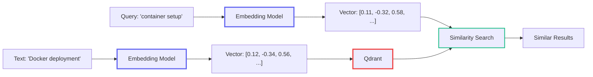
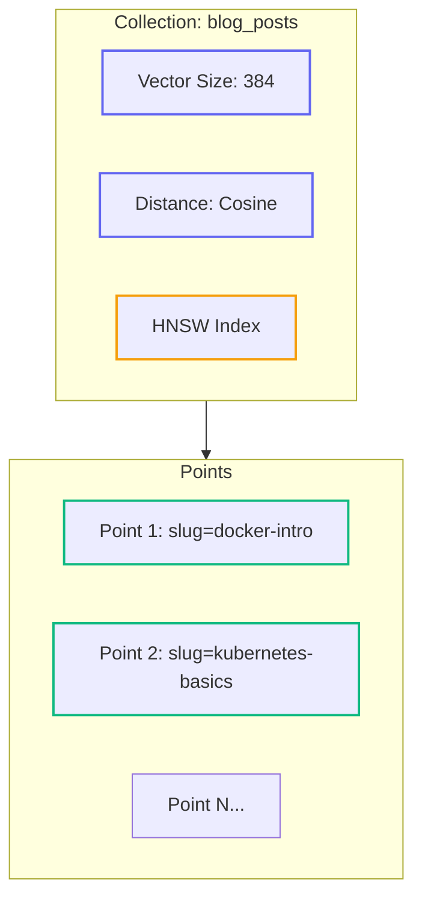
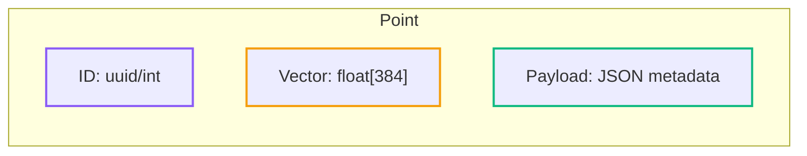
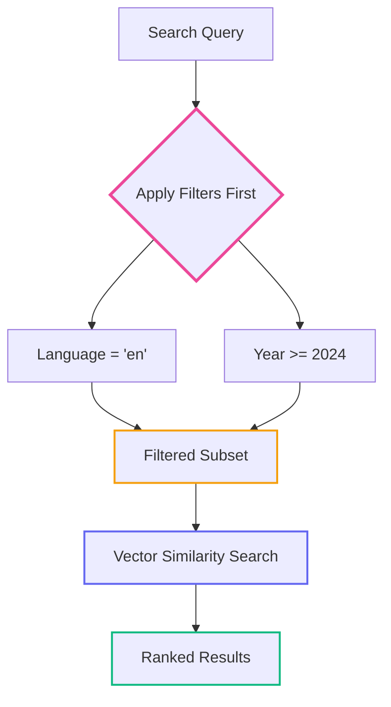
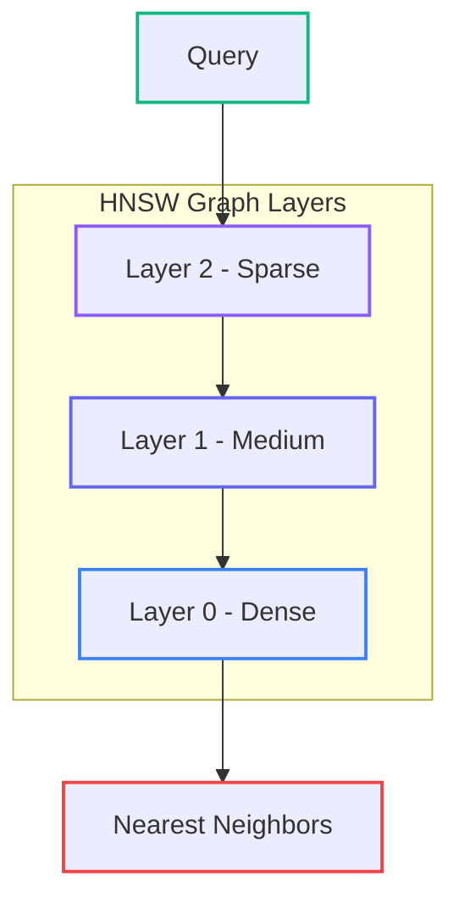

# Self-Hosted Vector Databases with Qdrant: A Deep Dive

<datetime class="hidden">2025-11-22T13:00</datetime>
<!-- category -- ASP.NET, Semantic Search, Vector Databases, Qdrant, RAG, AI-Article -->

# Introduction

**📖 Related to the RAG Series:** This article provides a deep dive into Qdrant, the vector database used in:
- [Part 4: ONNX & Qdrant Implementation](/blog/semantic-search-with-onnx-and-qdrant) - Building semantic search
- [Part 5: Hybrid Search & Auto-Indexing](/blog/rag-hybrid-search-and-indexing) - Production integration

[Qdrant](https://qdrant.tech/) (pronounced "quadrant") is an open-source vector database built in Rust. This article covers core concepts, the C# client, performance tuning, and production patterns.

[TOC]

# What is Qdrant?

A [vector database](https://qdrant.tech/documentation/overview/) stores high-dimensional vectors (embeddings) and enables fast similarity search. Unlike traditional databases that find exact matches, Qdrant finds *semantically similar* items.



**Key Qdrant features:**
- [HNSW indexing](https://qdrant.tech/documentation/concepts/indexing/) - Sub-linear search times
- [Filtering](https://qdrant.tech/documentation/concepts/filtering/) - Combine similarity search with metadata filters
- [gRPC & REST APIs](https://qdrant.tech/documentation/interfaces/) - High-performance access
- [Distributed deployment](https://qdrant.tech/documentation/guides/distributed_deployment/) - Scale horizontally
- [Snapshots](https://qdrant.tech/documentation/concepts/snapshots/) - Backup and restore

# Core Concepts

## Collections

A [collection](https://qdrant.tech/documentation/concepts/collections/) is like a table - it holds vectors with a fixed dimensionality and distance metric.



```csharp
// Create collection - see https://qdrant.tech/documentation/concepts/collections/#create-a-collection
await client.CreateCollectionAsync(
    collectionName: "blog_posts",
    vectorsConfig: new VectorParams
    {
        Size = 384,              // Must match your embedding model
        Distance = Distance.Cosine  // Best for text embeddings
    }
);
```

**Distance metrics** ([docs](https://qdrant.tech/documentation/concepts/collections/#distance-metrics)):
- **Cosine** - Measures angle between vectors (best for text)
- **Dot** - Raw inner product (for pre-normalized vectors)
- **Euclid** - Geometric distance (for spatial data)

## Points

A [point](https://qdrant.tech/documentation/concepts/points/) is a single record containing:



```csharp
// Upsert points - see https://qdrant.tech/documentation/concepts/points/#upload-points
var point = new PointStruct
{
    Id = new PointId { Uuid = Guid.NewGuid().ToString() },
    Vectors = embedding,  // float[384]
    Payload =
    {
        ["slug"] = "my-post",
        ["title"] = "Vector Databases",
        ["language"] = "en",
        ["categories"] = new[] { "AI", "Databases" },
        ["published"] = DateTimeOffset.UtcNow.ToUnixTimeSeconds()
    }
};

await client.UpsertAsync("blog_posts", points: new[] { point });
```

## Filtering

[Filtering](https://qdrant.tech/documentation/concepts/filtering/) runs *before* similarity search - extremely efficient.



```csharp
// Filter conditions - see https://qdrant.tech/documentation/concepts/filtering/#filtering-conditions
var filter = new Filter
{
    Must =  // AND conditions
    {
        new Condition { Field = new FieldCondition
        {
            Key = "language",
            Match = new Match { Keyword = "en" }
        }},
        new Condition { Field = new FieldCondition
        {
            Key = "published",
            Range = new Range { Gte = 1704067200 }  // 2024-01-01
        }}
    },
    MustNot =  // Exclude conditions
    {
        new Condition { Field = new FieldCondition
        {
            Key = "slug",
            Match = new Match { Keyword = "draft-post" }
        }}
    }
};
```

**Filter types** ([docs](https://qdrant.tech/documentation/concepts/filtering/#match)):
- `Match.Keyword` - Exact string match
- `Match.Text` - Full-text match
- `Match.Any` - Match any in array
- `Range` - Numeric ranges (Gte, Lte, Gt, Lt)
- `GeoBoundingBox` / `GeoRadius` - Geo filtering

# The C# Client

Install the official [Qdrant.Client](https://www.nuget.org/packages/Qdrant.Client) package ([GitHub](https://github.com/qdrant/qdrant-dotnet)):

```bash
dotnet add package Qdrant.Client
```

## Connection Setup

```csharp
using Qdrant.Client;
using Qdrant.Client.Grpc;

// gRPC client (recommended) - see https://qdrant.tech/documentation/interfaces/#grpc-interface
var client = new QdrantClient(
    host: "localhost",
    port: 6334,  // gRPC port (6333 is REST)
    https: false
);

// With API key - see https://qdrant.tech/documentation/guides/security/
var secureClient = new QdrantClient(
    host: "your-qdrant.cloud",
    port: 6334,
    https: true,
    apiKey: "your-api-key"
);
```

> **Always use gRPC** (port 6334) for production - 3-5x faster than REST.

## Windows HTTP/2 Fix

On Windows, enable unencrypted HTTP/2 **before** creating the client:

```csharp
AppContext.SetSwitch("System.Net.Http.SocketsHttpHandler.Http2UnencryptedSupport", true);
```

## Key Operations

### Search

```csharp
// Vector search - see https://qdrant.tech/documentation/concepts/search/
var results = await client.SearchAsync(
    collectionName: "blog_posts",
    vector: queryEmbedding,
    limit: 10,
    filter: filter,
    scoreThreshold: 0.5f,  // Minimum similarity
    searchParams: new SearchParams
    {
        HnswEf = 128,  // Search accuracy (higher = better recall)
        Exact = false  // Use approximate search
    },
    withPayload: true
);

foreach (var result in results)
{
    Console.WriteLine($"{result.Payload["title"].StringValue}: {result.Score}");
}
```

### Batch Upsert

```csharp
// Batch operations - see https://qdrant.tech/documentation/concepts/points/#batch-update
var points = documents.Select(doc => new PointStruct
{
    Id = new PointId { Uuid = doc.Id },
    Vectors = doc.Embedding,
    Payload = { ["slug"] = doc.Slug, ["title"] = doc.Title }
}).ToList();

await client.UpsertAsync(
    collectionName: "blog_posts",
    points: points,
    wait: true  // Wait for indexing
);
```

### Delete

```csharp
// Delete by filter - see https://qdrant.tech/documentation/concepts/points/#delete-points
await client.DeleteAsync(
    collectionName: "blog_posts",
    filter: new Filter
    {
        Must = { new Condition { Field = new FieldCondition
        {
            Key = "slug",
            Match = new Match { Keyword = "old-post" }
        }}}
    }
);
```

# HNSW Index Tuning

[HNSW](https://qdrant.tech/documentation/concepts/indexing/#vector-index) (Hierarchical Navigable Small World) is Qdrant's index algorithm.



## Index Parameters

```csharp
// HNSW config - see https://qdrant.tech/documentation/concepts/indexing/#hnsw-index
var hnswConfig = new HnswConfigDiff
{
    M = 16,              // Edges per node (16-32 recommended)
    EfConstruct = 100,   // Build-time accuracy (100-200)
    FullScanThreshold = 10000  // Brute force threshold
};

await client.UpdateCollectionAsync(
    collectionName: "blog_posts",
    hnswConfig: hnswConfig
);
```

**Search-time accuracy:**
```csharp
var searchParams = new SearchParams
{
    HnswEf = 128  // Higher = better recall, slower (64-256)
};
```

**Tuning guidelines:**
| Use Case | M | EfConstruct | HnswEf |
|----------|---|-------------|--------|
| Fast, low recall | 8 | 64 | 32 |
| Balanced | 16 | 100 | 128 |
| High recall | 32 | 200 | 256 |

# Payload Indexes

Create [payload indexes](https://qdrant.tech/documentation/concepts/indexing/#payload-index) for frequently filtered fields:

```csharp
// Keyword index - see https://qdrant.tech/documentation/concepts/indexing/#payload-index
await client.CreatePayloadIndexAsync(
    collectionName: "blog_posts",
    fieldName: "language",
    schemaType: PayloadSchemaType.Keyword
);

// Integer index for ranges
await client.CreatePayloadIndexAsync(
    collectionName: "blog_posts",
    fieldName: "published",
    schemaType: PayloadSchemaType.Integer
);
```

**Impact:** 10-100x faster filtering on large collections.

# Quantization

[Quantization](https://qdrant.tech/documentation/guides/quantization/) reduces memory usage:

```csharp
// Scalar quantization - see https://qdrant.tech/documentation/guides/quantization/#scalar-quantization
await client.UpdateCollectionAsync(
    collectionName: "blog_posts",
    quantizationConfig: new ScalarQuantization
    {
        Scalar = new ScalarQuantizationConfig
        {
            Type = ScalarType.Int8,  // float32 -> int8
            Quantile = 0.99f,
            AlwaysRam = true
        }
    }
);
```

**Trade-off:** 4x less memory, ~2% recall loss, 1.5x faster search.

# Docker Deployment

```yaml
# docker-compose.yml - see https://qdrant.tech/documentation/guides/installation/
services:
  qdrant:
    image: qdrant/qdrant:v1.12.1  # Pin version!
    ports:
      - "6333:6333"  # REST
      - "6334:6334"  # gRPC
    volumes:
      - qdrant_data:/qdrant/storage
    environment:
      - QDRANT__SERVICE__GRPC_PORT=6334
      - QDRANT__SERVICE__HTTP_PORT=6333
    healthcheck:
      test: ["CMD", "curl", "-f", "http://localhost:6333/health"]
      interval: 30s
      timeout: 10s
      retries: 3

volumes:
  qdrant_data:
```

## Security

Enable [API key authentication](https://qdrant.tech/documentation/guides/security/):

```yaml
environment:
  - QDRANT__SERVICE__API_KEY=your-secret-key
```

# Monitoring

## Metrics

Qdrant exposes [Prometheus metrics](https://qdrant.tech/documentation/guides/monitoring/) at `/metrics`:

```bash
curl http://localhost:6333/metrics
```

Key metrics:
- `qdrant_collections_vector_count` - Total vectors
- `qdrant_rest_responses_duration_seconds` - Query latency
- `qdrant_memory_usage_bytes` - Memory consumption

## Snapshots

Create [backups](https://qdrant.tech/documentation/concepts/snapshots/):

```bash
# Create snapshot
curl -X POST http://localhost:6333/collections/blog_posts/snapshots

# List snapshots
curl http://localhost:6333/collections/blog_posts/snapshots

# Restore (copy snapshot to storage/collections/blog_posts/snapshots/)
```

# Common Gotchas

## 1. Port Confusion
- **6333** = REST API
- **6334** = gRPC API (use this!)

## 2. Vector Dimension Mismatch
```
Error: expected dim: 384, got 768
```
Your embedding model and collection must match:
- `all-MiniLM-L6-v2`: 384 dimensions
- `nomic-embed-text`: 768 dimensions
- OpenAI `text-embedding-3-small`: 1536 dimensions

## 3. Slow First Query
HNSW lazy-loads into memory. Warm up after startup:
```csharp
await client.SearchAsync("blog_posts", new float[384], limit: 1);
```

## 4. Array Filtering
Use `Match.Any` for array fields:
```csharp
new Match { Any = new RepeatedStrings { Strings = { "AI", "ML" } } }
```

# Resources

## Official Qdrant Documentation
- [Overview](https://qdrant.tech/documentation/overview/) - Getting started
- [Concepts](https://qdrant.tech/documentation/concepts/) - Core concepts
- [Collections](https://qdrant.tech/documentation/concepts/collections/) - Creating and managing collections
- [Points](https://qdrant.tech/documentation/concepts/points/) - Working with vectors
- [Search](https://qdrant.tech/documentation/concepts/search/) - Query operations
- [Filtering](https://qdrant.tech/documentation/concepts/filtering/) - Filter conditions
- [Indexing](https://qdrant.tech/documentation/concepts/indexing/) - HNSW and payload indexes
- [Quantization](https://qdrant.tech/documentation/guides/quantization/) - Memory optimization
- [Security](https://qdrant.tech/documentation/guides/security/) - Authentication
- [Monitoring](https://qdrant.tech/documentation/guides/monitoring/) - Metrics and telemetry
- [Snapshots](https://qdrant.tech/documentation/concepts/snapshots/) - Backup and restore

## Client Libraries
- [Qdrant .NET Client](https://github.com/qdrant/qdrant-dotnet) - Official C# SDK
- [NuGet Package](https://www.nuget.org/packages/Qdrant.Client) - Latest release

## Related Articles
- [Part 4: ONNX & Qdrant Implementation](/blog/semantic-search-with-onnx-and-qdrant)
- [Part 5: Hybrid Search & Auto-Indexing](/blog/rag-hybrid-search-and-indexing)
- [RAG Series Overview](/blog/rag-primer)

## Source Code
All code available at: [github.com/scottgal/mostlylucidweb](https://github.com/scottgal/mostlylucidweb)
- `Mostlylucid.SemanticSearch/Services/QdrantVectorStoreService.cs` - Qdrant integration
