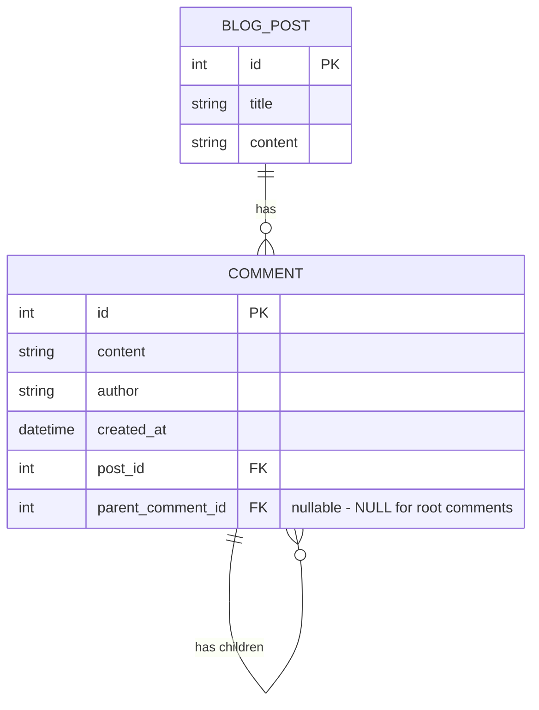
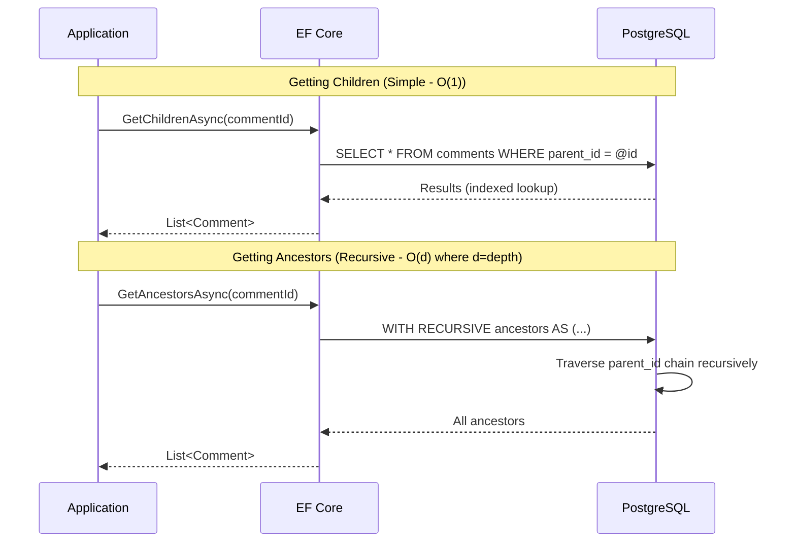

# Data Hierarchies Part 1.1: Adjacency List with EF Core

<!--category-- Entity Framework, PostgreSQL, EF Hierarchies -->
<datetime class="hidden">2025-12-06T09:10</datetime>

The adjacency list is the simplest and most intuitive approach to storing hierarchical data - each row just points to its parent. It's what most developers reach for first, and for shallow trees with frequent moves, it's often the right choice. This article covers the implementation details, including recursive CTEs for traversing the tree and building nested structures for UI display.

## Series Navigation

- [Part 1: Overview](/blog/efcore-hierarchical-data) - Introduction and comparison
- **Part 1.1: Adjacency List** (this article)
- [Part 1.2: Closure Table](/blog/efcore-hierarchical-data-closure)
- [Part 1.3: Materialised Path](/blog/efcore-hierarchical-data-path)
- [Part 1.4: Nested Sets](/blog/efcore-hierarchical-data-nested)
- [Part 1.5: ltree](/blog/efcore-hierarchical-data-ltree)

---

## What is an Adjacency List?

The adjacency list model (a term coined by [Joe Celko](https://www.amazon.com/Hierarchies-Smarties-Kaufmann-Management-Systems/dp/0123877334)) is the approach most developers reach for first, and with good reason - it's intuitive. Each node simply stores a reference to its parent. If you've ever drawn a family tree, you've already understood this pattern.

The key characteristic: **each row only knows about its immediate parent**. To find grandparents or grandchildren, you need multiple lookups or recursive queries.

This is the most commonly documented pattern and is well supported by [EF Core's self-referencing relationships](https://learn.microsoft.com/en-us/ef/core/modeling/relationships).

[TOC]

## Entity Definition

The entity is remarkably simple - we just add a nullable self-reference:

```csharp
public class Comment
{
    public int Id { get; set; }
    public string Content { get; set; } = string.Empty;
    public string Author { get; set; } = string.Empty;
    public DateTime CreatedAt { get; set; }

    // Foreign key - which blog post this comment belongs to
    public int PostId { get; set; }
    public BlogPost Post { get; set; } = null!;

    // ========== ADJACENCY LIST: The hierarchy is defined by these three properties ==========

    // ParentCommentId is nullable because:
    // - Root-level comments (direct replies to the post) have NULL
    // - Nested replies have the ID of the comment they're replying to
    public int? ParentCommentId { get; set; }

    // Navigation property to load the parent comment when needed
    // Useful for breadcrumb trails: "Post > Comment by Alice > Comment by Bob"
    public Comment? ParentComment { get; set; }

    // Navigation property to load immediate children (NOT grandchildren!)
    // EF Core populates this when you use .Include(c => c.Children)
    // NOTE: This only gives you ONE level deep - you won't see replies to replies
    public ICollection<Comment> Children { get; set; } = new List<Comment>();
}
```

## EF Core Configuration

The configuration sets up the self-referencing relationship and crucially adds indexes for the queries we'll run most often:

```csharp
public class CommentConfiguration : IEntityTypeConfiguration<Comment>
{
    public void Configure(EntityTypeBuilder<Comment> builder)
    {
        builder.HasKey(c => c.Id);

        builder.Property(c => c.Content)
            .IsRequired()
            .HasMaxLength(10000);

        builder.Property(c => c.Author)
            .IsRequired()
            .HasMaxLength(200);

        // Standard relationship: comment belongs to a blog post
        // Cascade delete here is safe - deleting a post should remove all its comments
        builder.HasOne(c => c.Post)
            .WithMany(p => p.Comments)
            .HasForeignKey(c => c.PostId)
            .OnDelete(DeleteBehavior.Cascade);

        // ========== THE SELF-REFERENCING RELATIONSHIP ==========
        // This is what makes it an adjacency list - each comment points to its parent

        builder.HasOne(c => c.ParentComment)
            .WithMany(c => c.Children)           // One parent has many children
            .HasForeignKey(c => c.ParentCommentId)
            .OnDelete(DeleteBehavior.Restrict);  // WARNING: Don't use Cascade here!

        // Why Restrict and not Cascade?
        // With Cascade, deleting a parent would automatically delete ALL children,
        // grandchildren, etc. This can be:
        // 1. Unexpected behaviour for users
        // 2. A database performance issue (many deletes)
        // 3. A data integrity risk (accidental mass deletion)
        // Better to handle subtree deletion explicitly in application code

        // ========== INDEXES: Critical for performance ==========

        // Index on ParentCommentId - used when loading children
        // "SELECT * FROM comments WHERE parent_comment_id = @id"
        builder.HasIndex(c => c.ParentCommentId);

        // Index on PostId - used when loading all comments for a post
        // "SELECT * FROM comments WHERE post_id = @id"
        builder.HasIndex(c => c.PostId);

        // Composite index for the most common query:
        // "Get all comments for a post, ordered by creation date"
        builder.HasIndex(c => new { c.PostId, c.CreatedAt });
    }
}
```

## Database Schema

The resulting schema is minimal - just one self-referencing foreign key:



## Operations

### Insert a New Comment

Inserts are beautifully simple - the adjacency list pattern really shines here:

```csharp
public async Task<Comment> AddCommentAsync(
    int postId,
    int? parentId,      // NULL for root comment, parent's ID for a reply
    string author,
    string content,
    CancellationToken ct = default)
{
    // Creating a comment is just setting the parent reference
    // No need to update closure tables, recalculate paths, or renumber anything
    var comment = new Comment
    {
        PostId = postId,
        ParentCommentId = parentId,  // This single reference defines the hierarchy
        Author = author,
        Content = content,
        CreatedAt = DateTime.UtcNow
    };

    context.Comments.Add(comment);
    await context.SaveChangesAsync(ct);

    logger.LogInformation("Added comment {CommentId} to post {PostId}", comment.Id, postId);
    return comment;
}
```

### Get Immediate Children

Single indexed query - fast and simple:

```csharp
public async Task<List<Comment>> GetChildrenAsync(int commentId, CancellationToken ct = default)
{
    // This is WHERE adjacency lists shine - getting children is trivial
    // Single indexed lookup: WHERE parent_comment_id = @id
    return await context.Comments
        .AsNoTracking()                              // Read-only, no tracking overhead
        .Where(c => c.ParentCommentId == commentId)  // Uses the index we defined
        .OrderBy(c => c.CreatedAt)                   // Chronological order
        .ToListAsync(ct);
}
```

### Get Ancestors (The Hard Part)

Here's where adjacency lists show their weakness. Without recursive queries, you'd have to do multiple round trips: get parent, get parent's parent, get grandparent... and so on.

Thankfully, PostgreSQL's [recursive CTEs (WITH RECURSIVE)](https://www.postgresql.org/docs/current/queries-with.html#QUERIES-WITH-RECURSIVE) come to the rescue:

```csharp
public async Task<List<Comment>> GetAncestorsAsync(int commentId, CancellationToken ct = default)
{
    // WHY RAW SQL?
    // EF Core doesn't have great support for recursive CTEs
    // We need to drop down to raw SQL for this

    // HOW THE CTE WORKS:
    // 1. Start with the target comment (WHERE id = {0})
    // 2. UNION ALL joins each result with its parent (JOIN on parent_comment_id)
    // 3. PostgreSQL keeps doing this until no more parents are found
    // 4. We exclude the starting comment (WHERE id != {0}) to get only ancestors

    var sql = @"
        WITH RECURSIVE ancestors AS (
            -- Base case: start with our target comment
            SELECT * FROM comments WHERE id = {0}

            UNION ALL

            -- Recursive case: join each result with its parent
            SELECT c.*
            FROM comments c
            INNER JOIN ancestors a ON c.id = a.parent_comment_id
        )
        -- Return all ancestors except the starting comment, in ID order (root first)
        SELECT * FROM ancestors WHERE id != {0}
        ORDER BY id";

    return await context.Comments
        .FromSqlRaw(sql, commentId)
        .AsNoTracking()
        .ToListAsync(ct);
}
```

### Get Entire Subtree with Depth

Also requires a recursive CTE, but this time we track the depth as we go:

```csharp
public async Task<List<CommentWithDepth>> GetDescendantsWithDepthAsync(
    int commentId,
    CancellationToken ct = default)
{
    // Similar to ancestors, but we go DOWN the tree instead of UP
    // We also track depth so we know how to indent in the UI

    var sql = @"
        WITH RECURSIVE descendants AS (
            -- Base case: start with our target comment at depth 0
            SELECT *, 0 as depth FROM comments WHERE id = {0}

            UNION ALL

            -- Recursive case: find children of each result, incrementing depth
            SELECT c.*, d.depth + 1
            FROM comments c
            INNER JOIN descendants d ON c.parent_comment_id = d.id
        )
        -- Return all descendants, ordered for display
        -- depth first, then by creation time within each level
        SELECT id, content, author, created_at, post_id, parent_comment_id, depth
        FROM descendants
        WHERE id != {0}
        ORDER BY depth, created_at";

    // Note: We need a special DTO to capture the depth column
    // EF Core's FromSqlRaw won't automatically map extra columns to entity properties
    return await context.Database
        .SqlQueryRaw<CommentWithDepth>(sql, commentId)
        .ToListAsync(ct);
}

// DTO to hold comment data plus computed depth
public class CommentWithDepth
{
    public int Id { get; set; }
    public string Content { get; set; } = string.Empty;
    public string Author { get; set; } = string.Empty;
    public DateTime CreatedAt { get; set; }
    public int PostId { get; set; }
    public int? ParentCommentId { get; set; }
    public int Depth { get; set; }  // Computed by the CTE
}
```

### Building a Nested Tree Structure for UI

Often what you actually need for rendering is a tree structure, not a flat list. Here's how to build one efficiently:

```csharp
public async Task<List<CommentTreeNode>> GetCommentTreeAsync(int postId, CancellationToken ct = default)
{
    // STRATEGY:
    // 1. Load ALL comments for the post in a single query (fast, one round trip)
    // 2. Build the tree structure in memory (also fast, just pointer manipulation)

    // Step 1: Get all comments for this post
    var allComments = await context.Comments
        .AsNoTracking()
        .Where(c => c.PostId == postId)
        .OrderBy(c => c.CreatedAt)  // Consistent ordering
        .ToListAsync(ct);

    // Step 2: Create a lookup by parent ID
    // This gives us O(1) access to children of any comment
    var lookup = allComments.ToLookup(c => c.ParentCommentId);

    // Step 3: Build the tree starting from root comments (ParentCommentId = null)
    return BuildTree(lookup, null);
}

private List<CommentTreeNode> BuildTree(
    ILookup<int?, Comment> lookup,
    int? parentId)
{
    // Recursively build tree nodes
    // lookup[parentId] gives us all comments whose parent is 'parentId'
    return lookup[parentId]
        .Select(c => new CommentTreeNode
        {
            Comment = c,
            Children = BuildTree(lookup, c.Id)  // Recurse to get children
        })
        .ToList();
}

public class CommentTreeNode
{
    public Comment Comment { get; set; } = null!;
    public List<CommentTreeNode> Children { get; set; } = new();

    // Convenience property for UI
    public bool HasChildren => Children.Count > 0;
}
```

### Delete a Subtree

Deleting requires finding all descendants first:

```csharp
public async Task DeleteSubtreeAsync(int commentId, CancellationToken ct = default)
{
    // We need to find and delete all descendants, then the comment itself
    // Using a CTE to get all IDs, then bulk delete

    var sql = @"
        WITH RECURSIVE subtree AS (
            SELECT id FROM comments WHERE id = {0}
            UNION ALL
            SELECT c.id FROM comments c
            INNER JOIN subtree s ON c.parent_comment_id = s.id
        )
        DELETE FROM comments WHERE id IN (SELECT id FROM subtree)";

    var deleted = await context.Database.ExecuteSqlRawAsync(sql, new object[] { commentId }, ct);

    logger.LogInformation("Deleted {Count} comments in subtree rooted at {CommentId}",
        deleted, commentId);
}
```

### Move a Subtree

This is where adjacency lists really shine - moving is trivial:

```csharp
public async Task MoveSubtreeAsync(
    int commentId,
    int newParentId,
    CancellationToken ct = default)
{
    // In adjacency list, moving a subtree is just updating ONE row!
    // All descendants automatically move with their parent because
    // their ParentCommentId still points to their direct parent

    var comment = await context.Comments.FindAsync(new object[] { commentId }, ct);
    if (comment == null)
    {
        throw new InvalidOperationException($"Comment {commentId} not found");
    }

    // Prevent creating a cycle (moving a node under its own descendant)
    // This would create an infinite loop in our tree
    var ancestors = await GetAncestorsAsync(newParentId, ct);
    if (ancestors.Any(a => a.Id == commentId))
    {
        throw new InvalidOperationException("Cannot move a comment under its own descendant");
    }

    comment.ParentCommentId = newParentId;
    await context.SaveChangesAsync(ct);

    logger.LogInformation("Moved comment {CommentId} to new parent {NewParentId}",
        commentId, newParentId);
}
```

## Query Flow Visualisation



## Performance Characteristics

| Operation | Complexity | Database Round Trips | Notes |
|-----------|------------|---------------------|-------|
| Insert | O(1) | 1 | Just set ParentCommentId |
| Get children | O(1) | 1 | Indexed lookup |
| Get ancestors | O(d) | 1 (with CTE) | d = depth, CTE does work in DB |
| Get subtree | O(n) | 1 (with CTE) | n = subtree size |
| Move subtree | O(1) | 1 | Just update one row |
| Delete subtree | O(n) | 1 (with CTE) | n = subtree size |

## Pros and Cons

| Pros | Cons |
|------|------|
| Simple to understand and implement | Getting ancestors/descendants requires recursive queries |
| Minimal storage overhead (just one extra column) | Recursive CTEs can be slow on very deep trees |
| Moving a subtree is trivial (update one row) | No easy way to get depth without traversing |
| EF Core navigation properties work naturally | Can't easily count descendants without loading them |
| No data redundancy to maintain | Repeated queries for N+1 problems if not careful |

## When to Use Adjacency List

**Choose Adjacency List when:**
- Your hierarchy is shallow (fewer than 5-6 levels)
- You frequently move subtrees
- You want EF Core's navigation properties to work naturally
- Simple requirements where recursive CTEs are acceptable
- Insert performance is more important than read performance

**Avoid Adjacency List when:**
- You have deep hierarchies (10+ levels)
- You frequently query "all descendants" or "all ancestors"
- Read performance is critical
- You need to count descendants without loading them

## Series Navigation

- [Part 1: Overview](/blog/efcore-hierarchical-data)
- **Part 1.1: Adjacency List** (this article)
- [Part 1.2: Closure Table](/blog/efcore-hierarchical-data-closure)
- [Part 1.3: Materialised Path](/blog/efcore-hierarchical-data-path)
- [Part 1.4: Nested Sets](/blog/efcore-hierarchical-data-nested)
- [Part 1.5: ltree](/blog/efcore-hierarchical-data-ltree)
