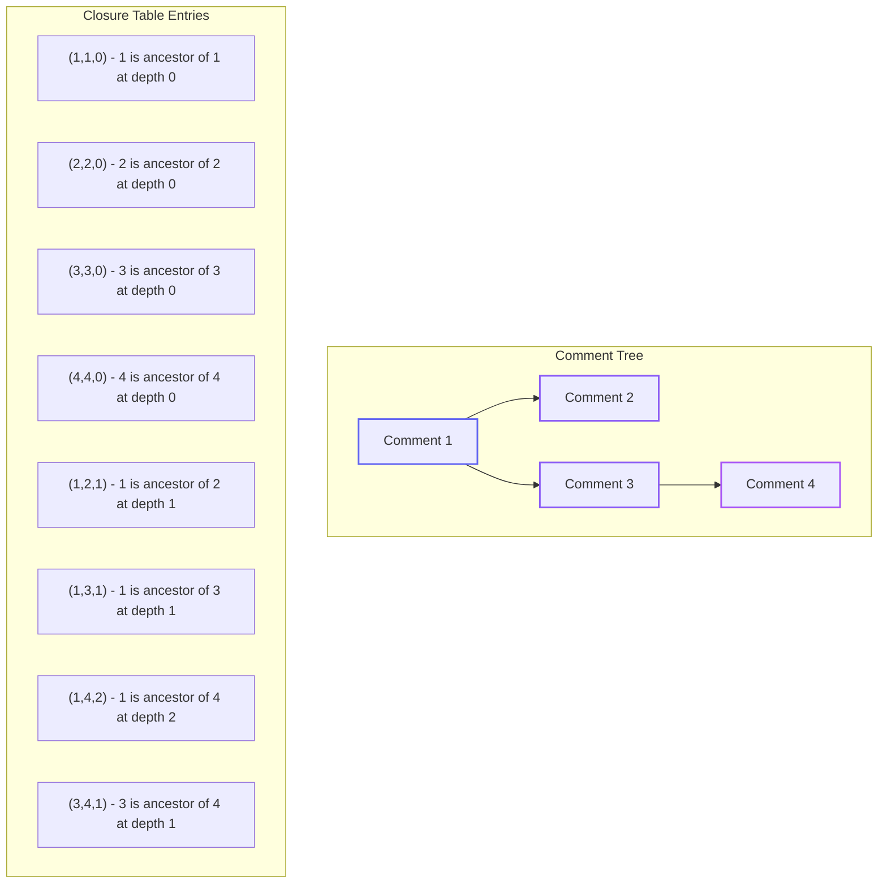
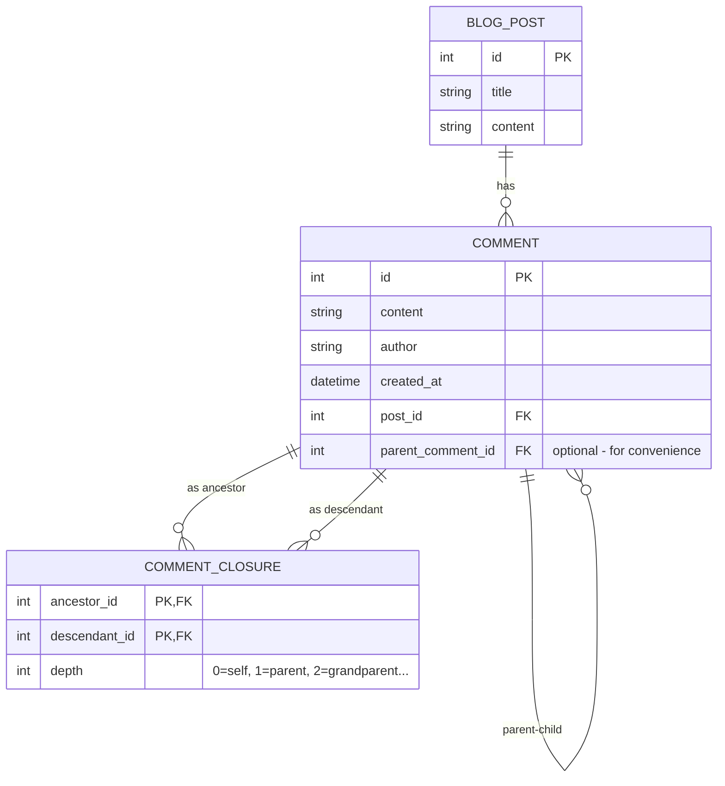
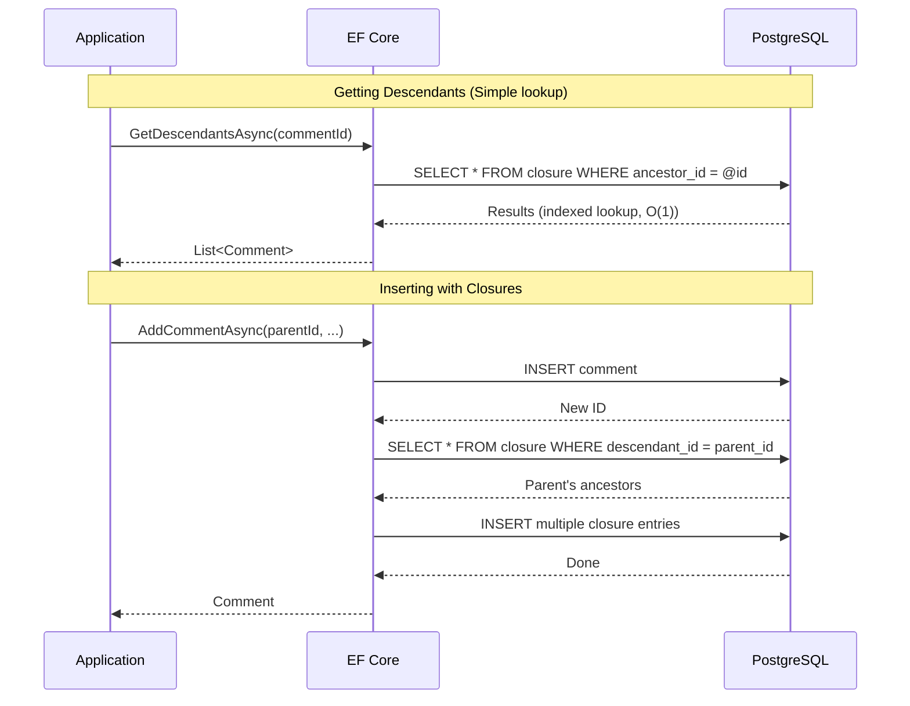

# Data Hierarchies Part 1.2: Closure Table with EF Core

<!--category-- Entity Framework, PostgreSQL, EF Hierarchies -->
<datetime class="hidden">2025-12-06T09:20</datetime>

Closure tables precompute and store every ancestor-descendant relationship, trading storage space for blazing-fast reads. This is the approach this blog uses for its comment system - when reads vastly outnumber writes, the extra insert complexity pays off with O(1) queries for ancestors, descendants, and depth-limited subtrees.

## Series Navigation

- [Part 1: Overview](/blog/efcore-hierarchical-data) - Introduction and comparison
- [Part 1.1: Adjacency List](/blog/efcore-hierarchical-data-adjacency)
- **Part 1.2: Closure Table** (this article)
- [Part 1.3: Materialised Path](/blog/efcore-hierarchical-data-path)
- [Part 1.4: Nested Sets](/blog/efcore-hierarchical-data-nested)
- [Part 1.5: ltree](/blog/efcore-hierarchical-data-ltree)

---

## What is a Closure Table?

A Closure Table (also known as a "transitive closure" - see [Joe Celko's Trees and Hierarchies in SQL](https://www.amazon.com/Hierarchies-Smarties-Kaufmann-Management-Systems/dp/0123877334) for a comprehensive treatment) is a separate table that **precomputes and stores every ancestor-descendant relationship** in your hierarchy. Instead of figuring out "who are the ancestors of Comment 7?" at query time by traversing up the tree, we've already stored the answer: rows that say (1, 7), (3, 7), (7, 7) meaning "Comments 1, 3, and 7 are all ancestors of Comment 7" (with 7 being an ancestor of itself at depth 0).

The key insight: **we trade storage space and write complexity for blazing-fast reads**. Getting ancestors or descendants becomes a simple indexed lookup instead of a recursive traversal.

This is the approach this very blog uses for its comment system - when you load comments on a post, we can fetch the entire threaded structure with efficient queries.

[TOC]

## The Closure Table Concept

Every pair of nodes that are related (ancestor to descendant) gets a row in the closure table. Crucially, we also store the **depth** - how many hops apart they are.



Notice:
- **Every node is its own ancestor at depth 0** (the self-referential entries). This simplifies queries.
- Comment 4 has THREE closure entries: to itself (0), to Comment 3 (1), and to Comment 1 (2)
- To find all ancestors of Comment 4: `WHERE descendant_id = 4`
- To find all descendants of Comment 1: `WHERE ancestor_id = 1`

## Entity Definitions

We need two entities: the Comment itself and the Closure entries:

```csharp
public class Comment
{
    public int Id { get; set; }
    public string Content { get; set; } = string.Empty;
    public string Author { get; set; } = string.Empty;
    public DateTime CreatedAt { get; set; }

    // Foreign key - which blog post this comment belongs to
    public int PostId { get; set; }
    public BlogPost Post { get; set; } = null!;

    // ========== CLOSURE TABLE: Relationships stored in separate table ==========

    // We still keep ParentCommentId for convenience - it's useful for:
    // 1. Getting immediate parent without joining closure table
    // 2. Keeping the option to use EF Core navigation properties
    // 3. Human readability when debugging
    public int? ParentCommentId { get; set; }
    public Comment? ParentComment { get; set; }
    public ICollection<Comment> Children { get; set; } = new List<Comment>();

    // Navigation to the closure entries (optional - sometimes useful for eager loading)
    // AncestorClosures: entries where THIS comment is the descendant
    // DescendantClosures: entries where THIS comment is the ancestor
    public ICollection<CommentClosure> AncestorClosures { get; set; } = new List<CommentClosure>();
    public ICollection<CommentClosure> DescendantClosures { get; set; } = new List<CommentClosure>();
}

// The Closure Table entity
// Each row represents: "AncestorId is an ancestor of DescendantId at distance Depth"
public class CommentClosure
{
    // Composite primary key: (AncestorId, DescendantId)
    // This prevents duplicate entries and enables efficient lookups

    public int AncestorId { get; set; }
    public int DescendantId { get; set; }

    // How many levels apart are they?
    // 0 = same node (self-reference)
    // 1 = immediate parent/child
    // 2 = grandparent/grandchild
    // etc.
    public int Depth { get; set; }

    // Navigation properties for joining back to Comments
    public Comment Ancestor { get; set; } = null!;
    public Comment Descendant { get; set; } = null!;
}
```

## EF Core Configuration

The configuration is more involved because we have two entities with multiple relationships:

```csharp
public class CommentConfiguration : IEntityTypeConfiguration<Comment>
{
    public void Configure(EntityTypeBuilder<Comment> builder)
    {
        builder.HasKey(c => c.Id);

        builder.Property(c => c.Content)
            .IsRequired()
            .HasMaxLength(10000);

        builder.Property(c => c.Author)
            .IsRequired()
            .HasMaxLength(200);

        // Relationship to blog post
        builder.HasOne(c => c.Post)
            .WithMany(p => p.Comments)
            .HasForeignKey(c => c.PostId)
            .OnDelete(DeleteBehavior.Cascade);

        // Self-referencing relationship (kept for convenience, not strictly needed)
        builder.HasOne(c => c.ParentComment)
            .WithMany(c => c.Children)
            .HasForeignKey(c => c.ParentCommentId)
            .OnDelete(DeleteBehavior.Restrict);

        // Indexes for common queries
        builder.HasIndex(c => c.PostId);
        builder.HasIndex(c => c.ParentCommentId);
        builder.HasIndex(c => new { c.PostId, c.CreatedAt });
    }
}

public class CommentClosureConfiguration : IEntityTypeConfiguration<CommentClosure>
{
    public void Configure(EntityTypeBuilder<CommentClosure> builder)
    {
        // ========== COMPOSITE PRIMARY KEY ==========
        // The combination of (AncestorId, DescendantId) uniquely identifies each relationship
        // This also creates an implicit index on (AncestorId, DescendantId)
        builder.HasKey(cc => new { cc.AncestorId, cc.DescendantId });

        // ========== RELATIONSHIPS ==========

        // Each closure entry has an Ancestor - the "higher up" comment
        // One Comment can be the ancestor in MANY closure entries
        // (a root comment is ancestor to all its descendants)
        builder.HasOne(cc => cc.Ancestor)
            .WithMany(c => c.DescendantClosures)  // Comment's DescendantClosures = where it's the ancestor
            .HasForeignKey(cc => cc.AncestorId)
            .OnDelete(DeleteBehavior.Cascade);    // Delete closures when comment is deleted

        // Each closure entry has a Descendant - the "lower down" comment
        // One Comment can be the descendant in MANY closure entries
        // (a deeply nested comment has many ancestors)
        builder.HasOne(cc => cc.Descendant)
            .WithMany(c => c.AncestorClosures)    // Comment's AncestorClosures = where it's the descendant
            .HasForeignKey(cc => cc.DescendantId)
            .OnDelete(DeleteBehavior.Cascade);

        // ========== INDEXES ==========

        // Index for "get all descendants of X" queries
        // WHERE ancestor_id = @id
        builder.HasIndex(cc => cc.AncestorId);

        // Index for "get all ancestors of X" queries
        // WHERE descendant_id = @id
        builder.HasIndex(cc => cc.DescendantId);

        // Index for "get immediate children" (depth = 1 queries)
        // WHERE ancestor_id = @id AND depth = 1
        builder.HasIndex(cc => new { cc.AncestorId, cc.Depth });

        // Index for depth-limited queries
        // WHERE ancestor_id = @id AND depth <= @maxDepth
        builder.HasIndex(cc => new { cc.DescendantId, cc.Depth });
    }
}
```

## Database Schema

The resulting schema has two tables:



## Operations

### Insert a New Comment

This is where closure tables require more work than adjacency lists. We must add closure entries for EVERY ancestor:

```csharp
public async Task<Comment> AddCommentAsync(
    int postId,
    int? parentId,
    string author,
    string content,
    CancellationToken ct = default)
{
    // Use a transaction to ensure atomicity
    // We need to insert the comment AND all its closure entries together
    await using var transaction = await context.Database.BeginTransactionAsync(ct);

    try
    {
        // Step 1: Create the comment
        var comment = new Comment
        {
            PostId = postId,
            ParentCommentId = parentId,
            Author = author,
            Content = content,
            CreatedAt = DateTime.UtcNow
        };

        context.Comments.Add(comment);
        await context.SaveChangesAsync(ct);

        // Step 2: Add the self-referencing closure entry
        // EVERY node has a row pointing to itself at depth 0
        // This simplifies queries - "get all ancestors including self" just needs depth >= 0
        var selfClosure = new CommentClosure
        {
            AncestorId = comment.Id,
            DescendantId = comment.Id,
            Depth = 0
        };
        context.Set<CommentClosure>().Add(selfClosure);

        // Step 3: If this is a reply, copy parent's closure entries with depth + 1
        if (parentId.HasValue)
        {
            // Find all ancestors of the parent
            // These become ancestors of our new comment too, but one level deeper
            var parentClosures = await context.Set<CommentClosure>()
                .Where(cc => cc.DescendantId == parentId.Value)
                .ToListAsync(ct);

            // For each ancestor of parent, add a closure to our new comment
            foreach (var parentClosure in parentClosures)
            {
                var newClosure = new CommentClosure
                {
                    AncestorId = parentClosure.AncestorId,  // Same ancestor
                    DescendantId = comment.Id,               // Points to new comment
                    Depth = parentClosure.Depth + 1          // One level deeper
                };
                context.Set<CommentClosure>().Add(newClosure);
            }
        }

        await context.SaveChangesAsync(ct);
        await transaction.CommitAsync(ct);

        logger.LogInformation("Added comment {CommentId} with {ClosureCount} closure entries",
            comment.Id, parentId.HasValue ? "multiple" : "1");

        return comment;
    }
    catch
    {
        await transaction.RollbackAsync(ct);
        throw;
    }
}
```

### Get Immediate Children

Unlike adjacency list where we'd query by ParentCommentId, with closure we query by depth = 1:

```csharp
public async Task<List<Comment>> GetChildrenAsync(int commentId, CancellationToken ct = default)
{
    // Find all descendants at exactly depth 1 (immediate children)
    // The closure table makes this a simple indexed lookup
    return await context.Set<CommentClosure>()
        .AsNoTracking()
        .Where(cc => cc.AncestorId == commentId && cc.Depth == 1)
        .Select(cc => cc.Descendant)  // Navigate to the actual Comment
        .OrderBy(c => c.CreatedAt)
        .ToListAsync(ct);
}
```

### Get All Ancestors

This is where closure tables shine - a single indexed query, no recursion:

```csharp
public async Task<List<Comment>> GetAncestorsAsync(int commentId, CancellationToken ct = default)
{
    // All ancestors = all closure entries where this comment is the descendant
    // Exclude depth 0 (self-reference) unless you want "including self"
    return await context.Set<CommentClosure>()
        .AsNoTracking()
        .Where(cc => cc.DescendantId == commentId && cc.Depth > 0)
        .OrderByDescending(cc => cc.Depth)  // Root ancestor first
        .Select(cc => cc.Ancestor)
        .ToListAsync(ct);
}

// Version that includes the comment itself
public async Task<List<Comment>> GetAncestorsIncludingSelfAsync(int commentId, CancellationToken ct = default)
{
    return await context.Set<CommentClosure>()
        .AsNoTracking()
        .Where(cc => cc.DescendantId == commentId)  // Depth >= 0
        .OrderByDescending(cc => cc.Depth)
        .Select(cc => cc.Ancestor)
        .ToListAsync(ct);
}
```

### Get All Descendants

Equally simple - just flip the query:

```csharp
public async Task<List<Comment>> GetDescendantsAsync(int commentId, CancellationToken ct = default)
{
    // All descendants = all closure entries where this comment is the ancestor
    return await context.Set<CommentClosure>()
        .AsNoTracking()
        .Where(cc => cc.AncestorId == commentId && cc.Depth > 0)
        .OrderBy(cc => cc.Depth)  // Closest descendants first
        .ThenBy(cc => cc.Descendant.CreatedAt)
        .Select(cc => cc.Descendant)
        .ToListAsync(ct);
}
```

### Get Descendants with Depth Limit

A common requirement is to limit nesting depth for performance or UX reasons:

```csharp
public async Task<List<CommentWithDepth>> GetDescendantsToDepthAsync(
    int commentId,
    int maxDepth,
    CancellationToken ct = default)
{
    // The depth column makes this trivial - just add a WHERE clause
    return await context.Set<CommentClosure>()
        .AsNoTracking()
        .Where(cc => cc.AncestorId == commentId
                  && cc.Depth > 0
                  && cc.Depth <= maxDepth)
        .OrderBy(cc => cc.Depth)
        .ThenBy(cc => cc.Descendant.CreatedAt)
        .Select(cc => new CommentWithDepth
        {
            Id = cc.Descendant.Id,
            Content = cc.Descendant.Content,
            Author = cc.Descendant.Author,
            CreatedAt = cc.Descendant.CreatedAt,
            PostId = cc.Descendant.PostId,
            ParentCommentId = cc.Descendant.ParentCommentId,
            Depth = cc.Depth
        })
        .ToListAsync(ct);
}

public class CommentWithDepth
{
    public int Id { get; set; }
    public string Content { get; set; } = string.Empty;
    public string Author { get; set; } = string.Empty;
    public DateTime CreatedAt { get; set; }
    public int PostId { get; set; }
    public int? ParentCommentId { get; set; }
    public int Depth { get; set; }
}
```

### Get Entire Comment Tree for a Post

For displaying all comments on a post with threading structure:

```csharp
public async Task<List<CommentTreeNode>> GetCommentTreeAsync(int postId, CancellationToken ct = default)
{
    // STRATEGY:
    // 1. Get all root comments for this post (no parent)
    // 2. For each root, get its descendants from closure table
    // 3. Build tree structure in memory

    // First, get all comments for the post with their depths relative to root
    var allComments = await context.Comments
        .AsNoTracking()
        .Where(c => c.PostId == postId)
        .ToListAsync(ct);

    if (!allComments.Any())
        return new List<CommentTreeNode>();

    // Get root comment IDs (comments with no parent)
    var rootIds = allComments
        .Where(c => c.ParentCommentId == null)
        .Select(c => c.Id)
        .ToHashSet();

    // Get all closure entries to know the depths
    var closures = await context.Set<CommentClosure>()
        .AsNoTracking()
        .Where(cc => allComments.Select(c => c.Id).Contains(cc.DescendantId)
                  && rootIds.Contains(cc.AncestorId))
        .ToListAsync(ct);

    // Build lookup: comment ID -> its depth under its root ancestor
    var depthLookup = closures
        .GroupBy(cc => cc.DescendantId)
        .ToDictionary(
            g => g.Key,
            g => g.Min(cc => cc.Depth)  // Take minimum depth (from its root)
        );

    // Build the tree
    var lookup = allComments.ToLookup(c => c.ParentCommentId);
    return BuildTree(lookup, null);
}

private List<CommentTreeNode> BuildTree(ILookup<int?, Comment> lookup, int? parentId)
{
    return lookup[parentId]
        .Select(c => new CommentTreeNode
        {
            Comment = c,
            Children = BuildTree(lookup, c.Id)
        })
        .ToList();
}
```

### Delete a Subtree

Closure tables make this straightforward - find all descendants via closure, then delete:

```csharp
public async Task DeleteSubtreeAsync(int commentId, CancellationToken ct = default)
{
    await using var transaction = await context.Database.BeginTransactionAsync(ct);

    try
    {
        // Step 1: Find all descendants (including the comment itself)
        var descendantIds = await context.Set<CommentClosure>()
            .Where(cc => cc.AncestorId == commentId)
            .Select(cc => cc.DescendantId)
            .ToListAsync(ct);

        // Step 2: Delete closure entries for all these nodes
        // This includes both:
        // - Entries where they are descendants (their ancestor relationships)
        // - Entries where they are ancestors (their descendant relationships)
        await context.Set<CommentClosure>()
            .Where(cc => descendantIds.Contains(cc.AncestorId)
                      || descendantIds.Contains(cc.DescendantId))
            .ExecuteDeleteAsync(ct);

        // Step 3: Delete the comments themselves
        await context.Comments
            .Where(c => descendantIds.Contains(c.Id))
            .ExecuteDeleteAsync(ct);

        await transaction.CommitAsync(ct);

        logger.LogInformation("Deleted {Count} comments in subtree rooted at {CommentId}",
            descendantIds.Count, commentId);
    }
    catch
    {
        await transaction.RollbackAsync(ct);
        throw;
    }
}
```

### Move a Subtree

This is where closure tables are expensive. Moving a subtree requires:
1. Delete old closure entries for the subtree
2. Create new closure entries based on new parent

```csharp
public async Task MoveSubtreeAsync(
    int commentId,
    int newParentId,
    CancellationToken ct = default)
{
    await using var transaction = await context.Database.BeginTransactionAsync(ct);

    try
    {
        // Step 1: Get all descendants of the moving subtree (including itself)
        var subtreeIds = await context.Set<CommentClosure>()
            .Where(cc => cc.AncestorId == commentId)
            .Select(cc => cc.DescendantId)
            .ToListAsync(ct);

        // Step 2: Get ancestors of the subtree root (nodes we're disconnecting from)
        var oldAncestorIds = await context.Set<CommentClosure>()
            .Where(cc => cc.DescendantId == commentId && cc.Depth > 0)
            .Select(cc => cc.AncestorId)
            .ToListAsync(ct);

        // Step 3: Prevent cycles - can't move under own descendant
        if (subtreeIds.Contains(newParentId))
        {
            throw new InvalidOperationException("Cannot move a node under its own descendant");
        }

        // Step 4: Delete old ancestor relationships
        // Remove all closure entries that link old ancestors to subtree nodes
        await context.Set<CommentClosure>()
            .Where(cc => oldAncestorIds.Contains(cc.AncestorId)
                      && subtreeIds.Contains(cc.DescendantId))
            .ExecuteDeleteAsync(ct);

        // Step 5: Get new ancestors (ancestors of new parent + new parent itself)
        var newAncestors = await context.Set<CommentClosure>()
            .Where(cc => cc.DescendantId == newParentId)
            .ToListAsync(ct);

        // Step 6: Get current subtree structure (relative depths within subtree)
        var subtreeClosures = await context.Set<CommentClosure>()
            .Where(cc => cc.AncestorId == commentId)
            .ToListAsync(ct);

        // Step 7: Create new closure entries
        // For each new ancestor, link to each subtree node
        var newClosures = new List<CommentClosure>();

        foreach (var ancestorClosure in newAncestors)
        {
            foreach (var subtreeClosure in subtreeClosures)
            {
                // New depth = distance to new parent + 1 + depth within subtree
                newClosures.Add(new CommentClosure
                {
                    AncestorId = ancestorClosure.AncestorId,
                    DescendantId = subtreeClosure.DescendantId,
                    Depth = ancestorClosure.Depth + 1 + subtreeClosure.Depth
                });
            }
        }

        context.Set<CommentClosure>().AddRange(newClosures);

        // Step 8: Update the direct parent reference on the root of moved subtree
        var comment = await context.Comments.FindAsync(new object[] { commentId }, ct);
        if (comment != null)
        {
            comment.ParentCommentId = newParentId;
        }

        await context.SaveChangesAsync(ct);
        await transaction.CommitAsync(ct);

        logger.LogInformation("Moved subtree of {Count} nodes from comment {CommentId} to new parent {NewParentId}",
            subtreeIds.Count, commentId, newParentId);
    }
    catch
    {
        await transaction.RollbackAsync(ct);
        throw;
    }
}
```

## Query Flow Visualisation



## Performance Characteristics

| Operation | Complexity | Database Queries | Notes |
|-----------|------------|------------------|-------|
| Insert | O(d) | 2 | d = depth; one insert + closure creation |
| Get children | O(1) | 1 | Simple indexed WHERE |
| Get ancestors | O(1) | 1 | Simple indexed WHERE |
| Get descendants | O(1) | 1 | Simple indexed WHERE |
| Get to max depth | O(1) | 1 | Add depth filter |
| Move subtree | O(s × d) | Multiple | s = subtree size, d = depth |
| Delete subtree | O(s) | 2 | Find + bulk delete |

## Storage Requirements

The closure table stores O(n × d) rows where n = number of nodes and d = average depth:

- A comment at depth 5 has 6 closure entries (itself + 5 ancestors)
- A tree with 1000 comments at average depth 3 has ~4000 closure rows
- Each closure row is small: just three integers (12 bytes + overhead)

For most blog comment systems, this overhead is negligible compared to the query performance benefits.

## Pros and Cons

| Pros | Cons |
|------|------|
| O(1) ancestor/descendant queries | O(d) insert complexity (depth inserts) |
| Depth-limited queries are trivial | Storage grows with depth (O(n × d) rows) |
| No recursive SQL needed | Moving subtrees is expensive |
| Can query "all at depth N" efficiently | More complex insert logic |
| Works with any SQL database | Two tables to maintain |
| Excellent for read-heavy workloads | Transaction required for inserts |

## When to Use Closure Table

**Choose Closure Table when:**
- You have read-heavy workloads (comments, categories, org charts)
- You need to query at specific depths ("get grandchildren", "limit to 5 levels")
- Moving subtrees is rare
- You can accept slightly slower inserts for much faster reads
- You need the flexibility to query any relationship without recursion

**Avoid Closure Table when:**
- You frequently move subtrees
- Insert performance is critical
- Storage space is severely constrained
- Your hierarchy is very deep (10+ levels) - storage grows significantly
- You rarely need ancestor/descendant queries

## Real-World Usage: This Blog

This blog's comment system uses exactly this pattern. The choice was made because:

1. **Comments are read far more than written** - every page view loads comments, but submissions are infrequent
2. **Depth limiting is important** - we cap comment nesting at 5 levels to prevent deep threads that are hard to read
3. **Breadcrumbs are useful** - showing "replying to [author]..." requires ancestor lookup
4. **Comment moves are extremely rare** - moderators almost never need to reparent comments

The closure table's read performance benefits far outweigh its write complexity for this use case.

## Series Navigation

- [Part 1: Overview](/blog/efcore-hierarchical-data)
- [Part 1.1: Adjacency List](/blog/efcore-hierarchical-data-adjacency)
- **Part 1.2: Closure Table** (this article)
- [Part 1.3: Materialised Path](/blog/efcore-hierarchical-data-path)
- [Part 1.4: Nested Sets](/blog/efcore-hierarchical-data-nested)
- [Part 1.5: ltree](/blog/efcore-hierarchical-data-ltree)
