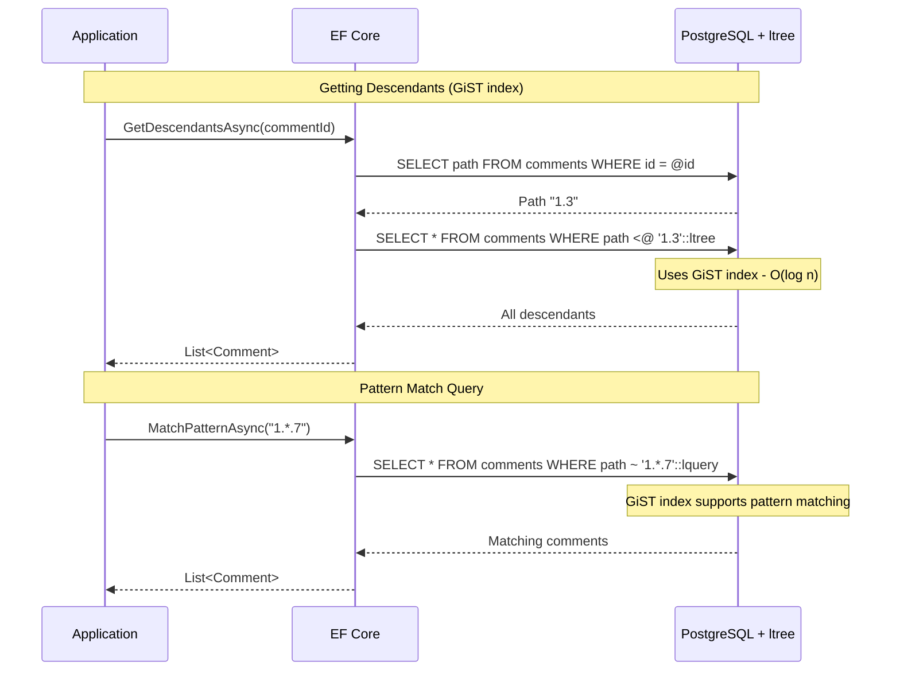

# Data Hierarchies Part 1.5: PostgreSQL ltree with EF Core

<!--category-- Entity Framework, PostgreSQL, EF Hierarchies -->
<datetime class="hidden">2025-12-06T09:50</datetime>

PostgreSQL's ltree extension gives you materialised paths with database-native superpowers: GiST indexes, specialised operators like `@>` and `<@`, and powerful pattern matching. If you're committed to PostgreSQL and want the best hierarchy query performance, ltree is hard to beat - you just need to accept raw SQL for the hierarchy operations.

## Series Navigation

- [Part 1: Overview](/blog/efcore-hierarchical-data) - Introduction and comparison
- [Part 1.1: Adjacency List](/blog/efcore-hierarchical-data-adjacency)
- [Part 1.2: Closure Table](/blog/efcore-hierarchical-data-closure)
- [Part 1.3: Materialised Path](/blog/efcore-hierarchical-data-path)
- [Part 1.4: Nested Sets](/blog/efcore-hierarchical-data-nested)
- **Part 1.5: ltree** (this article)

---

## What is ltree?

[`ltree`](https://www.postgresql.org/docs/current/ltree.html) is a PostgreSQL extension that provides a native data type for hierarchical label paths. Think of it as [Materialised Path](/blog/efcore-hierarchical-data-path) with superpowers - the database understands the structure and provides optimised operators, functions, and GiST index support.

Instead of treating the path as a dumb string and using LIKE queries, PostgreSQL can:
- Use specialised operators (`@>` for "is ancestor of", `<@` for "is descendant of")
- Apply GiST indexes for efficient hierarchy queries
- Match patterns with wildcards (`Top.*.Europe`)
- Perform set operations on paths

**Key insight:** ltree is the best of both worlds - the simplicity of materialised paths with database-native optimisation. The trade-off is PostgreSQL lock-in and requiring raw SQL for hierarchy operations.

[TOC]

## ltree Path Format

Paths in ltree use periods as separators and alphanumeric labels:

```
Top.Countries.Europe.UK
Top.Countries.Asia.Japan.Tokyo
Top.Products.Electronics.Computers.Laptops
```

Rules:
- Labels can contain letters, digits, and underscores
- Labels are case-sensitive
- Maximum label length is 256 characters
- Maximum path length is 65535 labels

For comment systems, we'd use IDs as labels: `1.3.7` meaning "comment 7 under comment 3 under comment 1".

## Setting Up ltree

First, enable the extension (requires database superuser privileges):

```sql
CREATE EXTENSION IF NOT EXISTS ltree;
```

Or via EF Core migration:

```csharp
protected override void Up(MigrationBuilder migrationBuilder)
{
    migrationBuilder.Sql("CREATE EXTENSION IF NOT EXISTS ltree");
}
```

## Entity Definition

```csharp
public class Comment
{
    public int Id { get; set; }
    public string Content { get; set; } = string.Empty;
    public string Author { get; set; } = string.Empty;
    public DateTime CreatedAt { get; set; }

    public int PostId { get; set; }
    public BlogPost Post { get; set; } = null!;

    // ========== LTREE PATH ==========

    // The hierarchical path in ltree format
    // Format: ancestor1.ancestor2.thisNode
    // Examples:
    //   Root comment: "1"
    //   Child of 1: "1.5"
    //   Grandchild: "1.5.12"
    //
    // EF Core stores this as a string, but PostgreSQL treats it as ltree type
    // We'll use raw SQL for hierarchy queries to leverage ltree operators
    public string Path { get; set; } = string.Empty;

    // Keep ParentCommentId for convenience
    public int? ParentCommentId { get; set; }
    public Comment? ParentComment { get; set; }
    public ICollection<Comment> Children { get; set; } = new List<Comment>();

    // ========== HELPER METHODS ==========

    public int GetDepth() => string.IsNullOrEmpty(Path)
        ? 0
        : Path.Split('.').Length - 1;

    public IEnumerable<int> GetAncestorIds()
    {
        if (string.IsNullOrEmpty(Path)) yield break;

        var parts = Path.Split('.');
        // All except last (which is this node)
        for (int i = 0; i < parts.Length - 1; i++)
        {
            if (int.TryParse(parts[i], out var id))
                yield return id;
        }
    }
}
```

## EF Core Configuration

```csharp
public class CommentConfiguration : IEntityTypeConfiguration<Comment>
{
    public void Configure(EntityTypeBuilder<Comment> builder)
    {
        builder.HasKey(c => c.Id);

        builder.Property(c => c.Content)
            .IsRequired()
            .HasMaxLength(10000);

        builder.Property(c => c.Author)
            .IsRequired()
            .HasMaxLength(200);

        // ========== PATH COLUMN ==========
        // Store as string in EF Core, but we'll use raw SQL for ltree operations
        // The database column should be ltree type
        builder.Property(c => c.Path)
            .HasColumnType("ltree")  // Important: specify the PostgreSQL type
            .IsRequired();

        // Relationship to blog post
        builder.HasOne(c => c.Post)
            .WithMany(p => p.Comments)
            .HasForeignKey(c => c.PostId)
            .OnDelete(DeleteBehavior.Cascade);

        // Self-referencing
        builder.HasOne(c => c.ParentComment)
            .WithMany(c => c.Children)
            .HasForeignKey(c => c.ParentCommentId)
            .OnDelete(DeleteBehavior.Restrict);

        // Standard indexes
        builder.HasIndex(c => c.PostId);
        builder.HasIndex(c => c.ParentCommentId);
    }
}
```

Add the GiST index via migration:

```csharp
protected override void Up(MigrationBuilder migrationBuilder)
{
    // GiST index for ltree - enables efficient @>, <@, and ~ operators
    migrationBuilder.Sql(
        "CREATE INDEX ix_comments_path_gist ON comments USING GIST (path)");

    // Alternative: B-tree index for exact match and sorting
    // migrationBuilder.Sql(
    //     "CREATE INDEX ix_comments_path_btree ON comments USING BTREE (path)");
}
```

## ltree Operators

ltree provides powerful operators that we'll use in raw SQL:

| Operator | Meaning | Example |
|----------|---------|---------|
| `@>` | Is ancestor of (contains) | `'1.3'::ltree @> '1.3.7'::ltree` → true |
| `<@` | Is descendant of (contained by) | `'1.3.7'::ltree <@ '1.3'::ltree` → true |
| `~` | Matches lquery pattern | `'1.3.7'::ltree ~ '1.*'::lquery` → true |
| `@` | Matches ltxtquery | `'1.3.7'::ltree @ '3 & 7'::ltxtquery` → true |
| `||` | Concatenate paths | `'1.3'::ltree || '7'::ltree` → '1.3.7' |
| `<`, `>`, `<=`, `>=` | Comparison | For sorting |

## Operations

### Insert a New Comment

```csharp
public async Task<Comment> AddCommentAsync(
    int postId,
    int? parentId,
    string author,
    string content,
    CancellationToken ct = default)
{
    string path;

    if (parentId.HasValue)
    {
        // Get parent's path
        var parentPath = await context.Comments
            .Where(c => c.Id == parentId.Value)
            .Select(c => c.Path)
            .FirstOrDefaultAsync(ct);

        if (parentPath == null)
            throw new InvalidOperationException($"Parent comment {parentId} not found");

        // Create comment first to get the ID
        var comment = new Comment
        {
            PostId = postId,
            ParentCommentId = parentId,
            Author = author,
            Content = content,
            CreatedAt = DateTime.UtcNow,
            Path = string.Empty  // Temporary
        };

        context.Comments.Add(comment);
        await context.SaveChangesAsync(ct);

        // Build path: parentPath.newId
        // ltree uses periods as separators
        comment.Path = $"{parentPath}.{comment.Id}";
        await context.SaveChangesAsync(ct);

        logger.LogInformation("Added comment {CommentId} with ltree path {Path}",
            comment.Id, comment.Path);
        return comment;
    }
    else
    {
        // Root comment - path is just the ID
        var comment = new Comment
        {
            PostId = postId,
            ParentCommentId = null,
            Author = author,
            Content = content,
            CreatedAt = DateTime.UtcNow,
            Path = string.Empty
        };

        context.Comments.Add(comment);
        await context.SaveChangesAsync(ct);

        comment.Path = comment.Id.ToString();
        await context.SaveChangesAsync(ct);

        return comment;
    }
}
```

### Get Immediate Children

Using ParentCommentId (simple) or ltree pattern matching:

```csharp
public async Task<List<Comment>> GetChildrenAsync(int commentId, CancellationToken ct = default)
{
    // Option 1: Simple ParentCommentId lookup
    return await context.Comments
        .AsNoTracking()
        .Where(c => c.ParentCommentId == commentId)
        .OrderBy(c => c.CreatedAt)
        .ToListAsync(ct);
}

// Option 2: Using ltree pattern (demonstration)
public async Task<List<Comment>> GetChildrenLtreeAsync(int commentId, CancellationToken ct = default)
{
    // Get parent path first
    var parentPath = await context.Comments
        .Where(c => c.Id == commentId)
        .Select(c => c.Path)
        .FirstOrDefaultAsync(ct);

    if (parentPath == null)
        return new List<Comment>();

    // Children match pattern: parentPath.*{1}
    // The {1} means exactly one more label (immediate children only)
    var sql = @"
        SELECT * FROM comments
        WHERE path ~ ($1 || '.*{1}')::lquery
        ORDER BY created_at";

    return await context.Comments
        .FromSqlRaw(sql, parentPath)
        .AsNoTracking()
        .ToListAsync(ct);
}
```

### Get All Ancestors

Using the `@>` (ancestor of) operator:

```csharp
public async Task<List<Comment>> GetAncestorsAsync(int commentId, CancellationToken ct = default)
{
    var path = await context.Comments
        .Where(c => c.Id == commentId)
        .Select(c => c.Path)
        .FirstOrDefaultAsync(ct);

    if (string.IsNullOrEmpty(path))
        return new List<Comment>();

    // Find all nodes whose path is an ancestor of (contains) this path
    // Using @> operator: ancestor @> descendant
    // Exclude self by checking path != target
    var sql = @"
        SELECT * FROM comments
        WHERE path @> $1::ltree
          AND path != $1::ltree
        ORDER BY nlevel(path)";

    return await context.Comments
        .FromSqlRaw(sql, path)
        .AsNoTracking()
        .ToListAsync(ct);
}
```

### Get All Descendants

Using the `<@` (descendant of) operator:

```csharp
public async Task<List<Comment>> GetDescendantsAsync(int commentId, CancellationToken ct = default)
{
    var path = await context.Comments
        .Where(c => c.Id == commentId)
        .Select(c => c.Path)
        .FirstOrDefaultAsync(ct);

    if (string.IsNullOrEmpty(path))
        return new List<Comment>();

    // Find all nodes whose path is a descendant of (contained by) this path
    // Using <@ operator: descendant <@ ancestor
    var sql = @"
        SELECT * FROM comments
        WHERE path <@ $1::ltree
          AND path != $1::ltree
        ORDER BY path";

    return await context.Comments
        .FromSqlRaw(sql, path)
        .AsNoTracking()
        .ToListAsync(ct);
}
```

### Get Descendants to Maximum Depth

ltree's `nlevel` function makes depth limiting easy:

```csharp
public async Task<List<CommentWithDepth>> GetDescendantsToDepthAsync(
    int commentId,
    int maxDepth,
    CancellationToken ct = default)
{
    var comment = await context.Comments
        .FirstOrDefaultAsync(c => c.Id == commentId, ct);

    if (comment == null)
        return new List<CommentWithDepth>();

    var basePath = comment.Path;
    var baseLevel = comment.Path.Split('.').Length;

    // nlevel() returns the number of labels in the path
    // Relative depth = nlevel(path) - baseLevel
    var sql = @"
        SELECT
            id, content, author, created_at, post_id, parent_comment_id,
            path::text as path,
            nlevel(path) - $2 as depth
        FROM comments
        WHERE path <@ $1::ltree
          AND path != $1::ltree
          AND nlevel(path) - $2 <= $3
        ORDER BY path";

    return await context.Database
        .SqlQueryRaw<CommentWithDepth>(sql, basePath, baseLevel, maxDepth)
        .ToListAsync(ct);
}
```

### Pattern Matching Queries

ltree supports powerful lquery patterns:

```csharp
// Find all comments at exactly depth 2 under comment 1
public async Task<List<Comment>> GetAtDepthAsync(int commentId, int depth, CancellationToken ct = default)
{
    var path = await context.Comments
        .Where(c => c.Id == commentId)
        .Select(c => c.Path)
        .FirstOrDefaultAsync(ct);

    if (path == null) return new List<Comment>();

    // Pattern: path.*{depth} matches exactly 'depth' more levels
    var sql = @"
        SELECT * FROM comments
        WHERE path ~ ($1 || '.*{" + depth + @"}')::lquery
        ORDER BY path";

    return await context.Comments
        .FromSqlRaw(sql, path)
        .AsNoTracking()
        .ToListAsync(ct);
}

// Find all paths matching a pattern like "1.*.7" (any path through 1 ending in 7)
public async Task<List<Comment>> MatchPatternAsync(string pattern, CancellationToken ct = default)
{
    var sql = @"
        SELECT * FROM comments
        WHERE path ~ $1::lquery
        ORDER BY path";

    return await context.Comments
        .FromSqlRaw(sql, pattern)
        .AsNoTracking()
        .ToListAsync(ct);
}
```

### Delete a Subtree

```csharp
public async Task DeleteSubtreeAsync(int commentId, CancellationToken ct = default)
{
    var path = await context.Comments
        .Where(c => c.Id == commentId)
        .Select(c => c.Path)
        .FirstOrDefaultAsync(ct);

    if (path == null)
        throw new InvalidOperationException($"Comment {commentId} not found");

    // Delete all descendants (nodes where path <@ this path)
    var sql = @"DELETE FROM comments WHERE path <@ $1::ltree";

    var deleted = await context.Database.ExecuteSqlRawAsync(sql, new object[] { path }, ct);

    logger.LogInformation("Deleted {Count} comments with path prefix {Path}", deleted, path);
}
```

### Move a Subtree

ltree provides functions to help with path manipulation:

```csharp
public async Task MoveSubtreeAsync(
    int commentId,
    int newParentId,
    CancellationToken ct = default)
{
    await using var transaction = await context.Database.BeginTransactionAsync(ct);

    try
    {
        var node = await context.Comments.FirstOrDefaultAsync(c => c.Id == commentId, ct);
        var newParent = await context.Comments.FirstOrDefaultAsync(c => c.Id == newParentId, ct);

        if (node == null || newParent == null)
            throw new InvalidOperationException("Node or parent not found");

        // Prevent cycles
        if (newParent.Path.StartsWith(node.Path))
            throw new InvalidOperationException("Cannot move under own descendant");

        var oldPath = node.Path;
        var newPath = $"{newParent.Path}.{node.Id}";

        // Update all descendants: replace old path prefix with new one
        // subpath(path, nlevel(oldPath)) gets the suffix after oldPath
        // We concatenate newPath with that suffix
        var sql = @"
            UPDATE comments
            SET path = $2::ltree || subpath(path, nlevel($1::ltree))
            WHERE path <@ $1::ltree";

        await context.Database.ExecuteSqlRawAsync(
            sql,
            new object[] { oldPath, newPath },
            ct);

        // Update parent reference
        node.ParentCommentId = newParentId;
        await context.SaveChangesAsync(ct);

        await transaction.CommitAsync(ct);

        logger.LogInformation("Moved subtree from {OldPath} to {NewPath}", oldPath, newPath);
    }
    catch
    {
        await transaction.RollbackAsync(ct);
        throw;
    }
}
```

## ltree Functions Reference

PostgreSQL provides many useful ltree functions:

| Function | Description | Example |
|----------|-------------|---------|
| `nlevel(ltree)` | Number of labels | `nlevel('1.3.7')` → 3 |
| `subpath(ltree, offset)` | Suffix from offset | `subpath('1.3.7', 1)` → '3.7' |
| `subpath(ltree, offset, len)` | Substring | `subpath('1.3.7', 1, 1)` → '3' |
| `subltree(ltree, start, end)` | Range of labels | `subltree('1.3.7', 0, 2)` → '1.3' |
| `lca(ltree, ltree)` | Lowest common ancestor | `lca('1.3.7', '1.3.9')` → '1.3' |
| `text2ltree(text)` | Convert text to ltree | `text2ltree('1.3.7')` |
| `ltree2text(ltree)` | Convert ltree to text | `ltree2text('1.3.7'::ltree)` |

## Query Flow Visualisation



## Performance Characteristics

| Operation | Complexity | Notes |
|-----------|------------|-------|
| Insert | O(1) | Just set the path string |
| Get children | O(1) | Pattern match with GiST index |
| Get ancestors | O(1) | @> operator with GiST index |
| Get descendants | O(1) | <@ operator with GiST index |
| Pattern matching | O(log n) | GiST index supports lquery |
| Move subtree | O(s) | Update s descendant paths |
| Delete subtree | O(1) | <@ operator for selection |

With GiST indexes, ltree queries are extremely efficient - typically O(log n) regardless of tree depth.

## Pros and Cons

| Pros | Cons |
|------|------|
| Database-native optimisation | PostgreSQL-only |
| GiST index for all hierarchy queries | Requires raw SQL for operators |
| Powerful pattern matching | Extension dependency |
| Built-in path manipulation functions | Labels limited to alphanumeric |
| O(1) ancestor/descendant queries | LINQ doesn't support ltree operators |
| Compact storage | Less portable than pure EF Core solutions |

## When to Use ltree

**Choose ltree when:**
- You're committed to PostgreSQL
- Performance is critical for hierarchy queries
- You need pattern matching (find all X.*.Y paths)
- You want the best of materialised paths
- You're comfortable with raw SQL for hierarchy operations

**Avoid ltree when:**
- You need database portability (SQL Server, MySQL, etc.)
- You want pure EF Core without raw SQL
- Your team is unfamiliar with PostgreSQL extensions
- Labels need non-alphanumeric characters

## Comparison with Materialised Path

| Aspect | Materialised Path | ltree |
|--------|-------------------|-------|
| Index type | B-tree (prefix only) | GiST (all patterns) |
| Pattern matching | LIKE 'prefix%' only | Full wildcards |
| Operators | String comparison | Native @>, <@, ~ |
| Portability | Any database | PostgreSQL only |
| EF Core support | Full LINQ | Raw SQL required |
| Performance | Good with index | Excellent with GiST |
| Functions | None (manual parsing) | Rich function library |

## Example: Full Comment Tree Query

Putting it all together - get an entire comment tree with depth for a blog post:

```csharp
public async Task<List<CommentTreeItem>> GetPostCommentTreeAsync(
    int postId,
    int maxDepth = 5,
    CancellationToken ct = default)
{
    // Get all comments for the post with calculated depth
    // nlevel() counts the labels in the path
    var sql = @"
        WITH root_comments AS (
            -- Find root comments for this post (no dot in path = root)
            SELECT path, nlevel(path) as root_level
            FROM comments
            WHERE post_id = $1 AND path !~ '*.*'
        )
        SELECT
            c.id,
            c.content,
            c.author,
            c.created_at,
            c.post_id,
            c.parent_comment_id,
            c.path::text as path,
            nlevel(c.path) - COALESCE(
                (SELECT root_level FROM root_comments r
                 WHERE c.path <@ r.path
                 ORDER BY nlevel(r.path) DESC LIMIT 1),
                nlevel(c.path)
            ) as depth
        FROM comments c
        WHERE c.post_id = $1
          AND nlevel(c.path) <= $2 + 1  -- +1 because depth is 0-indexed
        ORDER BY c.path";  -- Perfect depth-first order!

    return await context.Database
        .SqlQueryRaw<CommentTreeItem>(sql, postId, maxDepth)
        .ToListAsync(ct);
}

public class CommentTreeItem
{
    public int Id { get; set; }
    public string Content { get; set; } = string.Empty;
    public string Author { get; set; } = string.Empty;
    public DateTime CreatedAt { get; set; }
    public int PostId { get; set; }
    public int? ParentCommentId { get; set; }
    public string Path { get; set; } = string.Empty;
    public int Depth { get; set; }
}
```

## Series Navigation

- [Part 1: Overview](/blog/efcore-hierarchical-data)
- [Part 1.1: Adjacency List](/blog/efcore-hierarchical-data-adjacency)
- [Part 1.2: Closure Table](/blog/efcore-hierarchical-data-closure)
- [Part 1.3: Materialised Path](/blog/efcore-hierarchical-data-path)
- [Part 1.4: Nested Sets](/blog/efcore-hierarchical-data-nested)
- **Part 1.5: ltree** (this article)

## What's Next?

This series has covered five approaches to hierarchical data using EF Core. Part 2 will explore using raw SQL and Dapper for even more control over hierarchy queries - coming soon!
