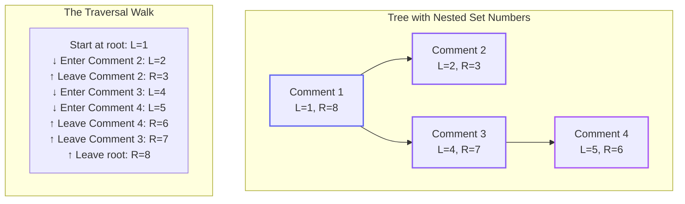
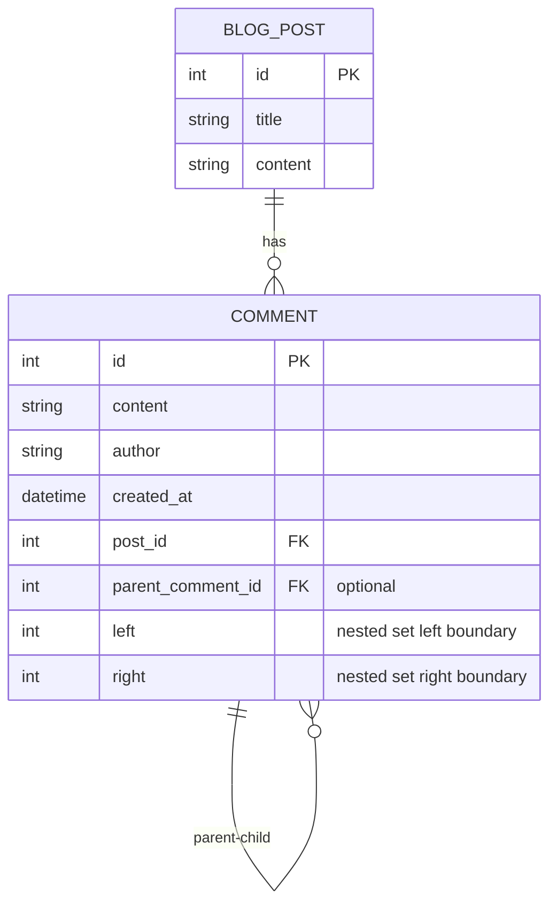
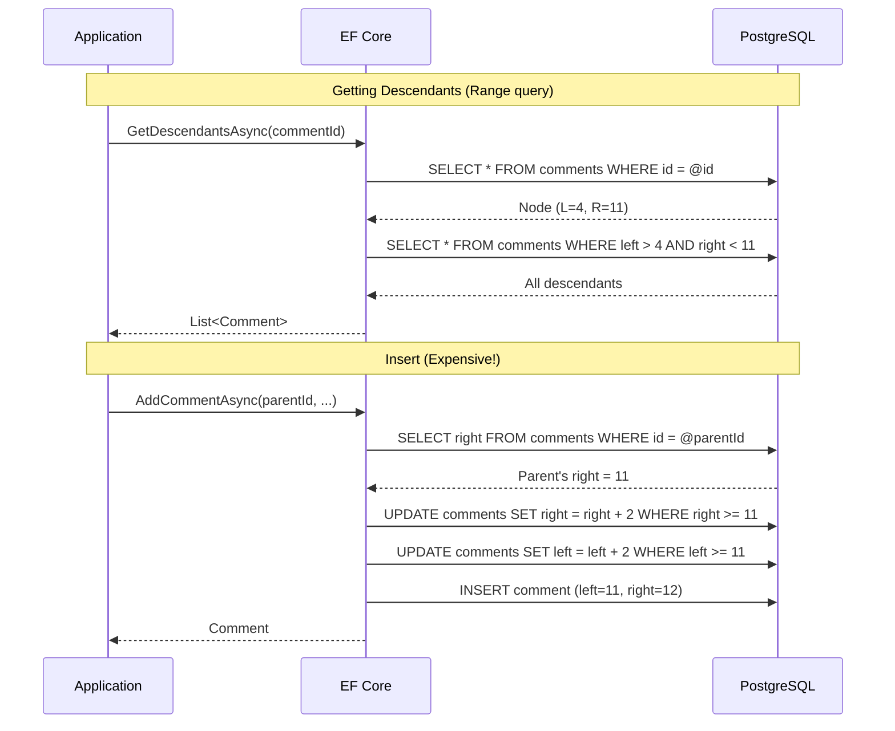

# Data Hierarchies Part 1.4: Nested Sets with EF Core

<!--category-- Entity Framework, PostgreSQL, EF Hierarchies -->
<datetime class="hidden">2025-12-06T09:40</datetime>

Nested sets encode the entire tree structure into just two integers per node - Left and Right boundaries from a depth-first walk. Finding all descendants becomes a simple range query, and ORDER BY Left gives you perfect display order. The catch? Every insert shifts potentially thousands of rows, making this ideal only for read-heavy, rarely-modified hierarchies.

## Series Navigation

- [Part 1: Overview](/blog/efcore-hierarchical-data) - Introduction and comparison
- [Part 1.1: Adjacency List](/blog/efcore-hierarchical-data-adjacency)
- [Part 1.2: Closure Table](/blog/efcore-hierarchical-data-closure)
- [Part 1.3: Materialised Path](/blog/efcore-hierarchical-data-path)
- **Part 1.4: Nested Sets** (this article)
- [Part 1.5: ltree](/blog/efcore-hierarchical-data-ltree)

---

## What are Nested Sets?

Nested Sets (also called Modified Preorder Tree Traversal or MPTT) assigns each node two numbers: `Left` and `Right`. These numbers are assigned during a depth-first traversal of the tree, with Left assigned when entering a node and Right assigned when leaving.

The magic property: **all descendants of a node have Left and Right values between the node's own Left and Right**. This transforms hierarchical queries into simple range queries.

**Key insight:** Instead of storing "who is my parent" (a relationship), we store "where do I fit in the traversal order" (a position). Finding descendants becomes a simple `WHERE Left > @myLeft AND Right < @myRight`.

[TOC]

## The Concept Visualised

Imagine walking around the tree, numbering as you go:



Notice the patterns:
- **Comment 1** (L=1, R=8) contains nodes where 1 < L and R < 8
- **Comment 3** (L=4, R=7) contains nodes where 4 < L and R < 7 → that's Comment 4 (L=5, R=6)
- **Comment 2** (L=2, R=3) has R-L=1, meaning no children (leaf node)
- **Depth** can be calculated by counting ancestors (nodes that contain this one)

The Left/Right values encode the entire tree structure in just two integers per node!

## Entity Definition

```csharp
public class Comment
{
    public int Id { get; set; }
    public string Content { get; set; } = string.Empty;
    public string Author { get; set; } = string.Empty;
    public DateTime CreatedAt { get; set; }

    public int PostId { get; set; }
    public BlogPost Post { get; set; } = null!;

    // ========== NESTED SETS ==========

    // Left boundary - assigned when entering this node in depth-first walk
    // Smaller values are "earlier" in the traversal
    public int Left { get; set; }

    // Right boundary - assigned when leaving this node in depth-first walk
    // Always greater than Left for the same node
    // Right - Left - 1 = number of descendants (times 2)
    public int Right { get; set; }

    // We keep ParentCommentId for:
    // 1. Easier insert operations (need to know where to insert)
    // 2. Moving nodes (need to track parent relationship)
    // 3. EF Core navigation properties
    // Note: The nested set values are the "source of truth" for hierarchy queries
    public int? ParentCommentId { get; set; }
    public Comment? ParentComment { get; set; }
    public ICollection<Comment> Children { get; set; } = new List<Comment>();

    // ========== COMPUTED HELPERS ==========

    // A leaf node has no space between Left and Right for children
    public bool IsLeaf => Right - Left == 1;

    // Number of descendants = (Right - Left - 1) / 2
    public int DescendantCount => (Right - Left - 1) / 2;
}
```

## EF Core Configuration

```csharp
public class CommentConfiguration : IEntityTypeConfiguration<Comment>
{
    public void Configure(EntityTypeBuilder<Comment> builder)
    {
        builder.HasKey(c => c.Id);

        builder.Property(c => c.Content)
            .IsRequired()
            .HasMaxLength(10000);

        builder.Property(c => c.Author)
            .IsRequired()
            .HasMaxLength(200);

        // Left and Right are required - they define the hierarchy
        builder.Property(c => c.Left).IsRequired();
        builder.Property(c => c.Right).IsRequired();

        // Relationship to blog post
        builder.HasOne(c => c.Post)
            .WithMany(p => p.Comments)
            .HasForeignKey(c => c.PostId)
            .OnDelete(DeleteBehavior.Cascade);

        // Self-referencing (optional but useful for inserts)
        builder.HasOne(c => c.ParentComment)
            .WithMany(c => c.Children)
            .HasForeignKey(c => c.ParentCommentId)
            .OnDelete(DeleteBehavior.Restrict);

        // ========== INDEXES ==========

        // Critical for nested set queries!
        // Most queries use Left for range comparisons
        builder.HasIndex(c => c.Left);

        // Right is used for "contains" queries
        builder.HasIndex(c => c.Right);

        // Composite index for the classic descendant query:
        // WHERE Left > @left AND Right < @right
        builder.HasIndex(c => new { c.Left, c.Right });

        // Index for finding nodes in a specific post
        builder.HasIndex(c => c.PostId);

        // Index for ordering and display
        builder.HasIndex(c => new { c.PostId, c.Left });
    }
}
```

## Database Schema



## Operations

### Insert a New Comment

This is where nested sets show their major weakness. To insert a new node, we must **shift all nodes to the right** to make room:

```csharp
public async Task<Comment> AddCommentAsync(
    int postId,
    int? parentId,
    string author,
    string content,
    CancellationToken ct = default)
{
    await using var transaction = await context.Database.BeginTransactionAsync(ct);

    try
    {
        int newLeft, newRight;

        if (parentId.HasValue)
        {
            // Get the parent's Right value - we'll insert just before it
            var parent = await context.Comments
                .FirstOrDefaultAsync(c => c.Id == parentId.Value, ct);

            if (parent == null)
                throw new InvalidOperationException($"Parent comment {parentId} not found");

            // New node will be inserted at parent's Right position
            // (making it the last child of this parent)
            newLeft = parent.Right;
            newRight = parent.Right + 1;

            // ========== THE EXPENSIVE PART ==========
            // Shift ALL nodes with Left >= newLeft to the right by 2
            // This makes room for our new node's Left and Right values

            // Update Right values first (nodes that "end" after our insert point)
            await context.Comments
                .Where(c => c.PostId == postId && c.Right >= newLeft)
                .ExecuteUpdateAsync(s => s.SetProperty(c => c.Right, c => c.Right + 2), ct);

            // Update Left values (nodes that "start" after our insert point)
            await context.Comments
                .Where(c => c.PostId == postId && c.Left >= newLeft)
                .ExecuteUpdateAsync(s => s.SetProperty(c => c.Left, c => c.Left + 2), ct);
        }
        else
        {
            // Root comment - find the max Right value and add after
            var maxRight = await context.Comments
                .Where(c => c.PostId == postId)
                .MaxAsync(c => (int?)c.Right, ct) ?? 0;

            newLeft = maxRight + 1;
            newRight = maxRight + 2;
            // No shifting needed - we're adding at the end
        }

        // Create the new comment with calculated Left/Right
        var comment = new Comment
        {
            PostId = postId,
            ParentCommentId = parentId,
            Author = author,
            Content = content,
            CreatedAt = DateTime.UtcNow,
            Left = newLeft,
            Right = newRight
        };

        context.Comments.Add(comment);
        await context.SaveChangesAsync(ct);
        await transaction.CommitAsync(ct);

        logger.LogInformation("Added comment {CommentId} at L={Left}, R={Right}",
            comment.Id, newLeft, newRight);

        return comment;
    }
    catch
    {
        await transaction.RollbackAsync(ct);
        throw;
    }
}
```

### Get Immediate Children

Finding immediate children is slightly tricky - we need nodes contained by parent but not by any intermediate node:

```csharp
public async Task<List<Comment>> GetChildrenAsync(int commentId, CancellationToken ct = default)
{
    // Option 1: Use ParentCommentId (simple, if you've kept it)
    return await context.Comments
        .AsNoTracking()
        .Where(c => c.ParentCommentId == commentId)
        .OrderBy(c => c.Left)  // Order by position in tree
        .ToListAsync(ct);

    // Option 2: Pure nested set approach (more complex)
    // A child is a node that:
    // - Is contained by the parent (Left > parent.Left AND Right < parent.Right)
    // - Is not contained by any other node that is also contained by the parent
    //
    // This requires a subquery or additional logic - ParentCommentId is simpler
}
```

### Get All Ancestors

A single range query - very efficient:

```csharp
public async Task<List<Comment>> GetAncestorsAsync(int commentId, CancellationToken ct = default)
{
    var comment = await context.Comments
        .AsNoTracking()
        .FirstOrDefaultAsync(c => c.Id == commentId, ct);

    if (comment == null)
        return new List<Comment>();

    // Ancestors are nodes that CONTAIN this node
    // A node contains another if: ancestor.Left < node.Left AND ancestor.Right > node.Right
    return await context.Comments
        .AsNoTracking()
        .Where(c => c.Left < comment.Left && c.Right > comment.Right)
        .OrderBy(c => c.Left)  // Root first (smallest Left)
        .ToListAsync(ct);
}
```

### Get All Descendants

This is where nested sets really shine:

```csharp
public async Task<List<Comment>> GetDescendantsAsync(int commentId, CancellationToken ct = default)
{
    var comment = await context.Comments
        .AsNoTracking()
        .FirstOrDefaultAsync(c => c.Id == commentId, ct);

    if (comment == null)
        return new List<Comment>();

    // Descendants are nodes CONTAINED BY this node
    // Simple range query - extremely efficient with indexes
    return await context.Comments
        .AsNoTracking()
        .Where(c => c.Left > comment.Left && c.Right < comment.Right)
        .OrderBy(c => c.Left)  // Depth-first order - perfect for display!
        .ToListAsync(ct);
}
```

### Get Entire Tree in Display Order

One query returns everything in perfect display order:

```csharp
public async Task<List<CommentWithDepth>> GetTreeInOrderAsync(int postId, CancellationToken ct = default)
{
    // The beauty of nested sets: ORDER BY Left gives you depth-first order!
    // This is the exact order you'd want for displaying a threaded view

    // Calculate depth using a subquery that counts ancestors
    var sql = @"
        SELECT
            c.*,
            (SELECT COUNT(*)
             FROM comments ancestor
             WHERE ancestor.post_id = c.post_id
               AND ancestor.left < c.left
               AND ancestor.right > c.right
            ) as depth
        FROM comments c
        WHERE c.post_id = {0}
        ORDER BY c.left";

    return await context.Database
        .SqlQueryRaw<CommentWithDepth>(sql, postId)
        .ToListAsync(ct);
}
```

Or without raw SQL (less efficient but pure EF Core):

```csharp
public async Task<List<CommentWithDepth>> GetTreeInOrderEfCoreAsync(
    int postId,
    CancellationToken ct = default)
{
    // Get all comments ordered by Left (depth-first order)
    var comments = await context.Comments
        .AsNoTracking()
        .Where(c => c.PostId == postId)
        .OrderBy(c => c.Left)
        .ToListAsync(ct);

    // Calculate depth for each by counting ancestors in memory
    var result = new List<CommentWithDepth>();

    foreach (var comment in comments)
    {
        // Count how many other comments contain this one
        var depth = comments.Count(c =>
            c.Left < comment.Left && c.Right > comment.Right);

        result.Add(new CommentWithDepth
        {
            Id = comment.Id,
            Content = comment.Content,
            Author = comment.Author,
            CreatedAt = comment.CreatedAt,
            PostId = comment.PostId,
            ParentCommentId = comment.ParentCommentId,
            Depth = depth
        });
    }

    return result;
}
```

### Delete a Subtree

Deleting is straightforward, but requires re-numbering:

```csharp
public async Task DeleteSubtreeAsync(int commentId, CancellationToken ct = default)
{
    await using var transaction = await context.Database.BeginTransactionAsync(ct);

    try
    {
        var comment = await context.Comments
            .FirstOrDefaultAsync(c => c.Id == commentId, ct);

        if (comment == null)
            throw new InvalidOperationException($"Comment {commentId} not found");

        var postId = comment.PostId;
        var left = comment.Left;
        var right = comment.Right;

        // Width of the subtree being deleted
        var width = right - left + 1;

        // Delete all nodes in the range
        var deleted = await context.Comments
            .Where(c => c.Left >= left && c.Right <= right)
            .ExecuteDeleteAsync(ct);

        // Shift all nodes to the right of deleted subtree LEFT by width
        // (closing the gap)
        await context.Comments
            .Where(c => c.PostId == postId && c.Right > right)
            .ExecuteUpdateAsync(s => s.SetProperty(c => c.Right, c => c.Right - width), ct);

        await context.Comments
            .Where(c => c.PostId == postId && c.Left > right)
            .ExecuteUpdateAsync(s => s.SetProperty(c => c.Left, c => c.Left - width), ct);

        await transaction.CommitAsync(ct);

        logger.LogInformation("Deleted {Count} comments, shifted remaining nodes by {Width}",
            deleted, width);
    }
    catch
    {
        await transaction.RollbackAsync(ct);
        throw;
    }
}
```

### Move a Subtree

This is the most complex operation for nested sets:

```csharp
public async Task MoveSubtreeAsync(
    int commentId,
    int newParentId,
    CancellationToken ct = default)
{
    await using var transaction = await context.Database.BeginTransactionAsync(ct);

    try
    {
        var node = await context.Comments.FirstOrDefaultAsync(c => c.Id == commentId, ct);
        var newParent = await context.Comments.FirstOrDefaultAsync(c => c.Id == newParentId, ct);

        if (node == null || newParent == null)
            throw new InvalidOperationException("Node or parent not found");

        // Prevent cycle: can't move node under its own descendant
        if (newParent.Left >= node.Left && newParent.Right <= node.Right)
            throw new InvalidOperationException("Cannot move node under its own descendant");

        var postId = node.PostId;
        var width = node.Right - node.Left + 1;

        // This is complex! The algorithm:
        // 1. Mark nodes to move (using temporary negative values)
        // 2. Close the gap where nodes were
        // 3. Make room at new position
        // 4. Move nodes to new position
        // 5. Fix the signs back

        // Use a stored procedure or multiple updates for production
        // This simplified version shows the concept:

        var oldLeft = node.Left;
        var oldRight = node.Right;
        var newPosition = newParent.Right;

        // Step 1: Temporarily mark nodes by making Left/Right negative
        await context.Comments
            .Where(c => c.PostId == postId && c.Left >= oldLeft && c.Right <= oldRight)
            .ExecuteUpdateAsync(s => s
                .SetProperty(c => c.Left, c => -c.Left)
                .SetProperty(c => c.Right, c => -c.Right), ct);

        // Step 2: Close gap
        await context.Comments
            .Where(c => c.PostId == postId && c.Left > 0 && c.Right > oldRight)
            .ExecuteUpdateAsync(s => s.SetProperty(c => c.Right, c => c.Right - width), ct);

        await context.Comments
            .Where(c => c.PostId == postId && c.Left > oldRight)
            .ExecuteUpdateAsync(s => s.SetProperty(c => c.Left, c => c.Left - width), ct);

        // Recalculate newPosition (it may have shifted)
        var updatedParent = await context.Comments.FirstAsync(c => c.Id == newParentId, ct);
        newPosition = updatedParent.Right;

        // Step 3: Make room at new position
        await context.Comments
            .Where(c => c.PostId == postId && c.Left > 0 && c.Right >= newPosition)
            .ExecuteUpdateAsync(s => s.SetProperty(c => c.Right, c => c.Right + width), ct);

        await context.Comments
            .Where(c => c.PostId == postId && c.Left >= newPosition)
            .ExecuteUpdateAsync(s => s.SetProperty(c => c.Left, c => c.Left + width), ct);

        // Step 4: Calculate offset and move nodes
        var offset = newPosition - oldLeft;

        await context.Comments
            .Where(c => c.PostId == postId && c.Left < 0)
            .ExecuteUpdateAsync(s => s
                .SetProperty(c => c.Left, c => -c.Left + offset)
                .SetProperty(c => c.Right, c => -c.Right + offset), ct);

        // Step 5: Update parent reference
        node = await context.Comments.FirstAsync(c => c.Id == commentId, ct);
        node.ParentCommentId = newParentId;

        await context.SaveChangesAsync(ct);
        await transaction.CommitAsync(ct);

        logger.LogInformation("Moved subtree of width {Width} from position {OldPos} to {NewPos}",
            width, oldLeft, newPosition);
    }
    catch
    {
        await transaction.RollbackAsync(ct);
        throw;
    }
}
```

## Query Flow Visualisation



## Performance Characteristics

| Operation | Complexity | Database Queries | Notes |
|-----------|------------|------------------|-------|
| Insert | O(n) | 3 | Must shift all nodes to right |
| Get children | O(1) | 1 | If using ParentCommentId |
| Get ancestors | O(1) | 2 | Range query |
| Get descendants | O(1) | 2 | Range query |
| Get tree in order | O(1) | 1 | ORDER BY left = perfect order |
| Move subtree | O(n) | Many | Complex renumbering |
| Delete subtree | O(n) | 3 | Delete + shift |

**Note:** The O(n) complexity for inserts/deletes is problematic for write-heavy applications. Each insert potentially touches every row in the tree!

## Pros and Cons

| Pros | Cons |
|------|------|
| O(1) descendant/ancestor queries | O(n) insert complexity - every insert shifts rows |
| Perfect display order from ORDER BY Left | O(n) delete and move complexity |
| Depth calculable via ancestor count | Write locks can cause contention |
| Minimal storage (just 2 integers) | Numbers can get very large with many updates |
| Single query returns entire subtree | Concurrent modifications are dangerous |
| No joins or recursive CTEs needed | Requires transaction for every write |

## When to Use Nested Sets

**Choose Nested Sets when:**
- Your data is essentially read-only (category trees, org charts that rarely change)
- You need blazing-fast subtree queries
- Display order matters and you want it built-in
- You'll do infrequent batch updates rather than continuous inserts
- Concurrent writes are not a concern

**Avoid Nested Sets when:**
- Users can add/delete/move nodes (like comment systems)
- You have concurrent writes
- Insert performance matters
- You can't afford to lock large portions of the table
- The tree is frequently modified

## Rebuilding the Tree

If Left/Right values become corrupted or you need to add nested sets to existing data:

```csharp
public async Task RebuildNestedSetsAsync(int postId, CancellationToken ct = default)
{
    await using var transaction = await context.Database.BeginTransactionAsync(ct);

    try
    {
        // Load all comments with parent relationships
        var comments = await context.Comments
            .Where(c => c.PostId == postId)
            .OrderBy(c => c.CreatedAt)
            .ToListAsync(ct);

        // Build parent-children lookup
        var childrenLookup = comments.ToLookup(c => c.ParentCommentId);

        // Walk the tree depth-first, assigning Left/Right
        int counter = 0;

        void Walk(int? parentId)
        {
            foreach (var comment in childrenLookup[parentId])
            {
                counter++;
                comment.Left = counter;
                Walk(comment.Id);  // Recurse to children
                counter++;
                comment.Right = counter;
            }
        }

        Walk(null);  // Start with root nodes

        await context.SaveChangesAsync(ct);
        await transaction.CommitAsync(ct);

        logger.LogInformation("Rebuilt nested sets for post {PostId}: {Count} comments",
            postId, comments.Count);
    }
    catch
    {
        await transaction.RollbackAsync(ct);
        throw;
    }
}
```

## Alternative: Gap Numbering

To reduce the frequency of renumbering, you can leave gaps:

```csharp
// Instead of consecutive: 1, 2, 3, 4, 5, 6, 7, 8
// Use gaps: 100, 200, 300, 400, 500, 600, 700, 800

// Inserts can fit in gaps without shifting:
// Insert between 200 and 300: use 250
// Only renumber when gaps run out
```

This amortises the cost of renumbering but adds complexity.

## Series Navigation

- [Part 1: Overview](/blog/efcore-hierarchical-data)
- [Part 1.1: Adjacency List](/blog/efcore-hierarchical-data-adjacency)
- [Part 1.2: Closure Table](/blog/efcore-hierarchical-data-closure)
- [Part 1.3: Materialised Path](/blog/efcore-hierarchical-data-path)
- **Part 1.4: Nested Sets** (this article)
- [Part 1.5: ltree](/blog/efcore-hierarchical-data-ltree)
