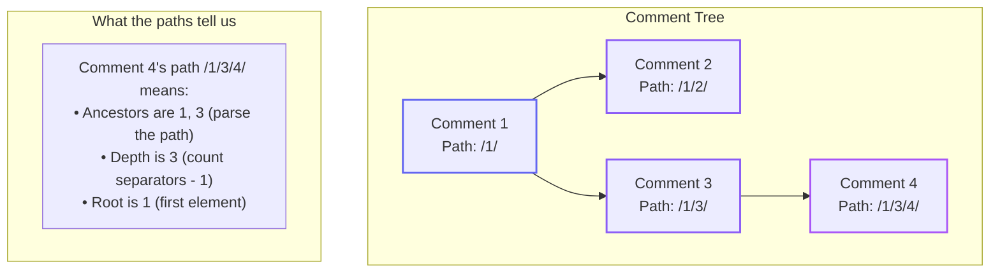
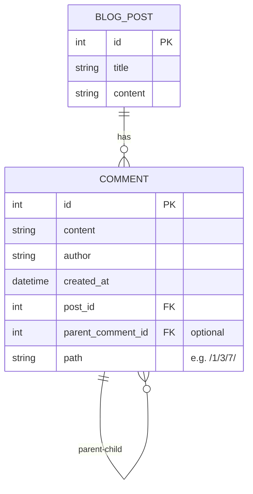
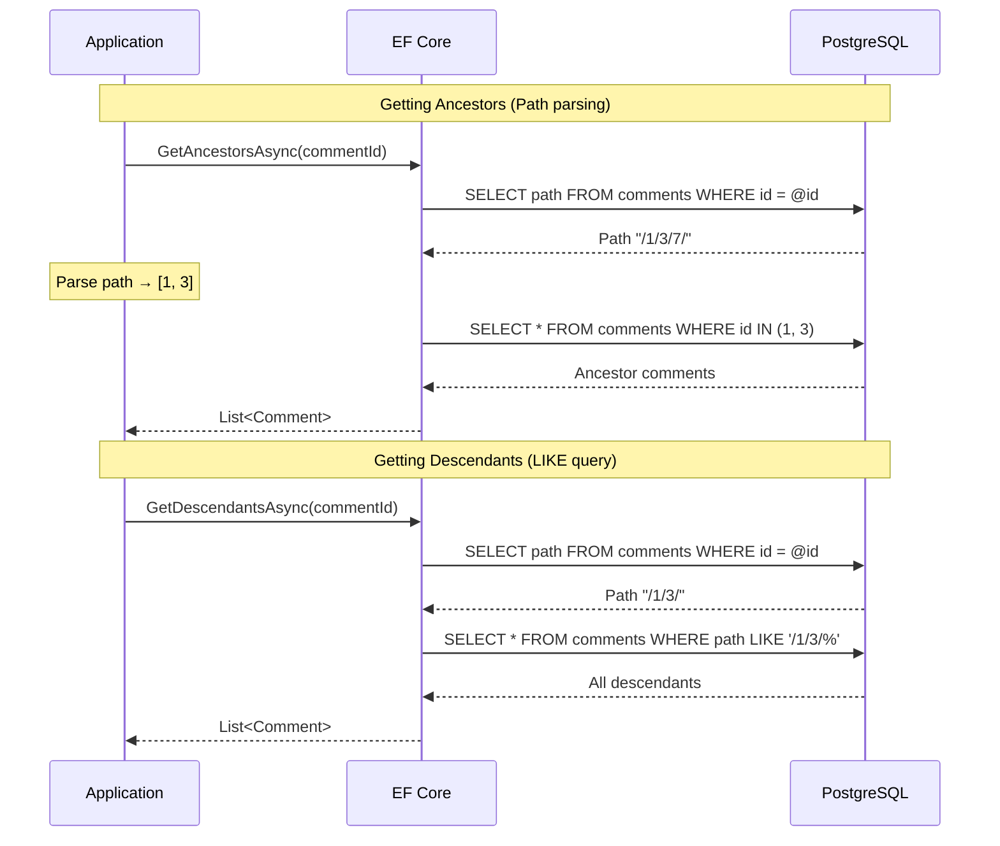

# Data Hierarchies Part 1.3: Materialised Path with EF Core

<!--category-- Entity Framework, PostgreSQL, EF Hierarchies -->
<datetime class="hidden">2025-12-06T09:30</datetime>

Materialised paths store the complete ancestry as a delimited string - like `/1/3/7/` - making ancestors instantly readable without any joins. Perfect for breadcrumb generation and human-readable debugging, though moving subtrees means updating every descendant's path string.

## Series Navigation

- [Part 1: Overview](/blog/efcore-hierarchical-data) - Introduction and comparison
- [Part 1.1: Adjacency List](/blog/efcore-hierarchical-data-adjacency)
- [Part 1.2: Closure Table](/blog/efcore-hierarchical-data-closure)
- **Part 1.3: Materialised Path** (this article)
- [Part 1.4: Nested Sets](/blog/efcore-hierarchical-data-nested)
- [Part 1.5: ltree](/blog/efcore-hierarchical-data-ltree)

---

## What is a Materialised Path?

The Materialised Path pattern stores the complete ancestry of each node as a delimited string - like a file path or postal address. Instead of storing just "my parent is node 5", we store "I am reached via nodes 1 → 3 → 5 → 7" directly in the row.

Think of it like storing the full URL instead of just the page name. The path `/blog/posts/2024/my-article` tells you exactly where you are in the hierarchy, no lookups needed.

**Key insight:** We're trading query complexity for storage redundancy. The ancestry is denormalised into every row, but this makes ancestor queries trivial - just parse the string.

[TOC]

## The Concept Visualised



The path is self-describing:
- **Reading ancestors:** Parse `/1/3/4/` → ancestors are [1, 3, 4]
- **Finding descendants:** Query `WHERE path LIKE '/1/3/%'` → gets all under node 3
- **Calculating depth:** Count the separators minus one
- **Finding siblings:** Query `WHERE path LIKE '/1/3/_/'` (immediate children of 3)

## Entity Definition

The entity adds a single Path column:

```csharp
public class Comment
{
    public int Id { get; set; }
    public string Content { get; set; } = string.Empty;
    public string Author { get; set; } = string.Empty;
    public DateTime CreatedAt { get; set; }

    public int PostId { get; set; }
    public BlogPost Post { get; set; } = null!;

    // ========== MATERIALISED PATH ==========

    // The complete path from root to this node
    // Format: /ancestor1/ancestor2/.../thisNode/
    // Examples:
    //   Root comment: "/1/"
    //   Child of 1: "/1/5/"
    //   Grandchild: "/1/5/12/"
    //
    // The leading and trailing slashes make pattern matching easier:
    // - LIKE '/1/%' finds all descendants of 1 (includes /1/ itself)
    // - LIKE '/1/5/%' finds all descendants of 5 under 1
    public string Path { get; set; } = string.Empty;

    // We still keep ParentCommentId for:
    // 1. Quick "who is my parent" without parsing
    // 2. EF Core navigation properties
    // 3. Data integrity (can validate path matches parent relationship)
    public int? ParentCommentId { get; set; }
    public Comment? ParentComment { get; set; }
    public ICollection<Comment> Children { get; set; } = new List<Comment>();

    // ========== COMPUTED HELPERS ==========

    // Parse ancestors from path - not stored, computed on demand
    public IEnumerable<int> GetAncestorIds()
    {
        if (string.IsNullOrEmpty(Path)) yield break;

        // Split "/1/3/4/" into ["", "1", "3", "4", ""]
        var parts = Path.Split('/', StringSplitOptions.RemoveEmptyEntries);

        // Return all except the last (which is this node's ID)
        for (int i = 0; i < parts.Length - 1; i++)
        {
            if (int.TryParse(parts[i], out var id))
                yield return id;
        }
    }

    // Calculate depth from path
    public int GetDepth()
    {
        if (string.IsNullOrEmpty(Path)) return 0;
        // Count segments: "/1/3/4/" has 3 segments, depth is 2 (0-indexed from root)
        return Path.Split('/', StringSplitOptions.RemoveEmptyEntries).Length - 1;
    }
}
```

## EF Core Configuration

```csharp
public class CommentConfiguration : IEntityTypeConfiguration<Comment>
{
    public void Configure(EntityTypeBuilder<Comment> builder)
    {
        builder.HasKey(c => c.Id);

        builder.Property(c => c.Content)
            .IsRequired()
            .HasMaxLength(10000);

        builder.Property(c => c.Author)
            .IsRequired()
            .HasMaxLength(200);

        // ========== PATH COLUMN ==========
        // Set a reasonable max length - this limits your tree depth
        // /1/12345/12346/12347/...
        // Each segment is up to ~7 chars (ID + slash), so 1000 chars ≈ 140 levels
        builder.Property(c => c.Path)
            .IsRequired()
            .HasMaxLength(1000);

        // Relationship to blog post
        builder.HasOne(c => c.Post)
            .WithMany(p => p.Comments)
            .HasForeignKey(c => c.PostId)
            .OnDelete(DeleteBehavior.Cascade);

        // Self-referencing (optional but useful)
        builder.HasOne(c => c.ParentComment)
            .WithMany(c => c.Children)
            .HasForeignKey(c => c.ParentCommentId)
            .OnDelete(DeleteBehavior.Restrict);

        // ========== INDEXES ==========

        // Standard indexes
        builder.HasIndex(c => c.PostId);
        builder.HasIndex(c => c.ParentCommentId);

        // PATH INDEX - Critical for performance!
        // This makes LIKE 'prefix%' queries efficient
        // PostgreSQL can use a B-tree index for prefix LIKE patterns
        // (but NOT for '%suffix' or '%contains%' patterns)
        builder.HasIndex(c => c.Path);

        // For PostgreSQL, a text_pattern_ops index is even better for LIKE:
        // CREATE INDEX ix_comments_path ON comments (path text_pattern_ops);
        // You may want to add this via a raw migration
    }
}
```

## Database Schema



## Operations

### Insert a New Comment

Inserting requires building the path from the parent's path:

```csharp
public async Task<Comment> AddCommentAsync(
    int postId,
    int? parentId,
    string author,
    string content,
    CancellationToken ct = default)
{
    string path;

    if (parentId.HasValue)
    {
        // Get parent's path to extend it
        var parentPath = await context.Comments
            .Where(c => c.Id == parentId.Value)
            .Select(c => c.Path)
            .FirstOrDefaultAsync(ct);

        if (parentPath == null)
        {
            throw new InvalidOperationException($"Parent comment {parentId} not found");
        }

        // We need the ID first, so we'll update the path after saving
        // (Chicken-and-egg: path contains our ID, but we don't have ID until saved)

        var comment = new Comment
        {
            PostId = postId,
            ParentCommentId = parentId,
            Author = author,
            Content = content,
            CreatedAt = DateTime.UtcNow,
            Path = string.Empty  // Temporary - will update after save
        };

        context.Comments.Add(comment);
        await context.SaveChangesAsync(ct);

        // Now we have the ID - build the real path
        // Parent path "/1/3/" + our ID "7" = "/1/3/7/"
        comment.Path = $"{parentPath}{comment.Id}/";
        await context.SaveChangesAsync(ct);

        logger.LogInformation("Added comment {CommentId} with path {Path}", comment.Id, comment.Path);
        return comment;
    }
    else
    {
        // Root comment - path is just our ID
        var comment = new Comment
        {
            PostId = postId,
            ParentCommentId = null,
            Author = author,
            Content = content,
            CreatedAt = DateTime.UtcNow,
            Path = string.Empty  // Temporary
        };

        context.Comments.Add(comment);
        await context.SaveChangesAsync(ct);

        comment.Path = $"/{comment.Id}/";
        await context.SaveChangesAsync(ct);

        logger.LogInformation("Added root comment {CommentId} with path {Path}", comment.Id, comment.Path);
        return comment;
    }
}
```

### Get Immediate Children

Using the parent-child relationship (we kept ParentCommentId for convenience):

```csharp
public async Task<List<Comment>> GetChildrenAsync(int commentId, CancellationToken ct = default)
{
    // Option 1: Use ParentCommentId (simple, always works)
    return await context.Comments
        .AsNoTracking()
        .Where(c => c.ParentCommentId == commentId)
        .OrderBy(c => c.CreatedAt)
        .ToListAsync(ct);

    // Option 2: Use path pattern (demonstrates path power)
    // var parentPath = await context.Comments
    //     .Where(c => c.Id == commentId)
    //     .Select(c => c.Path)
    //     .FirstOrDefaultAsync(ct);
    //
    // if (parentPath == null) return new List<Comment>();
    //
    // // Find paths that extend parent by exactly one segment
    // // Parent: /1/3/  Children: /1/3/X/ where X is one number
    // var childPathPattern = $"{parentPath}%";
    //
    // return await context.Comments
    //     .AsNoTracking()
    //     .Where(c => EF.Functions.Like(c.Path, childPathPattern)
    //              && c.Path != parentPath
    //              && c.ParentCommentId == commentId)  // Ensures immediate children only
    //     .ToListAsync(ct);
}
```

### Get All Ancestors

This is where materialised paths shine - parse the path, no database lookups needed:

```csharp
public async Task<List<Comment>> GetAncestorsAsync(int commentId, CancellationToken ct = default)
{
    // Step 1: Get the path (single query)
    var path = await context.Comments
        .Where(c => c.Id == commentId)
        .Select(c => c.Path)
        .FirstOrDefaultAsync(ct);

    if (string.IsNullOrEmpty(path))
        return new List<Comment>();

    // Step 2: Parse ancestor IDs from path
    // Path "/1/3/7/" -> split -> ["1", "3", "7"] -> take all but last -> [1, 3]
    var ancestorIds = path
        .Split('/', StringSplitOptions.RemoveEmptyEntries)
        .SkipLast(1)  // Exclude self
        .Select(int.Parse)
        .ToList();

    if (!ancestorIds.Any())
        return new List<Comment>();

    // Step 3: Fetch ancestors (single query, uses primary key index)
    var ancestors = await context.Comments
        .AsNoTracking()
        .Where(c => ancestorIds.Contains(c.Id))
        .ToListAsync(ct);

    // Step 4: Order by position in path (root first)
    return ancestorIds
        .Select(id => ancestors.First(a => a.Id == id))
        .ToList();
}
```

### Get All Descendants

Use LIKE with the path prefix:

```csharp
public async Task<List<Comment>> GetDescendantsAsync(int commentId, CancellationToken ct = default)
{
    // Get the path first
    var path = await context.Comments
        .Where(c => c.Id == commentId)
        .Select(c => c.Path)
        .FirstOrDefaultAsync(ct);

    if (string.IsNullOrEmpty(path))
        return new List<Comment>();

    // LIKE 'path%' finds all paths that START with this path
    // Path "/1/3/" matches "/1/3/", "/1/3/5/", "/1/3/5/9/", etc.
    // Using EF.Functions.Like for proper SQL generation
    return await context.Comments
        .AsNoTracking()
        .Where(c => EF.Functions.Like(c.Path, $"{path}%") && c.Id != commentId)
        .OrderBy(c => c.Path)  // Gives us depth-first order!
        .ToListAsync(ct);
}
```

### Get Descendants with Depth

We can calculate depth from the path:

```csharp
public async Task<List<CommentWithDepth>> GetDescendantsWithDepthAsync(
    int commentId,
    int? maxDepth = null,
    CancellationToken ct = default)
{
    var comment = await context.Comments
        .AsNoTracking()
        .FirstOrDefaultAsync(c => c.Id == commentId, ct);

    if (comment == null)
        return new List<CommentWithDepth>();

    var basePath = comment.Path;
    var baseDepth = basePath.Split('/', StringSplitOptions.RemoveEmptyEntries).Length;

    // Get all descendants
    var query = context.Comments
        .AsNoTracking()
        .Where(c => EF.Functions.Like(c.Path, $"{basePath}%") && c.Id != commentId);

    var descendants = await query.ToListAsync(ct);

    // Calculate relative depth and filter if needed
    var result = descendants
        .Select(d =>
        {
            var absoluteDepth = d.Path.Split('/', StringSplitOptions.RemoveEmptyEntries).Length;
            var relativeDepth = absoluteDepth - baseDepth;
            return new CommentWithDepth
            {
                Id = d.Id,
                Content = d.Content,
                Author = d.Author,
                CreatedAt = d.CreatedAt,
                PostId = d.PostId,
                ParentCommentId = d.ParentCommentId,
                Path = d.Path,
                Depth = relativeDepth
            };
        })
        .Where(d => !maxDepth.HasValue || d.Depth <= maxDepth.Value)
        .OrderBy(d => d.Path)
        .ToList();

    return result;
}

public class CommentWithDepth
{
    public int Id { get; set; }
    public string Content { get; set; } = string.Empty;
    public string Author { get; set; } = string.Empty;
    public DateTime CreatedAt { get; set; }
    public int PostId { get; set; }
    public int? ParentCommentId { get; set; }
    public string Path { get; set; } = string.Empty;
    public int Depth { get; set; }
}
```

### Delete a Subtree

Simple with path matching:

```csharp
public async Task DeleteSubtreeAsync(int commentId, CancellationToken ct = default)
{
    var path = await context.Comments
        .Where(c => c.Id == commentId)
        .Select(c => c.Path)
        .FirstOrDefaultAsync(ct);

    if (string.IsNullOrEmpty(path))
    {
        throw new InvalidOperationException($"Comment {commentId} not found");
    }

    // Delete all comments whose path starts with this path
    // This includes the comment itself and ALL descendants
    var deleted = await context.Comments
        .Where(c => EF.Functions.Like(c.Path, $"{path}%"))
        .ExecuteDeleteAsync(ct);

    logger.LogInformation("Deleted {Count} comments with path prefix {Path}", deleted, path);
}
```

### Move a Subtree

This is the expensive operation for materialised paths - we must update ALL descendant paths:

```csharp
public async Task MoveSubtreeAsync(
    int commentId,
    int newParentId,
    CancellationToken ct = default)
{
    await using var transaction = await context.Database.BeginTransactionAsync(ct);

    try
    {
        // Get the node being moved
        var comment = await context.Comments
            .FirstOrDefaultAsync(c => c.Id == commentId, ct);

        if (comment == null)
            throw new InvalidOperationException($"Comment {commentId} not found");

        // Get the new parent
        var newParent = await context.Comments
            .FirstOrDefaultAsync(c => c.Id == newParentId, ct);

        if (newParent == null)
            throw new InvalidOperationException($"New parent {newParentId} not found");

        // Prevent cycles: can't move under own descendant
        if (newParent.Path.StartsWith(comment.Path))
        {
            throw new InvalidOperationException("Cannot move a node under its own descendant");
        }

        var oldPath = comment.Path;
        var newPath = $"{newParent.Path}{comment.Id}/";

        // Get all descendants (including the node itself)
        var descendants = await context.Comments
            .Where(c => EF.Functions.Like(c.Path, $"{oldPath}%"))
            .ToListAsync(ct);

        // Update all paths by replacing the old prefix with the new one
        foreach (var descendant in descendants)
        {
            // Replace old path prefix with new one
            // Old: /1/3/7/  Node 7 moving under /2/
            // Node 7: /1/3/7/ -> /2/7/
            // Node 9 (child of 7): /1/3/7/9/ -> /2/7/9/
            descendant.Path = newPath + descendant.Path.Substring(oldPath.Length);
        }

        // Update the direct parent reference
        comment.ParentCommentId = newParentId;

        await context.SaveChangesAsync(ct);
        await transaction.CommitAsync(ct);

        logger.LogInformation("Moved subtree of {Count} nodes from {OldPath} to {NewPath}",
            descendants.Count, oldPath, newPath);
    }
    catch
    {
        await transaction.RollbackAsync(ct);
        throw;
    }
}
```

## Query Flow Visualisation



## Performance Characteristics

| Operation | Complexity | Database Queries | Notes |
|-----------|------------|------------------|-------|
| Insert | O(1) | 2 | Insert + update path |
| Get children | O(1) | 1 | Use ParentCommentId index |
| Get ancestors | O(d) | 2 | Fetch path + fetch d ancestors |
| Get descendants | O(1)* | 2 | Fetch path + LIKE query |
| Move subtree | O(s) | 1 | Update s descendant paths |
| Delete subtree | O(1)* | 2 | Fetch path + bulk delete |

*With proper index on path column

## Index Considerations

The path index is critical. For PostgreSQL, consider using `text_pattern_ops`:

```sql
-- Standard B-tree index (works for LIKE 'prefix%')
CREATE INDEX ix_comments_path ON comments (path);

-- Better for pattern matching in PostgreSQL
CREATE INDEX ix_comments_path_pattern ON comments (path text_pattern_ops);
```

Add this via a migration:

```csharp
protected override void Up(MigrationBuilder migrationBuilder)
{
    migrationBuilder.Sql(
        "CREATE INDEX ix_comments_path_pattern ON comments (path text_pattern_ops)");
}
```

## Path Format Considerations

Different delimiters have trade-offs:

| Format | Example | Pros | Cons |
|--------|---------|------|------|
| `/1/3/7/` | This article | Clear, URL-like, easy parsing | Uses more space |
| `1.3.7` | PostgreSQL ltree style | Compact, works with ltree | Period conflicts with decimals |
| `1,3,7` | Comma-separated | Simple | Comma in data could cause issues |
| `001.003.007` | Fixed-width | Sortable, consistent | Limits ID range, wastes space |

The `/id/` format with leading and trailing slashes is recommended because:
1. LIKE patterns work correctly (`/1/%` matches `/1/` but not `/10/`)
2. Easy to split and parse
3. Human-readable for debugging

## Pros and Cons

| Pros | Cons |
|------|------|
| Ancestors available by parsing (no query) | Moving subtrees requires updating all descendants |
| Descendants via simple LIKE query | Path length limits tree depth |
| Depth calculable from path | String manipulation has overhead |
| Human-readable for debugging | LIKE queries can be slow without proper index |
| Good for breadcrumb generation | Path must be kept in sync with ParentCommentId |
| Single column addition | Can't use standard B-tree for suffix matching |

## When to Use Materialised Path

**Choose Materialised Path when:**
- Breadcrumbs are a common requirement
- Ancestors are queried more often than descendants
- Tree depth is bounded (you won't have 100+ level trees)
- Moving subtrees is rare
- You want human-readable hierarchy data for debugging

**Avoid Materialised Path when:**
- You frequently move subtrees (updating all paths is expensive)
- Trees can be very deep (path strings become unwieldy)
- You need efficient suffix matching (finding all trees ending in a pattern)
- You're more comfortable with ltree (PostgreSQL-specific but more optimised)

## Comparison with ltree

If you're on PostgreSQL, consider [Part 1.5: ltree](/blog/efcore-hierarchical-data-ltree) instead. ltree is essentially a database-native, optimised materialised path with:
- GiST index support for efficient queries
- Built-in operators (`@>`, `<@`, `~`, etc.)
- Path manipulation functions
- Pattern matching with wildcards

The trade-off is PostgreSQL lock-in and requiring raw SQL for hierarchy queries.

## Series Navigation

- [Part 1: Overview](/blog/efcore-hierarchical-data)
- [Part 1.1: Adjacency List](/blog/efcore-hierarchical-data-adjacency)
- [Part 1.2: Closure Table](/blog/efcore-hierarchical-data-closure)
- **Part 1.3: Materialised Path** (this article)
- [Part 1.4: Nested Sets](/blog/efcore-hierarchical-data-nested)
- [Part 1.5: ltree](/blog/efcore-hierarchical-data-ltree)
