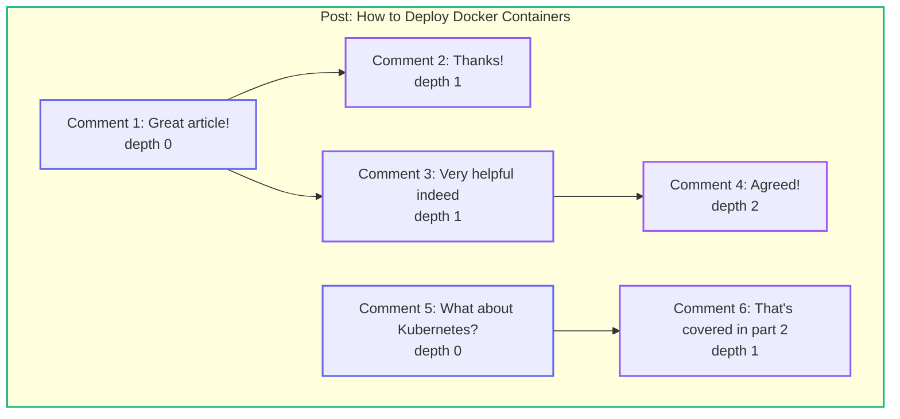

# Data Hierarchies: Managing Hierarchical Data with EF Core and PostgreSQL (Overview)

<!--category-- Entity Framework, PostgreSQL, EF Hierarchies -->
<datetime class="hidden">2025-12-06T09:00</datetime>

## Introduction

Hierarchical data is everywhere in software development: threaded comments, organisational charts, file systems, product categories, and forum discussions. The eternal question of "how do I store a tree in a relational database?" has haunted developers since the early days of SQL, and frankly, there's still no single answer that makes everyone happy.

### Why Hierarchies Are Hard in SQL

Here's the fundamental problem: **relational databases think in sets, not trees**.

When you write a SQL query, the database engine operates on *sets of rows*. It's brilliant at operations like "find all orders over 100" or "join customers to their purchases" - these are set operations that fit naturally with how tables work. The result is always a flat set of rows.

But a hierarchy is inherently *recursive*. To find all descendants of a node, you need to:
1. Find the immediate children
2. For each child, find *their* children
3. Repeat until you've traversed the entire subtree

This recursive traversal doesn't map naturally to set operations. You can't express "give me all descendants at any depth" in a single, simple SQL statement without either:
- Recursive CTEs (added to SQL:1999, but computationally expensive)
- Multiple round trips to the database
- Clever denormalisation that precomputes relationships

Each approach in this series represents a different trade-off between write complexity, read complexity, and storage overhead. There's no free lunch - you're always trading one cost for another.

[TOC]

## The Example: Threaded Comments

To make the comparisons concrete, we'll use threaded comments as our running example - something this very blog uses. A comment thread might look like this:

We need to support these operations:
- **Get all comments for a post** (with threading structure preserved)
- **Get all ancestors** of a comment (breadcrumb trail)
- **Get all descendants** of a comment (entire subtree)
- **Add a new comment** (as a reply to an existing comment)
- **Delete a subtree** (remove a comment and all replies)
- **Move a subtree** (reparent a comment - rarer, but sometimes needed)

## The Five Approaches

Each approach is covered in detail in its own article. Here's a summary to help you choose:

---

### 1. Adjacency List (Parent Reference)

**[Read the full article](/blog/efcore-hierarchical-data-adjacency)**

The simplest and most intuitive approach. Each row stores a reference to its parent node. It's what most developers reach for first because it maps naturally to how we think about hierarchies.

**How it works:** Each comment has a nullable `ParentCommentId` column. Root comments have NULL, replies point to their parent.

**Best for:** Shallow hierarchies (less than 5-6 levels), frequent subtree moves, when you want EF Core's navigation properties to work naturally.

**Trade-offs:** Getting ancestors or descendants requires recursive CTEs or multiple queries. Simple to write, potentially slow to read deep trees.

---

### 2. Closure Table

**[Read the full article](/blog/efcore-hierarchical-data-closure)**

Precomputes and stores every ancestor-descendant relationship in a separate table. Instead of figuring out relationships at query time, we store them explicitly with their depth.

**How it works:** A separate `CommentClosure` table stores (ancestor_id, descendant_id, depth) for every pair. Comment 4 under Comment 1 via Comment 3 would have entries: (1,4,2), (3,4,1), (4,4,0).

**Best for:** Read-heavy applications, when you need to query at arbitrary depths, when you rarely move subtrees.

**Trade-offs:** More complex inserts (must add closure entries), storage grows with depth, moving subtrees requires rebuilding closures.

---

### 3. Materialised Path

**[Read the full article](/blog/efcore-hierarchical-data-path)**

Stores the complete ancestry as a delimited string. Think of it as storing the full postal address rather than just the street name.

**How it works:** Each comment has a `Path` column like "1/3/7" meaning "root is 1, parent is 3, this is 7". Ancestors can be parsed from the string; descendants found with LIKE queries.

**Best for:** Breadcrumb generation, when ancestors are queried more than descendants, when you want human-readable paths for debugging.

**Trade-offs:** LIKE queries can be slow without proper indexes, path strings have length limits, moving subtrees requires updating all descendant paths.

---

### 4. Nested Sets

**[Read the full article](/blog/efcore-hierarchical-data-nested)**

Assigns each node left and right boundary numbers from a depth-first traversal. All descendants have values *between* the parent's boundaries.

**How it works:** Each comment has `Left` and `Right` values. A node with L=4, R=7 contains all nodes where 4 < Left and Right < 7. Descendants are found with simple range queries.

**Best for:** Read-heavy, write-rarely scenarios like category trees. Excellent for "get entire subtree in display order" queries.

**Trade-offs:** Inserts require updating many rows (shift all values to make room), moving subtrees is complex. Not suitable for frequent writes.

---

### 5. PostgreSQL ltree

**[Read the full article](/blog/efcore-hierarchical-data-ltree)**

PostgreSQL's native extension for hierarchical data. Like materialised paths but with database-level optimisation and powerful pattern matching.

**How it works:** Uses the `ltree` data type with paths like "1.3.7". GiST indexes enable efficient ancestor/descendant queries using operators like `@>` and `<@`.

**Best for:** PostgreSQL-only deployments where performance matters, when you need pattern matching queries, when you want the best of materialised paths.

**Trade-offs:** PostgreSQL-only, requires raw SQL for hierarchy queries (operators not supported in LINQ), adds database extension dependency.

---

## Comparison Summary

| Approach | Insert | Query Subtree | Query Ancestors | Move Subtree | Storage | EF Core Support |
|----------|--------|---------------|-----------------|--------------|---------|-----------------|
| **Adjacency List** | O(1) | O(n) with CTE | O(d) with CTE | O(1) | Minimal | Excellent |
| **Closure Table** | O(d) | O(1) | O(1) | O(s x d) | O(n x d) | Good |
| **Materialised Path** | O(1) | O(1)* | O(1) | O(s) | O(d) per node | Good |
| **Nested Sets** | O(n) | O(1) | O(1) | O(n) | Minimal | Good |
| **ltree** | O(1) | O(1) | O(1) | O(s) | O(d) per node | Requires raw SQL |

*n = total nodes, d = depth, s = subtree size*
*With proper index

## Decision Flowchart

## Real-World Choice: This Blog

This blog uses a **Closure Table** approach for comments. The rationale:

1. Comments are read far more often than written
2. We need to display nested comment threads efficiently
3. Depth-limiting queries are important for performance (we cap at 5 levels deep)
4. Moving comments is rare (moderators occasionally need to do this)

See [Part 1.2: Closure Table](/blog/efcore-hierarchical-data-closure) for the full implementation details.

## Series Navigation

- **Part 1: Overview** (this article)
- [Part 1.1: Adjacency List](/blog/efcore-hierarchical-data-adjacency) - Simple parent references
- [Part 1.2: Closure Table](/blog/efcore-hierarchical-data-closure) - Precomputed relationships
- [Part 1.3: Materialised Path](/blog/efcore-hierarchical-data-path) - Path strings
- [Part 1.4: Nested Sets](/blog/efcore-hierarchical-data-nested) - Left/right boundaries
- [Part 1.5: ltree](/blog/efcore-hierarchical-data-ltree) - PostgreSQL native extension
- Part 2: Raw SQL and Dapper (coming soon)
