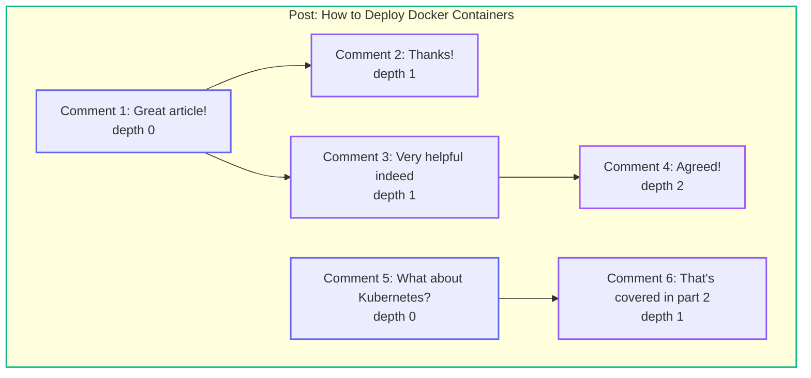
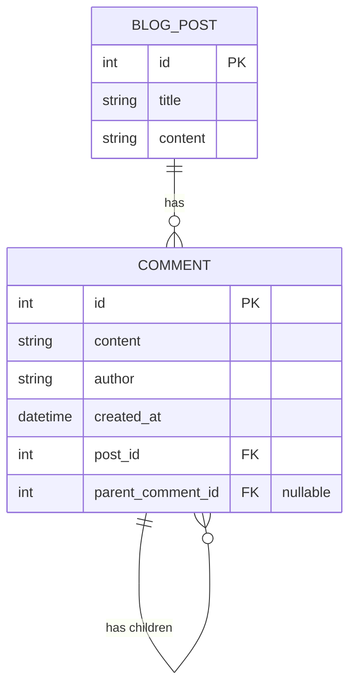
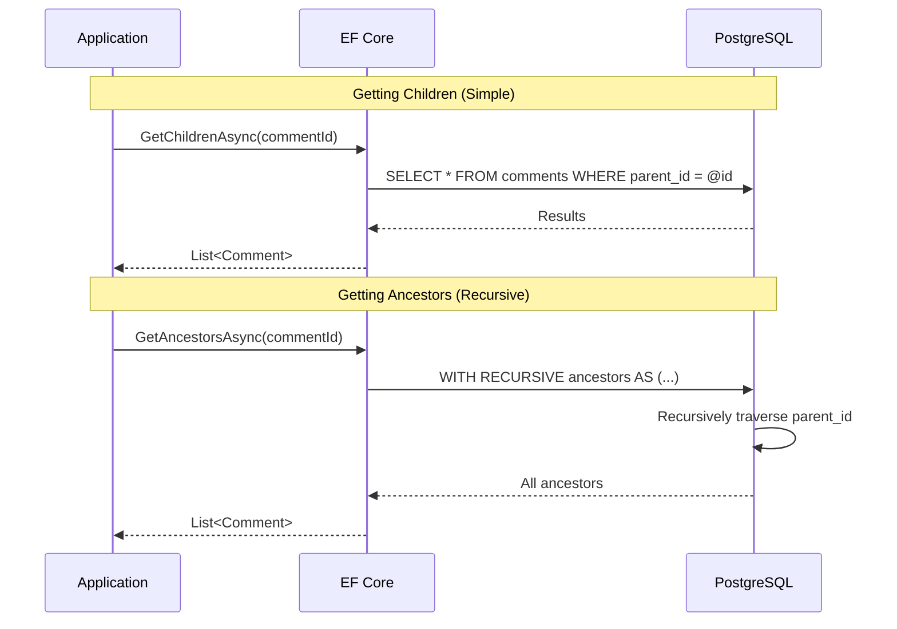
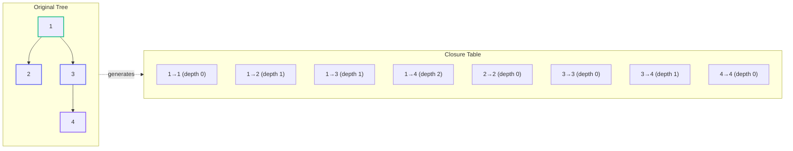
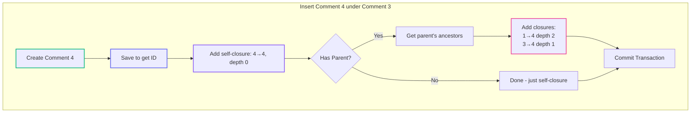
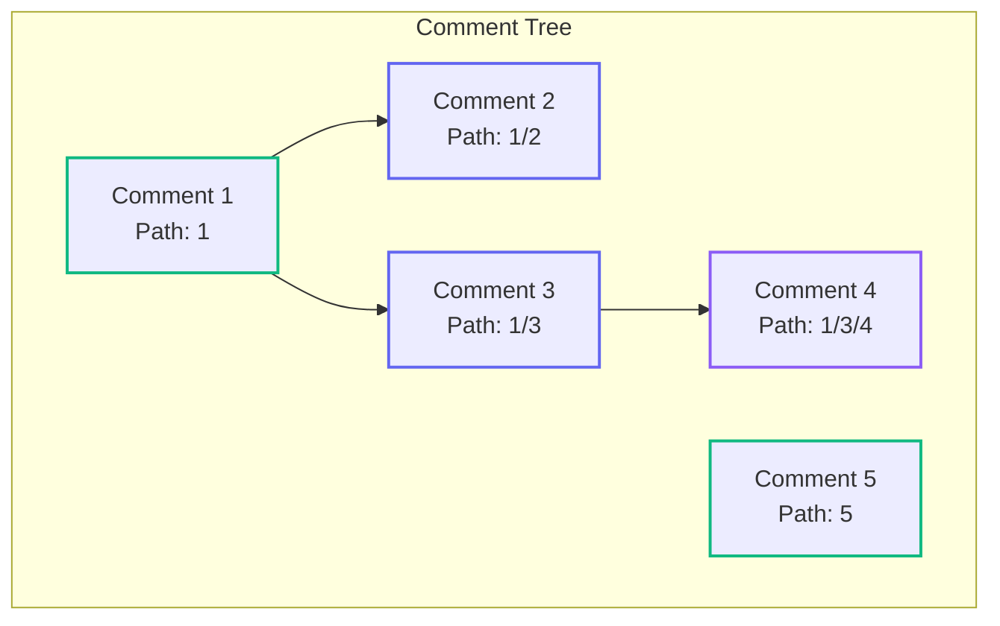
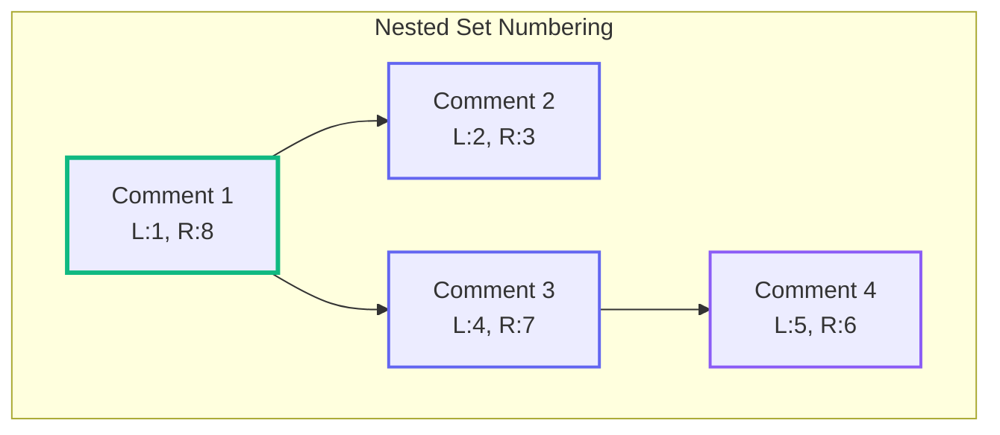
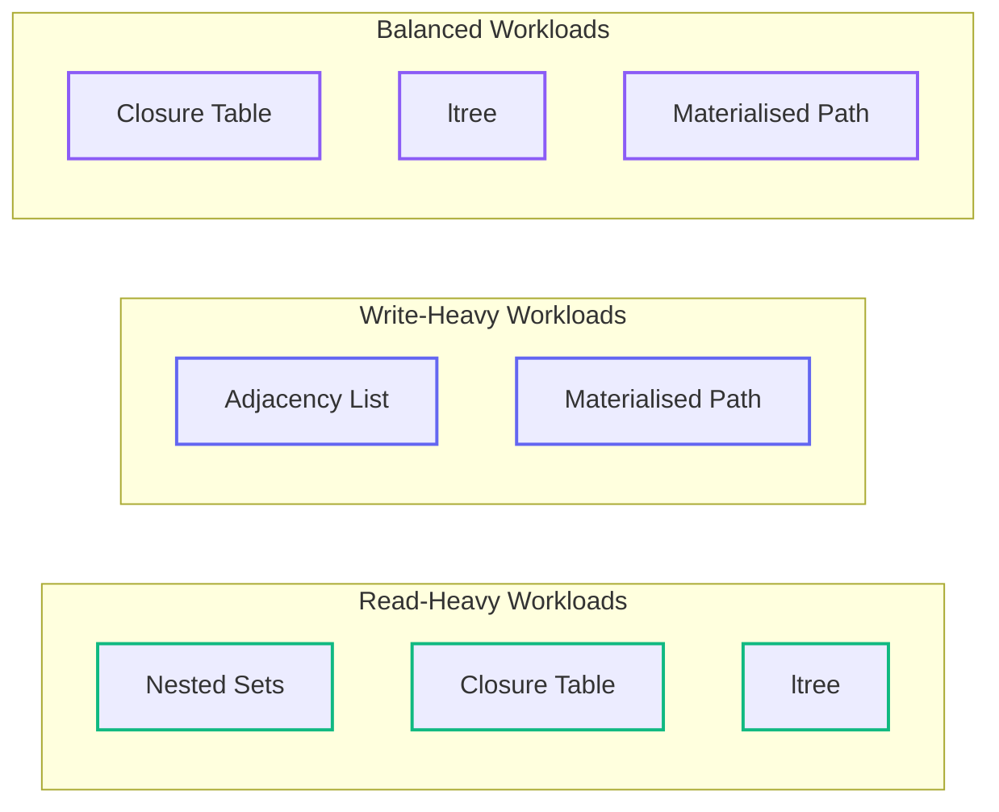
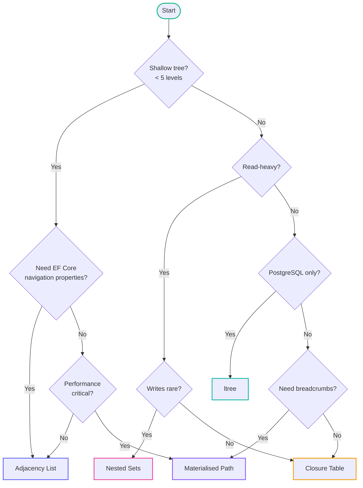

# Data Hierarchies: Managing Hierarchical Data with EF Core and PostgreSQL (Part 1)

<!--category-- Entity Framework, PostgreSQL -->
<datetime class="hidden">2025-12-02T09:00</datetime>

## Introduction

Hierarchical data is everywhere in software development: threaded comments, organisational charts, file systems, product categories, and forum discussions. The eternal question of "how do I store a tree in a relational database?" has haunted developers since the early days of SQL, and frankly, there's still no single answer that makes everyone happy.

In this article - the first in a series on data hierarchies - I'll explore five approaches to storing hierarchical data using [Entity Framework Core](https://learn.microsoft.com/en-us/ef/core/) with [PostgreSQL](https://www.postgresql.org/docs/current/). Each has its own personality, rather like choosing between a sports car and a family estate - they'll both get you there, but the journey will be quite different.

The approaches we'll cover:

1. **Adjacency List** - The straightforward parent-child reference
2. **Closure Table** - Precomputed ancestor-descendant relationships
3. **Materialised Path** - Storing the full path as a string
4. **Nested Sets** - Left and right boundary values
5. **PostgreSQL ltree** - Native hierarchical label trees

[TOC]

## The Example: Threaded Comments

To make the comparisons concrete, we'll use threaded comments as our running example - something this very blog uses. A comment thread might look like this:



We need to support these operations:
- **Get all comments for a post** (with threading structure preserved)
- **Get all ancestors** of a comment (breadcrumb trail)
- **Get all descendants** of a comment (entire subtree)
- **Add a new comment** (as a reply to an existing comment)
- **Delete a subtree** (remove a comment and all replies)
- **Move a subtree** (reparent a comment - rarer, but sometimes needed)

## Approach 1: Adjacency List (Parent Reference)

The adjacency list model is the approach most developers reach for first, and with good reason - it's intuitive. Each node simply stores a reference to its parent. If you've ever drawn a family tree, you've already understood this pattern.

This is the most commonly documented pattern and is well supported by [EF Core's self-referencing relationships](https://learn.microsoft.com/en-us/ef/core/modeling/relationships/self-referencing).

### Entity Definition

```csharp
public class Comment
{
    public int Id { get; set; }
    public string Content { get; set; } = string.Empty;
    public string Author { get; set; } = string.Empty;
    public DateTime CreatedAt { get; set; }

    // Foreign keys
    public int PostId { get; set; }
    public BlogPost Post { get; set; } = null!;

    // Self-referencing hierarchy - the magic happens here
    public int? ParentCommentId { get; set; }
    public Comment? ParentComment { get; set; }
    public ICollection<Comment> Children { get; set; } = new List<Comment>();
}
```

### EF Core Configuration

```csharp
public class CommentConfiguration : IEntityTypeConfiguration<Comment>
{
    public void Configure(EntityTypeBuilder<Comment> builder)
    {
        builder.HasKey(c => c.Id);

        builder.Property(c => c.Content)
            .IsRequired()
            .HasMaxLength(10000);

        builder.Property(c => c.Author)
            .IsRequired()
            .HasMaxLength(200);

        builder.HasOne(c => c.Post)
            .WithMany(p => p.Comments)
            .HasForeignKey(c => c.PostId)
            .OnDelete(DeleteBehavior.Cascade);

        // Self-referencing relationship
        builder.HasOne(c => c.ParentComment)
            .WithMany(c => c.Children)
            .HasForeignKey(c => c.ParentCommentId)
            .OnDelete(DeleteBehavior.Restrict); // Be careful with cascades here!

        builder.HasIndex(c => c.ParentCommentId);
        builder.HasIndex(c => c.PostId);
        builder.HasIndex(c => new { c.PostId, c.CreatedAt });
    }
}
```

### Database Schema



### Operations

**Insert a new comment** - Beautifully simple:

```csharp
public async Task<Comment> AddCommentAsync(
    int postId,
    int? parentId,
    string author,
    string content,
    CancellationToken ct = default)
{
    var comment = new Comment
    {
        PostId = postId,
        ParentCommentId = parentId,
        Author = author,
        Content = content,
        CreatedAt = DateTime.UtcNow
    };

    context.Comments.Add(comment);
    await context.SaveChangesAsync(ct);

    logger.LogInformation("Added comment {CommentId} to post {PostId}", comment.Id, postId);
    return comment;
}
```

**Get immediate children** - Single indexed query:

```csharp
public async Task<List<Comment>> GetChildrenAsync(int commentId, CancellationToken ct = default)
{
    return await context.Comments
        .AsNoTracking()
        .Where(c => c.ParentCommentId == commentId)
        .OrderBy(c => c.CreatedAt)
        .ToListAsync(ct);
}
```

**Get ancestors** - Here's where adjacency lists show their weakness. Without recursive queries, you're stuck doing multiple round trips. Thankfully, PostgreSQL's [recursive CTEs](https://www.postgresql.org/docs/current/queries-with.html#QUERIES-WITH-RECURSIVE) come to the rescue:

```csharp
public async Task<List<Comment>> GetAncestorsAsync(int commentId, CancellationToken ct = default)
{
    // Using raw SQL with recursive CTE - PostgreSQL's secret weapon
    var sql = @"
        WITH RECURSIVE ancestors AS (
            SELECT * FROM comments WHERE id = {0}
            UNION ALL
            SELECT c.* FROM comments c
            INNER JOIN ancestors a ON c.id = a.parent_comment_id
        )
        SELECT * FROM ancestors WHERE id != {0}
        ORDER BY id";

    return await context.Comments
        .FromSqlRaw(sql, commentId)
        .AsNoTracking()
        .ToListAsync(ct);
}
```

**Get entire subtree with depth** - Also requires recursive CTE:

```csharp
public async Task<List<(Comment Comment, int Depth)>> GetDescendantsWithDepthAsync(
    int commentId,
    CancellationToken ct = default)
{
    var sql = @"
        WITH RECURSIVE descendants AS (
            SELECT *, 0 as depth FROM comments WHERE id = {0}
            UNION ALL
            SELECT c.*, d.depth + 1
            FROM comments c
            INNER JOIN descendants d ON c.parent_comment_id = d.id
        )
        SELECT * FROM descendants WHERE id != {0}
        ORDER BY depth, created_at";

    var comments = await context.Comments
        .FromSqlRaw(sql, commentId)
        .AsNoTracking()
        .ToListAsync(ct);

    // Note: EF Core doesn't map the depth column automatically
    // You'd need a DTO or raw ADO.NET for that
    return comments.Select(c => (c, 0)).ToList(); // Simplified
}
```

**Building a nested tree structure** - Often what you actually need for rendering:

```csharp
public async Task<List<CommentTreeNode>> GetCommentTreeAsync(int postId, CancellationToken ct = default)
{
    var allComments = await context.Comments
        .AsNoTracking()
        .Where(c => c.PostId == postId)
        .OrderBy(c => c.CreatedAt)
        .ToListAsync(ct);

    var lookup = allComments.ToLookup(c => c.ParentCommentId);

    return BuildTree(lookup, null);
}

private List<CommentTreeNode> BuildTree(
    ILookup<int?, Comment> lookup,
    int? parentId)
{
    return lookup[parentId]
        .Select(c => new CommentTreeNode
        {
            Comment = c,
            Children = BuildTree(lookup, c.Id)
        })
        .ToList();
}

public class CommentTreeNode
{
    public Comment Comment { get; set; } = null!;
    public List<CommentTreeNode> Children { get; set; } = new();
}
```

### Query Flow Visualisation



### Trade-offs Summary

| Operation | Complexity | Database Round Trips |
|-----------|------------|---------------------|
| Insert | O(1) | 1 |
| Get children | O(1) | 1 |
| Get ancestors | O(d) | 1 (with CTE) or d |
| Get subtree | O(n) | 1 (with CTE) or many |
| Move subtree | O(1) | 1 |
| Delete subtree | O(n) | 1 (with cascade) |

*d = depth, n = subtree size*

**When to use Adjacency List:**
- Shallow hierarchies (fewer than 5-6 levels)
- Frequent subtree moves
- Simple requirements where recursive CTEs are acceptable
- You want EF Core's navigation properties to work naturally

## Approach 2: Closure Table

The closure table approach takes a different philosophy: instead of figuring out relationships at query time, we precompute and store every ancestor-descendant relationship. It's a bit like having a phone book that lists not just who you can call, but every possible chain of "they know someone who knows someone."

This pattern was popularised by [Bill Karwin's "SQL Antipatterns"](https://pragprog.com/titles/bksqla/sql-antipatterns/) book, which provides an excellent deep-dive into the trade-offs. The pattern uses a [many-to-many relationship](https://learn.microsoft.com/en-us/ef/core/modeling/relationships/many-to-many) with a join entity that stores the depth.



### Entity Definitions

```csharp
public class Comment
{
    public int Id { get; set; }
    public string Content { get; set; } = string.Empty;
    public string Author { get; set; } = string.Empty;
    public DateTime CreatedAt { get; set; }

    public int PostId { get; set; }
    public BlogPost Post { get; set; } = null!;

    // Keep the direct parent for convenience (optional but useful)
    public int? ParentCommentId { get; set; }
    public Comment? ParentComment { get; set; }

    // Closure table relationships
    public ICollection<CommentClosure> Ancestors { get; set; } = new List<CommentClosure>();
    public ICollection<CommentClosure> Descendants { get; set; } = new List<CommentClosure>();
}

[Table("comment_closures")]
public class CommentClosure
{
    [Column("ancestor_id")]
    public int AncestorId { get; set; }
    public Comment Ancestor { get; set; } = null!;

    [Column("descendant_id")]
    public int DescendantId { get; set; }
    public Comment Descendant { get; set; } = null!;

    [Column("depth")]
    public int Depth { get; set; } // 0 = self, 1 = parent-child, etc.
}
```

### EF Core Configuration

```csharp
public class CommentClosureConfiguration : IEntityTypeConfiguration<CommentClosure>
{
    public void Configure(EntityTypeBuilder<CommentClosure> builder)
    {
        builder.ToTable("comment_closures");

        // Composite primary key
        builder.HasKey(cc => new { cc.AncestorId, cc.DescendantId });

        builder.HasOne(cc => cc.Ancestor)
            .WithMany(c => c.Descendants)
            .HasForeignKey(cc => cc.AncestorId)
            .OnDelete(DeleteBehavior.Cascade);

        builder.HasOne(cc => cc.Descendant)
            .WithMany(c => c.Ancestors)
            .HasForeignKey(cc => cc.DescendantId)
            .OnDelete(DeleteBehavior.Cascade);

        // Strategic indexes for common queries
        builder.HasIndex(cc => cc.AncestorId);
        builder.HasIndex(cc => cc.DescendantId);
        builder.HasIndex(cc => new { cc.DescendantId, cc.Depth });
        builder.HasIndex(cc => new { cc.AncestorId, cc.Depth });
    }
}
```

### Insert Operation - The Key to Understanding Closures

```csharp
public async Task<Comment> AddCommentAsync(
    int postId,
    int? parentCommentId,
    string author,
    string content,
    CancellationToken ct = default)
{
    await using var transaction = await context.Database.BeginTransactionAsync(ct);

    try
    {
        // Step 1: Create the comment
        var comment = new Comment
        {
            PostId = postId,
            ParentCommentId = parentCommentId,
            Author = author,
            Content = content,
            CreatedAt = DateTime.UtcNow
        };

        context.Comments.Add(comment);
        await context.SaveChangesAsync(ct); // Get the ID

        // Step 2: Build closure entries
        var closures = new List<CommentClosure>
        {
            // Every node is its own ancestor at depth 0
            new CommentClosure
            {
                AncestorId = comment.Id,
                DescendantId = comment.Id,
                Depth = 0
            }
        };

        // Step 3: If there's a parent, inherit all its ancestors
        if (parentCommentId.HasValue)
        {
            var parentAncestors = await context.CommentClosures
                .Where(cc => cc.DescendantId == parentCommentId.Value)
                .ToListAsync(ct);

            foreach (var ancestor in parentAncestors)
            {
                closures.Add(new CommentClosure
                {
                    AncestorId = ancestor.AncestorId,
                    DescendantId = comment.Id,
                    Depth = ancestor.Depth + 1
                });
            }
        }

        context.CommentClosures.AddRange(closures);
        await context.SaveChangesAsync(ct);
        await transaction.CommitAsync(ct);

        logger.LogInformation(
            "Added comment {CommentId} with {ClosureCount} closure entries",
            comment.Id, closures.Count);

        return comment;
    }
    catch (Exception ex)
    {
        await transaction.RollbackAsync(ct);
        logger.LogError(ex, "Failed to add comment to post {PostId}", postId);
        throw;
    }
}
```

### Query Operations - Where Closures Shine

```csharp
/// <summary>
/// Get all ancestors of a comment - single query, no recursion!
/// </summary>
public async Task<List<Comment>> GetAncestorsAsync(int commentId, CancellationToken ct = default)
{
    return await context.CommentClosures
        .AsNoTracking()
        .Where(cc => cc.DescendantId == commentId && cc.Depth > 0)
        .OrderByDescending(cc => cc.Depth) // Root first
        .Select(cc => cc.Ancestor)
        .ToListAsync(ct);
}

/// <summary>
/// Get all descendants - optionally limit depth
/// </summary>
public async Task<List<Comment>> GetDescendantsAsync(
    int commentId,
    int? maxDepth = null,
    CancellationToken ct = default)
{
    var query = context.CommentClosures
        .AsNoTracking()
        .Where(cc => cc.AncestorId == commentId && cc.Depth > 0);

    if (maxDepth.HasValue)
    {
        query = query.Where(cc => cc.Depth <= maxDepth.Value);
    }

    return await query
        .OrderBy(cc => cc.Depth)
        .ThenBy(cc => cc.Descendant.CreatedAt)
        .Select(cc => cc.Descendant)
        .ToListAsync(ct);
}

/// <summary>
/// Get direct children only (depth = 1)
/// </summary>
public async Task<List<Comment>> GetChildrenAsync(int commentId, CancellationToken ct = default)
{
    return await context.CommentClosures
        .AsNoTracking()
        .Where(cc => cc.AncestorId == commentId && cc.Depth == 1)
        .OrderBy(cc => cc.Descendant.CreatedAt)
        .Select(cc => cc.Descendant)
        .ToListAsync(ct);
}

/// <summary>
/// Get the depth of a comment in the tree
/// </summary>
public async Task<int> GetDepthAsync(int commentId, CancellationToken ct = default)
{
    return await context.CommentClosures
        .Where(cc => cc.DescendantId == commentId)
        .MaxAsync(cc => cc.Depth, ct);
}
```

### Delete Subtree - Cascade Takes Care of Most of It

```csharp
public async Task DeleteSubtreeAsync(int commentId, CancellationToken ct = default)
{
    // Get all descendants (including self)
    var descendantIds = await context.CommentClosures
        .Where(cc => cc.AncestorId == commentId)
        .Select(cc => cc.DescendantId)
        .ToListAsync(ct);

    if (!descendantIds.Any())
    {
        logger.LogWarning("Comment {CommentId} not found for deletion", commentId);
        return;
    }

    // EF Core 7+ bulk delete - efficient!
    // See: https://learn.microsoft.com/en-us/ef/core/saving/execute-insert-update-delete
    var deletedClosures = await context.CommentClosures
        .Where(cc => descendantIds.Contains(cc.DescendantId))
        .ExecuteDeleteAsync(ct);

    var deletedComments = await context.Comments
        .Where(c => descendantIds.Contains(c.Id))
        .ExecuteDeleteAsync(ct);

    logger.LogInformation(
        "Deleted subtree: {CommentCount} comments, {ClosureCount} closure entries",
        deletedComments, deletedClosures);
}
```

### Moving Subtrees - The Tricky Bit

```csharp
public async Task MoveSubtreeAsync(
    int commentId,
    int newParentId,
    CancellationToken ct = default)
{
    await using var transaction = await context.Database.BeginTransactionAsync(ct);

    try
    {
        // Step 1: Get subtree members
        var subtreeIds = await context.CommentClosures
            .Where(cc => cc.AncestorId == commentId)
            .Select(cc => cc.DescendantId)
            .ToListAsync(ct);

        // Step 2: Delete old external relationships
        // (Keep internal subtree relationships intact!)
        await context.CommentClosures
            .Where(cc => subtreeIds.Contains(cc.DescendantId)
                      && !subtreeIds.Contains(cc.AncestorId))
            .ExecuteDeleteAsync(ct);

        // Step 3: Get new parent's ancestors
        var newAncestors = await context.CommentClosures
            .Where(cc => cc.DescendantId == newParentId)
            .ToListAsync(ct);

        // Step 4: Create new closure entries
        var newClosures = new List<CommentClosure>();

        foreach (var subtreeNodeId in subtreeIds)
        {
            // Get this node's depth within the subtree
            var depthInSubtree = await context.CommentClosures
                .Where(cc => cc.AncestorId == commentId && cc.DescendantId == subtreeNodeId)
                .Select(cc => cc.Depth)
                .FirstAsync(ct);

            foreach (var ancestor in newAncestors)
            {
                newClosures.Add(new CommentClosure
                {
                    AncestorId = ancestor.AncestorId,
                    DescendantId = subtreeNodeId,
                    Depth = ancestor.Depth + 1 + depthInSubtree
                });
            }
        }

        context.CommentClosures.AddRange(newClosures);

        // Step 5: Update direct parent reference
        await context.Comments
            .Where(c => c.Id == commentId)
            .ExecuteUpdateAsync(s => s.SetProperty(c => c.ParentCommentId, newParentId), ct);

        await context.SaveChangesAsync(ct);
        await transaction.CommitAsync(ct);

        logger.LogInformation(
            "Moved comment {CommentId} to new parent {NewParentId}",
            commentId, newParentId);
    }
    catch (Exception ex)
    {
        await transaction.RollbackAsync(ct);
        logger.LogError(ex, "Failed to move comment {CommentId}", commentId);
        throw;
    }
}
```

### Closure Table Data Flow



## Approach 3: Materialised Path

The materialised path approach stores the complete ancestry as a delimited string. Think of it as storing the full postal address rather than just the street name - `"UK/Scotland/Edinburgh/Princes Street"` tells you exactly where you are in the hierarchy.

This pattern is sometimes called "Path Enumeration" and is documented in various database pattern resources. For PostgreSQL-specific optimisation, the [text_pattern_ops operator class](https://www.postgresql.org/docs/current/indexes-opclass.html) is essential for efficient LIKE prefix searches.



### Entity Definition

```csharp
public class Comment
{
    public int Id { get; set; }
    public string Content { get; set; } = string.Empty;
    public string Author { get; set; } = string.Empty;
    public DateTime CreatedAt { get; set; }

    public int PostId { get; set; }
    public BlogPost Post { get; set; } = null!;

    /// <summary>
    /// Materialised path using '/' separator
    /// e.g., "1/3/7" means root is 1, parent is 3, this is 7
    /// </summary>
    [MaxLength(1000)]
    public string Path { get; set; } = string.Empty;

    /// <summary>
    /// Computed depth for convenience - not stored in database
    /// </summary>
    [NotMapped]
    public int Depth => string.IsNullOrEmpty(Path) ? 0 : Path.Count(c => c == '/');

    /// <summary>
    /// Extract ancestor IDs from path
    /// </summary>
    [NotMapped]
    public IEnumerable<int> AncestorIds => Path
        .Split('/', StringSplitOptions.RemoveEmptyEntries)
        .Select(int.Parse)
        .SkipLast(1); // Exclude self
}
```

### EF Core Configuration with PostgreSQL-Optimised Index

```csharp
public class CommentConfiguration : IEntityTypeConfiguration<Comment>
{
    public void Configure(EntityTypeBuilder<Comment> builder)
    {
        builder.HasKey(c => c.Id);

        builder.Property(c => c.Path)
            .HasMaxLength(1000)
            .IsRequired();

        // Standard B-tree index works for prefix searches
        builder.HasIndex(c => c.Path);

        builder.HasIndex(c => c.PostId);
        builder.HasIndex(c => new { c.PostId, c.Path });
    }
}

// In your migration, add this for better LIKE performance:
public partial class AddPathPatternIndex : Migration
{
    protected override void Up(MigrationBuilder migrationBuilder)
    {
        // PostgreSQL text_pattern_ops index for prefix matching
        migrationBuilder.Sql(@"
            CREATE INDEX ix_comments_path_pattern
            ON comments (path text_pattern_ops)
            WHERE path IS NOT NULL;");
    }

    protected override void Down(MigrationBuilder migrationBuilder)
    {
        migrationBuilder.Sql("DROP INDEX IF EXISTS ix_comments_path_pattern;");
    }
}
```

### Operations

```csharp
public async Task<Comment> AddCommentAsync(
    int postId,
    int? parentCommentId,
    string author,
    string content,
    CancellationToken ct = default)
{
    var comment = new Comment
    {
        PostId = postId,
        Author = author,
        Content = content,
        CreatedAt = DateTime.UtcNow,
        Path = string.Empty // Set after we get the ID
    };

    context.Comments.Add(comment);
    await context.SaveChangesAsync(ct); // Generate ID

    // Build the path
    if (parentCommentId.HasValue)
    {
        var parentPath = await context.Comments
            .Where(c => c.Id == parentCommentId.Value)
            .Select(c => c.Path)
            .FirstOrDefaultAsync(ct);

        if (parentPath == null)
        {
            throw new InvalidOperationException($"Parent comment {parentCommentId} not found");
        }

        comment.Path = $"{parentPath}/{comment.Id}";
    }
    else
    {
        comment.Path = comment.Id.ToString();
    }

    await context.SaveChangesAsync(ct);
    return comment;
}

/// <summary>
/// Get ancestors - just parse the path! No database query needed (if you have the comment).
/// </summary>
public List<int> GetAncestorIds(Comment comment)
{
    return comment.Path
        .Split('/', StringSplitOptions.RemoveEmptyEntries)
        .Select(int.Parse)
        .Where(id => id != comment.Id)
        .ToList();
}

/// <summary>
/// Get ancestors with full Comment objects
/// </summary>
public async Task<List<Comment>> GetAncestorsAsync(int commentId, CancellationToken ct = default)
{
    var comment = await context.Comments.FindAsync(new object[] { commentId }, ct);
    if (comment == null) return new List<Comment>();

    var ancestorIds = GetAncestorIds(comment);

    if (!ancestorIds.Any()) return new List<Comment>();

    var ancestors = await context.Comments
        .AsNoTracking()
        .Where(c => ancestorIds.Contains(c.Id))
        .ToListAsync(ct);

    // Return in path order (root first)
    return ancestorIds.Select(id => ancestors.First(a => a.Id == id)).ToList();
}

/// <summary>
/// Get all descendants using LIKE prefix search
/// </summary>
public async Task<List<Comment>> GetDescendantsAsync(int commentId, CancellationToken ct = default)
{
    var comment = await context.Comments.FindAsync(new object[] { commentId }, ct);
    if (comment == null) return new List<Comment>();

    var pathPrefix = $"{comment.Path}/";

    return await context.Comments
        .AsNoTracking()
        .Where(c => c.Path.StartsWith(pathPrefix))
        .OrderBy(c => c.Path) // Gives us depth-first order!
        .ToListAsync(ct);
}

/// <summary>
/// Get children - descendants at exactly depth + 1
/// </summary>
public async Task<List<Comment>> GetChildrenAsync(int commentId, CancellationToken ct = default)
{
    var comment = await context.Comments.FindAsync(new object[] { commentId }, ct);
    if (comment == null) return new List<Comment>();

    var pathPrefix = $"{comment.Path}/";
    var childDepth = comment.Depth + 1;

    // Unfortunately, depth calculation needs client-side filtering
    var potentialChildren = await context.Comments
        .AsNoTracking()
        .Where(c => c.Path.StartsWith(pathPrefix))
        .ToListAsync(ct);

    return potentialChildren
        .Where(c => c.Depth == childDepth)
        .OrderBy(c => c.CreatedAt)
        .ToList();
}

/// <summary>
/// Move a subtree - requires updating all descendant paths
/// </summary>
public async Task MoveSubtreeAsync(
    int commentId,
    int newParentId,
    CancellationToken ct = default)
{
    var comment = await context.Comments.FindAsync(new object[] { commentId }, ct);
    var newParent = await context.Comments.FindAsync(new object[] { newParentId }, ct);

    if (comment == null || newParent == null)
    {
        throw new InvalidOperationException("Comment or new parent not found");
    }

    // Prevent creating a cycle
    if (newParent.Path.StartsWith($"{comment.Path}/") || newParent.Id == comment.Id)
    {
        throw new InvalidOperationException("Cannot move a node to its own descendant");
    }

    var oldPath = comment.Path;
    var newPath = $"{newParent.Path}/{comment.Id}";

    // Get all nodes in the subtree
    var subtree = await context.Comments
        .Where(c => c.Path == oldPath || c.Path.StartsWith($"{oldPath}/"))
        .ToListAsync(ct);

    // Update all paths
    foreach (var node in subtree)
    {
        node.Path = node.Path.Replace(oldPath, newPath);
    }

    await context.SaveChangesAsync(ct);

    logger.LogInformation(
        "Moved subtree from {OldPath} to {NewPath}, affected {Count} nodes",
        oldPath, newPath, subtree.Count);
}

/// <summary>
/// Delete a subtree using LIKE
/// </summary>
public async Task DeleteSubtreeAsync(int commentId, CancellationToken ct = default)
{
    var comment = await context.Comments.FindAsync(new object[] { commentId }, ct);
    if (comment == null) return;

    var deleted = await context.Comments
        .Where(c => c.Path == comment.Path || c.Path.StartsWith($"{comment.Path}/"))
        .ExecuteDeleteAsync(ct);

    logger.LogInformation("Deleted {Count} comments in subtree", deleted);
}
```

### Breadcrumb Generation - Where Materialised Paths Excel

```csharp
/// <summary>
/// Build a breadcrumb trail for UI display
/// </summary>
public async Task<List<BreadcrumbItem>> GetBreadcrumbsAsync(
    int commentId,
    CancellationToken ct = default)
{
    var comment = await context.Comments
        .AsNoTracking()
        .Include(c => c.Post)
        .FirstOrDefaultAsync(c => c.Id == commentId, ct);

    if (comment == null) return new List<BreadcrumbItem>();

    var ancestorIds = GetAncestorIds(comment);

    var ancestors = ancestorIds.Any()
        ? await context.Comments
            .AsNoTracking()
            .Where(c => ancestorIds.Contains(c.Id))
            .ToDictionaryAsync(c => c.Id, ct)
        : new Dictionary<int, Comment>();

    var breadcrumbs = new List<BreadcrumbItem>
    {
        new() { Title = comment.Post.Title, Url = $"/post/{comment.PostId}" }
    };

    // Add ancestors in order
    foreach (var id in ancestorIds)
    {
        if (ancestors.TryGetValue(id, out var ancestor))
        {
            breadcrumbs.Add(new BreadcrumbItem
            {
                Title = $"Comment by {ancestor.Author}",
                Url = $"/post/{comment.PostId}#comment-{id}"
            });
        }
    }

    // Add current
    breadcrumbs.Add(new BreadcrumbItem
    {
        Title = $"Comment by {comment.Author}",
        Url = $"/post/{comment.PostId}#comment-{commentId}",
        IsCurrent = true
    });

    return breadcrumbs;
}

public class BreadcrumbItem
{
    public string Title { get; set; } = string.Empty;
    public string Url { get; set; } = string.Empty;
    public bool IsCurrent { get; set; }
}
```

## Approach 4: Nested Sets

Nested sets take a completely different approach. Instead of storing relationships, we assign each node a left and right boundary number from a depth-first traversal. The genius is that all descendants of a node have left/right values *between* the parent's boundaries.

This model was popularised by [Joe Celko](https://en.wikipedia.org/wiki/Joe_Celko) in his book ["Trees and Hierarchies in SQL for Smarties"](https://www.amazon.co.uk/Joe-Celkos-Trees-Hierarchies-Smarties/dp/1558609202). It's also covered in his more general ["SQL for Smarties"](https://www.amazon.co.uk/Joe-Celkos-SQL-Smarties-Programming/dp/0128007613) tome. I actually [wrote about this technique back in 2004](/blog/1188) when I first discovered it - some patterns truly stand the test of time!

For more academic background, Celko's original articles on [Intelligent Enterprise](http://www.ibase.ru/develop/docs/tree_in_sql.pdf) are worth reading, and there's a good [overview on Wikipedia](https://en.wikipedia.org/wiki/Nested_set_model).



The traversal assigns numbers like this:

```
         1 ─────────────────────── 8
         │    Comment 1            │
         │                         │
    2 ─── 3           4 ─────────── 7
    │ C2 │            │  Comment 3  │
    │    │            │             │
                 5 ─── 6
                 │ C4 │
```

**The key insight:** Node X is a descendant of Y if `Y.Left < X.Left AND X.Right < Y.Right`

### Entity Definition

```csharp
public class Comment
{
    public int Id { get; set; }
    public string Content { get; set; } = string.Empty;
    public string Author { get; set; } = string.Empty;
    public DateTime CreatedAt { get; set; }

    public int PostId { get; set; }
    public BlogPost Post { get; set; } = null!;

    // Nested set boundaries
    [Column("lft")] // 'left' is a reserved word in SQL
    public int Left { get; set; }

    [Column("rgt")]
    public int Right { get; set; }

    // Store depth for convenience (could be computed but it's faster to store)
    public int Depth { get; set; }

    /// <summary>
    /// A leaf node has no space between left and right for children
    /// </summary>
    [NotMapped]
    public bool IsLeaf => Right == Left + 1;

    /// <summary>
    /// Count descendants without loading them - magic!
    /// </summary>
    [NotMapped]
    public int DescendantCount => (Right - Left - 1) / 2;
}
```

### EF Core Configuration

```csharp
public class CommentConfiguration : IEntityTypeConfiguration<Comment>
{
    public void Configure(EntityTypeBuilder<Comment> builder)
    {
        builder.HasKey(c => c.Id);

        builder.Property(c => c.Left).HasColumnName("lft").IsRequired();
        builder.Property(c => c.Right).HasColumnName("rgt").IsRequired();
        builder.Property(c => c.Depth).IsRequired();

        // Critical indexes for range queries
        builder.HasIndex(c => c.Left);
        builder.HasIndex(c => c.Right);
        builder.HasIndex(c => new { c.PostId, c.Left });
        builder.HasIndex(c => new { c.PostId, c.Left, c.Right });
    }
}
```

### Query Operations - Beautifully Simple

```csharp
/// <summary>
/// Get all descendants - single range query!
/// </summary>
public async Task<List<Comment>> GetDescendantsAsync(int commentId, CancellationToken ct = default)
{
    var node = await context.Comments.FindAsync(new object[] { commentId }, ct);
    if (node == null) return new List<Comment>();

    return await context.Comments
        .AsNoTracking()
        .Where(c => c.PostId == node.PostId
                 && c.Left > node.Left
                 && c.Right < node.Right)
        .OrderBy(c => c.Left) // Gives depth-first order automatically!
        .ToListAsync(ct);
}

/// <summary>
/// Get all ancestors - also a simple range query
/// </summary>
public async Task<List<Comment>> GetAncestorsAsync(int commentId, CancellationToken ct = default)
{
    var node = await context.Comments.FindAsync(new object[] { commentId }, ct);
    if (node == null) return new List<Comment>();

    return await context.Comments
        .AsNoTracking()
        .Where(c => c.PostId == node.PostId
                 && c.Left < node.Left
                 && c.Right > node.Right)
        .OrderBy(c => c.Left) // Root first
        .ToListAsync(ct);
}

/// <summary>
/// Get entire tree in perfect display order
/// </summary>
public async Task<List<Comment>> GetTreeAsync(int postId, CancellationToken ct = default)
{
    return await context.Comments
        .AsNoTracking()
        .Where(c => c.PostId == postId)
        .OrderBy(c => c.Left)
        .ToListAsync(ct);
}

/// <summary>
/// Count descendants without loading - uses the nested set property
/// </summary>
public async Task<int> CountDescendantsAsync(int commentId, CancellationToken ct = default)
{
    var node = await context.Comments
        .AsNoTracking()
        .Where(c => c.Id == commentId)
        .Select(c => new { c.Left, c.Right })
        .FirstOrDefaultAsync(ct);

    if (node == null) return 0;

    // The magic formula!
    return (node.Right - node.Left - 1) / 2;
}
```

### Insert Operation - The Price We Pay

```csharp
/// <summary>
/// Insert a new comment - requires updating many rows
/// </summary>
public async Task<Comment> AddCommentAsync(
    int postId,
    int? parentCommentId,
    string author,
    string content,
    CancellationToken ct = default)
{
    await using var transaction = await context.Database.BeginTransactionAsync(ct);

    try
    {
        int newLeft, newRight, newDepth;

        if (parentCommentId.HasValue)
        {
            var parent = await context.Comments.FindAsync(new object[] { parentCommentId.Value }, ct);
            if (parent == null)
            {
                throw new InvalidOperationException($"Parent comment {parentCommentId} not found");
            }

            // Insert at parent's right boundary
            newLeft = parent.Right;
            newRight = newLeft + 1;
            newDepth = parent.Depth + 1;

            // Make room: shift everything to the right
            await context.Comments
                .Where(c => c.PostId == postId && c.Left >= newLeft)
                .ExecuteUpdateAsync(s => s.SetProperty(c => c.Left, c => c.Left + 2), ct);

            await context.Comments
                .Where(c => c.PostId == postId && c.Right >= newLeft)
                .ExecuteUpdateAsync(s => s.SetProperty(c => c.Right, c => c.Right + 2), ct);
        }
        else
        {
            // New root-level comment
            var maxRight = await context.Comments
                .Where(c => c.PostId == postId)
                .MaxAsync(c => (int?)c.Right, ct) ?? 0;

            newLeft = maxRight + 1;
            newRight = maxRight + 2;
            newDepth = 0;
        }

        var comment = new Comment
        {
            PostId = postId,
            Author = author,
            Content = content,
            CreatedAt = DateTime.UtcNow,
            Left = newLeft,
            Right = newRight,
            Depth = newDepth
        };

        context.Comments.Add(comment);
        await context.SaveChangesAsync(ct);
        await transaction.CommitAsync(ct);

        return comment;
    }
    catch (Exception ex)
    {
        await transaction.RollbackAsync(ct);
        logger.LogError(ex, "Failed to insert comment into nested set");
        throw;
    }
}
```

### Delete Operation - Also Requires Gap Closing

```csharp
public async Task DeleteSubtreeAsync(int commentId, CancellationToken ct = default)
{
    await using var transaction = await context.Database.BeginTransactionAsync(ct);

    try
    {
        var node = await context.Comments.FindAsync(new object[] { commentId }, ct);
        if (node == null) return;

        var width = node.Right - node.Left + 1;
        var postId = node.PostId;

        // Delete the subtree
        await context.Comments
            .Where(c => c.PostId == postId
                     && c.Left >= node.Left
                     && c.Right <= node.Right)
            .ExecuteDeleteAsync(ct);

        // Close the gap
        await context.Comments
            .Where(c => c.PostId == postId && c.Left > node.Right)
            .ExecuteUpdateAsync(s => s.SetProperty(c => c.Left, c => c.Left - width), ct);

        await context.Comments
            .Where(c => c.PostId == postId && c.Right > node.Right)
            .ExecuteUpdateAsync(s => s.SetProperty(c => c.Right, c => c.Right - width), ct);

        await transaction.CommitAsync(ct);

        logger.LogInformation(
            "Deleted nested set subtree, width {Width}, closed gap", width);
    }
    catch (Exception ex)
    {
        await transaction.RollbackAsync(ct);
        logger.LogError(ex, "Failed to delete nested set subtree");
        throw;
    }
}
```

## Approach 5: PostgreSQL ltree

PostgreSQL provides a native [`ltree` extension](https://www.postgresql.org/docs/current/ltree.html) specifically designed for hierarchical data. It's like materialised paths, but with database-level optimisation and powerful pattern matching.

The [official PostgreSQL documentation](https://www.postgresql.org/docs/current/ltree.html) covers the full operator set, and there's good coverage in the [Npgsql documentation](https://www.npgsql.org/efcore/mapping/other.html#ltree-lquery-and-ltxtquery) for EF Core usage.

### Enable the Extension

```sql
CREATE EXTENSION IF NOT EXISTS ltree;
```

### Entity Definition

```csharp
public class Comment
{
    public int Id { get; set; }
    public string Content { get; set; } = string.Empty;
    public string Author { get; set; } = string.Empty;
    public DateTime CreatedAt { get; set; }

    public int PostId { get; set; }
    public BlogPost Post { get; set; } = null!;

    /// <summary>
    /// ltree path - uses dots as separators
    /// e.g., "1.3.7" for comment 7 under comment 3 under comment 1
    /// </summary>
    [Column(TypeName = "ltree")]
    public string Path { get; set; } = string.Empty;
}
```

### EF Core Configuration

```csharp
public class CommentConfiguration : IEntityTypeConfiguration<Comment>
{
    public void Configure(EntityTypeBuilder<Comment> builder)
    {
        builder.HasKey(c => c.Id);

        builder.Property(c => c.Path)
            .HasColumnType("ltree")
            .IsRequired();

        builder.HasIndex(c => c.PostId);
    }
}

// Migration for GiST index
public partial class AddLtreeIndex : Migration
{
    protected override void Up(MigrationBuilder migrationBuilder)
    {
        migrationBuilder.Sql("CREATE EXTENSION IF NOT EXISTS ltree;");

        migrationBuilder.Sql(@"
            CREATE INDEX ix_comments_path_gist
            ON comments USING GIST (path);");
    }

    protected override void Down(MigrationBuilder migrationBuilder)
    {
        migrationBuilder.Sql("DROP INDEX IF EXISTS ix_comments_path_gist;");
    }
}
```

### ltree Operations - Using Raw SQL for Operators

```csharp
public async Task<Comment> AddCommentAsync(
    int postId,
    int? parentCommentId,
    string author,
    string content,
    CancellationToken ct = default)
{
    var comment = new Comment
    {
        PostId = postId,
        Author = author,
        Content = content,
        CreatedAt = DateTime.UtcNow
    };

    context.Comments.Add(comment);
    await context.SaveChangesAsync(ct);

    if (parentCommentId.HasValue)
    {
        var parentPath = await context.Comments
            .Where(c => c.Id == parentCommentId.Value)
            .Select(c => c.Path)
            .FirstAsync(ct);

        comment.Path = $"{parentPath}.{comment.Id}";
    }
    else
    {
        comment.Path = comment.Id.ToString();
    }

    await context.SaveChangesAsync(ct);
    return comment;
}

/// <summary>
/// Get ancestors using ltree @> operator
/// </summary>
public async Task<List<Comment>> GetAncestorsAsync(int commentId, CancellationToken ct = default)
{
    return await context.Comments
        .FromSqlInterpolated($@"
            SELECT c.* FROM comments c
            WHERE c.path @> (SELECT path FROM comments WHERE id = {commentId})
            AND c.id != {commentId}
            ORDER BY nlevel(c.path)")
        .AsNoTracking()
        .ToListAsync(ct);
}

/// <summary>
/// Get descendants using ltree <@ operator
/// </summary>
public async Task<List<Comment>> GetDescendantsAsync(int commentId, CancellationToken ct = default)
{
    return await context.Comments
        .FromSqlInterpolated($@"
            SELECT c.* FROM comments c
            WHERE c.path <@ (SELECT path FROM comments WHERE id = {commentId})
            AND c.id != {commentId}
            ORDER BY c.path")
        .AsNoTracking()
        .ToListAsync(ct);
}

/// <summary>
/// Get children using nlevel() for depth filtering
/// </summary>
public async Task<List<Comment>> GetChildrenAsync(int commentId, CancellationToken ct = default)
{
    return await context.Comments
        .FromSqlInterpolated($@"
            SELECT c.* FROM comments c
            WHERE c.path <@ (SELECT path FROM comments WHERE id = {commentId})
            AND nlevel(c.path) = nlevel((SELECT path FROM comments WHERE id = {commentId})) + 1
            ORDER BY c.created_at")
        .AsNoTracking()
        .ToListAsync(ct);
}

/// <summary>
/// Pattern matching with lquery - find all comments at depth 2 under a root
/// </summary>
public async Task<List<Comment>> GetGrandchildrenAsync(int commentId, CancellationToken ct = default)
{
    // lquery pattern: *.* means exactly two more levels
    return await context.Comments
        .FromSqlInterpolated($@"
            SELECT * FROM comments
            WHERE path ~ (
                (SELECT path FROM comments WHERE id = {commentId})::text || '.*.*'
            )::lquery
            AND nlevel(path) = nlevel((SELECT path FROM comments WHERE id = {commentId})) + 2")
        .AsNoTracking()
        .ToListAsync(ct);
}

/// <summary>
/// Move subtree - uses ltree functions
/// </summary>
public async Task MoveSubtreeAsync(
    int commentId,
    int newParentId,
    CancellationToken ct = default)
{
    await context.Database.ExecuteSqlInterpolatedAsync($@"
        UPDATE comments
        SET path = (
            (SELECT path FROM comments WHERE id = {newParentId})
            || subpath(path, nlevel((SELECT path FROM comments WHERE id = {commentId})) - 1)
        )
        WHERE path <@ (SELECT path FROM comments WHERE id = {commentId})", ct);
}
```

### ltree Operators Reference

| Operator | Description | Example |
|----------|-------------|---------|
| `@>` | Is ancestor of (contains) | `'1.2'::ltree @> '1.2.3'::ltree` → true |
| `<@` | Is descendant of (contained by) | `'1.2.3'::ltree <@ '1.2'::ltree` → true |
| `~` | Matches lquery pattern | `'1.2.3'::ltree ~ '1.*'::lquery` → true |
| `\|\|` | Concatenate paths | `'1.2'::ltree \|\| '3'` → '1.2.3' |
| `nlevel()` | Get depth | `nlevel('1.2.3'::ltree)` → 3 |
| `subpath()` | Extract portion | `subpath('1.2.3.4'::ltree, 1, 2)` → '2.3' |

## Comparison Summary



| Approach | Insert | Query Subtree | Query Ancestors | Move Subtree | Storage | EF Core Support |
|----------|--------|---------------|-----------------|--------------|---------|-----------------|
| **Adjacency List** | O(1) | O(n) with CTE | O(d) with CTE | O(1) | Minimal | Excellent |
| **Closure Table** | O(d) | O(1) | O(1) | O(s × d) | O(n × d) | Good |
| **Materialised Path** | O(1) | O(1)* | O(1) | O(s) | O(d) per node | Good |
| **Nested Sets** | O(n) | O(1) | O(1) | O(n) | Minimal | Good |
| **ltree** | O(1) | O(1) | O(1) | O(s) | O(d) per node | Requires raw SQL |

*n = total nodes, d = depth, s = subtree size*
**With proper index*

## Choosing the Right Approach



**Use Adjacency List when:**
- Your hierarchy is shallow (fewer than 5-6 levels)
- You need EF Core's navigation properties
- Frequent subtree moves
- Simple requirements where recursive CTEs are acceptable

**Use Closure Table when:**
- Read performance is critical
- You need to query at arbitrary depths
- You rarely move subtrees
- Storage space isn't a major concern

**Use Materialised Path when:**
- You need human-readable paths (breadcrumbs)
- Ancestors are queried more than descendants
- Tree depth is bounded
- You want simpler implementation than closure table

**Use Nested Sets when:**
- You have a read-heavy, write-rarely tree
- You need the entire tree in depth-first order
- You need to count descendants without loading them
- Content is mostly static (like a category tree)

**Use ltree when:**
- You're committed to PostgreSQL
- You want the best of materialised paths with better performance
- You need powerful pattern matching
- You can accept raw SQL for hierarchy queries

## Real-World Implementation

In this blog, we use a **Closure Table** approach for comments. The rationale:

1. Comments are read far more often than written
2. We need to display nested comment threads efficiently
3. Depth-limiting queries are important for performance (we cap at 5 levels deep)
4. Moving comments is rare (moderators occasionally need to do this)

The actual entities from the codebase:

```csharp
public class CommentEntity
{
    [Key]
    [DatabaseGenerated(DatabaseGeneratedOption.Identity)]
    public int Id { get; set; }

    public CommentStatus Status { get; set; } = CommentStatus.Pending;
    public string Author { get; set; }
    public string? HtmlContent { get; set; }
    public string Content { get; set; }
    public DateTime CreatedAt { get; set; }

    [NotMapped]
    public int CurrentDepth { get; set; } = 0;

    public int PostId { get; set; }
    public BlogPostEntity Post { get; set; }

    public int? ParentCommentId { get; set; }
    public CommentEntity ParentComment { get; set; }

    // Closure table relationships
    public ICollection<CommentClosure> Ancestors { get; set; } = new List<CommentClosure>();
    public ICollection<CommentClosure> Descendants { get; set; } = new List<CommentClosure>();
}

[Table("comment_closures")]
public class CommentClosure
{
    [Column("ancestor_id")]
    public int AncestorId { get; set; }
    public CommentEntity Ancestor { get; set; }

    [Column("descendant_id")]
    public int DescendantId { get; set; }
    public CommentEntity Descendant { get; set; }

    [Column("depth")]
    public int Depth { get; set; }
}
```

## Conclusion

There's no universally "best" approach to hierarchical data - if there were, we wouldn't have five different patterns to choose from. The right choice depends on your specific access patterns:

- **High read, low write** → Nested Sets or Closure Table
- **High write, moderate read** → Adjacency List or Materialised Path
- **PostgreSQL-only and performance matters** → ltree
- **Need flexibility for everything** → Closure Table is the most versatile

Whatever approach you choose, remember to:
1. Add appropriate indexes (they make a massive difference)
2. Use transactions for multi-step operations
3. Consider caching for read-heavy hierarchies
4. Test with realistic data volumes - a hundred nodes behaves very differently from a million

The code examples in this article are available in the [mostlylucidweb repository](https://github.com/scottgal/mostlylucidweb), where you can see the closure table implementation in action for the comment system.

## Coming in Part 2

In the next article, we'll step away from EF Core and explore manual implementations using raw SQL and [Dapper](https://github.com/DapperLib/Dapper). Sometimes you need more control over the generated queries, or you're working with a codebase that doesn't use EF Core. We'll look at how to implement these same patterns with direct database access and compare the performance characteristics. Stay tuned!
