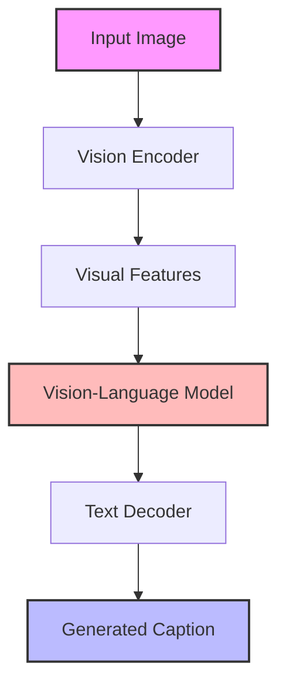
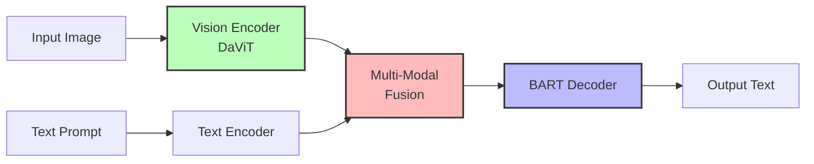
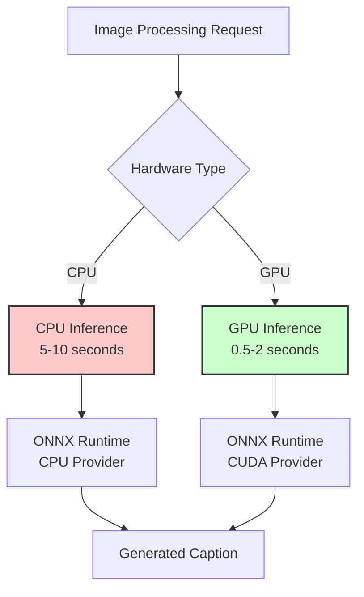
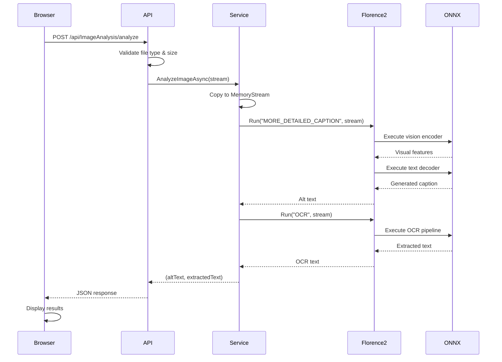
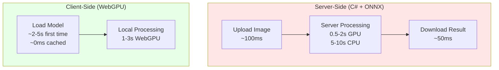
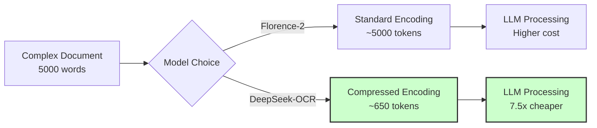
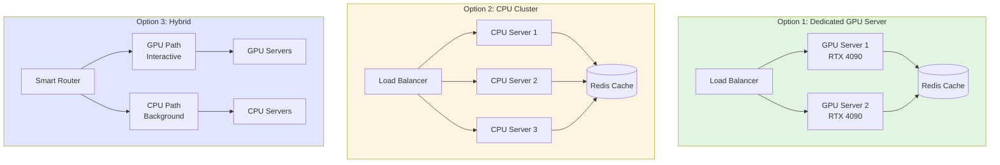
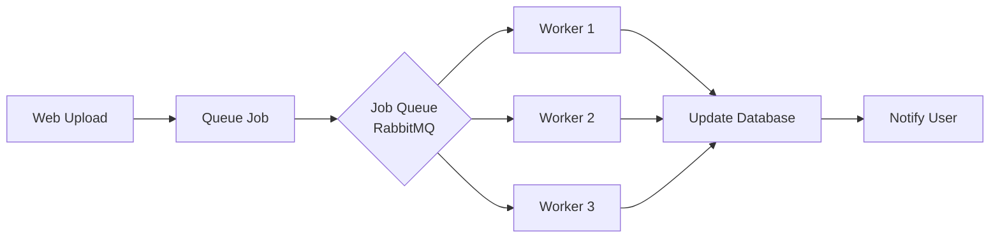

# Efficient Alt Text Generation: AI-Powered Image Accessibility in C#

<datetime class="hidden">2025-11-20T12:00</datetime>

<!--category-- C#, AI, Accessibility, Computer Vision, ONNX, Florence-2 -->

## Introduction

Alt text (alternative text) is critical for web accessibility, helping visually impaired users understand image content through screen readers. But let's be honest - writing good alt text is tedious, time-consuming, and often gets skipped. What if we could automate this process with AI while maintaining quality and privacy? In this comprehensive guide, I'll show you how to build a production-ready alt text generator using Microsoft's Florence-2 vision model in C#, explore different deployment strategies (including in-browser solutions), and look at how platforms like Mastodon are tackling this challenge.

We'll cover:
- Understanding the technical landscape of image captioning
- Building a practical C# implementation with Florence-2
- GPU vs CPU considerations and performance optimization
- In-browser alternatives using WebGPU and Transformers.js
- Real-world examples and deployment strategies
- Complete working demo application

Let's dive into making the web more accessible, one image at a time!

[TOC]

## The Accessibility Problem We're Solving

Every day, millions of images are uploaded to the web without proper alt text. This creates barriers for:
- **Visually impaired users** relying on screen readers
- **Users with slow internet** where images fail to load
- **Search engines** trying to understand image content
- **Content management systems** needing automated metadata

Manual alt text generation is:
- Time-consuming (average 30 seconds per image)
- Inconsistent in quality
- Often forgotten or skipped entirely
- Difficult to scale for large content volumes

AI-powered alt text generation can solve these problems, but the challenge is doing it **efficiently**, **privately**, and with **high quality**. Let's explore how modern computer vision models make this possible.

## Understanding Image Captioning Technology

Image captioning combines computer vision and natural language processing to generate descriptions of images. Here's how the technology works at a high level:



### The Evolution of Image Captioning Models

Image captioning has evolved significantly over the past few years:

1. **Early CNN-RNN Models (2015-2018)**
   - Used CNN for image features + RNN for text generation
   - Limited vocabulary and context understanding
   - Required large datasets for training

2. **Attention-Based Models (2017-2020)**
   - Introduced attention mechanisms to focus on relevant image regions
   - BLIP, CLIP brought vision-language alignment
   - Better at understanding relationships between objects

3. **Transformer-Based Models (2020-Present)**
   - Florence-2, BLIP-2, LLaVA use transformer architectures
   - Unified vision-language representations
   - Multi-task capabilities (captioning, OCR, detection)
   - Smaller model sizes with better performance

### Why Florence-2?

Microsoft's [Florence-2](https://huggingface.co/microsoft/Florence-2-base) is particularly well-suited for this task because:

- **Multi-task Architecture**: Single model handles captioning, OCR, object detection, and more
- **Prompt-Based Interface**: Different tasks via simple text prompts (e.g., "MORE_DETAILED_CAPTION")
- **Efficient Size**: Base model is ~271MB, large model is ~771MB (vs multi-GB alternatives)
- **ONNX Support**: Runs efficiently on CPU and GPU via ONNX Runtime
- **Open Source**: Apache 2.0 license, free for commercial use
- **C# Bindings**: florence2-sharp provides native .NET support

Here's what Florence-2's architecture looks like:



### Task Types in Florence-2

Florence-2 supports multiple captioning levels via prompts:

| Task Prompt | Output Style | Example |
|------------|--------------|---------|
| `CAPTION` | Brief, concise | "A dog playing in a park" |
| `DETAILED_CAPTION` | More descriptive | "A golden retriever playing fetch with a tennis ball in a sunny park" |
| `MORE_DETAILED_CAPTION` | Comprehensive | "A golden retriever dog with a shiny coat enthusiastically chasing a bright yellow tennis ball across lush green grass in a well-maintained park on a sunny afternoon" |
| `OCR` | Extract text | "Text visible in image" |
| `OCR_WITH_REGION` | Text with locations | Coordinates + text content |

## Mastodon's Approach to Alt Text

Before we dive into implementation, let's look at how platforms are handling this. Mastodon, the federated social network, has been exploring automated alt text generation. In [Pull Request #34244](https://github.com/mastodon/mastodon/pull/34244), they proposed an optional feature to use AI for alt text generation.

### What Mastodon Proposed

The implementation would:
- Use OpenAI's API (or compatible alternatives like Ollama)
- Be completely optional per instance
- Activate only when configured via environment variables
- Allow custom API endpoints and models

```ruby
# Proposed Mastodon configuration
ENV['ALT_TEXT_AI_API_BASE'] = 'https://api.openai.com/v1'
ENV['ALT_TEXT_AI_MODEL'] = 'gpt-4-vision'
ENV['ALT_TEXT_AI_PROMPT'] = 'Describe this image for accessibility'
```

### Why It Was Rejected

The Mastodon maintainers rejected this approach because:

1. **Privacy Concerns**: Sending images to external APIs contradicts Mastodon's privacy-first philosophy
2. **Quality Issues**: LLMs "very often miss the point of an image, and regularly misrepresent it"
3. **Dependency**: Relying on external services for core functionality
4. **Cost**: API calls can become expensive at scale

### The Better Approach

This rejection highlights why **local, self-hosted models** are the right solution:
- ✅ Complete privacy - images never leave your server
- ✅ No API costs - run inference locally
- ✅ Predictable performance - no rate limits or quotas
- ✅ Offline capable - works without internet
- ✅ Custom fine-tuning - adapt to your specific needs

This is exactly what we'll build next!

## Hardware Requirements and Performance

Before implementing, let's understand what hardware you'll need and what performance to expect.

### CPU vs GPU Performance



### Hardware Recommendations

**Minimum Requirements (CPU Only):**
- **Processor**: Modern x64 CPU (4+ cores recommended)
- **RAM**: 4GB minimum, 8GB recommended
- **Storage**: 3GB for model files
- **Performance**: 5-10 seconds per image

**Recommended Setup (GPU Accelerated):**
- **GPU**: NVIDIA GPU with CUDA support (GTX 1660 or better)
- **VRAM**: 4GB minimum, 6GB+ recommended
- **RAM**: 8GB system RAM
- **Storage**: 3GB for model files
- **Performance**: 0.5-2 seconds per image

**Production Server:**
- **CPU**: 8+ cores for concurrent requests
- **GPU**: NVIDIA RTX series or Tesla/A-series datacenter GPU
- **VRAM**: 8GB+ for batch processing
- **RAM**: 16GB+ for caching multiple models
- **Performance**: Handle 10-50 requests/second

### Model Size Comparison

| Model | Size | Quality | Speed (CPU) | Speed (GPU) |
|-------|------|---------|------------|------------|
| Florence-2-base | 271MB | Good | 5-7s | 0.5-1s |
| Florence-2-large | 771MB | Excellent | 8-12s | 1-2s |
| BLIP-large | 990MB | Very Good | 10-15s | 2-3s |
| LLaVA-7B | 7GB+ | Excellent | 30-60s | 5-10s |

For most use cases, **Florence-2-base offers the best balance** of quality and performance.

## Building the C# Implementation

Now let's build a production-ready alt text generator. We'll use:
- **ASP.NET Core 9.0** for the web framework
- **Florence2-Sharp** for the AI model
- **SixLabors.ImageSharp** for image processing
- **Modern JavaScript** for the UI

### Project Structure

```
Mostlylucid.AltText.Demo/
├── Controllers/
│   └── ImageAnalysisController.cs
├── Services/
│   ├── IImageAnalysisService.cs
│   └── Florence2ImageAnalysisService.cs
├── wwwroot/
│   └── index.html
├── Program.cs
└── Mostlylucid.AltText.Demo.csproj
```

### Step 1: Create the Project

First, create a new ASP.NET Core project and add the required packages:

```xml
<Project Sdk="Microsoft.NET.Sdk.Web">
  <PropertyGroup>
    <TargetFramework>net9.0</TargetFramework>
    <Nullable>enable</Nullable>
  </PropertyGroup>

  <ItemGroup>
    <PackageReference Include="Florence2" Version="25.7.59767" />
    <PackageReference Include="SixLabors.ImageSharp" Version="3.1.6" />
  </ItemGroup>
</Project>
```

### Step 2: Define the Service Interface

We'll create a clean interface that supports multiple operations:

```csharp
namespace Mostlylucid.AltText.Demo.Services;

public interface IImageAnalysisService
{
    /// <summary>
    /// Generates alt text for an image
    /// </summary>
    /// <param name="imageStream">Image to analyze</param>
    /// <param name="taskType">Captioning detail level</param>
    /// <returns>Generated alt text</returns>
    Task<string> GenerateAltTextAsync(Stream imageStream, string taskType = "MORE_DETAILED_CAPTION");

    /// <summary>
    /// Extracts text from an image using OCR
    /// </summary>
    /// <param name="imageStream">Image to analyze</param>
    /// <returns>Extracted text</returns>
    Task<string> ExtractTextAsync(Stream imageStream);

    /// <summary>
    /// Performs both alt text generation and OCR in one call
    /// </summary>
    /// <param name="imageStream">Image to analyze</param>
    /// <returns>Tuple of (altText, extractedText)</returns>
    Task<(string AltText, string ExtractedText)> AnalyzeImageAsync(Stream imageStream);
}
```

### Step 3: Implement the Florence-2 Service

Here's the heart of our implementation. Pay attention to the initialization pattern and thread-safety:

```csharp
using Florence2;
using Microsoft.Extensions.Logging;

namespace Mostlylucid.AltText.Demo.Services;

public class Florence2ImageAnalysisService : IImageAnalysisService, IDisposable
{
    private readonly ILogger<Florence2ImageAnalysisService> _logger;
    private readonly Florence2Model _model;
    private readonly Florence2ModelSession? _session;
    private bool _isInitialized;
    private readonly SemaphoreSlim _initLock = new(1, 1);

    public Florence2ImageAnalysisService(ILogger<Florence2ImageAnalysisService> logger)
    {
        _logger = logger;

        try
        {
            _logger.LogInformation("Initializing Florence2 model...");

            // Create model downloader - models cached in ./models directory
            var modelSource = new FlorenceModelDownloader("./models");

            // Download models if not already present
            // This will download ~271MB on first run
            modelSource.DownloadModelsAsync().GetAwaiter().GetResult();

            // Initialize the model
            _model = new Florence2Model(modelSource);

            // Create a session for inference
            _session = _model.CreateSession();

            _isInitialized = true;

            _logger.LogInformation("Florence2 model initialized successfully");
        }
        catch (Exception ex)
        {
            _logger.LogError(ex, "Failed to initialize Florence2 model");
            _isInitialized = false;
        }
    }

    public async Task<string> GenerateAltTextAsync(Stream imageStream, string taskType = "MORE_DETAILED_CAPTION")
    {
        await EnsureInitializedAsync();

        try
        {
            _logger.LogInformation("Generating alt text using task type: {TaskType}", taskType);

            // Run inference
            var results = _session!.Run(taskType, imageStream);

            if (results != null && results.Count > 0)
            {
                var altText = results.First().Value;
                _logger.LogInformation("Successfully generated alt text: {AltText}", altText);
                return altText;
            }

            _logger.LogWarning("No alt text generated");
            return "No description available";
        }
        catch (Exception ex)
        {
            _logger.LogError(ex, "Error generating alt text");
            throw;
        }
    }

    public async Task<string> ExtractTextAsync(Stream imageStream)
    {
        await EnsureInitializedAsync();

        try
        {
            _logger.LogInformation("Extracting text from image using OCR");

            // Use the OCR task
            var results = _session!.Run("OCR", imageStream);

            if (results != null && results.Count > 0)
            {
                var extractedText = results.First().Value;
                _logger.LogInformation("Successfully extracted text");
                return extractedText;
            }

            return "No text found";
        }
        catch (Exception ex)
        {
            _logger.LogError(ex, "Error extracting text");
            throw;
        }
    }

    public async Task<(string AltText, string ExtractedText)> AnalyzeImageAsync(Stream imageStream)
    {
        await EnsureInitializedAsync();

        try
        {
            // Create a memory stream to allow multiple reads
            using var memoryStream = new MemoryStream();
            await imageStream.CopyToAsync(memoryStream);

            // Generate alt text
            memoryStream.Position = 0;
            var altText = await GenerateAltTextAsync(memoryStream, "MORE_DETAILED_CAPTION");

            // Extract text (OCR)
            memoryStream.Position = 0;
            var extractedText = await ExtractTextAsync(memoryStream);

            return (altText, extractedText);
        }
        catch (Exception ex)
        {
            _logger.LogError(ex, "Error analyzing image");
            throw;
        }
    }

    private async Task EnsureInitializedAsync()
    {
        if (_isInitialized) return;

        await _initLock.WaitAsync();
        try
        {
            if (_isInitialized) return;

            throw new InvalidOperationException(
                "Florence2 model failed to initialize. Please check logs for details.");
        }
        finally
        {
            _initLock.Release();
        }
    }

    public void Dispose()
    {
        _session?.Dispose();
        _initLock.Dispose();
    }
}
```

**Key implementation details:**

1. **Singleton Pattern**: The model is expensive to load (~1-2 seconds), so we initialize once
2. **Lazy Loading**: Models download on first use, cached for subsequent runs
3. **Thread Safety**: Uses `SemaphoreSlim` for initialization lock
4. **Stream Handling**: Creates a `MemoryStream` to allow multiple reads for different tasks
5. **Error Handling**: Comprehensive logging and error messages
6. **Disposal**: Properly disposes of resources

### Step 4: Create the API Controller

Now let's expose our service via REST API:

```csharp
using Microsoft.AspNetCore.Mvc;
using Mostlylucid.AltText.Demo.Services;

namespace Mostlylucid.AltText.Demo.Controllers;

[ApiController]
[Route("api/[controller]")]
public class ImageAnalysisController : ControllerBase
{
    private readonly IImageAnalysisService _imageAnalysisService;
    private readonly ILogger<ImageAnalysisController> _logger;

    public ImageAnalysisController(
        IImageAnalysisService imageAnalysisService,
        ILogger<ImageAnalysisController> logger)
    {
        _imageAnalysisService = imageAnalysisService;
        _logger = logger;
    }

    /// <summary>
    /// Analyzes an image and returns both alt text and extracted text
    /// </summary>
    [HttpPost("analyze")]
    [RequestSizeLimit(10 * 1024 * 1024)] // 10MB limit
    public async Task<IActionResult> AnalyzeImage(IFormFile image)
    {
        if (image == null || image.Length == 0)
        {
            return BadRequest(new { error = "No image file provided" });
        }

        // Validate image type
        var allowedTypes = new[] { "image/jpeg", "image/jpg", "image/png", "image/gif", "image/webp" };
        if (!allowedTypes.Contains(image.ContentType.ToLower()))
        {
            return BadRequest(new { error = "Invalid image type. Allowed: JPEG, PNG, GIF, WebP" });
        }

        try
        {
            _logger.LogInformation("Analyzing image: {FileName}, Size: {Size} bytes",
                image.FileName, image.Length);

            using var stream = image.OpenReadStream();
            var (altText, extractedText) = await _imageAnalysisService.AnalyzeImageAsync(stream);

            return Ok(new
            {
                fileName = image.FileName,
                altText = altText,
                extractedText = extractedText,
                size = image.Length
            });
        }
        catch (Exception ex)
        {
            _logger.LogError(ex, "Error analyzing image {FileName}", image.FileName);
            return StatusCode(500, new { error = "An error occurred analyzing the image" });
        }
    }

    /// <summary>
    /// Generates only alt text for an image
    /// </summary>
    [HttpPost("alt-text")]
    [RequestSizeLimit(10 * 1024 * 1024)]
    public async Task<IActionResult> GenerateAltText(
        IFormFile image,
        [FromQuery] string taskType = "MORE_DETAILED_CAPTION")
    {
        if (image == null || image.Length == 0)
        {
            return BadRequest(new { error = "No image file provided" });
        }

        try
        {
            using var stream = image.OpenReadStream();
            var altText = await _imageAnalysisService.GenerateAltTextAsync(stream, taskType);

            return Ok(new { fileName = image.FileName, altText = altText });
        }
        catch (Exception ex)
        {
            _logger.LogError(ex, "Error generating alt text");
            return StatusCode(500, new { error = "An error occurred" });
        }
    }

    /// <summary>
    /// Extracts text from an image using OCR
    /// </summary>
    [HttpPost("ocr")]
    [RequestSizeLimit(10 * 1024 * 1024)]
    public async Task<IActionResult> ExtractText(IFormFile image)
    {
        if (image == null || image.Length == 0)
        {
            return BadRequest(new { error = "No image file provided" });
        }

        try
        {
            using var stream = image.OpenReadStream();
            var extractedText = await _imageAnalysisService.ExtractTextAsync(stream);

            return Ok(new { fileName = image.FileName, extractedText = extractedText });
        }
        catch (Exception ex)
        {
            _logger.LogError(ex, "Error extracting text");
            return StatusCode(500, new { error = "An error occurred" });
        }
    }
}
```

### Step 5: Configure the Application

In `Program.cs`, wire everything together:

```csharp
using Mostlylucid.AltText.Demo.Services;

var builder = WebApplication.CreateBuilder(args);

// Add services to the container
builder.Services.AddControllers();

// Register the image analysis service as a singleton
// This keeps the model in memory for fast inference
builder.Services.AddSingleton<IImageAnalysisService, Florence2ImageAnalysisService>();

// Configure logging
builder.Logging.ClearProviders();
builder.Logging.AddConsole();
builder.Logging.SetMinimumLevel(LogLevel.Information);

var app = builder.Build();

// Configure middleware
app.UseStaticFiles();
app.UseRouting();
app.MapControllers();

// Serve the demo UI
app.MapGet("/", () => Results.Redirect("/index.html"));

app.Run();
```

**Important configuration notes:**

- **Singleton Service**: We register `Florence2ImageAnalysisService` as a singleton because loading the model is expensive (1-2 seconds). This means the model loads once and stays in memory for the lifetime of the application.
- **Static Files**: Enables serving our HTML/CSS/JS demo UI
- **Logging**: Console logging for debugging and monitoring

### Step 6: Build the Interactive UI

Create a modern, drag-and-drop interface in `wwwroot/index.html`. Here's a condensed version (full version is in the demo):

```html
<!DOCTYPE html>
<html lang="en">
<head>
    <meta charset="UTF-8">
    <meta name="viewport" content="width=device-width, initial-scale=1.0">
    <title>Alt Text Generator Demo</title>
    <style>
        /* Modern, gradient design with drag-and-drop */
        body {
            font-family: -apple-system, BlinkMacSystemFont, 'Segoe UI', Roboto, sans-serif;
            background: linear-gradient(135deg, #667eea 0%, #764ba2 100%);
            min-height: 100vh;
            padding: 20px;
        }

        .drop-zone {
            border: 3px dashed #667eea;
            border-radius: 8px;
            padding: 60px 20px;
            text-align: center;
            cursor: pointer;
            transition: all 0.3s ease;
        }

        .drop-zone:hover {
            background: #e8ecff;
            transform: scale(1.02);
        }
    </style>
</head>
<body>
    <div class="container">
        <header>
            <h1>🖼️ Alt Text Generator</h1>
            <p>Powered by Florence-2 AI</p>
        </header>

        <div class="drop-zone" id="dropZone">
            <div class="drop-zone-icon">📸</div>
            <div class="drop-zone-text">Drop your image here</div>
            <div class="drop-zone-hint">or click to browse</div>
        </div>

        <input type="file" id="fileInput" accept="image/*" style="display: none;">

        <div class="results" id="results" style="display: none;">
            
            <div class="result-card">
                <h3>🏷️ Alt Text</h3>
                <p id="altText"></p>
            </div>
            <div class="result-card">
                <h3>📝 Extracted Text (OCR)</h3>
                <p id="ocrText"></p>
            </div>
        </div>
    </div>

    <script>
        const dropZone = document.getElementById('dropZone');
        const fileInput = document.getElementById('fileInput');

        // Handle drag and drop
        dropZone.addEventListener('click', () => fileInput.click());

        dropZone.addEventListener('dragover', (e) => {
            e.preventDefault();
            dropZone.classList.add('drag-over');
        });

        dropZone.addEventListener('drop', (e) => {
            e.preventDefault();
            dropZone.classList.remove('drag-over');
            handleFile(e.dataTransfer.files[0]);
        });

        fileInput.addEventListener('change', (e) => {
            if (e.target.files.length > 0) {
                handleFile(e.target.files[0]);
            }
        });

        async function handleFile(file) {
            // Create form data
            const formData = new FormData();
            formData.append('image', file);

            // Show loading state
            document.getElementById('results').style.display = 'none';
            showLoading();

            try {
                // Call the API
                const response = await fetch('/api/ImageAnalysis/analyze', {
                    method: 'POST',
                    body: formData
                });

                const result = await response.json();

                // Display results
                document.getElementById('preview').src = URL.createObjectURL(file);
                document.getElementById('altText').textContent = result.altText;
                document.getElementById('ocrText').textContent = result.extractedText;
                document.getElementById('results').style.display = 'block';

                hideLoading();
            } catch (error) {
                console.error('Error:', error);
                alert('Error analyzing image');
                hideLoading();
            }
        }
    </script>
</body>
</html>
```

### Running the Application

Now you can run your application:

```bash
cd Mostlylucid.AltText.Demo
dotnet run
```

On first run, you'll see the model downloading:

```
info: Mostlylucid.AltText.Demo.Services.Florence2ImageAnalysisService[0]
      Initializing Florence2 model...
info: Florence2
      Downloading model files (271 MB)...
info: Florence2
      Model download complete
info: Mostlylucid.AltText.Demo.Services.Florence2ImageAnalysisService[0]
      Florence2 model initialized successfully
```

Open your browser to `https://localhost:5001` and try uploading an image!

### Understanding the Request Flow

Here's what happens when you upload an image:



## In-Browser Alternatives with WebGPU

While our C# implementation is great for server-side processing, sometimes you want to run AI models directly in the browser for maximum privacy and zero server costs. This is where **WebGPU** and **Transformers.js** come in.

### What is WebGPU?

WebGPU is a modern web standard that gives JavaScript access to the GPU for high-performance computing. It's the successor to WebGL and enables running AI models at near-native speeds in the browser.

**Browser Support (as of 2025):**
- ✅ Chrome 113+ (stable)
- ✅ Edge 113+ (stable)
- ✅ Safari 18+ (experimental)
- ⏳ Firefox (in development)

### Transformers.js: Hugging Face in Your Browser

[Transformers.js](https://huggingface.co/docs/transformers.js) brings Hugging Face models to the browser using ONNX Runtime and WebGPU. It's maintained by Hugging Face and supports hundreds of models.

Here's how to use Florence-2 in the browser:

```html
<!DOCTYPE html>
<html lang="en">
<head>
    <title>Browser-Based Alt Text Generator</title>
    <script type="module">
        import { pipeline, env } from 'https://cdn.jsdelivr.net/npm/@xenova/transformers@2.17.1';

        // Configure to use local models (cached in browser)
        env.allowLocalModels = true;
        env.allowRemoteModels = true;

        // Initialize the image-to-text pipeline
        const captioner = await pipeline(
            'image-to-text',
            'onnx-community/Florence-2-base-ft',
            { device: 'webgpu' }  // Use WebGPU for acceleration
        );

        // Handle image upload
        document.getElementById('imageInput').addEventListener('change', async (e) => {
            const file = e.target.files[0];
            const imageUrl = URL.createObjectURL(file);

            // Show preview
            document.getElementById('preview').src = imageUrl;

            // Generate caption
            const result = await captioner(imageUrl, {
                task_prompt: '<MORE_DETAILED_CAPTION>'
            });

            // Display alt text
            document.getElementById('altText').textContent = result[0].generated_text;
        });
    </script>
</head>
<body>
    <h1>Browser Alt Text Generator</h1>
    <input type="file" id="imageInput" accept="image/*">
    
    <p id="altText"></p>
</body>
</html>
```

### Performance Comparison: Server vs Browser



**Pros and Cons:**

| Aspect | Server-Side (C#) | Browser (WebGPU) |
|--------|------------------|------------------|
| **Privacy** | Images leave device | 100% private |
| **Performance** | Faster with good GPU | Depends on user's device |
| **Cost** | Server compute costs | Zero server cost |
| **Offline** | Requires connection | Works offline after cache |
| **Scale** | Limited by server resources | Unlimited (client-side) |
| **Device Support** | Any device | Modern browsers only |
| **Initial Load** | Instant | 2-5s model download |

### When to Use Each Approach

**Use Server-Side (C#) when:**
- You need consistent performance across all devices
- You have powerful server GPUs
- You're processing high volumes
- You want centralized control over the model version
- Your users have older browsers or devices

**Use Browser-Side (WebGPU) when:**
- Privacy is paramount (medical images, personal photos)
- You want zero server costs
- Your users have modern browsers
- You want offline capability
- You have limited server resources

### Hybrid Approach

The best solution might be both! Start with browser-based processing and fall back to server:

```javascript
async function generateAltText(image) {
    // Try WebGPU first
    if ('gpu' in navigator) {
        try {
            return await generateInBrowser(image);
        } catch (error) {
            console.warn('WebGPU failed, falling back to server');
        }
    }

    // Fall back to server API
    return await generateOnServer(image);
}
```

## Looking Ahead: DeepSeek-OCR and Future Alternatives

While Florence-2 provides excellent balance of performance and ease of use, it's worth discussing emerging alternatives - particularly **DeepSeek-OCR**, which represents the cutting edge of specialized document understanding.

### DeepSeek-OCR: The Specialist

Released in October 2025, [DeepSeek-OCR](https://github.com/deepseek-ai/DeepSeek-OCR) is a 3B parameter vision-language model specifically designed for high-performance OCR and structured document conversion. While Florence-2 is a versatile multi-task model, DeepSeek-OCR is laser-focused on text extraction.

### Performance Comparison

Here's how the models stack up:

| Metric | Florence-2 Base | DeepSeek-OCR | Winner |
|--------|----------------|--------------|---------|
| **OCRBench** | ~650 | **834** | DeepSeek |
| **DocVQA** | 81.7% | **93.3%** | DeepSeek |
| **Image Captioning** | Excellent | Limited | Florence-2 |
| **Model Size** | **271MB** | 3GB+ | Florence-2 |
| **C# Integration** | **Native** | Python only | Florence-2 |
| **Token Efficiency** | Standard | **7.5x compression** | DeepSeek |
| **Multi-task** | **Yes** | OCR only | Florence-2 |
| **Throughput** | ~50-100 images/min | **200,000 pages/day** | DeepSeek |

### When DeepSeek-OCR Shines

DeepSeek-OCR is particularly impressive for:

**Document-Heavy Workloads:**
- Scanned PDFs with dense text
- Forms and invoices with structured data
- Tables, charts, and complex layouts
- Multi-column documents

**Token Compression:**
DeepSeek-OCR's breakthrough is its ability to compress visual information into fewer tokens. Using just **100 vision tokens**, it achieves 97.3% accuracy on documents containing 700-800 text tokens - a **7.5x compression ratio**. This makes it extremely efficient for large language model pipelines.



### Current Limitations for C# Developers

As of early 2025, DeepSeek-OCR has some integration challenges:

**No Native C# Support:**
- Primary implementation is Python with vLLM/Transformers
- No official ONNX export (yet)
- No C# NuGet package available

**Larger Resource Requirements:**
- 3GB+ model size vs Florence-2's 271MB
- More VRAM needed for inference
- Specialized for OCR, not general image understanding

### Integration Approaches

If you need DeepSeek-OCR's superior OCR capabilities today, here are your options:

**Option 1: Microservice Architecture**

Run DeepSeek-OCR as a separate Python service:

```csharp
public class DeepSeekOcrService : IImageAnalysisService
{
    private readonly HttpClient _httpClient;

    public async Task<string> ExtractTextAsync(Stream imageStream)
    {
        using var content = new MultipartFormDataContent();
        content.Add(new StreamContent(imageStream), "image", "image.jpg");

        var response = await _httpClient.PostAsync(
            "http://deepseek-ocr-service:8000/api/ocr",
            content);

        var result = await response.Content.ReadFromJsonAsync<OcrResult>();
        return result.ExtractedText;
    }
}
```

Python service (FastAPI + vLLM):
```python
from fastapi import FastAPI, UploadFile
from vllm import LLM

app = FastAPI()
llm = LLM("deepseek-ai/DeepSeek-OCR")

@app.post("/api/ocr")
async def extract_text(image: UploadFile):
    # Process image with DeepSeek-OCR
    result = llm.generate(image)
    return {"extractedText": result}
```

**Option 2: Hybrid Strategy**

Use both models for their strengths:

```csharp
public class SmartImageAnalysisService : IImageAnalysisService
{
    private readonly Florence2ImageAnalysisService _florence2;
    private readonly DeepSeekOcrService _deepSeekOcr;
    private readonly ILogger<SmartImageAnalysisService> _logger;

    public async Task<(string AltText, string ExtractedText)> AnalyzeImageAsync(Stream imageStream)
    {
        // Always use Florence-2 for alt text (it excels at this)
        imageStream.Position = 0;
        var altText = await _florence2.GenerateAltTextAsync(imageStream);

        // Smart routing for OCR based on image type
        imageStream.Position = 0;
        var imageType = await DetectImageTypeAsync(imageStream);

        string extractedText;
        if (imageType == ImageType.Document || imageType == ImageType.Form)
        {
            // Use DeepSeek-OCR for complex documents
            _logger.LogInformation("Using DeepSeek-OCR for document processing");
            imageStream.Position = 0;
            extractedText = await _deepSeekOcr.ExtractTextAsync(imageStream);
        }
        else
        {
            // Use Florence-2 for regular images (faster, local)
            _logger.LogInformation("Using Florence-2 OCR for standard image");
            imageStream.Position = 0;
            extractedText = await _florence2.ExtractTextAsync(imageStream);
        }

        return (altText, extractedText);
    }

    private async Task<ImageType> DetectImageTypeAsync(Stream imageStream)
    {
        // Use Florence-2 for quick classification
        // Could detect: photograph, screenshot, document, form, chart, etc.
        // Implementation details omitted for brevity
        return ImageType.Photograph;
    }
}
```

### Future Outlook

**ONNX Export Coming:**
DeepSeek's team has indicated ONNX export is on the roadmap:
> "For edge devices, you can quantize the Tiny checkpoint and export through TensorRT-LLM or ONNX Runtime"

Once ONNX weights become available, we could expect:
- Native C# integration via Microsoft.ML.OnnxRuntime
- Smaller quantized models for edge deployment
- Potential community-driven C# libraries (similar to florence2-sharp)

**When to Watch for DeepSeek-OCR:**

Consider migrating to or incorporating DeepSeek-OCR when:
1. ✅ **Official ONNX weights** are released
2. ✅ A **C# library** emerges (e.g., deepseek-ocr-sharp)
3. ✅ Your use case is **document-heavy** rather than general images
4. ✅ You need **maximum OCR accuracy** over versatility

**For Now, Florence-2 Remains the Better Choice for Alt Text Because:**
- ✅ Native C# support with zero Python dependencies
- ✅ Excellent image captioning (our primary goal)
- ✅ Smaller footprint and faster deployment
- ✅ Multi-task model (captioning + OCR + detection)
- ✅ Good enough OCR for most web images

### The Best of Both Worlds

The architecture we've built is deliberately flexible. Our `IImageAnalysisService` interface means you can:
- Start with Florence-2 today (production-ready)
- Add DeepSeek-OCR later as a microservice
- Route requests intelligently based on image type
- Swap implementations without changing application code

```csharp
// Configuration-driven model selection
services.AddSingleton<IImageAnalysisService>(sp =>
{
    var config = sp.GetRequiredService<IConfiguration>();
    var modelType = config["ImageAnalysis:ModelType"];

    return modelType switch
    {
        "Florence2" => sp.GetRequiredService<Florence2ImageAnalysisService>(),
        "DeepSeekOCR" => sp.GetRequiredService<DeepSeekOcrService>(),
        "Hybrid" => sp.GetRequiredService<SmartImageAnalysisService>(),
        _ => sp.GetRequiredService<Florence2ImageAnalysisService>()
    };
});
```

The future of image understanding is bright, with models like DeepSeek-OCR pushing the boundaries of what's possible. But for accessible, privacy-focused alt text generation today, Florence-2 in C# hits the sweet spot.

## Production Deployment Strategies

Let's discuss how to deploy this in production at scale.

### Deployment Architecture Options



### Strategy 1: Dedicated GPU Server

Best for: High-volume, low-latency requirements

**Setup:**
- NVIDIA RTX 4090 or A-series datacenter GPU
- Docker container with CUDA support
- Redis for result caching
- Load balancer for multiple GPU instances

**Dockerfile:**

```dockerfile
FROM mcr.microsoft.com/dotnet/aspnet:9.0-jammy AS base
WORKDIR /app

# Install CUDA runtime
RUN apt-get update && apt-get install -y \
    cuda-runtime-12-0 \
    && rm -rf /var/lib/apt/lists/*

FROM mcr.microsoft.com/dotnet/sdk:9.0-jammy AS build
WORKDIR /src
COPY ["Mostlylucid.AltText.Demo/Mostlylucid.AltText.Demo.csproj", "Mostlylucid.AltText.Demo/"]
RUN dotnet restore
COPY . .
WORKDIR "/src/Mostlylucid.AltText.Demo"
RUN dotnet build -c Release -o /app/build

FROM build AS publish
RUN dotnet publish -c Release -o /app/publish

FROM base AS final
WORKDIR /app
COPY --from=publish /app/publish .

# Pre-download models during build
RUN dotnet exec Mostlylucid.AltText.Demo.dll --download-models-only || true

EXPOSE 80
ENTRYPOINT ["dotnet", "Mostlylucid.AltText.Demo.dll"]
```

**docker-compose.yml:**

```yaml
version: '3.8'
services:
  alttext-api:
    image: alttext-demo:latest
    deploy:
      resources:
        reservations:
          devices:
            - driver: nvidia
              count: 1
              capabilities: [gpu]
    environment:
      - ASPNETCORE_ENVIRONMENT=Production
      - CUDA_VISIBLE_DEVICES=0
    ports:
      - "8080:80"
    volumes:
      - model-cache:/app/models
    restart: unless-stopped

  redis:
    image: redis:7-alpine
    ports:
      - "6379:6379"
    volumes:
      - redis-data:/data

volumes:
  model-cache:
  redis-data:
```

### Strategy 2: CPU Cluster with Caching

Best for: Cost-sensitive, moderate-volume applications

**Key optimizations:**
- Result caching (image hash → alt text)
- Request batching
- Async processing with queue
- Multi-instance deployment

**Enhanced Service with Caching:**

```csharp
public class CachedImageAnalysisService : IImageAnalysisService
{
    private readonly Florence2ImageAnalysisService _innerService;
    private readonly IDistributedCache _cache;
    private readonly ILogger<CachedImageAnalysisService> _logger;

    public CachedImageAnalysisService(
        Florence2ImageAnalysisService innerService,
        IDistributedCache cache,
        ILogger<CachedImageAnalysisService> logger)
    {
        _innerService = innerService;
        _cache = cache;
        _logger = logger;
    }

    public async Task<string> GenerateAltTextAsync(Stream imageStream, string taskType = "MORE_DETAILED_CAPTION")
    {
        // Calculate image hash for cache key
        var imageHash = await CalculateImageHashAsync(imageStream);
        var cacheKey = $"alttext:{imageHash}:{taskType}";

        // Check cache
        var cachedResult = await _cache.GetStringAsync(cacheKey);
        if (cachedResult != null)
        {
            _logger.LogInformation("Cache hit for image hash {Hash}", imageHash);
            return cachedResult;
        }

        // Cache miss - generate alt text
        _logger.LogInformation("Cache miss for image hash {Hash}", imageHash);
        imageStream.Position = 0;
        var altText = await _innerService.GenerateAltTextAsync(imageStream, taskType);

        // Cache result for 24 hours
        await _cache.SetStringAsync(cacheKey, altText, new DistributedCacheEntryOptions
        {
            AbsoluteExpirationRelativeToNow = TimeSpan.FromHours(24)
        });

        return altText;
    }

    private async Task<string> CalculateImageHashAsync(Stream imageStream)
    {
        using var sha256 = SHA256.Create();
        var hashBytes = await sha256.ComputeHashAsync(imageStream);
        return Convert.ToBase64String(hashBytes);
    }
}
```

### Strategy 3: Background Processing Queue

Best for: Non-real-time applications (CMS, bulk processing)

**Architecture:**



**Background Worker:**

```csharp
public class ImageAnalysisBackgroundService : BackgroundService
{
    private readonly IServiceProvider _serviceProvider;
    private readonly ILogger<ImageAnalysisBackgroundService> _logger;

    protected override async Task ExecuteAsync(CancellationToken stoppingToken)
    {
        await foreach (var job in GetPendingJobs(stoppingToken))
        {
            using var scope = _serviceProvider.CreateScope();
            var analysisService = scope.ServiceProvider.GetRequiredService<IImageAnalysisService>();

            try
            {
                // Download image
                using var imageStream = await DownloadImageAsync(job.ImageUrl);

                // Generate alt text
                var altText = await analysisService.GenerateAltTextAsync(imageStream);

                // Update database
                await UpdateJobResultAsync(job.Id, altText);

                _logger.LogInformation("Processed job {JobId}", job.Id);
            }
            catch (Exception ex)
            {
                _logger.LogError(ex, "Failed to process job {JobId}", job.Id);
                await MarkJobFailedAsync(job.Id, ex.Message);
            }
        }
    }
}
```

### Monitoring and Observability

Don't forget to monitor your production deployment! Key metrics:

**Performance Metrics:**
- Average inference time
- Queue depth (for background processing)
- Cache hit rate
- GPU utilization
- Memory usage

**OpenTelemetry Integration:**

```csharp
public class Florence2ImageAnalysisService : IImageAnalysisService
{
    private static readonly ActivitySource ActivitySource = new("AltTextGeneration");

    public async Task<string> GenerateAltTextAsync(Stream imageStream, string taskType)
    {
        using var activity = ActivitySource.StartActivity("GenerateAltText");
        activity?.SetTag("task.type", taskType);

        var stopwatch = Stopwatch.StartNew();

        try
        {
            var result = await _session.Run(taskType, imageStream);

            activity?.SetTag("inference.duration_ms", stopwatch.ElapsedMilliseconds);
            activity?.SetTag("result.length", result.Length);

            return result;
        }
        catch (Exception ex)
        {
            activity?.SetStatus(ActivityStatusCode.Error, ex.Message);
            throw;
        }
    }
}
```

## Real-World Integration Examples

Let's look at how to integrate this into common scenarios.

### Integration 1: WordPress Plugin

Create a WordPress plugin that automatically generates alt text on image upload:

```php
<?php
/**
 * Plugin Name: AI Alt Text Generator
 * Description: Automatically generates alt text using Florence-2 API
 */

add_action('add_attachment', 'generate_alt_text_on_upload');

function generate_alt_text_on_upload($attachment_id) {
    // Get uploaded image
    $image_path = get_attached_file($attachment_id);

    // Call our C# API
    $ch = curl_init('https://your-api.com/api/ImageAnalysis/alt-text');
    curl_setopt($ch, CURLOPT_POST, true);
    curl_setopt($ch, CURLOPT_POSTFIELDS, [
        'image' => new CURLFile($image_path)
    ]);
    curl_setopt($ch, CURLOPT_RETURNTRANSFER, true);

    $response = curl_exec($ch);
    curl_close($ch);

    $result = json_decode($response, true);

    // Update post meta with alt text
    if (isset($result['altText'])) {
        update_post_meta($attachment_id, '_wp_attachment_image_alt', $result['altText']);
    }
}
```

### Integration 2: ASP.NET Core CMS

Integrate directly into your CMS upload pipeline:

```csharp
public class ImageUploadHandler
{
    private readonly IImageAnalysisService _analysisService;
    private readonly IMediaRepository _mediaRepository;

    public async Task<UploadResult> HandleUploadAsync(IFormFile file)
    {
        // Save original image
        var imagePath = await SaveImageAsync(file);

        // Generate alt text asynchronously
        string altText;
        try
        {
            using var stream = file.OpenReadStream();
            altText = await _analysisService.GenerateAltTextAsync(stream);
        }
        catch (Exception ex)
        {
            // Log error but don't fail the upload
            _logger.LogError(ex, "Failed to generate alt text for {FileName}", file.FileName);
            altText = "Image upload"; // Fallback
        }

        // Create media record
        var media = new MediaItem
        {
            FilePath = imagePath,
            AltText = altText,
            OriginalFileName = file.FileName,
            UploadedAt = DateTime.UtcNow
        };

        await _mediaRepository.AddAsync(media);

        return new UploadResult
        {
            Success = true,
            MediaId = media.Id,
            AltText = altText
        };
    }
}
```

### Integration 3: Static Site Generator (Markdown)

Process images during your static site build:

```csharp
public class MarkdownImageProcessor
{
    private readonly IImageAnalysisService _analysisService;

    public async Task ProcessMarkdownFileAsync(string filePath)
    {
        var content = await File.ReadAllTextAsync(filePath);
        var document = Markdown.Parse(content);

        bool modified = false;

        foreach (var link in document.Descendants<LinkInline>())
        {
            if (!link.IsImage || !string.IsNullOrEmpty(link.Label))
                continue; // Skip if not an image or already has alt text

            var imagePath = link.Url;
            if (!imagePath.StartsWith("http"))
            {
                // Local image - generate alt text
                var fullPath = Path.Combine(Path.GetDirectoryName(filePath), imagePath);

                if (File.Exists(fullPath))
                {
                    using var stream = File.OpenRead(fullPath);
                    var altText = await _analysisService.GenerateAltTextAsync(stream);

                    // Update the markdown
                    link.Label = altText;
                    modified = true;

                    Console.WriteLine($"Generated alt text for {imagePath}: {altText}");
                }
            }
        }

        if (modified)
        {
            // Save updated markdown
            var newContent = document.ToMarkdownString();
            await File.WriteAllTextAsync(filePath, newContent);
        }
    }
}
```

## Performance Optimization Tips

Here are some hard-earned lessons for optimizing performance:

### 1. Image Preprocessing

Resize images before sending to the model:

```csharp
public async Task<string> GenerateAltTextAsync(Stream imageStream, string taskType)
{
    // Load and resize image
    using var image = await Image.LoadAsync(imageStream);

    // Florence-2 works best with images <= 1024px
    if (image.Width > 1024 || image.Height > 1024)
    {
        image.Mutate(x => x.Resize(new ResizeOptions
        {
            Size = new Size(1024, 1024),
            Mode = ResizeMode.Max
        }));
    }

    // Convert to stream
    using var resizedStream = new MemoryStream();
    await image.SaveAsync(resizedStream, new JpegEncoder { Quality = 85 });
    resizedStream.Position = 0;

    // Now process
    return await _session.Run(taskType, resizedStream);
}
```

### 2. Batch Processing

Process multiple images in parallel:

```csharp
public async Task<List<string>> GenerateBatchAltTextAsync(List<Stream> images)
{
    var tasks = images.Select(async image =>
    {
        return await GenerateAltTextAsync(image);
    });

    return (await Task.WhenAll(tasks)).ToList();
}
```

### 3. Model Warm-up

Pre-warm the model on application startup:

```csharp
public class ModelWarmupService : IHostedService
{
    private readonly IImageAnalysisService _analysisService;

    public async Task StartAsync(CancellationToken cancellationToken)
    {
        // Create a small test image
        using var testImage = new MemoryStream();
        using var image = new Image<Rgb24>(224, 224);
        await image.SaveAsync(testImage, new JpegEncoder());
        testImage.Position = 0;

        // Warm up the model
        _ = await _analysisService.GenerateAltTextAsync(testImage);
    }

    public Task StopAsync(CancellationToken cancellationToken) => Task.CompletedTask;
}
```

## Conclusion

We've built a complete, production-ready alt text generation system using Microsoft Florence-2 in C#. Here's what we covered:

✅ **Understanding the Technology**: Image captioning models, Florence-2 architecture, task types
✅ **Real-World Context**: How Mastodon considered (and rejected) external APIs
✅ **Hardware Requirements**: CPU vs GPU performance, cost analysis
✅ **Full C# Implementation**: Service layer, API, UI with drag-and-drop
✅ **Browser Alternatives**: WebGPU and Transformers.js for client-side processing
✅ **Production Deployment**: Docker, caching, background processing, monitoring
✅ **Integration Examples**: WordPress, ASP.NET CMS, static site generators
✅ **Performance Optimization**: Preprocessing, batching, warm-up strategies

### Key Takeaways

1. **Local Models Win**: For privacy, cost, and control, self-hosted models beat API calls
2. **Florence-2 is Excellent**: Great balance of quality, speed, and model size
3. **Hardware Matters**: GPU acceleration provides 5-10x speedup
4. **Caching is Critical**: Hash-based caching prevents redundant processing
5. **Progressive Enhancement**: Start with browser-side, fall back to server

### Next Steps

To extend this project, consider:

- **Fine-tuning**: Train on your specific image domain for better quality
- **Multi-language**: Generate alt text in multiple languages
- **Content Moderation**: Integrate NSFW detection
- **Quality Scoring**: Rate generated alt text quality automatically
- **A/B Testing**: Compare different caption styles for your audience

### Resources

- **Demo Code**: [Mostlylucid.AltText.Demo](link-to-demo-folder)
- **Florence-2 Paper**: [Microsoft Research](https://arxiv.org/abs/2311.06242)
- **florence2-sharp**: [GitHub](https://github.com/curiosity-ai/florence2-sharp)
- **Transformers.js**: [Documentation](https://huggingface.co/docs/transformers.js)
- **ONNX Runtime**: [Microsoft Docs](https://onnxruntime.ai/)

Making the web accessible isn't just good practice - it's the right thing to do. With modern AI models like Florence-2, we can automate the tedious parts while maintaining quality and privacy. Now go forth and generate some alt text!

Have questions or want to share your implementation? Drop a comment below or reach out on [Twitter/X](https://twitter.com/scottgal).
