# AI as Disciplined Software: “I Think I Should Leave”
Evolving AI Workflows and the Drive to Simplicity

<datetime class="hidden">2025-11-19T18:00</datetime>

<!--category-- AI, Software Engineering, Development -->

> **Fancy paying me to turn this into a proper product?** Drop me a line: [scott.galloway+dse@gmail.com](mailto:scott.galloway+dse@gmail.com)

## The Thought That Started Everything

**Why does a human brain run real-time cognition on 20 watts—while our best AI models need megawatts just to talk about breakfast?**

Modern LLMs are aimed at being like a massive cortex—tons of memory, tons of performance, but **alone**. To perform tasks a human would do effortlessly, they chew through kilowatts of power using tens of gigabytes of memory. That can't be right if the brain works on 20 watts.

Here's what they're missing: The brain isn't a single blob of grey jelly—it's **lots of specialized subsystems** handling vision, movement, memory storage (in layers!), all coordinated by that cortex. LLMs don't do that. They're like a massive thinking engine bolted onto dumb infrastructure. Their storage doesn't adapt. They don't build specialist subsystems. **They're incomplete.**

I used to be a psychologist, so I think about stuff like this. And here's the fundamental principle I built DiSE around:

**"Cheap cognition stabilises complex cognition."**

Your brain doesn't re-compute how to walk every time you take a step. It offloads that to fast, cheap, automatic subsystems. That stability frees up the expensive prefrontal cortex to handle novel problems. DiSE does the same: it replaces expensive LLM calls with cheap Python scripts, freeing up frontier models to work on genuinely hard problems. The system stabilises itself by getting simpler, not more complex.

## Elevator Pitch

**What if your AI workflow realised it didn't need AI and turned itself into a Python script?** DiSE does that. It builds workflows as testable tools stored in a RAG substrate. When patterns become clear, it replaces LLM calls with instant Python. When you need more features, it builds ONLY what's needed—predictably, testably. When tools drift, it evolves away from problems before you notice. A tiny Sentinel model (1B params) handles all the boring housekeeping for pennies. Connect a frontier LLM briefly to optimise everything, then disconnect and run cheaply forever. It's AI that gets more efficient the longer it runs—which is exactly how production systems should work.

[TOC]

## Introduction

Most AI systems today are built like my first PHP scripts circa 2003—fragile, untestable, and when they break, you've got about as much chance of debugging them as explaining Brexit to a confused American.

When they fail, you can't tell why. When they drift (and they *will*), you don't notice until production's on fire. When you need to improve them? Back to square one. Digital Sisyphus.

There's a better way. What if every AI tool was built like proper software from day one—with tests, contracts, specifications, and accountability baked in? Not bolted on when the auditors come knocking.

This isn't vapourware. It's working code. Here's how AI engineering should work when it grows up.

## Table of Contents

## The Problem: AI Is Still The Wild West

Let me paint you a picture with a diagram, because I'm fancy like that:

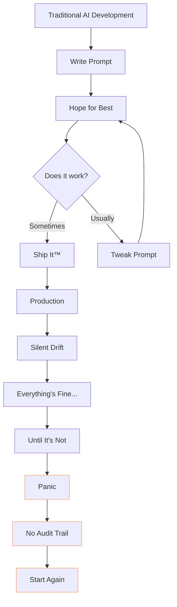

Sound familiar? That's how most AI systems get built. It's completely bananas.

## What Makes This Different?

Here's what a generated AI "tool" looks like in my system—straight from the CLI, no smoke and mirrors:


```
flag_potential_violations_base/
├─ flag_potential_violations_base_plan.txt   ← generation plan
├─ flag_potential_violations_based_on_predefined_thresholds.feature   ← BDD spec
├─ interface.json                            ← declared IO contract
├─ specification.md                          ← intent & description
├─ main.py                                   ← implementation (generated)
├─ test_main.py                              ← unit + BDD tests
├─ locust_flag_potential_violations_base.py  ← load/performance tests
└─ node_runtime.py                           ← runtime integration (a mock of it's tool call for testing use)
```

That folder structure? That's not a mockup I made in Figma to impress you. That's *actual generated output*. Every single file. From the AI itself.

**Every node is:**

| Property      | Meaning                                   |
| ------------- | ----------------------------------------- |
| Testable      | Unit & BDD tests exist from birth         |
| Auditable     | Can always prove why it behaved as it did |
| Evolvable     | Can be improved via fitness comparisons   |
| Benchmarkable | Perf/load tests included                  |
| Reusable      | Becomes part of procedural memory         |

This isn't prompt engineering. It's **AI as disciplined software**—the kind you can actually trust in production without checking Slack every 5 minutes.

And here's the really clever bit: **they're just Python scripts**. Proper, boring, testable Python scripts. But they live in a RAG-based evolutionary substrate where every tool's specification becomes part of its identity. The system is dynamically composable from the workflow level down to tiny utility scripts.

**What if your AI-driven workflow decided it really didn't need AI?** That happens. A workflow runs a few times, the pattern becomes clear, and the system realises "this is just data transformation, why am I calling an LLM?" So it generates a pure Python script. Next time you make the same request? **INSTANT**. No API calls, no tokens, no latency. Just boring, fast, predictable Python.

Or maybe you need more. Maybe that workflow needs an extra validation check. In my system, new work is **ONLY added when needed**. The system builds JUST those new parts as tools—maybe based on existing ones, maybe entirely new—but always predictably, always testably. No over-engineering. No "just in case" code. Just the minimum viable tool to solve the actual problem you're facing right now.

Upgrade one tool (in a guided, tightly testable way), and every workflow that uses it immediately benefits. No redeployment. No cascade of changes. Just better tools, automatically available to everything.

## How It Actually Works: The Forge

Here's the bit nobody else is doing. The "AI" that builds tools isn't a single model—it's a **team of specialized LLMs**, each with carefully tuned starter prompts, working like a proper software engineering team.

**The Forge workflow:**

1. **Special case detection** – "Is this a common task we already handle?" (In future, the CLI will mutate to add these common patterns automatically)
2. **Task decomposition** – A fairly good LLM (locally I use a 7B model, nothing spectacular) breaks down the prompt: "How can I break this down? What tools exist for each part?"
3. **Parallel vs sequential planning** – Decides what can run in parallel vs sequence
4. **Generates tool calls** – Outputs `call_tool("tool_name", prompt)` — this is KEY to composability
5. **RAG lookup** – Does "tool_name" exist? If yes, use it. If no, the prompt becomes the instruction to the next Forge instance
6. **Recursive decomposition** – That next Forge does the same breakdown, all the way down to small, unit-testable steps

**This is the breakthrough.** Tasks get broken down to atomic operations—like I learned to do during 30 years building software. Small local LLMs are **good enough** for code generation when the task is tiny and the overseer provides detailed implementation instructions.

Here's a real example of what those instructions look like. The overseer doesn't just say "write a scheduler"—it provides:
- Exact algorithm (topological sort + critical path method)
- Data structures with type definitions
- Function signatures with input/output specs
- Performance constraints (O(V+E) time, O(V) space)
- Safety limits (max 1000 tasks)
- Complete test cases with expected inputs and outputs
- JSON input/output formats

A 7B model can write solid code from that spec because it's not being asked to design anything—just implement a detailed blueprint. **That's** why small models work for code generation in this system.

When the Forge runs the workflow, it's still dynamically composable via RAG. If a new, better tool appears that passes the same tests? It gets used automatically. And remembered next time.

Let me show you the architecture with another diagram, because apparently I can't help myself:

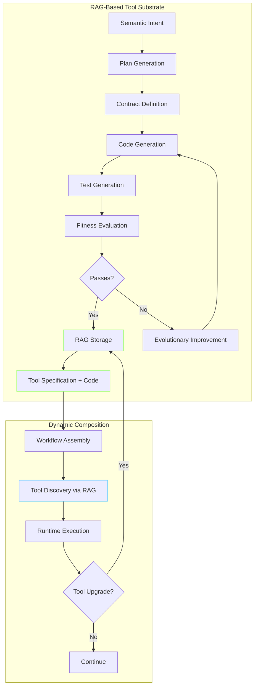

**The RAG substrate is the secret sauce.** Every tool's specification—its contract, its purpose, its fitness scores—becomes searchable identity. When you need a tool, the system finds the best match. When you upgrade a tool, every workflow that uses it automatically gets the improvement.

It's like having a self-organising toolbox that gets smarter over time.

### The Memory Problem: Stop Relearning How to Drive

**Normal AIs use the "quick study" approach.** Every time they tackle a task, they're cramming for an exam—reading all the context, figuring out the problem, generating a solution. It's like having to redo your driving lessons every single time you get in a car. Not your driving *test* (though that's another problem with AI solutions), your actual *lessons*. Imagine explaining what a clutch does every morning before your commute.

Modern code CLIs have a partial solution: look at your project directory for CLAUDE.md, or a bunch of odd markdown docs scattered about. Those files? That's as good as they can do with memory. It's like leaving Post-It notes for yourself, except you have to read all of them every time before doing anything.

**DiSE actually remembers.** When it solves a problem, it stores the solution as a tested, documented tool in the RAG substrate. Next time? It just uses it. No re-learning. No re-figuring. No "let me read all your context files again." It drove this route yesterday, it knows where the turns are.

This ties directly into the concepts I've been banging on about in my Semantic Intelligence series—specifically:

- **[Part 8: Tools All The Way Down](/blog/semanticintelligence-part8)** for self-optimizing toolkits
- **[Part 9: Self-Healing Tools](/blog/semanticintelligence-part9)** for lineage-aware evolution
- **[Part 10: The DiSE Cooker](/blog/semanticintelligence-part10)** for workflow composition

Every node already has:

- A specification (so you know what it's *meant* to do)
- A contract (so you know what it *actually* does)
- Runnable code (shocking, I know)
- Tests that must pass (none of this "we'll add tests later" nonsense)
- A load test harness (because "it worked on my laptop" isn't a deployment strategy)
- A reason for existing (no zombie code haunting your codebase)

That's the substrate needed to scale AI responsibly—not more tokens, not bigger models, not another bloody ChatGPT wrapper.

## The Extensibility: Tools Are Optional, LLMs Are Optional

Here's the bit that really matters: **tools and LLMs are optional**. The system ships with a default LLM, and it can work everything out from scratch if it has to. But tools give it a head start.

**Think of tools like library books.** Some are JSON files (specialist prompts for reasoning, coding, analysis—themselves mutable and evolvable). Many are Python scripts (static analysis, scikit-learn for ML, neural translation—specialist abilities ready to use). Some even have templates (for code generation, giving the system a tighter loop when creating new tools). One tool literally installs Node.js and uses mermaid.js for diagram rendering. Some are data stores the system can query. Some are code fixes for common patterns.

**All of them live in the RAG. All of them are accessible to all workflows.**

You don't *need* the library. The system can figure things out on its own. But having 200 tools is like having 200 books explaining "here's how to do X efficiently." When it needs to parse JSON, it doesn't have to derive JSON parsing from first principles—it has a tool. When it needs machine learning, it doesn't have to implement gradient descent—it calls scikit-learn. When it needs to generate diagrams, it uses the mermaid tool that installs its own dependencies.

The system can:

- **Use multiple LLMs** – Or just one. Or none for some tasks once they're distilled to Python
- **Integrate specialist tools** – Or not. It can build them if needed
- **Work with MCP tools** – Ships with around 200 tools including ~10 MCP integrations. One tool can discover new MCP services and wrap them. But you could start with zero tools and it would bootstrap itself
- **Build itself from scratch** – Given enough time and compute. Tools just mean it doesn't have to

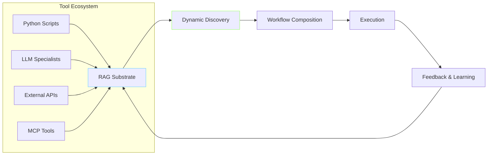

And because everything is stored in the RAG substrate with semantic search, you can build **interrelated networks of systems** that share tools and learnings. One system figures out how to handle a tricky data transformation? Every connected system now knows about it.

The system optimises based on **applied pressure**:
- **Performance pressure?** Generate faster variants, test them, keep the winners
- **Error pressure?** Build validation tools, add checks, improve robustness
- **Cost pressure?** Replace LLM calls with Python scripts, cache aggressively, use cheaper models

It only does work when needed. No premature optimisation. No "we might need this someday" code. Just targeted improvements in response to actual, measured problems.

It's like having a hive mind for your tooling, except less creepy and more auditable.

### The Network Effect: Connected Intelligence

Here's where it gets properly sci-fi (but in a good way). Multiple instances can share a RAG substrate, creating an **interrelated network of systems** that collectively learn and improve:

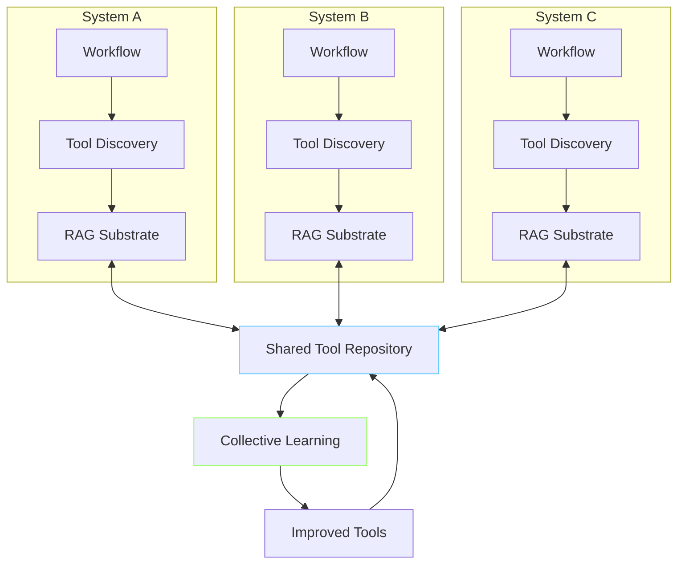

**What this means in practice:**
- System A creates a brilliant data validation tool → Everyone gets it
- System B discovers a faster way to parse logs → Everyone benefits
- System C figures out how to integrate a new API → The knowledge propagates

Each system maintains its own workflows and specialisations, but they all contribute to and benefit from a shared repository of tested, validated, fitness-scored tools.

It's collaborative AI engineering without the chaos. Every contribution is tested, versioned, and auditable. No one can accidentally break everyone else's stuff (looking at you, node_modules).

### Adaptive Intelligence: Cheap by Default, Smart When Needed

Here's another clever bit: the system doesn't need expensive frontier models running 24/7. It uses a **graduating workflow** approach where:

- **The Sentinel** (a very fast 1B-class LLM) handles all mundane housekeeping - routing, classification, simple decisions
- **Cheap, fast models** handle routine work (your local Llama, Phi, or similar)
- **Mid-tier models** tackle moderate complexity (GPT-3.5, Claude Haiku)
- **Frontier models** only get called for genuinely hard problems (GPT-4, Claude Opus)

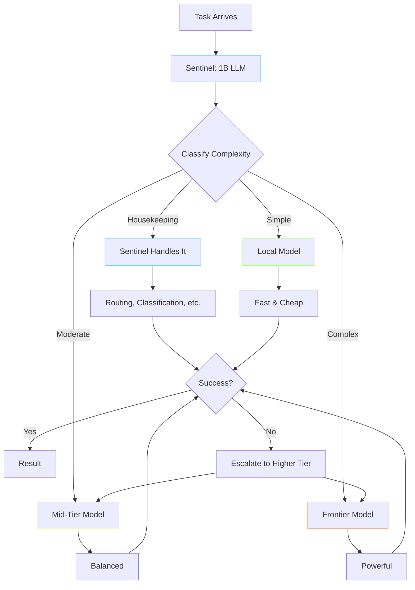

**The Sentinel is the secret to keeping costs down.** It's a tiny, fast 1B-parameter model that runs constantly, handling:
- Task routing and complexity classification
- Simple yes/no decisions
- Data validation and formatting
- Error detection and triage
- Monitoring and housekeeping

Think of it as the receptionist who knows when to handle something themselves and when to escalate to the senior partners. It runs in milliseconds, costs fractions of a penny, and keeps the expensive models from being bothered with trivia.

But here's where it gets really interesting: **connect to a frontier LLM temporarily** (even just for a few hours), and the system will use that extra power to:

1. **Optimise itself** – Review its own tools, identify improvements, generate better versions
2. **Upgrade safely** – All changes still go through the full test suite and fitness evaluation
3. **Learn new patterns** – Discover better ways to solve common problems
4. **Bootstrap capabilities** – Generate new tools it didn't have before

Then you can disconnect the expensive model, and the system keeps running with all those improvements baked in as tested Python scripts. The Sentinel keeps everything ticking over, and you've essentially "distilled" the frontier model's intelligence into your tool library.

### Dynamic Environmental Adaptation

The system also responds to data and environmental changes **dynamically and cheaply**:

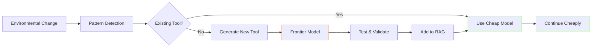

**In practice:**
- API format changes? Generate an adapter tool once (expensive), then use it forever (cheap)
- New data source? Figure out the parser with a smart model, then run it with a dumb one
- Workflow needs optimising? Have Claude spend 30 seconds thinking about it, save the result as a Python script

You're essentially paying for intelligence upfront, then running on autopilot afterwards. It's like hiring a consultant to fix your processes, except the consultant is an LLM and the fixes are version-controlled Python scripts with test coverage.

The graduating workflow concept means you can respond to environmental changes dynamically and maintain a massive system for pennies a day, only escalating to expensive models when you genuinely need them.

## AI Didn't Fix the Problem — It Evolved Away From It

Right, let me be clear about what this system actually does, because most AI claims sound like Silicon Valley fairy tales: "The AI noticed everything was down and heroically saved the day!" That's not what happens here. This is more mature than that.

Here's the actual mechanism:

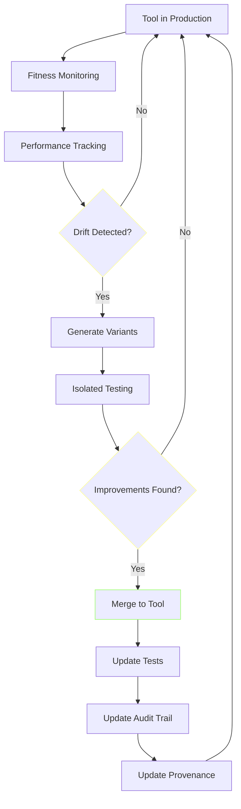

The system:

1. **Tracks fitness and performance over time** – Not just "is it working?" but "is it working as well as it used to?"
2. **Detects very small drifts before anyone would notice** – Subtle degradation in accuracy, tiny increases in latency, marginal upticks in error rates
3. **Tests nearby variants safely, in isolation** – Generates alternative implementations, runs them through the full test suite, measures their fitness
4. **Merges proven improvements back into the tool** – Only after validation, only with full test coverage
5. **Updates the code with tests, audit logs, provenance** – Every change is traceable, every improvement is documented
6. **Moves on** – No fanfare, no alerts, no drama

**It didn't "fix the problem." It simply evolved away from it.**

There's no emergency response. No incident report. No post-mortem meeting where everyone pretends they knew what was happening. The system noticed a trend, explored alternatives, validated improvements, and integrated them. By the time a human would have noticed something was slightly off, the tool had already improved itself.

### What This Looks Like In Practice

Let's say you've got a tool that parses API responses. Over three weeks, the API provider makes subtle changes to their format—nothing that breaks immediately, just small inconsistencies. Response times creep up by 50ms. Parse success rate drops from 99.8% to 99.3%.

**Traditional approach:**
- Week 4: Someone notices slower dashboard loads
- Week 5: Investigation begins, blame game commences
- Week 6: Root cause identified (maybe)
- Week 7: Developer writes fix, tests locally
- Week 8: Deploy, cross fingers, hope it works

**DiSE approach:**
- Week 2: Fitness monitoring detects 0.2% drop in parse success
- Week 2, Day 3: System generates three parser variants
- Week 2, Day 3: Variants tested against captured traffic
- Week 2, Day 3: Best variant merged (99.9% success rate)
- Week 2, Day 3: Tests updated, audit trail recorded
- Week 4: Humans remain blissfully unaware anything happened

No drama. No intervention. Just disciplined, preventative evolution.

### The Engineering Discipline Behind "Evolution"

This isn't magic, and it's definitely not AGI doing mysterious things. It's straightforward engineering:

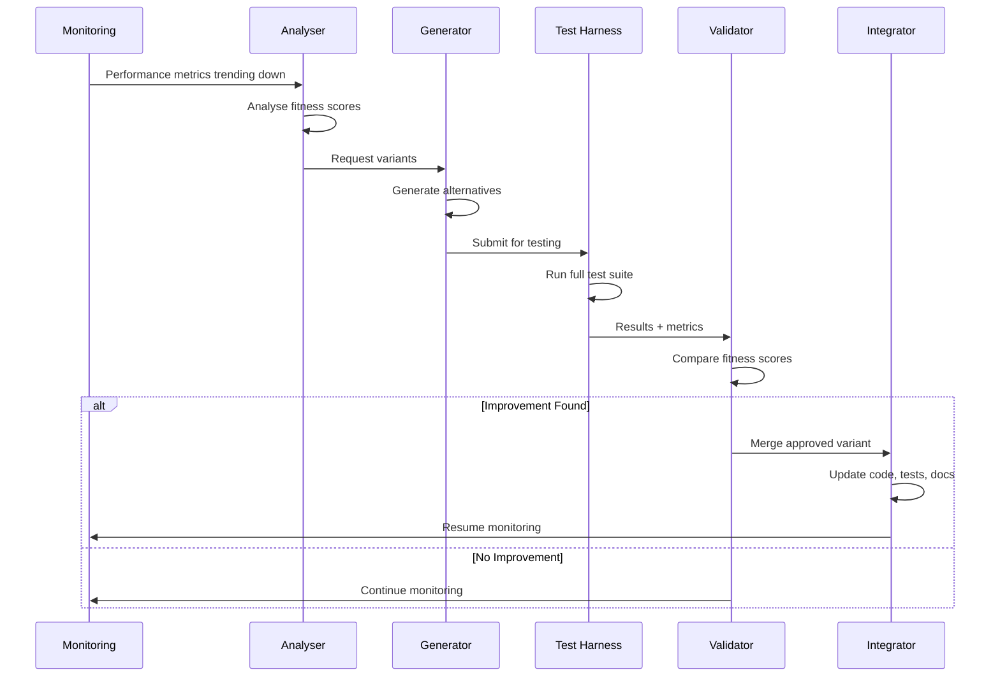

Every step is deterministic. Every decision is measurable. Every change is auditable.

The "evolution" is just:
- Continuous measurement
- Automated hypothesis generation
- Rigorous testing
- Fitness-based selection
- Disciplined integration

It's not sentient. It's not clever. It's just patient, thorough, and doesn't take weekends off.

## Why This Matters (Or: Why I'm Not Just Making This Up)

Because without discipline, here's what happens:

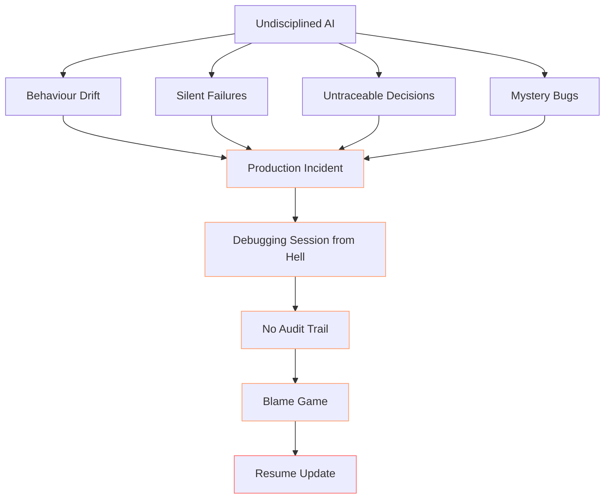

Right, so that's the nightmare scenario. Here's what this approach actually gives you:

- **Inspectable** – You can see exactly what it does and why (revolutionary, I know)
- **Improvable** – Fitness scoring shows what's actually better, not what *feels* better
- **Versioned** – Changes are tracked because we're not barbarians
- **Accountable** – Every decision has a traceable reason (your auditors will love you)

That's how AI becomes real software again—something you can trust, reason about, and ship at scale without having a small panic attack every time you deploy.

## The Disciplined AI Lifecycle

Here's the full lifecycle, because I promised Mermaid diagrams and I'm a man of my word:

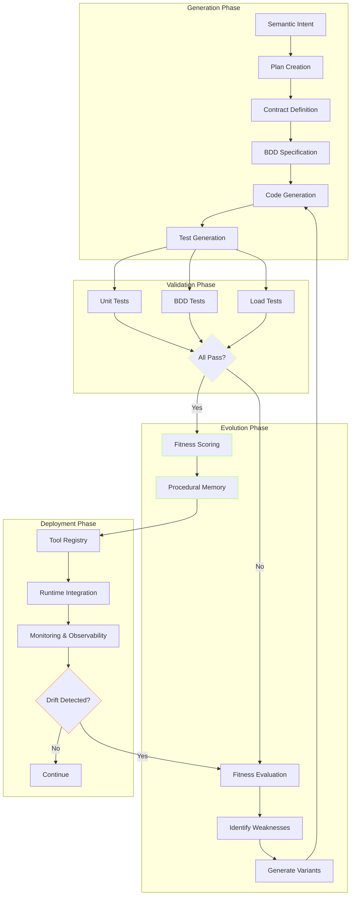

This isn't a theoretical framework I dreamt up in the shower (though to be fair, that's where most of my best ideas come from). This is working code, generating working tools, with working tests.

## For Regulated Industries (Or: The Bit Where The Money Is)

This matters especially in finance, healthcare, legal, and government sectors where:

- Every decision must be auditable (because the FCA doesn't accept "the AI did it" as an excuse)
- Behaviour must be consistent and explainable (wild concept, I know)
- Changes must be tracked and justified (time travel not included)
- Failures must be traceable to root causes (not just "¯\\_(ツ)_/¯")

Here's what compliance looks like with disciplined AI:

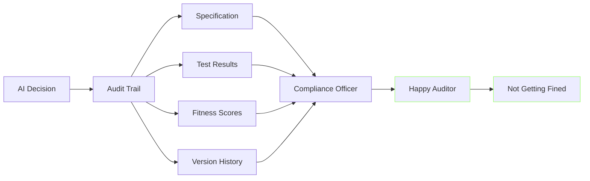

In these environments, traditional "prompt and pray" AI isn't just risky—it's unusable. You need systems that behave like engineered software, not black boxes that occasionally output correct-looking gibberish.

## The Evidence Is Here (Not Coming Soon™)

That folder structure isn't a mockup. It's not a future vision. It's not some concept art I knocked up to get funding.

It's the **first implementation** of how AI systems will have to work when they grow up and get proper jobs.

This isn't promising a future—it's showing you what exists *right now*. The discipline. The auditability. The fitness scoring. The evolvability.

All of it, working, today. In production. Not breaking things (mostly).

## Technical Deep Dive: The Tool Generation Flow

For the nerds in the audience (hello, fellow nerds), here's how a tool actually gets generated:

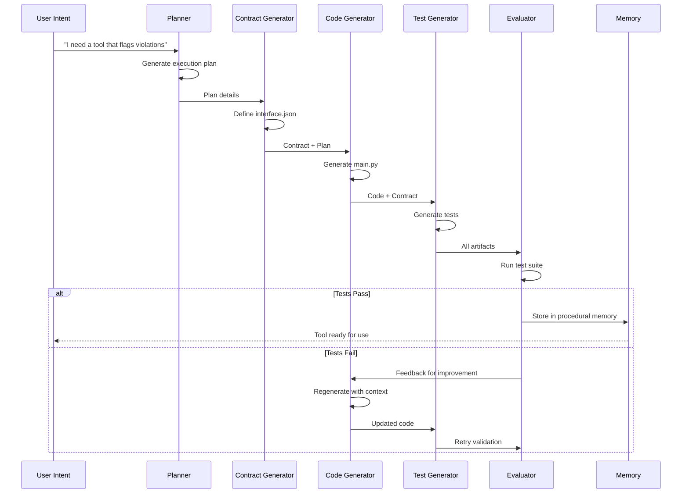

Each step is traceable. Each decision is recorded. Each failure is a learning opportunity rather than a mystery.

If you want the full technical details, check out the Semantic Intelligence series:
- [Part 8: Tools All The Way Down](/blog/semanticintelligence-part8) - How tools track and evolve themselves
- [Part 9: Self-Healing Tools](/blog/semanticintelligence-part9) - Lineage-aware pruning and evolution
- [Part 10: The DiSE Cooker](/blog/semanticintelligence-part10) - Tools cooking themselves into workflows

## Next Steps (Or: The Bit Where I Ask For Money)

This is the proof of concept. The foundation is built. The approach is validated. The diagrams are unnecessarily pretty.

**Here's the kicker: I'm neither an AI engineer nor a Python coder.** I'm a concept person who had an idea and used Claude Code to build it. The entire system—the tools, the workflows, the evolutionary substrate—was built by describing what I wanted and letting Claude Code figure out how to make it real. Which is rather fitting for a system about AI building AI tools.

The code exists. It works. It's [open source on GitHub](https://github.com/scottgal/mostlylucid.dse) under the Unlicense (so please don't steal it, just use it properly).

What comes next is turning this into a product that organisations can use to build AI systems that actually work at scale—with the discipline, accountability, and reliability that enterprise software demands (and that your CEO promised the board).

I've spent the last [insert worrying number here] months building this whilst simultaneously maintaining my blog, my sanity, and my coffee addiction. If someone with no Python expertise can build this using AI-assisted development, imagine what actual engineers could do with the concept.

If you're interested in making this happen—whether you want to use it, invest in it, or just buy me enough coffee to finish building it—let's talk.

**Contact:** [scott.galloway+dse@gmail.com](mailto:scott.galloway+dse@gmail.com)

## Conclusion

AI doesn't have to be fragile, untestable, and unaccountable. With the right discipline from the start—tests, contracts, specifications, and fitness scoring—AI can become real software.

Software you can trust. Software you can improve. Software you can ship without crossing your fingers.

That's the pitch. And unlike most pitches, it's already working.

Now, who's buying the first round?
