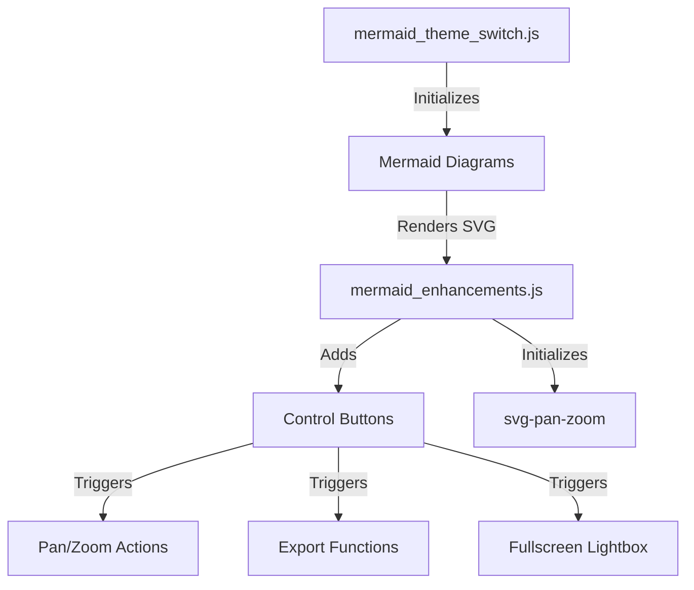

# Enhancing Mermaid Diagrams with Pan/Zoom and Export

<!--category-- Mermaid, Javascript, SVG, DaisyUI, Tailwind -->
<datetime class="hidden">2025-11-07T11:15</datetime>

# Introduction

> **npm Package Available:** This implementation is now available as [@mostlylucid/mermaid-enhancements](https://www.npmjs.com/package/@mostlylucid/mermaid-enhancements) - a production-ready npm package. See [Publishing Mermaid Enhancements as an npm Package](/blog/publishingmermaidenhancementsnpm) for details on how to use it in your projects.

Mermaid is a fantastic tool for creating diagrams from text, but the default rendering can be limiting for complex diagrams. Users can't easily zoom in to see details, pan around large diagrams, or export them for documentation. In this article, I'll show you how I enhanced Mermaid diagrams on this site with interactive pan/zoom controls, fullscreen lightbox viewing, and export functionality (both PNG and SVG formats).

This implementation is production-ready, handles dark mode switching gracefully, and is resilient to Cloudflare Rocket Loader interference.

## What it looks like
So what we're going for is this. A nice in page (and popout) mermaid.js display that's sorta like GitHub's but *better*. Means diagrams don't take up SCREENS but are still easuu to read.


[TOC]

# The Problem
Out of the box, Mermaid diagrams have several limitations:
1. **Fixed size** - Large diagrams are either cut off or shrunk to fit
2. **No interactivity** - Can't zoom in to see details or pan around
3. **No export** - Users can't save diagrams for external use
4. **Poor mobile experience** - Small screens make complex diagrams unusable
5. **Theme switching issues** - Diagrams don't always re-render correctly when switching between light and dark mode

# The Solution 
I've implemented a comprehensive enhancement system that adds:
- **Interactive pan/zoom** using the svg-pan-zoom library
- **Floating control buttons** for zoom in/out, reset, pan toggle, and export
- **Fullscreen lightbox** mode for better viewing
- **PNG and SVG export** functionality
- **Auto-fit on load** so entire diagram is visible by default Seeing
- **Full-width display** removing artificial size constraints

## Architecture Overview
The solution consists of three main components:



# Implementation

## Installing Dependencies
First, install the required npm packages:

```bash
npm install svg-pan-zoom html-to-image
```

These libraries provide:
- `svg-pan-zoom` - Interactive pan and zoom functionality for SVG elements
- `html-to-image` - Export SVG/PNG functionality

## Core Enhancement Module
The main enhancement module (`mermaid_enhancements.js`) handles all the interactive features.

### Creating Control Buttons
Each diagram gets a floating control panel with buttons for all actions:

```javascript
function createControlButtons(container, diagramId) {
    // Check if controls already exist
    if (container.querySelector('.mermaid-controls')) {
        return;
    }

    const controlsDiv = document.createElement('div');
    controlsDiv.className = 'mermaid-controls';

    const buttons = [
        { icon: 'bx-fullscreen', title: 'Fullscreen', action: 'fullscreen' },
        { icon: 'bx-zoom-in', title: 'Zoom In', action: 'zoomIn' },
        { icon: 'bx-zoom-out', title: 'Zoom Out', action: 'zoomOut' },
        { icon: 'bx-reset', title: 'Reset View', action: 'reset' },
        { icon: 'bx-move', title: 'Pan', action: 'pan' },
        { icon: 'bx-image', title: 'Export as PNG', action: 'exportPng' },
        { icon: 'bx-code-alt', title: 'Export as SVG', action: 'exportSvg' }
    ];

    buttons.forEach(btn => {
        const button = document.createElement('button');
        button.className = `mermaid-control-btn bx ${btn.icon}`;
        button.setAttribute('title', btn.title);
        button.setAttribute('aria-label', btn.title);
        button.setAttribute('data-action', btn.action);
        button.setAttribute('data-diagram-id', diagramId);
        controlsDiv.appendChild(button);
    });

    container.appendChild(controlsDiv);
}
```

### Initializing Pan/Zoom
The svg-pan-zoom library provides smooth, performant interaction:

```javascript
function initPanZoom(svgElement, diagramId) {
    // Clean up existing instance if present
    if (panZoomInstances.has(diagramId)) {
        try {
            panZoomInstances.get(diagramId).destroy();
        } catch (e) {
            console.warn('Failed to destroy existing pan-zoom instance:', e);
        }
        panZoomInstances.delete(diagramId);
    }

    try {
        const panZoomInstance = svgPanZoom(svgElement, {
            zoomEnabled: true,
            controlIconsEnabled: false, // We use custom controls
            fit: true,
            center: true,
            minZoom: 0.1,
            maxZoom: 10,
            zoomScaleSensitivity: 0.3,
            dblClickZoomEnabled: true,
            mouseWheelZoomEnabled: true,
            preventMouseEventsDefault: true,
            contain: false
        });

        panZoomInstances.set(diagramId, panZoomInstance);
        return panZoomInstance;
    } catch (error) {
        console.error('Failed to initialize pan-zoom:', error);
        return null;
    }
}
```

### Export Functionality
The export system preserves diagram quality and handles both PNG and SVG formats:

```javascript
async function exportDiagram(container, format, diagramId) {
    try {
        const svgElement = container.querySelector('svg');
        if (!svgElement) {
            window.showToast && window.showToast('No diagram found to export', 3000, 'error');
            return;
        }

        // Clone the SVG to avoid modifying the original
        const clonedSvg = svgElement.cloneNode(true);

        // Get the viewBox or calculate from bounding box
        let viewBox = clonedSvg.getAttribute('viewBox');
        if (!viewBox) {
            const bbox = svgElement.getBBox();
            viewBox = `${bbox.x} ${bbox.y} ${bbox.width} ${bbox.height}`;
            clonedSvg.setAttribute('viewBox', viewBox);
        }

        // Parse viewBox to get dimensions
        const [, , vbWidth, vbHeight] = viewBox.split(' ').map(Number);

        // Set explicit dimensions based on viewBox for proper export
        clonedSvg.setAttribute('width', vbWidth);
        clonedSvg.setAttribute('height', vbHeight);

        // Remove inline styles but keep viewBox
        clonedSvg.removeAttribute('style');
        clonedSvg.style.backgroundColor = 'transparent';
        clonedSvg.style.maxWidth = 'none';

        // Create temporary container
        const tempDiv = document.createElement('div');
        tempDiv.style.position = 'absolute';
        tempDiv.style.left = '-9999px';
        tempDiv.appendChild(clonedSvg);
        document.body.appendChild(tempDiv);

        let dataUrl;
        const timestamp = new Date().toISOString().replace(/[:.]/g, '-');
        const filename = `mermaid-diagram-${timestamp}`;

        if (format === 'png') {
            dataUrl = await toPng(clonedSvg, {
                backgroundColor: 'white',
                pixelRatio: 2 // Higher quality
            });
            downloadFile(dataUrl, `${filename}.png`);
        } else {
            dataUrl = await toSvg(clonedSvg, {
                backgroundColor: 'transparent'
            });
            downloadFile(dataUrl, `${filename}.svg`);
        }

        // Clean up
        document.body.removeChild(tempDiv);

        window.showToast && window.showToast(`Diagram exported as ${format.toUpperCase()}`, 3000, 'success');
    } catch (error) {
        console.error('Failed to export diagram:', error);
        window.showToast && window.showToast('Failed to export diagram', 3000, 'error');
    }
}
```

**Key export considerations:**
1. **Preserve viewBox** - Critical for capturing the entire diagram, not just the visible portion
2. **Calculate dimensions** - Explicitly set width/height from viewBox for consistent export
3. **Remove transforms** - Strip pan-zoom transforms so export shows the full diagram
4. **Background handling** - White background for PNG, transparent for SVG
5. **High resolution** - Use `pixelRatio: 2` for crisp PNG exports

### Fullscreen Lightbox
The lightbox provides an immersive viewing experience:

```javascript
function openFullscreenLightbox(container, diagramId) {
    const svgElement = container.querySelector('svg');
    if (!svgElement) return;

    // Create lightbox overlay
    const lightbox = document.createElement('div');
    lightbox.className = 'mermaid-lightbox';
    lightbox.innerHTML = `
        <div class="mermaid-lightbox-content">
            <button class="mermaid-lightbox-close bx bx-x" aria-label="Close"></button>
            <div class="mermaid-lightbox-diagram-wrapper">
                <div class="mermaid-lightbox-diagram"></div>
            </div>
        </div>
    `;

    // Clone and prepare SVG
    const clonedSvg = svgElement.cloneNode(true);
    clonedSvg.removeAttribute('width');
    clonedSvg.removeAttribute('height');
    clonedSvg.style.width = '100%';
    clonedSvg.style.height = '100%';

    const diagramContainer = lightbox.querySelector('.mermaid-lightbox-diagram');
    diagramContainer.appendChild(clonedSvg);

    // Add controls to lightbox
    const wrapper = lightbox.querySelector('.mermaid-lightbox-diagram-wrapper');
    const lightboxDiagramId = `${diagramId}-lightbox`;
    createControlButtons(wrapper, lightboxDiagramId);

    document.body.appendChild(lightbox);

    // Initialize pan-zoom after layout completes
    setTimeout(() => {
        const panZoom = initPanZoom(clonedSvg, lightboxDiagramId);
        if (panZoom) {
            panZoom.resize();
            panZoom.fit();
            panZoom.center();
        }
    }, 100);

    // Close handlers
    const closeLightbox = () => {
        if (panZoomInstances.has(lightboxDiagramId)) {
            try {
                panZoomInstances.get(lightboxDiagramId).destroy();
            } catch (e) {
                console.warn('Failed to destroy lightbox pan-zoom:', e);
            }
            panZoomInstances.delete(lightboxDiagramId);
        }
        lightbox.remove();
    };

    lightbox.querySelector('.mermaid-lightbox-close').addEventListener('click', closeLightbox);
    lightbox.addEventListener('click', (e) => {
        if (e.target === lightbox) closeLightbox();
    });

    // ESC key to close
    const escHandler = (e) => {
        if (e.key === 'Escape') {
            closeLightbox();
            document.removeEventListener('keydown', escHandler);
        }
    };
    document.addEventListener('keydown', escHandler);
}
```

### Main Enhancement Function
This ties everything together and is called after Mermaid renders:

```javascript
export function enhanceMermaidDiagrams() {
    const diagrams = document.querySelectorAll('.mermaid[data-processed="true"]');

    diagrams.forEach(diagram => {
        const svgElement = diagram.querySelector('svg');
        if (!svgElement) return;

        // CRITICAL: Remove inline max-width constraint that Mermaid adds
        svgElement.style.maxWidth = 'none';

        // Wrap diagram with controls
        const diagramId = wrapDiagramWithControls(diagram);

        // Initialize pan/zoom and auto-fit
        const panZoom = initPanZoom(svgElement, diagramId);
        if (panZoom) {
            // Fit diagram to container by default
            setTimeout(() => {
                panZoom.resize();
                panZoom.fit();
                panZoom.center();
            }, 100);
        }
    });

    // Set up event delegation for control buttons (only once)
    if (!document.body.hasAttribute('data-mermaid-controls-initialized')) {
        document.body.addEventListener('click', handleControlClick);
        document.body.setAttribute('data-mermaid-controls-initialized', 'true');
    }
}
```

**Critical fix:** Mermaid applies an inline `style="max-width: 1020px"` to SVG elements, which prevents full-width display. Removing this is essential for proper responsive behavior.

## Theme Integration
The theme switcher ensures diagrams re-render correctly when switching between light and dark modes:

```javascript
import { enhanceMermaidDiagrams } from './mermaid_enhancements';

const loadMermaid = async (theme) => {
    if (!window.mermaid) return;
    try {
        window.mermaid.initialize({
            startOnLoad: false,
            theme,
            themeVariables: {
                background: 'transparent'
            }
        });
        await window.mermaid.run({
            querySelector: elementSelector,
        });

        // Enhance diagrams after rendering completes
        // Use requestAnimationFrame for better timing
        await new Promise(resolve => {
            requestAnimationFrame(() => {
                requestAnimationFrame(() => {
                    enhanceMermaidDiagrams();
                    resolve();
                });
            });
        });
    } catch (err) {
        console.error('Mermaid render error:', err);
    }
};
```

Using `requestAnimationFrame` twice ensures the browser has completed painting the SVG before we try to enhance it.

## Cloudflare Rocket Loader Compatibility
Cloudflare's Rocket Loader can delay JavaScript execution, breaking initialization. Here's the bulletproof solution:

```javascript
// Wait for all dependencies to load with exponential backoff
function waitForDependencies(maxAttempts = 50) {
    return new Promise((resolve) => {
        let attempts = 0;

        const checkDependencies = () => {
            attempts++;

            const depsReady =
                typeof window.hljs !== 'undefined' &&
                typeof window.mermaid !== 'undefined' &&
                typeof window.Alpine !== 'undefined' &&
                typeof window.htmx !== 'undefined';

            if (depsReady) {
                console.log('All dependencies loaded after', attempts, 'attempts');

                // Start Alpine.js now that it's loaded
                if (window.Alpine && !window.Alpine.version) {
                    try {
                        window.Alpine.start();
                        console.log('Alpine.js started');
                    } catch (err) {
                        console.error('Failed to start Alpine:', err);
                    }
                }

                resolve();
            } else if (attempts >= maxAttempts) {
                console.warn('Timeout waiting for dependencies');
                resolve(); // Continue anyway
            } else {
                // Retry with exponential backoff
                const delay = Math.min(50 * Math.pow(1.2, attempts), 500);
                setTimeout(checkDependencies, delay);
            }
        };

        checkDependencies();
    });
}

// Robust initialization
async function safeInitialize() {
    try {
        await waitForDependencies();

        if (document.readyState === 'loading') {
            await new Promise(resolve => {
                document.addEventListener('DOMContentLoaded', resolve, { once: true });
            });
        }

        await initializePage();
    } catch (err) {
        console.error('Failed to initialize page:', err);
        // Retry once after delay
        setTimeout(() => {
            initializePage().catch(e => console.error('Retry failed:', e));
        }, 1000);
    }
}

safeInitialize();
```

Also ensure your main script has the `data-cfasync="false"` attribute to exclude it from Rocket Loader:

```html
<script src="~/js/dist/main.js" type="module" asp-append-version="true" data-cfasync="false"></script>
```

## Styling with Tailwind/DaisyUI
The CSS uses Tailwind utility classes and custom styling for polish:

```css
/* Mermaid diagram wrapper */
.mermaid-wrapper {
    @apply relative rounded-lg overflow-hidden w-full;
    margin: 1rem 0;
}

.mermaid-wrapper .mermaid {
    @apply m-0 w-full;
    min-height: 500px;
    display: flex;
    align-items: center;
    justify-content: center;
    padding: 1rem;
}

.mermaid-wrapper .mermaid svg {
    width: 100% !important;
    height: auto !important;
    min-height: 450px;
}

/* Control buttons */
.mermaid-controls {
    @apply absolute top-2 right-2 flex gap-1 z-10;
    background: rgba(255, 255, 255, 0.9);
    border-radius: 0.5rem;
    padding: 0.25rem;
    box-shadow: 0 2px 8px rgba(0, 0, 0, 0.1);
}

.dark .mermaid-controls {
    background: rgba(31, 41, 55, 0.95);
    box-shadow: 0 2px 8px rgba(0, 0, 0, 0.3);
}

.mermaid-control-btn {
    @apply p-2 rounded cursor-pointer transition-all duration-200;
    background: transparent;
    border: none;
    color: #4b5563;
    font-size: 1.25rem;
    display: flex;
    align-items: center;
    justify-content: center;
    width: 2rem;
    height: 2rem;
}

.mermaid-control-btn:hover {
    background: rgba(37, 99, 235, 0.1);
    color: #2563eb;
    transform: scale(1.1);
}

.dark .mermaid-control-btn {
    color: #9ca3af;
}

.dark .mermaid-control-btn:hover {
    background: rgba(55, 65, 81, 0.8);
    color: #60a5fa;
}

/* Lightbox */
.mermaid-lightbox {
    @apply fixed inset-0 z-50 flex items-center justify-center;
    background: rgba(0, 0, 0, 0.85);
    backdrop-filter: blur(4px);
    animation: fadeIn 0.2s ease-out;
}

.dark .mermaid-lightbox {
    background: rgba(0, 0, 0, 0.95);
}

.mermaid-lightbox-content {
    @apply relative w-11/12 h-5/6 bg-white rounded-lg shadow-2xl;
    max-width: 1400px;
}

.dark .mermaid-lightbox-content {
    @apply bg-gray-800;
}

.mermaid-lightbox-close {
    @apply absolute top-4 right-4 z-10 p-2 rounded-full cursor-pointer transition-all;
    background: rgba(0, 0, 0, 0.5);
    border: none;
    color: white;
    font-size: 2rem;
    width: 3rem;
    height: 3rem;
    display: flex;
    align-items: center;
    justify-content: center;
}

.mermaid-lightbox-close:hover {
    background: rgba(220, 38, 38, 0.8);
    transform: scale(1.1);
}

@keyframes fadeIn {
    from { opacity: 0; }
    to { opacity: 1; }
}
```

# Testing and Debugging
Here's how to verify everything works:

## Console Output
With proper initialization, you should see:

```
All dependencies loaded after 1 attempts
Alpine.js started
Highlight.js copy plugin registered
Highlight.js initialized on page load
Mermaid initialized on page load
Document is ready - all initializations complete
HTMX event listener registered successfully
```

## HTMX Dynamic Content
After HTMX swaps, you should see:

```
HTMX afterSettle triggered for: contentcontainer
Highlight.js applied after HTMX swap
Mermaid initialized
Mermaid applied after HTMX swap
HTMX afterSettle complete for: contentcontainer
```

## Testing Checklist
- [ ] Diagrams render on initial page load
- [ ] Pan/zoom controls work
- [ ] Fullscreen lightbox opens and closes (X button, click outside, ESC key)
- [ ] PNG export captures full diagram (not just corner)
- [ ] SVG export preserves vectors
- [ ] Works after HTMX content swap
- [ ] Theme switching re-renders diagrams correctly
- [ ] Mobile responsive (controls stay visible, diagrams scale)
- [ ] Dark mode styling applies correctly
- [ ] Keyboard accessibility (tab to controls, enter to activate)

# Performance Considerations
1. **Lazy initialization** - Only enhance diagrams that exist on the page
2. **Instance cleanup** - Destroy pan-zoom instances when diagrams are removed
3. **Event delegation** - Single click listener handles all control buttons
4. **requestAnimationFrame** - Better timing than arbitrary setTimeout values
5. **Debounced exports** - Prevent rapid-fire export clicks

# Browser Compatibility
Tested and working on:
- Chrome/Edge 90+
- Firefox 88+
- Safari 14+
- Mobile browsers (iOS Safari, Chrome Mobile)

**IE11 is not supported** due to modern JavaScript features (const, arrow functions, async/await, requestAnimationFrame).

# Conclusion
This comprehensive enhancement transforms static Mermaid diagrams into interactive, exportable visualizations. The implementation is production-ready, resilient to edge cases, and provides an excellent user experience.

Key takeaways:
- Remove Mermaid's inline `max-width` constraint for full-width diagrams
- Preserve viewBox when exporting to capture entire diagram
- Use requestAnimationFrame for timing instead of arbitrary delays
- Handle Cloudflare Rocket Loader with dependency checking and retry logic
- Provide multiple close methods for lightbox (button, click outside, ESC)
- Use event delegation for performance with many diagrams

## Using the npm Package

Rather than copying code, you can now install this functionality as an npm package:

```bash
npm install @mostlylucid/mermaid-enhancements
```

```typescript
import { init } from '@mostlylucid/mermaid-enhancements';
import '@mostlylucid/mermaid-enhancements/styles.css';

await init();
```

See [Publishing Mermaid Enhancements as an npm Package](/blog/publishingmermaidenhancementsnpm) for full documentation, framework integration examples, and advanced configuration options.

The complete source code is also available in this blog's repository at `Mostlylucid/src/js/mermaid_enhancements.js` and as an open-source npm package at [mostlylucidweb/mostlylucid-mermaid](https://github.com/scottgal/mostlylucidweb/tree/main/mostlylucid-mermaid).

## Example Diagram
Here's a complex example showing the architecture of this blog's content system:

```mermaid
graph TB
    subgraph Client["Client Browser"]
        A[User Request] -->|HTMX| B[Blog Controller]
        B -->|Cache Miss| C[Blog Service]
        C -->|File Mode| D[Markdown Service]
        C -->|DB Mode| E[EF Core Context]
        D -->|Parse| F[Markdig Pipeline]
        F -->|Render| G[HTML + Mermaid]
        E -->|Query| H[PostgreSQL]
        H -->|Full-Text Search| I[GIN Index]
        G -->|Enhance| J[mermaid_enhancements.js]
        J -->|Initialize| K[svg-pan-zoom]
        J -->|Add| L[Control Buttons]
        L -->|Export| M[html-to-image]
    end

    subgraph Background["Background Services"]
        N[File Watcher] -->|Change Detected| O[Saves to DB]
        O -->|Trigger| P[Translation Service]
        P -->|Batch| Q[EasyNMT API]
        Q -->|12 Languages| R[Translated Files]
    end 

    style A fill:#4ade80
    style G fill:#60a5fa
    style J fill:#f59e0b
    style K fill:#ec4899
    style M fill:#8b5cf6
```



Try clicking the controls on the diagram above!
