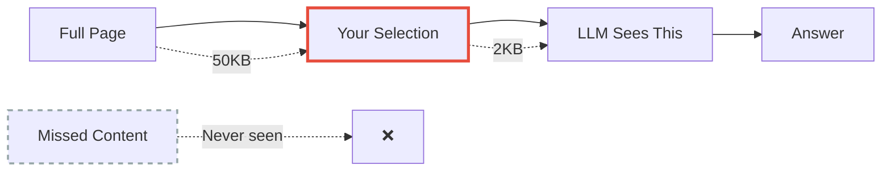
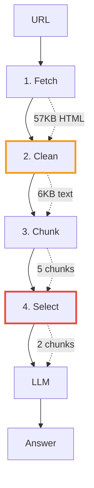
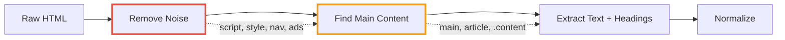
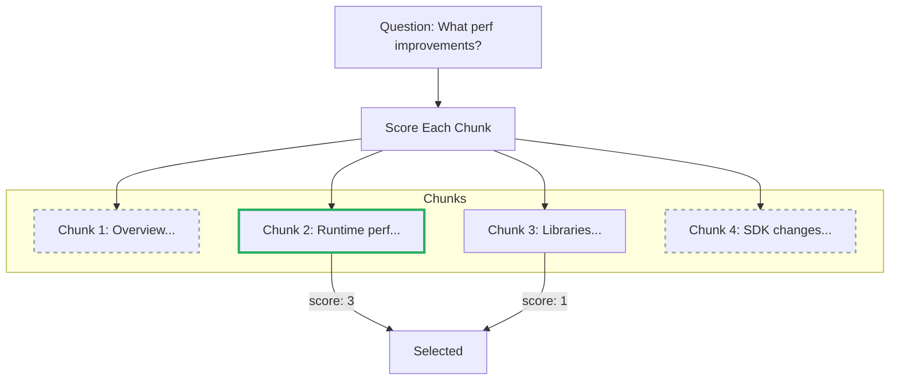
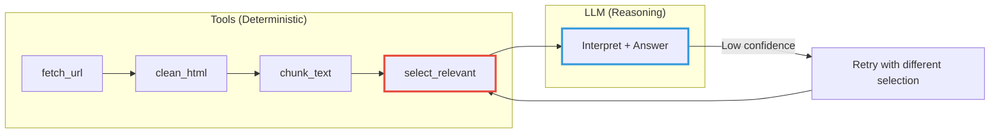
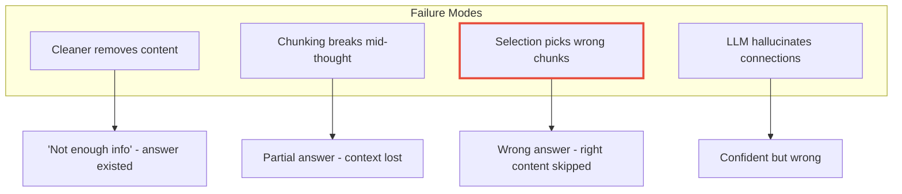
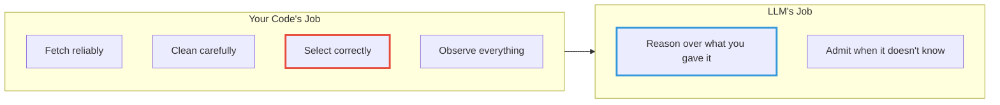

# Fetching and Analysing Web Content with LLMs in C#

<!--category-- AI, LLM, Agents, C#, Systems Design -->
<datetime class="hidden">2025-12-18T10:00</datetime>

When you ask ChatGPT to "read this article and summarize it," what actually happens? If you imagine the AI opening a browser and reading like you would - that's not how it works.

**LLMs don't browse the web. They reason over fragments your code selects.**

This article shows you how to build this in C# with Ollama - no frameworks, just practical code you can debug.

> **TL;DR**: Your code fetches → cleans → chunks → selects. The LLM only sees the fragments you inject. Selection is lossy by design - that's both the constraint and the architecture.

[TOC]

## The One Thing That Makes This Work

Here's the insight that changes how you build these systems:

**Selection is the product decision. It's also where most failures originate.**

The LLM is downstream of your selection. It cannot recover information you didn't show it. When an agent "fails to find the answer," the problem is almost never the model - it's that your selection logic chose the wrong chunks. (This is the same principle behind [why I avoid frameworks like LangChain](/blog/why-i-dont-use-langchain) - they abstract away the selection logic you need to debug.)

This is why "agent browsing" fails silently. The agent confidently answers based on what it saw. You never know it missed the right content.



The model can only reason about what you gave it. Build accordingly.

---

## Design Goals Before Code

Before writing anything, these are the constraints:

| Constraint | Why It Matters |
|------------|----------------|
| **No JS rendering** | Static HTML only (Playwright for SPAs) |
| **Bounded tokens** | Hard budget per request (2-4K tokens typical) |
| **Source-bounded answers** | LLM must not hallucinate web knowledge |
| **Deterministic selection** | Same input → same chunks (debuggable) |
| **Observable** | Log what you selected, why, and what you discarded |

If you can't explain why a chunk was selected, you can't debug failures.

---

## The Pipeline



Each step reduces data. By the time the LLM sees it, you've gone from 57KB of HTML to maybe 2KB of relevant text. Every reduction is lossy. Every reduction can discard the answer. This is the same pattern I use for [analysing large CSV files](/blog/analysing-large-csv-files-with-local-llms) - the LLM reasons, your code computes and selects.

---

## Running Example

Throughout this article, we'll use one URL:

```
https://learn.microsoft.com/en-us/dotnet/core/whats-new/dotnet-10/overview
```

And three questions of increasing specificity:
1. "What's new in .NET 10?"
2. "What performance improvements are mentioned?"
3. "Is there anything about AOT?"

This keeps the examples grounded and shows how selection matters more as questions get specific.

---

## Setup

```bash
# Install Ollama from https://ollama.ai
ollama pull llama3.2:3b

# NuGet packages
dotnet add package AngleSharp      # HTML parsing
dotnet add package OllamaSharp     # Ollama client (5.1.x)
```

> **OllamaSharp note**: In version 5.x, `GenerateAsync` returns `IAsyncEnumerable<GenerateResponseStream?>` - it streams tokens as they're generated. You accumulate with `await foreach`. The sample project pins 5.1.5.

---

## Step 1: Fetch

Standard HTTP, but with the details that matter:

```csharp
public class WebFetcher : IDisposable
{
    private readonly HttpClient _http;
    
    public WebFetcher()
    {
        var handler = new HttpClientHandler
        {
            AllowAutoRedirect = true,
            MaxAutomaticRedirections = 5,  // Cap redirects
            AutomaticDecompression = DecompressionMethods.All
        };
        
        _http = new HttpClient(handler) { Timeout = TimeSpan.FromSeconds(30) };
        _http.DefaultRequestHeaders.Add("User-Agent", 
            "Mozilla/5.0 (Windows NT 10.0; Win64; x64) AppleWebKit/537.36");
    }
    
    public async Task<string> FetchAsync(string url)
    {
        var response = await _http.GetAsync(url);
        
        // Bail if not HTML
        var contentType = response.Content.Headers.ContentType?.MediaType ?? "";
        if (!contentType.Contains("html") && !contentType.Contains("text"))
            throw new InvalidOperationException($"Not HTML: {contentType}");
        
        response.EnsureSuccessStatusCode();
        return await response.Content.ReadAsStringAsync();
    }
    
    public void Dispose() => _http.Dispose();
}
```

**What this handles**: Redirects (capped), compression, timeouts, User-Agent, content-type validation.

**What it doesn't**: JavaScript rendering, authentication, rate limiting, robots.txt. For production, add per-host delays and respect crawl policies.

---

## Step 2: Clean

Raw HTML is mostly noise. Clean it or you waste tokens on layout.

A typical page:
```
57KB HTML → 6KB useful text (90% reduction)
```

### The Strategy



### Cleaning Is Lossy - Handle With Care

Your cleaner can absolutely delete the answer. Common mistakes:

- Aggressive selectors remove legitimate content
- Main content has unusual class names (`.article-body`, `.post-text`)
- Answer is in a sidebar or callout box

**Mitigations**:
- Keep headings explicitly (`h1`-`h6`)
- Remove by *role* and *known boilerplate*, not broad patterns
- Log: extracted element path + text length
- Fallback: if main content is suspiciously short, try body

```csharp
public class HtmlCleaner
{
    private readonly HtmlParser _parser = new();
    
    // Known noise - remove these entirely
    private static readonly string[] NoiseElements = 
        { "script", "style", "nav", "footer", "aside", "iframe", "noscript" };
    
    // Boilerplate patterns - remove by role, not aggressive wildcards
    private static readonly string[] NoiseSelectors = 
    {
        "[role='navigation']", "[role='banner']", "[role='complementary']",
        "[class*='cookie']", "[class*='newsletter']", "[aria-hidden='true']"
    };
    
    // Where to find content - order matters (most specific first)
    private static readonly string[] ContentSelectors = 
        { "main", "article", "[role='main']", ".content", ".post-content" };
    
    public CleanResult Clean(string html)
    {
        var doc = _parser.ParseDocument(html);
        
        // Remove noise
        foreach (var tag in NoiseElements)
            foreach (var el in doc.QuerySelectorAll(tag).ToList())
                el.Remove();
        
        foreach (var selector in NoiseSelectors)
            foreach (var el in doc.QuerySelectorAll(selector).ToList())
                el.Remove();
        
        // Find main content
        IElement? main = null;
        string? matchedSelector = null;
        
        foreach (var selector in ContentSelectors)
        {
            main = doc.QuerySelector(selector);
            if (main != null) { matchedSelector = selector; break; }
        }
        
        // Fallback to body if main content is suspiciously short
        var text = main?.TextContent ?? "";
        if (text.Length < 500 && doc.Body != null)
        {
            main = doc.Body;
            matchedSelector = "body (fallback)";
            text = main.TextContent;
        }
        
        return new CleanResult
        {
            Text = NormalizeWhitespace(text),
            MatchedSelector = matchedSelector ?? "none",
            OriginalLength = html.Length
        };
    }
    
    private string NormalizeWhitespace(string text)
    {
        text = Regex.Replace(text, @"[ \t]+", " ");
        text = Regex.Replace(text, @"\n\s*\n+", "\n\n");
        return text.Trim();
    }
}

public record CleanResult(string Text, string MatchedSelector, int OriginalLength);
```

> **Readability extraction** (scoring paragraphs, text density) is a whole rabbit hole. For now, selector-based extraction works for documentation and blogs. The sample project includes a scoring extractor if you need it.

---

## Step 3: Chunk

You have 6KB of clean text. Why not send it all?

- **Needle in haystack**: LLMs perform worse when relevant info is buried in large context
- **Cost**: More tokens = more money and latency  
- **Focus**: Selected chunks produce better reasoning than everything at once

Chunking strategy matters more than you'd expect. I cover this in depth in the [RAG architecture article](/blog/rag-architecture) - the same principles apply whether you're chunking web pages or documents.

### Naive Sentence Chunking

This is a starting point, not production code:

```csharp
public List<string> ChunkBySentence(string text, int maxTokens = 2000)
{
    var chunks = new List<string>();
    
    // WARNING: This breaks on abbreviations, decimals, URLs, code samples
    var sentences = text.Split(new[] { ". ", ".\n", "! ", "? " }, 
        StringSplitOptions.RemoveEmptyEntries);
    
    var current = new StringBuilder();
    var tokens = 0;
    
    foreach (var sentence in sentences)
    {
        var sentenceTokens = EstimateTokens(sentence);
        
        if (tokens + sentenceTokens > maxTokens && current.Length > 0)
        {
            chunks.Add(current.ToString().Trim());
            current.Clear();
            tokens = 0;
        }
        
        current.Append(sentence).Append(". ");
        tokens += sentenceTokens;
    }
    
    if (current.Length > 0)
        chunks.Add(current.ToString().Trim());
    
    return chunks;
}

// Rough estimate - OK for demos, not for billing
private int EstimateTokens(string text) 
    => (int)(text.Split(' ').Length * 1.3);
```

**Why this is naive**:
- `". "` breaks on "Dr. Smith", "v1.0", URLs
- Token estimation by word count is ±20% off
- No overlap between chunks (loses context at boundaries)

### Better: Heading-Based Chunking

For documentation, chunk by section:

```csharp
public List<ContentChunk> ChunkByHeadings(string html)
{
    var doc = new HtmlParser().ParseDocument(html);
    var chunks = new List<ContentChunk>();
    
    var headings = doc.QuerySelectorAll("h1, h2, h3");
    
    foreach (var heading in headings)
    {
        var content = new StringBuilder();
        content.AppendLine(heading.TextContent);
        
        var sibling = heading.NextElementSibling;
        while (sibling != null && !sibling.TagName.StartsWith("H"))
        {
            content.AppendLine(sibling.TextContent);
            sibling = sibling.NextElementSibling;
        }
        
        chunks.Add(new ContentChunk
        {
            Heading = heading.TextContent.Trim(),
            Content = content.ToString().Trim(),
            HeadingLevel = int.Parse(heading.TagName[1..])
        });
    }
    
    return chunks;
}
```

This preserves document structure and makes selection more meaningful.

---

## Step 4: Select

This is where most failures happen. And where debugging should start.

You have 5 chunks. The user asked "What performance improvements are in .NET 10?" Only 1-2 chunks mention performance. Send those.



### Keyword Matching (Simple, Debuggable)

```csharp
public record ScoredChunk(string Content, string? Heading, int Score, List<string> MatchedKeywords);

public List<ScoredChunk> SelectByKeywords(
    List<ContentChunk> chunks, 
    string question, 
    int topK = 3)
{
    // Normalize and filter stopwords
    var keywords = question.ToLower()
        .Split(' ', StringSplitOptions.RemoveEmptyEntries)
        .Where(w => w.Length > 3)
        .Where(w => !Stopwords.Contains(w))
        .Select(w => w.Trim(',', '.', '?', '!'))
        .Distinct()
        .ToList();
    
    var scored = chunks.Select(chunk =>
    {
        var text = (chunk.Heading + " " + chunk.Content).ToLower();
        var matched = keywords.Where(kw => text.Contains(kw)).ToList();
        
        // Boost if keyword appears in heading
        var headingBoost = chunk.Heading != null && 
            keywords.Any(kw => chunk.Heading.ToLower().Contains(kw)) ? 2 : 0;
        
        return new ScoredChunk(
            chunk.Content, 
            chunk.Heading, 
            matched.Count + headingBoost,
            matched
        );
    })
    .OrderByDescending(x => x.Score)
    .Take(topK)
    .ToList();
    
    // LOG THIS - it's your debugging lifeline
    foreach (var s in scored)
        Console.WriteLine($"  [{s.Score}] {s.Heading ?? "(no heading)"}: {string.Join(", ", s.MatchedKeywords)}");
    
    return scored;
}

private static readonly HashSet<string> Stopwords = new()
    { "what", "how", "does", "the", "are", "is", "in", "for", "of", "to", "and" };
```

**Key improvements over naive counting**:
- Stopword removal (otherwise "what" and "the" always match)
- Heading boost (structural signal)
- **Logging matched keywords** - this is your debugging lifeline

### Embedding-Based (Semantic)

Keywords fail on synonyms. "perf" won't match "performance improvements".

Embeddings find semantic similarity. If you want to go deeper on embeddings and vector search, I cover this extensively in the [RAG primer series](/blog/rag-primer) and [semantic search with ONNX](/blog/semantic-search-with-onnx-and-qdrant).

```csharp
public async Task<List<ScoredChunk>> SelectByEmbedding(
    List<ContentChunk> chunks, 
    string question, 
    int topK = 3)
{
    var questionEmbed = await EmbedAsync(question);
    
    // Cache these per URL in production
    var scored = new List<(ContentChunk Chunk, double Score)>();
    
    foreach (var chunk in chunks)
    {
        var chunkEmbed = await EmbedAsync(chunk.Content);
        var similarity = CosineSimilarity(questionEmbed, chunkEmbed);
        scored.Add((chunk, similarity));
    }
    
    return scored
        .OrderByDescending(x => x.Score)
        .Take(topK)
        .Select(x => new ScoredChunk(x.Chunk.Content, x.Chunk.Heading, (int)(x.Score * 100), new()))
        .ToList();
}

private async Task<double[]> EmbedAsync(string text)
{
    var request = new EmbedRequest { Model = "nomic-embed-text", Input = [text] };
    var response = await _ollama.EmbedAsync(request);
    return response.Embeddings.First().ToArray();
}
```

**Trade-off**: 
- Keywords: Fast, debuggable, literal matching
- Embeddings: Semantic, but slower and needs caching

For production, cache embeddings per (URL, chunk hash) in SQLite or a vector database like [Qdrant](/blog/building-a-lawyer-gpt-for-your-blog-part4).

---

## Sending to the LLM

Structure the prompt to force source-bounded answers with citation:

```csharp
public string BuildPrompt(string url, List<ScoredChunk> chunks, string question)
{
    var sb = new StringBuilder();
    
    sb.AppendLine("You are answering a question using ONLY the content below.");
    sb.AppendLine("Rules:");
    sb.AppendLine("- Answer ONLY from the provided sources");
    sb.AppendLine("- Cite which SOURCE number supports each claim");
    sb.AppendLine("- Include 1-2 brief quotes as evidence");
    sb.AppendLine("- If the answer isn't in the sources, say 'Not enough information'");
    sb.AppendLine("- End with Confidence: High/Medium/Low");
    sb.AppendLine();
    
    for (int i = 0; i < chunks.Count; i++)
    {
        sb.AppendLine($"=== SOURCE {i + 1} ===");
        if (chunks[i].Heading != null)
            sb.AppendLine($"Section: {chunks[i].Heading}");
        sb.AppendLine($"From: {url}");
        sb.AppendLine(chunks[i].Content);
        sb.AppendLine();
    }
    
    sb.AppendLine($"Question: {question}");
    sb.AppendLine();
    sb.AppendLine("Answer (with citations and confidence):");
    
    return sb.ToString();
}
```

This moves from "chatty summary" to "analysis with provenance."

### Calling Ollama

```csharp
public async Task<string> AskAsync(string prompt)
{
    var request = new GenerateRequest { Model = "llama3.2:3b", Prompt = prompt };
    
    var response = new StringBuilder();
    await foreach (var chunk in _ollama.GenerateAsync(request))
    {
        if (chunk?.Response != null)
            response.Append(chunk.Response);
    }
    
    return response.ToString().Trim();
}
```

---

## This Is Tool Use

What we've built is an agent pattern without the framework. I expand on [why I prefer this approach over LangChain](/blog/why-i-dont-use-langchain) - explicit orchestration beats magic abstractions when debugging matters.



The loop: if confidence is low, retry with more chunks or different keywords.

```csharp
var answer = await AskAsync(prompt);

if (answer.Contains("Not enough information") || answer.Contains("Confidence: Low"))
{
    // Retry with more chunks
    var moreChunks = SelectByKeywords(allChunks, question, topK: 5);
    answer = await AskAsync(BuildPrompt(url, moreChunks, question));
}
```

---

## What Goes Wrong



**The debugging rule**: 

> If the answer is wrong, it's almost always because **selection was wrong**, not because the model failed.

### Debugging Checklist

1. **Log selected chunk IDs and scores**
2. **Show which keywords matched** (or embedding distances)
3. **Replay the exact prompt** that was sent
4. **Compare**: Was the right content in the fetched HTML? Cleaned text? Any chunk?

The failure usually isn't the LLM. It's upstream.

---

## Putting It Together

```csharp
public class WebAnalyzer : IDisposable
{
    private readonly WebFetcher _fetcher = new();
    private readonly HtmlCleaner _cleaner = new();
    private readonly OllamaApiClient _ollama = new(new Uri("http://localhost:11434"));
    
    public async Task<AnalysisResult> AnalyzeAsync(string url, string question)
    {
        // 1. Fetch
        var html = await _fetcher.FetchAsync(url);
        
        // 2. Clean (with observability)
        var cleaned = _cleaner.Clean(html);
        Console.WriteLine($"Cleaned: {cleaned.OriginalLength} → {cleaned.Text.Length} bytes ({cleaned.MatchedSelector})");
        
        // 3. Chunk
        var chunks = ChunkByHeadings(html);
        Console.WriteLine($"Chunks: {chunks.Count}");
        
        // 4. Select (with logging)
        Console.WriteLine("Selection scores:");
        var selected = SelectByKeywords(chunks, question, topK: 3);
        
        // 5. Prompt + LLM
        var prompt = BuildPrompt(url, selected, question);
        var answer = await AskAsync(prompt);
        
        return new AnalysisResult
        {
            Answer = answer,
            ChunksUsed = selected.Count,
            SelectionScores = selected.Select(s => s.Score).ToList()
        };
    }
    
    public void Dispose() => _fetcher.Dispose();
}
```

Usage with our running example:

```csharp
using var analyzer = new WebAnalyzer();

var result = await analyzer.AnalyzeAsync(
    "https://learn.microsoft.com/en-us/dotnet/core/whats-new/dotnet-10/overview",
    "What performance improvements are in .NET 10?"
);

Console.WriteLine(result.Answer);
```

Output includes citations and confidence:

```
Based on SOURCE 1 and SOURCE 2:

.NET 10 includes several performance improvements:
- JIT improvements including better inlining and method devirtualization (SOURCE 1)
- "Enhanced loop inversion for better optimization" (SOURCE 1)
- NativeAOT enhancements for improved code generation (SOURCE 2)

Confidence: High
```

---

## When This Works (and Doesn't)

| Works Well | Doesn't Work |
|------------|--------------|
| Documentation | JavaScript SPAs |
| Blog posts, articles | Dynamic/interactive content |
| Technical references | Multi-page research |
| Static HTML | Authenticated content |

For JS-heavy sites, you need [Playwright for .NET](https://playwright.dev/dotnet/).

---

## The Key Principle



The LLM can only reason about what you gave it. Selection is your responsibility.

Don't ask the LLM to browse. Ask it to reason.

---

## Full Sample Project

Complete working implementation: [Mostlylucid.LlmWebFetcher](https://github.com/scottgal/mostlylucidweb/tree/main/Mostlylucid.LlmWebFetcher)

Includes:
- `WebFetcher` - HTTP with proper handling
- `HtmlCleaner` - Noise removal + fallback strategies  
- `ContentChunker` - Sentence and heading-based chunking
- `WebContentAnalyzer` - Full pipeline with logging
- `OllamaExtensions` - Helper for streaming responses

```bash
cd Mostlylucid.LlmWebFetcher
dotnet run
```

---

## Resources

**Libraries**
- [AngleSharp](https://anglesharp.github.io/) - HTML parsing
- [OllamaSharp](https://github.com/awaescher/OllamaSharp) - Ollama client

**LLMs**
- [Ollama](https://ollama.ai/) - Local LLM runtime
- [llama3.2:3b](https://ollama.ai/library/llama3.2) - Fast, capable model
- [nomic-embed-text](https://ollama.ai/library/nomic-embed-text) - Embeddings (~275MB)

**Related Articles**
- [Analysing Large CSV Files with Local LLMs](/blog/analysing-large-csv-files-with-local-llms) - Same pattern: LLM reasons, code computes
- [Why I Don't Use LangChain](/blog/why-i-dont-use-langchain) - Framework-less agent design
- [RAG Primer](/blog/rag-primer) - Understanding retrieval-augmented generation
- [Semantic Search with ONNX and Qdrant](/blog/semantic-search-with-onnx-and-qdrant) - Local semantic search
- [Building a Lawyer GPT](/blog/building-a-lawyer-gpt-for-your-blog-part1) - Full RAG implementation series

**Microsoft AI Stack**
- [Semantic Kernel](https://github.com/microsoft/semantic-kernel) - If you want a framework
- [Microsoft.Extensions.AI](https://devblogs.microsoft.com/dotnet/introducing-microsoft-extensions-ai-preview/) - Abstractions
