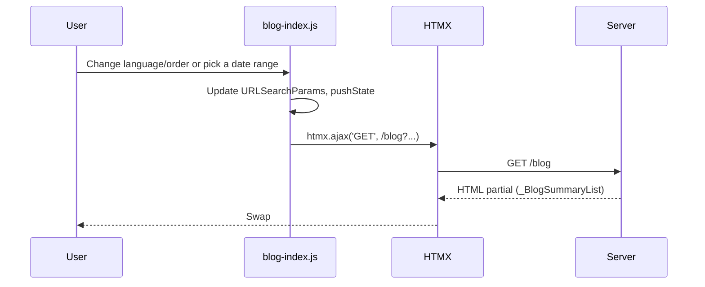

# Filter Bar: Progress, Bugs, and Little Wins

<!--category-- HTMX, ASP.NET, JavaScript -->
<datetime class="hidden">2025-11-10T14:10</datetime>

## Introduction
I’ve been putting together a proper filter bar for the blog list: language, date range, sort, and pagination that stays snappy with HTMX. It’s close now—but as always, the last 20% is the spicy bit: dates, caches, and “why does that work locally but not after a swap?”

If you want the deep dive with lots of code and diagrams, see: [/blog/filterbarprogressandissues](/blog/filterbarprogressandissues)

> remember this site is a work in progress, this sort of stuff WILL happen when you eat-your-own-dogfood!

[TOC] 

## TL;DR
- New filter bar: Language + Sort + Date Range
- HTMX partial swaps keep the page quick; back/forward works because I always push the updated URL
- Calendar highlights come from a tiny `/blog/calendar-days` endpoint
- Fixed: date ranges being dropped when changing language/order
- Fixed: calendar not refreshing after HTMX swaps or theme changes
- Server caching now varies by all relevant query keys

## What’s working well
- URL-first behaviour: All interactions update the URL; you can deep-link to a filter state
- Pagination preserves the current filters (`LinkUrl` is set on the server)
- Flatpickr range defaults to the current query values if present and highlights days with posts

```csharp
// Server: cache and vary for index
[ResponseCache(Duration = 300, VaryByHeader = "hx-request",
  VaryByQueryKeys = new[] { "page", "pageSize", nameof(startDate), nameof(endDate), nameof(language), nameof(orderBy), nameof(orderDir) },
  Location = ResponseCacheLocation.Any)]
[OutputCache(Duration = 3600, VaryByHeaderNames = new[] { "hx-request" },
  VaryByQueryKeys = new[] { nameof(page), nameof(pageSize), nameof(startDate), nameof(endDate), nameof(language), nameof(orderBy), nameof(orderDir) })]
public async Task<IActionResult> Index(int page = 1, int pageSize = 20, DateTime? startDate = null, DateTime? endDate = null,
  string language = MarkdownBaseService.EnglishLanguage, string orderBy = "date", string orderDir = "desc")
{
    var posts = await blogViewService.GetPagedPosts(page, pageSize, language: language, startDate: startDate, endDate: endDate);
    posts.LinkUrl = Url.Action("Index", "Blog", new { startDate, endDate, language, orderBy, orderDir });
    if (Request.IsHtmx()) return PartialView("_BlogSummaryList", posts);
    return View("Index", posts);
}
```

## The bugs I fixed (and new features!)

### Visibility and Content Control
The biggest addition: proper post visibility management:
- **Hidden posts**: Posts can now be marked as hidden (`IsHidden` flag) and won't appear in listings
- **Scheduled publishing**: Posts can have a `ScheduledPublishDate` and only appear after that time
- **Pinned posts**: Posts marked with `IsPinned` always appear first on page 1 (great for announcements)

```csharp
// BlogService now filters appropriately
var now = DateTimeOffset.UtcNow;
postQuery = postQuery.Where(x =>
    !x.IsHidden &&
    (x.ScheduledPublishDate == null || x.ScheduledPublishDate <= now));

// Pinned posts sorted first on page 1
if (isFirstPage)
{
    postQuery = postQuery.OrderByDescending(x => x.IsPinned)
                         .ThenByDescending(x => x.PublishedDate.DateTime);
}
```

### Date Range Improvements
- **New `/blog/date-range` endpoint**: Returns the min/max dates across all posts (language-aware) so the date picker can set sensible bounds
- **Clear param tag helper**: Added `<clear-param>` tag helper to easily clear query parameters

```cshtml
<clear-param name="startDate">Clear Date</clear-param>
<clear-param all="true" exclude="language">Clear All Filters</clear-param>
```

### Bug Fixes
- Losing the date range when switching language or order
  - Fix: Start from `new URL(window.location.href)` and only override the changing params; if Flatpickr has a selection, re-apply it.

```js
langSelect.addEventListener('change', async function(){
  const u = new URL(window.location.href);
  u.searchParams.set('language', langSelect.value);
  u.searchParams.set('page','1');
  const [ob,od] = (orderSelect.value||'date_desc').split('_');
  u.searchParams.set('orderBy', ob);
  u.searchParams.set('orderDir', od);
  if(input._flatpickr && input._flatpickr.selectedDates.length===2){
    const [s,e] = input._flatpickr.selectedDates;
    u.searchParams.set('startDate', s.toISOString().substring(0,10));
    u.searchParams.set('endDate',   e.toISOString().substring(0,10));
  }
  applyNavigation(u);
});
```

- Calendar highlights not refreshing after HTMX swaps
  - Fix: Destroy/recreate Flatpickr on init, then fetch highlights for the visible month and call `fp.redraw()`; also re-run init on `htmx:afterSwap`.

- Dark mode styles not applying to the calendar
  - Fix: observe `<html class>` and call `fp.redraw()` when it changes.

## How the pieces talk


## HTMX Page Request Detection
The filter bar uses a custom `pagerequest` header to help the server distinguish between full page loads and partial HTMX swaps:

```csharp
public static bool IsPageRequest(this HttpRequest request)
{
    return request.Headers.ContainsKey("pagerequest") &&
           request.Headers["pagerequest"] == "true";
}
```

This allows the controller to return just the partial view for HTMX requests and full page views for direct navigation.

> **Note**: The paging tag helper extension and query parameter clearer Alpine.js component deserve their own deep dive—I'll cover these in detail in a future post about building reusable HTMX/Alpine components.

## Still to do
- Quick date presets (Last 7/30 days, This year)
- LocalStorage seed for language
- Keyboard support on range picker

Spotted an issue? Please drop a comment with your browser + steps.
