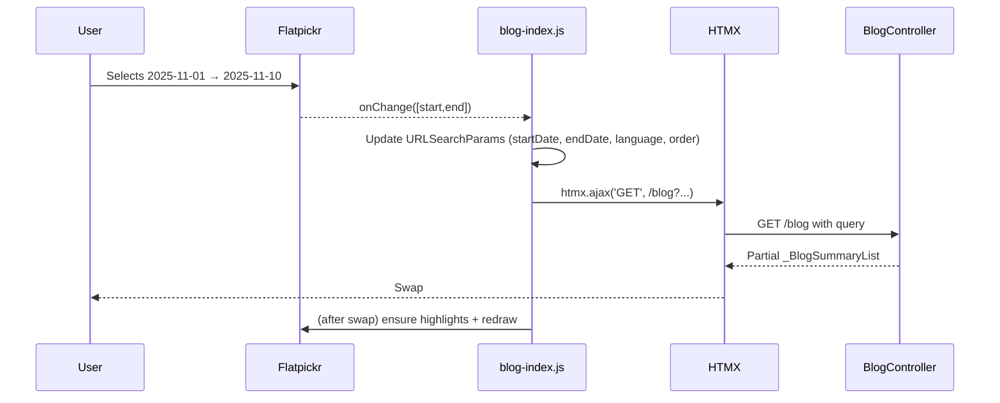
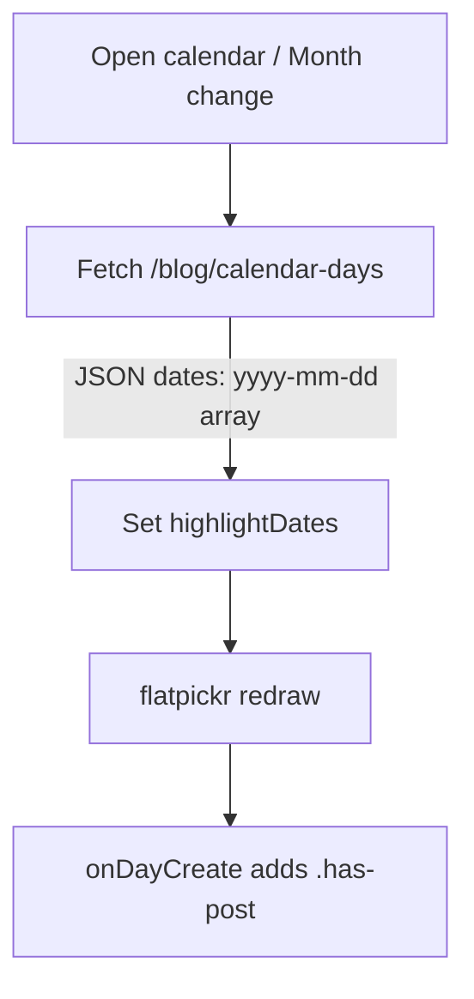

# Filter Bar Progress (And the Date Range Shenanigans)

<!--category-- ASP.NET, HTMX, JavaScript -->
<datetime class="hidden">2025-11-10T09:00</datetime>

## Introduction
Over the last few days I've been hammering away at the new blog filter bar: language selection, ordering, and a date range picker that tries very hard to be smart (sometimes too smart). This post walks through what I built, why a few things went sideways (dates not behaving, highlights not refreshing), and how I fixed them. Plenty of source code and a couple of mermaid diagrams to show the flow.

> remember this site is a work in progress, this sort of stuff WILL happen when you eat-your-own-dogfood!

[TOC]

## What Changed?
Here's the high‑level: I added a proper filter bar to the blog index which includes:
- Language select that preserves your current filters and re-requests the list via HTMX
- Sort order select (date/title asc/desc) that also preserves context
- A date range picker (Flatpickr in range mode) with server‑driven day highlights
- URL state is always kept in sync (back/forward works, deep links work)
- Server caching now varies correctly by the filter parameters

Along the way I had a few bugs: date ranges being lost on language/order change, calendar highlights not refreshing on swap, and a fun one where dark mode styles made the calendar look broken because Flatpickr wasn’t re‑drawing.

## The Filter Bar in the DOM
This is the rough structure the script expects:

```html
<div id="filters" hx-target="#content">
  <select id="languageSelect">…</select>
  <select id="orderSelect">
    <option value="date_desc">Newest first</option>
    <option value="date_asc">Oldest first</option>
    <option value="title_asc">Title A–Z</option>
    <option value="title_desc">Title Z–A</option>
  </select>
  <input id="dateRange" type="text" placeholder="YYYY-MM-DD → YYYY-MM-DD" />
  <button id="clearDateFilter">Clear</button>
  <div id="filterSummary"></div>
</div>

<div id="content"><!-- HTMX swaps blog list here --></div>
```

## Client: HTMX + Flatpickr wiring
Core of the behaviour lives in `Mostlylucid/src/js/blog-index.js`. A few important pieces:

- URL preservation and HTMX navigation
```js
function applyNavigation(u){
  const target = document.querySelector('#content');
  try{ window.history.pushState({}, '', u.toString()); }catch{}
  if(window.htmx && target){
    window.htmx.ajax('GET', u.toString(), {
      target: '#content',
      swap: 'outerHTML show:none',
      headers: {'pagerequest': 'true'}
    });
  } else {
    window.location.href = u.toString();
  }
}
```

- Initialisation, defaulting from URL, and keeping the summary UI in sync
```js
const url = new URL(window.location.href);
const existingStart = url.searchParams.get('startDate');
const existingEnd   = url.searchParams.get('endDate');
const existingLang  = url.searchParams.get('language') || 'en';
const existingOrderBy = (url.searchParams.get('orderBy') || 'date').toLowerCase();
const existingOrderDir = (url.searchParams.get('orderDir') || 'desc').toLowerCase();

langSelect.value = existingLang;
orderSelect.value = `${existingOrderBy}_${existingOrderDir}`;
updateSummary();
```

- Flatpickr range with server‑driven day highlights
```js
async function fetchMonth(year, month, language){
  const res = await fetch(`/blog/calendar-days?year=${year}&month=${month}&language=${encodeURIComponent(language||'en')}`);
  if(!res.ok) return new Set();
  const j = await res.json();
  return new Set(j.dates || []);
}

function formatYMD(d){ return d.toISOString().substring(0,10); }

let highlightDates = new Set();
const fp = window.flatpickr(input, {
  mode: 'range',
  dateFormat: 'Y-m-d',
  defaultDate: [existingStart, existingEnd].filter(Boolean),
  onDayCreate: function(_dObj,_dStr,fpInstance,dayElem){
    const ymd = formatYMD(dayElem.dateObj);
    if(highlightDates.has(ymd)){
      dayElem.classList.add('has-post');
      dayElem.style.background = 'rgba(76,175,80,0.35)';
      dayElem.style.borderRadius = '6px';
    }
  },
  onMonthChange: async function(_sd,_ds,fpInstance){
    highlightDates = await fetchMonth(fpInstance.currentYear, fpInstance.currentMonth+1, langSelect.value);
    fpInstance.redraw();
  },
  onOpen: async function(_sd,_ds,fpInstance){
    highlightDates = await fetchMonth(fpInstance.currentYear, fpInstance.currentMonth+1, langSelect.value);
    fpInstance.redraw();
  },
  onChange: function(selectedDates){
    if(selectedDates.length === 2){
      const [start,end] = selectedDates;
      const u = new URL(window.location.href);
      u.searchParams.set('startDate', formatYMD(start));
      u.searchParams.set('endDate', formatYMD(end));
      u.searchParams.set('page','1');
      u.searchParams.set('language', langSelect.value);
      const [ob,od] = orderSelect.value.split('_');
      u.searchParams.set('orderBy', ob);
      u.searchParams.set('orderDir', od);
      updateSummary();
      applyNavigation(u);
    }
  }
});
```

- Preserve dates when changing language or order
```js
langSelect.addEventListener('change', async function(){
  const u = new URL(window.location.href);
  u.searchParams.set('language', langSelect.value);
  u.searchParams.set('page', '1');
  const [ob,od] = (orderSelect.value||'date_desc').split('_');
  u.searchParams.set('orderBy', ob);
  u.searchParams.set('orderDir', od);
  if(input._flatpickr && input._flatpickr.selectedDates.length===2){
    const [s,e] = input._flatpickr.selectedDates;
    u.searchParams.set('startDate', formatYMD(s));
    u.searchParams.set('endDate', formatYMD(e));
  }
  // refresh calendar highlights for new language
  if(input._flatpickr){
    const fp = input._flatpickr;
    highlightDates = await fetchMonth(fp.currentYear, fp.currentMonth+1, langSelect.value);
    fp.redraw();
  }
  updateSummary();
  applyNavigation(u);
});
```

- Re-draw calendar when the theme toggles (dark/light) so Flatpickr repaints
```js
const obs = new MutationObserver(() => {
  const dr = root.querySelector('#dateRange');
  const fp = dr && dr._flatpickr;
  if(fp && typeof fp.redraw === 'function') fp.redraw();
});
obs.observe(document.documentElement, { attributes:true, attributeFilter:['class'] });
```

## Server: endpoints and caching
Two endpoints power the page:

- The index itself, which accepts page, pageSize, startDate/endDate, language, and order*
- A `calendar-days` endpoint that returns the set of days in a given month that have posts (for highlights)

```csharp
// GET /blog
[HttpGet]
[ResponseCache(Duration = 300, VaryByHeader = "hx-request",
  VaryByQueryKeys = new[] { "page", "pageSize", nameof(startDate), nameof(endDate), nameof(language), nameof(orderBy), nameof(orderDir) },
  Location = ResponseCacheLocation.Any)]
[OutputCache(Duration = 3600, VaryByHeaderNames = new[] { "hx-request" },
  VaryByQueryKeys = new[] { nameof(page), nameof(pageSize), nameof(startDate), nameof(endDate), nameof(language), nameof(orderBy), nameof(orderDir) })]
public async Task<IActionResult> Index(int page = 1, int pageSize = 20, DateTime? startDate = null, DateTime? endDate = null,
  string language = MarkdownBaseService.EnglishLanguage, string orderBy = "date", string orderDir = "desc")
{
    var posts = await blogViewService.GetPagedPosts(page, pageSize, language: language, startDate: startDate, endDate: endDate);
    posts.LinkUrl = Url.Action("Index", "Blog", new { startDate, endDate, language, orderBy, orderDir });
    if (Request.IsHtmx()) return PartialView("_BlogSummaryList", posts);
    return View("Index", posts);
}

// GET /blog/calendar-days?year=2025&month=11&language=en
[HttpGet("calendar-days")]
[ResponseCache(Duration = 300, VaryByHeader = "hx-request", VaryByQueryKeys = new[] { nameof(year), nameof(month), nameof(language) }, Location = ResponseCacheLocation.Any)]
[OutputCache(Duration = 1800, VaryByHeaderNames = new[] { "hx-request" }, VaryByQueryKeys = new[] { nameof(year), nameof(month), nameof(language) })]
public async Task<IActionResult> CalendarDays(int year, int month, string language = MarkdownBaseService.EnglishLanguage)
{
    if (year < 2000 || month < 1 || month > 12) return BadRequest("Invalid year or month");
    var start = new DateTime(year, month, 1);
    var end = start.AddMonths(1).AddDays(-1);
    var posts = await blogViewService.GetPostsForRange(start, end, language: language);
    if (posts is null) return Json("");
    var dates = posts.Select(p => p.PublishedDate.Date).Distinct().OrderBy(d => d).Select(d => d.ToString("yyyy-MM-dd")).ToList();
    return Json(new { dates });
}
```

A quick aside: the paging model has `LinkUrl` so that pagination preserves the current filter context when rendered server‑side.

```csharp
public class BasePagingModel<T> : Interfaces.IPagingModel<T> where T : class
{
    public int Page { get; set; }
    public int TotalItems { get; set; } = 0;
    public int PageSize { get; set; }
    public ViewType ViewType { get; set; } = ViewType.TailwindAndDaisy;
    public string LinkUrl { get; set; }
    public List<T> Data { get; set; }
}
```

## Sequence: how a filter change flows


## Flow: calendar highlights


## Bugs I hit (and the fixes)
- Date range lost on language/order change
  - Cause: I built the new URL from scratch, not from the current one; lost `startDate`/`endDate`.
  - Fix: Always start with `new URL(window.location.href)` and only change the parts that changed; or read dates from Flatpickr if present. See the `language`/`order` change handlers above.

- Calendar highlights didn’t refresh after an HTMX swap
  - Cause: Flatpickr instance lived on the old DOM and died on swap.
  - Fix: On init, destroy any existing instance, re‑create, then preload highlights for the visible month. Also re‑hook after swaps (see below).

- Dark mode made the calendar look broken
  - Cause: style classes changed but Flatpickr didn’t redraw painted days.
  - Fix: Observe `<html class>` changes and call `fp.redraw()`. 

- Pagination links dropped filter context
  - Cause: `LinkUrl` wasn’t set to include the query in some cases.
  - Fix: On the server, set `posts.LinkUrl = Url.Action("Index","Blog", new { startDate, endDate, language, orderBy, orderDir })` so the pager composes URLs correctly.

## HTMX swap safety: re-init on demand
If you use partial swaps, your JS needs to be idempotent. In my case I wrap everything and re‑run init after a swap:

```js
(function(){
  function initFromRoot(root){ /* …the big function shown above… */ }
  if(window.htmx){
    document.body.addEventListener('htmx:afterSwap', function(ev){
      const tgt = ev.detail.target;
      // re-init if the content swapped includes the filters/content area
      if(tgt && (tgt.id === 'content' || tgt.querySelector?.('#filters'))){
        initFromRoot(document);
      }
    });
  }
  // also run on first load
  initFromRoot(document);
})();
```

## What’s next
- Add quick presets (Last 7 days / 30 days / This year)
- Persist language in localStorage to seed the page
- Keyboard affordances for the date range

If you spot anything weird with the filters, please leave a comment with your browser + steps. Thanks for dogfooding with me!
