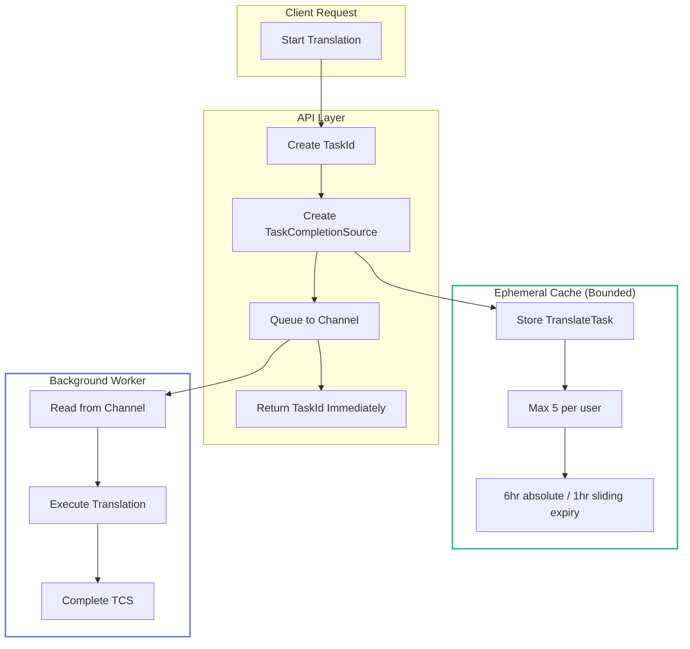
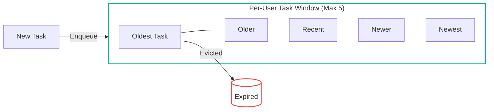

# Fire and Don't *Quite* Forget - Ephemeral Execution Without State

<!--category-- ASP.NET, Architecture, CQRS, Systems Design, Async, Privacy-Safe Design -->
<datetime class="hidden">2025-12-12T12:00</datetime>

Most async systems either remember too much (logs, queues, persisted junk you never wanted)… or they remember nothing at all (fire-and-forget black holes that vanish the moment something goes wrong).

This article introduces something different:

> A pattern where every async operation becomes a tiny **trackable**, **inspectable**, **re-retrievable**, **self-cleaning task unit** -and the whole system stays private, bounded, fast, and deterministic.

It's the companion to my earlier article, **[Learning LRUs -When Exceeding Capacity Makes Your System Better](/blog/learning-lrus-when-capacity-makes-systems-better)**. That one explored how bounded memory + sliding expiration becomes a survival mechanism.

This one explores the other half: **bounded, ephemeral execution** -how a tiny rolling buffer of active tasks becomes a debugger, an event log, and a replay engine, without keeping any user data.

The example comes from my blog's translation widget -a small UI for translating markdown content on-the-fly. It looks trivial. Under the hood, it implements patterns you can steal for any async workflow.

This is **Part 1** of a two-part series:
- **Part 1 (this article)**: The theory, the pattern, and a real-world example
- **[Part 2: Building a Reusable Ephemeral Execution Library](/blog/ephemeral-execution-library)**: The full implementation with DI integration

## NUGET!!!
This is now in the mostlylucid.ephemerals Nuget package also [more than 20 mostlylucid.ephemerals patterns and 'atoms'](https://www.nuget.org/packages?q=mostlylucid.ephemeral&includeComputedFrameworks=true&prerel=true&sortby=created-desc).

[](https://www.nuget.org/packages/mostlylucid.ephemeral)
[](../../UNLICENSE)

[TOC]

---

## Source Files

The full source code is in the [mostlylucid.atoms GitHub repository](https://github.com/scottgal/mostlylucid.atoms)

## The Problem -Async Workflows Create Hidden State

ASP.NET developers tend to pick from three bad options:

### Fire-and-forget

You `Task.Run()` something, hope it finishes, and when it blows up you get nothing. No correlation, no reconstruction, no idea what failed.

### Fire-and-wait

You block threads you shouldn't block. Throughput dies. Latency explodes. Your users hate you.

### Queues/channels everywhere

Now you have:
- unbounded queues
- persistent state you didn't mean to keep
- PII accidentally stored somewhere
- a distributed system where you just wanted a simple operation

### Distributed tracing

Useful… but external. Also: it can't replay anything and often leaks data you never intended to store.

What we actually want is:
- **short-lived**
- **private**
- **debuggable**
- **inspectable**
- **bounded**
- **retrievable if needed**
- **and then gone**

A "just long enough" memory of what the system is doing -and nothing more.

---

## The Pattern -Fire and *Don't Quite* Forget

Here's the idea in one sentence:

> **Kick off an async operation immediately, track it explicitly via a TaskCompletionSource, clean it up deterministically, and keep a tiny rolling buffer of the last few tasks so you can inspect or retrieve them -without retaining any user content.**

It sits halfway between:
- event sourcing
- tracing
- job queues
- futures/promises
- ephemeral sessions

…without becoming any of them.



---

## Anatomy of an Ephemeral Task

The core data structure is a `TranslateTask` -a tiny atomic execution unit backed by a `Task<TaskCompletion>`:

```csharp
// From TranslateTask.cs
public class TranslateTask(
    string taskId,
    DateTime startTime,
    string language,
    Task<TaskCompletion>? task)
    : TranslateResultTask(taskId, startTime, language)
{
    public Task<TaskCompletion>? Task { get; init; } = task;
}

public record TaskCompletion(
    string? TranslatedMarkdown,
    string OriginalMarkdown,
    string Language,
    bool Complete,
    DateTime? EndTime);
```

It contains:
- A unique ID (correlates across the entire flow)
- A timestamp (when it started)
- Metadata (language -not user content!)
- A reference to the actual `Task<TaskCompletion>`
- Duration (computed on access)
- Error state (derived from task state)
- Final result (only if completed successfully)

That's it. Nothing persisted. Nothing written to disk. Nothing stored beyond a rolling window.

AWS has Step Functions. Azure has Durable Functions. You have… 30 lines of code that don't require a cloud bill.

---

## The TaskCompletionSource Pattern -Bridging Fire-and-Forget to Fire-and-Track

The magic happens in the `BackgroundTranslateService`. Instead of fire-and-forget, we use a [TaskCompletionSource](https://learn.microsoft.com/en-us/dotnet/api/system.threading.tasks.taskcompletionsource-1) -a promise-like construct that lets us return immediately while the work happens in the background.

```csharp
// From BackgroundTranslateService.cs
private readonly Channel<(PageTranslationModel, TaskCompletionSource<TaskCompletion>)>
    _translations = Channel.CreateUnbounded<(PageTranslationModel, TaskCompletionSource<TaskCompletion>)>();

private async Task<Task<TaskCompletion>> Translate(PageTranslationModel message)
{
    // Create a TaskCompletionSource that will eventually hold the result
    var tcs = new TaskCompletionSource<TaskCompletion>();

    // Send the translation request along with the TCS to be processed
    await _translations.Writer.WriteAsync((message, tcs));

    // Return the Task immediately -caller can await it or check status later
    return tcs.Task;
}
```

### What's a TaskCompletionSource?

If you haven't used `TaskCompletionSource<T>` before, think of it as a **promise you control manually**. Unlike a regular `Task` that completes when its work finishes, a TCS completes when *you* call `SetResult()`, `SetException()`, or `SetCanceled()`.

This lets you:
1. Return a `Task` to the caller immediately
2. Do the actual work somewhere else (different thread, background service, etc.)
3. Complete the task when *you* decide it's done

It's the bridge between "fire-and-forget" and "fire-and-track".

---

## The API Layer -Starting a Translation

When a user clicks "Translate", the frontend calls the API:

```javascript
// From translations.js
fetch('/api/translate/start-translation', {
    method: 'POST',
    headers: { 'Content-Type': 'application/json' },
    body: JSON.stringify({
        Language: shortCode,
        OriginalMarkdown: markdown
    })
})
.then(response => response.json())
.then(taskId => {
    // Got a taskId immediately -translation is running in background
    console.log("Task ID:", taskId);

    // Poll for updates via HTMX
    htmx.ajax('get', "/editor/get-translations", {
        target: '#translations',
        swap: 'innerHTML'
    });
});
```

The API returns immediately with just a task ID:

```csharp
// From TranslateAPI.cs
[HttpPost("start-translation")]
public async Task<Results<Ok<string>, BadRequest<string>>> StartTranslation(
    [FromBody] MarkdownTranslationModel model)
{
    if (!backgroundTranslateService.TranslationServiceUp)
        return TypedResults.BadRequest("Translation service is down");

    // Create a unique identifier for this translation task
    var taskId = Guid.NewGuid().ToString("N");
    var userId = Request.GetUserId(Response);

    // Trigger translation -returns Task<TaskCompletion> immediately
    var translationTask = await backgroundTranslateService.Translate(model);

    // Wrap it in our trackable TranslateTask
    var translateTask = new TranslateTask(taskId, DateTime.Now, model.Language, translationTask);

    // Store in the ephemeral cache (bounded, self-cleaning)
    translateCacheService.AddTask(userId, translateTask);

    // Return the task ID to the client -they can poll for status
    return TypedResults.Ok(taskId);
}
```

The response is instant. The actual translation runs in the background. The user can poll or just watch the UI update.

---

## The Rolling Operation Window -A Self-Cleaning Buffer

The key insight from the [LRU article](/blog/learning-lrus-when-capacity-makes-systems-better) applies here too:

> **Keep just enough history to debug and reason about the system… and let natural decay erase everything else.**

```csharp
// From TranslateCacheService.cs
public class TranslateCacheService(IMemoryCache memoryCache)
{
    public void AddTask(string userId, TranslateTask task)
    {
        if (memoryCache.TryGetValue(userId, out CachedTasks? tasks))
        {
            var currentTasks = tasks?.Tasks ?? new List<TranslateTask>();
            currentTasks = currentTasks.OrderByDescending(x => x.StartTime).ToList();

            // Keep only the 5 most recent tasks -bounded window
            if (currentTasks.Count >= 5)
            {
                var lastTask = currentTasks.Last();
                currentTasks.Remove(lastTask);
            }

            currentTasks.Add(task);
            currentTasks = currentTasks.OrderByDescending(x => x.StartTime).ToList();
            tasks!.Tasks = currentTasks;

            memoryCache.Set(userId, tasks, new MemoryCacheEntryOptions
            {
                AbsoluteExpiration = tasks.AbsoluteExpiration,
                SlidingExpiration = TimeSpan.FromHours(1)
            });
        }
        else
        {
            // First task for this user
            var cachedTasks = new CachedTasks
            {
                Tasks = new List<TranslateTask> { task },
                AbsoluteExpiration = DateTime.Now.AddHours(6)
            };
            memoryCache.Set(userId, cachedTasks, new MemoryCacheEntryOptions
            {
                AbsoluteExpiration = cachedTasks.AbsoluteExpiration,
                SlidingExpiration = TimeSpan.FromHours(1)
            });
        }
    }

    public List<TranslateTask> GetTasks(string userId)
    {
        if (memoryCache.TryGetValue(userId, out CachedTasks? tasks))
            return tasks?.Tasks ?? new List<TranslateTask>();
        return new List<TranslateTask>();
    }

    private class CachedTasks
    {
        public List<TranslateTask> Tasks { get; set; } = new();
        public DateTime AbsoluteExpiration { get; set; }
    }
}
```

Every new task:
- Is added to the user's rolling window
- Pushes out the oldest if we're at capacity (5 max)
- Evaporates entirely after 6 hours (absolute) or 1 hour of inactivity (sliding)



No retention risk. No PII in the cache (just task IDs, timestamps, and language codes). No GDPR headaches.

---

## Bounded Concurrency -The Governor Loop

The background service implements a **fixed concurrency** loop using a channel reader and `Task.WhenAny`:

```csharp
// From BackgroundTranslateService.cs
private async Task TranslateFilesAsync(CancellationToken cancellationToken)
{
    var processingTasks = new List<Task>();

    while (!cancellationToken.IsCancellationRequested)
    {
        // Fill up to IPCount concurrent tasks (e.g., 4 parallel translations)
        while (processingTasks.Count < markdownTranslatorService.IPCount &&
               !cancellationToken.IsCancellationRequested)
        {
            var item = await _translations.Reader.ReadAsync(cancellationToken);
            var translateModel = item.Item1;
            var tcs = item.Item2;

            // Start the task and add it to the list
            var task = TranslateTask(cancellationToken, translateModel, item, tcs);
            processingTasks.Add(task);
        }

        // Wait for ANY of the tasks to complete
        var completedTask = await Task.WhenAny(processingTasks);
        processingTasks.Remove(completedTask);

        // Handle exceptions if needed
        try
        {
            await completedTask;
        }
        catch (Exception ex)
        {
            logger.LogError(ex, "Error translating markdown");
        }
    }
}
```

This is like a **governor on a steam engine**: more load → back pressure builds → natural throttling → stability.

The pattern gives you:
- **No overload spiral** -can't spawn unlimited tasks
- **Soft real-time behaviour** -bounded latency
- **Natural smoothing of bursts** -channel buffers the spikes
- **Stability under load** -degrades gracefully

---

## Completing the TaskCompletionSource

When the actual translation work finishes, we complete the TCS:

```csharp
// From BackgroundTranslateService.cs
private async Task TranslateTask(
    CancellationToken cancellationToken,
    PageTranslationModel translateModel,
    (PageTranslationModel, TaskCompletionSource<TaskCompletion>) item,
    TaskCompletionSource<TaskCompletion> tcs)
{
    try
    {
        await retryPolicy.ExecuteAsync(async () =>
        {
            // Do the actual translation work
            var translatedMarkdown = await markdownTranslatorService.TranslateMarkdown(
                translateModel.OriginalMarkdown,
                translateModel.Language,
                cancellationToken);

            // SUCCESS: Complete the TCS with the result
            tcs.SetResult(new TaskCompletion(
                translatedMarkdown,
                translateModel.OriginalMarkdown,
                translateModel.Language,
                true,
                DateTime.Now));
        });
    }
    catch (TranslateException e)
    {
        // FAILURE: Complete the TCS with an exception
        tcs.SetException(new Exception($"Translation failed after 3 retries: {e.Message}"));
    }
    catch (Exception e)
    {
        // UNEXPECTED: Complete the TCS with the exception
        tcs.SetException(e);
    }
}
```

The caller's `Task<TaskCompletion>` -which they got immediately when they called `Translate()` -now completes. They can:
- `await` it if they want to block
- Check `IsCompleted` to poll
- Check `IsFaulted` to see if it failed
- Check `Result` to get the translated content

---

## The Status Projection -Deriving State from Task State

When displaying tasks to the user, we project the live task state into a view model:

```csharp
// From TranslateTask.cs
public TranslateResultTask(TranslateTask task, bool includeMarkdown = false)
{
    TaskId = task.TaskId;
    StartTime = task.StartTime;
    Language = task.Language;

    // Check for faulted state first -a faulted task is also "completed" in .NET terms
    if (task.Task?.IsFaulted == true)
    {
        Failed = true;
        Completed = false;
        TotalMilliseconds = (int)(DateTime.Now - task.StartTime).TotalMilliseconds;
    }
    else if (task.Task?.IsCompletedSuccessfully == true)
    {
        Completed = true;
        Failed = false;
        var endTime = task.Task.Result.EndTime;
        TotalMilliseconds = (int)((endTime - task.StartTime)!).Value.TotalMilliseconds;
        EndTime = endTime;
    }
    else
    {
        // Still in progress
        Completed = false;
        Failed = false;
        TotalMilliseconds = (int)(DateTime.Now - task.StartTime).TotalMilliseconds;
    }

    if (Completed && includeMarkdown)
    {
        var result = task.Task?.Result;
        if (result == null) return;
        OriginalMarkdown = result.OriginalMarkdown;
        TranslatedMarkdown = result.TranslatedMarkdown;
    }
}
```

### A Note on Task State

.NET's `Task` has some quirky state combinations:
- `IsCompleted` is true for **both** successful completion AND faulted tasks
- `IsCompletedSuccessfully` is only true for success
- `IsFaulted` means it threw an exception
- `IsCanceled` means it was cancelled

So you must check `IsFaulted` before checking `IsCompleted`, or you'll treat failures as successes.

---

## The UI -HTMX Polling

The view polls for updates using HTMX's `hx-trigger`:

```html
@* From _GetTranslations.cshtml *@
@{
    var allCompleted = Model.All(x => x.Completed);
    var trigger = allCompleted ? "none" : "every 5s";
}

<div class="translationpoller"
     hx-get="/editor/get-translations"
     hx-swap="outerHTML"
     hx-trigger="@trigger">
    <table class="table">
        @foreach (var item in Model)
        {
            <tr>
                <td>
                    @if (item.Completed)
                    {
                        <a href="#" x-on:click.prevent="viewTranslation('@item.TaskId')">View</a>
                    }
                    else if (item.Failed)
                    {
                        <text>Failed</text>
                    }
                    else
                    {
                        <text>Processing</text>
                    }
                </td>
                <td>
                    @if (item.Completed)
                    {
                        <i class='bx bx-check text-green'></i>
                    }
                    else if (item.Failed)
                    {
                        <i class='bx bx-x text-red'></i>
                    }
                    else
                    {
                        
                    }
                </td>
                <td>@item.Language</td>
                <td>@TimeSpan.FromMilliseconds(item.TotalMilliseconds).Humanize()</td>
            </tr>
        }
    </table>
</div>
```

The clever bit: `hx-trigger="@trigger"` changes based on state:
- If tasks are still running: poll every 5 seconds
- If all tasks are done: stop polling (`"none"`)

This is **self-regulating polling** -it stops automatically when there's nothing to watch.

---

## Retrieving the Result

When the user clicks "View", we fetch the completed translation:

```csharp
// From TranslateAPI.cs
[HttpGet("get-translation/{taskId}")]
public async Task<Results<JsonHttpResult<TranslateResultTask>, BadRequest<string>>> GetTranslation(
    string taskId)
{
    var userId = Request.GetUserId(Response);
    var tasks = translateCacheService.GetTasks(userId);

    var translationTask = tasks.FirstOrDefault(t => t.TaskId == taskId);
    if (translationTask == null)
        return TypedResults.BadRequest("Task not found");

    // Include the markdown content in the response
    var result = new TranslateResultTask(translationTask, includeMarkdown: true);
    return TypedResults.Json(result);
}
```

The JavaScript then populates the editor:

```javascript
// From translations.js
export function viewTranslation(taskId) {
    fetch(`/api/translate/get-translation/${taskId}`)
        .then(response => response.json())
        .then(data => {
            // Show the translated content area
            document.getElementById("translatedcontent").classList.remove("hidden");

            // Populate the editors
            var originalMde = window.mostlylucid.simplemde.getinstance('translatedcontentarea');
            originalMde.value(data.originalMarkdown);

            var mde = window.mostlylucid.simplemde.getinstance('markdowneditor');
            mde.value(data.translatedMarkdown);
        });
}
```

---

## Why This Is Privacy-Safe

Because:
- **No user content is stored in the cache** -only task metadata (ID, timestamp, language)
- **Content only exists in the Task's result** -which is in memory, attached to the Task
- **The window is bounded** -max 5 tasks per user, max 6 hours retention
- **Everything decays naturally** -sliding expiration cleans up inactive users
- **Nothing touches disk** -no logs, no queues, no database
- **You cannot accidentally retain PII** -there's nowhere for it to go

This is the architecture *I wish browsers and frontend frameworks had used for session operations*.

---

## The Emerging Behaviour

What you get without thinking too hard:

| Benefit | How |
|---------|-----|
| **Stability** | Bounded concurrency via channel + semaphore pattern |
| **Negative feedback loop** | More load → back pressure → bounded memory → consistent behaviour |
| **Debug visibility** | The exact operations are present just long enough to inspect |
| **Retrievability** | Completed results are accessible until they expire |
| **Zero data retention** | Privacy and simplicity aligned for once |
| **Self-optimising execution** | Old tasks fall away, relevant ones remain |

Just like the LRU cache sharpened the behavioural memory, the rolling operation window sharpens the execution view.

---

## When to Use This Pattern

Use it when:
- User data must not persist
- Operations are short-lived (seconds to minutes)
- Debugging matters
- Privacy matters
- Load stability matters
- You want instant response + background processing

Don't use it when:
- You need true durability (use a real queue)
- Operations take hours (use Hangfire or similar)
- You need exactly-once semantics (use a distributed transaction)
- Multiple servers need to coordinate (use Redis or a message broker)

---

## Conclusion -Ephemeral Execution as a Design Philosophy

If the [LRU article](/blog/learning-lrus-when-capacity-makes-systems-better) was about **learning by forgetting**, this one is about **executing by evaporating**.

The system remembers exactly enough to be helpful -and nothing more.

It's:
- bounded
- deterministic
- private
- debuggable
- retrievable
- self-cleaning
- robust
- and architecture-first

The best thing? You already know how to implement it: a `TaskCompletionSource`, a `Channel`, an `IMemoryCache` with sliding expiration, and a background worker.

**Fire… and Don't Quite Forget.**

---

## What's Next?

In **[Part 2: Building a Reusable Ephemeral Execution Library](/blog/ephemeral-execution-library)**, we'll turn this pattern into a drop-in helper:

- `EphemeralForEachAsync<T>` - like `Parallel.ForEachAsync` but with operation tracking
- Keyed pipelines for per-entity sequential execution
- `EphemeralWorkCoordinator<T>` - a long-lived observable work queue
- Named/typed coordinators with `AddEphemeralWorkCoordinator<TCoordinator>` (like `AddHttpClient`)
- Full DI integration with scoped and singleton lifetimes
- Comparison with other approaches (TPL Dataflow, Channels, Background Services)

---

## Links

- [Learning LRUs -When Exceeding Capacity Makes Your System Better](/blog/learning-lrus-when-capacity-makes-systems-better) -the companion article on bounded memory
- [Part 2: Building a Reusable Ephemeral Execution Library](/blog/ephemeral-execution-library) -the full implementation
- [TaskCompletionSource documentation](https://learn.microsoft.com/en-us/dotnet/api/system.threading.tasks.taskcompletionsource-1) -Microsoft's docs on the TCS pattern
- [System.Threading.Channels](https://learn.microsoft.com/en-us/dotnet/core/extensions/channels) -the producer-consumer primitive we use
- [IMemoryCache documentation](https://learn.microsoft.com/en-us/aspnet/core/performance/caching/memory) -ASP.NET's built-in cache

