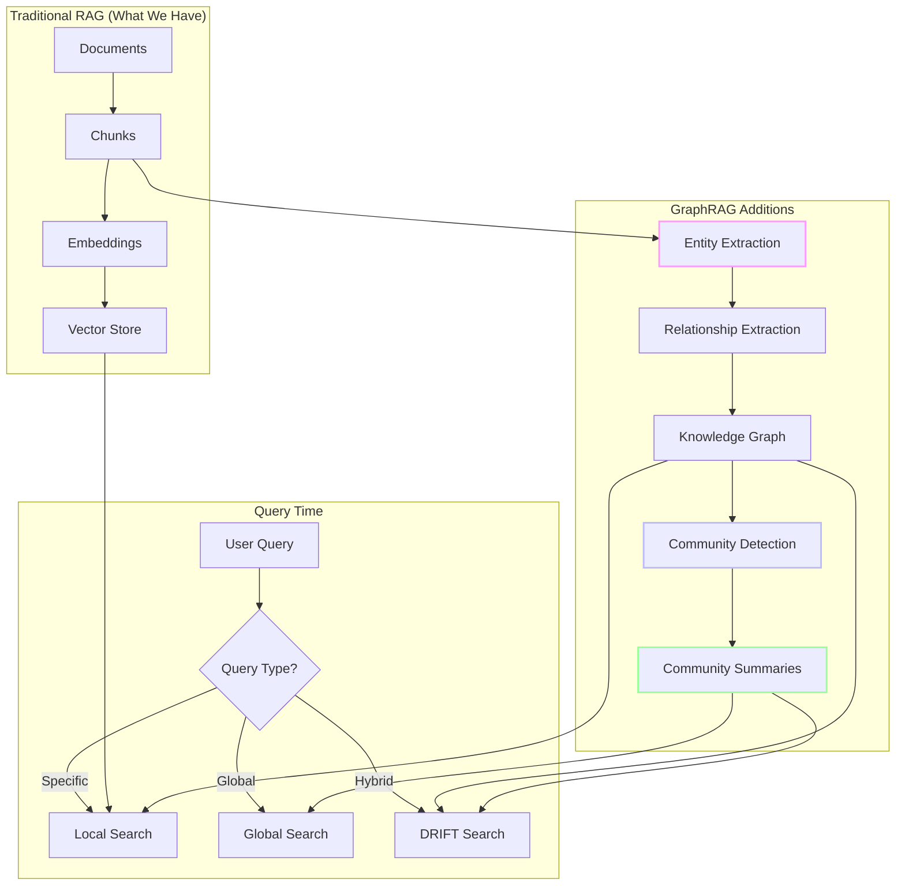
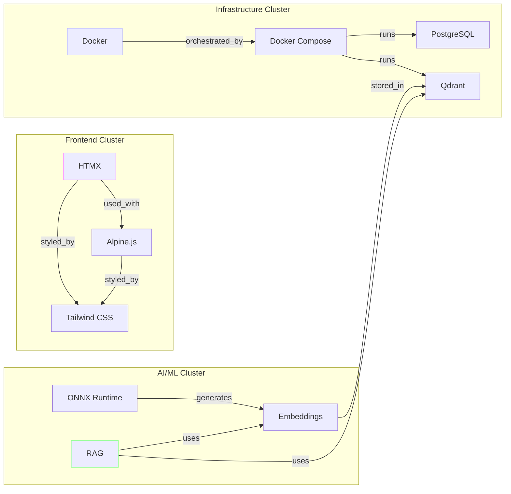
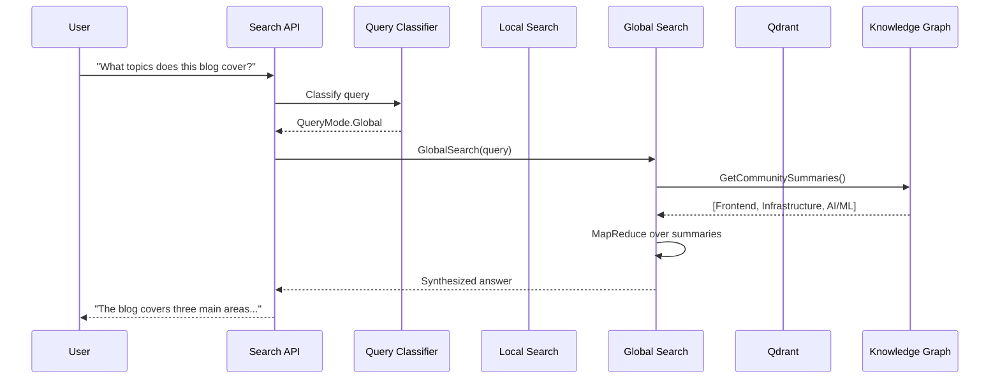
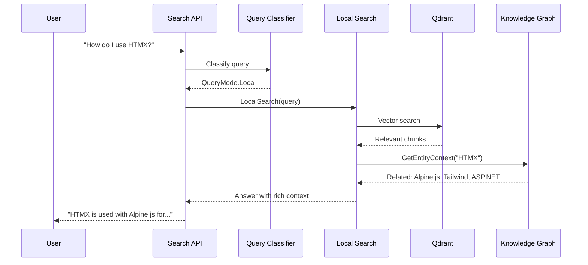

# GraphRAG: Why Vector Search Breaks Down at the Corpus Level

<datetime class="hidden">2025-11-26T12:00</datetime>
<!-- category -- ASP.NET, Semantic Search, ONNX, Qdrant, Machine Learning, Vector Search, RAG -->

Your RAG system works great for "needle" questions: retrieve the right chunks, synthesise an answer, done. But it struggles with two common query types:

- **Sensemaking**: "What are the main themes across this corpus?"
- **Connective**: "How does X relate to Y across different documents?"

Those questions aren't answered by any single chunk. They need **aggregation** and **relationships**.

**The key insight:** GraphRAG changes what you retrieve. Instead of chunks, you retrieve *graph-derived summaries of connected concepts*. That's the whole trick; everything else is implementation detail.

[GraphRAG](https://microsoft.github.io/graphrag/) comes from Microsoft Research's [paper](https://arxiv.org/pdf/2404.16130) and is available as an [open-source implementation](https://github.com/microsoft/graphrag). It keeps vector search for specific questions, but adds a knowledge graph and community summaries for corpus-level reasoning.

<datetime class="hidden">2025-12-24T09:00</datetime>
<!-- category -- AI, RAG, Machine Learning, Semantic Search, LLM, Knowledge Graphs, AI-Article -->

## When NOT to Use GraphRAG

Before diving in, let's be clear about when this is overkill:

- **Small document sets** (under ~50 documents): just use vector search
- **Only "how do I" questions**: GraphRAG won't help
- **Uniform content** (no entity variety): no graph structure to exploit
- **Cost-constrained**: indexing requires many LLM calls

If your users only ask specific questions, stick with [semantic search](/blog/semantic-search-with-onnx-and-qdrant). GraphRAG shines when users need the *big picture*, and that's a smaller audience than vendors suggest.

# Introduction

**Series Navigation:** This is Part 6 of the RAG series:
- [Part 1: Origins and Fundamentals](/blog/rag-primer) - History, motivation, and core concepts
- [Part 2: Architecture and Internals](/blog/rag-architecture) - Technical deep dive
- [Part 3: RAG in Practice](/blog/rag-practical-applications) - Building real systems
- [Part 4a: ONNX & Qdrant Implementation](/blog/semantic-search-with-onnx-and-qdrant) - CPU-friendly semantic search
- [Part 4b: Semantic Search in Action](/blog/semantic-search-in-action) - Typeahead, hybrid search, and UI
- [Part 5: Hybrid Search & Auto-Indexing](/blog/rag-hybrid-search-and-indexing) - Production integration
- **Part 6: GraphRAG** (this article) - Knowledge graphs for corpus-level understanding

Throughout this series, we've built increasingly sophisticated RAG systems. We started with basic vector search, added hybrid keyword+semantic retrieval, and integrated auto-indexing. But all these approaches share a fundamental limitation: they find **similar chunks**, not **connected concepts**. For document-level work, [BertRag in DocSummarizer](/blog/docsummarizer-tool) handles salience and extraction well. But for *corpus-level* questions (themes spanning many documents) you need structure.

**The recommended path:** If you already have Qdrant-based local search working (like we do), prototype with the Python sidecar to validate value, keep vectors for local search, and add a lightweight graph for global/DRIFT queries. Only go "full GraphRAG" once you've proven users ask those questions.

[TOC]

# The Problem with Pure Vector RAG

Let me show you what I mean with a concrete example.

## What Vector RAG Does Well

**Question:** "How do I use HTMX with Alpine.js?"

**Vector RAG process:**
1. Embed the question: `[0.234, -0.891, 0.567, ...]`
2. Find similar chunks in Qdrant
3. Return top-K matches about HTMX and Alpine.js
4. LLM synthesizes answer from those chunks

This works because the question and the relevant content are **semantically similar**. The embeddings capture that similarity.

```csharp
// This is what our current SemanticSearchService does
var embedding = await _embeddingService.GetEmbeddingAsync(query);
var results = await _qdrantService.SearchAsync(
    collectionName: "blog_posts",
    queryVector: embedding,
    limit: 10
);
// Returns chunks about HTMX, Alpine.js, frontend patterns
```

## Where Vector RAG Struggles

**Question:** "What are the main technologies I write about and how do they relate to each other?"

**What vector RAG returns:**

```
Result 1: "HTMX makes it easy to add AJAX to your pages..."
Result 2: "Docker Compose orchestrates multiple containers..."
Result 3: "PostgreSQL's full-text search is surprisingly capable..."
Result 4: "Alpine.js provides reactive state management..."
```

It mentions Docker, PostgreSQL, HTMX, ONNX... but doesn't group them or explain how they connect. You get fragments, not insight.

The problem: This question requires **aggregation and relationship understanding** across the entire corpus. You need to:
- Identify all technologies mentioned
- Understand which are used together
- Group them into coherent themes

Vector similarity alone doesn't give you this; you need aggregation and structure. You *can* hack around this with lots of prompting and post-processing, but you're building a graph-shaped solution implicitly. GraphRAG just makes that structure explicit.

# Enter GraphRAG

[GraphRAG](https://microsoft.github.io/graphrag/) is Microsoft Research's solution to this problem. The [GraphRAG paper](https://arxiv.org/pdf/2404.16130) identified the two query types that baseline RAG handles poorly (**sensemaking** and **connective**) and built a system specifically to address them.

Instead of just embedding chunks, GraphRAG builds a **knowledge graph** that captures entities and their relationships, then clusters them into communities with summaries.

## How GraphRAG Works

GraphRAG adds several components to the RAG pipeline, grouped into three categories:

1. **Extraction** (entities + relationships)
2. **Graph build** (knowledge graph storage)
3. **Summarisation** (community detection + hierarchy)



### Step 1: Entity Extraction

An LLM reads each chunk and extracts **entities** (the things being discussed):

```
Chunk: "Docker Compose makes it easy to define multi-container applications.
        I use it with PostgreSQL for my blog's database layer."

Extracted Entities:
- Docker Compose (technology)
- PostgreSQL (database)
- blog (project)
- database layer (concept)
```

### Step 2: Relationship Extraction

The same LLM identifies how entities relate to each other:

```
Relationships:
- Docker Compose --[used_with]--> PostgreSQL
- blog --[has_component]--> database layer
- PostgreSQL --[implements]--> database layer
```

### Step 3: Knowledge Graph Construction

All entities and relationships form a graph:



### Step 4: Community Detection (Leiden Algorithm)

The [Leiden algorithm](https://arxiv.org/pdf/1810.08473.pdf) clusters densely connected nodes into communities:

- **Community 1**: "Frontend Stack" (HTMX, Alpine.js, Tailwind)
- **Community 2**: "Container Infrastructure" (Docker, Compose, PostgreSQL, Qdrant)
- **Community 3**: "RAG Pipeline" (ONNX, Embeddings, Qdrant, RAG)

Notice how Qdrant appears in two communities: it bridges infrastructure and AI/ML.

### Step 5: Community Summaries

An LLM generates summaries for each community at each hierarchy level:

```
Community 1 Summary (Frontend Stack):
"The frontend approach combines HTMX for server-driven interactivity
with Alpine.js for client-side state management, styled using Tailwind CSS.
This stack prioritizes HTML-first development with minimal JavaScript,
focusing on progressive enhancement over SPA complexity."

Community 2 Summary (Container Infrastructure):
"The blog runs on Docker Compose, orchestrating PostgreSQL for persistent
storage, Qdrant for vector search, and the ASP.NET Core application.
This containerized architecture enables consistent local development
and production deployment."
```

## Query Modes

GraphRAG provides three query modes, each optimized for different question types:

### Global Search

**Best for:** "What are the main themes?" "Summarize the key topics."

Uses community summaries (not individual chunks) to answer sensemaking questions:

```
Query: "What technologies does this blog cover most?"

Process:
1. Retrieve all community summaries
2. Map: Ask LLM to extract technology themes from each summary
3. Reduce: Combine partial answers into final response

Response:
"The writing centres on three technology clusters:
1. **Frontend Development** - HTMX, Alpine.js, Tailwind CSS for minimal-JS web UIs
2. **AI/ML Infrastructure** - RAG pipelines, ONNX embeddings, vector search with Qdrant
3. **DevOps/Containerization** - Docker, PostgreSQL, ASP.NET Core deployment"
```

### Local Search

**Best for:** "How do I configure X?" "What is Y?"

Combines entity-focused graph traversal with traditional vector search:

```
Query: "How do I use Qdrant with ONNX embeddings?"

Process:
1. Identify entities in query: Qdrant, ONNX, embeddings
2. Retrieve graph neighborhood around those entities
3. Also retrieve vector-similar chunks
4. Combine into rich context for LLM

Response includes:
- Direct relationships (ONNX generates embeddings stored in Qdrant)
- Related entities (all-MiniLM-L6-v2 model, cosine similarity)
- Specific code examples from vector-retrieved chunks
```

### DRIFT Search

**Best for:** "How does X relate to Y?" "Compare A and B."

DRIFT (Dynamic Reasoning and Inference with Flexible Traversal) combines local search with community context. It's still using LLM reasoning over retrieved structured context (not magic graph inference), but the structure helps the LLM see connections it would miss with flat chunks.

```
Query: "How do the frontend and backend technologies connect?"

Process:
1. Start with entities: HTMX, ASP.NET Core
2. Traverse graph to find connection paths
3. Include community summaries for context
4. Generate answer showing the full picture

Response:
"HTMX makes requests to ASP.NET Core endpoints, which query PostgreSQL
and Qdrant. The connection flows through the API layer, where endpoints
return HTML fragments that HTMX swaps into the DOM. Alpine.js handles
client-side state for interactive components like search typeahead."
```

# Comparing GraphRAG to Our Current System

Let's map GraphRAG concepts to what we already have in `Mostlylucid.SemanticSearch`:

| Component | Current System | GraphRAG Equivalent |
|-----------|---------------|---------------------|
| **Embeddings** | ONNX (all-MiniLM-L6-v2) | Same (or OpenAI) |
| **Vector Store** | Qdrant | Qdrant / LanceDB |
| **Entity Extraction** | None | LLM-powered extraction |
| **Knowledge Graph** | None | Graph database / in-memory |
| **Community Detection** | None | Leiden algorithm |
| **Query: Specific** | `SemanticSearchService.SearchAsync()` | Local Search |
| **Query: Global** | Not supported | Global Search |

Our current implementation handles **Local Search** well. GraphRAG would add **Global Search** and **DRIFT Search** capabilities.

```csharp
// What we have today (Local Search equivalent)
public async Task<List<SearchResult>> SearchAsync(string query, int limit = 10)
{
    var embedding = await _embeddingService.GetEmbeddingAsync(query);
    return await _qdrantService.SearchAsync("blog_posts", embedding, limit);
}

// What GraphRAG would add
public async Task<string> GlobalSearchAsync(string query)
{
    // 1. Retrieve community summaries (not chunks)
    var summaries = await _graphService.GetCommunitySummariesAsync();

    // 2. Map: Extract relevant themes from each summary
    var partialAnswers = await Task.WhenAll(
        summaries.Select(s => _llm.ExtractThemesAsync(query, s))
    );

    // 3. Reduce: Combine into final answer
    return await _llm.SynthesizeAsync(query, partialAnswers);
}
```

# Implementation Approaches

There are three ways to add GraphRAG to an existing system.

## Option 1: Python Sidecar (Recommended for Exploration)

Run Microsoft's GraphRAG as a separate service:

```yaml
# docker-compose.graphrag.yml
services:
  graphrag:
    build:
      context: ./graphrag
    volumes:
      - ./data/input:/app/input
      - ./data/output:/app/output
    environment:
      - OPENAI_API_KEY=${OPENAI_API_KEY}

  graphrag-api:
    build:
      context: ./graphrag-api
    ports:
      - "8001:8000"
    depends_on:
      - graphrag
```

```csharp
// GraphRagClient.cs - Call from ASP.NET Core
public class GraphRagClient
{
    private readonly HttpClient _http;

    public GraphRagClient(HttpClient http)
    {
        _http = http;
        _http.BaseAddress = new Uri("http://graphrag-api:8000");
    }

    public async Task<string> GlobalSearchAsync(string query)
    {
        var response = await _http.PostAsJsonAsync("/query/global", new { query });
        var result = await response.Content.ReadFromJsonAsync<GraphRagResponse>();
        return result.Answer;
    }

    public async Task<string> LocalSearchAsync(string query)
    {
        var response = await _http.PostAsJsonAsync("/query/local", new { query });
        var result = await response.Content.ReadFromJsonAsync<GraphRagResponse>();
        return result.Answer;
    }
}
```

**Pros:** Use Microsoft's battle-tested implementation, quick to prototype
**Cons:** Python dependency, LLM costs for indexing, cross-process communication

## Option 2: .NET Native (Production Path)

Build the key components in C#. If you've used [DocSummarizer](/blog/docsummarizer-tool), you'll recognise some patterns: the BERT-based extraction and Ollama integration work similarly here.

### Entity Extraction

The core idea: ask an LLM to identify *things* (entities) in each chunk. This is similar to how [DocSummarizer's topic extraction](/blog/building-a-document-summarizer-with-rag) identifies key themes, but we're extracting structured entities instead of free-form topics.

```csharp
public async Task<List<Entity>> ExtractEntitiesAsync(string chunk)
{
    var prompt = $"""
        Extract entities from this text. Return JSON array.
        Types: technology, concept, project, person, organization
        Text: {chunk}
        Format: [{{"name": "Docker", "type": "technology"}}]
        """;

    var response = await _ollama.GenerateAsync(prompt);
    return JsonSerializer.Deserialize<List<Entity>>(response);
}
```

**Production requirement:** LLM JSON output *will* break. This is not optional hardening. You need one of:
- **Schema-constrained generation** (Ollama's `format: json`, OpenAI's function calling)
- **Retry-with-repair loops** (detect malformed JSON, ask LLM to fix it)
- **Fallback extraction** (regex patterns for common entity types)

LLMs are probabilistic; your extraction pipeline must not be. The [DocSummarizer](/blog/docsummarizer-tool) handles this with structured output modes.

### Relationship Extraction

Once you have entities, ask the LLM how they connect:

```csharp
public async Task<List<Relationship>> ExtractRelationshipsAsync(
    string chunk, List<Entity> entities)
{
    var names = string.Join(", ", entities.Select(e => e.Name));
    var prompt = $"""
        Given entities: {names}
        Extract relationships. Return JSON array.
        Text: {chunk}
        Format: [{{"source": "Docker", "target": "PostgreSQL", "rel": "runs"}}]
        """;

    return JsonSerializer.Deserialize<List<Relationship>>(
        await _ollama.GenerateAsync(prompt));
}
```

### Graph Storage with Entity Normalization

The biggest practical pain is **entity aliasing**: "ASP.NET Core", "ASP.NET", and "aspnetcore" should be the same node. Simple normalisation helps:

```csharp
public class KnowledgeGraph
{
    private readonly Dictionary<string, Entity> _entities = new();
    private readonly List<Relationship> _relationships = new();

    public void AddEntity(Entity entity)
    {
        var key = Normalise(entity.Name);  // "ASP.NET Core" → "aspnetcore"
        _entities[key] = entity;
    }

    private string Normalise(string name) =>
        name.ToLowerInvariant().Replace(".", "").Replace("-", "").Trim();
}
```

For serious use, consider embedding-based entity deduplication: if two entity names have similar embeddings, they're probably the same thing.

### Graph Traversal

Finding related entities is a breadth-first search:

```csharp
public List<Entity> GetNeighbors(string entityName, int depth = 1)
{
    var result = new HashSet<Entity>();
    var queue = new Queue<(string Name, int Depth)>();
    queue.Enqueue((Normalise(entityName), 0));

    while (queue.Count > 0)
    {
        var (name, d) = queue.Dequeue();
        if (d >= depth) continue;

        // Find all entities connected to this one
        var neighbours = _relationships
            .Where(r => Normalise(r.Source) == name || Normalise(r.Target) == name)
            .SelectMany(r => new[] { r.Source, r.Target });

        foreach (var neighbour in neighbours)
            if (_entities.TryGetValue(Normalise(neighbour), out var entity))
                if (result.Add(entity))
                    queue.Enqueue((Normalise(neighbour), d + 1));
    }
    return result.ToList();
}
```

### Community Detection

This is a connected-components baseline, **not** full Leiden. Leiden optimizes for modularity (dense internal connections, sparse external ones). For a proper implementation, use a graph library or port the algorithm.

```csharp
public List<Community> DetectCommunities(KnowledgeGraph graph)
{
    // Connected components: group everything reachable together
    var visited = new HashSet<string>();
    var communities = new List<Community>();

    foreach (var entity in graph.GetAllEntities())
    {
        if (visited.Contains(entity.Name)) continue;
        
        // BFS to find all connected entities
        var community = new Community();
        var queue = new Queue<string>();
        queue.Enqueue(entity.Name);

        while (queue.Count > 0)
        {
            var name = queue.Dequeue();
            if (!visited.Add(name)) continue;
            community.Entities.Add(graph.GetEntity(name));
            foreach (var neighbor in graph.GetNeighbors(name, depth: 1))
                queue.Enqueue(neighbor.Name);
        }
        communities.Add(community);
    }
    return communities;
}
```

### Community Summarisation

Each community gets a summary describing its theme. This is what powers Global Search:

```csharp
public async Task<string> SummarizeCommunityAsync(Community community)
{
    var entities = string.Join("\n", 
        community.Entities.Select(e => $"- {e.Name}: {e.Description}"));
    
    var prompt = $"""
        Summarize what unites these concepts (2-3 sentences):
        {entities}
        """;

    return await _ollama.GenerateAsync(prompt);
}
```

## Option 3: Hybrid (Pragmatic Middle Ground)

This is the recommended approach if you already have working vector search. Keep Qdrant for Local Search, add a lightweight graph layer for Global/DRIFT queries.

### Query Classification

First, detect what kind of question this is:

```csharp
private QueryMode ClassifyQuery(string query)
{
    var q = query.ToLowerInvariant();
    
    if (q.Contains("main theme") || q.Contains("summarize") || q.Contains("what topics"))
        return QueryMode.Global;
    
    if (q.Contains("relate") || q.Contains("connect") || q.Contains("compare"))
        return QueryMode.Drift;
    
    return QueryMode.Local;
}
```

### Local Search (Enhanced)

Use existing vector search, optionally enriched with graph context:

```csharp
private async Task<string> LocalSearchAsync(string query)
{
    // Existing semantic search (what we have today)
    var chunks = await _semanticSearch.SearchAsync(query, limit: 10);

    // NEW: Enrich with related entities from graph
    var entities = await _graphService.ExtractEntitiesFromQueryAsync(query);
    var related = await _graphService.GetEntityContextAsync(entities);

    return await _llm.GenerateAsync(query, FormatContext(chunks, related));
}
```

### Global Search (New Capability)

Map-reduce over community summaries (no vector search needed):

```csharp
private async Task<string> GlobalSearchAsync(string query)
{
    var summaries = await _graphService.GetAllCommunitySummariesAsync();

    // Map: Extract relevant info from each community
    var partials = await Task.WhenAll(
        summaries.Select(s => _llm.ExtractRelevantInfoAsync(query, s)));

    // Reduce: Combine into final answer
    return await _llm.SynthesizeAsync(query, partials.Where(p => !string.IsNullOrEmpty(p)));
}
```

### DRIFT Search (Connective Queries)

Combine local results with community context for "how does X relate to Y" questions:

```csharp
private async Task<string> DriftSearchAsync(string query)
{
    var localResults = await LocalSearchAsync(query);
    
    var entities = await _graphService.ExtractEntitiesFromQueryAsync(query);
    var communities = await _graphService.GetCommunitiesForEntitiesAsync(entities);
    var themes = string.Join("\n", communities.Select(c => c.Summary));

    return await _llm.GenerateAsync(
        $"Question: {query}\n\nDetails:\n{localResults}\n\nBroader themes:\n{themes}",
        systemPrompt: "Synthesize the details with the thematic context.");
}
```

# Cost and Performance Considerations

GraphRAG has significant tradeoffs compared to pure vector RAG.

## Indexing Costs

Entity/relationship extraction costs vary significantly by model, prompt design, and chunk size. As a rough order-of-magnitude, assume **one or two LLM calls per chunk** plus a smaller number of calls for community summaries.

*Illustrative example (not a quote; your numbers will vary):*

| Operation | Vector RAG | GraphRAG |
|-----------|------------|----------|
| **Embedding** | ~$0.0001/1K tokens | Same |
| **Entity/Relationship Extraction** | None | 1-2 LLM calls/chunk |
| **Community Summarisation** | None | 1 LLM call/community |

**Example:** 1,000 blog posts with 5 chunks each = 5,000 chunks

- Vector RAG: ~$0.50 (embeddings only)
- GraphRAG: Ballpark $50-150 depending on model and prompt efficiency

**Mitigation:** Use local models (Ollama with llama3.2) for extraction to eliminate API costs.

## Query Costs

| Query Type | Vector RAG | GraphRAG Local | GraphRAG Global |
|------------|------------|----------------|-----------------|
| **Vector search** | 1 call | 1 call | 0 calls |
| **Graph traversal** | 0 | 1-2 queries | 0 |
| **LLM calls** | 1 | 1-2 | N (map) + 1 (reduce) |

Global Search is more expensive per query, but it answers questions that Local Search simply can't. You can also cache global answers and refresh them only when the corpus changes.

## GraphRAG Failure Modes

GraphRAG isn't magic. Watch out for:

- **Extraction errors**: LLMs miss entities or hallucinate relationships
- **Entity aliasing**: "ASP.NET Core" vs "ASP.NET" vs "aspnetcore" become separate nodes
- **Graph drift**: When docs update, the graph can become stale
- **Community summaries going stale**: Summaries don't auto-update when entities change

Entity normalization is the biggest practical pain. You'll need:
- Canonical names + aliases
- Case-folding and punctuation normalization
- Optionally embedding-based entity deduplication

# Integrating with Our Blog Search

Here's how GraphRAG could enhance the blog's existing semantic search:

## Current Flow

```
User types in search → SemanticSearchService → Qdrant → Results
```

## Enhanced Flow





## Implementation Sketch

The API is straightforward: classify the query, route to the appropriate handler:

```csharp
[HttpGet("api/search")]
public async Task<IActionResult> Search([FromQuery] string q, [FromQuery] string mode = "auto")
{
    if (mode == "auto")
        mode = ClassifyQuery(q);

    return mode switch
    {
        "global" => Ok(await _graphRag.GlobalSearchAsync(q)),
        "local" => Ok(await SearchWithGraphContext(q)),
        _ => Ok(await _semanticSearch.SearchAsync(q))
    };
}
```

The key insight: vector search and graph search complement each other. Use vectors for "how do I" questions, graphs for "what are the themes" questions.

# How DocSummarizer's BertRag Relates

If you've been following the [DocSummarizer series](/blog/building-a-document-summarizer-with-rag), you might notice some overlapping concepts. [BertRag mode](/blog/docsummarizer-tool) already does extractive summarisation with BERT embeddings. How does that relate to GraphRAG?

**What BertRag does well:**
- Extracts key sentences using BERT embeddings (local, no LLM needed)
- Ranks by salience (position, content type, semantic centrality)
- Generates summaries with citations

**What GraphRAG adds:**
- Entity/relationship extraction (structured knowledge, not just sentences)
- Community detection (automatic theme discovery)
- Global queries (aggregate across entire corpus)

**They're complementary:**

| Task | BertRag | GraphRAG |
|------|---------|----------|
| Summarize one document | Excellent | Overkill |
| "What are the key points?" | Great | Unnecessary |
| "What themes span all documents?" | Can't do | Built for this |
| "How do topics X and Y connect?" | Limited | Native support |

**Practical combination:** Use BertRag for document-level summarisation (fast, local, cheap), add GraphRAG for corpus-level queries when users need the big picture. The [DocSummarizer's topic extraction](/blog/building-a-document-summarizer-with-rag) could even feed entity candidates into GraphRAG's extraction pipeline.

# Conclusion

GraphRAG extends RAG from "find similar chunks" to "understand the knowledge structure." It's not a replacement for vector search; it's an enhancement that enables new query types.

**What GraphRAG adds:**
- Entity and relationship extraction
- Knowledge graph construction
- Community detection and hierarchical summaries
- Global Search for sensemaking questions
- DRIFT Search for connective reasoning

**When to use it:**
- You have a substantial document collection
- Users ask "what are the themes" type questions
- Your content has clear entities and relationships
- You want to surface connections automatically

**Implementation path:**
1. Start with Python sidecar to validate value
2. Build .NET native if costs/latency matter
3. Use local LLMs (Ollama) to control indexing costs

## Resources

**GraphRAG Official:**
- [GraphRAG Documentation](https://microsoft.github.io/graphrag/) - Microsoft's official docs
- [GraphRAG GitHub](https://github.com/microsoft/graphrag) - Source code and examples
- [GraphRAG Paper](https://arxiv.org/pdf/2404.16130) - The original research paper
- [Leiden Algorithm Paper](https://arxiv.org/pdf/1810.08473.pdf) - Community detection algorithm

**RAG Series:**
- [Part 1: RAG Origins and Fundamentals](/blog/rag-primer)
- [Part 2: RAG Architecture and Internals](/blog/rag-architecture)
- [Part 3: RAG in Practice](/blog/rag-practical-applications)
- [Part 4: Semantic Search with ONNX and Qdrant](/blog/semantic-search-with-onnx-and-qdrant)
- [Part 5: Hybrid Search & Auto-Indexing](/blog/rag-hybrid-search-and-indexing)

**DocSummarizer (Related):**
- [Building a Document Summarizer with RAG](/blog/building-a-document-summarizer-with-rag) - Architecture and patterns
- [DocSummarizer CLI Tool](/blog/docsummarizer-tool) - BertRag mode for extractive summarisation
- [DocSummarizer Advanced Concepts](/blog/docsummarizer-advanced-concepts) - Embeddings and retrieval deep dive
