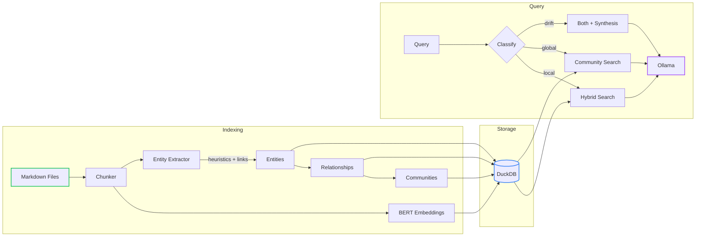
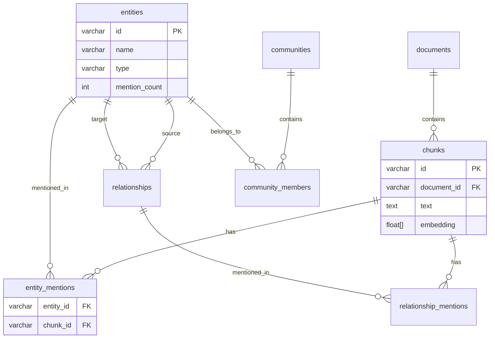
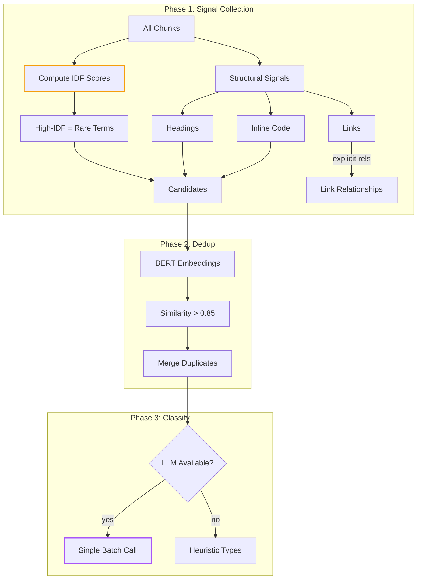
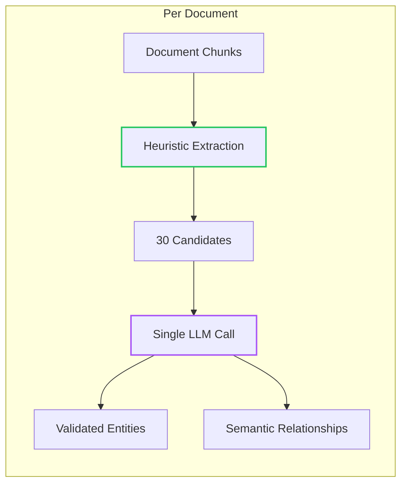
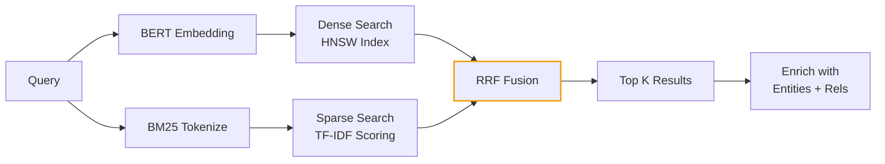
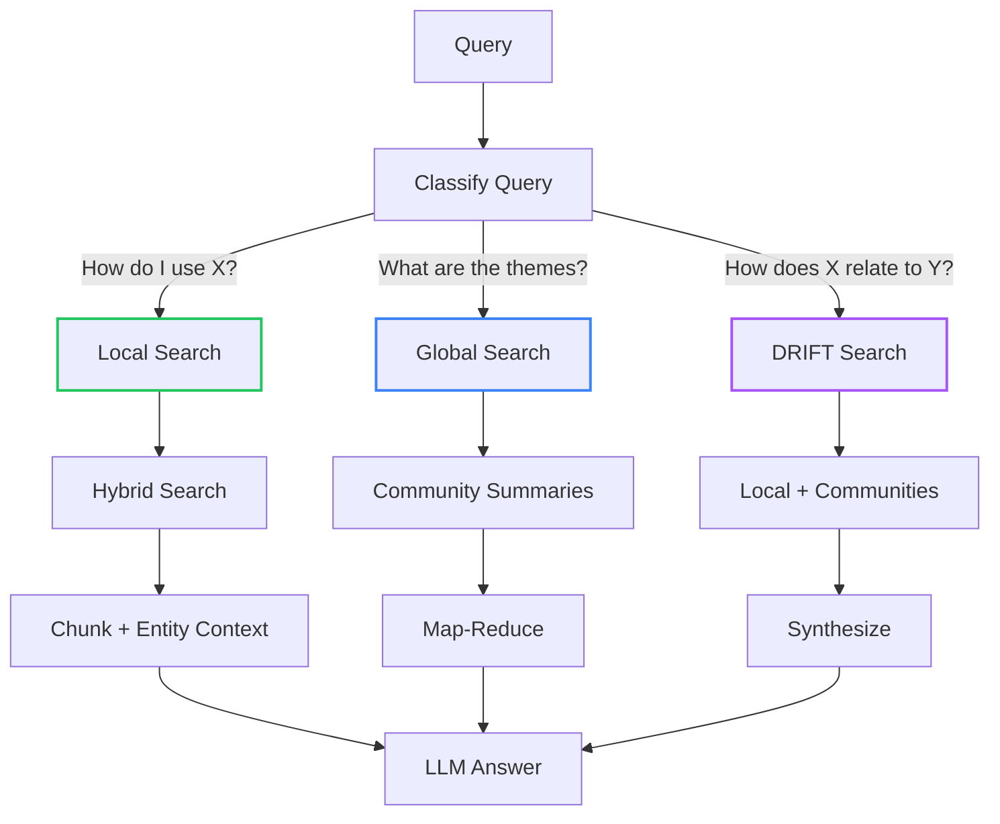

# GraphRAG Part 2: Minimum Viable GraphRAG

<datetime class="hidden">2025-12-27T14:00</datetime>
<!-- category -- ASP.NET, GraphRAG, DuckDB, Vector Search, Machine Learning, Knowledge Graphs -->

In [Part 1](/blog/graphrag-knowledge-graphs-for-rag), we explored why GraphRAG matters. Now let's build a **minimum viable GraphRAG** with three extraction modes:

| Mode | LLM Calls | Best For |
|------|-----------|----------|
| **Heuristic** (default) | 0 per chunk | Fast indexing, structured markdown |
| **Hybrid** | 1 per document | Balance of speed and quality |
| **LLM** | 2 per chunk | Maximum entity quality |

All modes use:
- **DuckDB** for unified storage (vectors + graph in a single file)
- **BM25 + BERT hybrid search** via RRF fusion
- **Ollama** for synthesis and optional batch classification (zero API costs)

**Series Navigation:**
- [Part 1: GraphRAG Fundamentals](/blog/graphrag-knowledge-graphs-for-rag)
- **Part 2: Minimum Viable GraphRAG** (this article)

> **Code:** [Mostlylucid.GraphRag](https://github.com/scottgal/mostlylucidweb/tree/main/Mostlylucid.GraphRag) on GitHub

[TOC]

## Architecture Overview



## Why DuckDB?

Microsoft's GraphRAG uses separate storage for vectors (LanceDB), entities (Parquet), and relationships (more Parquet). DuckDB simplifies this:

- Single `.duckdb` file for everything
- Native HNSW vector search via VSS extension
- SQL for both vector search and graph traversal
- Zero deployment complexity

**DuckDB is not a graph database - and that's the point.** This isn't Neo4j. Traversals are shallow, SQL-based, and deliberate. That constraint keeps the system debuggable and cheap.

## Storage Schema

The schema uses **join tables for provenance** - we can query "which chunks mention entity X?" directly:



Key design decision: **no `VARCHAR[]` for provenance**. Join tables (`entity_mentions`, `relationship_mentions`) enable efficient queries like "get all chunks mentioning Docker".

### Vector Search: The HNSW Gotcha

DuckDB's HNSW index only triggers with `array_cosine_distance` + `ORDER BY` + `LIMIT`:

```csharp
// GraphRagDb.cs - SearchChunksAsync
cmd.CommandText = $"""
    SELECT id, document_id, text, chunk_index, 
           array_cosine_distance(embedding, $1::FLOAT[{_dim}]) as distance
    FROM chunks 
    WHERE embedding IS NOT NULL
    ORDER BY distance
    LIMIT $2
    """;
// Convert distance to similarity: 1.0f - distance
```

**Using `array_cosine_similarity` will not use the index** — it won’t trigger the HNSW index. On non-trivial corpora, this turns a ~5ms indexed query into a full table scan.

## Entity Extraction

This is where we diverge from Microsoft's approach. Instead of the **LLM-per-chunk extraction passes** used in Microsoft's reference GraphRAG pipeline, we use **IDF-based statistical extraction**. The goal isn't perfect entities - it's *stable, corpus-relative signals* that don't require an LLM to produce. This trades some recall for determinism, auditability, and predictable cost — a deliberate choice for technical corpora:



### Why IDF, not Hardcoded Lists?

The naive approach is a hardcoded `HashSet<string> KnownTech = { "Docker", "Kubernetes", ... }`. This breaks for:
- New technologies (you'd need to update the list)
- Domain-specific terms (different corpus = different entities)
- Misspellings and variations

**IDF (Inverse Document Frequency)** solves this statistically. A term's IDF is:

$$\text{IDF}(t) = \log\frac{N}{df(t)}$$

Where:
- $N$ = total chunks
- $df(t)$ = documents containing term $t$

High IDF = **rare term** = likely an entity. "Docker" appearing in 5 of 100 chunks has higher IDF than "the" appearing in 100 of 100.

For more on TF-IDF and BM25, see my post on [hybrid search with BM25](/blog/rag-hybrid-search-and-indexing).

### Structural Signals

Markdown structure tells us what's important:
- **Headings** (`## Docker Setup`) → entity
- **Inline code** (`` `docker-compose` ``) → entity  
- **Links** (`[Docker](https://docker.com)`) → entity + relationship

```csharp
// EntityExtractor.cs - structural signal extraction
private void ExtractStructuralEntities(string chunk, string chunkId)
{
    // Headings: ## Docker Compose Setup → "Docker Compose Setup"
    foreach (Match m in Regex.Matches(chunk, @"^#{1,3}\s+(.+)$", RegexOptions.Multiline))
    {
        var heading = m.Groups[1].Value.Trim();
        AddCandidate(heading, chunkId, weight: 2.0); // Higher weight
    }
    
    // Inline code: `docker-compose` → "docker-compose"
    foreach (Match m in Regex.Matches(chunk, @"`([^`]+)`"))
    {
        AddCandidate(m.Groups[1].Value, chunkId, weight: 1.5);
    }
}
```

### Link Extraction (High-Quality Relationships)

Markdown links provide **explicit** relationships that don't require LLM inference:

```csharp
// EntityExtractor.cs - ExtractLinks  
foreach (Match m in Regex.Matches(chunk, @"\[([^\]]+)\]\((/blog/[^)]+)\)"))
{
    var linkText = m.Groups[1].Value;  // "semantic search"
    var slug = m.Groups[2].Value;       // "/blog/semantic-search-with-qdrant"
    yield return new Relationship(linkText, $"blog:{slug}", "references", chunkId);
}
```

### Deduplication via BERT Embeddings

Entity names like "Docker Compose", "docker-compose", and "DockerCompose" should be merged. We use **BERT embeddings** to detect semantic similarity:

```csharp
// EntityExtractor.cs - DeduplicateAsync
var embeddings = await _embedder.EmbedBatchAsync(candidates.Select(c => c.Name), ct);

for (int i = 0; i < candidates.Count; i++)
{
    for (int j = i + 1; j < candidates.Count; j++)
    {
        var similarity = CosineSimilarity(embeddings[i], embeddings[j]);
        if (similarity > 0.85)
        {
            // Merge into canonical entity (keep higher mention count)
            canonical.MentionCount += duplicate.MentionCount;
            canonical.ChunkIds.UnionWith(duplicate.ChunkIds);
        }
    }
}
```

This step is O(n²) within a bounded candidate set, but candidate counts are bounded by IDF filtering and structural signals - not corpus size. For details on BERT embeddings, see [semantic search with ONNX and BERT](/blog/semantic-search-with-onnx-and-qdrant).

## Extraction Modes

The CLI supports three extraction modes via `--extraction-mode`:

### Heuristic Mode (Default)

```bash
dotnet run --project Mostlylucid.GraphRag -- index ./Markdown --extraction-mode heuristic
```

Uses IDF + structural signals for entity detection, with optional LLM batch classification. **Zero per-chunk LLM calls** - only ~1 call per 50 entities for type classification.

### Hybrid Mode (Recommended)

```bash
dotnet run --project Mostlylucid.GraphRag -- index ./Markdown --extraction-mode hybrid
```

Best of both worlds:
1. **Heuristic detection**: IDF + structural signals find entity candidates (deterministic)
2. **LLM enhancement**: One call per *document* validates entities and extracts semantic relationships



For 5 documents with 62 chunks, hybrid mode makes **5 LLM calls** (vs 124 for full LLM mode). You get:
- Deterministic entity coverage from heuristics
- LLM-quality relationship extraction (semantic, not just co-occurrence)
- Descriptions and validated types

### LLM Mode (Microsoft-Style)

```bash
dotnet run --project Mostlylucid.GraphRag -- index ./Markdown --extraction-mode llm
```

Full Microsoft GraphRAG approach: **2 LLM calls per chunk** (entity extraction + relationship extraction). Most expensive, but highest quality for unstructured text.

### When to Use Each

| Mode | LLM Calls | Best For |
|------|-----------|----------|
| **Heuristic** | ~1 per 50 entities | Fast indexing, well-structured markdown |
| **Hybrid** | 1 per document | Balance of coverage and quality |
| **LLM** | 2 per chunk | Unstructured prose, maximum quality |

For technical documentation, start with **hybrid** mode. It gives you semantic relationships without the per-chunk cost. Fall back to **heuristic** for pure speed, or **llm** for narrative text.

## Hybrid Search: BM25 + BERT

Hybrid search combines two complementary approaches:

**Dense (BERT):** Understands meaning. "Docker containers" matches "containerization".
**Sparse (BM25):** Matches exact terms. "HNSW" only matches "HNSW".



### What is BM25?

BM25 (Best Match 25) scores documents based on query term frequency. The formula:

$$\text{score}(D,Q) = \sum_{i=1}^{n} \text{IDF}(q_i) \cdot \frac{f(q_i, D) \cdot (k_1 + 1)}{f(q_i, D) + k_1 \cdot (1 - b + b \cdot \frac{|D|}{avgdl})}$$

Key intuitions:
- **IDF term**: Rare words matter more ("HNSW" > "the")
- **TF saturation**: Word appearing 10x isn't 10x more relevant than 1x
- **Length normalization**: Long documents don't get unfair advantage

For a full BM25 implementation, see [hybrid search and indexing](/blog/rag-hybrid-search-and-indexing).

### Reciprocal Rank Fusion (RRF)

RRF merges rankings from different retrieval systems. Each rank position gets a score:

$$\text{RRF}(d) = \sum_{r \in R} \frac{1}{k + r(d)}$$

Where $k$ (typically 60) prevents overweighting the top result. Documents appearing in **both** rankings get boosted:

```csharp
// SearchService.cs - RRF fusion
const int k = 60;

foreach (var (chunk, rank) in denseResults.Select((c, i) => (c, i)))
    scores[chunk.Id] = 1.0 / (k + rank + 1);

foreach (var (chunk, rank) in sparseResults.Select((c, i) => (c, i)))
{
    var rrfScore = 1.0 / (k + rank + 1);
    if (scores.TryGetValue(chunk.Id, out var existing))
        scores[chunk.Id] = existing + rrfScore;  // Boost for appearing in both!
    else
        scores[chunk.Id] = rrfScore;
}
```

Example: A document ranked #1 in dense and #3 in sparse:
- Dense: $1/(60+1) = 0.0164$
- Sparse: $1/(60+3) = 0.0159$
- **Combined: 0.0323** (higher than either alone)

## Query Modes



### Query Classification

```csharp
// QueryEngine.cs
private static QueryMode ClassifyQuery(string query)
{
    var q = query.ToLowerInvariant();
    if (q.Contains("main theme") || q.Contains("summarize") || q.Contains("overview"))
        return QueryMode.Global;
    if (q.Contains("relate") || q.Contains("connect") || q.Contains("compare"))
        return QueryMode.Drift;
    return QueryMode.Local;
}
```

This classifier is deliberately simple - and easy to replace with a small intent model later. If no entities match, the system degrades cleanly to pure hybrid retrieval.

## CLI Usage

### Indexing

```bash
# Heuristic mode (default) - fast, no per-chunk LLM
dotnet run --project Mostlylucid.GraphRag -- index ./test-markdown

# LLM mode - Microsoft-style classification
dotnet run --project Mostlylucid.GraphRag -- index ./test-markdown --extraction-mode llm
```

```text
GraphRAG Indexer
  Source: test-markdown
  Database: graphrag.duckdb
  Model: llama3.2:3b
  Extraction: Heuristic (IDF + signals)

Initializing...
Indexing docker-development-deep-dive.md: 0%
Indexing docker-swarm-cluster-guide.md: 40%
Indexing dockercomposedevdeps.md: 80%
Indexing complete: 100%
Classifying entities...: 0%
Extracted 168 entities, 315 rels (4 LLM calls): 100%
Found 10 communities: 100%
Summarizing c_0_2 (12 entities): 20%
Summarizing c_0_8 (4 entities): 80%

────────────────── Indexing Complete ───────────────────
┌───────────────┬───────┐
│ Metric        │ Count │
├───────────────┼───────┤
│ Documents     │ 5     │
│ Chunks        │ 62    │
│ Entities      │ 168   │
│ Relationships │ 312   │
│ Communities   │ 10    │
└───────────────┴───────┘
```

### Querying

```bash
dotnet run --project Mostlylucid.GraphRag -- query "How do I use Docker Compose?"
```

```text
──────────────────── Local Search ────────────────────

Query: How do I use Docker Compose?

╭─Answer────────────────────────────────────────────────╮
│ To run the services defined in the                    │
│ devdeps-docker-compose.yml file, you need to run the  │
│ following command in the same directory as the file:  │
│                                                       │
│ docker compose -f .\devdeps-docker-compose.yml up -d  │
│                                                       │
│ This command will start the containers in detached    │
│ mode.                                                 │
╰───────────────────────────────────────────────────────╯

Related Entities: Docker, container, services, image

Sources: 5 chunks (top score: 0.016)
```

### Stats

```bash
dotnet run --project Mostlylucid.GraphRag -- stats
```

```text
─────────────── GraphRAG Database Stats ────────────────
┌───────────────┬───────┐
│ Metric        │ Count │
├───────────────┼───────┤
│ Documents     │     5 │
│ Chunks        │    62 │
│ Entities      │   168 │
│ Relationships │   312 │
│ Communities   │    10 │
└───────────────┴───────┘

Database size: 7.76 MB
```

## Cost Comparison

For 100 blog posts (~500 chunks, ~100 documents):

| Operation | MSFT GraphRAG | Heuristic | Hybrid | LLM |
|-----------|---------------|-----------|--------|-----|
| Entity extraction | 1,000 calls | 0 | 0 | 1,000 calls |
| Document enhancement | — | — | 100 calls | — |
| Classification | Included | ~4 batch | — | ~4 batch |
| Community summaries | ~20 | ~20 | ~20 | ~20 |
| **Total LLM calls** | ~1,020 | ~24 | ~120 | ~1,024 |
| **Relationship quality** | Semantic | Co-occurrence | Semantic | Semantic |
| **Cost (gpt-4o-mini)** | ~$5-10 | ~$0.15 | ~$0.75 | ~$5-10 |
| **Cost (Ollama)** | N/A | $0 | $0 | $0 |

**Hybrid mode is the sweet spot** for most technical content: you get semantic relationships (not just co-occurrence) at ~10% of MSFT's cost.

> Rough order-of-magnitude estimate; exact cost depends on chunk size and prompt shape.

## Tradeoffs

| Aspect | Heuristic | Hybrid | LLM | MSFT GraphRAG |
|--------|-----------|--------|-----|---------------|
| Entity detection | IDF + structure | IDF + structure | IDF + structure | LLM per chunk |
| Relationships | Co-occurrence | LLM-inferred | Co-occurrence | LLM-inferred |
| LLM calls (100 docs) | ~24 | ~120 | ~24 | ~1,020 |
| Relationship quality | Low | High | Low | High |
| Works offline | Yes | Yes (Ollama) | Yes (Ollama) | API required |
| Best for | Speed-critical | **Recommended** | Legacy compat | Unstructured text |

Conceptually, this is the same pipeline as [DocSummarizer](/blog/docsummarizer-tool): build structure first, then let an LLM narrate it.

> **Where this breaks down:** Fiction or narrative text without structural markup. Implicit relationships with no lexical signal. Highly ambiguous entity names that require world knowledge to disambiguate. For those cases, use LLM mode or Microsoft's full approach.

## Code

The implementation is minimal - ~2,000 lines across these files:

```
Mostlylucid.GraphRag/
├── Storage/GraphRagDb.cs              # DuckDB with HNSW + provenance
├── Services/EmbeddingService.cs       # ONNX BERT wrapper
├── Services/OllamaClient.cs           # LLM client
├── Extraction/
│   ├── IEntityExtractor.cs            # Extractor interface
│   ├── EntityExtractor.cs             # Heuristic mode
│   ├── HybridEntityExtractor.cs       # Hybrid mode (recommended)
│   └── LlmEntityExtractor.cs          # Full LLM mode
├── Search/SearchService.cs            # BM25 + BERT hybrid
├── Graph/CommunityDetector.cs         # Leiden + summarization
├── Query/QueryEngine.cs               # Local/Global/DRIFT
├── Indexing/MarkdownIndexer.cs        # Chunking
├── GraphRagPipeline.cs                # Orchestration
├── Models.cs                          # Shared types + ExtractionMode enum
└── Program.cs                         # CLI
```

**Source:** [`Mostlylucid.GraphRag/`](https://github.com/scottgal/mostlylucidweb/tree/main/Mostlylucid.GraphRag)

## Related Posts

- [Part 1: GraphRAG Fundamentals](/blog/graphrag-knowledge-graphs-for-rag) - Why knowledge graphs improve RAG
- [Hybrid Search with BM25](/blog/rag-hybrid-search-and-indexing) - Deep dive into BM25 scoring and indexing
- [Semantic Search with ONNX and BERT](/blog/semantic-search-with-onnx-and-qdrant) - BERT embeddings in .NET
- [DocSummarizer Tool](/blog/docsummarizer-tool) - My document summarization tool that shares code with this

## External Resources

- [DuckDB VSS Extension](https://duckdb.org/docs/extensions/vss.html) - HNSW vector search
- [Leiden Algorithm Paper](https://arxiv.org/pdf/1810.08473.pdf) - Community detection
- [RRF Paper](https://plg.uwaterloo.ca/~gvcormac/cormacksigir09-rrf.pdf) - Reciprocal Rank Fusion
