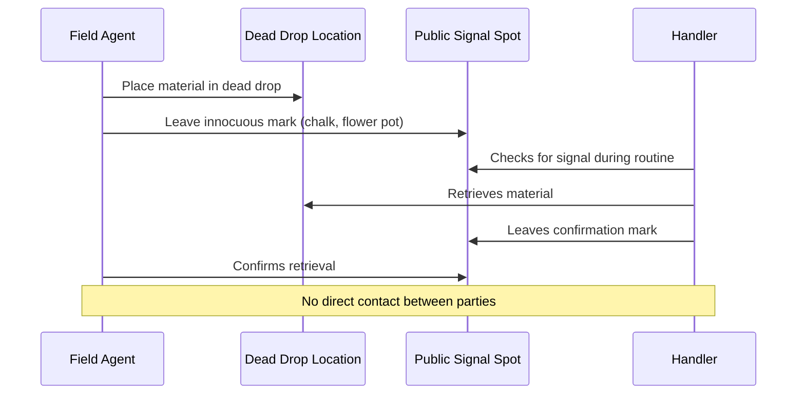
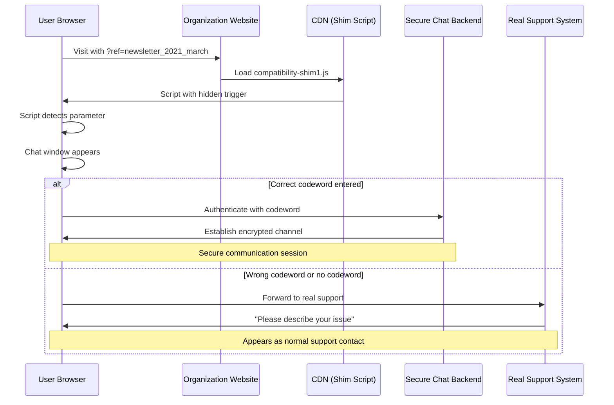

# Hidden in Plain Sight: A History of Covert Communication Systems

<!--category-- Security, History, JavaScript -->
<datetime class="hidden">2025-01-15T14:30</datetime>

## Introduction

Throughout human history, the need to communicate secretly has driven remarkable innovations. From ancient tyrants to Cold War spymasters to modern developers solving safety challenges, hiding information in plain sight has been both an art and a science. This post explores the fascinating evolution of covert communication systems, from messages tattooed on scalps to a JavaScript-based secure chat system I built that was so subtle, even active monitoring wouldn't reveal its existence.

[TOC]

## Ancient Origins: Histiaeus and the Tattooed Messenger

Our story begins around 500 BCE with Histiaeus of Miletus, a Greek tyrant held captive in Susa by the Persian king Darius I. Desperate to communicate with his son-in-law Aristagoras back in Miletus without arousing Persian suspicion, Histiaeus devised an ingenious solution.

He selected his most trusted slave, shaved the man's head, and tattooed a message directly onto his scalp. After waiting for the hair to grow back, he sent the slave to Miletus with simple instructions: "Tell Aristagoras to shave your head."

The message, urging rebellion against Persian rule, was literally hidden beneath the surface. The Persians, accustomed to intercepting conventional messages, never suspected that the messenger himself carried the intelligence. This triggered the Ionian Revolt, a pivotal moment in Greek-Persian relations.

**The key principle**: The communication channel itself appeared completely innocuous. The slave was just... a traveling slave. No suspicious scrolls, no coded letters, nothing to intercept.

## Steganography Through the Ages

Histiaeus's technique exemplifies **steganography** - the practice of concealing messages within non-secret media. Unlike cryptography, which makes messages unreadable, steganography hides the very existence of communication.

### Invisible Inks and Chemical Secrets

During the Revolutionary War, the Continental Army used invisible inks extensively. The most sophisticated was "Agent 711's" stain, developed by physician and spymaster James Jay. Written with a chemical reagent and revealed only with a specific counteragent, these messages appeared as blank pages - perfect for sending through British checkpoints.

In World War II, invisible inks evolved further. The British used everything from lemon juice (heat-activated) to sophisticated chemical compounds. The Germans developed microdots - photographs reduced to the size of a printed period that could be hidden in plain correspondence.

### The Art of the Dead Drop

Cold War espionage perfected the "dead drop" - a location where materials can be left by one party and retrieved by another without direct contact. A loose brick in a wall, a hollowed-out coin, a fake rock in a park - each concealed messages, film, or money.

The genius wasn't just the physical concealment, but the **signaling system**. A chalk mark on a mailbox, a specific flower pot position on a windowsill - these indicated that a dead drop was ready. To observers, these were meaningless details in the urban landscape.



### Numbers Stations: Broadcasting Secrets

From the Cold War through today, mysterious radio broadcasts have fascinated listeners worldwide. These "numbers stations" transmit strings of numbers, words, or tones - apparent gibberish to casual listeners.

But to the agent with the proper one-time pad? These are instructions, intelligence updates, or mission-critical data. The broadcasts are:

- **Untraceable**: Anyone can receive them; no special equipment needed
- **Deniable**: No proof of who's listening or what the numbers mean
- **Secure**: One-time pad encryption is mathematically unbreakable when used correctly

The broadcast itself hides in plain sight among thousands of radio transmissions, distinguishable only to those who know to listen.

## Digital Age Steganography

Modern computing has revolutionized steganography. Information can be hidden in:

### Image Steganography

Digital images store color values for millions of pixels. By subtly modifying the least significant bits of pixel values, you can embed data without visible changes to the image.

For example, in a 24-bit color image, changing the last bit of RGB values creates imperceptible color shifts but can store significant data:

```
Original pixel: RGB(11010110, 10110101, 01011010)
Modified pixel: RGB(11010111, 10110100, 01011011)
                     ↑changed   ↑changed   ↑changed
```

To the eye, these pixels are identical. To someone with the extraction algorithm, it's a hidden message.

### Linguistic Steganography

The ability to hide messages in seemingly normal text. Techniques include:

- **Acrostic codes**: First letters of sentences spell a message
- **Word substitution**: Using synonyms in patterns to encode bits
- **Whitespace encoding**: Extra spaces, tabs, or line breaks carry data

### Network Steganography

Hiding data in network traffic patterns:
- **Timing channels**: Varying packet timing to encode information
- **Protocol manipulation**: Using unused header fields
- **Traffic mimicry**: Making covert data look like legitimate traffic (Netflix streaming, gaming, etc.)

## The Modern Challenge: Digital Safety in Hostile Environments

This brings us to a contemporary problem that required all the lessons of historical steganography: **How do you provide secure, private communication to someone whose digital life is being monitored by someone physically present in their home?**

During COVID-19 lockdowns, this wasn't a theoretical problem. For victims of domestic abuse, being confined with their abuser while simultaneously losing access to external support networks created a dangerous situation. Traditional "secure" communication methods had fatal flaws:

- **Encrypted messaging apps**: Installing Signal or WhatsApp would be immediately suspicious
- **Private browsing modes**: Browser history showing "InPrivate" or "Incognito" sessions is itself a red flag
- **VPNs**: Obvious technical knowledge and deliberate concealment
- **New email accounts**: Easy to discover, suspicious to create

Even if the victim could communicate, any record of that communication - even the knowledge that communication occurred - could trigger violence.

What was needed was something that would leave **absolutely no trace** that anything unusual had happened, even to someone actively monitoring the computer.

## Building the Invisible Door: Technical Implementation

The solution I developed drew on every principle of historical steganography, adapted for the web era. Here's how it worked:

### Phase 1: The Innocuous Payload

The core was a tiny JavaScript file with an innocuous name like `compatibility-shim1.js` or `polyfill-helpers.js`. Organizations would add it to their website alongside their legitimate scripts:

```html
<script src="https://cdn.example.org/compatibility-shim1.js"></script>
```

To anyone inspecting the page source, this looked like one of dozens of helper libraries modern websites include. The file itself was:

- **Minified**: Unreadable but expected for production JavaScript
- **Small**: 3-4KB, typical for a utility library
- **Legitimate-looking**: Included actual compatibility checks and minor polyfills
- **Cached**: Normal browser caching behavior, no special flags

### Phase 2: The Trigger Mechanism

The script monitored for a specific URL query parameter - something like `?ref=newsletter_2021_march`. This looked completely innocuous:

- Marketing departments use similar tracking parameters constantly
- The parameter itself seemed to identify a referral source
- Different "campaigns" could have different codes
- No special characters, nothing suspicious in URL history

```javascript
// Heavily simplified example - actual implementation was obfuscated
const params = new URLSearchParams(window.location.search);
if (params.has('ref') && params.get('ref').match(/newsletter_\d{4}_[a-z]+/)) {
    // Trigger secure chat initialization
}
```

### Phase 3: The Authentication Challenge

When triggered, a chat window would appear - looking identical to the standard support chat many websites have. But it would prompt for a "verification code" or "service reference number."

This is where the elegance emerged:

**With the correct codeword** (sent via a separate, innocuous channel - perhaps a phone call mentioning "reference number 7B2X" for scheduling):
- The chat connected to secure backend
- End-to-end encryption established
- Direct connection to support staff
- No local logs or history

**Without the codeword or from wrong URL:**
- Chat appeared to malfunction ("Service temporarily unavailable")
- OR forwarded to real support with an innocuous first message
- The special query parameter would be stripped on forward
- No indication that anything special was attempted

### Phase 4: Traffic Obfuscation

The actual secure chat traffic was disguised:

- **Protocol**: Standard WebSocket over HTTPS, indistinguishable from normal chat widgets
- **Timing**: Random delays added to avoid pattern recognition
- **Volume**: Padded with noise data to prevent message length analysis
- **Endpoint**: CDN-hosted endpoint shared with legitimate services



### Phase 5: No Traces Left Behind

After the session:

- **No browser history entries**: Chat was within existing page, no navigation
- **No special cookies**: Session tokens expired and cleared
- **No local storage**: All state cleared on window close
- **No network logs anomalies**: Traffic indistinguishable from normal support chats
- **No console logs**: All debugging code stripped in production

If someone checked the computer afterward:
- Browser history showed a normal visit to the organization's website
- That marketing parameter in the URL was entirely forgettable
- The chat widget? Just another support attempt that didn't go anywhere
- Network logs (if anyone even checked) showed routine HTTPS traffic

## The Security Model

This system implemented several key security principles:

### 1. Deniability at Every Layer

Like numbers stations, the system was designed so that:
- Possession of the URL proves nothing (marketing links are ubiquitous)
- The script's presence on the site is expected and innocuous
- Failed authentication appears as a technical glitch
- No component alone reveals the system's true purpose

### 2. Separation of Channels

Following Cold War dead drop principles:
- URL distributed separately from codeword
- Codeword changed regularly
- No single channel compromised the entire system
- Each component appeared legitimate in isolation

### 3. Plausible Functionality

Like Histiaeus's traveling slave, the system had genuine utility:
- The script actually worked as a compatibility shim
- The chat widget was a real support tool
- The organization's website functioned normally
- Everything had a plausible innocent explanation

### 4. Fail-Safe Defaults

If something went wrong:
- System defaulted to non-secure mode
- No error messages revealed secure functionality
- Users safely forwarded to real support
- No dangerous partial states

## Technical Deep Dive: The Script Architecture

The actual implementation involved several clever techniques:

### Encrypted Payload

The secure chat code wasn't visible in the script source. Instead:

```javascript
// Simplified example of the pattern
const encryptedPayload = "U2FsdGVkX1+xYz... [encrypted data]";
const decryptionKey = deriveKeyFromContext(window.location, document.referrer);

if (validTriggerDetected()) {
    const chatModule = decryptPayload(encryptedPayload, decryptionKey);
    chatModule.initialize();
}
```

The decryption key was derived from environmental factors, meaning:
- Static analysis of the script revealed nothing
- The payload only decrypted in the right context
- No obvious cryptographic operations in the source

### Timing-Resistant Code

To prevent timing analysis that might reveal when the special code path executed:

```javascript
// Simplified example
async function processInput(userInput) {
    // Always perform both operations
    const secureResult = await checkSecureAuth(userInput);
    const normalResult = await checkNormalAuth(userInput);

    // Add random delay to normalize timing
    await randomDelay(100, 300);

    // Return appropriate result
    return secureResult.valid ? secureResult : normalResult;
}
```

Both code paths executed, making timing analysis useless.

### Fingerprint-Based Authentication

The codeword wasn't transmitted directly. Instead:

```javascript
// Hash the codeword with environmental factors
const authToken = await hashWithContext(
    userInput,
    window.navigator.userAgent,
    currentTimestamp,
    siteIdentifier
);
```

This meant:
- Intercepted tokens couldn't be replayed
- No plaintext codewords on the network
- Environmental binding prevented token theft

## Real-World Impact

This system was deployed for a support organization during COVID-19 lockdowns. The technical requirements were absolute:

- **Zero false negatives**: Legitimate users must always get through
- **Zero traces**: No evidence left on monitored computers
- **Zero trust assumptions**: Assume all traffic monitored, all devices compromised
- **Graceful degradation**: System failure must be safe

The system handled hundreds of secure sessions. For some users, it was literally a lifeline - enabling them to coordinate safety plans, access resources, and maintain contact with support services without alerting their abuser.

## Lessons from History, Applied to Modern Problems

The principles that made Histiaeus's tattooed messenger effective in 500 BCE applied directly:

1. **The medium is innocuous**: Traveling slave ↔ Marketing tracking parameter
2. **The message is hidden**: Under hair ↔ In encrypted JavaScript payload
3. **Discovery is non-obvious**: Must shave head to see ↔ Must know URL + codeword
4. **Interception is useless**: Stopping slaves doesn't reveal method ↔ Blocking URLs doesn't reveal system

Similarly, Cold War dead drops informed the design:

1. **Separation of signaling and payload**: Chalk mark ↔ URL parameter
2. **Plausible alternative purpose**: Tourist with map ↔ User checking support
3. **Time-bounded access**: Drop window ↔ Codeword expiry
4. **No direct contact**: Agent never meets handler ↔ User never reveals true intent

## Ethical Considerations

This technology exists in an ethically complex space. The same techniques enabling safety for abuse victims could facilitate:

- Corporate espionage
- Evading legitimate monitoring
- Covert exfiltration of data
- Criminal coordination

This is the eternal dilemma of dual-use technology. The techniques described here are not inherently good or evil - they are tools. Histiaeus used steganography to foment rebellion. Allied spies used invisible ink to defeat fascism. The technology is neutral; the application determines morality.

For this project, the ethical calculus was clear:

- **Legitimate need**: Abuse victims require secure communication
- **Proportionate response**: Threat model justified sophistication
- **Minimal scope**: System designed for specific, limited use case
- **Professional deployment**: Operated by established support organization
- **No criminal facilitation**: Used only for accessing legitimate services

But anyone building similar systems must grapple with these questions seriously.

## Detection and Countermeasures

How would you detect such a system if you suspected it existed?

### Technical Indicators

1. **Script behavior analysis**: Monitoring for conditional code execution based on URL parameters
2. **Traffic analysis**: Looking for encrypted WebSocket traffic from support widgets
3. **Code similarity**: Comparing scripts across multiple sites for common patterns
4. **Timing analysis**: Detecting authentication timing differences

### Practical Limitations

However, detection faces severe challenges:

- **False positives**: Millions of legitimate scripts use similar techniques
- **Encryption**: All modern web traffic is encrypted; no way to inspect
- **Volume**: Impossible to audit all JavaScript on all websites
- **Evolution**: Techniques adapt faster than detection tools

The defender's advantage in steganography remains: proving communication occurred requires proving the encoding system exists, which requires either inside knowledge or exhaustive analysis.

## Modern Applications Beyond Safety

The techniques explored here have broader applications:

### Censorship Resistance

In countries with heavy internet censorship, similar approaches enable:
- Access to blocked information
- Coordination of activism
- Journalism in hostile environments

### Corporate Security

Organizations might use comparable techniques for:
- Secure emergency communication channels
- Exfiltration of whistleblower information
- Protection of journalist sources

### Privacy-Preserving Systems

General applications include:
- Anonymous feedback systems
- Confidential reporting mechanisms
- Research with at-risk populations

## The Future of Hidden Systems

As surveillance capabilities grow, so will the sophistication of hiding techniques:

### AI-Generated Cover Traffic

Machine learning could generate perfectly realistic decoy traffic:
- Simulated user behavior
- Natural language generation for fake chats
- Synthetic network patterns

### Blockchain-Based Coordination

Decentralized systems could provide:
- No central point of compromise
- Cryptographic proof of authenticity
- Censorship-resistant communication

### Quantum Steganography

Quantum computing and communications offer new possibilities:
- Quantum key distribution for unbreakable encryption
- Quantum entanglement for undetectable communication
- Measurement-based access control

## Technical Implementation Considerations

For developers considering building similar systems, critical considerations include:

### Security

```javascript
// Never store sensitive data in localStorage
// Use sessionStorage with expiry, or pure memory

class SecureSession {
    constructor() {
        this.data = new Map(); // Memory only
        this.expiry = Date.now() + (30 * 60 * 1000); // 30 min

        // Clear on page unload
        window.addEventListener('beforeunload', () => this.destroy());

        // Auto-expire
        setTimeout(() => this.destroy(), 30 * 60 * 1000);
    }

    destroy() {
        this.data.clear();
        // Overwrite memory (best effort)
        this.data = null;
    }
}
```

### Performance

Steganographic systems must not degrade performance noticeably:

```javascript
// Lazy loading of secure components
async function initializeSecureChat() {
    // Only load if triggered
    if (!shouldInitialize()) return;

    // Dynamic import to keep main bundle small
    const { SecureChat } = await import('./secure-chat.encrypted.js');

    // Initialize asynchronously
    requestIdleCallback(() => {
        new SecureChat().initialize();
    });
}
```

### Maintainability

Hidden systems require careful documentation (stored securely, separately):

```markdown
## Secure Chat System - Operator Manual

### Activation
- URL pattern: `?ref=newsletter_YYYY_month`
- Current codewords: See separate secure document
- Rotation schedule: Monthly

### Incident Response
- If system discovered: Immediate codeword rotation
- If user identity compromised: Emergency protocol Alpha
- If backend compromised: Failover to backup, investigate

### Audit Trail
- Log only: Connection timestamp, session duration
- Never log: User identity, message content, codewords
```

## Conclusion: The Enduring Art of Concealment

From Histiaeus's tattooed messenger to JavaScript shims on modern websites, the fundamental challenge remains unchanged: how to communicate secretly when under observation.

The techniques evolve - tattoos become microdots become steganographic images become hidden JavaScript payloads - but the principles persist:

1. **Hide in plain sight**: Use expected, innocuous channels
2. **Separate knowledge**: Distribution and access must be distinct
3. **Plausible deniability**: Every component must have alternative explanation
4. **Fail safely**: Compromise must not reveal the system

The project described here represents a practical application of 2,500 years of steganographic evolution. It used cutting-edge web technology to implement ancient principles for a critical modern need.

As developers, we wield powerful tools. We can build systems that protect privacy, enable safety, and preserve human dignity even in hostile environments. But we must also recognize the dual nature of these capabilities and deploy them thoughtfully, ethically, and responsibly.

The next time you see an innocuous-looking script on a website or a seemingly meaningless URL parameter, remember: sometimes the most important systems are the ones you never notice at all.

---

## Important Disclaimer

**This post describes the concepts and principles behind the system, but this is NOT the actual implementation used in production.**

The real system deployed for safety-critical use had significantly more sophisticated security measures:

- Multiple layers of encryption beyond what's described here
- Advanced authentication mechanisms not covered in this post
- Sophisticated anti-tampering and anti-analysis protections
- Professional security auditing and penetration testing
- Operational security protocols and incident response procedures
- Legal review and compliance verification

The code examples in this post are simplified illustrations of the concepts and do not share any code with the production system. They demonstrate the principles of steganographic communication but lack the hardening, redundancy, and defense-in-depth approaches necessary for protecting vulnerable individuals.

**If you're building a similar system for safety-critical applications:**
- Engage professional security consultants
- Conduct thorough threat modeling
- Implement defense-in-depth strategies
- Plan for compromise scenarios
- Document incident response procedures
- Ensure legal compliance
- Test extensively in realistic threat scenarios

The upcoming demo app in the next post will show a proof-of-concept implementation for educational purposes only. It demonstrates the core ideas but should not be used for protecting real people in dangerous situations without significant additional security engineering.

---

*Note: Organizations requiring similar safety-focused systems should consult with security professionals and ensure compliance with relevant laws and regulations. The techniques discussed here have educational value but require substantial additional work for production deployment in high-stakes environments.*
