# How Neural Machine Translation Actually Works: A Developer's Guide

<datetime class="hidden">2025-11-09T14:30</datetime>
<!--category-- Neural Machine Translation, Machine Learning, AI, EasyNMT, Deep Learning, AI-Article -->

## Introduction

If you've been following this blog, you know I'm a bit obsessed with machine translation. I've written about [using EasyNMT](/blog/autotranslatingmarkdownfiles), [building background translation services](/blog/backgroundtranslationspt1), and even [improving EasyNMT](/blog/mostlylucid-nmt-complete-guide). But I realized I've never actually explained *how* neural machine translation works under the hood.

> NOTE: This is part of my experiments with AI / a way to spend $1000 Calude Code Web credits. I've fed this a BUNCH of papers, my understanding, questions I had to generate this article. It's fun and fills a gap I haven't seen filled anywhere else. 

So let's fix that! This post will take you from "translation is magic" to "translation is clever math" by explaining the key concepts behind neural machine translation in plain English (with lots of diagrams and some C# code to make it concrete).

By the end of this post, you'll understand:
- What artificial neural networks are and how they learn
- How words become numbers (embeddings)
- What "attention" means in AI (spoiler: it's not about paying attention)
- How the encoder-decoder architecture works
- Why transformers took over the world

Don't worry if you're not a math person - I'll keep this as practical and visual as possible. Let's dive in!


[TOC]

## The Core Idea: Translation as Number Crunching

Here's the first mind-bending concept: neural machine translation treats translation as a purely mathematical process. You feed in a sentence, the system converts it to numbers, performs millions of mathematical operations, and out pops a translation.

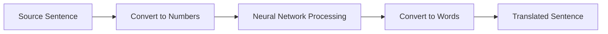

But wait - how do you convert words to numbers? And how does math "understand" language? Let's start with the building blocks.

## Artificial Neural Networks: The Foundation

Before we can understand neural machine translation, we need to understand artificial neural networks. Despite the fancy name, they're actually pretty simple at their core.

### What is an Artificial Neuron?

An artificial neuron is a mathematical function that:
1. Takes multiple inputs
2. Multiplies each input by a weight (how important is this input?)
3. Adds them all up
4. Applies an "activation function" to produce an output

Here's a visual representation:

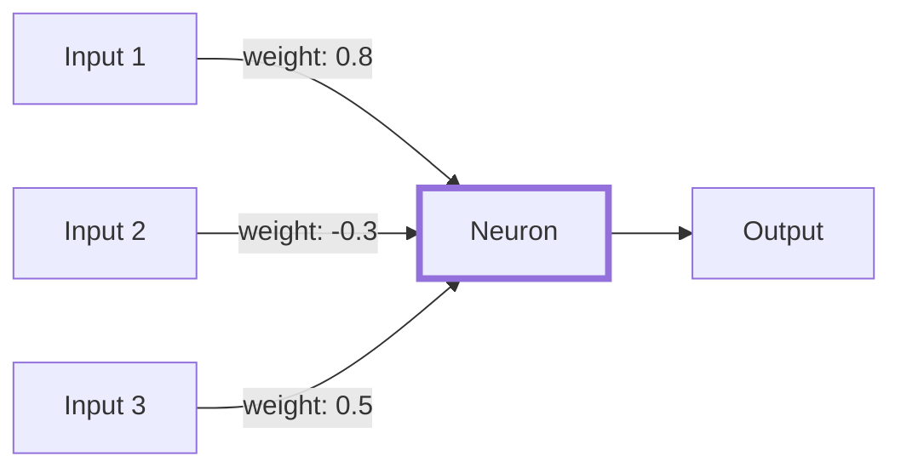

Let's make this concrete with some C# code:

```csharp
public class Neuron
{
    private double[] weights;
    private double bias;

    public double Activate(double[] inputs)
    {
        // Step 1: Multiply each input by its weight and sum them
        double sum = bias;
        for (int i = 0; i < inputs.Length; i++)
        {
            sum += inputs[i] * weights[i];
        }

        // Step 2: Apply activation function (tanh keeps values between -1 and 1)
        return Math.Tanh(sum);
    }
}
```

The activation function (in this case `Math.Tanh`) is what makes neural networks interesting. It introduces non-linearity, allowing the network to learn complex patterns. Without it, no matter how many neurons you stacked together, you'd just have a fancy linear function.

### From Neurons to Networks

The magic happens when you connect thousands or millions of these neurons together in layers:

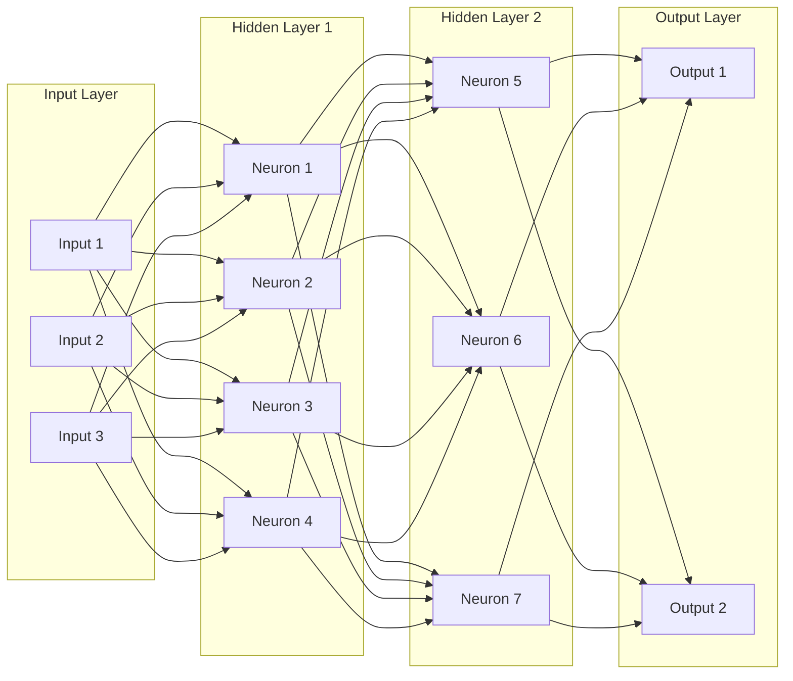

Each layer "refines" the representation of the input, extracting increasingly abstract patterns. In translation:
- Early layers might detect "this is a verb" or "this word is past tense"
- Middle layers might detect "this is a question" or "this is about weather"
- Later layers combine these into "translate this as a polite question about tomorrow's weather"

### How Networks Learn: The Training Process

Here's the clever part: we don't manually set all those weights. The network learns them from examples!

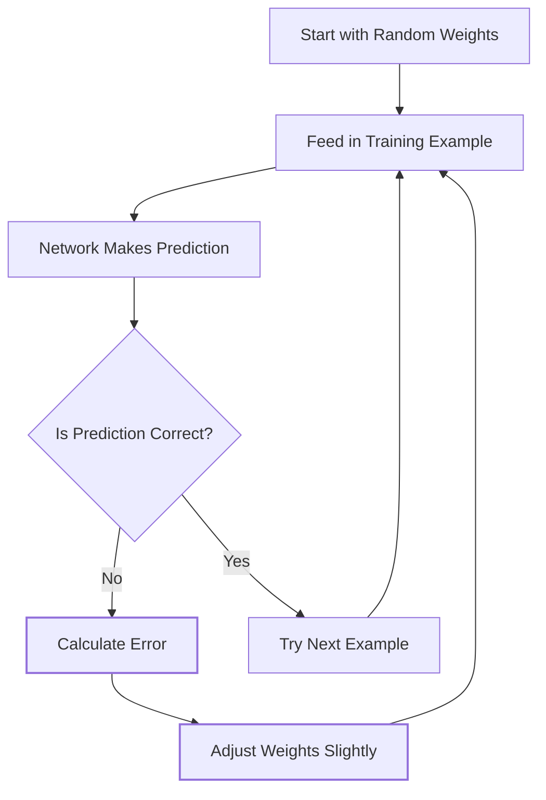

This process is called **gradient descent**. For each wrong answer, the network figures out "which weights were most responsible for this error?" and tweaks them a tiny bit. After seeing millions of examples, the weights settle into values that work well.

Here's a simplified version in C#:

```csharp
public class SimpleNeuralNetwork
{
    private double learningRate = 0.01;
    private Neuron[] neurons;

    public void Train(TrainingExample[] examples, int epochs)
    {
        for (int epoch = 0; epoch < epochs; epoch++)
        {
            foreach (var example in examples)
            {
                // Forward pass: make a prediction
                double prediction = Predict(example.Input);

                // Calculate error
                double error = example.ExpectedOutput - prediction;

                // Backward pass: adjust weights
                // (simplified - real networks use backpropagation)
                AdjustWeights(error * learningRate);
            }
        }
    }
}
```

Real neural networks use a more sophisticated algorithm called **backpropagation** that efficiently calculates how to adjust weights throughout the entire network, but the principle is the same: learn from mistakes.

## Word Embeddings: Turning Language into Math

Now we hit our first major challenge: how do we feed words into a neural network? We need to convert text into numbers.

### The Problem with One-Hot Encoding

The naive approach is "one-hot encoding" - assign each word a unique number:

```csharp
// Don't do this!
var wordToNumber = new Dictionary<string, int>
{
    {"cat", 1},
    {"dog", 2},
    {"king", 3},
    {"queen", 4},
    {"man", 5},
    {"woman", 6}
};
```

But this has a huge problem: the numbers are arbitrary. The network can't tell that "cat" and "dog" are more similar than "cat" and "queen". The numbers 1 and 2 don't mean anything.

### The Solution: Word Embeddings

Instead, we represent each word as a **vector** of numbers, typically 300-1000 dimensions. Similar words get similar vectors:

```csharp
public class WordEmbedding
{
    // Each word is represented by a vector of floats
    private Dictionary<string, float[]> embeddings;

    public float[] GetEmbedding(string word)
    {
        return embeddings[word]; // e.g., [0.2, -0.5, 0.8, 0.1, ...]
    }

    // Calculate similarity between two words
    public double Similarity(string word1, string word2)
    {
        var vec1 = GetEmbedding(word1);
        var vec2 = GetEmbedding(word2);

        // Cosine similarity: how "aligned" are the vectors?
        return CosineSimilarity(vec1, vec2);
    }

    private double CosineSimilarity(float[] a, float[] b)
    {
        double dot = 0, magA = 0, magB = 0;
        for (int i = 0; i < a.Length; i++)
        {
            dot += a[i] * b[i];
            magA += a[i] * a[i];
            magB += b[i] * b[i];
        }
        return dot / (Math.Sqrt(magA) * Math.Sqrt(magB));
    }
}
```

Here's what makes embeddings magical - they capture semantic relationships:

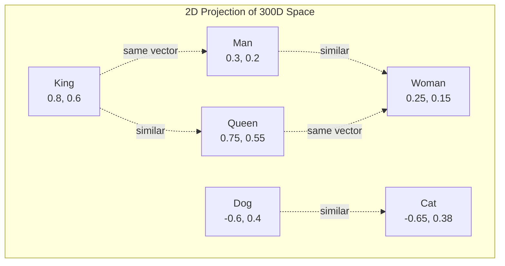

The famous example: `king - man + woman ≈ queen`

```csharp
public float[] AnalogicalReasoning(string a, string b, string c)
{
    // king - man + woman = ?
    var vecA = GetEmbedding(a); // king
    var vecB = GetEmbedding(b); // man
    var vecC = GetEmbedding(c); // woman

    var result = new float[vecA.Length];
    for (int i = 0; i < vecA.Length; i++)
    {
        result[i] = vecA[i] - vecB[i] + vecC[i];
    }

    // Find the word closest to this vector
    return FindClosestWord(result); // Should return "queen"
}
```

### How Are Embeddings Learned?

Embeddings are learned by training a neural network on a simple task: "predict the surrounding words". The idea is that words appearing in similar contexts should have similar meanings.

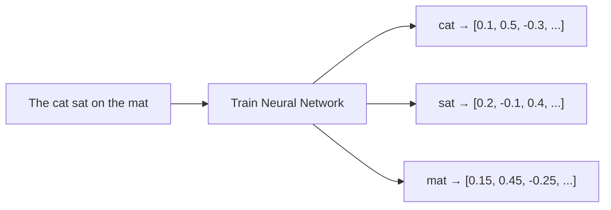

After training on billions of sentences, words that appear in similar contexts end up with similar embeddings. "Cat" and "dog" both appear near "pet", "feed", "cute", so their embeddings end up close together.

## Attention: The Game Changer

Here's a critical insight: when translating "The cat sat on the mat" to French, different source words matter for different target words:

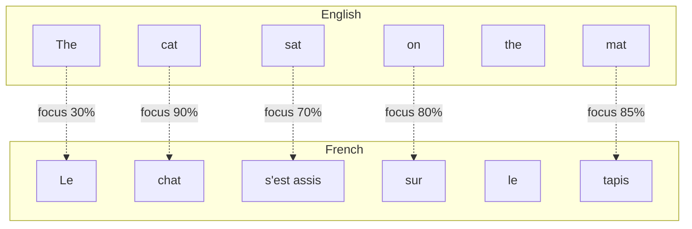

**Attention** is a mechanism that lets the network "focus" on different parts of the input when generating each output word.

### How Attention Works

Think of attention as asking: "To translate this word, which source words should I pay attention to?"

```csharp
public class AttentionMechanism
{
    // Calculate attention weights for each source word
    public double[] CalculateAttention(
        float[] currentTargetState,     // Where we are in translation
        float[][] sourceWordStates)     // All source words
    {
        int sourceLength = sourceWordStates.Length;
        double[] scores = new double[sourceLength];

        // Step 1: Calculate relevance scores
        for (int i = 0; i < sourceLength; i++)
        {
            scores[i] = DotProduct(currentTargetState, sourceWordStates[i]);
        }

        // Step 2: Convert to probabilities (softmax)
        return Softmax(scores);
    }

    public float[] ApplyAttention(
        double[] attentionWeights,
        float[][] sourceWordStates)
    {
        // Create weighted average of source words
        int dim = sourceWordStates[0].Length;
        float[] result = new float[dim];

        for (int i = 0; i < sourceWordStates.Length; i++)
        {
            for (int j = 0; j < dim; j++)
            {
                result[j] += (float)(attentionWeights[i] * sourceWordStates[i][j]);
            }
        }

        return result;
    }

    private double[] Softmax(double[] scores)
    {
        double[] result = new double[scores.Length];
        double sum = 0;

        for (int i = 0; i < scores.Length; i++)
        {
            result[i] = Math.Exp(scores[i]);
            sum += result[i];
        }

        for (int i = 0; i < scores.Length; i++)
        {
            result[i] /= sum;
        }

        return result;
    }

    private double DotProduct(float[] a, float[] b)
    {
        double sum = 0;
        for (int i = 0; i < a.Length; i++)
        {
            sum += a[i] * b[i];
        }
        return sum;
    }
}
```

The attention mechanism:
1. Compares the current target state to each source word
2. Calculates a "relevance score" for each source word
3. Converts scores to probabilities (they sum to 1)
4. Creates a weighted average of source words based on these probabilities

### Visualizing Attention

When translating "The agreement on the European Economic Area was signed in August 1992" to German, the attention looks like this:

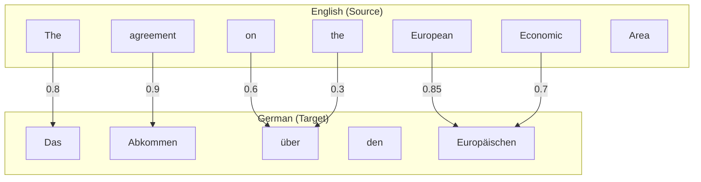

When generating "Abkommen" (agreement), the network pays 90% attention to "agreement", 5% to "the", and 5% distributed among other words.

### Self-Attention: Attending to Yourself

Modern transformers use **self-attention**: words in the same sentence attend to each other to build better representations.

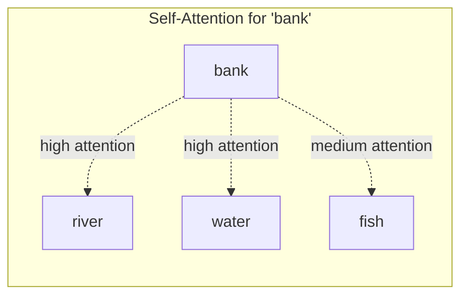

In "The fish swam near the river bank", the word "bank" attends strongly to "river", "fish", and "water", helping the network understand it means "riverbank" not "financial institution".

## The Encoder-Decoder Architecture

Now we can put it all together! Neural machine translation uses an **encoder-decoder** architecture:

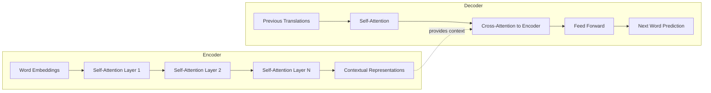

### The Encoder: Understanding the Source

The encoder's job is to read the source sentence and build rich representations:

```csharp
public class TransformerEncoder
{
    private WordEmbedding wordEmbedding;
    private SelfAttentionLayer[] layers;

    public float[][] Encode(string[] sourceWords)
    {
        // Step 1: Convert words to embeddings
        float[][] embeddings = sourceWords
            .Select(w => wordEmbedding.GetEmbedding(w))
            .ToArray();

        // Step 2: Add positional encoding (so network knows word order)
        float[][] withPositions = AddPositionalEncoding(embeddings);

        // Step 3: Apply multiple self-attention layers
        float[][] representations = withPositions;
        foreach (var layer in layers)
        {
            representations = layer.Forward(representations);
        }

        return representations; // Contextual representations for each word
    }

    private float[][] AddPositionalEncoding(float[][] embeddings)
    {
        // Add position-specific patterns so network knows word order
        // (transformers don't naturally understand sequence order)
        int sequenceLength = embeddings.Length;
        int embeddingDim = embeddings[0].Length;

        for (int pos = 0; pos < sequenceLength; pos++)
        {
            for (int i = 0; i < embeddingDim; i++)
            {
                double angle = pos / Math.Pow(10000, (2.0 * i) / embeddingDim);
                // Use sine for even dimensions, cosine for odd
                embeddings[pos][i] += (float)(i % 2 == 0 ? Math.Sin(angle) : Math.Cos(angle));
            }
        }

        return embeddings;
    }
}
```

After encoding, each source word has a representation that captures:
- Its meaning (from the embedding)
- Its position in the sentence (from positional encoding)
- Its relationship to other words (from self-attention)

### The Decoder: Generating the Translation

The decoder generates the translation one word at a time:

```csharp
public class TransformerDecoder
{
    private WordEmbedding targetEmbedding;
    private SelfAttentionLayer[] selfAttentionLayers;
    private CrossAttentionLayer[] crossAttentionLayers;
    private FeedForwardLayer[] feedForwardLayers;

    public string[] Decode(float[][] encodedSource, int maxLength)
    {
        List<string> translation = new List<string>();
        translation.Add("<START>"); // Special token to begin

        while (translation.Count < maxLength)
        {
            // Get next word
            string nextWord = GenerateNextWord(encodedSource, translation.ToArray());

            if (nextWord == "<END>") break; // Stop token

            translation.Add(nextWord);
        }

        return translation.Skip(1).ToArray(); // Remove <START> token
    }

    private string GenerateNextWord(float[][] encodedSource, string[] partialTranslation)
    {
        // Step 1: Embed the partial translation
        float[][] targetEmbeddings = partialTranslation
            .Select(w => targetEmbedding.GetEmbedding(w))
            .ToArray();

        // Step 2: Self-attention on target words
        float[][] selfAttended = ApplySelfAttention(targetEmbeddings);

        // Step 3: Cross-attention to source (this is where translation happens!)
        float[][] crossAttended = ApplyCrossAttention(selfAttended, encodedSource);

        // Step 4: Feed forward
        float[] finalState = ApplyFeedForward(crossAttended[^1]); // Last position

        // Step 5: Predict next word
        return PredictWord(finalState);
    }

    private string PredictWord(float[] state)
    {
        // Convert state to probability distribution over all possible words
        Dictionary<string, double> wordProbabilities = CalculateWordProbabilities(state);

        // Return most likely word (or sample from distribution)
        return wordProbabilities.OrderByDescending(kv => kv.Value).First().Key;
    }
}
```

The complete translation process:

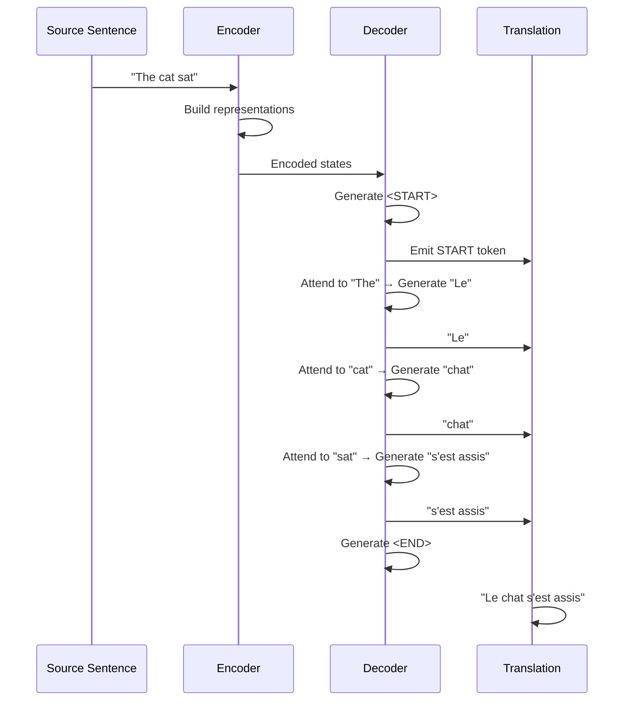

## Training a Translation Model

Training a translation model requires three things:

1. **Parallel corpus**: Millions of sentence pairs in both languages
2. **Loss function**: How "wrong" was our prediction?
3. **Optimization**: Adjust weights to reduce the loss

```csharp
public class TranslationTrainer
{
    private TransformerEncoder encoder;
    private TransformerDecoder decoder;
    private double learningRate = 0.0001;

    public void Train(ParallelCorpus corpus, int epochs)
    {
        foreach (var epoch in Enumerable.Range(0, epochs))
        {
            double totalLoss = 0;
            int batchCount = 0;

            foreach (var batch in corpus.GetBatches(batchSize: 32))
            {
                // Forward pass
                var predictions = new List<string[]>();
                var losses = new List<double>();

                foreach (var pair in batch)
                {
                    // Encode source
                    var encoded = encoder.Encode(pair.Source);

                    // Try to decode target
                    var predicted = decoder.Decode(encoded, pair.Target.Length);

                    // Calculate loss (how different is prediction from target?)
                    double loss = CalculateLoss(predicted, pair.Target);
                    losses.Add(loss);
                }

                // Backward pass: adjust weights
                double avgLoss = losses.Average();
                UpdateWeights(avgLoss);

                totalLoss += avgLoss;
                batchCount++;
            }

            Console.WriteLine($"Epoch {epoch}: Average Loss = {totalLoss / batchCount}");
        }
    }

    private double CalculateLoss(string[] predicted, string[] target)
    {
        // Cross-entropy loss: how far off were our word predictions?
        double loss = 0;

        for (int i = 0; i < Math.Min(predicted.Length, target.Length); i++)
        {
            if (predicted[i] != target[i])
            {
                loss += 1.0; // Simplified - real loss is more nuanced
            }
        }

        return loss / target.Length;
    }

    private void UpdateWeights(double loss)
    {
        // Backpropagation: adjust all weights in encoder and decoder
        // to reduce the loss (simplified here)
        // Real implementation uses automatic differentiation
    }
}
```

Training takes enormous amounts of data and computation:

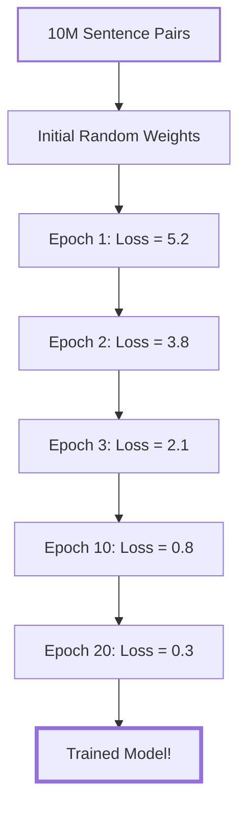

For a state-of-the-art model:
- **Training data**: 10-100 million sentence pairs
- **Training time**: 1-4 weeks on high-end GPUs
- **Model size**: 100M to 1B+ parameters (weights)

## Putting It All Together: A Complete Example

Let's trace through translating "The cat sat on the mat" to French:

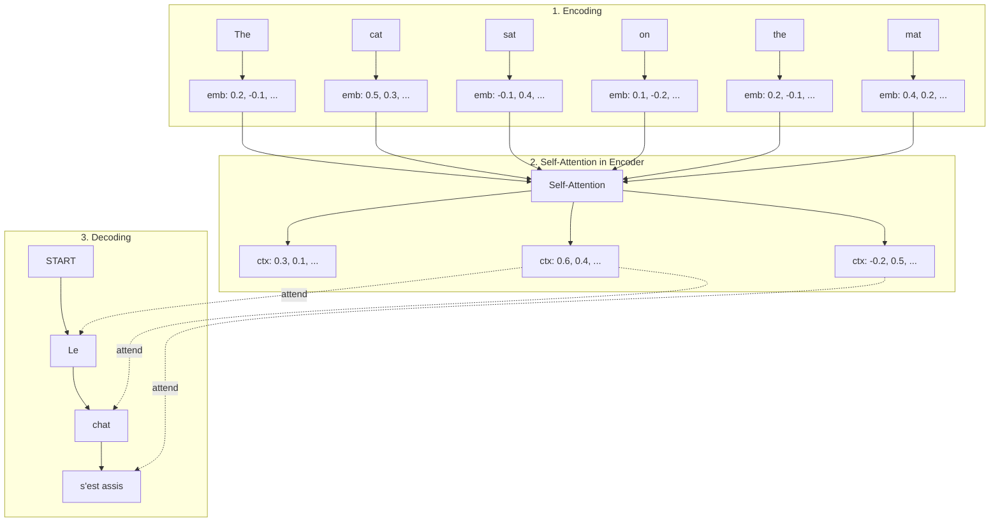

### Step-by-Step Process:

**Step 1: Encode "The"**
```csharp
var theEmbedding = encoder.GetEmbedding("The");
// [0.2, -0.1, 0.3, 0.05, ..., 0.1] (300 dimensions)
```

**Step 2: Encode "cat"**
```csharp
var catEmbedding = encoder.GetEmbedding("cat");
// [0.5, 0.3, -0.2, 0.4, ..., 0.15] (300 dimensions)
```

**Step 3: Self-Attention**
```csharp
// "cat" attends to other words
var catAttention = attention.CalculateAttention(catEmbedding, allWordEmbeddings);
// [0.1, 0.3, 0.2, 0.05, 0.1, 0.25]
// High attention to "sat" (0.3) and "mat" (0.25)

var catContextual = attention.ApplyAttention(catAttention, allWordEmbeddings);
// Weighted average incorporating context
```

**Step 4: Decoder starts with <START>**
```csharp
var decoderState = decoder.InitialState();
```

**Step 5: Generate "Le"**
```csharp
// Attend to source
var sourceAttention = crossAttention.Calculate(decoderState, encodedSource);
// [0.8, 0.05, 0.05, 0.02, 0.05, 0.03]
// Strong focus on "The" (0.8)

var nextWordProbs = decoder.PredictNextWord(decoderState, sourceAttention);
// {"Le": 0.85, "La": 0.08, "Les": 0.04, ...}

var firstWord = "Le";
```

**Step 6: Generate "chat"**
```csharp
decoderState = decoder.UpdateState(decoderState, "Le");

var sourceAttention = crossAttention.Calculate(decoderState, encodedSource);
// [0.05, 0.9, 0.02, 0.01, 0.01, 0.01]
// Strong focus on "cat" (0.9)

var nextWordProbs = decoder.PredictNextWord(decoderState, sourceAttention);
// {"chat": 0.92, "chien": 0.03, ...}

var secondWord = "chat";
```

**Step 7: Continue until <END>**
```
Final translation: "Le chat s'est assis sur le tapis"
```

## Why Transformers Won

The transformer architecture (the "T" in ChatGPT!) became dominant because:

1. **Parallelization**: Unlike older recurrent models, all words can be processed simultaneously
2. **Long-range dependencies**: Attention can connect any two words, no matter how far apart
3. **Scalability**: More data + bigger model = better results (up to a point)

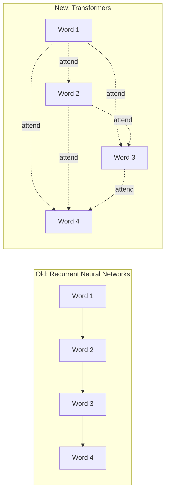

Recurrent networks process sequentially (slow!), while transformers process all words at once (fast!).

## Using NMT in C#: A Practical Example

Now that you understand how it works, here's how you'd actually use it in a .NET application:

```csharp
public class TranslationService
{
    private readonly HttpClient _httpClient;
    private readonly string _nmtServiceUrl;

    public TranslationService(HttpClient httpClient, IConfiguration config)
    {
        _httpClient = httpClient;
        _nmtServiceUrl = config["NMT:ServiceUrl"];
    }

    public async Task<TranslationResult> TranslateAsync(
        string text,
        string sourceLang,
        string targetLang)
    {
        var request = new TranslationRequest
        {
            Text = new[] { text },
            SourceLang = sourceLang,
            TargetLang = targetLang
        };

        var response = await _httpClient.PostAsJsonAsync(
            $"{_nmtServiceUrl}/translate",
            request);

        response.EnsureSuccessStatusCode();

        var result = await response.Content
            .ReadFromJsonAsync<TranslationResponse>();

        return new TranslationResult
        {
            Original = text,
            Translated = result.Translated[0],
            SourceLanguage = sourceLang,
            TargetLanguage = targetLang,
            TranslationTime = result.TranslationTime
        };
    }
}

public class TranslationRequest
{
    [JsonPropertyName("text")]
    public string[] Text { get; set; }

    [JsonPropertyName("source_lang")]
    public string SourceLang { get; set; }

    [JsonPropertyName("target_lang")]
    public string TargetLang { get; set; }
}

public class TranslationResponse
{
    [JsonPropertyName("translated")]
    public string[] Translated { get; set; }

    [JsonPropertyName("translation_time")]
    public double TranslationTime { get; set; }
}
```

Usage:

```csharp
// In your controller or service
public class BlogPostController : ControllerBase
{
    private readonly TranslationService _translator;

    public async Task<IActionResult> TranslatePost(int postId, string targetLang)
    {
        var post = await _blogService.GetPostAsync(postId);

        var translatedTitle = await _translator.TranslateAsync(
            post.Title,
            "en",
            targetLang);

        var translatedContent = await _translator.TranslateAsync(
            post.Content,
            "en",
            targetLang);

        return Ok(new
        {
            Title = translatedTitle.Translated,
            Content = translatedContent.Translated,
            OriginalLanguage = "en",
            TargetLanguage = targetLang
        });
    }
}
```

## Common Challenges and Solutions

### 1. Handling Long Texts

NMT models have input length limits (typically 512-1024 tokens). Solution: chunking!

```csharp
public async Task<string> TranslateLongText(string longText, string targetLang)
{
    const int maxChunkSize = 500; // characters

    // Split on paragraph boundaries
    var paragraphs = longText.Split(new[] { "\n\n", "\r\n\r\n" },
        StringSplitOptions.RemoveEmptyEntries);

    var translatedParagraphs = new List<string>();

    foreach (var paragraph in paragraphs)
    {
        if (paragraph.Length <= maxChunkSize)
        {
            var result = await _translator.TranslateAsync(paragraph, "en", targetLang);
            translatedParagraphs.Add(result.Translated);
        }
        else
        {
            // Split long paragraph into sentences
            var sentences = SplitIntoSentences(paragraph);
            var translatedSentences = new List<string>();

            foreach (var sentence in sentences)
            {
                var result = await _translator.TranslateAsync(sentence, "en", targetLang);
                translatedSentences.Add(result.Translated);
            }

            translatedParagraphs.Add(string.Join(" ", translatedSentences));
        }
    }

    return string.Join("\n\n", translatedParagraphs);
}
```

### 2. Preserving Formatting

Markdown, HTML, and other markup can confuse NMT models:

```csharp
public async Task<string> TranslateMarkdown(string markdown, string targetLang)
{
    // Extract text from markdown while preserving structure
    var doc = Markdig.Markdown.Parse(markdown);
    var textSegments = new List<(string text, int position)>();

    // Walk the AST and extract translatable text
    foreach (var node in doc.Descendants())
    {
        if (node is LiteralInline literal)
        {
            var text = literal.Content.ToString();
            if (!string.IsNullOrWhiteSpace(text) && !IsImagePath(text))
            {
                textSegments.Add((text, literal.Span.Start));
            }
        }
    }

    // Translate all segments
    var translations = await Task.WhenAll(
        textSegments.Select(async seg => new
        {
            seg.position,
            translated = (await _translator.TranslateAsync(seg.text, "en", targetLang)).Translated
        }));

    // Reconstruct markdown with translations
    var result = markdown;
    foreach (var translation in translations.OrderByDescending(t => t.position))
    {
        result = result.Remove(translation.position, textSegments
            .First(s => s.position == translation.position).text.Length)
            .Insert(translation.position, translation.translated);
    }

    return result;
}
```

### 3. Batch Processing for Efficiency

Translating one sentence at a time is slow. Batch them!

```csharp
public async Task<Dictionary<string, string>> TranslateBatch(
    IEnumerable<string> texts,
    string targetLang)
{
    const int batchSize = 32;
    var results = new Dictionary<string, string>();

    foreach (var batch in texts.Chunk(batchSize))
    {
        var request = new TranslationRequest
        {
            Text = batch.ToArray(),
            SourceLang = "en",
            TargetLang = targetLang
        };

        var response = await _httpClient.PostAsJsonAsync(
            $"{_nmtServiceUrl}/translate",
            request);

        var result = await response.Content
            .ReadFromJsonAsync<TranslationResponse>();

        for (int i = 0; i < batch.Length; i++)
        {
            results[batch[i]] = result.Translated[i];
        }
    }

    return results;
}
```

## Performance Characteristics

Understanding the computational costs helps you architect better solutions:

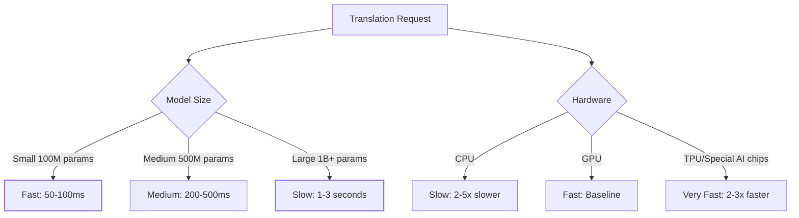

Typical performance (per sentence on GPU):
- **Small models** (100M params): 50-100ms
- **Medium models** (500M params): 200-500ms
- **Large models** (1B+ params): 1-3 seconds

**CPU vs GPU**: GPU is 2-10x faster for NMT

**Batch processing**: Can achieve 100+ sentences/second with batching

## Conclusion

Neural machine translation might seem like magic, but it's actually an elegant combination of several clever ideas:

1. **Embeddings**: Represent words as vectors that capture meaning
2. **Neural networks**: Learn patterns from millions of examples
3. **Attention**: Focus on relevant parts of the input
4. **Encoder-decoder**: Separate understanding from generation
5. **Transformers**: Process everything in parallel

The amazing thing is that modern NMT systems don't have any explicit rules about grammar, syntax, or translation equivalents. They learn everything from examples!

If you're working with NMT in production (as I do for this blog), understanding these principles helps you:
- **Debug issues**: Why is the model translating "bank" as "banque" (financial) instead of "rive" (river)?
- **Optimize performance**: Should I batch requests? Use beam search?
- **Handle edge cases**: How do I preserve code blocks in translated markdown?
- **Set expectations**: Why can't it handle 100,000-word documents?

The field is still evolving rapidly. Models get bigger, faster, and better every year. But the core concepts - embeddings, attention, encoder-decoder - remain fundamental.

Now when you hit "translate" on your blog posts, you'll know exactly what's happening under the hood! 🚀

## Further Reading

If you want to dive deeper:

- [Attention Is All You Need](https://arxiv.org/abs/1706.03762) - The original transformer paper
- [The Illustrated Transformer](https://jalammar.github.io/illustrated-transformer/) - Excellent visual explanations
- [Neural Machine Translation by Jointly Learning to Align and Translate](https://arxiv.org/abs/1409.0473) - The attention mechanism paper
- [My posts on EasyNMT](/blog/category/EasyNMT) - Practical implementation details
