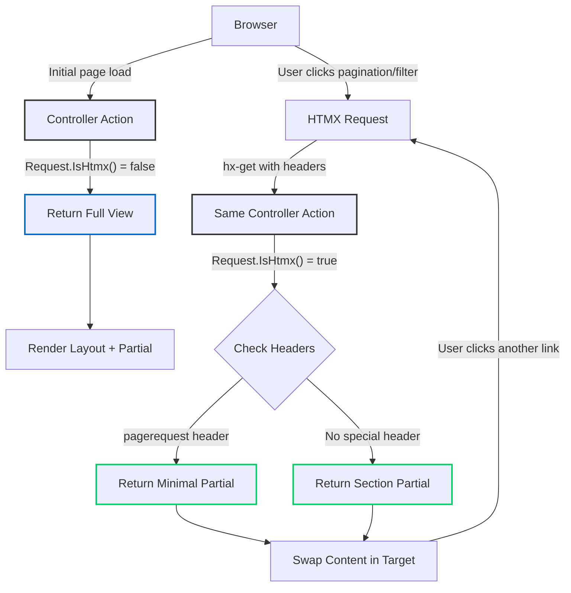

# HTMX with ASP.NET Core Partials: The Server-Side Renaissance

<datetime class="hidden">2025-01-27T12:00</datetime>
<!--category-- HTMX, ASP.NET Core, Web Development, HTMX.NET -->

## Introduction

Whilst the JavaScript world has been busy inventing yet another framework every fortnight, ASP.NET Core developers have been quietly building robust server-side applications with partial views. Now, with HTMX, we can add dynamic, SPA-like interactions without drowning in JavaScript complexity. It's rather like having your cake and eating it too.

In this article, I'll show you how HTMX integrates beautifully with ASP.NET Core partials, how the excellent **HTMX.NET** library makes it even better, and how my [mostlylucid.pagingtaghelper](https://github.com/scottgal/mostlylucid.pagingtaghelper) NuGet package provides powerful pagination with zero configuration.

As a cheeky aside: Django only got proper partial template rendering in version 6.0 (released December 2024), whilst ASP.NET Core has had partial views since day one. Sometimes the old dogs know a few tricks!

[TOC]

## What is HTMX?

HTMX is a library that lets you access modern browser features directly from HTML, rather than writing JavaScript. It extends HTML with attributes that allow you to make AJAX requests, swap content, and create rich interactions - all without leaving your markup.

The key attributes you'll use most often:

- `hx-get`, `hx-post`, `hx-put`, `hx-delete` - Make HTTP requests
- `hx-target` - Specify where to put the response
- `hx-swap` - Control how content is swapped (innerHTML, outerHTML, etc.)
- `hx-trigger` - Define what triggers the request (click, change, load, etc.)
- `hx-push-url` - Update the browser URL without a full page reload

Here's the beauty of it: you're still writing server-side code, returning server-rendered HTML. No JSON APIs, no client-side templates, no build pipelines. Just good old-fashioned HTML over the wire.

## Setting Up HTMX in ASP.NET Core

First, include HTMX in your layout. You can use a CDN or serve it locally:

```html
<script src="https://unpkg.com/htmx.org@2.0.0"></script>
```

That's it. No build step, no npm install, no webpack configuration. Just drop in a script tag and you're off to the races.

## Alpine.js: The Client-Side Component

Whilst HTMX handles the server interactions brilliantly, sometimes you need a touch of client-side reactivity - showing/hiding elements, toggling states, or managing local UI state. This is where [Alpine.js](https://alpinejs.dev/) comes in.

Alpine.js is a minimal JavaScript framework that gives you the reactive and declarative nature of big frameworks like Vue or React, but at a fraction of the size. At just 15KB gzipped, it's the perfect companion to HTMX.

```html
<script defer src="https://cdn.jsdelivr.net/npm/alpinejs@3.x.x/dist/cdn.min.js"></script>
```

The beauty of Alpine.js is how naturally it works alongside HTMX:

```razor
<div x-data="{ open: false }">
    <button @click="open = !open">Toggle</button>
    <div x-show="open" x-transition>
        <button
            hx-get="/api/data"
            hx-target="#results">
            Load Data
        </button>
    </div>
</div>
```

In this example:
- Alpine handles the local UI state (showing/hiding the content)
- HTMX handles the server communication (fetching data)
- No build step, no npm packages, no complexity

Throughout this article, you'll see examples where Alpine and HTMX work together seamlessly - Alpine for client-side reactivity, HTMX for server-side interactions. It's a wonderfully productive combination.

## The HTMX.NET Library

Whilst HTMX works perfectly well on its own, the excellent [HTMX.NET](https://github.com/khalidabuhakmeh/Htmx.Net) library by [Khalid Abuhakmeh](https://khalidabuhakmeh.com/about) provides brilliant server-side integration for ASP.NET Core. Khalid has done a fantastic job creating a library that feels native to ASP.NET Core - it's available as the `Htmx` and `Htmx.TagHelpers` NuGet packages and makes working with HTMX in .NET an absolute pleasure.

You can find Khalid's work on [GitHub](https://github.com/khalidabuhakmeh) where he maintains numerous excellent open-source projects.

### Installation

```bash
dotnet add package Htmx
dotnet add package Htmx.TagHelpers
```

In your `_ViewImports.cshtml`:

```razor
@addTagHelper *, Htmx.TagHelpers
```

### The IsHtmx() Extension Method

The most useful feature is the `Request.IsHtmx()` extension method, which tells you whether the request came from HTMX. This lets you return either a full view or just a partial:

```csharp
[HttpGet]
public async Task<IActionResult> Index(int page = 1, int pageSize = 20)
{
    var posts = await blogViewService.GetPagedPosts(page, pageSize);

    if (Request.IsHtmx())
        return PartialView("_BlogSummaryList", posts);

    return View("Index", posts);
}
```

This pattern is absolutely brilliant. A single controller action serves both:
- Full page loads (when users navigate directly or refresh)
- Partial updates (when HTMX makes the request)

No separate API endpoints, no duplicated logic, no JSON serialisation overhead.

### HTMX.NET Tag Helpers

HTMX.NET provides tag helpers that make working with controllers cleaner. Instead of writing route strings, you can use strongly-typed references:

```razor
<button
    hx-controller="Comment"
    hx-action="GetCommentForm"
    hx-post
    hx-target="#commentform">
    Reply
</button>
```

This generates the correct route using ASP.NET Core's routing system. If you rename your controller or action, your IDE will catch it. Much better than magic strings!

Here's a real example from this blog's comment system:

```razor
<button
    class="btn btn-outline btn-sm mb-4"
    hx-action="Comment"
    hx-controller="Comment"
    hx-post
    hx-vals
    x-on:click.prevent="window.mostlylucid.comments.setValues($event)"
    hx-on="htmx:afterSwap: window.scrollTo({top: 0, behavior: 'smooth'})"
    hx-swap="outerHTML"
    hx-target="#commentform">
    Comment
</button>
```

Notice how HTMX plays nicely with Alpine.js (`x-on:click.prevent`) for those occasional bits of client-side interactivity.

### Other HTMX.NET Helpers

The library also provides:

- `Request.IsHtmxNonBoosted()` - Check if it's an HTMX request but not boosted
- `Request.IsHtmxRefresh()` - Check if it's a history restore request
- Response helpers for HTMX headers (triggers, redirects, etc.)

## Real-World Example: Search with Partials

Let's look at a real example from this blog's search functionality. Here's the controller:

```csharp
[HttpGet]
[Route("")]
[OutputCache(Duration = 3600, VaryByHeaderNames = new[] { "hx-request", "pagerequest" })]
public async Task<IActionResult> Search(
    string? query,
    int page = 1,
    int pageSize = 10,
    string? language = null,
    DateRangeOption dateRange = DateRangeOption.AllTime,
    DateTime? startDate = null,
    DateTime? endDate = null,
    [FromHeader] bool pagerequest = false)
{
    // Build search model...
    var searchModel = new SearchResultsModel
    {
        Query = query,
        SearchResults = searchResults.ToPostListViewModel(),
        // ... other properties
    };

    // Return appropriate view based on request type
    if (pagerequest && Request.IsHtmx())
        return PartialView("_SearchResultsPartial", searchModel.SearchResults);

    if (Request.IsHtmx())
        return PartialView("SearchResults", searchModel);

    return View("SearchResults", searchModel);
}
```

Notice the three different return paths:
1. Just the paged results (for pagination requests)
2. The search results section (for HTMX filter changes)
3. The full page (for direct navigation)

The partial view (`_SearchResultsPartial.cshtml`) uses the paging tag helper:

```razor
@model Mostlylucid.Models.Blog.PostListViewModel
<div class="pt-2" id="content">
    @if (Model.Data?.Any() is true)
    {
        <div class="inline-flex w-full items-center justify-center pb-4">
            @if (Model.TotalItems > Model.PageSize)
            {
                <pager
                    x-ref="pager"
                    link-url="@Model.LinkUrl"
                    hx-boost="true"
                    hx-target="#content"
                    hx-swap="show:none"
                    page="@Model.Page"
                    page-size="@Model.PageSize"
                    total-items="@Model.TotalItems"
                    hx-headers='{"pagerequest": "true"}'>
                </pager>
            }
        </div>
        @foreach (var post in Model.Data)
        {
            <partial name="_ListPost" model="post"/>
        }
    }
</div>
```

Let's unpack what's happening here:

1. The `hx-boost="true"` intercepts the pagination links and makes them AJAX requests
2. `hx-target="#content"` specifies where to inject the response
3. `hx-headers` passes a custom header so the controller knows it's a pagination request
4. The controller sees both `Request.IsHtmx()` and `pagerequest`, returning just the partial

## The mostlylucid.pagingtaghelper Package

I wrote [mostlylucid.pagingtaghelper](https://github.com/scottgal/mostlylucid.pagingtaghelper) because I was tired of writing pagination code over and over. It's designed to work brilliantly with HTMX whilst supporting traditional navigation too.

### Installation

```bash
dotnet add package mostlylucid.pagingtaghelper
```

In `_ViewImports.cshtml`:

```razor
@addTagHelper *, mostlylucid.pagingtaghelper
```

### Key Features

**Zero Configuration Required**
Just implement `IPagingModel<T>` and you're sorted:

```csharp
public class BasePagingModel<T> : IPagingModel<T> where T : class
{
    public int Page { get; set; }
    public int TotalItems { get; set; }
    public int PageSize { get; set; }
    public string LinkUrl { get; set; }
    public List<T> Data { get; set; }
}
```

**Multiple UI Frameworks**
Out of the box support for:
- TailwindCSS + DaisyUI (with dark mode)
- Pure TailwindCSS
- Bootstrap 5
- Plain CSS
- Custom views

**HTMX-First Design**
The default mode uses HTMX for AJAX pagination without page reloads:

```razor
<paging
    model="@Model"
    hx-boost="true"
    hx-target="#content"
    hx-swap="outerHTML">
</paging>
```

**Alternative JavaScript Modes**
- HTMX + Alpine.js for reactivity
- Standalone Alpine.js
- Vanilla JavaScript
- No JavaScript (progressive enhancement with forms)

**Built-in Localisation**
Supports 8 languages (English, German, Spanish, French, Italian, Japanese, Portuguese, Chinese) with customisable text templates.

**Additional Components**
- Sortable table headers with visual indicators
- Page size selectors
- Continuation token support for NoSQL databases

### Real Usage Example

Here's how it's used in the blog listing:

```razor
<paging
    hx-boost="true"
    class="shrink-0"
    hx-target="#content"
    hx-push-url="false"
    hx-swap="show:none"
    hx-headers='{"pagerequest": "true"}'
    model="@Model">
</paging>
```

The tag helper generates pagination links that:
- Preserve query string parameters (search terms, filters, etc.)
- Work with or without JavaScript
- Update the URL history (unless `hx-push-url="false"`)
- Support custom HTMX headers for controller routing

## HTMX Flow Diagram

Here's how the whole system fits together:



## Comparing to Other Frameworks

### Django's Late Arrival to Partials

It's worth noting that Django only added proper partial template rendering in version 6.0 (December 2024) with the introduction of template fragments. Before that, Django developers had to either:
- Return entire templates (wasteful)
- Use inclusion tags (clunky)
- Install third-party packages like django-render-block

Meanwhile, ASP.NET Core has had `PartialView()` since version 1.0 in 2016. We've been doing this dance for nearly a decade!

### Rails Turbo Frames

Ruby on Rails has Turbo Frames (part of Hotwire), which is similar in spirit:

```erb
<%= turbo_frame_tag "posts" do %>
  <%= render @posts %>
<% end %>
```

The difference is that Turbo requires specific frame markers on both request and response. HTMX is more flexible - any endpoint can return any HTML, and you decide where it goes with `hx-target`.

### Phoenix LiveView

Elixir's Phoenix LiveView takes a different approach with persistent WebSocket connections and server-side state:

```elixir
def handle_event("load_more", _params, socket) do
  {:noreply, assign(socket, posts: load_more_posts())}
end
```

LiveView is brilliant for real-time applications, but it requires WebSocket infrastructure and server memory for connections. HTMX uses plain old HTTP - stateless, cacheable, scaleable. For a blog, that's perfect.

## Performance Considerations

### Output Caching

Notice the `OutputCache` attribute on the search controller:

```csharp
[OutputCache(Duration = 3600, VaryByHeaderNames = new[] { "hx-request", "pagerequest" })]
```

This caches both full page responses and partial responses separately. HTMX requests hit the cache just like regular requests, making subsequent loads blazingly fast.

### Network Efficiency

Returning partials instead of JSON + client-side rendering means:
- **Smaller payloads**: Rendered HTML is often smaller than JSON + JavaScript template
- **Fewer round trips**: No separate API calls for data then assets
- **Better caching**: HTTP caching works properly with HTML responses

### Bundle Size

Here's what you need to ship to the client:
- HTMX: 14KB (gzipped)
- Alpine.js (optional): 15KB (gzipped)
- My paging tag helper: 0KB (server-side only)

Compare that to a typical React app bundle (200KB+) and there's no contest for a content-focused site.

## Advanced Patterns

### Optimistic UI Updates

You can combine HTMX with Alpine.js for optimistic updates:

```razor
<div x-data="{ count: @Model.CommentCount }">
    <button
        hx-post="/comment/like"
        x-on:click="count++"
        hx-on::after-request="count = $event.detail.xhr.response">
        Likes: <span x-text="count"></span>
    </button>
</div>
```

The count increments immediately (optimistic), then gets corrected when the response arrives.

### Out-of-Band Swaps

HTMX can update multiple parts of the page from one response:

```razor
<div id="main-content">
    <!-- Main response goes here -->
</div>

<!-- Response can include this to update header -->
<div id="notification-count" hx-swap-oob="true">
    <span>5 new notifications</span>
</div>
```

This is brilliant for updating notification badges, shopping cart counts, etc.

### Progressive Enhancement

Here's the beautiful bit: remove JavaScript and the paging tag helper falls back to regular links. It's proper progressive enhancement:

```razor
<paging model="@Model"></paging>
```

Without JavaScript: Standard pagination links that cause full page loads
With HTMX: AJAX pagination with smooth transitions
With HTMX + Alpine: Reactive UI updates and animations

## Common Gotchas

### CSRF Tokens

ASP.NET Core's antiforgery tokens work differently with AJAX. You need to configure HTMX to send the token:

```javascript
document.addEventListener('htmx:configRequest', (event) => {
    event.detail.headers['X-CSRF-TOKEN'] =
        document.querySelector('[name="__RequestVerificationToken"]').value;
});
```

### History Management

By default, HTMX pushes every request to history. For pagination, you might want:

```razor
<paging
    model="@Model"
    hx-push-url="false">  <!-- Don't pollute history -->
</paging>
```

Or use `hx-replace-url="true"` to update the URL without adding history entries.

### Debugging

Install the HTMX devtools browser extension. It shows you every request, response, and swap in real-time. Absolutely invaluable.

## Conclusion

HTMX with ASP.NET Core partials represents a return to server-side simplicity without sacrificing modern UX. You get:

- ✅ Dynamic, SPA-like interactions
- ✅ Server-side rendering (great for SEO)
- ✅ Proper HTTP caching
- ✅ Minimal JavaScript
- ✅ Progressive enhancement
- ✅ Type-safe routing with HTMX.NET
- ✅ Zero-config pagination with mostlylucid.pagingtaghelper

Whilst the JavaScript world continues its framework-of-the-week cycle, we can build robust, performant web applications using patterns that have worked for decades. Sometimes the old ways are the best ways - they've just been waiting for the right tool to make them shine again.

And as for Django finally getting partials in 2024? Well, better late than never! 😏

## Related Articles on This Blog

If you found this article useful, you might also enjoy these other HTMX-related articles from this blog:

- [Adding Paging with HTMX](/blog/addpagingwithhtmx) - The original article on implementing pagination with the older PaginationTagHelper
- [ASP.NET Core Caching with HTMX](/blog/aspnetcachingwithhtmx) - Deep dive into caching strategies for HTMX requests
- [A Whistle-stop Tour of HTMX Extensions](/blog/htmxandaspnetcore) - Comprehensive guide to HTMX events and lifecycle
- [Auto-refresh with Alpine and HTMX](/blog/autorefreshwithalpineandhtmx) - Combining Alpine.js with HTMX for reactive components

## Further Reading

**Official Documentation:**
- [HTMX Documentation](https://htmx.org/docs/) - The official HTMX documentation
- [HTMX Examples](https://htmx.org/examples/) - Practical examples of HTMX patterns
- [HTMX Extensions](https://htmx.org/extensions/) - Official HTMX extensions
- [Alpine.js Documentation](https://alpinejs.dev/) - Official Alpine.js docs
- [Alpine.js Examples](https://alpinejs.dev/examples) - Practical Alpine.js patterns
- [ASP.NET Core Partial Views](https://learn.microsoft.com/en-us/aspnet/core/mvc/views/partial) - Microsoft's guide to partial views
- [ASP.NET Core Output Caching](https://learn.microsoft.com/en-us/aspnet/core/performance/caching/output) - Official caching documentation

**Libraries & Tools:**
- [HTMX.NET GitHub](https://github.com/khalidabuhakmeh/Htmx.Net) - The HTMX.NET library source code
- [HTMX.NET NuGet](https://www.nuget.org/packages/Htmx/) - HTMX.NET on NuGet
- [Htmx.TagHelpers NuGet](https://www.nuget.org/packages/Htmx.TagHelpers/) - HTMX Tag Helpers on NuGet
- [Khalid Abuhakmeh's Website](https://khalidabuhakmeh.com/) - Creator of HTMX.NET, with excellent blog posts
- [Khalid Abuhakmeh's GitHub](https://github.com/khalidabuhakmeh) - More brilliant open-source .NET projects
- [mostlylucid.pagingtaghelper GitHub](https://github.com/scottgal/mostlylucid.pagingtaghelper) - My paging tag helper source code
- [mostlylucid.pagingtaghelper NuGet](https://www.nuget.org/packages/mostlylucid.pagingtaghelper/) - The package on NuGet

**Community Resources:**
- [HTMX Discord](https://htmx.org/discord) - Active community support
- [HTMX Essays](https://htmx.org/essays/) - Thoughtful articles on HTMX philosophy
- [Hypermedia Systems Book](https://hypermedia.systems/) - Free online book about building hypermedia applications
