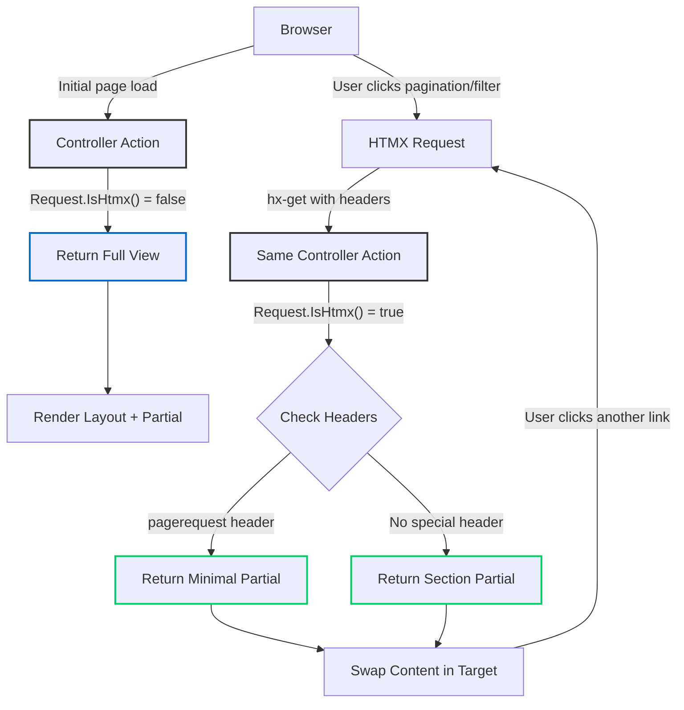

# HTMX with ASP.NET Core Partials: The Server-Side Renaissance

<datetime class="hidden">2025-11-28T12:00</datetime>
<!--category-- HTMX, ASP.NET Core, Web Development, HTMX.NET -->

## Introduction

If you've built traditional ASP.NET Core MVC applications, you know the problem: that dreaded "click flash" when users navigate between pages. Full page reloads, the browser chrome flickering, content jumping around as the new page renders. It works, but it doesn't *feel* modern.

The technique of returning partial HTML fragments from the server and swapping them into the DOM solves this - and it isn't new. I've been using this pattern since the jQuery days, and even before that with vanilla JavaScript and `XMLHttpRequest`. What's changed is how *elegant* it's become with HTMX.

HTMX gives us a declarative way to do what we've always done: return server-rendered HTML and swap it into the page. No more writing custom JavaScript for every interaction. No more choosing between "proper" server-side development and smooth user experience. With HTMX, we get both.

> **Companion Article:** This article focuses on the ASP.NET Core integration side. For a deep dive into HTMX events, lifecycle, and custom extensions, see my companion article: [A Whistle-stop Tour of HTMX Extensions and Using HTMX with ASP.NET Core](/blog/htmxandaspnetcore).

In this article, I'll show you how HTMX integrates beautifully with ASP.NET Core partials, how the excellent **HTMX.NET** library makes it even better, and how my [mostlylucid.pagingtaghelper](https://github.com/scottgal/mostlylucid.pagingtaghelper) NuGet package provides powerful pagination with zero configuration.

The approach is framework-agnostic too - Django added template fragments in version 6.0, Rails has Turbo Frames, and the broader web ecosystem is embracing HTML-over-the-wire patterns. It's a good time to be building server-rendered applications.

[TOC]

## What is HTMX?

HTMX is a library that lets you access modern browser features directly from HTML, rather than writing JavaScript. It extends HTML with attributes that allow you to make AJAX requests, swap content, and create rich interactions - all without leaving your markup.

The key attributes you'll use most often:

- `hx-get`, `hx-post`, `hx-put`, `hx-delete` - Make HTTP requests
- `hx-target` - Specify where to put the response
- `hx-swap` - Control how content is swapped (innerHTML, outerHTML, etc.)
- `hx-trigger` - Define what triggers the request (click, change, load, etc.)
- `hx-push-url` - Update the browser URL without a full page reload

Here's the beauty of it: you're still writing server-side code, returning server-rendered HTML. No JSON APIs, no client-side templates, no build pipelines. Just good old-fashioned HTML over the wire.

## A Pattern as Old as AJAX Itself

Before HTMX, we achieved the same effect with considerably more ceremony. Here's what partial updates looked like in the jQuery era:

```javascript
// jQuery circa 2010
$('#load-more').click(function() {
    $.ajax({
        url: '/posts/page/' + currentPage,
        success: function(html) {
            $('#posts-container').append(html);
            currentPage++;
        }
    });
});
```

And even earlier, with vanilla JavaScript:

```javascript
// Vanilla JS circa 2005
var xhr = new XMLHttpRequest();
xhr.onreadystatechange = function() {
    if (xhr.readyState === 4 && xhr.status === 200) {
        document.getElementById('content').innerHTML = xhr.responseText;
    }
};
xhr.open('GET', '/partial-content', true);
xhr.send();
```

The server-side pattern was identical - return HTML fragments, swap them into the DOM. HTMX just moves this logic from JavaScript into HTML attributes, making it declarative, discoverable, and far less error-prone. The innovation isn't the technique; it's the interface.

ASP.NET developers have been doing this for years. UpdatePanels in WebForms (2005), `PartialView()` in MVC since day one, `Html.RenderAction()` for composable fragments - the capability has always been there. What we lacked was an elegant, standardised way to wire it up on the client side. HTMX fills that gap perfectly.

The broader industry has been rediscovering these patterns too. Terms like "SSR" (Server-Side Rendering), "hybrid rendering", and "islands architecture" are essentially describing what server-side frameworks have always done, but with fresh eyes. It's validation that the server-rendered approach scales, performs, and - with the right tools - provides excellent user experience.

## Setting Up HTMX in ASP.NET Core

First, include HTMX in your layout. You can use a CDN or serve it locally:

```html
<script src="https://unpkg.com/htmx.org@2.0.0"></script>
```

That's it. No build step, no npm install, no webpack configuration. Just drop in a script tag and you're off to the races.

## Alpine.js: The Client-Side Component

For client-side reactivity (showing/hiding elements, toggling states, local UI state), [Alpine.js](https://alpinejs.dev/) complements HTMX perfectly. At just 15KB gzipped, it provides Vue/React-like declarative reactivity without the bloat.

```html
<script defer src="https://cdn.jsdelivr.net/npm/alpinejs@3.x.x/dist/cdn.min.js"></script>
```

Here's how they work together:

```razor
<div x-data="{ open: false }">
    <button x-on:click="open = !open">Toggle</button>
    <div x-show="open" x-transition>
        <button hx-get="/api/data" hx-target="#results">Load Data</button>
    </div>
</div>
```

Alpine handles local UI (the toggle), HTMX handles server calls (the data fetch). Throughout this article, you'll see this pattern - Alpine for client reactivity, HTMX for server interactions.

## The HTMX.NET Library

[Khalid Abuhakmeh](https://khalidabuhakmeh.com/about)'s [HTMX.NET](https://github.com/khalidabuhakmeh/Htmx.Net) library provides first-class ASP.NET Core integration. Available as `Htmx` and `Htmx.TagHelpers` NuGet packages, it feels native to .NET and makes working with HTMX an absolute pleasure. You'll find more of Khalid's excellent open-source work on his [GitHub](https://github.com/khalidabuhakmeh).

### Installation

```bash
dotnet add package Htmx
dotnet add package Htmx.TagHelpers
```

In your `_ViewImports.cshtml`:

```razor
@addTagHelper *, Htmx.TagHelpers
```

### The IsHtmx() Extension Method

The most useful feature is the `Request.IsHtmx()` extension method, which tells you whether the request came from HTMX. This lets you return either a full view or just a partial:

```csharp
[HttpGet]
public async Task<IActionResult> Index(int page = 1, int pageSize = 20)
{
    var posts = await blogViewService.GetPagedPosts(page, pageSize);

    if (Request.IsHtmx())
        return PartialView("_BlogSummaryList", posts);

    return View("Index", posts);
}
```

This pattern is absolutely brilliant. A single controller action serves both:
- Full page loads (when users navigate directly or refresh)
- Partial updates (when HTMX makes the request)

No separate API endpoints, no duplicated logic, no JSON serialisation overhead.

> **A common misconception:** Many ASP.NET developers think you need the `_` prefix (like `_BlogSummaryList.cshtml`) to get partial rendering. You don't! The `PartialView()` method itself tells ASP.NET Core to skip the layout - it's saying "forget the layout, just render this bit". You can use `return PartialView("SearchResults", model)` with a regular view file and it works perfectly. The underscore convention originated from ASP.NET Web Pages (WebMatrix) where it prevented files from being served directly via URL - but MVC has always protected all views from direct access anyway. It's purely a naming convention to help identify views *intended* as partials.

### HTMX.NET Tag Helpers

HTMX.NET provides tag helpers that make working with controllers cleaner. Instead of writing route strings, you can use strongly-typed references:

```razor
<button
    hx-controller="Comment"
    hx-action="GetCommentForm"
    hx-post
    hx-target="#commentform">
    Reply
</button>
```

This generates the correct route using ASP.NET Core's routing system. If you rename your controller or action, your IDE will catch it. Much better than magic strings!

Here's a real example from this blog's comment system:

```razor
<button
    class="btn btn-outline btn-sm mb-4"
    hx-action="Comment"
    hx-controller="Comment"
    hx-post
    hx-vals
    x-on:click.prevent="window.mostlylucid.comments.setValues($event)"
    hx-on="htmx:afterSwap: window.scrollTo({top: 0, behavior: 'smooth'})"
    hx-swap="outerHTML"
    hx-target="#commentform">
    Comment
</button>
```

Notice how HTMX plays nicely with Alpine.js (`x-on:click.prevent`) for those occasional bits of client-side interactivity.

### Other HTMX.NET Helpers

The library also provides:

- `Request.IsHtmxNonBoosted()` - Check if it's an HTMX request but not boosted
- `Request.IsHtmxRefresh()` - Check if it's a history restore request
- Response helpers for HTMX headers (triggers, redirects, etc.)

## Real-World Example: Search with Partials

Here's the search controller from this blog, showing the three-tier return pattern:

```csharp
[HttpGet]
[OutputCache(Duration = 3600, VaryByHeaderNames = new[] { "hx-request", "pagerequest" })]
public async Task<IActionResult> Search(
    string? query,
    int page = 1,
    int pageSize = 10,
    [FromHeader] bool pagerequest = false)
{
    var searchModel = await BuildSearchModel(query, page, pageSize);

    if (pagerequest && Request.IsHtmx())
        return PartialView("_SearchResultsPartial", searchModel.SearchResults);

    if (Request.IsHtmx())
        return PartialView("SearchResults", searchModel);

    return View("SearchResults", searchModel);
}
```

Three return paths for three scenarios:
1. Pagination requests - minimal partial (just the results list)
2. Filter changes - section partial (results with filters)
3. Direct navigation - full page (layout + everything)

The partial view (`_SearchResultsPartial.cshtml`) uses the paging tag helper:

```razor
@model Mostlylucid.Models.Blog.PostListViewModel
<div class="pt-2" id="content">
    @if (Model.Data?.Any() is true)
    {
        <div class="inline-flex w-full items-center justify-center pb-4">
            @if (Model.TotalItems > Model.PageSize)
            {
                <pager
                    x-ref="pager"
                    link-url="@Model.LinkUrl"
                    hx-boost="true"
                    hx-target="#content"
                    hx-swap="show:none"
                    page="@Model.Page"
                    page-size="@Model.PageSize"
                    total-items="@Model.TotalItems"
                    hx-headers='{"pagerequest": "true"}'>
                </pager>
            }
        </div>
        @foreach (var post in Model.Data)
        {
            <partial name="_ListPost" model="post"/>
        }
    }
</div>
```

Breaking down the pager tag helper:
- `hx-boost="true"` - Intercepts links, converts to AJAX
- `hx-target="#content"` - Where to inject the response
- `hx-headers='{"pagerequest": "true"}'` - Custom header tells the controller it's pagination
- The controller checks `Request.IsHtmx() && pagerequest` to return just the minimal partial

## The mostlylucid.pagingtaghelper Package

I wrote [mostlylucid.pagingtaghelper](https://github.com/scottgal/mostlylucid.pagingtaghelper) to avoid repetitive pagination code. It's HTMX-first but works without JavaScript too.

### Installation

```bash
dotnet add package mostlylucid.pagingtaghelper
```

Add to `_ViewImports.cshtml`:
```razor
@addTagHelper *, mostlylucid.pagingtaghelper
```

### Key Features

Implement `IPagingModel<T>` and you're done:

```csharp
public class BasePagingModel<T> : IPagingModel<T> where T : class
{
    public int Page { get; set; }
    public int TotalItems { get; set; }
    public int PageSize { get; set; }
    public string LinkUrl { get; set; }
    public List<T> Data { get; set; }
}
```

**What you get:**
- Zero configuration required
- Multiple UI frameworks (TailwindCSS + DaisyUI, Bootstrap 5, custom views)
- Dark mode support
- 8 languages built-in
- Sortable headers, page size selectors
- Progressive enhancement (works without JavaScript)
- Continuation token support for NoSQL databases

The tag helper generates links that preserve query strings, support custom headers, and integrate seamlessly with HTMX (see the example above).

## HTMX Flow Diagram

Here's how the whole system fits together:



## Comparing to Other Frameworks

### Django Template Fragments

Django added proper partial template rendering in version 6.0 (December 2024) with template fragments. Before that, Django developers typically used inclusion tags or third-party packages like django-render-block. ASP.NET Core has had `PartialView()` since version 1.0 in 2016 - different frameworks, different timelines, but the same destination: HTML fragments for HTMX.

### Rails Turbo Frames

Ruby on Rails has Turbo Frames (part of Hotwire), which is similar in spirit:

```erb
<%= turbo_frame_tag "posts" do %>
  <%= render @posts %>
<% end %>
```

The difference is that Turbo requires specific frame markers on both request and response. HTMX is more flexible - any endpoint can return any HTML, and you decide where it goes with `hx-target`.

### Phoenix LiveView

Elixir's Phoenix LiveView takes a different approach with persistent WebSocket connections and server-side state:

```elixir
def handle_event("load_more", _params, socket) do
  {:noreply, assign(socket, posts: load_more_posts())}
end
```

LiveView is brilliant for real-time applications, but it requires WebSocket infrastructure and server memory for connections. HTMX uses plain old HTTP - stateless, cacheable, scaleable. For a blog, that's perfect.

## Performance Considerations

**Output Caching**: The `OutputCache` attribute varies by `hx-request` header, caching full pages and partials separately:

```csharp
[OutputCache(Duration = 3600, VaryByHeaderNames = new[] { "hx-request", "pagerequest" })]
```

**Network Efficiency**: Server-rendered HTML is often smaller than JSON + client-side templates, requires fewer round trips, and caches properly.

**Bundle Size**: HTMX (14KB) + optional Alpine.js (15KB) + paging tag helper (0KB, server-side) = under 30KB total. Compare that to a typical React app (200KB+).

## Advanced Patterns

**Optimistic UI Updates** - Combine HTMX and Alpine for instant feedback:

```razor
<div x-data="{ count: @Model.CommentCount }">
    <button hx-post="/comment/like" x-on:click="count++" hx-on::after-request="count = $event.detail.xhr.response">
        Likes: <span x-text="count"></span>
    </button>
</div>
```

The count updates immediately (optimistic), then syncs with the server response.

**Out-of-Band Swaps** - Update multiple page sections from one response:

```razor
<div id="main-content"><!-- Main response --></div>
<div id="notification-count" hx-swap-oob="true"><span>5 new</span></div>
```

Perfect for notification badges, cart counts, etc. I cover this pattern in depth in [Showing Toast and Swapping with HTMX](/blog/showingtoastandswappingwithhtmx).

**Client-Side Templates with WebAPI** - Sometimes you want a mid-way experience: server-rendered HTML for most things, but JSON from a WebAPI for specific dynamic content. HTMX's [client-side-templates extension](https://htmx.org/extensions/client-side-templates/) lets you do exactly this:

```html
<script src="https://unpkg.com/htmx-ext-client-side-templates@2.0.0/client-side-templates.js"></script>
<script src="https://unpkg.com/mustache@latest"></script>

<div hx-ext="client-side-templates">
    <template id="post-template" type="text/mustache">
        {{#posts}}
        <div class="post">
            <h3>{{title}}</h3>
            <p>{{excerpt}}</p>
        </div>
        {{/posts}}
    </template>

    <button hx-get="/api/posts"
            hx-target="#post-list"
            mustache-template="post-template">
        Load Posts
    </button>
    <div id="post-list"></div>
</div>
```

This approach works with Mustache, Handlebars, or Nunjucks templates. Your WebAPI returns JSON, but HTMX handles the rendering client-side. It's particularly useful when you have an existing API or need to share data with mobile apps. For more details on HTMX extensions including client-side-templates, see [the companion article](/blog/htmxandaspnetcore).

## Common Gotchas

### CSRF Tokens

ASP.NET Core's antiforgery tokens work differently with AJAX. The manual approach is to listen for HTMX requests and inject the token:

```javascript
document.addEventListener('htmx:configRequest', (event) => {
    event.detail.headers['X-CSRF-TOKEN'] =
        document.querySelector('[name="__RequestVerificationToken"]').value;
});
```

**HTMX.NET's better approach:** The library provides several cleaner options. The recommended way is to use `HtmxAntiforgeryScriptEndpoint` which maps the script to an endpoint (default `_htmx/antiforgery.js`):

```csharp
// In Program.cs
app.MapHtmxAntiforgeryScript();
```

```html
<!-- In your layout head -->
<script src="@HtmxAntiforgeryScriptEndpoints.Path" defer></script>
```

Or use the tag helper with a meta tag in your `<head>`:

```html
<meta name="htmx-config" includeAspNetAntiforgeryToken="true" />
```

There's also `@Html.HtmxAntiforgeryScript()` if you prefer an inline approach. See [Khalid's article on HTMX Anti-Forgery Tokens](https://khalidabuhakmeh.com/htmx-requests-with-aspnet-core-anti-forgery-tokens) for the full details.

### Alpine.js @ Shorthand in Razor

Alpine.js has a shorthand syntax using `@` (e.g., `@click` instead of `x-on:click`), but this conflicts with Razor's `@` syntax. You have three options:

**Option 1: Use explicit syntax (recommended)**
```razor
<button x-on:click="doSomething()">Click me</button>
```

**Option 2: Escape with @@**
```razor
<button @@click="doSomething()">Click me</button>
```

**Option 3: Use x-bind for attributes**
```razor
<div x-bind:class="isOpen ? 'block' : 'hidden'"></div>
```

I prefer the explicit `x-on:click` syntax as it's clearer and avoids any confusion with Razor syntax.

### History Management

By default, HTMX pushes every request to history. For pagination, you might want:

```razor
<paging
    model="@Model"
    hx-push-url="false">  <!-- Don't pollute history -->
</paging>
```

Or use `hx-replace-url="true"` to update the URL without adding history entries.

### Debugging

Install the HTMX devtools browser extension. It shows you every request, response, and swap in real-time. Absolutely invaluable.

## Tips and Tricks: Troubleshooting Common HTMX Issues

Building real-world HTMX applications reveals some subtle gotchas. Here are the most common issues you'll encounter and their solutions, drawn from experience running this blog in production.

### The Classic Problem: Loading Full Pages Instead of Partials

**Symptom:** You click an HTMX-enabled link or button, and instead of getting a smooth partial update, the entire page reloads or a full HTML page (complete with `<html>`, `<head>`, layout) gets dumped into your target container.

**Root Cause:** The server doesn't know the request came from HTMX, so it returns a full view instead of a partial.

**Solution:** Use the `Request.IsHtmx()` extension method from HTMX.NET to detect HTMX requests:

```csharp
[HttpGet]
public async Task<IActionResult> BlogList(int page = 1, int pageSize = 20)
{
    var posts = await blogViewService.GetPagedPosts(page, pageSize);

    // Check if this is an HTMX request
    if (Request.IsHtmx())
        return PartialView("_BlogSummaryList", posts);

    // Regular browser request - return full page
    return View("Index", posts);
}
```

This pattern is used extensively across this blog. Here's the real implementation from `BlogController.cs:51-62`:

```csharp
if (Request.IsHtmx())
    return PartialView("_BlogSummaryList", posts);

return View("Index", posts);
```

**Why This Matters:** Without this check, HTMX requests get the full layout, causing broken HTML when it's injected into `hx-target`. The browser might try to render nested `<html>` tags, or JavaScript from the layout might execute twice.

**Debugging Tip:** Install the HTMX browser extension and watch the Network tab. HTMX requests include the `HX-Request: true` header. If your server isn't seeing this header, check that HTMX is properly loaded and your attributes are correct.

### History Restoration Bug: The Phantom Partial

**Symptom:** User navigates with HTMX (everything works), uses browser back/forward buttons, and suddenly only a partial fragment appears instead of the full page. No header, no layout, just a lonely content div floating in white space.

**Root Cause:** HTMX saves the partial HTML to the browser's history. When you navigate back, it restores that partial - but there's no full page structure around it.

**Solution:** Use the `hx-history-elt` attribute to tell HTMX which element to snapshot for history:

```html
<div class="container mx-auto" id="contentcontainer" hx-history-elt>
    @RenderBody()
</div>
```

From `_Layout.cshtml:232`, this site uses `hx-history-elt` on the main content container. This tells HTMX:
- When taking a history snapshot, only save this element's content
- When restoring history, swap it back into this same element
- The parent structure (layout, header, footer) stays intact

**How It Works:**
1. User loads `/blog/my-post` - gets full page with layout
2. User clicks HTMX link to `/blog/another-post` - partial update swaps content
3. HTMX stores the new content in `#contentcontainer` in browser history
4. User clicks back button
5. Instead of the broken partial-only view, HTMX restores content to `#contentcontainer` within the existing page structure

**Alternative Approach:** If you don't want HTMX URLs in history at all (for pagination, filters, etc.), use:

```html
<pager
    hx-push-url="false"  <!-- Don't add to history -->
    hx-target="#content">
</pager>
```

Or use `hx-replace-url="true"` to update the URL without creating a history entry.

### Cloudflare Caching: The HTMX Request That Wasn't

**Symptom:** HTMX works perfectly in development. Deploy behind Cloudflare, and suddenly HTMX requests get cached full-page responses instead of partials. Users see broken layouts, duplicate content, or full pages injected into divs.

**Root Cause:** Cloudflare's default caching ignores the `HX-Request` header. Your server returns different content (partial vs. full page) based on this header, but Cloudflare treats all requests for `/blog/page/2` as identical, caching the first response and serving it to everyone.

**The Problem in Detail:**
```
First request:  GET /blog/page/2 (regular browser)
→ Server returns: Full page with layout
→ Cloudflare caches: Full page

Second request: GET /blog/page/2 (HTMX with HX-Request: true header)
→ Cloudflare returns: Cached full page (wrong!)
→ Result: Full page dumped into hx-target div
```

**Solution 1: ASP.NET Core OutputCache with VaryByHeaderNames**

The most robust solution is to handle this server-side using ASP.NET Core's `OutputCache`:

```csharp
[HttpGet]
[OutputCache(Duration = 3600, VaryByHeaderNames = new[] { "hx-request", "pagerequest" })]
public async Task<IActionResult> Search(string query, int page = 1)
{
    var results = await searchService.Search(query, page);

    if (Request.IsHtmx())
        return PartialView("_SearchResults", results);

    return View("SearchResults", results);
}
```

The `VaryByHeaderNames = new[] { "hx-request" }` tells ASP.NET Core to cache different responses based on the `HX-Request` header value. This creates separate cache entries:
- One for `HX-Request: true` (partials)
- One for regular requests (full pages)

Real examples from this blog:

**SearchController.cs:25** - Multiple vary headers for different request types:
```csharp
[OutputCache(Duration = 3600,
    VaryByHeaderNames = new[] { "hx-request", "pagerequest" },
    VaryByQueryKeys = new[] { "query", "page", "pageSize", "language", "dateRange" })]
```

**BlogController.cs:25** - Simple blog list caching:
```csharp
[OutputCache(PolicyName = "BlogList", VaryByHeaderNames = new[] { "hx-request" })]
```

**Solution 2: Cloudflare Cache Rules**

If you're using Cloudflare, create a Cache Rule that respects HTMX headers:

1. Go to Cloudflare Dashboard → Caching → Cache Rules
2. Create a new rule:
   - **Rule name:** "HTMX Request Handling"
   - **When incoming requests match:** Custom filter expression
   - **Expression:** `http.request.uri.path matches "^/blog.*" or http.request.uri.path matches "^/search.*"`
   - **Then:**
     - **Cache status:** Eligible for cache
     - **Cache key:** Custom cache key
     - **Query string:** All query string parameters
     - **Headers:** Include `HX-Request`, `pagerequest`
     - **Respect Origin Cache-Control:** Yes

This tells Cloudflare to create separate cache entries based on the `HX-Request` header, just like `VaryByHeaderNames` does server-side.

**Solution 3: Bypass Cloudflare Cache for HTMX (Not Recommended)**

If you can't modify cache rules, you can bypass Cloudflare's cache entirely for HTMX requests:

```csharp
[HttpGet]
public IActionResult Index()
{
    if (Request.IsHtmx())
    {
        Response.Headers["Cache-Control"] = "private, no-cache, no-store, must-revalidate";
    }
    return View();
}
```

This works but wastes the performance benefits of CDN caching. Only use it as a last resort.

**Testing Cloudflare Cache Issues:**

1. Check the `CF-Cache-Status` response header:
   - `HIT` - Served from Cloudflare cache
   - `MISS` - Fetched from origin
   - `DYNAMIC` - Bypassed cache (good for debugging)

2. Test with and without HTMX:
   ```bash
   # Regular request
   curl -I https://yourdomain.com/blog/page/2

   # HTMX request
   curl -I -H "HX-Request: true" https://yourdomain.com/blog/page/2
   ```

3. Compare the response sizes - partial responses should be significantly smaller

### Combining VaryByHeaderNames with Custom Headers

You can vary by multiple headers for complex scenarios. This blog's search controller handles three request types:

```csharp
[OutputCache(Duration = 3600, VaryByHeaderNames = new[] { "hx-request", "pagerequest" })]
public async Task<IActionResult> Search(
    string query,
    int page = 1,
    [FromHeader] bool pagerequest = false)
{
    var results = await BuildSearchModel(query, page);

    // Minimal partial for pagination
    if (pagerequest && Request.IsHtmx())
        return PartialView("_SearchResultsPartial", results.SearchResults);

    // Section partial for filter changes
    if (Request.IsHtmx())
        return PartialView("SearchResults", results);

    // Full page for direct navigation
    return View("SearchResults", results);
}
```

This creates three separate cache entries:
1. Full page (no HTMX headers)
2. Section partial (`hx-request: true`, no `pagerequest`)
3. Minimal partial (`hx-request: true`, `pagerequest: true`)

The corresponding HTMX setup in the view:

```razor
<pager
    link-url="@Model.LinkUrl"
    hx-boost="true"
    hx-target="#content"
    hx-headers='{"pagerequest": "true"}'  <!-- Custom header -->
    page="@Model.Page"
    page-size="@Model.PageSize"
    total-items="@Model.TotalItems">
</pager>
```

**Key Takeaway:** The combination of `IsHtmx()` server-side detection, `VaryByHeaderNames` for caching, and `hx-history-elt` for history management solves 90% of HTMX issues. Add Cloudflare-aware cache rules if you're behind a CDN, and you'll have a rock-solid HTMX implementation.

### Understanding hx-boost: When Simple Becomes Complex

**What is hx-boost?** The [`hx-boost`](https://htmx.org/attributes/hx-boost/) attribute converts normal anchor links and form submissions into AJAX requests, swapping the response into the `<body>` tag by default. It's designed as a quick way to make traditional multi-page apps feel like SPAs.

**The Debate:** There's an interesting split in the HTMX community about `hx-boost`. According to the official [HTMX quirks documentation](https://htmx.org/quirks/), some core team members recommend avoiding it entirely, while others consider it perfectly fine to use.

**The Arguments Against:**
1. **Head tag content is discarded** - Styles and scripts in the new page's `<head>` are ignored
2. **Global JavaScript scope isn't refreshed** - Can cause strange interactions between pages
3. **Progressive enhancement concerns** - You're converting semantic links into partial updates, which changes their meaning
4. **Locality of behavior** - `hx-boost="true"` on a parent affects all child links, making behavior less obvious

From the [quirks documentation](https://htmx.org/quirks/):
> "Some members on the core htmx team feel that, due to these issues, as well as the fact that browsers have improved quite a bit in page navigation, it is best to avoid hx-boost and just use unboosted links and forms."

**The Arguments For:**
1. **Quick wins** - Instantly make existing multi-page apps feel faster
2. **Progressive enhancement** - Links still work if JavaScript fails
3. **Less verbose** - One attribute instead of `hx-get` + `hx-push-url` on every link

**Using hx-boost with hx-target: Officially Supported, But...**

The [official documentation](https://htmx.org/attributes/hx-boost/) confirms you can combine `hx-boost` with other attributes like `hx-target`:

```razor
<!-- This is supported and works -->
<div hx-boost="true" hx-target="#contentcontainer" hx-swap="show:window:top">
    <a href="/blog/post">Read More</a>
</div>
```

This blog uses this pattern extensively. From `_PostPartial.cshtml:4`:

```razor
<div class="pt-2 lg:pt-2" id="blogpost" hx-boost="true" hx-target="#contentcontainer" hx-swap="show:window:top">
```

And from `_ListPost.cshtml:6`:

```razor
<a asp-controller="Blog" asp-action="Show"
   hx-boost="true"
   hx-swap="show:window:top"
   hx-target="#contentcontainer"
   asp-route-language="@Model.Language">
```

**However**, when you add `hx-target`, you're essentially replicating what `hx-get` does more explicitly. Compare:

```razor
<!-- Using hx-boost (inherited, implicit) -->
<div hx-boost="true" hx-target="#contentcontainer">
    <a href="/blog/post">Post</a>
</div>

<!-- Using explicit hx-get (clearer intent) -->
<a hx-get="/blog/post"
   hx-target="#contentcontainer"
   hx-push-url="true">
    Post
</a>
```

**Recommendation:**

- **Use `hx-boost`** if you want a quick progressive enhancement for simple navigation without targeting specific containers
- **Use explicit `hx-get`/`hx-post`** when:
  - You're targeting specific containers (not `<body>`)
  - You need fine-grained control over swap behavior
  - You want clear, self-documenting code (better locality of behavior)
  - You're building component-based partials (the HTMX way)

**Disabling hx-boost Selectively:**

If you use `hx-boost="true"` on a parent, you can disable it for specific children:

```razor
<div hx-boost="true">
    <a href="/boosted">This uses AJAX</a>
    <a href="/download.pdf" hx-boost="false">This is a normal link</a>
</div>
```

**The Pragmatic Approach:** This blog uses `hx-boost` with custom targets extensively and it works well in production. The key is consistency and understanding the tradeoffs. If you're starting fresh, consider explicit `hx-get` for better code clarity. If you have an existing app, `hx-boost` can be a great stepping stone.

## Conclusion

HTMX with ASP.NET Core partials represents a return to server-side simplicity without sacrificing modern UX. You get:

- Dynamic, SPA-like interactions
- Server-side rendering (great for SEO)
- Proper HTTP caching
- Minimal JavaScript
- Progressive enhancement
- Type-safe routing with HTMX.NET
- Zero-config pagination with mostlylucid.pagingtaghelper

The server-rendered approach has stood the test of time, and with HTMX, it finally has the elegant client-side tooling it deserves. You can build robust, performant web applications using patterns that have worked for decades - they've just been waiting for the right tool to make them shine again.

## Related Articles on This Blog

### Companion Article
This article is part of a two-part series on HTMX with ASP.NET Core:

1. **This article** - Focuses on ASP.NET Core integration, partial views, HTMX.NET, and pagination
2. **[A Whistle-stop Tour of HTMX Extensions](/blog/htmxandaspnetcore)** - Deep dive into HTMX events, lifecycle, extension architecture, and custom extensions

### More HTMX Articles

- [Adding Paging with HTMX](/blog/addpagingwithhtmx) - The original article on implementing pagination with the older PaginationTagHelper
- [ASP.NET Core Caching with HTMX](/blog/aspnetcachingwithhtmx) - Deep dive into caching strategies for HTMX requests
- [Auto-refresh with Alpine and HTMX](/blog/autorefreshwithalpineandhtmx) - Combining Alpine.js with HTMX for reactive components
- [Making Your Site More SPA-like with HTMX](/blog/htmxtomakeyoursitemorespalike) - SPA-like navigation without JavaScript frameworks
- [Using SweetAlert for HX Indicators](/blog/usingsweetalertforhxindicators) - Beautiful loading indicators with HTMX
- [Showing Toast and Swapping with HTMX](/blog/showingtoastandswappingwithhtmx) - Server-triggered toast notifications

## Further Reading

**Official Documentation:**
- [HTMX Documentation](https://htmx.org/docs/) - The official HTMX documentation
- [HTMX Examples](https://htmx.org/examples/) - Practical examples of HTMX patterns
- [HTMX Extensions](https://htmx.org/extensions/) - Official HTMX extensions
- [Alpine.js Documentation](https://alpinejs.dev/) - Official Alpine.js docs
- [Alpine.js Examples](https://alpinejs.dev/examples) - Practical Alpine.js patterns
- [ASP.NET Core Partial Views](https://learn.microsoft.com/en-us/aspnet/core/mvc/views/partial) - Microsoft's guide to partial views
- [ASP.NET Core Output Caching](https://learn.microsoft.com/en-us/aspnet/core/performance/caching/output) - Official caching documentation

**Libraries & Tools:**
- [HTMX.NET GitHub](https://github.com/khalidabuhakmeh/Htmx.Net) - The HTMX.NET library source code
- [HTMX.NET NuGet](https://www.nuget.org/packages/Htmx/) - HTMX.NET on NuGet
- [Htmx.TagHelpers NuGet](https://www.nuget.org/packages/Htmx.TagHelpers/) - HTMX Tag Helpers on NuGet
- [Khalid Abuhakmeh's Website](https://khalidabuhakmeh.com/) - Creator of HTMX.NET, with excellent blog posts
- [Khalid Abuhakmeh's GitHub](https://github.com/khalidabuhakmeh) - More brilliant open-source .NET projects
- [mostlylucid.pagingtaghelper GitHub](https://github.com/scottgal/mostlylucid.pagingtaghelper) - My paging tag helper source code
- [mostlylucid.pagingtaghelper NuGet](https://www.nuget.org/packages/mostlylucid.pagingtaghelper/) - The package on NuGet

**Community Resources:**
- [HTMX Discord](https://htmx.org/discord) - Active community support
- [HTMX Essays](https://htmx.org/essays/) - Thoughtful articles on HTMX philosophy
- [Hypermedia Systems Book](https://hypermedia.systems/) - Free online book about building hypermedia applications
