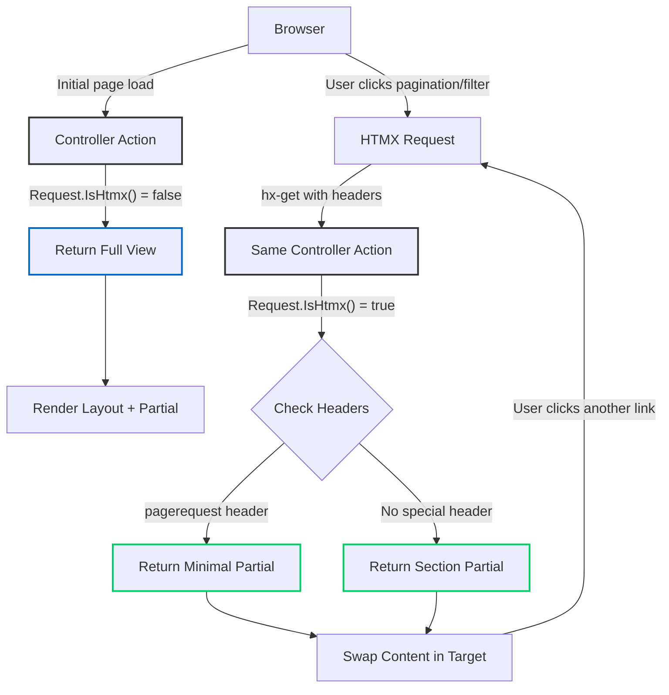

# HTMX with ASP.NET Core Partials: The Server-Side Renaissance

<datetime class="hidden">2025-01-27T12:00</datetime>
<!--category-- HTMX, ASP.NET Core, Web Development, HTMX.NET -->

## Introduction

Whilst the JavaScript world has been busy inventing yet another framework every fortnight, ASP.NET Core developers have been quietly building robust server-side applications with partial views. Now, with HTMX, we can add dynamic, SPA-like interactions without drowning in JavaScript complexity. It's rather like having your cake and eating it too.

In this article, I'll show you how HTMX integrates beautifully with ASP.NET Core partials, how the excellent **HTMX.NET** library makes it even better, and how my [mostlylucid.pagingtaghelper](https://github.com/scottgal/mostlylucid.pagingtaghelper) NuGet package provides powerful pagination with zero configuration.

As a cheeky aside: Django only got proper partial template rendering in version 6.0 (released December 2024), whilst ASP.NET Core has had partial views since day one. Sometimes the old dogs know a few tricks!

[TOC]

## What is HTMX?

HTMX is a library that lets you access modern browser features directly from HTML, rather than writing JavaScript. It extends HTML with attributes that allow you to make AJAX requests, swap content, and create rich interactions - all without leaving your markup.

The key attributes you'll use most often:

- `hx-get`, `hx-post`, `hx-put`, `hx-delete` - Make HTTP requests
- `hx-target` - Specify where to put the response
- `hx-swap` - Control how content is swapped (innerHTML, outerHTML, etc.)
- `hx-trigger` - Define what triggers the request (click, change, load, etc.)
- `hx-push-url` - Update the browser URL without a full page reload

Here's the beauty of it: you're still writing server-side code, returning server-rendered HTML. No JSON APIs, no client-side templates, no build pipelines. Just good old-fashioned HTML over the wire.

## Setting Up HTMX in ASP.NET Core

First, include HTMX in your layout. You can use a CDN or serve it locally:

```html
<script src="https://unpkg.com/htmx.org@2.0.0"></script>
```

That's it. No build step, no npm install, no webpack configuration. Just drop in a script tag and you're off to the races.

## Alpine.js: The Client-Side Component

For client-side reactivity (showing/hiding elements, toggling states, local UI state), [Alpine.js](https://alpinejs.dev/) complements HTMX perfectly. At just 15KB gzipped, it provides Vue/React-like declarative reactivity without the bloat.

```html
<script defer src="https://cdn.jsdelivr.net/npm/alpinejs@3.x.x/dist/cdn.min.js"></script>
```

Here's how they work together:

```razor
<div x-data="{ open: false }">
    <button x-on:click="open = !open">Toggle</button>
    <div x-show="open" x-transition>
        <button hx-get="/api/data" hx-target="#results">Load Data</button>
    </div>
</div>
```

Alpine handles local UI (the toggle), HTMX handles server calls (the data fetch). Throughout this article, you'll see this pattern - Alpine for client reactivity, HTMX for server interactions.

## The HTMX.NET Library

[Khalid Abuhakmeh](https://khalidabuhakmeh.com/about)'s [HTMX.NET](https://github.com/khalidabuhakmeh/Htmx.Net) library provides first-class ASP.NET Core integration. Available as `Htmx` and `Htmx.TagHelpers` NuGet packages, it feels native to .NET and makes working with HTMX an absolute pleasure. You'll find more of Khalid's excellent open-source work on his [GitHub](https://github.com/khalidabuhakmeh).

### Installation

```bash
dotnet add package Htmx
dotnet add package Htmx.TagHelpers
```

In your `_ViewImports.cshtml`:

```razor
@addTagHelper *, Htmx.TagHelpers
```

### The IsHtmx() Extension Method

The most useful feature is the `Request.IsHtmx()` extension method, which tells you whether the request came from HTMX. This lets you return either a full view or just a partial:

```csharp
[HttpGet]
public async Task<IActionResult> Index(int page = 1, int pageSize = 20)
{
    var posts = await blogViewService.GetPagedPosts(page, pageSize);

    if (Request.IsHtmx())
        return PartialView("_BlogSummaryList", posts);

    return View("Index", posts);
}
```

This pattern is absolutely brilliant. A single controller action serves both:
- Full page loads (when users navigate directly or refresh)
- Partial updates (when HTMX makes the request)

No separate API endpoints, no duplicated logic, no JSON serialisation overhead.

### HTMX.NET Tag Helpers

HTMX.NET provides tag helpers that make working with controllers cleaner. Instead of writing route strings, you can use strongly-typed references:

```razor
<button
    hx-controller="Comment"
    hx-action="GetCommentForm"
    hx-post
    hx-target="#commentform">
    Reply
</button>
```

This generates the correct route using ASP.NET Core's routing system. If you rename your controller or action, your IDE will catch it. Much better than magic strings!

Here's a real example from this blog's comment system:

```razor
<button
    class="btn btn-outline btn-sm mb-4"
    hx-action="Comment"
    hx-controller="Comment"
    hx-post
    hx-vals
    x-on:click.prevent="window.mostlylucid.comments.setValues($event)"
    hx-on="htmx:afterSwap: window.scrollTo({top: 0, behavior: 'smooth'})"
    hx-swap="outerHTML"
    hx-target="#commentform">
    Comment
</button>
```

Notice how HTMX plays nicely with Alpine.js (`x-on:click.prevent`) for those occasional bits of client-side interactivity.

### Other HTMX.NET Helpers

The library also provides:

- `Request.IsHtmxNonBoosted()` - Check if it's an HTMX request but not boosted
- `Request.IsHtmxRefresh()` - Check if it's a history restore request
- Response helpers for HTMX headers (triggers, redirects, etc.)

## Real-World Example: Search with Partials

Here's the search controller from this blog, showing the three-tier return pattern:

```csharp
[HttpGet]
[OutputCache(Duration = 3600, VaryByHeaderNames = new[] { "hx-request", "pagerequest" })]
public async Task<IActionResult> Search(
    string? query,
    int page = 1,
    int pageSize = 10,
    [FromHeader] bool pagerequest = false)
{
    var searchModel = await BuildSearchModel(query, page, pageSize);

    if (pagerequest && Request.IsHtmx())
        return PartialView("_SearchResultsPartial", searchModel.SearchResults);

    if (Request.IsHtmx())
        return PartialView("SearchResults", searchModel);

    return View("SearchResults", searchModel);
}
```

Three return paths for three scenarios:
1. Pagination requests - minimal partial (just the results list)
2. Filter changes - section partial (results with filters)
3. Direct navigation - full page (layout + everything)

The partial view (`_SearchResultsPartial.cshtml`) uses the paging tag helper:

```razor
@model Mostlylucid.Models.Blog.PostListViewModel
<div class="pt-2" id="content">
    @if (Model.Data?.Any() is true)
    {
        <div class="inline-flex w-full items-center justify-center pb-4">
            @if (Model.TotalItems > Model.PageSize)
            {
                <pager
                    x-ref="pager"
                    link-url="@Model.LinkUrl"
                    hx-boost="true"
                    hx-target="#content"
                    hx-swap="show:none"
                    page="@Model.Page"
                    page-size="@Model.PageSize"
                    total-items="@Model.TotalItems"
                    hx-headers='{"pagerequest": "true"}'>
                </pager>
            }
        </div>
        @foreach (var post in Model.Data)
        {
            <partial name="_ListPost" model="post"/>
        }
    }
</div>
```

Breaking down the pager tag helper:
- `hx-boost="true"` - Intercepts links, converts to AJAX
- `hx-target="#content"` - Where to inject the response
- `hx-headers='{"pagerequest": "true"}'` - Custom header tells the controller it's pagination
- The controller checks `Request.IsHtmx() && pagerequest` to return just the minimal partial

## The mostlylucid.pagingtaghelper Package

I wrote [mostlylucid.pagingtaghelper](https://github.com/scottgal/mostlylucid.pagingtaghelper) to avoid repetitive pagination code. It's HTMX-first but works without JavaScript too.

### Installation

```bash
dotnet add package mostlylucid.pagingtaghelper
```

Add to `_ViewImports.cshtml`:
```razor
@addTagHelper *, mostlylucid.pagingtaghelper
```

### Key Features

Implement `IPagingModel<T>` and you're done:

```csharp
public class BasePagingModel<T> : IPagingModel<T> where T : class
{
    public int Page { get; set; }
    public int TotalItems { get; set; }
    public int PageSize { get; set; }
    public string LinkUrl { get; set; }
    public List<T> Data { get; set; }
}
```

**What you get:**
- Zero configuration required
- Multiple UI frameworks (TailwindCSS + DaisyUI, Bootstrap 5, custom views)
- Dark mode support
- 8 languages built-in
- Sortable headers, page size selectors
- Progressive enhancement (works without JavaScript)
- Continuation token support for NoSQL databases

The tag helper generates links that preserve query strings, support custom headers, and integrate seamlessly with HTMX (see the example above).

## HTMX Flow Diagram

Here's how the whole system fits together:



## Comparing to Other Frameworks

### Django's Late Arrival to Partials

It's worth noting that Django only added proper partial template rendering in version 6.0 (December 2024) with the introduction of template fragments. Before that, Django developers had to either:
- Return entire templates (wasteful)
- Use inclusion tags (clunky)
- Install third-party packages like django-render-block

Meanwhile, ASP.NET Core has had `PartialView()` since version 1.0 in 2016. We've been doing this dance for nearly a decade!

### Rails Turbo Frames

Ruby on Rails has Turbo Frames (part of Hotwire), which is similar in spirit:

```erb
<%= turbo_frame_tag "posts" do %>
  <%= render @posts %>
<% end %>
```

The difference is that Turbo requires specific frame markers on both request and response. HTMX is more flexible - any endpoint can return any HTML, and you decide where it goes with `hx-target`.

### Phoenix LiveView

Elixir's Phoenix LiveView takes a different approach with persistent WebSocket connections and server-side state:

```elixir
def handle_event("load_more", _params, socket) do
  {:noreply, assign(socket, posts: load_more_posts())}
end
```

LiveView is brilliant for real-time applications, but it requires WebSocket infrastructure and server memory for connections. HTMX uses plain old HTTP - stateless, cacheable, scaleable. For a blog, that's perfect.

## Performance Considerations

**Output Caching**: The `OutputCache` attribute varies by `hx-request` header, caching full pages and partials separately:

```csharp
[OutputCache(Duration = 3600, VaryByHeaderNames = new[] { "hx-request", "pagerequest" })]
```

**Network Efficiency**: Server-rendered HTML is often smaller than JSON + client-side templates, requires fewer round trips, and caches properly.

**Bundle Size**: HTMX (14KB) + optional Alpine.js (15KB) + paging tag helper (0KB, server-side) = under 30KB total. Compare that to a typical React app (200KB+).

## Advanced Patterns

**Optimistic UI Updates** - Combine HTMX and Alpine for instant feedback:

```razor
<div x-data="{ count: @Model.CommentCount }">
    <button hx-post="/comment/like" x-on:click="count++" hx-on::after-request="count = $event.detail.xhr.response">
        Likes: <span x-text="count"></span>
    </button>
</div>
```

The count updates immediately (optimistic), then syncs with the server response.

**Out-of-Band Swaps** - Update multiple page sections from one response:

```razor
<div id="main-content"><!-- Main response --></div>
<div id="notification-count" hx-swap-oob="true"><span>5 new</span></div>
```

Perfect for notification badges, cart counts, etc.

## Common Gotchas

### CSRF Tokens

ASP.NET Core's antiforgery tokens work differently with AJAX. You need to configure HTMX to send the token:

```javascript
document.addEventListener('htmx:configRequest', (event) => {
    event.detail.headers['X-CSRF-TOKEN'] =
        document.querySelector('[name="__RequestVerificationToken"]').value;
});
```

### Alpine.js @ Shorthand in Razor

Alpine.js has a shorthand syntax using `@` (e.g., `@click` instead of `x-on:click`), but this conflicts with Razor's `@` syntax. You have three options:

**Option 1: Use explicit syntax (recommended)**
```razor
<button x-on:click="doSomething()">Click me</button>
```

**Option 2: Escape with @@**
```razor
<button @@click="doSomething()">Click me</button>
```

**Option 3: Use x-bind for attributes**
```razor
<div x-bind:class="isOpen ? 'block' : 'hidden'"></div>
```

I prefer the explicit `x-on:click` syntax as it's clearer and avoids any confusion with Razor syntax.

### History Management

By default, HTMX pushes every request to history. For pagination, you might want:

```razor
<paging
    model="@Model"
    hx-push-url="false">  <!-- Don't pollute history -->
</paging>
```

Or use `hx-replace-url="true"` to update the URL without adding history entries.

### Debugging

Install the HTMX devtools browser extension. It shows you every request, response, and swap in real-time. Absolutely invaluable.

## Conclusion

HTMX with ASP.NET Core partials represents a return to server-side simplicity without sacrificing modern UX. You get:

- Dynamic, SPA-like interactions
- Server-side rendering (great for SEO)
- Proper HTTP caching
- Minimal JavaScript
- Progressive enhancement
- Type-safe routing with HTMX.NET
- Zero-config pagination with mostlylucid.pagingtaghelper

Whilst the JavaScript world continues its framework-of-the-week cycle, we can build robust, performant web applications using patterns that have worked for decades. Sometimes the old ways are the best ways - they've just been waiting for the right tool to make them shine again.

And as for Django finally getting partials in 2024? Well, better late than never!

## Related Articles on This Blog

If you found this article useful, you might also enjoy these other HTMX-related articles from this blog:

- [Adding Paging with HTMX](/blog/addpagingwithhtmx) - The original article on implementing pagination with the older PaginationTagHelper
- [ASP.NET Core Caching with HTMX](/blog/aspnetcachingwithhtmx) - Deep dive into caching strategies for HTMX requests
- [A Whistle-stop Tour of HTMX Extensions](/blog/htmxandaspnetcore) - Comprehensive guide to HTMX events and lifecycle
- [Auto-refresh with Alpine and HTMX](/blog/autorefreshwithalpineandhtmx) - Combining Alpine.js with HTMX for reactive components

## Further Reading

**Official Documentation:**
- [HTMX Documentation](https://htmx.org/docs/) - The official HTMX documentation
- [HTMX Examples](https://htmx.org/examples/) - Practical examples of HTMX patterns
- [HTMX Extensions](https://htmx.org/extensions/) - Official HTMX extensions
- [Alpine.js Documentation](https://alpinejs.dev/) - Official Alpine.js docs
- [Alpine.js Examples](https://alpinejs.dev/examples) - Practical Alpine.js patterns
- [ASP.NET Core Partial Views](https://learn.microsoft.com/en-us/aspnet/core/mvc/views/partial) - Microsoft's guide to partial views
- [ASP.NET Core Output Caching](https://learn.microsoft.com/en-us/aspnet/core/performance/caching/output) - Official caching documentation

**Libraries & Tools:**
- [HTMX.NET GitHub](https://github.com/khalidabuhakmeh/Htmx.Net) - The HTMX.NET library source code
- [HTMX.NET NuGet](https://www.nuget.org/packages/Htmx/) - HTMX.NET on NuGet
- [Htmx.TagHelpers NuGet](https://www.nuget.org/packages/Htmx.TagHelpers/) - HTMX Tag Helpers on NuGet
- [Khalid Abuhakmeh's Website](https://khalidabuhakmeh.com/) - Creator of HTMX.NET, with excellent blog posts
- [Khalid Abuhakmeh's GitHub](https://github.com/khalidabuhakmeh) - More brilliant open-source .NET projects
- [mostlylucid.pagingtaghelper GitHub](https://github.com/scottgal/mostlylucid.pagingtaghelper) - My paging tag helper source code
- [mostlylucid.pagingtaghelper NuGet](https://www.nuget.org/packages/mostlylucid.pagingtaghelper/) - The package on NuGet

**Community Resources:**
- [HTMX Discord](https://htmx.org/discord) - Active community support
- [HTMX Essays](https://htmx.org/essays/) - Thoughtful articles on HTMX philosophy
- [Hypermedia Systems Book](https://hypermedia.systems/) - Free online book about building hypermedia applications
