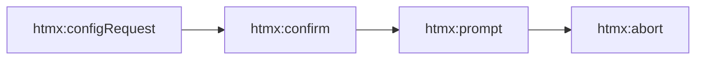
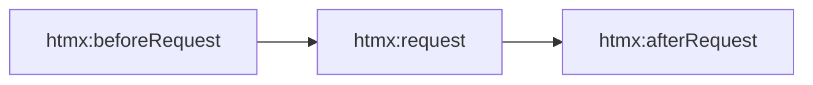
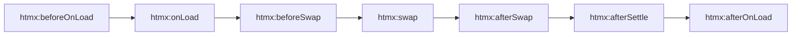
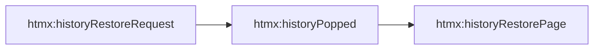

# A Whistle-stop Tour of HTMX Extensions and Using HTMX with ASP.NET Core
<datetime class="hidden">2025-05-02T20:30</datetime>
<!--category-- Javascript, HTMX, ASP.NET Core -->

# Introduction
HTMX is a powerful JavaScript library that allows you to create dynamic web applications with minimal JavaScript. It enables you to make AJAX requests, swap HTML content, and handle events directly in your HTML attributes. I've been using HTMX for about two years at this point and with each project I learn more and more about its capabilities; and more importantly it's limitations.

However I still don't claim to have expert knowledge of it. I just wanted to share some of the things I've learned along the way.

[TOC]

# Events

## Request Preparation
The request preparation phase is where HTMX configures the request before it is sent to the server. This includes setting headers, adding parameters, and handling user input. The following events are triggered during this phase:



## Request Lifecycle
The request lifecycle phase is where HTMX sends the request to the server and handles the response. The following events are triggered during this phase:



## Response Handling
The response handling phase is where HTMX processes the response from the server and updates the DOM. The following events are triggered during this phase:



## History Management

The history management phase is where HTMX updates the browser history and URL. The following events are triggered during this phase:




As you can see HTMX provides a number of events that you can hook into to modify the request or response, or even history; HTMX does a LOT for being such a compact system . Using each of these you can modify how HTMX interacts with the server / the client in pretty comprehensive ways.

# Extensions
One of the most powerful aspects of HTMX is the ability to [create extensions](https://v2-0v2-0.htmx.org/extensions/) to extend its capabilities.  In my case, I typically hook into `htmx:configRequest` to add additional parameters to the request.  This is useful when you want to pass additional data to the server without having to modify the HTML or JavaScript code.

Other extensions might hook `htmx:beforeRequest` to modify the request before it is sent; but **after** most other extensions which hook `configRequest`; as in `beforeRequest` stuff like `HX-Vals` and `HX-Include`s are already attached to the reuest (either in the payload \ querystring).
You can even hook `htmx:afterSwap` to perform actions after the content has been swapped. Combined with client side templating libraries like [Alpine.js](https://alpinejs.dev/) or [Lit](https://lit.dev/) you can create powerful dynamic applications with minimal code.

HTMX provides some built-in extensions like `hx-boost` and `hx-swap-oob` which allow you to enhance the functionality of HTMX without writing any custom code. However, there are times when you need to create your own extensions to meet specific requirements.

For example, you might want to add custom headers to your requests, modify the request payload, or handle specific events in a unique way. 

To achieve this HTMX provides you some handy integration points:

```javascript

{
  /**
   * init(api)
   * Called once when the extension is initialized.
   * Use it to set up internal state, store references, or access HTMX utility functions via the api parameter.
   */
  init: function(api) {
    return null;
  },

  /**
   * getSelectors()
   * Returns additional CSS selectors that HTMX should monitor.
   * Useful if your extension needs to handle custom elements or dynamic behavior.
   */
  getSelectors: function() {
    return null;
  },

  /**
   * onEvent(name, evt)
   * Called on every HTMX event (e.g., htmx:beforeRequest, htmx:afterSwap).
   * Return false to cancel the event or stop propagation.
   */
  onEvent: function(name, evt) {
    return true;
  },

  /**
   * transformResponse(text, xhr, elt)
   * Modify the raw response text before it is parsed and swapped into the DOM.
   * Use this to sanitize or preprocess HTML.
   */
  transformResponse: function(text, xhr, elt) {
    return text;
  },

  /**
   * isInlineSwap(swapStyle)
   * Return true if your extension will handle this swap style manually.
   * This tells HTMX to skip default behavior.
   */
  isInlineSwap: function(swapStyle) {
    return false;
  },

  /**
   * handleSwap(swapStyle, target, fragment, settleInfo)
   * Perform custom DOM manipulation if you implement a custom swap style.
   * Return true to prevent HTMX's default swap.
   */
  handleSwap: function(swapStyle, target, fragment, settleInfo) {
    return false;
  },

  /**
   * encodeParameters(xhr, parameters, elt)
   * Modify or serialize request parameters before sending.
   * Return null to use default URL/form encoding.
   * Return a string to override with a custom payload (e.g., JSON).
   */
  encodeParameters: function(xhr, parameters, elt) {
    return null;
  }
}
```

HTMX provides a number of pre-built extensions you can [read about here](https://htmx.org/extensions/). 

For instance a handy [built-in extension](https://github.com/bigskysoftware/htmx-extensions/blob/main/src/json-enc/README.md) `json-encode` allows you to send JSON data in the request body instead of URL-encoded form data. This is useful when you want to send complex data structures or arrays to the server.
You can see that this hooks into 3 events 

- `init` - to set up the extension and store a reference to the HTMX API
- `onEvent` - to set the `Content-Type` header to `application/json` when the request is being configured
- `encodeParameters` - to override the default URL-encoded form encoding and serialize the parameters as JSON. It also returns a string to prevent HTMX from using the default URL-encoded form encoding.

```javascript
(function() {
  let api
  htmx.defineExtension('json-enc', {
    init: function(apiRef) {
      api = apiRef
    },

    onEvent: function(name, evt) {
      if (name === 'htmx:configRequest') {
        evt.detail.headers['Content-Type'] = 'application/json'
      }
    },

    encodeParameters: function(xhr, parameters, elt) {
      xhr.overrideMimeType('text/json')

      const object = {}
      parameters.forEach(function(value, key) {
        if (Object.hasOwn(object, key)) {
          if (!Array.isArray(object[key])) {
            object[key] = [object[key]]
          }
          object[key].push(value)
        } else {
          object[key] = value
        }
      })

      const vals = api.getExpressionVars(elt)
      Object.keys(object).forEach(function(key) {
        // FormData encodes values as strings, restore hx-vals/hx-vars with their initial types
        object[key] = Object.hasOwn(vals, key) ? vals[key] : object[key]
      })

      return (JSON.stringify(object))
    }
  })
})()
```
Or even the simpler but EVEN MORE HANDY `hx-debug` extension which adds a `HX-Debug` header to the request. This is useful for debugging and logging purposes, as it allows you to see the raw request and response data in the dev console.

```javascript
(function() {
  htmx.defineExtension('debug', {
    onEvent: function(name, evt) {
      if (console.debug) {
        console.debug(name, evt)
      } else if (console) {
        console.log('DEBUG:', name, evt)
      } else {
        throw new Error('NO CONSOLE SUPPORTED')
      }
    }
  })
})()

```

There's many more; including a very powerful [client side templating extension](https://github.com/bigskysoftware/htmx-extensions/tree/main/src/client-side-templates) which allows you to use client-side templating libraries to transform returned JSON data into HTML. This is useful for creating dynamic UIs without having to rely on server-side rendering.

# Some Custom Extensions

## Dynamic Row IDs
For instance in a recent project I used HTMX OOB swaps to update a number of rows in a table. 
To do this I wanted to know which rows were currently being displayed in the table, so I only updated the rows which were visible.

### The extension


```javascript
export default {
    encodeParameters: function (xhr, parameters, elt) {
        const ext = elt.getAttribute('hx-ext') || '';
        if (!ext.split(',').map(e => e.trim()).includes('dynamic-rowids')) {
            return null; // Use default behavior
        }

        const id = elt.dataset.id;
        const approve = elt.dataset.approve === 'true';
        const minimal = elt.dataset.minimal === 'true';
        const single = elt.dataset.single === 'true';

        const target = elt.dataset.target;
        const payload = { id, approve, minimal, single };

        if (approve && target) {
            const table = document.querySelector(target);
            if (table) {
                const rowIds = Array.from(table.querySelectorAll('tr[id^="row-"]'))
                    .map(row => row.id.replace('row-', ''));
                payload.rowIds = rowIds;
            }
        }

        // Merge payload into the parameters object
        Object.assign(parameters, payload);
        return null; // Return null to continue with default URL-encoded form encoding
    }
}
```
### Using it

To use it we need to add the extension to our HTMX configuration. 
So in your entry point js file (assuming you're using modules; yoy should be) you can do something like this:

```javascript
import dynamicRowIds from "./dynamicRowIds"; // Load the file

htmx.defineExtension("dynamic-rowids", dynamicRowIds); // Register the extension
```
Then on whatever element you want to use it on you can add the `hx-ext` attribute with the value `dynamic-rowids`.

```html
                <button
                    hx-ext="dynamic-rowids"
                    data-target="#my-table"
                    data-id="@Model.Id"
                    data-param1="true"
                    data-param2="false"
                    data-param3="@Model.Whatever"
                    hx-post
                    hx-controller="Contoller"
                    hx-action="Action"
                >
                    <i class='bx bx-check text-xl text-white'></i>
                </button>

```

## Preserve Params
This is another simple HTMX extension, this time hooked into `htmx:configRequest` as we're modifying the URL before the request is sent. This extension is handy if you're using querystring based filtering etc. and you want some requests to preserve existing filters while others to not (e.g, 'name' and 'startdate' but not 'page' or 'sort').

This is SIMILAR to but not exactly the same as the existing HTMX extension [push-params](https://github.com/bigskysoftware/htmx-extensions/blob/main/src/path-params/README.md)

### The extension
You can see that we hook `onEvent` to listen for the `htmx:configRequest` event.

Then we:
- Get the element that triggered the event
- Get the `preserve-params-exclude` attribute from the element (if it exists) and split it into an array of keys to exclude (so we don't add them to the request)
- Get the current URL parameters from the window location
- Get the new parameters from the request URL
- Loop through the current parameters and check if they are not in the exclude list and not already in the new parameters
- If they are not, we add them to the new parameters
- Finally, we set the new parameters to the request URL and return true to continue with the request.

```javascript
export default {
    onEvent: function (name, evt) {
        if (name !== 'htmx:configRequest') return;
        const el = evt.detail.elt;
        const excludeStr = el.getAttribute('preserve-params-exclude') || '';
        const exclude = excludeStr.split(',').map(s => s.trim());

        const currentParams = new URLSearchParams(window.location.search);
        const newParams = new URLSearchParams(evt.detail.path.split('?')[1] || '');

        currentParams.forEach((value, key) => {
            if (!exclude.includes(key) && !newParams.has(key)) {
                newParams.set(key, value);
            }
        });

        evt.detail.path = evt.detail.path.split('?')[0] + '?' + newParams.toString();

        return true;
    }
};
```

Here I use the essential [HTMX.Net](https://github.com/khalidabuhakmeh/Htmx.Net/tree/main) for its tag helpers.  The likes of `hx-controller` and `hx-action` are tag helpers that generate the correct HTMX attributes for you. As well as `hx-route-<x>` for values to pass in the route.   This is really useful as it allows you to use C# code to generate the correct values for the attributes instead of having to hardcode them in your HTML.

### Using it

Being an extension it's really simple to use:

First we need to add the extension to our HTMX configuration.

```javascript

import preserveParams from './preserveParams.js';
htmx.defineExtension('preserve-params', preserveParams);
```
NOTE: You'll notice that the default HTMX extensions use the 'autoload' method to load the extension.

```javascript
// Autoloading the extension and registering it
(function() {
  htmx.defineExtension('debug', {
}
```

This is a good way to do it if you're using HTMX in a non-module environment. However, if you're using modules (which you should be) it's better to use the `import` statement to load the extension then explicitly register it against your `htmx` instance. This allows you to take advantage of tree-shaking and only load the extensions you need.

Then on your element you can add the `hx-ext` attribute with the value `preserve-params` and the `preserve-params-exclude` attribute with a comma separated list of parameters to exclude from the request.


```html

<a class="btn-outline-icon"
   hx-controller="MyController"
   hx-action="MyAction"
   hx-route-myparam="@MyParam"
   hx-push-url="true"
   hx-ext="preserve-params"
   preserve-params-exclude="page,sort"
   hx-target="#page-content"
   hx-swap="innerHTML show:top"
   hx-indicator>
    <i class="bx bx-search"></i>
</a>
```
In this case due to the `event.detail.path` having the new `myparam` value set it in it'll replace that one with our new value but preserve all others (except `page` and `sort`). So we can keep passing any filters we have set in the URL to the server without having to worry about them being lost when we make a new request.


# ASP.NET Core

One of the neat things about HTMX is that much of its interaction with the server happens through HTTP headers. These headers provide the server with rich context about what triggered the request, allowing you to respond appropriately from your ASP.NET Core endpoints or Razor views.

Again a key component of this is the [HTMX.Net](https://github.com/khalidabuhakmeh/Htmx.Net/tree/main). Among many of the items it provides are neat `Request` extensions to detect HTMX requests. This is useful for determining if a request was made by HTMX or not, and to handle it accordingly.


It also has its own mechanism to send triggers

```csharp

Response.Htmx(h => {
    h.WithTrigger("yes")
     .WithTrigger("cool", timing: HtmxTriggerTiming.AfterSettle)
     .WithTrigger("neat", new { valueForFrontEnd= 42, status= "Done!" }, timing: HtmxTriggerTiming.AfterSwap);
});
```
Push Urls etc...etc...
 Khalid did a great job of creating a set of extensions to make it easy to work with HTMX in ASP.NET Core.

It's a key tool in my toolbox when working with HTMX and ASP.NET Core. [**Check it out!**](https://github.com/khalidabuhakmeh/Htmx.Net/tree/main)

##  Common HTMX Request Headers
Here’s a breakdown of the most useful headers HTMX sends with every request:

| Header	                    | Description                                                                                                      |
|----------------------------|------------------------------------------------------------------------------------------------------------------|
| HX-Request                 | 	Always set to true for any HTMX-initiated request. Great for detecting HTMX calls in middleware or controllers. |
| HX-Target	                 | The id of the target element in the DOM that the response will be swapped into.                                  |
| HX-Trigger                 | The id of the element that triggered the request (e.g. a button).                                                |
| HX-Trigger-Name            | The name of the triggering element (useful for forms).                                                           |
| HX-Prompt	                 | Contains user input from hx-prompt.                                                                              |
| HX-Current-URL             | The browser URL when the request was initiated. Useful for logging and context.                                  |
| HX-History-Restore-Request | Sent as true if the request is part of a history restoration after navigation (e.g., back button).               |

## Request Extensions

I use these pretty extensively in my ASP.NET Core apps. Combined with the HTMX.Net ones like `Request.IsHtmx()` , `Request.IsHtmxBoosted()` and `Request.IsHtmxNonBoosted()` you can easily detect HTMX requests and respond accordingly.

For instance, I have a really simple extension to Request which lets me detect if a request is targeting my main `#page-content` div. If it IS then I know I should send back a partial. 
NOTE: Many don't realise you can specify a 'full page' as a partial, it then just skips the layout. 

```csharp
        if (Request.PageContentTarget())
        {   
            Response.PushUrl(Request);
            return PartialView("List", vm);
        }
        return View("List", vm);
        
        public static class RequestExtensions
{
        
        public static bool PageContentTarget(this HttpRequest request)
    {
        bool isPageContentTarget = request.Headers.TryGetValue("hx-target", out var pageContentHeader) 
                                   && pageContentHeader == "page-content";
        
        return isPageContentTarget;
    }
    }

```


## Response Extensions

In addition to Request extensions, you can also create Response extensions to send events back to the client. This is useful for triggering client side events.

### SweetAlert Example
For instance [in my SweetAlert2 integration](https://www.mostlylucid.net/blog/usingsweetalertforhxindicators) I enable closing the dialog using a trigger which is set from the server.

```javascript
    document.body.addEventListener('sweetalert:close', closeSweetAlertLoader);

```

This is triggered from the server as an HTMX trigger event. 

```csharp

    public static void CloseSweetAlert(this HttpResponse response)
    {
        response.Headers.Append("HX-Trigger" , JsonSerializer.Serialize(new
        {
            sweetalert = "close"
        }));

    }
```

This will trigger the `sweetalert:close` event on the client side, allowing you to close the dialog. You can also pass data back to the client using the `HX-Trigger` header. This is useful for passing data from the server to the client without having to modify the HTML or JavaScript code.

As you see it's dead easy to listen for these events by just adding an event listener to the body. I use JSON mainly as it always encodes properly. 

### ShowToast
I wrote about my toast method previously [here](https://www.mostlylucid.net/blog/showingtoastandswappingwithhtmx), but it's worth mentioning here as well. To very simply enabling the server to trigger a toast notification on the client side. I set the trigger in this Response extension.

```csharp
    public static void ShowToast(this HttpResponse response, string message, bool success = true)
    {
        response.Headers.Append("HX-Trigger", JsonSerializer.Serialize(new
        {
            showToast = new
            {
                toast = message,
                issuccess =success
            }
        }));

    }
```

I then hook into the event client side and call my `showToast` function.

```javascript
import { showToast, showHTMXToast } from './toast';

window.showHTMXToast = showHTMXToast;

document.body.addEventListener("showToast", showHTMXToast);
```

This then calls into my    `showToast` function and well, shows a toast; again see more about it [in the article ](https://www.mostlylucid.net/blog/showingtoastandswappingwithhtmx).

```javascript


export function showHTMXToast(event) {
    const xhr = event?.detail?.xhr;
    let type = 'success';
    let message = xhr?.responseText || 'Done!';

    try {
        const data = xhr ? JSON.parse(xhr.responseText) : event.detail;

        if (data.toast) message = data.toast;
        if ('issuccess' in data) {
            type = data.issuccess === false ? 'error' : 'success';
        } else if (xhr?.status >= 400) {
            type = 'error';
        } else if (xhr?.status >= 300) {
            type = 'warning';
        }

    } catch {
        if (xhr?.status >= 400) type = 'error';
        else if (xhr?.status >= 300) type = 'warning';
    }

    showToast(message, 3000, type);
}
```

## In Conclusion
Well that's it, a whirlwind tour of HTMX and ASP.NET Core. I hope you found it useful and informative. If you have any questions or comments please feel free to comment below. 