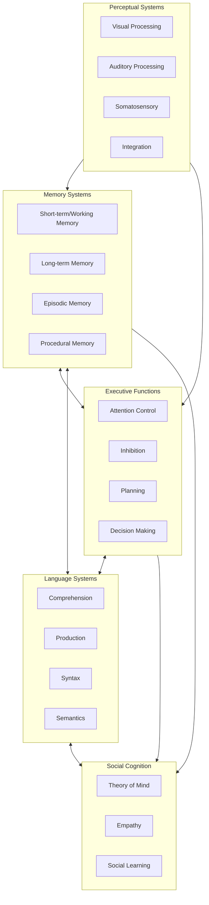
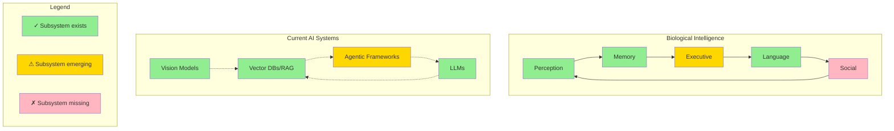
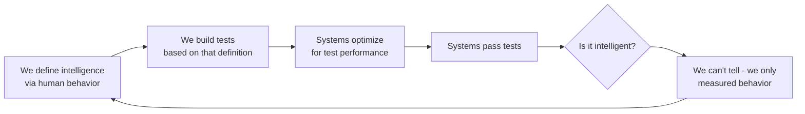

# We Don't Know What Intelligence Is (And That's Why AGI Claims Are Bollocks)

<!--category-- AI, Opinion, Psychology, Intelligence -->
<datetime class="hidden">2025-12-02T14:30</datetime>

## Introduction

Here's an uncomfortable truth that nobody in the AI hype machine wants to discuss: **We still don't know what intelligence actually is.**

Not in humans. Not in animals. And certainly not in machines.

This isn't just academic hairsplitting. It's the foundational problem that makes all the breathless "AGI in 12 months!" predictions absurd. We're trying to build artificial general intelligence when we can't even define what general intelligence means.

Worse, we're making the exact same mistake that torpedoed early psychology: **confusing behaviour with the thing producing the behaviour.**

This is the behaviourist fallacy, and it's why a parrot that can say "Polly wants a cracker" isn't demonstrating language comprehension, a thermostat that maintains temperature isn't "trying" to keep you warm, and a transformer that passes the bar exam isn't thinking.

[TOC]

## The Behaviourist Mistake (That We're Repeating)

In the early 20th century, psychology went through its behaviourist phase. Researchers like Watson and Skinner argued that psychology should only study observable behaviour, not internal mental states. If you can't measure it objectively, it doesn't matter.

This led to some genuinely useful insights about learning and conditioning. It also led to some spectacular failures in understanding animal cognition.

### The Classic Example: Clever Hans

There's a famous case from 1907 of a horse named Clever Hans who could apparently do arithmetic. Ask Hans what 2+3 was, and he'd tap his hoof five times. Incredible! A mathematical horse!

Except Hans couldn't do maths at all. He was reading tiny, unconscious cues from his questioner - a slight change in posture or breathing when he reached the correct number of taps. Remove the questioner's ability to give these cues (by having them not know the answer), and Hans couldn't solve even basic problems.

**The behaviour (tapping the correct number) existed. The underlying capability (mathematical reasoning) did not.**

This is the behaviourist trap: behaviour is the **output** of a system, not the system itself.

### Modern Psychology Moved On (AI Hasn't)

Modern cognitive psychology, neuroscience, and comparative psychology understand that behaviour is just the observable tip of a vastly complex iceberg. The interesting stuff - the actual cognition - is happening inside, in ways we're still trying to understand.

We learned this the hard way with animals. For decades, behaviourists insisted that animals were simple stimulus-response machines. Then we started actually studying animal cognition properly:

- **Crows** use tools, solve multi-step problems, and hold grudges for years
- **Octopuses** have distributed intelligence across their arms (each arm has its own "brain")
- **Elephants** recognise themselves in mirrors and mourn their dead
- **Dolphins** have individual names (signature whistles) and cultural transmission of knowledge

None of this is simple stimulus-response. These are complex cognitive systems with internal models, memory, planning, and problem-solving capabilities.

But here's the kicker: **we still don't fully understand how any of this works.** We can observe the behaviour. We can make educated guesses about the cognitive architecture. But the actual mechanisms of animal intelligence remain largely mysterious.

## Intelligence: A Collection of Subsystems

Here's what we do know from neuroscience and cognitive psychology: intelligence isn't a single thing. It's not one capability that you either have or don't have.

**Intelligence is a collection of interacting subsystems, each specialised for different tasks.**

In humans, this includes (at minimum):

Each of these subsystems has its own architecture, its own failure modes, and its own development trajectory. They interact in complex ways we're still mapping out.

### When Subsystems Break

The modularity of intelligence becomes obvious when individual subsystems fail:

**Aphasia**: Language comprehension or production breaks, but reasoning remains intact. You can think clearly but can't speak, or can speak but can't understand.

**Prosopagnosia**: Face recognition fails. You can recognise objects, read emotions, navigate spaces - but can't recognise faces, even your own family members.

**Anterograde Amnesia**: New long-term memory formation stops. You can remember everything up to the injury, your skills work fine, but you can't form new episodic memories.

**Executive Dysfunction**: Planning and inhibition fail. Intelligence and memory intact, but you can't organise tasks or stop impulsive behaviour.

Each of these demonstrates that intelligence isn't one thing. It's many systems working together, and when one breaks, the others keep functioning.

## The Subsystems We're Actually Building

Here's where things get interesting, and where the AGI hype gets its fuel.

**We ARE building subsystems.** Not all the subsystems needed for intelligence, but genuine cognitive subsystems that map (roughly) to neuroanatomical ones.

Let's be honest about what we've achieved:

**Perception**: Vision models (CLIP, SAM) process visual information; audio systems (Whisper) handle speech. Multimodal models (GPT-4V) combine these streams. Functionally similar to perceptual systems, different mechanisms.

**Memory**: Vector databases provide semantic memory storage and retrieval. RAG systems fetch relevant information to inform responses. Context windows (100k+ tokens) function like working memory.

**Language**: LLMs process comprehension, production, syntax, and semantics - producing outputs functionally similar to human language processing, mechanism debatable.

**Planning**: Agentic frameworks break tasks into steps and execute them. Tool use (calling functions, executing code) enables goal-directed action. Chain-of-thought reasoning provides crude executive control.

### The Clever Part (and the Problem)

We're building these subsystems **separately**, then **composing them** into systems that look increasingly capable:

Look at that diagram. We have perception (✓). We have memory (✓). We have language (✓). We have rudimentary planning (⚠).

**This is genuine progress.** We're not building nothing. We're building functional analogues to cognitive subsystems.

### The Behaviourist Parallel

But here's where the behaviourist hype comes in:

In the 1920s, behaviourists saw conditioning and learning and thought: "That's it! That's all there is! Stimulus-response explains everything!"

They were wrong. They'd found **one subsystem** (associative learning) and mistaken it for **the whole system**.

Today, AI researchers see subsystem assembly and think: "That's it! Put enough subsystems together and you get intelligence! AGI is just more subsystems + more scale!"

Maybe. But maybe not.

## The Integration Problem (That Nobody's Solving)

Having subsystems isn't the same as having intelligence. A pile of car parts isn't a car.

The question isn't "do we have subsystems?" - we do. The question is: **what integrates them into a coherent cognitive system?**

In biological brains, we have:

**Continuous Operation**: Your subsystems are always running, always interacting. Perception feeds memory, memory informs perception, executive control modulates both. It's a continuous loop.

**Shared Representations**: Information is encoded in ways that multiple subsystems can access and use. Your visual cortex's representation of a face is usable by your emotional system, your memory system, your social cognition system.

**Embodied Feedback**: Subsystems are grounded in physical reality. You can test your world model by interacting with the world. Actions have consequences that feed back into perception.

**Developmental Integration**: The subsystems develop together, learning to communicate and coordinate. A newborn's perception and motor control are uncoordinated; by age 2, they're integrated.

**Emotional Valence**: Experiences have affective colouring that guides learning and decision-making. Not all memories are equal; emotionally significant ones are prioritised.

### What Current AI Lacks

**Continuous Integration**: We bolt subsystems together via APIs and prompts, not genuine neural integration. The vision model doesn't continuously inform the language model; we pipe outputs between them.

**Shared Grounding**: Vector embeddings aren't shared representations. Each model has its own latent space. There's no common "language" between subsystems.

**No Feedback Loops**: Can't test predictions against reality. Can't learn from mistakes in deployment. The systems are static after training.

**No Development**: Subsystems are trained separately, then frozen. They don't learn to coordinate better over time. They don't mature together.

**No Affective Guidance**: No emotions to prioritise what matters, guide learning, modulate behaviour. Everything is equally important (or unimportant).

## The Clever Hans Problem, Revisited

So we're back to Clever Hans.

Hans exhibited mathematical behaviour (tapping the correct number). But the underlying capability (mathematical reasoning) didn't exist. He was using a completely different mechanism (reading human cues) to produce the same output.

Modern AI exhibits intelligent behaviour across many subsystems. But does the underlying capability (intelligence) exist?

**We're building subsystem components that produce intelligent-looking outputs. But are we building intelligence, or are we building elaborate Clever Hans at scale?**

The uncomfortable answer: we don't know yet.

Maybe assembled subsystems + scale = intelligence. Maybe there's an integration principle we're missing. Maybe consciousness or embodiment is essential. Maybe multiple realisability means the mechanism doesn't matter, only the functional outcome.

**We. Don't. Know.**

## The Bidirectional Problem: Missing and Misattributing Intelligence

Here's an uncomfortable complication that makes this whole mess even harder:

**We have no reliable way to recognise intelligence.**

The problem runs in both directions:

### Direction 1: We Won't Recognise Non-Human-Like Intelligence

If intelligence emerges in a form that doesn't behave like human intelligence, we'll likely miss it.

**The octopus problem**: Octopuses are genuinely intelligent - tool use, problem-solving, complex learning. But their intelligence is so alien (distributed across eight arms, radically different sensory experience) that we nearly missed it for decades because it doesn't look like human intelligence.

If AI develops intelligence via a completely different architecture producing different behavioural patterns, **we might not recognise it even if it's staring us in the face.**

### Direction 2: We'll Attribute Intelligence to Really Good Tools

This is the more immediate danger.

Systems that behave like humans - passing our tests, speaking our language, appearing to reason - will be attributed intelligence even if they're just sophisticated pattern-matching machines.

**We're anthropocentric by necessity.** We can only design tests based on human cognition because that's the intelligence we understand (barely). So we test for:
- Language fluency
- Mathematical reasoning
- Visual recognition
- Problem-solving
- Social understanding

All measured against human performance baselines.

**But human-like behaviour doesn't prove human-like cognition.** Clever Hans behaved like a mathematical reasoner. He wasn't one.

Modern LLMs behave like language understanders. Are they?

### The Measurement Problem

This creates a vicious circle:

**We're trapped in a loop of measuring behavior because we can't measure the underlying capability directly.** Genuine intelligence via a different architecture might not pass our tests. Sophisticated behavior-matching without intelligence will.

### Why This Matters for AGI Claims

This bidirectional problem demolishes confident AGI predictions:

1. **We might have already missed it.** If intelligence emerged in a non-human-like form, we wouldn't know.

2. **We might never recognise it.** If AGI doesn't behave like humans, our human-centric tests won't detect it.

3. **We'll misidentify tools as AGI.** Systems that pass our behavior tests might just be sophisticated mimics, not genuinely intelligent.

4. **We have no ground truth.** Without understanding what intelligence IS (beyond behavior), we can't validate whether we've achieved it.

The behaviorists had the same problem. They could measure behavior, so they assumed behavior WAS the thing. They missed that behavior is the output of cognitive systems they couldn't directly measure.

We're making the same mistake, just with fancier tools.

## "But It Passes Tests!"

I hear this constantly. "GPT-4 passed the bar exam! It scored in the 90th percentile on the SAT! It beat the Turing test!"

So what?

Passing a test designed for humans doesn't mean you possess the cognitive architecture that humans use to pass that test. You can get to the same behaviour via completely different mechanisms.

### The Chinese Room, Updated

Searle's 1980 thought experiment: A person who doesn't speak Chinese, locked in a room with a book of rules for manipulating Chinese characters, produces perfect Chinese responses by following the rules mechanically.

**Question**: Do they understand Chinese? **Obviously not.** They're following symbol-manipulation rules without semantic understanding.

Modern LLMs are the Chinese Room at scale - vastly more sophisticated rules, faster execution, but still fundamentally symbol manipulation. Or are they? **We genuinely don't know.** Maybe understanding emerges from sufficiently sophisticated symbol manipulation. Maybe there's no difference between "real" understanding and perfect simulation. Without defining intelligence clearly, we can't tell if we've achieved it.

## The AGI Hype Cycle

Every few months: "We're 6-18 months from AGI!" This is extrapolation from benchmark improvements - GPT-3 was impressive, GPT-4 more so, therefore AGI is just more scaling away.

Three fatal flaws:

**1. Confusing Task Performance with Intelligence**: Scoring 99th percentile on tests while unable to remember yesterday's conversation or form goals isn't general intelligence. It's a very good test-taking machine.

**2. Ignoring Missing Subsystems**: Current architectures have no path to persistent memory, embodied learning, or genuine goal formation. These are architectural requirements, not features you add with more parameters. Saying "scale will solve it" is magical thinking - scale improves what the architecture can do, but doesn't add capabilities it fundamentally lacks.

**3. No Definition of the Target**: How do we know when we've achieved AGI? "It can do any cognitive task a human can" is circular - defining AGI in terms of human behaviour returns us to the behaviourist fallacy. Without a clear target, claiming we're "almost there" is meaningless.

## So What Actually Is Intelligence?

Here's the honest answer: **we don't fully know.**

We know it involves multiple interacting subsystems. We know it requires persistent memory, world modelling, goal formation, and learning from experience. We know it's embodied and emotional in biological systems, though we're not sure if those are essential or just how evolution implemented it.

We know behaviour is the output, not the capability itself.

But we don't have a complete theory of intelligence. Not for humans, not for animals, not for hypothetical artificial systems.

### Competing Theories

**Computational Theory of Mind**: Intelligence is information processing. The brain is software running on biological hardware. In principle, you could run the same software on silicon.

**Embodied Cognition**: Intelligence is fundamentally tied to having a body and interacting with the physical world. Disembodied intelligence might not be possible.

**Enactive Cognition**: Intelligence isn't something you have; it's something you do. It emerges from the interaction between organism and environment.

**Predictive Processing**: The brain is a prediction machine, constantly generating and updating models of sensory input. Intelligence is sophisticated prediction and prediction-error minimisation.

**Global Workspace Theory**: Consciousness (and perhaps intelligence) emerges from information being broadcast across a global workspace in the brain, accessible to multiple subsystems.

Each of these has evidence supporting it. None fully explains intelligence. They're not even mutually exclusive - several might be partially right.

## What We Should Actually Do

**Stop making AGI timeline predictions based on benchmark performance.** It's scientifically unjustifiable.

**Invest in integration research.** Not just bigger models - investigate how subsystems coordinate, share representations, and develop together.

**Be honest about limitations.** Current AI is phenomenally useful. Celebrate that without claiming imminent AGI.

**Build systems that complement human intelligence.** Humans + AI might be more capable than either alone, regardless of whether we achieve AGI.

## The Humility We Need

The behaviourists thought they had intelligence figured out: observable behaviour, nothing more needed. They were catastrophically wrong, setting psychology back decades.

We're making the same mistake. Behaviour (passing tests, writing code) is being mistaken for the underlying capability (intelligence). Maybe sufficient behavioural sophistication produces genuine intelligence as an emergent property. But we can't assume that, and we certainly can't claim it's "just 12 months away" based on benchmark improvements.

## Conclusion: The Behaviour Trap

Here's the core problem, stated plainly:

**It's trivially easy to mistake increasingly sophisticated behaviour for intelligence.**

Every year, AI systems exhibit more impressive behaviours:
- Pass more exams
- Write better code
- Generate better images
- Answer harder questions
- Control more tools
- Solve more problems

The behaviours are real. The progress is real. The usefulness is real.

But behaviour is not intelligence. It's the output of intelligence - or of something that mimics intelligence well enough to produce similar outputs.

### The Parallel

1920s: Behaviourists saw conditioning and concluded "That's all intelligence is!" They were wrong - they'd mistaken one subsystem for the whole.

2020s: AI researchers see subsystem assembly and conclude "That's intelligence - just add more subsystems + scale!" Are they wrong? **We don't know yet.**

The parallel is uncomfortable. The behaviourists were catastrophically wrong.

### The Core Issue

Every improvement in AI behaviour makes it harder to tell whether we're building intelligence or just building better behaviour-generators.

GPT-3: coherent paragraphs. Impressive, but clearly not intelligent.
GPT-4: passes professional exams. More impressive. Intelligent?
GPT-5: will be even better. At what point does behaviour become intelligence?

**We can't answer because we don't know what intelligence is.**

That's why AGI timeline predictions are bollocks - they extrapolate behaviour improvements and assume sufficiently good behaviour = intelligence. The behaviourists made that assumption and were catastrophically wrong.

### The Bottom Line

**We are not a year away from AGI.** We're building subsystems that produce intelligent behaviours. Real progress - but subsystems aren't systems without integration.

The danger isn't AI becoming too intelligent. It's us mistaking behaviour for capability, trusting outputs we shouldn't, and hyping timelines based on benchmark improvements rather than understanding.

We're not building AGI. We're building increasingly sophisticated Clever Hans systems - producing intelligent behaviours through mechanisms that might or might not constitute intelligence.

The behaviours will keep improving. That doesn't mean we're approaching intelligence. It might just mean we're getting better at mimicking it.

And until we can tell the difference, everything else is hype.
