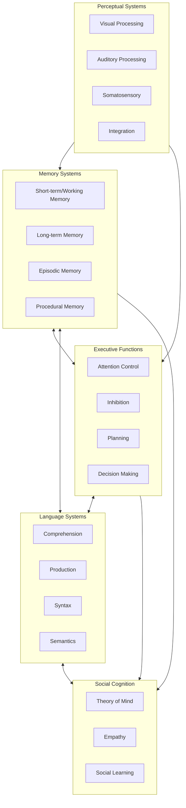
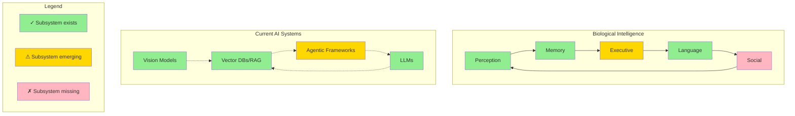

# We Don't Know What Intelligence Is (And That's Why AGI Claims Are Bollocks)

<!--category-- AI, Opinion, Psychology, Intelligence -->
<datetime class="hidden">2025-12-02T14:30</datetime>

## Introduction

Here's an uncomfortable truth that nobody in the AI hype machine wants to discuss: **We still don't know what intelligence actually is.**

Not in humans. Not in animals. And certainly not in machines.

This isn't just academic hairsplitting. It's the foundational problem that makes all the breathless "AGI in 12 months!" predictions absurd. We're trying to build artificial general intelligence when we can't even define what general intelligence means.

Worse, we're making the exact same mistake that torpedoed early psychology: **confusing behaviour with the thing producing the behaviour.**

This is the behaviourist fallacy, and it's why a parrot that can say "Polly wants a cracker" isn't demonstrating language comprehension, a thermostat that maintains temperature isn't "trying" to keep you warm, and a transformer that passes the bar exam isn't thinking.

[TOC]

## The Behaviourist Mistake (That We're Repeating)

In the early 20th century, psychology went through its behaviourist phase. Researchers like Watson and Skinner argued that psychology should only study observable behaviour, not internal mental states. If you can't measure it objectively, it doesn't matter.

This led to some genuinely useful insights about learning and conditioning. It also led to some spectacular failures in understanding animal cognition.

### The Classic Example: Clever Hans

There's a famous case from 1907 of a horse named Clever Hans who could apparently do arithmetic. Ask Hans what 2+3 was, and he'd tap his hoof five times. Incredible! A mathematical horse!

Except Hans couldn't do maths at all. He was reading tiny, unconscious cues from his questioner - a slight change in posture or breathing when he reached the correct number of taps. Remove the questioner's ability to give these cues (by having them not know the answer), and Hans couldn't solve even basic problems.

**The behaviour (tapping the correct number) existed. The underlying capability (mathematical reasoning) did not.**

This is the behaviourist trap: behaviour is the **output** of a system, not the system itself.

### Modern Psychology Moved On (AI Hasn't)

Modern cognitive psychology, neuroscience, and comparative psychology understand that behaviour is just the observable tip of a vastly complex iceberg. The interesting stuff - the actual cognition - is happening inside, in ways we're still trying to understand.

We learned this the hard way with animals. For decades, behaviourists insisted that animals were simple stimulus-response machines. Then we started actually studying animal cognition properly:

- **Crows** use tools, solve multi-step problems, and hold grudges for years
- **Octopuses** have distributed intelligence across their arms (each arm has its own "brain")
- **Elephants** recognise themselves in mirrors and mourn their dead
- **Dolphins** have individual names (signature whistles) and cultural transmission of knowledge

None of this is simple stimulus-response. These are complex cognitive systems with internal models, memory, planning, and problem-solving capabilities.

But here's the kicker: **we still don't fully understand how any of this works.** We can observe the behaviour. We can make educated guesses about the cognitive architecture. But the actual mechanisms of animal intelligence remain largely mysterious.

## Intelligence: A Collection of Subsystems

Here's what we do know from neuroscience and cognitive psychology: intelligence isn't a single thing. It's not one capability that you either have or don't have.

**Intelligence is a collection of interacting subsystems, each specialised for different tasks.**

In humans, this includes (at minimum):

Each of these subsystems has its own architecture, its own failure modes, and its own development trajectory. They interact in complex ways we're still mapping out.

### When Subsystems Break

The modularity of intelligence becomes obvious when individual subsystems fail:

**Aphasia**: Language comprehension or production breaks, but reasoning remains intact. You can think clearly but can't speak, or can speak but can't understand.

**Prosopagnosia**: Face recognition fails. You can recognise objects, read emotions, navigate spaces - but can't recognise faces, even your own family members.

**Anterograde Amnesia**: New long-term memory formation stops. You can remember everything up to the injury, your skills work fine, but you can't form new episodic memories.

**Executive Dysfunction**: Planning and inhibition fail. Intelligence and memory intact, but you can't organise tasks or stop impulsive behaviour.

Each of these demonstrates that intelligence isn't one thing. It's many systems working together, and when one breaks, the others keep functioning.

## The Subsystems We're Actually Building

Here's where things get interesting, and where the AGI hype gets its fuel.

**We ARE building subsystems.** Not all the subsystems needed for intelligence, but genuine cognitive subsystems that map (roughly) to neuroanatomical ones.

Let's be honest about what we've achieved:

### Perception Subsystems

**Vision Models** (CLIP, SAM, vision transformers): These process visual information, recognise objects, understand spatial relationships. They're not human vision, but they're doing something functionally similar - extracting meaningful patterns from visual input.

**Audio Processing** (Whisper, AudioCraft): Speech recognition, sound classification, music generation. Again, not identical to auditory cortex processing, but achieving similar functional outcomes.

**Multimodal Integration** (GPT-4V, Gemini): Combining vision and language, cross-modal reasoning. The beginnings of what the brain does when integrating sensory streams.

### Memory Subsystems

**Vector Databases** (Pinecone, Qdrant, Weaviate): Long-term storage and retrieval of semantic information. Not episodic memory, but a form of semantic memory that can be queried associatively.

**RAG Systems** (Retrieval-Augmented Generation): Mimicking how we retrieve relevant memories to inform current reasoning. You ask something, the system fetches related information, uses it to construct a response.

**Context Windows**: Getting longer (100k+ tokens now), functioning like working memory - holding information temporarily for reasoning.

### Language Subsystems

**LLMs** (GPT-4, Claude, Llama): Comprehension, production, syntax, semantics. They're processing language in ways that produce functionally similar outputs to human language processing. Whether the mechanism is the same is debatable, but the subsystem exists.

### Planning and Executive Function

**Agentic Frameworks** (AutoGPT, BabyAGI, LangGraph): Breaking tasks into steps, executing them sequentially, adjusting based on outcomes. Primitive, but it's planning.

**Tool Use**: Models calling functions, executing code, using APIs. The beginnings of goal-directed action.

**Chain-of-Thought Reasoning**: Step-by-step reasoning, planning responses before generating them. A crude form of executive control.

### The Clever Part (and the Problem)

We're building these subsystems **separately**, then **composing them** into systems that look increasingly capable:

Look at that diagram. We have perception (✓). We have memory (✓). We have language (✓). We have rudimentary planning (⚠).

**This is genuine progress.** We're not building nothing. We're building functional analogues to cognitive subsystems.

### The Behaviourist Parallel

But here's where the behaviourist hype comes in:

In the 1920s, behaviourists saw conditioning and learning and thought: "That's it! That's all there is! Stimulus-response explains everything!"

They were wrong. They'd found **one subsystem** (associative learning) and mistaken it for **the whole system**.

Today, AI researchers see subsystem assembly and think: "That's it! Put enough subsystems together and you get intelligence! AGI is just more subsystems + more scale!"

Maybe. But maybe not.

## The Integration Problem (That Nobody's Solving)

Having subsystems isn't the same as having intelligence. A pile of car parts isn't a car.

The question isn't "do we have subsystems?" - we do. The question is: **what integrates them into a coherent cognitive system?**

In biological brains, we have:

**Continuous Operation**: Your subsystems are always running, always interacting. Perception feeds memory, memory informs perception, executive control modulates both. It's a continuous loop.

**Shared Representations**: Information is encoded in ways that multiple subsystems can access and use. Your visual cortex's representation of a face is usable by your emotional system, your memory system, your social cognition system.

**Embodied Feedback**: Subsystems are grounded in physical reality. You can test your world model by interacting with the world. Actions have consequences that feed back into perception.

**Developmental Integration**: The subsystems develop together, learning to communicate and coordinate. A newborn's perception and motor control are uncoordinated; by age 2, they're integrated.

**Emotional Valence**: Experiences have affective colouring that guides learning and decision-making. Not all memories are equal; emotionally significant ones are prioritised.

### What Current AI Lacks

**Continuous Integration**: We bolt subsystems together via APIs and prompts, not genuine neural integration. The vision model doesn't continuously inform the language model; we pipe outputs between them.

**Shared Grounding**: Vector embeddings aren't shared representations. Each model has its own latent space. There's no common "language" between subsystems.

**No Feedback Loops**: Can't test predictions against reality. Can't learn from mistakes in deployment. The systems are static after training.

**No Development**: Subsystems are trained separately, then frozen. They don't learn to coordinate better over time. They don't mature together.

**No Affective Guidance**: No emotions to prioritise what matters, guide learning, modulate behaviour. Everything is equally important (or unimportant).

## The Clever Hans Problem, Revisited

So we're back to Clever Hans.

Hans exhibited mathematical behaviour (tapping the correct number). But the underlying capability (mathematical reasoning) didn't exist. He was using a completely different mechanism (reading human cues) to produce the same output.

Modern AI exhibits intelligent behaviour across many subsystems. But does the underlying capability (intelligence) exist?

**We're building subsystem components that produce intelligent-looking outputs. But are we building intelligence, or are we building elaborate Clever Hans at scale?**

The uncomfortable answer: we don't know yet.

Maybe assembled subsystems + scale = intelligence. Maybe there's an integration principle we're missing. Maybe consciousness or embodiment is essential. Maybe multiple realisability means the mechanism doesn't matter, only the functional outcome.

**We. Don't. Know.**

## "But It Passes Tests!"

I hear this constantly. "GPT-4 passed the bar exam! It scored in the 90th percentile on the SAT! It beat the Turing test!"

So what?

Passing a test designed for humans doesn't mean you possess the cognitive architecture that humans use to pass that test. You can get to the same behaviour via completely different mechanisms.

### The Chinese Room, Updated

Philosopher John Searle's Chinese Room argument is even more relevant now than when he proposed it in 1980.

Imagine a person who speaks only English, locked in a room with a massive book of rules for manipulating Chinese characters. People slide Chinese questions under the door. Using the rule book, the person produces Chinese answers that are indistinguishable from a native speaker's responses.

**Question**: Does the person in the room understand Chinese?

**Obviously not.** They're mechanically following symbol-manipulation rules. They have no semantic understanding of the characters they're manipulating.

Modern LLMs are the Chinese Room at scale. Vastly more sophisticated rules (learned statistical patterns), vastly faster execution (GPUs), vastly larger rule books (billions of parameters). But still fundamentally symbol manipulation without semantic understanding.

Or are they?

**Here's the uncomfortable bit: we genuinely don't know.**

Maybe semantic understanding emerges from sufficiently sophisticated symbol manipulation. Maybe there's no meaningful difference between "real" understanding and perfect simulation of understanding. Maybe we're all just meat-based Chinese Rooms running on neurons instead of silicon.

This is why the question "what is intelligence?" matters. Without a clear definition, we can't tell if we've achieved it artificially.

## The AGI Hype Cycle

Every few months, someone in the AI community makes a bold prediction: "We're 6-18 months from AGI!"

This is based on extrapolating from capability improvements. GPT-3 was impressive. GPT-4 is more impressive. Scaling laws suggest GPT-5 will be even better. Therefore, AGI is just a few more scaling steps away!

This logic has several fatal flaws.

### Flaw 1: Confusing Task Performance with General Intelligence

Beating benchmarks isn't intelligence; it's narrow capability improvement. An AI that scores 99th percentile on standardised tests but can't remember yesterday's conversation, form its own goals, or learn from mistakes isn't generally intelligent.

It's a very good test-taking machine.

### Flaw 2: Assuming Linear Progress

Improvement on benchmarks doesn't mean we're linearly approaching AGI. We might be asymptotically approaching the maximum capability of the current architecture - very good at statistical pattern matching, fundamentally limited in other dimensions.

Getting to 99% of the way to perfect pattern matching doesn't mean you're 99% of the way to general intelligence. You might be 5% of the way there, because pattern matching is only one subsystem of many required.

### Flaw 3: Ignoring Missing Subsystems

Current architectures have no path to persistent memory, embodied learning, emotional processing, or genuine goal formation. These aren't features you add with more parameters or better training data. They're architectural requirements.

Saying "scale will solve it" is magical thinking. Scale improves what the architecture can do. It doesn't add capabilities the architecture fundamentally lacks.

### Flaw 4: No Definition of the Target

How will we know when we've achieved AGI? What's the test?

"It can do any cognitive task a human can" is circular - we're defining AGI in terms of human behaviour, which brings us right back to the behaviourist fallacy.

"It possesses general intelligence" is tautological - we're defining AGI as the thing we don't know how to define.

Without a clear target, claiming we're "almost there" is meaningless.

## So What Actually Is Intelligence?

Here's the honest answer: **we don't fully know.**

We know it involves multiple interacting subsystems. We know it requires persistent memory, world modelling, goal formation, and learning from experience. We know it's embodied and emotional in biological systems, though we're not sure if those are essential or just how evolution implemented it.

We know behaviour is the output, not the capability itself.

But we don't have a complete theory of intelligence. Not for humans, not for animals, not for hypothetical artificial systems.

### Competing Theories

**Computational Theory of Mind**: Intelligence is information processing. The brain is software running on biological hardware. In principle, you could run the same software on silicon.

**Embodied Cognition**: Intelligence is fundamentally tied to having a body and interacting with the physical world. Disembodied intelligence might not be possible.

**Enactive Cognition**: Intelligence isn't something you have; it's something you do. It emerges from the interaction between organism and environment.

**Predictive Processing**: The brain is a prediction machine, constantly generating and updating models of sensory input. Intelligence is sophisticated prediction and prediction-error minimisation.

**Global Workspace Theory**: Consciousness (and perhaps intelligence) emerges from information being broadcast across a global workspace in the brain, accessible to multiple subsystems.

Each of these has evidence supporting it. None fully explains intelligence. They're not even mutually exclusive - several might be partially right.

## What This Means for AI

If we don't know what intelligence is, we can't confidently claim to be building it artificially.

We're building systems with impressive capabilities. Genuinely useful tools. Sometimes eerily good simulacra of intelligent behaviour.

But are they intelligent? Are they on the path to AGI?

**We. Don't. Know.**

And anyone claiming certainty - in either direction - is full of shit.

### What We Can Say

**Current AI is not AGI.** It's missing too many subsystems that biological intelligence possesses. It might be on a path to AGI via a completely different architecture, but that's speculation, not demonstrated fact.

**Scaling alone won't get us there.** Making the pattern-matching better doesn't add persistent memory, embodied learning, or genuine goal formation. Those require architectural changes, not just more parameters.

**Behaviour is not proof of capability.** An AI that acts intelligent in narrow contexts might be doing something completely different from what biological intelligence does. We can't assume the mechanisms match just because the outputs sometimes align.

**We might achieve AGI by accident.** It's possible that sufficiently scaled, sufficiently sophisticated systems develop emergent properties that we'd recognise as general intelligence. But it's also possible they don't, and we're building towards a local maximum that looks impressive but isn't actually intelligent.

### What We Should Do

**Stop making AGI timeline predictions based on benchmark performance.** It's scientifically unjustifiable and leads to hype cycles that damage the field.

**Invest in understanding biological intelligence.** The more we understand about how brains actually work, the better equipped we'll be to recognise (or build) artificial intelligence.

**Be honest about limitations.** Current AI is amazing at narrow tasks. Acknowledge that without claiming it's almost generally intelligent.

**Build systems that complement human intelligence rather than trying to replace it.** Humans + AI working together might be more capable than either alone, regardless of whether we ever achieve AGI.

## The Humility We Need

Here's what my psychology training taught me that seems to have been forgotten in the AI hype: **it's okay to say "we don't know."**

We don't know exactly what animal intelligence is, despite studying it for decades.

We don't know exactly what human intelligence is, despite it being the thing we experience most directly.

We certainly don't know what artificial general intelligence would look like or how to build it.

This isn't defeatism. It's intellectual honesty.

The behaviourists thought they had intelligence figured out: it's just observable behaviour, nothing more needed. They were wrong. Catastrophically wrong. It set psychology back decades.

We're making the same mistake with AI. Behaviour (passing tests, writing code, generating images) is being mistaken for the underlying capability (intelligence).

Maybe we'll get lucky. Maybe sufficient sophistication in behaviour-generation does produce genuine intelligence as an emergent property.

But we can't assume that. And we definitely can't claim it's "just 12 months away" based on benchmark improvements.

## Conclusion: The Behaviour Trap

Here's the core problem, stated plainly:

**It's trivially easy to mistake increasingly sophisticated behaviour for intelligence.**

Every year, AI systems exhibit more impressive behaviours:
- Pass more exams
- Write better code
- Generate better images
- Answer harder questions
- Control more tools
- Solve more problems

The behaviours are real. The progress is real. The usefulness is real.

But behaviour is not intelligence. It's the output of intelligence - or of something that mimics intelligence well enough to produce similar outputs.

### The Behaviourist Hype Cycle

In the 1920s:
- Animals showed learning behaviour (conditioning)
- Behaviourists concluded: "That's intelligence! It's just stimulus-response!"
- They were wrong - they'd mistaken one subsystem output for the whole system

In the 2020s:
- AI shows intelligent behaviour (passing tests, writing code, reasoning)
- AI researchers conclude: "That's intelligence! Just add more subsystems + scale!"
- Are they wrong? **We don't know yet.**

The parallel is uncomfortable because the behaviourists were so catastrophically wrong. They thought they'd solved intelligence when they'd barely scratched the surface.

Are we making the same mistake?

### What We've Actually Built

We're building cognitive subsystems that produce intelligent-looking behaviours:
- **Perception subsystems** (vision, audio)
- **Memory subsystems** (vector databases, RAG)
- **Language subsystems** (LLMs)
- **Planning subsystems** (agentic frameworks)

These are genuine achievements. Real progress toward building functional analogues of biological cognitive subsystems.

But we're missing the integration:
- How these subsystems coordinate in real-time
- How they share representations
- How they develop together
- How they ground in physical reality
- How affective states guide behaviour

**Having the parts isn't the same as having the system.**

### The Uncomfortable Truth

Every improvement in AI behaviour makes it harder to tell whether we're building intelligence or just building better behaviour-generators.

GPT-3 could write coherent paragraphs. Impressive behaviour, but clearly not intelligent.

GPT-4 can pass professional exams. More impressive behaviour. Is it intelligent?

GPT-5 will be even better. At what point does impressive behaviour become intelligence?

**We can't answer that question because we don't know what intelligence is.**

And that's precisely why AGI timeline predictions are bollocks. They're based on extrapolating behaviour improvements and assuming that sufficiently good behaviour = intelligence.

That assumption might be true. But it might not be. The behaviourists made that same assumption and were catastrophically wrong.

### What This Means

**We are not a year away from AGI.** We might be a year away from systems that exhibit even more impressive intelligent behaviours. But behaviour is not intelligence.

**We ARE building subsystems.** Real progress toward cognitive architectures. But subsystems aren't systems.

**We DON'T KNOW if we're on the right path.** Maybe assembled subsystems + scale = intelligence. Maybe not. Anyone claiming certainty is selling something.

### The Real Danger

The danger isn't AI becoming too intelligent. It's us:

1. **Mistaking behaviour for capability** - Assuming the system can do things it can't because it behaves intelligently in some contexts
2. **Trusting outputs we shouldn't** - Delegating decisions to systems that produce intelligent-looking behaviour without genuine understanding
3. **Missing the integration problem** - Thinking more subsystems + more scale solves everything when integration might be the hard part
4. **Hyping timelines** - Making predictions based on behaviour improvements rather than understanding of intelligence

### What We Need

**Epistemic humility**: It's okay to say "we don't know what intelligence is, so we can't confidently claim to be building it."

**Better integration research**: Stop throwing more parameters at monolithic models. Start investigating how subsystems coordinate, share representations, and develop together.

**Honest assessment**: Acknowledge that impressive behaviour doesn't prove underlying capability. Test for the mechanisms, not just the outputs.

**Grounded expectations**: Current AI is phenomenally useful for many tasks. Celebrate that without claiming imminent AGI.

### The Bottom Line

Intelligence is a collection of subsystems, integrated in ways we're still working to understand. We're building some of those subsystems. We're getting better at making them produce intelligent behaviours.

But until we understand what integrates subsystems into intelligence - and whether our architectures can achieve that integration - claims about imminent AGI are premature.

We're not building AGI. We're building increasingly sophisticated Clever Hans systems - producing intelligent behaviours through mechanisms that might or might not constitute intelligence.

The behaviours will keep improving. That doesn't mean we're approaching intelligence. It might just mean we're getting better at mimicking it.

And until we can tell the difference, everything else is hype.
