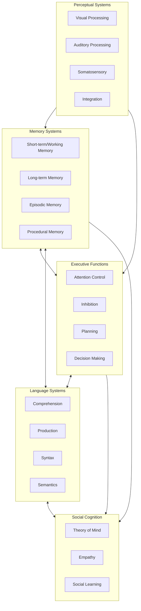

# We Don't Know What Intelligence Is (And That's Why AGI Claims Are Bollocks)

<!--category-- AI, Opinion, Psychology, Intelligence -->
<datetime class="hidden">2025-12-02T14:30</datetime>

## Introduction

Here's an uncomfortable truth that nobody in the AI hype machine wants to discuss: **We still don't know what intelligence actually is.**

Not in humans. Not in animals. And certainly not in machines.

This isn't just academic hairsplitting. It's the foundational problem that makes all the breathless "AGI in 12 months!" predictions absurd. We're trying to build artificial general intelligence when we can't even define what general intelligence means.

Worse, we're making the exact same mistake that torpedoed early psychology: **confusing behaviour with the thing producing the behaviour.**

This is the behaviourist fallacy, and it's why a parrot that can say "Polly wants a cracker" isn't demonstrating language comprehension, a thermostat that maintains temperature isn't "trying" to keep you warm, and a transformer that passes the bar exam isn't thinking.

[TOC]

## The Behaviourist Mistake (That We're Repeating)

In the early 20th century, psychology went through its behaviourist phase. Researchers like Watson and Skinner argued that psychology should only study observable behaviour, not internal mental states. If you can't measure it objectively, it doesn't matter.

This led to some genuinely useful insights about learning and conditioning. It also led to some spectacular failures in understanding animal cognition.

### The Classic Example: Clever Hans

There's a famous case from 1907 of a horse named Clever Hans who could apparently do arithmetic. Ask Hans what 2+3 was, and he'd tap his hoof five times. Incredible! A mathematical horse!

Except Hans couldn't do maths at all. He was reading tiny, unconscious cues from his questioner - a slight change in posture or breathing when he reached the correct number of taps. Remove the questioner's ability to give these cues (by having them not know the answer), and Hans couldn't solve even basic problems.

**The behaviour (tapping the correct number) existed. The underlying capability (mathematical reasoning) did not.**

This is the behaviourist trap: behaviour is the **output** of a system, not the system itself.

### Modern Psychology Moved On (AI Hasn't)

Modern cognitive psychology, neuroscience, and comparative psychology understand that behaviour is just the observable tip of a vastly complex iceberg. The interesting stuff - the actual cognition - is happening inside, in ways we're still trying to understand.

We learned this the hard way with animals. For decades, behaviourists insisted that animals were simple stimulus-response machines. Then we started actually studying animal cognition properly:

- **Crows** use tools, solve multi-step problems, and hold grudges for years
- **Octopuses** have distributed intelligence across their arms (each arm has its own "brain")
- **Elephants** recognise themselves in mirrors and mourn their dead
- **Dolphins** have individual names (signature whistles) and cultural transmission of knowledge

None of this is simple stimulus-response. These are complex cognitive systems with internal models, memory, planning, and problem-solving capabilities.

But here's the kicker: **we still don't fully understand how any of this works.** We can observe the behaviour. We can make educated guesses about the cognitive architecture. But the actual mechanisms of animal intelligence remain largely mysterious.

## Intelligence: A Collection of Subsystems

Here's what we do know from neuroscience and cognitive psychology: intelligence isn't a single thing. It's not one capability that you either have or don't have.

**Intelligence is a collection of interacting subsystems, each specialised for different tasks.**

In humans, this includes (at minimum):

Each of these subsystems has its own architecture, its own failure modes, and its own development trajectory. They interact in complex ways we're still mapping out.

### When Subsystems Break

The modularity of intelligence becomes obvious when individual subsystems fail:

**Aphasia**: Language comprehension or production breaks, but reasoning remains intact. You can think clearly but can't speak, or can speak but can't understand.

**Prosopagnosia**: Face recognition fails. You can recognise objects, read emotions, navigate spaces - but can't recognise faces, even your own family members.

**Anterograde Amnesia**: New long-term memory formation stops. You can remember everything up to the injury, your skills work fine, but you can't form new episodic memories.

**Executive Dysfunction**: Planning and inhibition fail. Intelligence and memory intact, but you can't organise tasks or stop impulsive behaviour.

Each of these demonstrates that intelligence isn't one thing. It's many systems working together, and when one breaks, the others keep functioning.

## What Modern AI Actually Has (And Doesn't)

Let's be brutally honest about what current "AI" systems - even the most advanced transformer models - actually possess.

### What They Have

**Pattern Matching at Scale**: Transformers are bloody brilliant at finding statistical patterns in massive datasets. This enables impressive behaviour: writing code, answering questions, generating images, translating languages.

**Associative Retrieval**: Given a prompt, they can pull up relevant statistical patterns from their training. This looks like knowledge retrieval and sometimes functions like it.

**Compositional Generation**: They can combine patterns in novel ways to produce outputs they've never seen in training. This looks creative and sometimes is.

### What They Definitely Don't Have

**Persistent Memory**: Every conversation starts fresh. There's no continuous experience, no accumulation of knowledge from interactions. Context windows are getting longer, but they're not memory - they're just bigger prompts.

**Internal Models**: Transformers don't build models of the world. They have statistical associations between tokens, not causal understanding. They can parrot physics explanations without any representation of how gravity actually works.

**Goals or Motivation**: They optimise for next-token prediction during training. At inference, they're just computing probabilities. There's no "wanting" anything, no internal drive, no intention.

**Self-Model**: They have no representation of themselves as an entity. No metacognition. No ability to reason about their own limitations or capabilities beyond statistical patterns in their training about "what AI systems typically can't do."

**Developmental Arc**: They're trained once (or fine-tuned), then frozen. They don't learn from experience in deployment. They don't develop new capabilities over time. They don't mature.

**Embodiment**: They have no connection to the physical world beyond text descriptions. No proprioception, no motor control, no feedback from interacting with reality.

**Emotional States**: No valence, no arousal, no affective colouring of experience. Responses about emotions are statistical patterns about how humans write about emotions.

### The Clever Hans Problem, Again

Modern LLMs are exhibiting Clever Hans behaviour at scale. They've learned to produce outputs that look intelligent by picking up on statistical patterns in human-generated text.

Ask GPT-4 to explain quantum mechanics, and it generates text that matches the statistical distribution of how physicists write about quantum mechanics. Impressive! But is it understanding quantum mechanics, or is it the world's most sophisticated autocomplete?

We genuinely don't know. And that's the problem.

## The Subsystems We're Missing

If intelligence is a collection of interacting subsystems, current AI is missing most of them:

| Subsystem | Humans | Animals | Current AI | Why It Matters |
|-----------|--------|---------|------------|----------------|
| **Persistent Memory** | ✓ | ✓ | ✗ | Can't learn from experience, no identity over time |
| **World Modelling** | ✓ | ✓ | ✗ | No causal understanding, just correlations |
| **Goal Formation** | ✓ | ✓ | ✗ | No internal motivation, no agency |
| **Metacognition** | ✓ | Some | ✗ | Can't reason about own knowledge/limitations |
| **Emotional Processing** | ✓ | ✓ | ✗ | No valence to guide decision-making |
| **Social Cognition** | ✓ | ✓ | ✗ | No theory of mind, no real empathy |
| **Embodied Interaction** | ✓ | ✓ | ✗ | No feedback from physical reality |
| **Developmental Learning** | ✓ | ✓ | ✗ | Static after training, no maturation |

Notice something? Current AI has basically zero of the subsystems that cognitive science identifies as core to biological intelligence.

What it does have - pattern matching and compositional generation - are impressive. Genuinely useful. Sometimes uncannily good at mimicking intelligent behaviour.

But they're not a mind. They're not even close.

## "But It Passes Tests!"

I hear this constantly. "GPT-4 passed the bar exam! It scored in the 90th percentile on the SAT! It beat the Turing test!"

So what?

Passing a test designed for humans doesn't mean you possess the cognitive architecture that humans use to pass that test. You can get to the same behaviour via completely different mechanisms.

### The Chinese Room, Updated

Philosopher John Searle's Chinese Room argument is even more relevant now than when he proposed it in 1980.

Imagine a person who speaks only English, locked in a room with a massive book of rules for manipulating Chinese characters. People slide Chinese questions under the door. Using the rule book, the person produces Chinese answers that are indistinguishable from a native speaker's responses.

**Question**: Does the person in the room understand Chinese?

**Obviously not.** They're mechanically following symbol-manipulation rules. They have no semantic understanding of the characters they're manipulating.

Modern LLMs are the Chinese Room at scale. Vastly more sophisticated rules (learned statistical patterns), vastly faster execution (GPUs), vastly larger rule books (billions of parameters). But still fundamentally symbol manipulation without semantic understanding.

Or are they?

**Here's the uncomfortable bit: we genuinely don't know.**

Maybe semantic understanding emerges from sufficiently sophisticated symbol manipulation. Maybe there's no meaningful difference between "real" understanding and perfect simulation of understanding. Maybe we're all just meat-based Chinese Rooms running on neurons instead of silicon.

This is why the question "what is intelligence?" matters. Without a clear definition, we can't tell if we've achieved it artificially.

## The AGI Hype Cycle

Every few months, someone in the AI community makes a bold prediction: "We're 6-18 months from AGI!"

This is based on extrapolating from capability improvements. GPT-3 was impressive. GPT-4 is more impressive. Scaling laws suggest GPT-5 will be even better. Therefore, AGI is just a few more scaling steps away!

This logic has several fatal flaws.

### Flaw 1: Confusing Task Performance with General Intelligence

Beating benchmarks isn't intelligence; it's narrow capability improvement. An AI that scores 99th percentile on standardised tests but can't remember yesterday's conversation, form its own goals, or learn from mistakes isn't generally intelligent.

It's a very good test-taking machine.

### Flaw 2: Assuming Linear Progress

Improvement on benchmarks doesn't mean we're linearly approaching AGI. We might be asymptotically approaching the maximum capability of the current architecture - very good at statistical pattern matching, fundamentally limited in other dimensions.

Getting to 99% of the way to perfect pattern matching doesn't mean you're 99% of the way to general intelligence. You might be 5% of the way there, because pattern matching is only one subsystem of many required.

### Flaw 3: Ignoring Missing Subsystems

Current architectures have no path to persistent memory, embodied learning, emotional processing, or genuine goal formation. These aren't features you add with more parameters or better training data. They're architectural requirements.

Saying "scale will solve it" is magical thinking. Scale improves what the architecture can do. It doesn't add capabilities the architecture fundamentally lacks.

### Flaw 4: No Definition of the Target

How will we know when we've achieved AGI? What's the test?

"It can do any cognitive task a human can" is circular - we're defining AGI in terms of human behaviour, which brings us right back to the behaviourist fallacy.

"It possesses general intelligence" is tautological - we're defining AGI as the thing we don't know how to define.

Without a clear target, claiming we're "almost there" is meaningless.

## So What Actually Is Intelligence?

Here's the honest answer: **we don't fully know.**

We know it involves multiple interacting subsystems. We know it requires persistent memory, world modelling, goal formation, and learning from experience. We know it's embodied and emotional in biological systems, though we're not sure if those are essential or just how evolution implemented it.

We know behaviour is the output, not the capability itself.

But we don't have a complete theory of intelligence. Not for humans, not for animals, not for hypothetical artificial systems.

### Competing Theories

**Computational Theory of Mind**: Intelligence is information processing. The brain is software running on biological hardware. In principle, you could run the same software on silicon.

**Embodied Cognition**: Intelligence is fundamentally tied to having a body and interacting with the physical world. Disembodied intelligence might not be possible.

**Enactive Cognition**: Intelligence isn't something you have; it's something you do. It emerges from the interaction between organism and environment.

**Predictive Processing**: The brain is a prediction machine, constantly generating and updating models of sensory input. Intelligence is sophisticated prediction and prediction-error minimisation.

**Global Workspace Theory**: Consciousness (and perhaps intelligence) emerges from information being broadcast across a global workspace in the brain, accessible to multiple subsystems.

Each of these has evidence supporting it. None fully explains intelligence. They're not even mutually exclusive - several might be partially right.

## What This Means for AI

If we don't know what intelligence is, we can't confidently claim to be building it artificially.

We're building systems with impressive capabilities. Genuinely useful tools. Sometimes eerily good simulacra of intelligent behaviour.

But are they intelligent? Are they on the path to AGI?

**We. Don't. Know.**

And anyone claiming certainty - in either direction - is full of shit.

### What We Can Say

**Current AI is not AGI.** It's missing too many subsystems that biological intelligence possesses. It might be on a path to AGI via a completely different architecture, but that's speculation, not demonstrated fact.

**Scaling alone won't get us there.** Making the pattern-matching better doesn't add persistent memory, embodied learning, or genuine goal formation. Those require architectural changes, not just more parameters.

**Behaviour is not proof of capability.** An AI that acts intelligent in narrow contexts might be doing something completely different from what biological intelligence does. We can't assume the mechanisms match just because the outputs sometimes align.

**We might achieve AGI by accident.** It's possible that sufficiently scaled, sufficiently sophisticated systems develop emergent properties that we'd recognise as general intelligence. But it's also possible they don't, and we're building towards a local maximum that looks impressive but isn't actually intelligent.

### What We Should Do

**Stop making AGI timeline predictions based on benchmark performance.** It's scientifically unjustifiable and leads to hype cycles that damage the field.

**Invest in understanding biological intelligence.** The more we understand about how brains actually work, the better equipped we'll be to recognise (or build) artificial intelligence.

**Be honest about limitations.** Current AI is amazing at narrow tasks. Acknowledge that without claiming it's almost generally intelligent.

**Build systems that complement human intelligence rather than trying to replace it.** Humans + AI working together might be more capable than either alone, regardless of whether we ever achieve AGI.

## The Humility We Need

Here's what my psychology training taught me that seems to have been forgotten in the AI hype: **it's okay to say "we don't know."**

We don't know exactly what animal intelligence is, despite studying it for decades.

We don't know exactly what human intelligence is, despite it being the thing we experience most directly.

We certainly don't know what artificial general intelligence would look like or how to build it.

This isn't defeatism. It's intellectual honesty.

The behaviourists thought they had intelligence figured out: it's just observable behaviour, nothing more needed. They were wrong. Catastrophically wrong. It set psychology back decades.

We're making the same mistake with AI. Behaviour (passing tests, writing code, generating images) is being mistaken for the underlying capability (intelligence).

Maybe we'll get lucky. Maybe sufficient sophistication in behaviour-generation does produce genuine intelligence as an emergent property.

But we can't assume that. And we definitely can't claim it's "just 12 months away" based on benchmark improvements.

## Conclusion

Intelligence is a collection of subsystems, interacting in ways we're still working to understand. It's not one thing. It's many things, working together.

Current AI has some of those subsystems, simulated via completely different mechanisms. It's missing most of them entirely.

That doesn't make AI useless. It's phenomenally useful for many tasks. But it's not intelligent in the way humans or animals are intelligent, and claiming otherwise confuses the impressive behaviour (outputs) with the sophisticated cognition (mechanisms).

Until we understand what intelligence actually is - in humans, in animals, in any substrate - claims about imminent AGI are premature at best, intellectually dishonest at worst.

So no, we are not a year away from AGI.

We're a year away from better behaviour-generating systems that might look more intelligent without necessarily being more intelligent.

And until we can tell the difference, we're not building AGI. We're building Clever Hans at scale.

The real danger isn't AI becoming too intelligent. It's us mistaking sophisticated pattern-matching for thought, and making decisions based on that misunderstanding.

We need to solve the "what is intelligence?" question before we can meaningfully answer the "have we built it artificially?" question.

Everything else is just hype.
