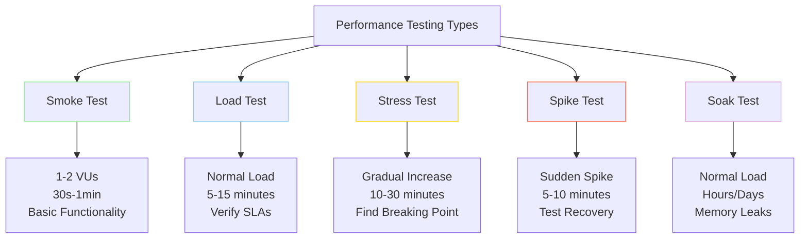
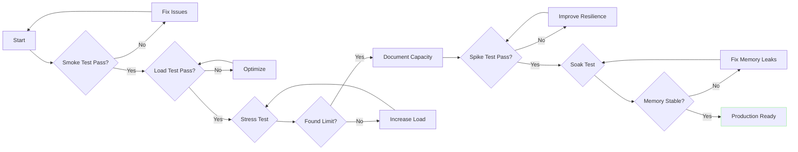

# Load Testing ASP.NET Core Applications with k6: Introduction

<!--category-- Testing, Performance, k6, ASP.NET -->
<datetime class="hidden">2025-12-02T14:00</datetime>

Your application works perfectly on your laptop. Unit tests pass. Integration tests pass. You deploy to production, and suddenly everything grinds to a halt. Five hundred real users hit your homepage simultaneously, and your server starts returning 503 errors. Your carefully crafted caching strategy? Turns out it doesn't work quite like you thought. That database query you thought was fast? It's creating a bottleneck at scale.

This is the nightmare scenario every developer fears, but most don't test for. **Performance testing isn't optional - it's the difference between a successful launch and a 3 AM emergency page.** This two-part guide will show you exactly how to prevent this scenario using k6, the modern load testing tool that's powerful enough for enterprise applications but simple enough to run in your CI/CD pipeline.

This is **Part 1** of a two-part series on load testing with k6:
- **Part 1 (this article)**: Introduction to k6, installation, test types, and why k6
- **[Part 2: Practical Implementation](/blog/k6-testing-practical)**: Writing tests, CI/CD integration, profiling, and real-world examples

## Introduction

Performance testing is critical for any production ASP.NET Core application. Whether you're building a simple blog, a complex microservice architecture, or an enterprise application, you need to know how your application behaves under load. Will it handle 100 concurrent users? 1,000? Where are the bottlenecks? Does your caching strategy actually work?

This comprehensive guide shows you how to load test ASP.NET Core applications using [k6](https://k6.io/) - one of the most powerful open-source load testing tools available. While we'll use [MinimalBlog](/blog/minimalblog-introduction) as our example application (a simple markdown-based blog with memory and output caching), the techniques and patterns shown here apply to **any ASP.NET Core application**.

By the end of this two-part series, you'll know how to:

- Install and configure k6 on any platform (Windows, Mac, Linux)
- Write comprehensive performance tests for different scenarios
- Integrate k6 into your CI/CD pipeline with GitHub Actions
- Use profiling tools (dotTrace, dotMemory) alongside k6 to find bottlenecks
- Implement different testing strategies: smoke, load, stress, spike, and soak tests
- Set up performance regression detection to prevent slow code from reaching production

**Why MinimalBlog as the example?** It's a real ASP.NET Core 9.0 application with common patterns: Razor Pages, memory caching, output caching, file I/O, and markdown processing. The testing approaches you'll learn apply equally to your MVC apps, Web APIs, Blazor applications, or minimal APIs.

[TOC]

## What is k6 and Why Use It?

[k6](https://k6.io/) is a modern load testing tool built for developers. Unlike older tools like JMeter or LoadRunner, k6 is:

- **Developer-friendly**: Tests are written in JavaScript (ES6+)
- **CLI-first**: Perfect for CI/CD pipelines
- **Lightweight**: Single binary, no dependencies
- **Accurate**: Written in Go for precise metrics
- **Scriptable**: Full programming capabilities for complex scenarios
- **Cloud-ready**: Can integrate with k6 Cloud, Grafana, Prometheus

For MinimalBlog, k6 is ideal because:

1. **We can test caching**: k6 can verify cache headers and behavior
2. **We can simulate real traffic**: Test multiple concurrent users
3. **We can validate performance claims**: Measure actual response times
4. **We can integrate with CI/CD**: Automate testing in our pipeline
5. **We can test specific scenarios**: Category filtering, individual posts, homepage

## Installing k6

### Windows Installation

**Option 1: Using Chocolatey (Recommended)**

```powershell
choco install k6
```

**Option 2: Using Winget**

```powershell
winget install k6 --source winget
```

**Option 3: Manual Installation**

1. Download the latest Windows release from [GitHub Releases](https://github.com/grafana/k6/releases)
2. Extract the `k6.exe` file
3. Add the directory to your PATH or move `k6.exe` to a directory already in PATH

**Verify Installation:**

```powershell
k6 version
```

### Mac Installation

**Option 1: Using Homebrew (Recommended)**

```bash
brew install k6
```

**Option 2: Using MacPorts**

```bash
sudo port install k6
```

**Option 3: Manual Installation**

```bash
# Download and install the latest release
curl -O -L https://github.com/grafana/k6/releases/latest/download/k6-macos-amd64.zip
unzip k6-macos-amd64.zip
sudo cp k6-macos-amd64/k6 /usr/local/bin/
sudo chmod +x /usr/local/bin/k6
```

**Verify Installation:**

```bash
k6 version
```

### Linux Installation

**Option 1: Using Package Managers**

For **Debian/Ubuntu**:

```bash
sudo gpg -k
sudo gpg --no-default-keyring --keyring /usr/share/keyrings/k6-archive-keyring.gpg --keyserver hkp://keyserver.ubuntu.com:80 --recv-keys C5AD17C747E3415A3642D57D77C6C491D6AC1D69
echo "deb [signed-by=/usr/share/keyrings/k6-archive-keyring.gpg] https://dl.k6.io/deb stable main" | sudo tee /etc/apt/sources.list.d/k6.list
sudo apt-get update
sudo apt-get install k6
```

For **Fedora/CentOS/RHEL**:

```bash
sudo dnf install https://dl.k6.io/rpm/repo.rpm
sudo dnf install k6
```

**Option 2: Using Snap**

```bash
sudo snap install k6
```

**Option 3: Manual Installation**

```bash
# Download the latest release
curl -O -L https://github.com/grafana/k6/releases/latest/download/k6-linux-amd64.tar.gz
tar -xzf k6-linux-amd64.tar.gz
sudo cp k6-linux-amd64/k6 /usr/local/bin/
sudo chmod +x /usr/local/bin/k6
```

**Option 4: Using Docker**

```bash
docker pull grafana/k6:latest

# Run a test
docker run --rm -i grafana/k6:latest run - <script.js
```

**Verify Installation:**

```bash
k6 version
```

## Understanding k6 Test Anatomy

Before we dive into testing, let's understand the basic structure of a k6 test:

```javascript
import http from 'k6/http';
import { check, sleep } from 'k6';

// Test configuration
export const options = {
  vus: 10,              // Virtual users
  duration: '30s',      // Test duration
};

// Setup function (runs once before test)
export function setup() {
  // Prepare test data
  return { baseUrl: 'http://localhost:5000' };
}

// Main test function (runs for each VU)
export default function(data) {
  const response = http.get(data.baseUrl);

  // Assertions
  check(response, {
    'status is 200': (r) => r.status === 200,
    'response time < 200ms': (r) => r.timings.duration < 200,
  });

  sleep(1); // Wait between iterations
}

// Teardown function (runs once after test)
export function teardown(data) {
  // Clean up
}
```

Key concepts:

- **Virtual Users (VUs)**: Simulated concurrent users
- **Duration**: How long the test runs
- **Checks**: Assertions that don't stop the test
- **Thresholds**: Pass/fail criteria
- **Metrics**: Response time, throughput, error rate

## Types of Performance Tests

Before testing your application, let's understand the five main types of load tests and when to use each:



### 1. Smoke Tests

**Purpose**: Verify the system works under minimal load

**When to use**:
- After every code change
- Before running more intensive tests
- As a sanity check in CI/CD

**Characteristics**:
- 1-2 VUs (Virtual Users)
- Short duration (30s-1min)
- Tests basic functionality

### 2. Load Tests

**Purpose**: Assess performance under expected normal load

**When to use**:
- To establish baseline performance
- To verify SLAs are met
- Regular performance regression testing

**Characteristics**:
- Realistic number of users
- Sustained load
- Typical duration: 5-15 minutes

### 3. Stress Tests

**Purpose**: Find system breaking point

**When to use**:
- To understand capacity limits
- To identify bottlenecks
- Planning for scaling

**Characteristics**:
- Gradually increasing load
- Push beyond normal capacity
- Duration: 10-30 minutes

### 4. Spike Tests

**Purpose**: Test behavior under sudden traffic spikes

**When to use**:
- Preparing for product launches
- Testing auto-scaling
- Validating fallback behavior

**Characteristics**:
- Sudden large increase in load
- Short spike duration
- Total duration: 5-10 minutes

### 5. Soak Tests (Endurance Tests)

**Purpose**: Find memory leaks and degradation over time

**When to use**:
- Before major releases
- Testing long-running services
- Validating resource cleanup

**Characteristics**:
- Normal load levels
- Extended duration (hours or days)
- Monitor for degradation



## Why k6 and Not...?

With so many load testing tools available, why should you choose k6? Let's compare k6 with popular alternatives:

### k6 vs Apache JMeter

**Apache JMeter** is the veteran of load testing tools (since 1999).

| Feature | k6 | JMeter |
|---------|----|---------|
| **Installation** | Single binary, no dependencies | Requires Java, heavier install |
| **Test Definition** | JavaScript code | XML or GUI |
| **Resource Usage** | Lightweight (Go) | Heavy (Java) |
| **CI/CD Integration** | Excellent (CLI-first) | Requires plugins |
| **Learning Curve** | Easy for developers | Steeper, GUI-focused |
| **Protocol Support** | HTTP, WebSockets, gRPC | Broader (FTP, JDBC, SMTP, etc.) |

**When to use JMeter instead:**
- Need GUI for non-technical testers
- Testing protocols beyond HTTP (JDBC, LDAP, SOAP)
- Already have JMeter expertise in team
- Need extensive plugin ecosystem

**Why k6 is better for most ASP.NET Core apps:**
- Faster to write tests (JavaScript vs XML)
- Lighter resource footprint
- Better CI/CD integration
- More modern developer experience

### k6 vs Locust

**Locust** is a Python-based load testing tool, popular in Python shops.

| Feature | k6 | Locust |
|---------|----|---------|
| **Language** | JavaScript | Python |
| **Performance** | Very fast (Go runtime) | Slower (Python GIL) |
| **Ease of Use** | Simple JavaScript | Pythonic, easy |
| **Distributed Testing** | k6 Cloud (paid) | Built-in (free) |
| **Web UI** | Limited | Excellent real-time UI |
| **Metrics Export** | Many formats | CSV, web UI |

**When to use Locust instead:**
- Python-first team
- Need free distributed testing
- Want real-time web UI during tests
- Complex Python logic in tests

**Why k6 is better for most ASP.NET Core apps:**
- Better performance for accurate metrics
- JavaScript more familiar for web developers
- Cleaner threshold/assertion syntax
- Better Prometheus/Grafana integration

### k6 vs Gatling

**Gatling** is a Scala-based tool with excellent reporting.

| Feature | k6 | Gatling |
|---------|----|---------|
| **Language** | JavaScript | Scala/Java |
| **Reports** | Basic (+ extensions) | Beautiful built-in HTML reports |
| **Learning Curve** | Easy | Moderate (Scala DSL) |
| **Performance** | Excellent | Excellent |
| **Open Source** | Fully open | Open with enterprise add-ons |
| **Cloud Service** | k6 Cloud | Gatling Enterprise |

**When to use Gatling instead:**
- JVM/Scala expertise in team
- Need stunning built-in reports
- Testing complex HTTP scenarios
- Enterprise support requirements

**Why k6 is better for most ASP.NET Core apps:**
- JavaScript is more accessible
- Simpler setup and execution
- Better for quick CI/CD checks
- More straightforward for simple HTTP testing

### k6 vs Artillery

**Artillery** is another JavaScript load testing tool.

| Feature | k6 | Artillery |
|---------|----|---------|
| **Test Definition** | JavaScript code | YAML + JS hooks |
| **Performance** | Faster (Go) | Slower (Node.js) |
| **Ease of Use** | Code-based | YAML config-based |
| **Built for** | Load testing | Load + functional testing |
| **Assertions** | Excellent thresholds | Basic expectations |
| **Extensibility** | Extensions | Plugins |

**When to use Artillery instead:**
- Prefer YAML over code
- Need Socket.io testing
- Want combined load + functional tests
- Already using Node.js ecosystem

**Why k6 is better for most ASP.NET Core apps:**
- More precise metrics (Go vs Node.js)
- Better threshold system
- Cleaner JavaScript API
- More mature and stable

### k6 vs wrk/wrk2

**wrk** is a lightweight HTTP benchmarking tool.

| Feature | k6 | wrk |
|---------|----|---------|
| **Ease of Use** | High-level API | Low-level C + Lua |
| **Scenarios** | Rich scenario support | Basic HTTP only |
| **Metrics** | Comprehensive | Basic |
| **Scripting** | JavaScript | Lua |
| **Use Case** | Full load testing | Quick benchmarks |

**When to use wrk instead:**
- Need absolute minimal overhead
- Quick one-off benchmarks
- Testing raw HTTP performance
- Low-level protocol testing

**Why k6 is better for most ASP.NET Core apps:**
- Much easier to write tests
- Better reporting and metrics
- Scenario support (ramp-up, stages)
- CI/CD friendly

### k6 vs Playwright/Cypress (Browser-Based)

**Playwright** and **Cypress** are browser automation tools sometimes used for load testing.

| Feature | k6 | Playwright/Cypress |
|---------|----|---------|
| **Approach** | Protocol-level HTTP | Real browser |
| **Performance** | Thousands of VUs | Tens of browsers |
| **Resource Usage** | Lightweight | Heavy (browsers) |
| **JavaScript Execution** | No | Yes |
| **Primary Use Case** | Load testing | E2E functional testing |

**When to use Playwright/Cypress instead:**
- Need to test JavaScript execution
- Must verify browser rendering
- Testing complex SPAs
- Functional E2E testing

**Why k6 is better for most ASP.NET Core apps:**
- Protocol-level testing sufficient for server-rendered apps
- Need to simulate 100+ concurrent users
- Much more efficient resource usage

### Summary: k6's Sweet Spot

**Choose k6 when you want:**

- Fast, accurate load testing
- Developer-friendly JavaScript API
- Excellent CI/CD integration
- Protocol-level HTTP testing (no browser needed)
- Rich scenario support (smoke, load, stress, spike, soak)
- Modern tooling with good ecosystem
- Lightweight resource usage

**k6 is perfect for:**
- APIs and web services
- Server-side rendered apps
- CI/CD performance gates
- Developer-driven performance testing
- Cloud-native applications

**Consider alternatives if you need:**
- Browser-based testing (use [Playwright](https://playwright.dev/))
- Extensive protocol support beyond HTTP (use [JMeter](https://jmeter.apache.org/))
- Free distributed testing (use [Locust](https://locust.io/))
- Beautiful built-in reports (use [Gatling](https://gatling.io/))
- GUI for non-technical testers (use [JMeter](https://jmeter.apache.org/))

## Next Steps

Now that you understand what k6 is, how to install it, the types of performance tests available, and why k6 is a great choice for ASP.NET Core applications, you're ready to start writing actual tests.

**Continue to [Part 2: Practical Implementation](/blog/k6-testing-practical)** where we'll cover:

- Setting up your test environment
- Writing smoke, load, stress, spike, and soak tests
- Testing cache behavior
- Realistic user journey simulations
- CI/CD integration with GitHub Actions
- Performance regression detection
- Profiling with dotTrace and dotMemory
- Best practices and troubleshooting

## Resources

### k6 Documentation
- [Official k6 docs](https://k6.io/docs/) - Complete k6 documentation
- [k6 JavaScript API](https://k6.io/docs/javascript-api/) - All available k6 APIs
- [k6 examples](https://github.com/grafana/k6-learn) - Example test scripts
- [k6 metrics](https://k6.io/docs/using-k6/metrics/) - Understanding metrics
- [k6 thresholds](https://k6.io/docs/using-k6/thresholds/) - Setting pass/fail criteria

### Alternative Load Testing Tools
- [Apache JMeter](https://jmeter.apache.org/) - Java-based load testing
- [Locust](https://locust.io/) - Python-based load testing
- [Gatling](https://gatling.io/) - Scala-based load testing
- [Artillery](https://www.artillery.io/) - Node.js load testing
- [wrk](https://github.com/wg/wrk) - HTTP benchmarking tool
- [Playwright](https://playwright.dev/) - Browser automation & testing