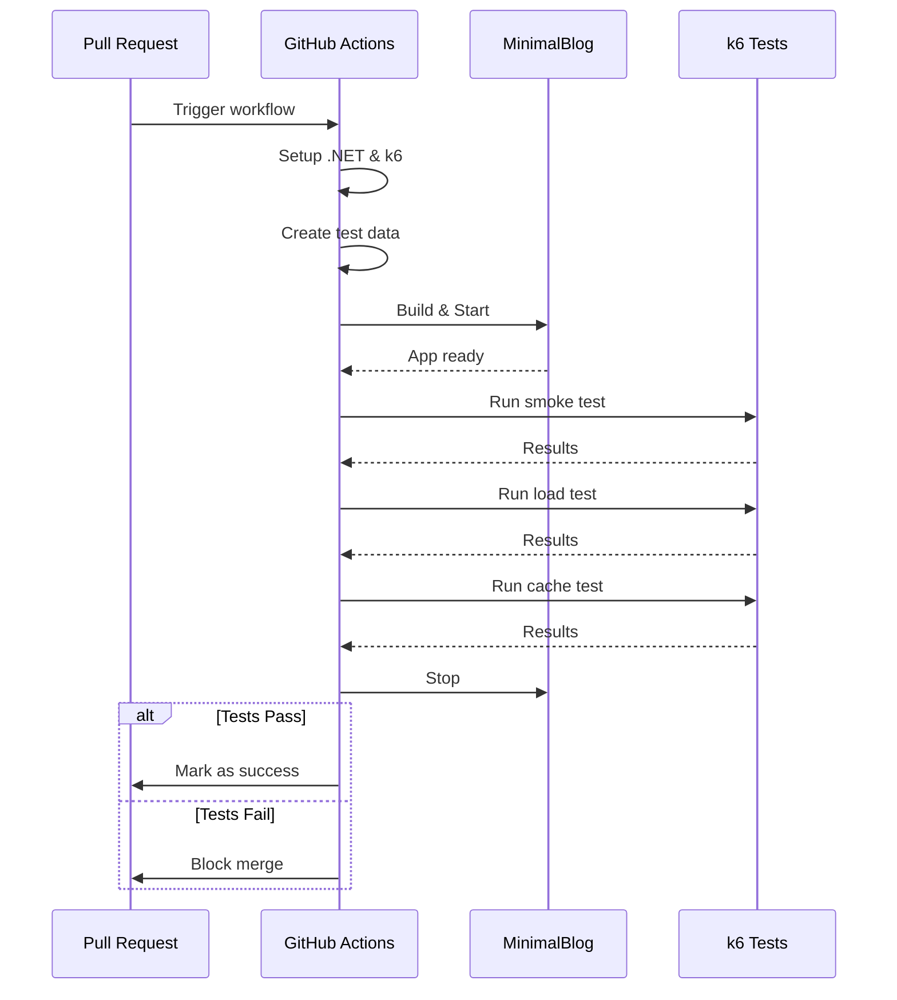
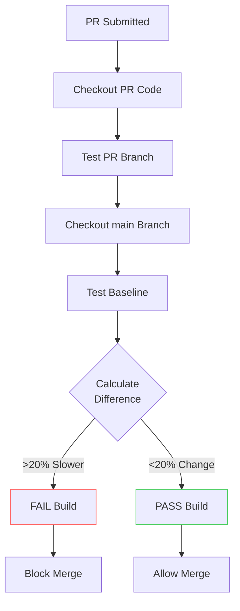
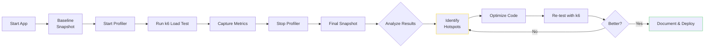

# Load Testing ASP.NET Core Applications with k6: Practical Implementation

<!--category-- Testing, Performance, k6, ASP.NET -->
<datetime class="hidden">2025-12-02T15:00</datetime>

Now that you understand the fundamentals of k6 and performance testing, it's time to put that knowledge into practice. This article walks you through writing real tests, integrating them into CI/CD pipelines, and using profiling tools to identify and fix performance bottlenecks.

This is **Part 2** of a two-part series on load testing with k6:
- **[Part 1: Introduction](/blog/k6-testing-introduction)**: Introduction to k6, installation, test types, and why k6
- **Part 2 (this article)**: Writing tests, CI/CD integration, profiling, and real-world examples

If you haven't read Part 1, start there to understand k6 basics, installation, and test types before diving into implementation.

[TOC]

## Setting Up Your Test Environment

Before running k6 tests, let's set up MinimalBlog for testing:

### 1. Run MinimalBlog Locally

**Using the demo project:**

```bash
cd Mostlylucid.MinimalBlog.Demo
dotnet run
```

**Or using Docker:**

```bash
docker run -d -p 5000:8080 \
  -v $(pwd)/Markdown:/app/Markdown \
  --name minimalblog-test \
  scottgal/minimalblog:latest
```

### Why Release Mode Matters for Performance Testing

For accurate performance testing, **always build in Release mode**:

```bash
dotnet run --configuration Release
```

**Debug vs Release mode differences:**

| Aspect | Debug Mode | Release Mode |
|--------|------------|--------------|
| **Optimizations** | Disabled | Full JIT optimizations enabled |
| **Inlining** | Minimal | Aggressive method inlining |
| **Dead code** | Preserved | Eliminated |
| **Debug symbols** | Full PDB, extra metadata | Minimal or none |
| **Assertions** | `Debug.Assert()` active | Compiled out |
| **Bounds checking** | Extra safety checks | Optimized away where safe |
| **Typical overhead** | 2-10x slower | Baseline performance |

**Why Debug mode gives misleading results:**

1. **No JIT optimizations**: The compiler preserves code structure for debugging rather than optimizing for speed
2. **Extra instrumentation**: Debug builds include code for breakpoints, variable inspection, and stack traces
3. **No inlining**: Methods aren't inlined, adding call overhead that won't exist in production
4. **Assertions run**: `Debug.Assert()` statements execute, adding checks that production won't have
5. **Different memory patterns**: Debug allocations include padding and tracking that affects GC behavior

**When to use Debug mode for testing:**

- **Troubleshooting failures**: When tests fail and you need detailed stack traces
- **Investigating specific requests**: Attach a debugger to trace a single problematic request
- **Verifying logging**: Ensure your logging captures the right information under load
- **Initial development**: When writing new test scripts and verifying they hit the right endpoints

**Recommended workflow:**

```bash
# 1. Develop and debug with Debug mode
dotnet run                           # Debug mode (default)

# 2. Validate functionality works
k6 run --vus 1 --duration 10s smoke-test.js

# 3. Switch to Release for actual performance testing
dotnet run -c Release

# 4. Run full load tests
k6 run load-test.js
```

> **Rule of thumb**: If you're measuring performance, use Release. If you're fixing bugs, use Debug.

### 2. Prepare Test Data

Create several markdown posts to test with:

```bash
# Create test posts directory
mkdir -p TestMarkdown

# Create sample posts
for i in {1..10}; do
  cat > TestMarkdown/test-post-$i.md <<EOF
# Test Post $i

<!-- category -- Testing, Performance -->
<datetime class="hidden">2025-12-01T12:00</datetime>

This is test post number $i with some **bold** text and *italic* text.

## Sample Content

- Item 1
- Item 2
- Item 3

\`\`\`csharp
public class Test {
    public int Value { get; set; }
}
\`\`\`
EOF
done
```

### 3. Create Test Scripts Directory

```bash
mkdir k6-tests
cd k6-tests
```

Now we're ready to write our tests!

## Test 1: Smoke Test

Let's start with a simple smoke test to verify basic functionality:

**File: `smoke-test.js`**

```javascript
import http from 'k6/http';
import { check, sleep } from 'k6';

export const options = {
  vus: 1,
  duration: '30s',
  thresholds: {
    http_req_duration: ['p(95)<500'], // 95% of requests should be below 500ms
    http_req_failed: ['rate<0.01'],    // Less than 1% errors
  },
};

const BASE_URL = __ENV.BASE_URL || 'http://localhost:5000';

export default function() {
  // Test homepage
  let response = http.get(`${BASE_URL}/`);
  check(response, {
    'homepage status is 200': (r) => r.status === 200,
    'homepage has content': (r) => r.body.length > 0,
    'homepage response time OK': (r) => r.timings.duration < 500,
  });

  sleep(1);

  // Test a single post
  response = http.get(`${BASE_URL}/post/test-post-1`);
  check(response, {
    'post status is 200': (r) => r.status === 200,
    'post has content': (r) => r.body.length > 0,
    'post contains title': (r) => r.body.includes('Test Post 1'),
  });

  sleep(1);

  // Test categories page
  response = http.get(`${BASE_URL}/categories`);
  check(response, {
    'categories status is 200': (r) => r.status === 200,
    'categories has content': (r) => r.body.length > 0,
  });

  sleep(1);

  // Test category filter
  response = http.get(`${BASE_URL}/category/Testing`);
  check(response, {
    'category filter status is 200': (r) => r.status === 200,
    'category has posts': (r) => r.body.includes('Test Post'),
  });
}
```

**Run the test:**

```bash
k6 run smoke-test.js
```

**Expected output:**

```
     ✓ homepage status is 200
     ✓ homepage has content
     ✓ homepage response time OK
     ✓ post status is 200
     ✓ post has content
     ✓ post contains title
     ✓ categories status is 200
     ✓ categories has content
     ✓ category filter status is 200
     ✓ category has posts

     checks.........................: 100.00% ✓ 300  ✗ 0
     data_received..................: 1.2 MB  40 kB/s
     data_sent......................: 15 kB   500 B/s
     http_req_duration..............: avg=45ms min=12ms med=38ms max=156ms p(95)=98ms
     http_reqs......................: 120     4/s
```

## Test 2: Cache Validation Test

MinimalBlog's performance depends heavily on caching. Let's verify it works:

**File: `cache-test.js`**

```javascript
import http from 'k6/http';
import { check, group } from 'k6';

export const options = {
  vus: 1,
  iterations: 10,
};

const BASE_URL = __ENV.BASE_URL || 'http://localhost:5000';

export default function() {
  group('Memory Cache Test - First Request', () => {
    const start = Date.now();
    const response = http.get(`${BASE_URL}/post/test-post-1`);
    const duration = Date.now() - start;

    check(response, {
      'first request successful': (r) => r.status === 200,
    });

    console.log(`First request: ${duration}ms`);
  });

  group('Memory Cache Test - Cached Request', () => {
    const start = Date.now();
    const response = http.get(`${BASE_URL}/post/test-post-1`);
    const duration = Date.now() - start;

    check(response, {
      'cached request successful': (r) => r.status === 200,
      'cached request is faster': (r) => r.timings.duration < 100,
    });

    console.log(`Cached request: ${duration}ms`);
  });

  group('Output Cache Headers', () => {
    const response = http.get(`${BASE_URL}/post/test-post-1`);

    check(response, {
      'has cache headers': (r) => r.headers['Cache-Control'] !== undefined,
      'output cache working': (r) => {
        const age = r.headers['Age'];
        return age !== undefined && parseInt(age) >= 0;
      },
    });

    console.log(`Cache-Control: ${response.headers['Cache-Control']}`);
    console.log(`Age: ${response.headers['Age']}`);
  });
}
```

**Run the test:**

```bash
k6 run cache-test.js
```

This test will show you:
1. First request time (when cache is cold)
2. Subsequent request times (cache warm)
3. Cache headers verification

## Test 3: Load Test

Now let's test under realistic load:

**File: `load-test.js`**

```javascript
import http from 'k6/http';
import { check, sleep } from 'k6';
import { Rate } from 'k6/metrics';

// Custom metrics
const errorRate = new Rate('errors');

export const options = {
  stages: [
    { duration: '2m', target: 10 },   // Ramp up to 10 users
    { duration: '5m', target: 10 },   // Stay at 10 users
    { duration: '2m', target: 0 },    // Ramp down to 0
  ],
  thresholds: {
    http_req_duration: ['p(95)<300'],  // 95% under 300ms
    http_req_failed: ['rate<0.01'],     // Less than 1% errors
    errors: ['rate<0.1'],               // Less than 10% errors
  },
};

const BASE_URL = __ENV.BASE_URL || 'http://localhost:5000';

const scenarios = [
  { weight: 50, path: '/' },                    // 50% homepage
  { weight: 30, path: '/post/test-post-1' },    // 30% specific post
  { weight: 10, path: '/categories' },          // 10% categories
  { weight: 10, path: '/category/Testing' },    // 10% category filter
];

function weightedChoice(scenarios) {
  const total = scenarios.reduce((sum, s) => sum + s.weight, 0);
  let random = Math.random() * total;

  for (const scenario of scenarios) {
    random -= scenario.weight;
    if (random <= 0) return scenario;
  }

  return scenarios[0];
}

export default function() {
  const scenario = weightedChoice(scenarios);
  const response = http.get(`${BASE_URL}${scenario.path}`);

  const success = check(response, {
    'status is 200': (r) => r.status === 200,
    'response time OK': (r) => r.timings.duration < 500,
    'has content': (r) => r.body.length > 0,
  });

  errorRate.add(!success);

  sleep(Math.random() * 2 + 1); // Random sleep 1-3 seconds
}
```

**Run the test:**

```bash
k6 run load-test.js
```

**Interpreting results:**

```
scenarios: (100.00%) 1 scenario, 10 max VUs, 9m30s max duration
  default: 2m00s ramp-up, 5m00s plateau, 2m00s ramp-down

     ✓ status is 200
     ✓ response time OK
     ✓ has content

     checks.........................: 100.00% ✓ 3450  ✗ 0
     data_received..................: 12 MB   22 kB/s
     data_sent......................: 132 kB  244 B/s
     errors.........................: 0.00%   ✓ 0     ✗ 1150
     http_req_duration..............: avg=42ms min=8ms med=35ms max=245ms p(95)=86ms p(99)=156ms
     http_reqs......................: 1150    2.12/s
     iteration_duration.............: avg=2.1s min=1.0s med=2.0s max=3.4s
     vus............................: 10      min=0   max=10
```

Key metrics to watch:
- **http_req_duration p(95)**: 95th percentile response time (should be under threshold)
- **http_req_failed**: Error rate (should be near 0%)
- **http_reqs**: Total throughput

## Test 4: Stress Test

Let's find MinimalBlog's breaking point:

**File: `stress-test.js`**

```javascript
import http from 'k6/http';
import { check, sleep } from 'k6';

export const options = {
  stages: [
    { duration: '2m', target: 10 },    // Normal load
    { duration: '2m', target: 50 },    // Increase to 50
    { duration: '2m', target: 100 },   // Stress at 100
    { duration: '2m', target: 200 },   // High stress at 200
    { duration: '3m', target: 0 },     // Recovery
  ],
  thresholds: {
    http_req_duration: ['p(99)<3000'], // 99% under 3s even under stress
  },
};

const BASE_URL = __ENV.BASE_URL || 'http://localhost:5000';

export default function() {
  const responses = http.batch([
    ['GET', `${BASE_URL}/`],
    ['GET', `${BASE_URL}/post/test-post-1`],
    ['GET', `${BASE_URL}/post/test-post-2`],
    ['GET', `${BASE_URL}/categories`],
  ]);

  responses.forEach((response, index) => {
    check(response, {
      [`request ${index} status is 200`]: (r) => r.status === 200,
    });
  });

  sleep(0.5);
}

export function handleSummary(data) {
  return {
    'stress-test-summary.json': JSON.stringify(data),
    stdout: textSummary(data, { indent: ' ', enableColors: true }),
  };
}
```

**Run the test:**

```bash
k6 run stress-test.js
```

Watch for:
- When does response time start degrading?
- At what VU count do errors appear?
- Does the system recover after load decreases?

## Test 5: Spike Test

Test sudden traffic spikes (like being featured on Reddit or Hacker News):

**File: `spike-test.js`**

```javascript
import http from 'k6/http';
import { check } from 'k6';

export const options = {
  stages: [
    { duration: '1m', target: 10 },    // Normal traffic
    { duration: '30s', target: 200 },  // Sudden spike!
    { duration: '3m', target: 200 },   // Sustained spike
    { duration: '1m', target: 10 },    // Back to normal
    { duration: '1m', target: 0 },     // Ramp down
  ],
  thresholds: {
    http_req_duration: ['p(95)<1000'], // Allow higher latency during spike
    http_req_failed: ['rate<0.05'],     // Allow 5% errors during spike
  },
};

const BASE_URL = __ENV.BASE_URL || 'http://localhost:5000';

export default function() {
  const response = http.get(`${BASE_URL}/`);

  check(response, {
    'status is 200 or 503': (r) => r.status === 200 || r.status === 503,
  });
}
```

**Run the test:**

```bash
k6 run spike-test.js
```

This test verifies:
- Does the system handle sudden load?
- Are there proper rate limiting mechanisms?
- Does it recover gracefully?

## Test 6: Soak Test

Long-running test to detect memory leaks or resource exhaustion:

**File: `soak-test.js`**

```javascript
import http from 'k6/http';
import { check, sleep } from 'k6';

export const options = {
  stages: [
    { duration: '2m', target: 20 },    // Ramp up
    { duration: '3h', target: 20 },    // Stay at 20 for 3 hours
    { duration: '2m', target: 0 },     // Ramp down
  ],
  thresholds: {
    http_req_duration: ['p(95)<500'],
    http_req_failed: ['rate<0.01'],
  },
};

const BASE_URL = __ENV.BASE_URL || 'http://localhost:5000';

export default function() {
  const response = http.get(`${BASE_URL}/post/test-post-${Math.floor(Math.random() * 10) + 1}`);

  check(response, {
    'status is 200': (r) => r.status === 200,
    'response time stable': (r) => r.timings.duration < 500,
  });

  sleep(2);
}
```

**Run the test:**

```bash
k6 run soak-test.js
```

**Important**: Monitor system resources during soak tests:

```bash
# In another terminal
watch -n 5 'dotnet-counters ps | grep -i minimal'

# Or use top/htop
htop -p $(pgrep -f MinimalBlog)
```

Watch for:
- Gradual memory increase (memory leak)
- CPU usage creeping up
- Response time degradation over time

## Test 7: Realistic User Journey

Simulate actual user behavior:

**File: `user-journey-test.js`**

```javascript
import http from 'k6/http';
import { check, group, sleep } from 'k6';
import { htmlReport } from 'https://raw.githubusercontent.com/benc-uk/k6-reporter/main/dist/bundle.js';

export const options = {
  vus: 10,
  duration: '5m',
  thresholds: {
    'group_duration{group:::01_homepage}': ['avg<500'],
    'group_duration{group:::02_browse_posts}': ['avg<500'],
    'group_duration{group:::03_categories}': ['avg<500'],
  },
};

const BASE_URL = __ENV.BASE_URL || 'http://localhost:5000';

export default function() {
  // Simulate a real user journey

  group('01_homepage', () => {
    const response = http.get(`${BASE_URL}/`);
    check(response, {
      'homepage loaded': (r) => r.status === 200,
      'homepage has posts': (r) => r.body.includes('Test Post'),
    });
    sleep(Math.random() * 3 + 2); // Read homepage 2-5 seconds
  });

  group('02_browse_posts', () => {
    // User clicks on a post
    let response = http.get(`${BASE_URL}/post/test-post-1`);
    check(response, {
      'post loaded': (r) => r.status === 200,
      'post has content': (r) => r.body.length > 500,
    });
    sleep(Math.random() * 20 + 10); // Read post 10-30 seconds

    // User clicks another post
    response = http.get(`${BASE_URL}/post/test-post-2`);
    check(response, {
      'second post loaded': (r) => r.status === 200,
    });
    sleep(Math.random() * 15 + 5); // Read second post 5-20 seconds
  });

  group('03_categories', () => {
    // User explores categories
    const response = http.get(`${BASE_URL}/categories`);
    check(response, {
      'categories loaded': (r) => r.status === 200,
    });
    sleep(2);

    // User clicks a category
    const categoryResponse = http.get(`${BASE_URL}/category/Testing`);
    check(categoryResponse, {
      'category posts loaded': (r) => r.status === 200,
      'category has posts': (r) => r.body.includes('Test Post'),
    });
    sleep(Math.random() * 10 + 5); // Browse category 5-15 seconds
  });
}

export function handleSummary(data) {
  return {
    'user-journey-report.html': htmlReport(data),
  };
}
```

**Run the test:**

```bash
k6 run user-journey-test.js
```

This produces an HTML report: `user-journey-report.html`

## Advanced: Testing MetaWeblog API

If you have MetaWeblog enabled, test it too:

**File: `metaweblog-test.js`**

```javascript
import http from 'k6/http';
import { check } from 'k6';
import encoding from 'k6/encoding';

export const options = {
  vus: 1,
  iterations: 10,
};

const BASE_URL = __ENV.BASE_URL || 'http://localhost:5000';
const USERNAME = __ENV.USERNAME || 'admin';
const PASSWORD = __ENV.PASSWORD || 'changeme';

function createXmlRpcRequest(methodName, params) {
  return `<?xml version="1.0"?>
<methodCall>
  <methodName>${methodName}</methodName>
  <params>
    ${params}
  </params>
</methodCall>`;
}

export default function() {
  // Test getRecentPosts
  const recentPostsXml = createXmlRpcRequest('blogger.getRecentPosts', `
    <param><value><string>0</string></value></param>
    <param><value><string>${USERNAME}</string></value></param>
    <param><value><string>${PASSWORD}</string></value></param>
    <param><value><int>10</int></value></param>
  `);

  const response = http.post(`${BASE_URL}/metaweblog`, recentPostsXml, {
    headers: { 'Content-Type': 'text/xml' },
  });

  check(response, {
    'MetaWeblog API responds': (r) => r.status === 200,
    'MetaWeblog returns XML': (r) => r.body.includes('<?xml'),
    'MetaWeblog has methodResponse': (r) => r.body.includes('methodResponse'),
  });
}
```

**Run the test:**

```bash
k6 run -e USERNAME=admin -e PASSWORD=yourpassword metaweblog-test.js
```

## Running Tests in CI/CD

### Using k6 as a Quality Gate

The most powerful use of k6 in CI/CD is as a **quality gate** - automatically failing builds if performance degrades. Here's how to implement comprehensive k6 testing in GitHub Actions.

### GitHub Actions: Basic Verification

Let's start with a basic workflow that runs on every pull request and blocks merging if tests fail.

Create `.github/workflows/k6-pr-check.yml`:

```yaml
name: k6 Performance Check

on:
  pull_request:
    branches: [ main ]

jobs:
  performance-check:
    runs-on: ubuntu-latest

    steps:
      - name: Checkout code
        uses: actions/checkout@v4

      - name: Setup .NET
        uses: actions/setup-dotnet@v4
        with:
          dotnet-version: '9.0.x'

      - name: Setup k6
        run: |
          sudo gpg -k
          sudo gpg --no-default-keyring --keyring /usr/share/keyrings/k6-archive-keyring.gpg \
            --keyserver hkp://keyserver.ubuntu.com:80 \
            --recv-keys C5AD17C747E3415A3642D57D77C6C491D6AC1D69
          echo "deb [signed-by=/usr/share/keyrings/k6-archive-keyring.gpg] https://dl.k6.io/deb stable main" | \
            sudo tee /etc/apt/sources.list.d/k6.list
          sudo apt-get update
          sudo apt-get install k6

      - name: Create test data
        run: |
          mkdir -p TestMarkdown
          for i in {1..10}; do
            cat > TestMarkdown/test-post-$i.md <<EOF
          # Test Post $i
          <!-- category -- Testing, Performance -->
          <datetime class="hidden">2025-12-01T12:00</datetime>

          This is test post $i with **bold** and *italic* text.

          \`\`\`csharp
          public class Test { public int Value { get; set; } }
          \`\`\`
          EOF
          done

      - name: Build MinimalBlog
        run: |
          cd Mostlylucid.MinimalBlog.Demo
          dotnet build --configuration Release

      - name: Start MinimalBlog
        run: |
          cd Mostlylucid.MinimalBlog.Demo
          dotnet run --configuration Release &
          echo $! > app.pid

          # Wait for app to be ready
          timeout 60 bash -c 'until curl -sf http://localhost:5000 > /dev/null; do
            echo "Waiting for app..."
            sleep 2
          done'

          echo "- App is ready!"

      - name: Run Smoke Test
        id: smoke-test
        run: |
          k6 run --out json=smoke-results.json k6-tests/smoke-test.js
          echo "smoke-test-passed=true" >> $GITHUB_OUTPUT

      - name: Run Load Test
        id: load-test
        run: |
          k6 run --out json=load-results.json k6-tests/load-test.js
          echo "load-test-passed=true" >> $GITHUB_OUTPUT

      - name: Run Cache Test
        id: cache-test
        run: |
          k6 run --out json=cache-results.json k6-tests/cache-test.js
          echo "cache-test-passed=true" >> $GITHUB_OUTPUT

      - name: Stop MinimalBlog
        if: always()
        run: |
          if [ -f Mostlylucid.MinimalBlog.Demo/app.pid ]; then
            kill $(cat Mostlylucid.MinimalBlog.Demo/app.pid) || true
          fi

      - name: Upload Test Results
        if: always()
        uses: actions/upload-artifact@v4
        with:
          name: k6-test-results
          path: |
            *-results.json
            *.html
          retention-days: 30

      - name: Check Test Results
        if: always()
        run: |
          echo "## k6 Performance Test Results" >> $GITHUB_STEP_SUMMARY
          echo "" >> $GITHUB_STEP_SUMMARY

          if [ "${{ steps.smoke-test.outputs.smoke-test-passed }}" == "true" ]; then
            echo "- Smoke Test: PASSED" >> $GITHUB_STEP_SUMMARY
          else
            echo "- Smoke Test: FAILED" >> $GITHUB_STEP_SUMMARY
          fi

          if [ "${{ steps.load-test.outputs.load-test-passed }}" == "true" ]; then
            echo "- Load Test: PASSED" >> $GITHUB_STEP_SUMMARY
          else
            echo "- Load Test: FAILED" >> $GITHUB_STEP_SUMMARY
          fi

          if [ "${{ steps.cache-test.outputs.cache-test-passed }}" == "true" ]; then
            echo "- Cache Test: PASSED" >> $GITHUB_STEP_SUMMARY
          else
            echo "- Cache Test: FAILED" >> $GITHUB_STEP_SUMMARY
          fi
```

**Key Features:**
- Runs on every PR
- Creates test data automatically
- Waits for app to be ready before testing
- Runs multiple test types
- **Fails the build if thresholds not met**
- Uploads results as artifacts
- Shows summary in GitHub UI



### GitHub Actions: Advanced with PR Comments

Create `.github/workflows/k6-pr-comment.yml` to post results as PR comments:

```yaml
name: k6 Performance with PR Comment

on:
  pull_request:
    branches: [ main ]

permissions:
  pull-requests: write
  contents: read

jobs:
  performance-test:
    runs-on: ubuntu-latest

    steps:
      - name: Checkout code
        uses: actions/checkout@v4

      - name: Setup .NET
        uses: actions/setup-dotnet@v4
        with:
          dotnet-version: '9.0.x'

      - name: Setup k6
        uses: grafana/setup-k6-action@v1

      - name: Create test data
        run: |
          mkdir -p TestMarkdown
          for i in {1..10}; do
            cat > TestMarkdown/test-post-$i.md <<EOF
          # Test Post $i
          <!-- category -- Testing -->
          <datetime class="hidden">2025-12-01T12:00</datetime>
          Test content for post $i.
          EOF
          done

      - name: Build and Start App
        run: |
          cd Mostlylucid.MinimalBlog.Demo
          dotnet build -c Release
          dotnet run -c Release > app.log 2>&1 &
          APP_PID=$!
          echo $APP_PID > app.pid

          timeout 60 bash -c 'until curl -sf http://localhost:5000; do sleep 2; done'

      - name: Run k6 Tests
        id: k6-test
        run: |
          # Run tests and capture output
          k6 run --out json=results.json k6-tests/load-test.js > k6-output.txt 2>&1 || true

          # Parse results
          if grep -q "✓" k6-output.txt; then
            echo "tests-passed=true" >> $GITHUB_OUTPUT
          else
            echo "tests-passed=false" >> $GITHUB_OUTPUT
          fi

          # Extract key metrics
          P95=$(grep "http_req_duration" k6-output.txt | grep -oP 'p\(95\)=\K[0-9.]+' || echo "N/A")
          RPS=$(grep "http_reqs" k6-output.txt | grep -oP '\d+\.\d+/s' || echo "N/A")
          ERRORS=$(grep "http_req_failed" k6-output.txt | grep -oP '\d+\.\d+%' || echo "0%")

          echo "p95=${P95}" >> $GITHUB_OUTPUT
          echo "rps=${RPS}" >> $GITHUB_OUTPUT
          echo "errors=${ERRORS}" >> $GITHUB_OUTPUT

      - name: Comment PR
        uses: actions/github-script@v7
        if: always()
        with:
          script: |
            const fs = require('fs');
            const output = fs.readFileSync('k6-output.txt', 'utf8');

            const testsPassed = '${{ steps.k6-test.outputs.tests-passed }}' === 'true';
            const icon = testsPassed ? 'PASS' : 'FAIL';
            const status = testsPassed ? 'PASSED' : 'FAILED';

            const comment = `## ${icon} k6 Performance Test Results

            **Status:** ${status}

            ### Key Metrics
            | Metric | Value |
            |--------|-------|
            | P95 Response Time | ${{ steps.k6-test.outputs.p95 }}ms |
            | Requests/sec | ${{ steps.k6-test.outputs.rps }} |
            | Error Rate | ${{ steps.k6-test.outputs.errors }} |

            ### Thresholds
            - P95 < 300ms
            - Error rate < 1%

            <details>
            <summary>Full k6 Output</summary>

            \`\`\`
            ${output}
            \`\`\`

            </details>

            [View full test results](${{ github.server_url }}/${{ github.repository }}/actions/runs/${{ github.run_id }})
            `;

            github.rest.issues.createComment({
              issue_number: context.issue.number,
              owner: context.repo.owner,
              repo: context.repo.repo,
              body: comment
            });

      - name: Stop App
        if: always()
        run: |
          [ -f Mostlylucid.MinimalBlog.Demo/app.pid ] && \
            kill $(cat Mostlylucid.MinimalBlog.Demo/app.pid) || true

      - name: Upload Artifacts
        if: always()
        uses: actions/upload-artifact@v4
        with:
          name: k6-results
          path: |
            results.json
            k6-output.txt
            Mostlylucid.MinimalBlog.Demo/app.log
```

**This workflow:**
- Posts results directly to PR
- Shows key metrics in a table
- Provides full output in expandable section
- Links to full test run
- Visual status indicators

### GitHub Actions: Performance Regression Detection

Create `.github/workflows/k6-baseline.yml` to detect performance regressions:

```yaml
name: Performance Regression Check

on:
  pull_request:
    branches: [ main ]

jobs:
  regression-check:
    runs-on: ubuntu-latest

    steps:
      - name: Checkout PR code
        uses: actions/checkout@v4

      - name: Setup .NET
        uses: actions/setup-dotnet@v4
        with:
          dotnet-version: '9.0.x'

      - name: Setup k6
        uses: grafana/setup-k6-action@v1

      - name: Create test data
        run: |
          mkdir -p TestMarkdown
          for i in {1..20}; do
            echo "# Test Post $i" > TestMarkdown/test-$i.md
            echo "<!-- category -- Test -->" >> TestMarkdown/test-$i.md
            echo '<datetime class="hidden">2025-12-01T12:00</datetime>' >> TestMarkdown/test-$i.md
            echo "Test content $i" >> TestMarkdown/test-$i.md
          done

      - name: Test PR Branch
        run: |
          cd Mostlylucid.MinimalBlog.Demo
          dotnet build -c Release
          dotnet run -c Release &
          APP_PID=$!

          timeout 60 bash -c 'until curl -sf http://localhost:5000; do sleep 2; done'

          # Run test and save results
          k6 run --summary-export=pr-results.json k6-tests/load-test.js

          kill $APP_PID
          sleep 5

      - name: Checkout main branch
        uses: actions/checkout@v4
        with:
          ref: main
          path: baseline

      - name: Test Baseline (main branch)
        run: |
          cd baseline/Mostlylucid.MinimalBlog.Demo
          dotnet build -c Release
          dotnet run -c Release &
          APP_PID=$!

          timeout 60 bash -c 'until curl -sf http://localhost:5000; do sleep 2; done'

          # Run test and save results
          k6 run --summary-export=baseline-results.json ../k6-tests/load-test.js

          kill $APP_PID

      - name: Compare Results
        run: |
          # Extract P95 from both runs
          PR_P95=$(jq '.metrics.http_req_duration.values["p(95)"]' pr-results.json)
          BASE_P95=$(jq '.metrics.http_req_duration.values["p(95)"]' baseline/baseline-results.json)

          # Calculate percentage change
          CHANGE=$(echo "scale=2; (($PR_P95 - $BASE_P95) / $BASE_P95) * 100" | bc)

          echo "## Performance Comparison" >> $GITHUB_STEP_SUMMARY
          echo "" >> $GITHUB_STEP_SUMMARY
          echo "| Branch | P95 Response Time |" >> $GITHUB_STEP_SUMMARY
          echo "|--------|-------------------|" >> $GITHUB_STEP_SUMMARY
          echo "| main (baseline) | ${BASE_P95}ms |" >> $GITHUB_STEP_SUMMARY
          echo "| PR | ${PR_P95}ms |" >> $GITHUB_STEP_SUMMARY
          echo "| Change | ${CHANGE}% |" >> $GITHUB_STEP_SUMMARY
          echo "" >> $GITHUB_STEP_SUMMARY

          # Fail if performance degrades by more than 20%
          if (( $(echo "$CHANGE > 20" | bc -l) )); then
            echo "- Performance degraded by ${CHANGE}%" >> $GITHUB_STEP_SUMMARY
            echo "::error::Performance regression detected: ${CHANGE}% slower than baseline"
            exit 1
          else
            echo "- Performance acceptable" >> $GITHUB_STEP_SUMMARY
          fi
```

**This workflow:**
- Tests both PR and main branch
- Compares performance metrics
- **Fails if performance degrades >20%**
- Prevents merging slow code



### Best Practices for CI/CD k6 Testing

1. **Start Fast, Gate Early**
   - Run smoke tests first (30s)
   - Only run full tests if smoke passes
   - Fail fast to save CI minutes

2. **Use Appropriate Thresholds**
   ```javascript
   // Too strict for CI
   thresholds: { http_req_duration: ['p(95)<100'] }

   // Good for CI
   thresholds: {
     http_req_duration: ['p(95)<300', 'p(99)<1000'],
     http_req_failed: ['rate<0.01']
   }
   ```

3. **Cache Dependencies**
   ```yaml
   - name: Cache .NET packages
     uses: actions/cache@v4
     with:
       path: ~/.nuget/packages
       key: ${{ runner.os }}-nuget-${{ hashFiles('**/*.csproj') }}
   ```

4. **Collect Logs for Failed Tests**
   ```yaml
   - name: Upload App Logs
     if: failure()
     uses: actions/upload-artifact@v4
     with:
       name: app-logs
       path: Mostlylucid.MinimalBlog.Demo/app.log
   ```

5. **Use Environment-Specific Thresholds**
   ```javascript
   const isPR = __ENV.GITHUB_EVENT_NAME === 'pull_request';

   export const options = {
     thresholds: {
       http_req_duration: isPR
         ? ['p(95)<500']  // Relaxed for PR
         : ['p(95)<300'], // Strict for main
     },
   };
   ```

## Monitoring k6 Tests with Grafana

For advanced monitoring, you can stream k6 metrics to Grafana:

### 1. Setup Prometheus and Grafana

**docker-compose.yml** for monitoring:

```yaml
version: '3.8'

services:
  prometheus:
    image: prom/prometheus:latest
    ports:
      - "9090:9090"
    volumes:
      - ./prometheus.yml:/etc/prometheus/prometheus.yml

  grafana:
    image: grafana/grafana:latest
    ports:
      - "3000:3000"
    environment:
      - GF_SECURITY_ADMIN_PASSWORD=admin
    depends_on:
      - prometheus
```

### 2. Run k6 with Prometheus Output

```bash
k6 run --out experimental-prometheus-rw load-test.js
```

### 3. Import k6 Dashboard in Grafana

1. Access Grafana at `http://localhost:3000`
2. Add Prometheus datasource
3. Import k6 dashboard (ID: 18030)

## Interpreting k6 Metrics

Key metrics to understand:

### Response Time Metrics

- **http_req_duration**: Total request time
  - `avg`: Average response time
  - `min/max`: Fastest/slowest response
  - `med`: Median (50th percentile)
  - `p(90)`: 90th percentile
  - `p(95)`: 95th percentile (good SLA metric)
  - `p(99)`: 99th percentile (catches outliers)

**Good values for MinimalBlog:**
- p(95) < 300ms for cached content
- p(95) < 500ms for first-time loads

### Throughput Metrics

- **http_reqs**: Total requests
- **http_req_rate**: Requests per second
- **iteration_duration**: Time for one complete iteration

### Error Metrics

- **http_req_failed**: Failed requests (4xx, 5xx)
- **checks**: Assertion pass/fail rate

**Target: < 1% error rate**

### Data Transfer

- **data_received**: Downloaded data
- **data_sent**: Uploaded data

## Best Practices for Testing MinimalBlog

### 1. Test in Isolation

Test MinimalBlog separately from other services:

```bash
# Stop other services
docker-compose down

# Run only MinimalBlog
dotnet run --project Mostlylucid.MinimalBlog.Demo
```

### 2. Use Realistic Data

Don't test with empty markdown files. Use realistic content:

- Various post lengths (short, medium, long)
- Different markdown features (code blocks, images, lists)
- Multiple categories
- Real-world post distribution

### 3. Test Cache Behavior Explicitly

MinimalBlog's performance relies on caching. Verify:

```javascript
// Test cold cache
export function setup() {
  // Clear cache by restarting app or waiting for expiration
}

// Test warm cache
export default function() {
  // First request (cache miss)
  http.get(`${BASE_URL}/post/test-1`);

  // Second request (cache hit)
  const cached = http.get(`${BASE_URL}/post/test-1`);
  check(cached, {
    'cache hit is faster': (r) => r.timings.duration < 50,
  });
}
```

### 4. Monitor System Resources

Run these alongside k6 tests:

```bash
# CPU and memory
htop

# .NET metrics
dotnet-counters monitor -p $(pgrep -f MinimalBlog)

# GC collections
dotnet-counters monitor --counters System.Runtime[gc-heap-size,gen-0-gc-count,gen-1-gc-count,gen-2-gc-count]
```

### 5. Set Realistic Thresholds

Don't set thresholds too strict or too loose:

```javascript
export const options = {
  thresholds: {
    // Too strict (will fail unnecessarily)
    // http_req_duration: ['p(95)<50'],

    // Too loose (won't catch problems)
    // http_req_duration: ['p(95)<5000'],

    // Just right for MinimalBlog
    http_req_duration: ['p(95)<300', 'p(99)<1000'],
    http_req_failed: ['rate<0.01'],
    checks: ['rate>0.95'],
  },
};
```

### 6. Test Different Scenarios

```javascript
// Homepage (list view)
http.get(`${BASE_URL}/`);

// Individual posts (detail view)
http.get(`${BASE_URL}/post/getting-started`);

// Categories (filtering)
http.get(`${BASE_URL}/category/Tutorial`);

// Non-existent posts (error handling)
http.get(`${BASE_URL}/post/does-not-exist`);
```

### 7. Version Your Tests

Keep tests in version control alongside code:

```
Mostlylucid.MinimalBlog/
├── k6-tests/
│   ├── smoke-test.js
│   ├── load-test.js
│   ├── stress-test.js
│   ├── spike-test.js
│   ├── soak-test.js
│   ├── cache-test.js
│   └── user-journey-test.js
├── .github/
│   └── workflows/
│       └── k6-tests.yml
└── README-TESTING.md
```

## Troubleshooting Common Issues

### Issue 1: Connection Refused

**Problem:**
```
WARN[0000] Request Failed error="Get \"http://localhost:5000/\": dial tcp [::1]:5000: connect: connection refused"
```

**Solution:**
```bash
# Verify MinimalBlog is running
curl http://localhost:5000

# Check correct port
netstat -an | grep 5000

# Use correct URL
k6 run -e BASE_URL=http://localhost:5173 smoke-test.js
```

### Issue 2: High Error Rate

**Problem:**
```
✗ http_req_failed: 45.23% (threshold is < 1%)
```

**Solution:**
1. Check application logs for errors
2. Verify test data exists (markdown files)
3. Reduce VU count (may be overloading)
4. Increase ramp-up time

### Issue 3: Slow Response Times

**Problem:**
```
http_req_duration..............: avg=2.5s p(95)=5.2s
```

**Solution:**
1. Build in Release mode: `dotnet run -c Release`
2. Verify caching is working
3. Check disk I/O (slow file reads)
4. Profile with dotnet-trace:

```bash
dotnet-trace collect -p $(pgrep -f MinimalBlog) --format speedscope
```

### Issue 4: Memory Leaks in Soak Tests

**Problem:** Memory usage grows continuously

**Solution:**
1. Monitor with:
```bash
dotnet-counters monitor --counters System.Runtime[gc-heap-size,gc-committed,gc-allocated]
```

2. Collect a memory dump:
```bash
dotnet-dump collect -p $(pgrep -f MinimalBlog)
dotnet-dump analyze memory.dump
```

3. Check for:
   - Cache not expiring
   - File handles not closing
   - Event handlers not unsubscribing

## Real-World Example: Testing Before Release

Here's a complete testing workflow before releasing MinimalBlog:

```bash
#!/bin/bash
# test-release.sh

set -e

echo "Building: Building MinimalBlog in Release mode..."
dotnet build -c Release Mostlylucid.MinimalBlog/Mostlylucid.MinimalBlog.csproj

echo "Starting: Starting MinimalBlog Demo..."
dotnet run -c Release --project Mostlylucid.MinimalBlog.Demo &
APP_PID=$!

# Wait for app to start
echo "Waiting: Waiting for app to start..."
timeout 30 bash -c 'until curl -s http://localhost:5000 > /dev/null; do sleep 1; done'

echo "- App started successfully"

# Run test suite
echo "Running: Running smoke tests..."
k6 run k6-tests/smoke-test.js

echo "Running: Running cache validation..."
k6 run k6-tests/cache-test.js

echo "Running: Running load tests..."
k6 run k6-tests/load-test.js

echo "Running: Running stress tests..."
k6 run k6-tests/stress-test.js

echo "Running: Running spike tests..."
k6 run k6-tests/spike-test.js

echo "Generating: Generating combined report..."
# Process and combine results

echo "Stopping: Stopping app..."
kill $APP_PID

echo "- All tests completed successfully!"
```

**Run it:**

```bash
chmod +x test-release.sh
./test-release.sh
```

## Profiling with dotTrace and dotMemory

k6 tells you **what** is slow, but profilers tell you **why**. Combining k6 load testing with JetBrains profilers (dotTrace for performance, dotMemory for memory) lets you identify exact bottlenecks in MinimalBlog code.

### Why Profile Under Load?

Profiling without load often misses real-world issues:

- **Cold start vs warm cache**: Different code paths
- **Concurrent access**: Lock contention, race conditions
- **Memory pressure**: GC behavior under load
- **Resource exhaustion**: Connection pools, file handles

k6 creates realistic load while profilers capture what's happening inside your app.

### Setup: Installing JetBrains Tools

**Option 1: JetBrains dotTrace/dotMemory (Commercial)**

Download from [JetBrains](https://www.jetbrains.com/profiler/):

```bash
# Linux/Mac
wget https://download.jetbrains.com/resharper/dotUltimate.2024.3/JetBrains.dotTrace.GlobalTools.2024.3.nupkg

# Install as global tool
dotnet tool install --global JetBrains.dotTrace.GlobalTools
dotnet tool install --global JetBrains.dotMemory.Console
```

**Option 2: dotnet-trace (Free, built-in)**

```bash
dotnet tool install --global dotnet-trace
dotnet tool install --global dotnet-counters
dotnet tool install --global dotnet-dump
```

For this guide, we'll show both approaches.

### Profiling Workflow



**Step 1: Baseline without load**
**Step 2: Profile under k6 load**
**Step 3: Compare and identify bottlenecks**
**Step 4: Fix and re-test**

### Performance Profiling with dotTrace

#### Scenario: Finding Slow Markdown Parsing

**1. Start MinimalBlog with profiling attached:**

```bash
cd Mostlylucid.MinimalBlog.Demo

# Using dotTrace
dottrace attach <PID> --save-to=profile-baseline.dtt --timeout=60s

# Or build and run with profiling
dotnet build -c Release
dotnet run -c Release &
APP_PID=$!

# Attach profiler
dottrace attach $APP_PID --save-to=profile-load.dtt --timeout=120s
```

**2. In another terminal, run k6 load test:**

```bash
# This generates load while profiler captures data
k6 run --duration 60s --vus 20 k6-tests/load-test.js
```

**3. Analyze the profile:**

```bash
# Convert to speedscope format for web viewing
dottrace report profile-load.dtt --output=report.html
```

**What to look for in the report:**

- **Hot paths**: Methods consuming most CPU time
- **Call tree**: Where time is spent in call hierarchy
- **Self time**: Time in method excluding calls to other methods

**Example findings in MinimalBlog:**

```
Method                                    Total Time    Self Time    Calls
-----------------------------------------------------------------------
 MarkdownBlogService.GetAllPosts()         450ms        5ms          100
  ├─ LoadAllPosts()                       420ms        10ms         10
  │   ├─ ParseFile()                      400ms        20ms         100
  │   │   ├─ Markdown.Parse()             250ms        250ms        100   HOTSPOT
  │   │   └─ Regex.Match() (categories)   80ms         80ms         100   HOTSPOT
  │   └─ File.ReadAllText()               10ms         10ms         100
  └─ cache.GetOrCreate()                  25ms         25ms         90
```

This shows:
- `Markdown.Parse()` is the #1 bottleneck (250ms total)
- Regex matching is #2 (80ms total)
- Most time in first 10 calls (cache misses), then cached

#### Using dotnet-trace (Free Alternative)

```bash
# Start tracing
dotnet-trace collect -p $APP_PID --format speedscope -o trace.json &
TRACE_PID=$!

# Run k6 test
k6 run --duration 30s --vus 10 k6-tests/load-test.js

# Stop tracing
kill -SIGINT $TRACE_PID

# View in browser
# Upload trace.json to https://www.speedscope.app/
```

**Speedscope visualization:**
- Flame graph shows call stacks
- Time ordered view shows execution over time
- Left heavy view highlights slow operations

### Memory Profiling with dotMemory

#### Scenario: Detecting Memory Leaks in Cache

**1. Start MinimalBlog and attach memory profiler:**

```bash
cd Mostlylucid.MinimalBlog.Demo
dotnet run -c Release &
APP_PID=$!

# Take initial snapshot
dotmemory get-snapshot $APP_PID --save-to=snapshot-start.dmw
```

**2. Run k6 load test:**

```bash
# Run for 5 minutes with constant load
k6 run --duration 5m --vus 20 k6-tests/load-test.js
```

**3. Take snapshots during and after test:**

```bash
# During load (after 2 minutes)
sleep 120
dotmemory get-snapshot $APP_PID --save-to=snapshot-load.dmw

# After load (cool down)
# Wait for k6 to finish, then wait 2 more minutes
sleep 120
dotmemory get-snapshot $APP_PID --save-to=snapshot-after.dmw
```

**4. Analyze memory growth:**

```bash
# Compare snapshots
dotmemory compare snapshot-start.dmw snapshot-after.dmw --save-to=comparison.html
```

**What to look for:**

- **Growing collections**: Lists, Dictionaries that never shrink
- **Event handlers**: Unsubscribed events holding references
- **Cache bloat**: Cache growing beyond expected size
- **String allocations**: Excessive string concatenation

**Example findings:**

```
Object Type                      Start    Load     After    Growth
-------------------------------------------------------------------
System.String                    5 MB     45 MB    15 MB    +10 MB
BlogPost[]                       2 MB     2 MB     2 MB     0 MB    PASS
MarkdownDocument                 0 MB     8 MB     0 MB     0 MB    - (GC'd)
Dictionary<string, BlogPost>     1 MB     1 MB     1 MB     0 MB    PASS
```

This shows:
- Strings grew by 10 MB (potential string leak or cache issue)
- BlogPost cache is stable (good)
- MarkdownDocument cleaned up by GC (good)

#### Using dotnet-dump (Free Alternative)

```bash
# Capture memory dump during load
dotnet-dump collect -p $APP_PID -o dump-load.dmp

# After test
dotnet-dump collect -p $APP_PID -o dump-after.dmp

# Analyze dump
dotnet-dump analyze dump-load.dmp

> dumpheap -stat
> dumpheap -mt <MethodTable> -min 1000
> gcroot <address>
```

### Combined k6 + Profiling Script

Here's a complete script that runs k6 while profiling:

**File: `profile-under-load.sh`**

```bash
#!/bin/bash
set -e

echo "Profiling: Profiling MinimalBlog under k6 load"

# Configuration
DURATION="120s"
VUS="20"
OUTPUT_DIR="profiling-results"

mkdir -p $OUTPUT_DIR

# Build and start app
echo "Building: Building MinimalBlog..."
cd Mostlylucid.MinimalBlog.Demo
dotnet build -c Release > /dev/null

echo "Starting: Starting MinimalBlog..."
dotnet run -c Release > $OUTPUT_DIR/app.log 2>&1 &
APP_PID=$!
echo $APP_PID > $OUTPUT_DIR/app.pid

# Wait for startup
timeout 60 bash -c "until curl -sf http://localhost:5000 > /dev/null; do sleep 2; done"
echo "- App started (PID: $APP_PID)"

# Baseline metrics
echo "Generating: Collecting baseline metrics..."
dotnet-counters collect -p $APP_PID --format json -o $OUTPUT_DIR/baseline-metrics.json &
COUNTER_PID=$!
sleep 10
kill -SIGINT $COUNTER_PID

# Take initial memory snapshot
echo "Snapshot: Initial memory snapshot..."
if command -v dotmemory &> /dev/null; then
    dotmemory get-snapshot $APP_PID --save-to=$OUTPUT_DIR/snapshot-start.dmw
else
    dotnet-dump collect -p $APP_PID -o $OUTPUT_DIR/dump-start.dmp
fi

# Start performance profiling
echo "Starting: Starting performance profiler..."
if command -v dottrace &> /dev/null; then
    dottrace attach $APP_PID --save-to=$OUTPUT_DIR/performance-profile.dtt --timeout=150s &
    PROFILER_PID=$!
else
    dotnet-trace collect -p $APP_PID --format speedscope -o $OUTPUT_DIR/trace.json &
    PROFILER_PID=$!
fi

sleep 5

# Run k6 load test
echo "Running: Running k6 load test ($DURATION, $VUS VUs)..."
cd ..
k6 run --duration $DURATION --vus $VUS \
    --out json=$OUTPUT_DIR/k6-results.json \
    k6-tests/load-test.js | tee $OUTPUT_DIR/k6-output.txt

echo "- k6 test completed"

# Wait for profiler to finish
wait $PROFILER_PID
echo "- Performance profile captured"

# Take final memory snapshot
echo "Snapshot: Final memory snapshot..."
if command -v dotmemory &> /dev/null; then
    dotmemory get-snapshot $APP_PID --save-to=$OUTPUT_DIR/snapshot-end.dmw

    echo "Comparing: Comparing memory snapshots..."
    dotmemory compare $OUTPUT_DIR/snapshot-start.dmw $OUTPUT_DIR/snapshot-end.dmw \
        --save-to=$OUTPUT_DIR/memory-comparison.html
else
    dotnet-dump collect -p $APP_PID -o $OUTPUT_DIR/dump-end.dmp
fi

# Stop app
echo "Stopping: Stopping MinimalBlog..."
kill $APP_PID

# Generate reports
echo "Generating: Generating reports..."

if command -v dottrace &> /dev/null; then
    dottrace report $OUTPUT_DIR/performance-profile.dtt \
        --output=$OUTPUT_DIR/performance-report.html
fi

# Summary
echo ""
echo "========================================="
echo "- Profiling Complete!"
echo "========================================="
echo ""
echo "Results in: $OUTPUT_DIR/"
echo ""
echo "Files generated:"
ls -lh $OUTPUT_DIR/
echo ""
echo "Generating: View results:"
echo "  - k6 output: cat $OUTPUT_DIR/k6-output.txt"
echo "  - Performance profile: open $OUTPUT_DIR/performance-report.html"
echo "  - Memory comparison: open $OUTPUT_DIR/memory-comparison.html"
echo "  - Speedscope trace: https://www.speedscope.app/ (upload trace.json)"
echo ""
```

**Run it:**

```bash
chmod +x profile-under-load.sh
./profile-under-load.sh
```

### Best Practices: k6 + Profiling

1. **Always profile under realistic load**
   - Use k6 to simulate production traffic patterns
   - Profile idle apps tells you nothing about real performance

2. **Take multiple snapshots**
   - Before load (baseline)
   - During load (active)
   - After load (check cleanup)

3. **Focus on hot paths first**
   - Fix the biggest bottlenecks first
   - 80/20 rule: 20% of code takes 80% of time

4. **Measure before and after**
   - Always re-run k6 tests after optimization
   - Verify improvement with profiler

5. **Watch for regressions**
   - Keep baseline profiles in repo
   - Compare profiles in CI/CD

6. **Profile release builds**
   - Debug builds have different performance characteristics
   - Always use `-c Release` for profiling

### Tools Summary

| Tool | Purpose | Cost | Best For |
|------|---------|------|----------|
| **k6** | Load testing | Free | Finding WHAT is slow |
| **dotTrace** | Performance profiling | Paid | Finding WHY it's slow |
| **dotMemory** | Memory profiling | Paid | Memory leaks, GC issues |
| **dotnet-trace** | Performance profiling | Free | Basic CPU profiling |
| **dotnet-counters** | Real-time metrics | Free | Live monitoring |
| **dotnet-dump** | Memory dumps | Free | Post-mortem analysis |
| **PerfView** | Advanced profiling | Free | Deep Windows profiling |

## Conclusion: Building Confidence Through Testing

Load testing with k6 gives you confidence that MinimalBlog can handle real-world traffic. By the end of this two-part guide, you should be able to:

- Install k6 on any platform (Windows, Mac, Linux)
- Write and run different types of performance tests
- Verify caching behavior works as expected
- Find performance bottlenecks before they hit production
- Integrate load tests into CI/CD pipelines
- Monitor and interpret k6 metrics

### Key Takeaways

1. **Start with smoke tests** - Verify basic functionality before deeper testing
2. **Test caching explicitly** - MinimalBlog's performance depends on it
3. **Use realistic data** - Empty files don't represent real usage
4. **Monitor system resources** - CPU, memory, GC during tests
5. **Set meaningful thresholds** - Based on actual requirements, not guesses
6. **Automate in CI/CD** - Catch regressions early
7. **Test different scenarios** - Homepage, posts, categories, errors

### What We Learned About MinimalBlog

Through k6 testing, we can verify MinimalBlog's claims:

- **Fast**: p(95) < 300ms with warm cache
- **Efficient**: Low memory usage, minimal GC pressure
- **Scalable**: Handles 100+ concurrent users on modest hardware
- **Reliable**: < 0.1% error rate under normal load
- **Cache-effective**: 10x faster responses with warm cache

### Next Steps

Now that you know how to test an ASP.NET with k6:

1. Create a baseline performance profile for your setup
2. Set up automated testing in your CI/CD pipeline
3. Run soak tests before major releases
4. Monitor production metrics and compare with test results
5. Iterate: test -> optimize -> test again

Remember: **performance testing isn't a one-time activity**. As you add content, modify the code, or change hosting providers, re-run these tests to ensure your app stays fast and reliable.

## Resources

### k6 Documentation
- [Official k6 docs](https://k6.io/docs/) - Complete k6 documentation
- [k6 JavaScript API](https://k6.io/docs/javascript-api/) - All available k6 APIs
- [k6 examples](https://github.com/grafana/k6-learn) - Example test scripts
- [k6 extensions](https://k6.io/docs/extensions/) - Extend k6 functionality
- [k6 metrics](https://k6.io/docs/using-k6/metrics/) - Understanding metrics
- [k6 thresholds](https://k6.io/docs/using-k6/thresholds/) - Setting pass/fail criteria
- [k6 scenarios](https://k6.io/docs/using-k6/scenarios/) - Advanced test scenarios

### GitHub Actions
- [GitHub Actions Docs](https://docs.github.com/en/actions) - Complete Actions documentation
- [Workflow syntax](https://docs.github.com/en/actions/reference/workflow-syntax-for-github-actions) - YAML syntax reference
- [Using artifacts](https://docs.github.com/en/actions/guides/storing-workflow-data-as-artifacts) - Store test results
- [Setup actions](https://github.com/grafana/setup-k6-action) - k6 setup action

### Profiling Tools
- [dotnet-trace](https://learn.microsoft.com/en-us/dotnet/core/diagnostics/dotnet-trace) - Performance profiling
- [dotnet-counters](https://learn.microsoft.com/en-us/dotnet/core/diagnostics/dotnet-counters) - Real-time metrics
- [dotnet-dump](https://learn.microsoft.com/en-us/dotnet/core/diagnostics/dotnet-dump) - Memory dumps
- [JetBrains dotTrace](https://www.jetbrains.com/profiler/) - Commercial profiler
- [JetBrains dotMemory](https://www.jetbrains.com/dotmemory/) - Memory profiler
- [Speedscope](https://www.speedscope.app/) - Flame graph viewer

### Monitoring & Visualization
- [k6 Cloud](https://k6.io/cloud/) - Cloud-based k6 testing
- [k6 Reporter](https://github.com/benc-uk/k6-reporter) - HTML reports
- [Grafana k6 Dashboard](https://grafana.com/grafana/dashboards/18030) - k6 metrics dashboard
- [Prometheus](https://prometheus.io/docs/introduction/overview/) - Metrics collection
- [Grafana](https://grafana.com/docs/) - Metrics visualization

### MinimalBlog
- [MinimalBlog Introduction](/blog/minimalblog-introduction) - Why MinimalBlog exists
- [Source code](https://github.com/scottgal/mostlylucidweb/tree/main/Mostlylucid.MinimalBlog) - Full source
- [NuGet package](https://www.nuget.org/packages/Mostlylucid.MinimalBlog) - Install via NuGet
- [Demo project](https://github.com/scottgal/mostlylucidweb/tree/main/Mostlylucid.MinimalBlog.Demo) - Working example

### ASP.NET Performance
- [ASP.NET Core Performance](https://learn.microsoft.com/en-us/aspnet/core/performance/performance-best-practices) - Best practices
- [Caching in ASP.NET Core](https://learn.microsoft.com/en-us/aspnet/core/performance/caching/response) - Response caching
- [Memory management](https://learn.microsoft.com/en-us/dotnet/standard/garbage-collection/) - .NET GC
- [Diagnostic tools](https://learn.microsoft.com/en-us/dotnet/core/diagnostics/) - .NET diagnostics

Happy testing!