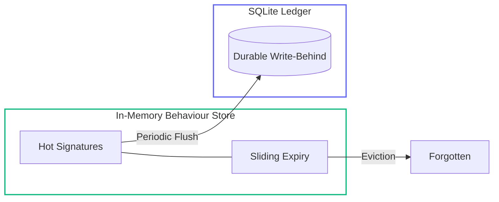
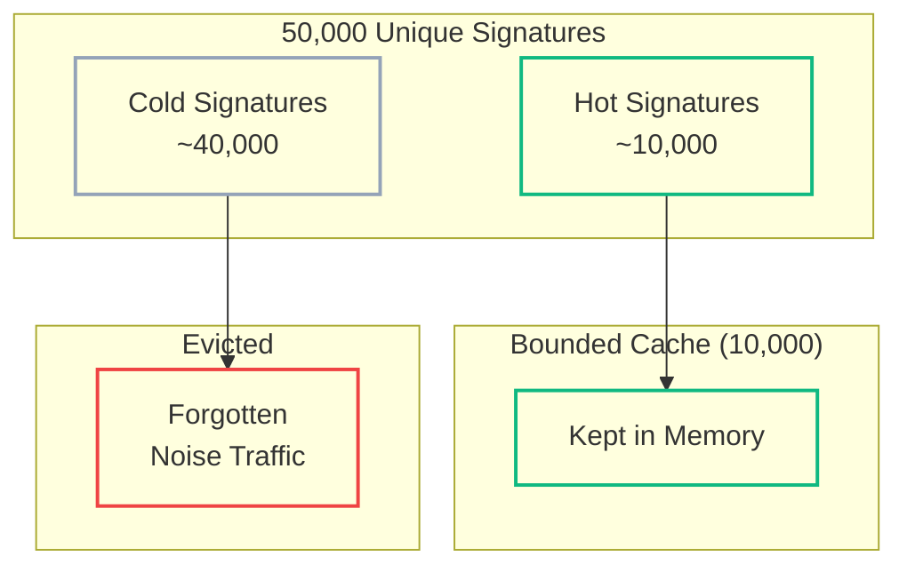
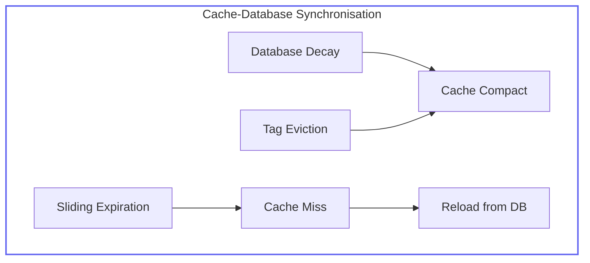

# Learning LRUs — When Exceeding Capacity Makes Your System Better

<!--category-- ASP.NET, Architecture, CQRS, Bot Detection, Caching, Systems Design -->
<datetime class="hidden">2025-12-09T12:00</datetime>

Most systems degrade when overloaded. Memory fills up, queries slow down, users complain, servers crash.

A few unusual ones get *better*.

This article shows how an **LRU-based behavioural memory** becomes self-optimising when it hits capacity — and how this pattern powers the learning system in my [bot detection engine](/blog/botdetection-introduction). This is also the smallest possible version of [DiSE architecture](/blog/dise-architecture-overview) — controlled evolution through resource pressure.

If you've read my article on [CQRS and Event Sourcing](/blog/moderncqrsandeventsourcing), you'll recognise some of the patterns here. But this is CQRS stripped to the bone — no event store, no projections, no Marten. Just a memory cache, a background worker, and SQLite.

[TOC]

## The Basic Idea — Behavioural Memory on a Budget

Before we dive in, let me define one term I'll use throughout: **signature**. A signature is any stable key that represents a behaviour pattern — a hash of IP + User-Agent, a fingerprint of header combinations, a detector's classification of "this request looks like X". The cache stores these signatures along with learned weights that evolve over time.

What if you could build a system that:
- Responds in under 1ms
- Never blocks on database writes
- Self-optimises under pressure
- Forgets what doesn't matter
- Remembers what does

That's exactly what `IMemoryCache` with sliding expiration gives you — if you understand what you're building.

### What an LRU Cache Actually Does

LRU (Least Recently Used) caches evict entries that haven't been accessed recently. When the cache fills up, the coldest entries get thrown out to make room for hot ones.

Most developers see this as a limitation. *"Oh no, my cache is full, data is being lost!"*

But for behavioural systems, this is a feature.

```csharp
// From WeightStore.cs - the bounded memory window
_cache = new MemoryCache(new MemoryCacheOptions
{
    SizeLimit = _cacheSize,           // e.g., 1000 entries
    CompactionPercentage = 0.25       // Remove 25% when limit reached
});
```

That `SizeLimit` isn't just a memory constraint. It's a **selection pressure**. It determines how much the system "remembers" and forces it to focus on what matters.

### Sliding Expiration — The Clock That Forgets

Combined with sliding expiration, you get automatic forgetting:

```csharp
// From WeightStore.cs:254-259
private MemoryCacheEntryOptions GetCacheEntryOptions()
{
    return new MemoryCacheEntryOptions()
        .SetSlidingExpiration(_slidingExpiration)  // 30 minutes
        .SetSize(1);  // Each entry counts as 1 toward size limit
}
```

If a signature isn't accessed within 30 minutes, it's evicted. Not because it's wrong — because it's no longer relevant.

This creates **natural forgetting**:
- IPs get reassigned
- Bots rotate signatures
- Traffic patterns shift
- Yesterday's attacks aren't today's

Static blocklists go stale. Sliding expiration keeps the memory fresh.

## The IMemoryCache Pattern — Tiny CQRS Without Saying CQRS

Here's the pattern that makes it work. From the `SqliteWeightStore` class:

```csharp
/// <summary>
///     SQLite implementation of the weight store with sliding expiration memory cache.
///     Uses a CQRS-style pattern with write-behind:
///     - Reads: Hit memory cache first (fast path), fall back to SQLite on miss
///     - Writes: Update cache immediately, queue SQLite writes for background flush
///     Sliding expiration provides automatic LRU-like eviction behavior.
/// </summary>
public class SqliteWeightStore : IWeightStore, IAsyncDisposable
{
    // Memory cache with sliding expiration - auto-evicts least recently used entries
    private readonly MemoryCache _cache;

    // Write-behind queue for batched SQLite persistence
    private readonly ConcurrentDictionary<string, PendingWrite> _pendingWrites = new();
    private readonly Timer _flushTimer;
    private readonly TimeSpan _flushInterval = TimeSpan.FromMilliseconds(500);
```

This is [informal CQRS](/blog/moderncqrsandeventsourcing#part-2-the-half-assed-approach-cache-invalidation) — but without the tedious cache invalidation. Instead of invalidating cache entries after writes, **the cache IS the write model**. SQLite is just the durable ledger.



Key insight: **reads and writes go to memory**. The database is eventually consistent — and that's fine.

## The Read Path — Cache First, Always

When a detector needs a learned weight, it hits the cache:

```csharp
// From WeightStore.cs:421-472
public async Task<double> GetWeightAsync(
    string signatureType,
    string signature,
    CancellationToken ct = default)
{
    var key = CacheKey(signatureType, signature);

    // Check cache first (fast path - no DB access)
    if (_cache.TryGetValue(key, out LearnedWeight? cached) && cached != null)
    {
        _metrics?.RecordCacheHit(signatureType);
        return cached.Weight * cached.Confidence;
    }

    _metrics?.RecordCacheMiss(signatureType);

    // Cache miss - load from DB
    await EnsureInitializedAsync(ct);

    await using var conn = new SqliteConnection(_connectionString);
    await conn.OpenAsync(ct);

    var sql = $@"
        SELECT weight, confidence, observation_count, first_seen, last_seen
        FROM {TableName}
        WHERE signature_type = @type AND signature = @sig
    ";

    // ... execute query ...

    if (await reader.ReadAsync(ct))
    {
        // Cache the result for future reads
        var learnedWeight = new LearnedWeight { /* ... */ };
        _cache.Set(key, learnedWeight, GetCacheEntryOptions());

        return weight * confidence;
    }

    return 0.0;  // No learned weight exists
}
```

Hot paths **never hit the database**. The cache is the source of truth for reads. SQLite is just backup storage.

## The Write Path — Cache Immediately, Persist Later

When the system learns something new, it updates the cache immediately and queues the database write:

```csharp
// From WeightStore.cs:551-582
public Task UpdateWeightAsync(
    string signatureType,
    string signature,
    double weight,
    double confidence,
    int observationCount,
    CancellationToken ct = default)
{
    var key = CacheKey(signatureType, signature);

    // Update cache immediately (source of truth for reads)
    var learnedWeight = new LearnedWeight
    {
        SignatureType = signatureType,
        Signature = signature,
        Weight = weight,
        Confidence = confidence,
        ObservationCount = observationCount,
        FirstSeen = DateTimeOffset.UtcNow,
        LastSeen = DateTimeOffset.UtcNow
    };
    _cache.Set(key, learnedWeight, GetCacheEntryOptions());

    // Queue for async SQLite persistence (write-behind)
    QueueWrite(signatureType, signature, weight, confidence, observationCount);

    return Task.CompletedTask;
}
```

Notice: `UpdateWeightAsync` returns `Task.CompletedTask` — it's essentially synchronous. The write is queued, not executed. This means:
- Sub-millisecond write latency
- No blocking on I/O
- Writes are coalesced (last write wins)

## The Background Flusher — 500ms of Boring Magic

Every 500ms, pending writes are flushed to SQLite in a single batch:

```csharp
// From WeightStore.cs:274-357
public async Task FlushPendingWritesAsync(CancellationToken ct = default)
{
    if (_pendingWrites.IsEmpty) return;

    // Only one flush at a time
    if (!await _flushLock.WaitAsync(0, ct)) return;

    try
    {
        await EnsureInitializedAsync(ct);

        // Snapshot and clear pending writes atomically
        var writes = new List<PendingWrite>();
        foreach (var key in _pendingWrites.Keys.ToList())
        {
            if (_pendingWrites.TryRemove(key, out var write))
            {
                writes.Add(write);
            }
        }

        if (writes.Count == 0) return;

        await using var conn = new SqliteConnection(_connectionString);
        await conn.OpenAsync(ct);
        await using var transaction = await conn.BeginTransactionAsync(ct);

        try
        {
            var sql = $@"
                INSERT INTO {TableName}
                    (signature_type, signature, weight, confidence,
                     observation_count, first_seen, last_seen)
                VALUES (@type, @sig, @weight, @conf, @count, @now, @now)
                ON CONFLICT(signature_type, signature) DO UPDATE SET
                    weight = @weight,
                    confidence = @conf,
                    observation_count = @count,
                    last_seen = @now
            ";

            foreach (var write in writes)
            {
                await using var cmd = new SqliteCommand(sql, conn, transaction);
                // ... add parameters and execute ...
            }

            await transaction.CommitAsync(ct);
            _logger.LogDebug("Flushed {Count} pending writes in {Duration:F1}ms",
                writes.Count, sw.ElapsedMilliseconds);
        }
        catch
        {
            await transaction.RollbackAsync(ct);
            throw;
        }
    }
    finally
    {
        _flushLock.Release();
    }
}
```

This is **event-sourcing-light**. You get:
- Batched writes (efficient I/O)
- Transactional consistency
- Coalesced updates (if the same signature is updated 10 times in 500ms, only the final value is written)
- SQLite is perfectly happy with this access pattern

## EMA Updates — Learning with Exponential Moving Averages

When a new observation arrives, the system uses exponential moving averages to update weights:

```csharp
// From WeightStore.cs:584-635
public Task RecordObservationAsync(
    string signatureType,
    string signature,
    bool wasBot,
    double detectionConfidence,
    CancellationToken ct = default)
{
    var key = CacheKey(signatureType, signature);

    // Calculate new weight using EMA in memory
    var alpha = 0.1;  // Learning rate
    var weightDelta = wasBot ? detectionConfidence : -detectionConfidence;

    double newWeight;
    double newConfidence;
    int newObservationCount;

    if (_cache.TryGetValue(key, out LearnedWeight? existing) && existing != null)
    {
        // Apply EMA: new_weight = old_weight * (1-α) + delta * α
        newWeight = existing.Weight * (1 - alpha) + weightDelta * alpha;
        newConfidence = Math.Min(1.0, existing.Confidence + detectionConfidence * 0.01);
        newObservationCount = existing.ObservationCount + 1;
    }
    else
    {
        // First observation
        newWeight = weightDelta;
        newConfidence = detectionConfidence;
        newObservationCount = 1;
    }

    // Update cache immediately
    var learnedWeight = new LearnedWeight
    {
        SignatureType = signatureType,
        Signature = signature,
        Weight = newWeight,
        Confidence = newConfidence,
        ObservationCount = newObservationCount,
        FirstSeen = existing?.FirstSeen ?? DateTimeOffset.UtcNow,
        LastSeen = DateTimeOffset.UtcNow
    };
    _cache.Set(key, learnedWeight, GetCacheEntryOptions());

    // Queue for persistence
    QueueWrite(signatureType, signature, newWeight, newConfidence, newObservationCount);

    return Task.CompletedTask;
}
```

The EMA formula smooths learning: `new_weight = old_weight × (1 - α) + new_value × α`

With α = 0.1:
- New evidence contributes 10%
- Historical evidence contributes 90%
- This prevents wild swings from single observations

## Why Overflow Makes the System *Better*

Here's the key insight that most people miss.

When the cache fills up:
- Low-frequency signatures fall out
- Only hot (frequently accessed) signatures stay in memory
- The database lags by one flush cycle — and that's fine
- The system **focuses** under pressure

Think about it: if 50,000 unique signatures hit your bot detector, but you only have memory for 10,000, which signatures matter?

**The hottest 10,000** — which typically represent 99% of actual traffic.

In production, I see roughly 40,000 one-off signatures per day (scrapers trying once, random probes, legitimate users who never return) and maybe 5–10,000 that recur constantly. Those 5–10,000 are where 99% of the risk lives. The long-tail signatures? Noise. Evicting them doesn't hurt detection accuracy — it might even improve it by reducing false positives from low-confidence patterns.



Overflow **sharpens** the behavioural memory. The system self-optimises.

### When Overflow Doesn't Help

This isn't magic. There are edge cases where LRU pressure works against you:

- **Cache too small**: If your cache only holds 100 entries but you have 1,000 genuinely important signatures, you'll churn constantly and lose useful patterns before they accumulate enough evidence. Size your cache to comfortably hold your "hot set".

- **Uniform traffic**: If you're running on a tiny internal system where almost everything is "hot" (few unique signatures, all recurring), overflow gives you less benefit. The selection pressure has nothing to select against.

- **Cold-start problem**: A freshly deployed system has no learned weights. Everything is equally cold. The first few hours will have higher false positive rates until the hot signatures establish themselves.

The pattern works best when you have **high cardinality with power-law distribution** — lots of unique signatures, but a small subset that dominates traffic. That's exactly what bot detection traffic looks like.

## Keeping Cache and Database in Sync — Tag-Based Invalidation

The cache is the source of truth for reads, but the database is the durable ledger. What happens when they drift?

### Decay Synchronisation

When database weights decay, the cache needs to follow. The `DecayOldWeightsAsync` method handles both:

```csharp
// From WeightStore.cs:725-766
public async Task DecayOldWeightsAsync(TimeSpan maxAge, double decayFactor, CancellationToken ct = default)
{
    await EnsureInitializedAsync(ct);

    await using var conn = new SqliteConnection(_connectionString);
    await conn.OpenAsync(ct);

    var cutoff = DateTimeOffset.UtcNow.Subtract(maxAge).ToString("O");

    // Decay old weights in the database
    var sql = $@"
        UPDATE {TableName}
        SET weight = weight * @decay,
            confidence = confidence * @decay
        WHERE last_seen < @cutoff
    ";

    await using var cmd = new SqliteCommand(sql, conn);
    cmd.Parameters.AddWithValue("@decay", decayFactor);
    cmd.Parameters.AddWithValue("@cutoff", cutoff);

    var updated = await cmd.ExecuteNonQueryAsync(ct);

    // Delete weights that have decayed below threshold
    var deleteSql = $@"
        DELETE FROM {TableName}
        WHERE confidence < 0.01 OR (ABS(weight) < 0.01 AND observation_count < 5)
    ";

    await using var deleteCmd = new SqliteCommand(deleteSql, conn);
    var deleted = await deleteCmd.ExecuteNonQueryAsync(ct);

    if (updated > 0 || deleted > 0)
    {
        _logger.LogInformation(
            "Weight decay: {Updated} decayed, {Deleted} deleted",
            updated, deleted);

        // Compact cache to remove stale entries
        _cache.Compact(0.25);
    }
}
```

After decaying database records, we call `_cache.Compact(0.25)` — this forces the `MemoryCache` to evict 25% of its entries, prioritising the least recently used. The next read will reload fresh values from the database.

### Tag-Based Eviction

Sometimes you need to invalidate a whole category of cached entries — for example, when retraining a detector or when external data changes:

```csharp
// From WeightStore.cs:768-777
/// <summary>
///     Evicts all cached entries for a specific signature type (tag-based eviction).
/// </summary>
public void EvictByTag(string signatureType)
{
    // MemoryCache doesn't natively support tag-based eviction, but we can compact
    // For now, just compact - sliding expiration will handle stale entries
    _cache.Compact(0.1);
    _logger.LogDebug("Compacted cache for signature type: {SignatureType}", signatureType);
}
```

.NET's `MemoryCache` doesn't have native tag-based eviction like Redis, but compaction achieves the same effect: force out stale entries, let reads repopulate from the database.

### The Synchronisation Strategy

The key insight is that **perfect sync isn't necessary**. The system tolerates drift because:

1. **Cache misses reload from DB** — if an entry is evicted, the next read fetches fresh data
2. **Sliding expiration handles staleness** — entries not accessed within 30 minutes auto-evict
3. **Compaction forces renewal** — periodic compaction pushes out old entries
4. **Write-behind coalesces updates** — multiple rapid updates become one DB write

This is eventual consistency done right. The cache stays "close enough" to the database without requiring complex invalidation logic.



No cache invalidation hell. No complex pub/sub. Just compaction and natural expiration.

## Going Deeper: The Reputation System

> **Note:** If you just wanted the LRU + write-behind pattern, you can stop here. The rest of this article shows how I apply the same ideas to full pattern reputation — state machines, hysteresis, and time decay. It's the "extra mile" for those building adaptive systems.

### Hysteresis and Decay

For pattern reputation (tracking whether a signature is bot or human over time), the same principles apply but with additional sophistication:

```csharp
// From PatternReputation.cs:42-108
public record PatternReputation
{
    public required string PatternId { get; init; }
    public required string PatternType { get; init; }
    public required string Pattern { get; init; }

    /// <summary>Current bot probability [0,1]. 0 = human, 1 = bot, 0.5 = neutral</summary>
    public double BotScore { get; init; } = 0.5;

    /// <summary>Effective sample count - decays over time, increases with observations</summary>
    public double Support { get; init; } = 0;

    /// <summary>Current reputation state - determines fast-path behavior</summary>
    public ReputationState State { get; init; } = ReputationState.Neutral;

    // Computed properties
    public double Confidence => Math.Min(1.0, Support / 100.0);

    public bool CanTriggerFastAbort =>
        State is ReputationState.ConfirmedBad or ReputationState.ManuallyBlocked;

    public bool CanTriggerFastAllow =>
        State is ReputationState.ConfirmedGood or ReputationState.ManuallyAllowed;
}
```

### State Transitions with Hysteresis

Patterns don't flip directly from Neutral to ConfirmedBad. There's hysteresis to prevent flapping:

```csharp
// From PatternReputation.cs:367-421 - simplified
public PatternReputation EvaluateStateChange(PatternReputation reputation)
{
    if (reputation.IsManual)
        return reputation;

    var newState = reputation.State;
    var score = reputation.BotScore;
    var support = reputation.Support;

    switch (reputation.State)
    {
        case ReputationState.Neutral:
            // Can promote to Suspect or ConfirmedGood
            if (score >= 0.6 && support >= 10)
                newState = ReputationState.Suspect;
            else if (score <= 0.1 && support >= 100)
                newState = ReputationState.ConfirmedGood;
            break;

        case ReputationState.Suspect:
            // Can promote to ConfirmedBad or demote to Neutral
            if (score >= 0.9 && support >= 50)
                newState = ReputationState.ConfirmedBad;
            else if (score <= 0.4 || support < 10)
                newState = ReputationState.Neutral;
            break;

        case ReputationState.ConfirmedBad:
            // Can demote to Suspect (requires MORE evidence to forgive)
            if (score <= 0.7 && support >= 100)
                newState = ReputationState.Suspect;
            break;
    }

    // ... log state change and return ...
}
```

Note the asymmetry: it's easier to get blocked than unblocked. `ConfirmedBad → Suspect` requires 100 support, while `Neutral → Suspect` only needs 10. This is intentional — it's harder to forgive than to suspect.

### Time Decay — Exponential Forgetting

When patterns go quiet, they decay toward neutral:

```csharp
// From PatternReputation.cs:334-361
public PatternReputation ApplyTimeDecay(PatternReputation reputation)
{
    if (reputation.IsManual)
        return reputation;

    var hoursSinceLastSeen = (DateTimeOffset.UtcNow - reputation.LastSeen).TotalHours;

    if (hoursSinceLastSeen < 1)
        return reputation;  // Too recent to decay

    // Score decay toward prior (0.5 = neutral)
    // new_score = old_score + (prior - old_score) × (1 - e^(-Δt/τ))
    var scoreDecayFactor = 1 - Math.Exp(-hoursSinceLastSeen / _options.ScoreDecayTauHours);
    var newScore = reputation.BotScore + (0.5 - reputation.BotScore) * scoreDecayFactor;

    // Support decay
    // new_support = old_support × e^(-Δt/τ)
    var supportDecayFactor = Math.Exp(-hoursSinceLastSeen / _options.SupportDecayTauHours);
    var newSupport = reputation.Support * supportDecayFactor;

    return reputation with
    {
        BotScore = Math.Clamp(newScore, 0, 1),
        Support = newSupport
    };
}
```

The default time constants:
- **Score decay τ**: 168 hours (7 days) — scores move 63% toward neutral after a week of inactivity
- **Support decay τ**: 336 hours (14 days) — confidence drops 63% after two weeks

This means a confirmed-bad IP that goes quiet for a month will eventually drop back to Neutral. Not because it reformed — because its evidence became stale.

## The Background Maintenance Service

The `ReputationMaintenanceService` runs three periodic tasks:

```csharp
// From ReputationMaintenanceService.cs:48-129
protected override async Task ExecuteAsync(CancellationToken stoppingToken)
{
    _logger.LogInformation("Reputation maintenance service starting");

    // Load persisted reputations on startup
    await _cache.LoadAsync(stoppingToken);

    var decayInterval = TimeSpan.FromMinutes(60);    // Hourly decay sweep
    var gcInterval = TimeSpan.FromHours(24);          // Daily garbage collection
    var persistInterval = TimeSpan.FromMinutes(5);   // Persist every 5 minutes

    var lastDecay = DateTimeOffset.UtcNow;
    var lastGc = DateTimeOffset.UtcNow;
    var lastPersist = DateTimeOffset.UtcNow;

    while (!stoppingToken.IsCancellationRequested)
    {
        await Task.Delay(TimeSpan.FromMinutes(1), stoppingToken);
        var now = DateTimeOffset.UtcNow;

        // Decay sweep: push stale scores toward neutral
        if (now - lastDecay >= decayInterval)
        {
            await _cache.DecaySweepAsync(stoppingToken);
            lastDecay = now;
        }

        // Garbage collection: remove old neutral patterns
        if (now - lastGc >= gcInterval)
        {
            await _cache.GarbageCollectAsync(stoppingToken);
            lastGc = now;

            var stats = _cache.GetStats();
            _logger.LogInformation(
                "Reputation stats: {Total} patterns, {Bad} bad, {Suspect} suspect",
                stats.TotalPatterns, stats.ConfirmedBadCount, stats.SuspectCount);
        }

        // Persistence: save to SQLite
        if (now - lastPersist >= persistInterval)
        {
            await _cache.PersistAsync(stoppingToken);
            lastPersist = now;
        }
    }

    // Final persist on shutdown
    await _cache.PersistAsync(CancellationToken.None);
}
```

The garbage collector removes patterns that are:
- 90+ days old
- Support ≤ 1.0
- In Neutral state

This prevents the in-memory dictionary from growing unbounded while preserving valuable learned patterns.

## SQLite is Not a Joke — It's Perfect Here

A lot of developers reflexively reach for PostgreSQL or Redis. But for this pattern, SQLite is ideal:

1. **Write-behind eliminates bottlenecks** — SQLite's single-writer limitation doesn't matter when writes are batched
2. **Local storage** — no network latency, no connection pools
3. **Zero configuration** — just a file path
4. **Perfect for edge deployment** — runs on a Raspberry Pi
5. **Portable** — the database is just a file you can copy around

The schema is minimal:

```sql
CREATE TABLE IF NOT EXISTS learned_weights (
    signature_type TEXT NOT NULL,
    signature TEXT NOT NULL,
    weight REAL NOT NULL,
    confidence REAL NOT NULL,
    observation_count INTEGER NOT NULL DEFAULT 1,
    first_seen TEXT NOT NULL,
    last_seen TEXT NOT NULL,
    PRIMARY KEY (signature_type, signature)
);

CREATE INDEX IF NOT EXISTS idx_signature_type ON learned_weights(signature_type);
CREATE INDEX IF NOT EXISTS idx_confidence ON learned_weights(confidence);
CREATE INDEX IF NOT EXISTS idx_last_seen ON learned_weights(last_seen);
```

If you need bigger scale, swap to PostgreSQL. If you need HA or replication, swap to Redis or a distributed cache. The architecture doesn't change — just the connection string. SQLite is the default for edge deployment, not a religion.

## The DiSE Tie-In — Failure as Evolution

If [DiSE](/blog/dise-architecture-overview) is the full evolutionary engine, this cache pattern is the mitochondria — the smallest piece that still behaves like evolution under constraint.

This pattern implements DiSE principles at the most minimal level:

- **Resource constraint** → Selection pressure
- **LRU eviction** → Natural selection (survivors are the fittest)
- **Time decay** → Forgetting enables adaptation
- **EMA updates** → Mutation through observation
- **Hysteresis** → Stability through resistance to change

A full cache isn't a failure. It's **evolutionary pressure**. The system self-optimises: hot signatures stay, cold signatures evict, and the behavioural memory converges toward what actually matters.

No ML training. No external models. Just architecture that behaves like a living system.

## Conclusion — Simple Structures, Emergent Behaviour

The entire pattern boils down to:

1. **Cache is the source of truth for reads** — sub-millisecond access
2. **Writes update cache immediately, persist later** — no blocking I/O
3. **Sliding expiration provides automatic LRU** — built into .NET
4. **Bounded size creates selection pressure** — overflow sharpens focus
5. **Background flush keeps SQLite in sync** — eventual consistency is fine
6. **Time decay enables forgetting** — stale evidence disappears

Your small behavioural store acts more like a living system than CRUD. It remembers what matters, forgets what doesn't, and gets better under pressure.

Minimal architecture → emergent correctness.
Overflow → better focus.
Pressure → stability.

If you want to see this in action, check out [mostlylucid.botdetection](/blog/botdetection-introduction) — and the [DiSE architecture series](/blog/dise-architecture-overview) for the deeper philosophy.

## Links

- [Bot Detection Introduction](/blog/botdetection-introduction) — the system that uses these patterns
- [DiSE Architecture Overview](/blog/dise-architecture-overview) — controlled evolution through pressure
- [Modern CQRS and Event Sourcing](/blog/moderncqrsandeventsourcing) — the full pattern (when you need it)
- [GitHub: mostlylucid.botdetection](https://github.com/scottgal/mostlylucid.nugetpackages) — full source code
- [NuGet Package](https://www.nuget.org/packages/mostlylucid.botdetection/) — install it
