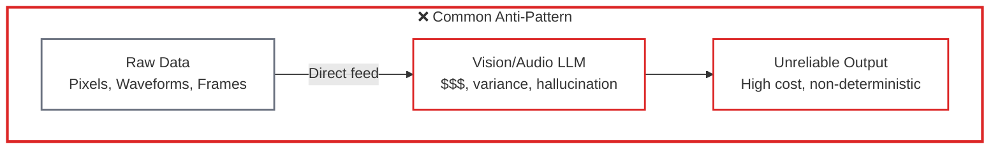
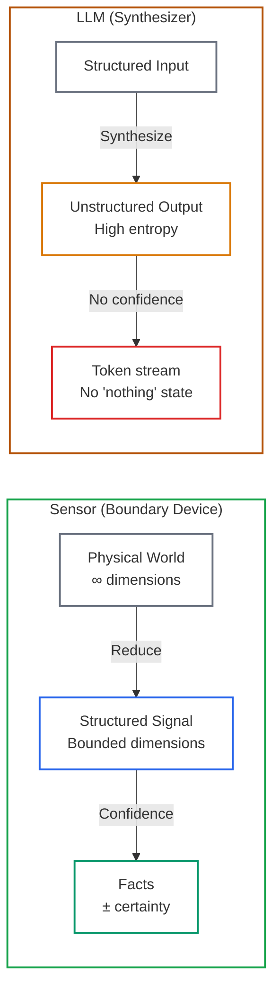
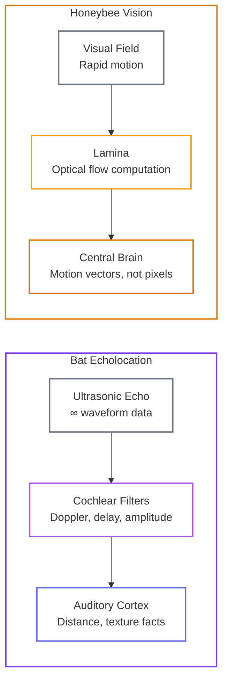
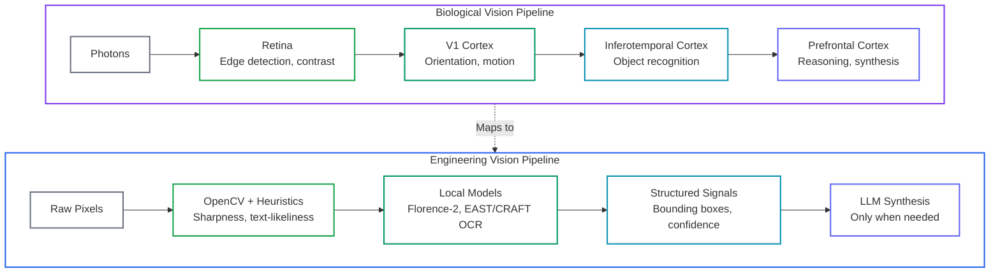
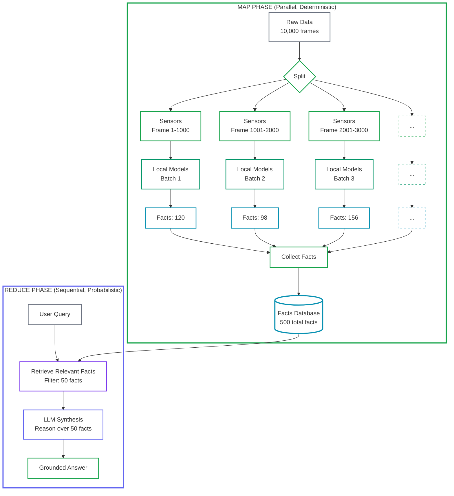

# Why LLMs Fail as Sensors (and What Brains Get Right)
<!-- category -- AI,Architecture,LLM,OCR,Audio,Video,Patterns -->
<datetime class="hidden">2026-01-18T15:33</datetime>

LLMs (Large Language Models) are being used as sensors. That is a **category error**: using a probabilistic synthesizer where a deterministic boundary device is required.

This isn't developers' fault. Most mainstream examples and tutorials lead with the simplest demo: "just send it to the model." That makes onboarding easy, but it blurs a crucial boundary: perception vs synthesis. Industry incentives don't help either: token-priced systems naturally reward pipelines that do more work inside the LLM.

This article is about **[Reduced RAG](/blog/reduced-rag)** - an architectural pattern where **deterministic pipelines feed probabilistic components**, not the other way around. In a proper RAG system:

- **Pipelines** (sensors → local models → structured facts) do the reduction
- **LLMs** operate only on the reduced, structured output
- **Never** send raw data directly to LLMs

Example: In the OCR (Optical Character Recognition) pipeline, the Vision LLM is tier 3, not tier 1. It only runs after text-likeliness heuristics and local OCR fail. That is not an optimization. It is a **boundary rule** - an architectural constraint that prevents inappropriate tool usage regardless of perceived convenience.

*This is Part 1 of "LLMs as Components". [Part 2: MCP Is a Transport, Not an Architecture](/blog/mcp-is-a-transport-not-an-architecture) covers the category error of using MCP as architecture.*

[TOC]

---

## Part 1: The Problem (Why LLMs Fail as Sensors)

### The Same Mistake, Different Modalities

Here are identical architectural failures across different domains:

- **OCR (Optical Character Recognition)**: Sending raw video frames directly to Vision LLMs instead of using text-likeliness heuristics plus local OCR models
- **Image analysis**: Asking LLMs to "describe this image" instead of extracting structured signals first (objects, faces, text regions)
- **Video processing**: Running LLMs frame-by-frame instead of detecting shots, extracting keyframes, and deduplicating visual content
- **Audio analysis**: Asking LLMs to infer speaker identity or audio quality from raw waveforms instead of using signal processing

### The Symptoms

These architectural mistakes produce predictable failures:

1. **Hallucinated perception**: LLMs *must* emit tokens. Under uncertainty they fill gaps with plausible completions. "Text detected" because it might be there, not because it is there. **This is the core problem.**

2. **Non-deterministic failure**: Temperature and token budget drive variance. Same input → different outputs. Debugging becomes statistical analysis.

3. **Resource waste**: Whether you're paying per token (API) or running local models (Ollama, llama.cpp), you're burning compute on the wrong task. Local LLMs don't cost per call, but they still produce unreliable sensor output.

**The issue isn't cost - it's accuracy.** A locally hosted LLM hallucinating OCR results is just as broken as an expensive API call doing the same thing. Deterministic sensors produce verifiable facts. LLMs produce plausible prose.

### Why This Happens: Sensors vs. Synthesizers

The category error exists because **a sensor and a synthesizer are fundamentally different tools:**

**A sensor is a boundary device:**
- Reduces the world's dimensionality (photons → structured signals)
- Emits facts with confidence scores
- Has known, characterized failure modes
- Cheap, fast, repeatable, deterministic

**An LLM is a high-variance synthesizer:**
- Expands degrees of freedom (facts → prose, structured → unstructured)
- No stable notion of "nothing detected" (it will always produce tokens)
- Output varies with context, prompt, temperature
- Costs scale linearly with input size
- Non-deterministic by design

This is why [StyloFlow](/blog/styloflow-signal-driven-workflows) treats signals as immutable facts, not prose. Models can propose. Deterministic policy decides what persists.

---

## Part 2: The Principle (Sensors First, Synthesis Last)

### What Brains Get Right (No Romance)

Brains do not start with reasoning. They start with **constraint**.

The retina is not the cortex. There is heavy preprocessing before anything looks like cognition:

- **Edge detection** (on-center, off-center ganglion cells)
- **Motion detection** (directional selectivity in V1)
- **Contrast suppression** (lateral inhibition)
- **Noise gating** (threshold-based firing)

**When sensory constraints weaken, hallucinations rise.** Low light, missing edges, ambiguous cues. This is not metaphor - it is the same failure mode as LLM hallucinations under uncertainty. Engineers already know this: when upstream SNR drops, downstream classifiers become unstable.

### Perceptual Pipelines Across Species

This problem-solution pattern appears across all animal perceptual systems, not just human vision:

**Bat echolocation** (auditory):
- **Problem**: Raw ultrasonic reflections contain millions of data points per second
- **Solution**: Specialized cochlear processing filters for Doppler shifts, time delays, amplitude
- **Result**: Structured signals (distance, velocity, texture) before cortical processing
- **Engineering parallel**: Audio signal processing → features → diarization → LLM synthesis

**Honeybee vision** (motion detection):
- **Problem**: Rapidly changing visual field during flight
- **Solution**: Optical flow computation in lamina (first neural layer), not in central brain
- **Result**: Collision avoidance operates on motion vectors, not raw pixels
- **Engineering parallel**: OpenCV motion detection → tracking → semantic analysis

**The common pattern:**
1. **Raw sensory data** (problem: too much, too noisy, too high-dimensional)
2. **Boundary preprocessing** (solution: specialized hardware/wetware reduces, filters, structures)
3. **Cognitive processing** (operates on facts, not raw signals)

This is not "inspiration from nature." It is convergent evolution of information processing under physical constraints (energy, latency, bandwidth). The same constraints apply to AI systems.

The engineering mapping is tight:

**Brains do not "understand" pixels. They never see them.**

The cortex operates on signals that have been reduced, filtered, and structured by preceding layers. This is not a limitation - it is what makes intelligence tractable.

### Engineering Consequences (Design Rules)

This is not a philosophical take. It is system design:

1. **Escalation must be gated**: LLMs are tier 3, not tier 1. Only invoke when cheaper sensors fail.

2. **Confidence thresholds must be explicit**: "Text detected with 0.92 confidence" is a fact. "There might be text" is not.

3. **Routing must be deterministic**: Same signals → same path. No prompt variance, no temperature effects.

4. **Token economics are a constraint, not a cost tweak**: If your pipeline's cost scales with raw data size, you are using the wrong tool.

5. **Facts need provenance**: If you can't point to the bounding box, frame, or waveform region, it isn't a fact.

**Proof: The filmstrip optimization**

In the [VideoSummarizer pipeline](/blog/videosummarizer-scalable-video-intelligence), text-only filmstrips reduce token cost by ~30x while *improving* OCR fidelity. The LLM sees the signal (extracted text regions), not the scene (full RGB frames).

This is not an optimization. It is a category correction.

---

## Part 3: The Pattern in Practice

### The General Pattern: Reduced RAG is Map-Reduce for Probabilistic Systems

This is the **Reduced RAG** architectural pattern. The core principle: **pipelines feed probabilistic components**.

**Reduced RAG is Map-Reduce applied to probabilistic systems:**

- **Map phase** (deterministic, parallel, distributed): Sensors and local models extract structured facts from raw data
- **Reduce phase** (probabilistic, sequential, centralized): LLM synthesizes over the extracted facts

Traditional RAG gets this backwards - it retrieves documents and hopes the LLM extracts facts. Reduced RAG **extracts facts first** (map), then lets the LLM synthesize (reduce).

The pattern repeats across all multimodal systems:

1. **Map: Sensors reduce** (deterministic heuristics filter and structure raw data - parallel across frames/chunks)
2. **Map: Local models extract** (specialized models produce facts with confidence scores - parallel per data unit)
3. **Map: Policy routes** (deterministic thresholds decide: persist or escalate - parallel per fact)
4. **Reduce: LLMs synthesize** (operate only over collected facts, never raw data - sequential synthesis)

**Document-first RAG vs. Reduced RAG:**

| Aspect | Document-first RAG | Reduced RAG (Map-Reduce) |
|--------|-------------------|-------------|
| **Pattern** | Retrieve → Extract → Synthesize | Map (Extract) → Reduce (Synthesize) |
| **Extraction accuracy** | LLM hallucinations possible | Deterministic, verifiable |
| **Stored data** | Documents/chunks | Structured facts |
| **LLM role** | Two tasks: extract + synthesize | One task: synthesize only |
| **Debuggability** | Inspect prompt traces | Inspect fact database |
| **Scalability** | Sequential LLM bottleneck | Distributed map, centralized reduce |

### Concrete Implementations

Three production systems implement this pattern:

- **[ImageSummarizer](/blog/constrained-fuzzy-image-intelligence)**: Heuristics → Florence-2 OCR → Vision LLM (escalation only)
- **[AudioSummarizer](/blog/audiosummarizer-forensic-audio-characterization)**: Acoustic features → Diarization → LLM (query time only)
- **[VideoSummarizer](/blog/videosummarizer-scalable-video-intelligence)**: Shot detection → Keyframes → CLIP embeddings → LLM (optional)

### Why This Works (It's Not About Cost)

Here are real numbers from VideoSummarizer on a 10-minute video (600 seconds, 30fps = 18,000 frames):

| Approach | Accuracy | Determinism | Tokens |
|----------|----------|-------------|--------|
| **Frame-by-frame LLM** | Hallucinations, variance | Non-deterministic | ~27M |
| **Shots → Keyframes → LLM** | Accurate | Deterministic extraction | ~150K |
| **Filmstrip text extraction** | Best OCR fidelity | Fully deterministic | ~5K |

**The right architecture is more accurate.** It also happens to be 180x cheaper - but that's a side effect of doing the right thing, not the goal. Even with free local LLMs, the frame-by-frame approach would still be wrong because it produces unreliable output.

---

## Closing

If your AI system starts with an LLM, you have already lost control of it.

Intelligence does not start with reasoning. It starts with constraint.

Sensors reduce uncertainty. Synthesizers expand meaning. Confusing the two breaks systems.

Make synthesis the last step.

---

## Key Terms

- **Reduced RAG**: Map-Reduce for probabilistic systems. Map (deterministic extraction) → Reduce (LLM synthesis)
- **Category error**: Treating something as belonging to a fundamentally different type than it is
- **Boundary device**: Reduces high-dimensional raw data to low-dimensional structured signals with known accuracy
- **Escalation tier**: Fallback to LLM only when deterministic methods fail (accuracy-gated, not cost-gated)
- **Diarization**: Speaker separation in audio (who spoke when)

---

## Related Articles

**Next in series:** [Part 2: MCP Is a Transport, Not an Architecture](/blog/mcp-is-a-transport-not-an-architecture)

- [Reduced RAG: Map-Reduce for Probabilistic Systems](/blog/reduced-rag)
- [VideoSummarizer: Reduced RAG for Video](/blog/videosummarizer-scalable-video-intelligence)
- [ImageSummarizer: Constrained Fuzzy Image Intelligence](/blog/constrained-fuzzy-image-intelligence)
- [AudioSummarizer: Forensic Audio Characterization](/blog/audiosummarizer-forensic-audio-characterization)
- [StyloFlow: Signal-Driven Workflows](/blog/styloflow-signal-driven-workflows)
