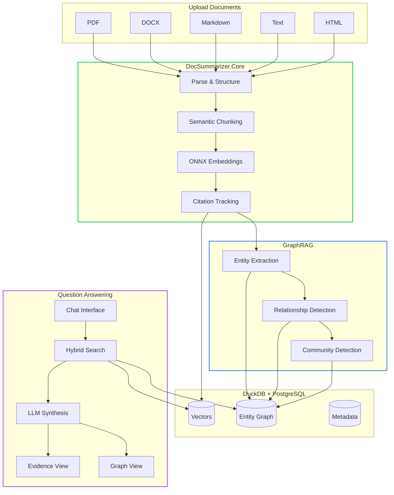
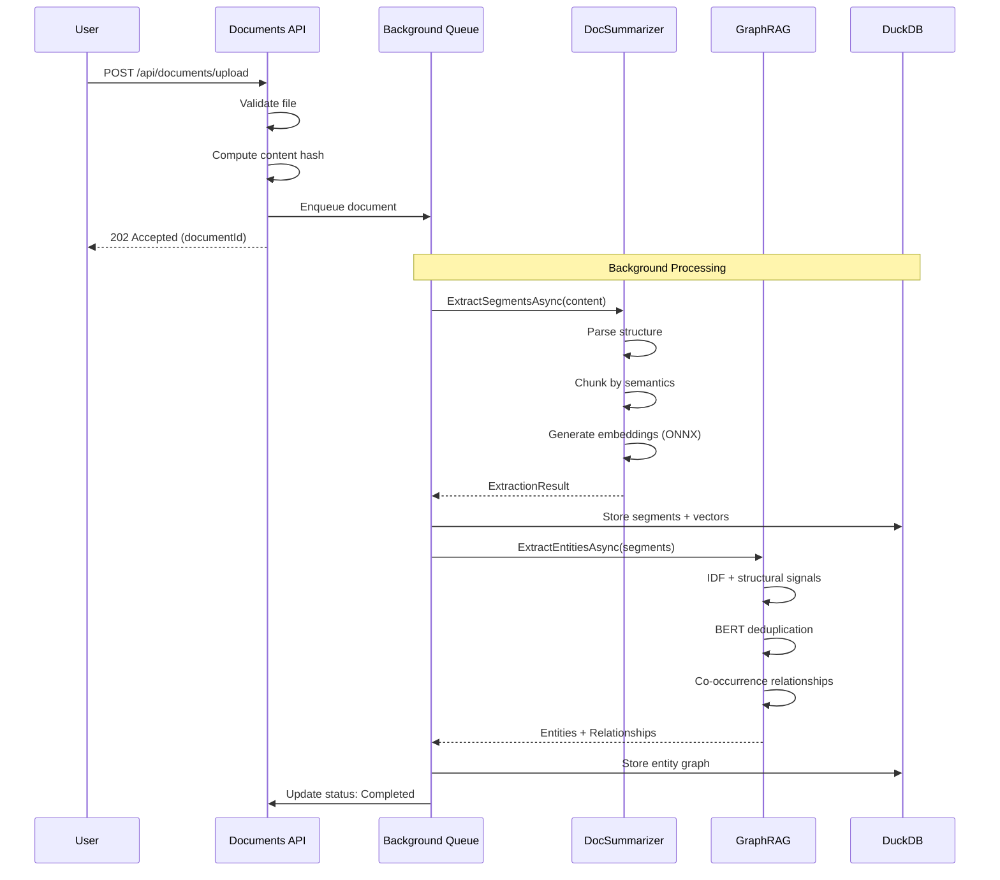

# DocSummarizer Part 5 - lucidRAG: Multi-Document RAG Web Application

<!--category-- AI, LLM, RAG, C#, HTMX, GraphRAG, Semantic Search, DuckDB -->
<datetime class="hidden">2026-01-01T18:00</datetime>

This is **Part 5** of the DocSummarizer series, and it's also the culmination of the [GraphRAG series](/blog/graphrag-minimum-viable-implementation) and [Semantic Search series](/blog/semantic-search-with-onnx-and-qdrant). We're combining everything into a deployable web application.

> 🚨🚨 PREVIEW ARTICLE 🚨🚨 As you'd imagine this is pretty tricky! 
> Still working out some kinks and adding features. But the core is done and working well. Expect updates over the next few weeks. It WILL be at lucidRAG.com. I'll add screenshots here once I bottom out the design.

> **The whole point of building RAG infrastructure is to use it for something real.**

Over the past few weeks, we've built:
- **DocSummarizer** - Document parsing, semantic chunking, ONNX embeddings
- **GraphRAG** - Entity extraction, knowledge graphs, community detection
- **Semantic Search** - BM25 + BERT hybrid search with RRF fusion

Now we wire them together into **lucidRAG** - a standalone web application for multi-document question answering with knowledge graph visualization.

**Website:** [lucidrag.com](https://lucidrag.com) | **Source:** [GitHub](https://github.com/scottgal/mostlylucidweb/tree/main/Mostlylucid.RagDocuments)

[TOC]

## What lucidRAG Does



**Key features:**
- **Multi-document upload** with drag-and-drop (FilePond)
- **Agentic RAG** - Query decomposition, self-correction, clarification
- **Knowledge graph visualization** - D3.js force-directed graphs
- **Evidence view** - Sentence-level grounding with source citations
- **Conversation memory** - Context preserved across questions
- **Standalone deployment** - Single executable with SQLite, or Docker with PostgreSQL

## Why Combine DocSummarizer + GraphRAG?

Vector search alone breaks down when you need:
- **Cross-document reasoning** - "How does X in Document A relate to Y in Document B?"
- **Entity-centric queries** - "What do all these documents say about Docker?"
- **Global summaries** - "What are the main themes across this corpus?"

lucidRAG uses both:

| Query Type | Method | Example |
|------------|--------|---------|
| Specific facts | Vector search | "What port does Redis use?" |
| Entity information | Graph traversal | "What technologies use Docker?" |
| Cross-document | Entity linking | "Which documents discuss authentication?" |
| Thematic | Community summaries | "What are the main topics?" |

## Architecture

The application layers the projects we've built:

```
lucidRAG (Mostlylucid.RagDocuments)
├── Controllers/
│   ├── Api/
│   │   ├── DocumentsController.cs    # Upload, status, delete
│   │   ├── ChatController.cs         # Question answering
│   │   ├── GraphController.cs        # Knowledge graph data
│   │   └── ArticlesController.cs     # RSS feed from blog
│   └── UI/
│       └── HomeController.cs         # Main interface
├── Services/
│   ├── DocumentProcessingService.cs  # Wraps IDocumentSummarizer
│   ├── EntityGraphService.cs         # Wraps GraphRAG
│   ├── AgenticSearchService.cs       # Multi-step RAG
│   ├── ConversationService.cs        # Chat memory
│   └── Background/
│       └── DocumentQueueProcessor.cs # Async processing
└── Views/                            # HTMX + Alpine.js UI
```

### The Processing Pipeline

When you upload a document:



### Robust Async Processing

Document processing is handled by a background service with bounded channels, timeouts, and automatic cleanup:

```csharp
public class DocumentProcessingQueue
{
    // Bounded queue prevents unbounded memory growth
    private readonly Channel<DocumentProcessingJob> _queue =
        Channel.CreateBounded<DocumentProcessingJob>(new BoundedChannelOptions(100)
        {
            FullMode = BoundedChannelFullMode.Wait,  // Backpressure when full
            SingleReader = true,                      // One processor
            SingleWriter = false                      // Multiple uploads
        });

    // Track progress channels with creation time for cleanup
    private readonly ConcurrentDictionary<Guid, ProgressChannelEntry> _progressChannels = new();
    private static readonly TimeSpan ProgressChannelMaxAge = TimeSpan.FromHours(1);

    public async ValueTask EnqueueAsync(DocumentProcessingJob job, CancellationToken ct)
    {
        // 5-minute timeout prevents indefinite blocking
        using var timeoutCts = CancellationTokenSource.CreateLinkedTokenSource(ct);
        timeoutCts.CancelAfter(TimeSpan.FromMinutes(5));

        try
        {
            await _queue.Writer.WriteAsync(job, timeoutCts.Token);
        }
        catch (OperationCanceledException) when (!ct.IsCancellationRequested)
        {
            throw new InvalidOperationException("Queue full. Try again later.");
        }
    }

    public Channel<ProgressUpdate> GetOrCreateProgressChannel(Guid documentId)
    {
        return _progressChannels.GetOrAdd(documentId, _ => new ProgressChannelEntry(
            // Bounded progress channel with DropOldest for slow consumers
            Channel.CreateBounded<ProgressUpdate>(new BoundedChannelOptions(500)
            {
                FullMode = BoundedChannelFullMode.DropOldest
            }),
            DateTimeOffset.UtcNow)).Channel;
    }

    // Called periodically to remove orphaned channels
    public int CleanupAbandonedProgressChannels()
    {
        var cutoff = DateTimeOffset.UtcNow - ProgressChannelMaxAge;
        var cleaned = 0;
        foreach (var kvp in _progressChannels.Where(x => x.Value.CreatedAt < cutoff))
        {
            if (_progressChannels.TryRemove(kvp.Key, out var entry))
            {
                entry.Channel.Writer.TryComplete();
                cleaned++;
            }
        }
        return cleaned;
    }
}
```

The `DocumentQueueProcessor` adds timeout protection and periodic cleanup:

```csharp
public class DocumentQueueProcessor : BackgroundService
{
    private static readonly TimeSpan DocumentProcessingTimeout = TimeSpan.FromMinutes(30);
    private static readonly TimeSpan CleanupInterval = TimeSpan.FromMinutes(15);

    protected override async Task ExecuteAsync(CancellationToken stoppingToken)
    {
        // Start cleanup timer
        var cleanupTimer = new PeriodicTimer(CleanupInterval);
        _ = RunCleanupLoopAsync(cleanupTimer, stoppingToken);

        while (!stoppingToken.IsCancellationRequested)
        {
            var job = await _queue.DequeueAsync(stoppingToken);

            // Per-document timeout prevents hanging
            using var timeoutCts = CancellationTokenSource.CreateLinkedTokenSource(stoppingToken);
            timeoutCts.CancelAfter(DocumentProcessingTimeout);

            try
            {
                await ProcessDocumentAsync(job, timeoutCts.Token);
            }
            catch (OperationCanceledException) when (!stoppingToken.IsCancellationRequested)
            {
                _logger.LogWarning("Document {Id} timed out", job.DocumentId);
                await MarkDocumentFailedAsync(job.DocumentId, "Processing timed out");
            }
        }
    }
}
```

**Key design decisions:**

| Feature | Implementation | Benefit |
|---------|---------------|---------|
| Bounded queue (100 docs) | `BoundedChannelFullMode.Wait` | Prevents OOM from upload floods |
| Enqueue timeout (5 min) | Linked `CancellationTokenSource` | User gets error instead of hanging |
| Processing timeout (30 min) | Per-document timeout | Stuck docs don't block queue |
| Progress cleanup (1 hour) | `PeriodicTimer` every 15 min | No memory leaks from abandoned SSE |
| DropOldest for progress | `BoundedChannelOptions` | Slow consumers get recent updates |

### Storage Strategy

lucidRAG uses **DuckDB for vectors and graphs**, **PostgreSQL/SQLite for metadata**:

```csharp
// Document metadata in PostgreSQL/SQLite (EF Core)
public class DocumentEntity
{
    public Guid Id { get; set; }
    public string Name { get; set; }
    public string ContentHash { get; set; }
    public DocumentStatus Status { get; set; }
    public int SegmentCount { get; set; }
    public int EntityCount { get; set; }
}

// Vectors and graph in DuckDB (via DocSummarizer + GraphRag)
// - Segments with HNSW-indexed embeddings
// - Entities with mention counts
// - Relationships with provenance
// - Communities with summaries
```

Why separate? **DuckDB is ephemeral and fast** - you can rebuild it from source documents. **PostgreSQL is durable** - it tracks what documents exist and their processing status.

## Document Processing Service

The `DocumentProcessingService` wraps `IDocumentSummarizer` and adds:
- Hash-based duplicate detection
- Queue-based async processing
- Progress tracking
- Vector store cleanup on delete

```csharp
public class DocumentProcessingService : IDocumentProcessingService
{
    private readonly RagDocumentsDbContext _db;
    private readonly DocumentProcessingQueue _queue;
    private readonly IVectorStore _vectorStore;
    private const string CollectionName = "ragdocuments";

    public async Task<Guid> UploadDocumentAsync(
        Stream fileStream,
        string fileName,
        CancellationToken ct = default)
    {
        // 1. Read and hash content
        using var ms = new MemoryStream();
        await fileStream.CopyToAsync(ms, ct);
        var content = ms.ToArray();
        var contentHash = ComputeHash(content);

        // 2. Check for duplicates
        var existing = await _db.Documents
            .FirstOrDefaultAsync(d => d.ContentHash == contentHash, ct);
        if (existing != null)
            return existing.Id; // Already processed

        // 3. Save file and create record
        var docId = Guid.NewGuid();
        var filePath = Path.Combine(_uploadPath, $"{docId}{extension}");
        await File.WriteAllBytesAsync(filePath, content, ct);

        var document = new DocumentEntity
        {
            Id = docId,
            Name = Path.GetFileNameWithoutExtension(fileName),
            OriginalFilename = fileName,
            ContentHash = contentHash,
            FilePath = filePath,
            Status = DocumentStatus.Pending
        };

        _db.Documents.Add(document);
        await _db.SaveChangesAsync(ct);

        // 4. Queue for background processing
        await _queue.EnqueueAsync(docId, ct);

        return docId;
    }

    public async Task DeleteDocumentAsync(Guid documentId, CancellationToken ct = default)
    {
        var document = await _db.Documents.FindAsync([documentId], ct);
        if (document == null) return;

        // Clean up vectors from DuckDB
        try
        {
            await _vectorStore.DeleteDocumentAsync(
                CollectionName,
                document.ContentHash,
                ct);
        }
        catch (Exception ex)
        {
            _logger.LogWarning(ex, "Failed to delete vectors for {DocumentId}", documentId);
        }

        // Delete file and metadata
        if (File.Exists(document.FilePath))
            File.Delete(document.FilePath);

        _db.Documents.Remove(document);
        await _db.SaveChangesAsync(ct);
    }
}
```

## Entity Graph Service

The `EntityGraphService` integrates with `Mostlylucid.GraphRag` for entity extraction. We reuse the existing infrastructure rather than reimplementing:

```csharp
public class EntityGraphService : IEntityGraphService, IDisposable
{
    private readonly GraphRagDb _graphDb;
    private readonly GraphRag.Services.EmbeddingService _embedder;
    private readonly EntityExtractor _extractor;

    public EntityGraphService(IConfiguration configuration)
    {
        var dbPath = configuration["GraphRag:DatabasePath"] ?? "data/graphrag.duckdb";
        var embeddingDim = 384; // all-MiniLM-L6-v2

        _graphDb = new GraphRagDb(dbPath, embeddingDim);
        _embedder = new GraphRag.Services.EmbeddingService();
        _extractor = new EntityExtractor(_embedder, _graphDb);
    }

    public async Task ExtractEntitiesAsync(
        Guid documentId,
        IEnumerable<Segment> segments,
        CancellationToken ct = default)
    {
        // Convert DocSummarizer segments to GraphRag chunks
        var chunks = segments.Select(s => new GraphRag.Models.Chunk
        {
            Id = s.Id,
            DocumentId = documentId.ToString(),
            Text = s.Text,
            ChunkIndex = s.Index
        }).ToList();

        // Use GraphRag's entity extractor (heuristic mode)
        var result = await _extractor.ExtractAsync(
            chunks,
            ExtractionMode.Heuristic,
            ct);

        // Store in GraphRag's DuckDB
        foreach (var entity in result.Entities)
        {
            await _graphDb.UpsertEntityAsync(entity, ct);
        }

        foreach (var rel in result.Relationships)
        {
            await _graphDb.InsertRelationshipAsync(rel, ct);
        }
    }

    public async Task<GraphData> GetGraphDataAsync(CancellationToken ct = default)
    {
        // Fetch for D3.js visualization
        var entities = await _graphDb.GetAllEntitiesAsync(ct);
        var relationships = await _graphDb.GetAllRelationshipsAsync(ct);

        return new GraphData
        {
            Nodes = entities.Select(e => new GraphNode
            {
                Id = e.Id,
                Name = e.Name,
                Type = e.Type,
                MentionCount = e.MentionCount
            }),
            Links = relationships.Select(r => new GraphLink
            {
                Source = r.SourceId,
                Target = r.TargetId,
                Type = r.Type,
                Strength = r.Strength
            })
        };
    }
}
```

### Reusing GraphRAG's IDF-Based Extraction

GraphRAG's entity extraction uses statistical signals rather than per-chunk LLM calls:

1. **IDF scoring** - Rare terms across the corpus are likely entities
2. **Structural signals** - Headings, inline code, links
3. **BERT deduplication** - Merge "Docker Compose" and "docker-compose"
4. **Co-occurrence relationships** - Entities in the same chunk are related

See [GraphRAG Part 2](/blog/graphrag-minimum-viable-implementation) for the full implementation.

## Agentic Search Service

The `AgenticSearchService` implements multi-step RAG with:
- Query decomposition (split complex questions)
- Self-correction (re-query if results are poor)
- Query clarification (rewrite ambiguous queries)

```csharp
public class AgenticSearchService : IAgenticSearchService
{
    private readonly IDocumentSummarizer _summarizer;
    private readonly IEntityGraphService _graphService;

    public async Task<SearchResult> SearchAsync(
        string query,
        SearchOptions options,
        CancellationToken ct = default)
    {
        // 1. Analyze query complexity
        var analysis = AnalyzeQuery(query);

        if (analysis.NeedsDecomposition)
        {
            // Split into sub-queries, execute in parallel
            var subResults = await ExecuteSubQueriesAsync(
                analysis.SubQueries, options, ct);
            return SynthesizeResults(query, subResults);
        }

        // 2. Embed query
        var queryEmbedding = await _summarizer.EmbedAsync(query);

        // 3. Hybrid search: vector + BM25
        var vectorResults = await _summarizer.SearchAsync(
            query,
            topK: options.TopK);

        // 4. Entity enrichment from graph
        var queryEntities = await _graphService.ExtractQueryEntitiesAsync(query, ct);
        var graphContext = await _graphService.GetEntityContextAsync(queryEntities, ct);

        // 5. Check result quality
        if (vectorResults.AverageScore < 0.3 && options.AllowSelfCorrection)
        {
            // Results poor - try query rewriting
            var rewrittenQuery = await RewriteQueryAsync(query, ct);
            return await SearchAsync(rewrittenQuery, options with
            {
                AllowSelfCorrection = false
            }, ct);
        }

        return new SearchResult
        {
            Query = query,
            Segments = vectorResults.Segments,
            Entities = queryEntities,
            GraphContext = graphContext
        };
    }
}
```

## Chat Controller

The chat API handles question answering with conversation memory:

```csharp
[ApiController]
[Route("api/[controller]")]
public class ChatController : ControllerBase
{
    private readonly IAgenticSearchService _search;
    private readonly IConversationService _conversations;
    private readonly IDocumentSummarizer _summarizer;

    [HttpPost]
    public async Task<IActionResult> ChatAsync(
        [FromBody] ChatRequest request,
        CancellationToken ct)
    {
        // Get or create conversation
        var conversation = request.ConversationId.HasValue
            ? await _conversations.GetAsync(request.ConversationId.Value, ct)
            : await _conversations.CreateAsync(ct);

        // Build context from conversation history
        var context = _conversations.BuildContext(conversation);

        // Search with agentic pipeline
        var searchResult = await _search.SearchAsync(
            request.Query,
            new SearchOptions
            {
                TopK = 10,
                IncludeGraphData = request.IncludeGraphData,
                DocumentIds = request.DocumentIds,
                ConversationContext = context
            },
            ct);

        // Generate answer with LLM
        var answer = await _summarizer.SummarizeAsync(
            request.Query,
            searchResult.Segments,
            new SummarizeOptions
            {
                SystemPrompt = GetSystemPrompt(conversation),
                IncludeCitations = true
            });

        // Save to conversation history
        await _conversations.AddMessageAsync(
            conversation.Id,
            "user",
            request.Query,
            ct);
        await _conversations.AddMessageAsync(
            conversation.Id,
            "assistant",
            answer.Text,
            new { sources = answer.Citations },
            ct);

        return Ok(new ChatResponse
        {
            ConversationId = conversation.Id,
            Answer = answer.Text,
            Sources = answer.Citations.Select(c => new SourceDto
            {
                Number = c.Index,
                DocumentName = c.DocumentName,
                Text = c.Text,
                PageOrSection = c.Section
            }),
            GraphData = request.IncludeGraphData
                ? searchResult.GraphData
                : null,
            QueryEntities = searchResult.Entities.Select(e => e.Name),
            DebugInfo = request.IncludeDebugInfo
                ? BuildDebugInfo(searchResult)
                : null
        });
    }
}
```

## The UI: HTMX + Alpine.js

The UI is a single page with three views:

```
┌─────────────────────────────────────────────────────────────────┐
│  lucidRAG                        [Articles ▾] [API Docs] [☀/🌙] │
├──────────────────────┬──────────────────────────────────────────┤
│                      │                                          │
│  📁 Documents        │   [Answer] [Evidence] [Graph]            │
│  ─────────────       │                                          │
│                      │   User: How does Docker work?            │
│  [+ Upload Files]    │                                          │
│                      │   Assistant: Docker uses containerization │
│  📄 api-docs.pdf     │   to package applications... [1][2]      │
│  📝 readme.md        │                                          │
│  📝 notes.txt        │   Sources:                               │
│                      │   [1] docker-guide.md (§Setup)           │
│  ─────────────       │   [2] architecture.pdf (p.12)            │
│  🕸️ Graph Health     │                                          │
│  Nodes: 168          │   ┌──────────────────────────────────┐   │
│  Edges: 312          │   │ Ask about your documents...   [→]│   │
│                      │   └──────────────────────────────────┘   │
└──────────────────────┴──────────────────────────────────────────┘
```

### Alpine.js State Management

```javascript
function ragApp() {
    return {
        // Core state
        documents: [],
        messages: [],
        currentMessage: '',
        conversationId: null,
        isTyping: false,

        // View state
        viewMode: 'answer', // 'answer', 'evidence', 'graph'
        graphRagEnabled: true,

        // Evidence view
        lastAnswer: null,
        selectedSentence: null,
        selectedEvidence: [],

        // Graph view
        graphData: null,
        selectedEntity: null,

        async sendMessage() {
            const query = this.currentMessage.trim();
            if (!query) return;

            this.messages.push({ role: 'user', content: query });
            this.currentMessage = '';
            this.isTyping = true;

            try {
                const response = await fetch('/api/chat', {
                    method: 'POST',
                    headers: { 'Content-Type': 'application/json' },
                    body: JSON.stringify({
                        query,
                        conversationId: this.conversationId,
                        includeGraphData: this.graphRagEnabled,
                        includeDebugInfo: true
                    })
                });

                const result = await response.json();
                this.conversationId = result.conversationId;

                this.messages.push({
                    role: 'assistant',
                    content: result.answer,
                    sources: result.sources
                });

                if (result.graphData) {
                    this.graphData = result.graphData;
                }

                this.lastAnswer = this.parseForEvidence(result);

            } finally {
                this.isTyping = false;
            }
        }
    };
}
```

### FilePond for Uploads

```javascript
initFilePond() {
    pond = FilePond.create(input, {
        allowMultiple: true,
        maxFileSize: '100MB',
        acceptedFileTypes: [
            'application/pdf',
            'application/vnd.openxmlformats-officedocument.wordprocessingml.document',
            'text/markdown',
            'text/plain',
            'text/html'
        ],
        server: {
            process: {
                url: '/api/documents/upload',
                method: 'POST',
                onload: (response) => {
                    htmx.trigger(document.body, 'documentUploaded');
                    this.loadGraphStats();
                    return JSON.parse(response).documentId;
                }
            }
        }
    });
}
```

## Running lucidRAG

### Standalone Mode (No Dependencies)

```bash
dotnet run --project Mostlylucid.RagDocuments -- --standalone
```

This starts the app on `http://localhost:5080` with:
- SQLite database (stored in `data/ragdocs.db`)
- DuckDB vector store (stored in `data/`)
- Local file uploads (stored in `uploads/`)
- ONNX embeddings (no API keys needed)

### Docker Deployment

```yaml
# docker-compose.yml
services:
  lucidrag:
    build: .
    ports:
      - "5080:8080"
    environment:
      - ConnectionStrings__DefaultConnection=Host=postgres;Database=ragdocs;...
      - DocSummarizer__Ollama__BaseUrl=http://ollama:11434
    volumes:
      - uploads:/app/uploads
      - vectors:/app/data
    depends_on:
      - postgres
      - ollama

  postgres:
    image: postgres:16-alpine
    volumes:
      - pgdata:/var/lib/postgresql/data

  ollama:
    image: ollama/ollama:latest
    volumes:
      - ollama:/root/.ollama
    # Add deploy.resources for GPU support
```

### Configuration

```json
{
  "RagDocuments": {
    "UploadPath": "./uploads",
    "MaxFileSizeMB": 100,
    "AllowedExtensions": [".pdf", ".docx", ".md", ".txt", ".html"]
  },
  "DocSummarizer": {
    "EmbeddingBackend": "Onnx",
    "BertRag": {
      "VectorStore": "DuckDB",
      "PersistVectors": true
    },
    "Ollama": {
      "BaseUrl": "http://localhost:11434",
      "Model": "llama3.2:3b"
    }
  }
}
```

## What We Built

lucidRAG combines months of infrastructure work:

| Component | From | Purpose |
|-----------|------|---------|
| Document parsing | DocSummarizer | PDF, DOCX, Markdown, HTML, TXT |
| Semantic chunking | DocSummarizer | Heading-aware segmentation |
| ONNX embeddings | DocSummarizer | Local, no API keys |
| Entity extraction | GraphRAG | IDF + structural signals |
| Knowledge graph | GraphRAG | Entity relationships |
| Hybrid search | Both | BM25 + BERT with RRF |
| Vector storage | DuckDB | HNSW-indexed embeddings |
| Async processing | New | Bounded channels, timeouts, cleanup |
| Conversation memory | New | Context across questions |
| Web UI | New | HTMX + Alpine.js + DaisyUI |

### Cost

**Zero API costs** for indexing. Embeddings are ONNX, entity extraction is heuristic. You only pay for LLM synthesis at query time - and that works with local Ollama.

For 100 documents:
- Indexing: $0 (all local)
- Queries: ~$0 with Ollama, or ~$0.01/query with GPT-4o-mini

## Related Articles

### DocSummarizer Series
- [Part 1 - Architecture](/blog/building-a-document-summarizer-with-rag)
- [Part 2 - CLI Tool](/blog/docsummarizer-tool)
- [Part 3 - Advanced Concepts](/blog/docsummarizer-advanced-concepts)
- [Part 4 - RAG Pipelines](/blog/docsummarizer-rag-pipeline)

### GraphRAG Series
- [Part 1 - Knowledge Graphs for RAG](/blog/graphrag-knowledge-graphs-for-rag)
- [Part 2 - Minimum Viable GraphRAG](/blog/graphrag-minimum-viable-implementation)

### Semantic Search Series
- [RAG Primer](/blog/rag-primer)
- [Semantic Search with ONNX and Qdrant](/blog/semantic-search-with-onnx-and-qdrant)
- [Hybrid Search and Indexing](/blog/rag-hybrid-search-and-indexing)

## Links

- **Website:** [lucidrag.com](https://lucidrag.com)
- **Source:** [GitHub](https://github.com/scottgal/mostlylucidweb/tree/main/Mostlylucid.RagDocuments)
- **DocSummarizer NuGet:** [Mostlylucid.DocSummarizer](https://www.nuget.org/packages/Mostlylucid.DocSummarizer)
