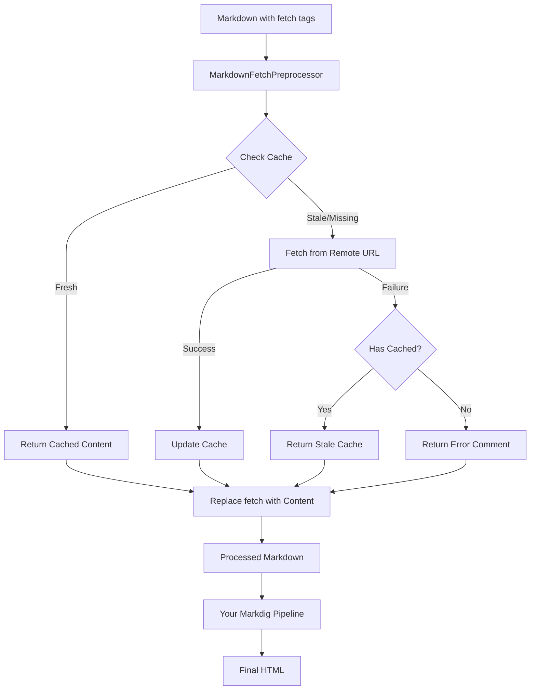
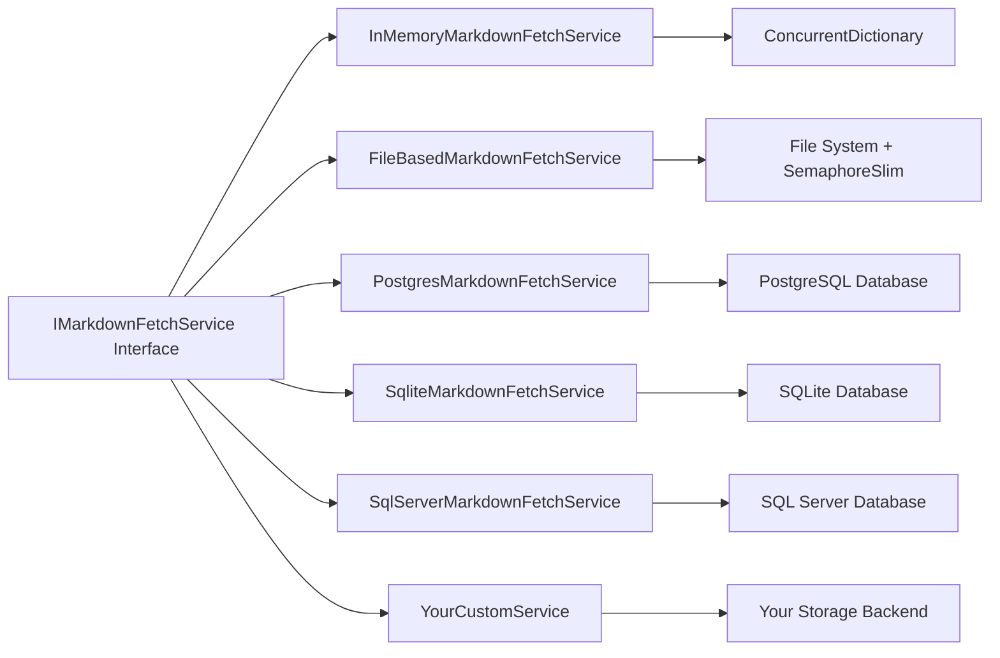
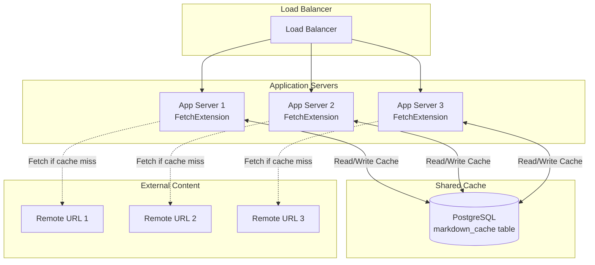
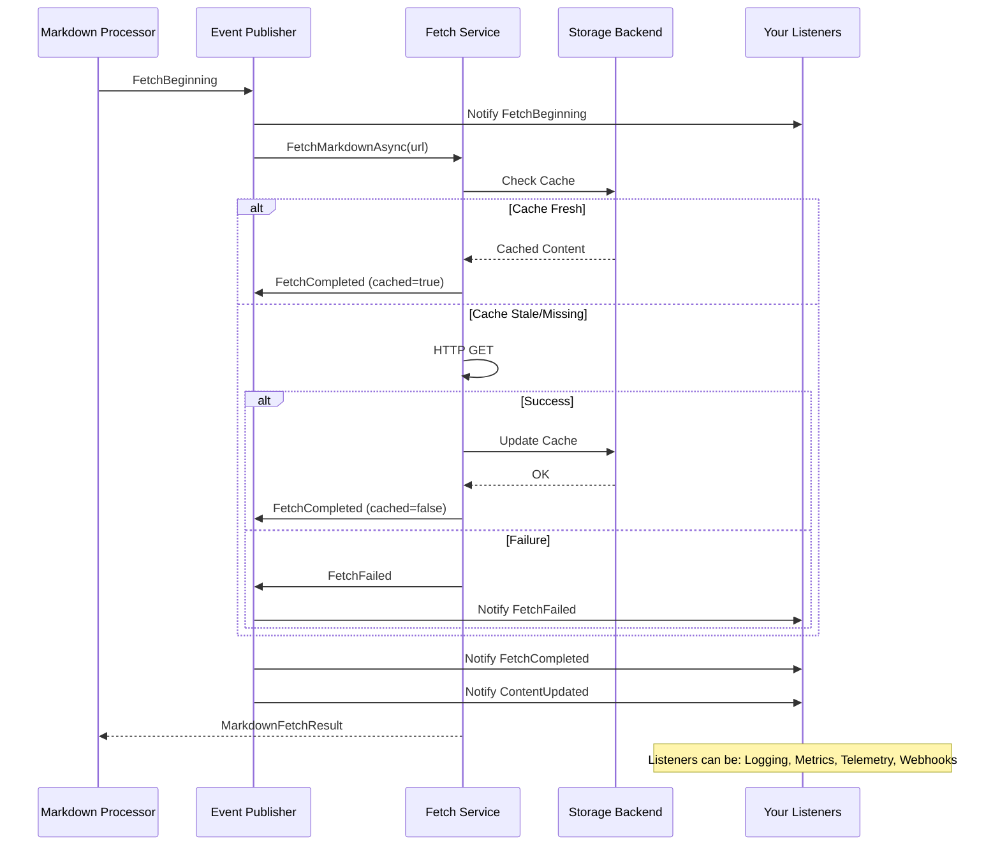
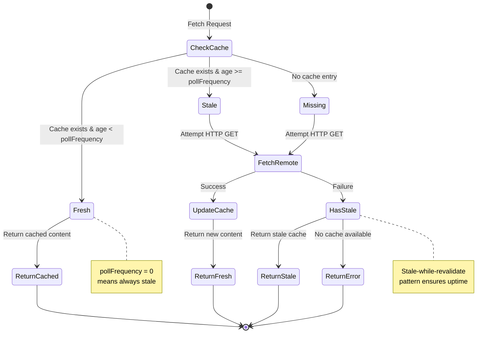

# Building a Remote Markdown Fetcher for Markdig

<!--category-- Markdown, AI-Article,  MarkDig, ASP.NET Core, C#, API, Nuget, FetchExtension-->
<datetime class="hidden">2025-11-06T18:45</datetime>

## Introduction


One of the challenges I faced while building this blog was how to efficiently include external markdown content without manually copying and pasting it everywhere. I wanted to fetch README files from my GitHub repositories, include documentation from other projects, and keep everything automatically synchronized. The solution? A custom Markdig extension that fetches remote markdown at render time and caches it intelligently.

In this post, I'll walk you through how I built `Mostlylucid.Markdig.FetchExtension` - a complete solution for fetching and caching remote markdown content with support for multiple storage backends, automatic polling, and a stale-while-revalidate caching pattern.


> NOTE: This is still prerelease but i wanted to get it out there. Have fun but it might not work yet.

> This article is AI generated - using claude code which also helped me build the feature.
 
> **UPDATE**: Added `disable="true"` parameter so we can now demo the tags properly without them being processed! 


See the source for it here [on the GitHub for this site](https://github.com/scottgal/mostlylucidweb/tree/main/Mostlylucid.Markdig.FetchExtension). 

[](https://www.nuget.org/packages/mostlylucid.Markdig.FetchExtension)
[](https://www.nuget.org/packages/mostlylucid.Markdig.FetchExtension)

[TOC]

## Why Build This?

Before diving into the technical details, let me explain the problem. I have several scenarios where I need to include external markdown content:

1. **Package READMEs**: When I write about a NuGet package I've published, I want to include its README directly from GitHub
2. **API Documentation**: External API docs that change frequently need to stay in sync
3. **Shared Content**: Documentation that lives in one repository but needs to appear in multiple places
4. **Performance**: I don't want to fetch this content on every page load - that would be slow and wasteful

The naive approach would be to use an HTTP client to fetch markdown whenever you need it. But that's problematic:

- Every request hits the remote server
- Network latency impacts page load times
- No offline support
- No handling of transient failures

I needed something smarter: fetch once, cache intelligently, refresh automatically, and handle failures gracefully.

## Architecture Overview

The extension follows a preprocessing approach rather than being part of the Markdig parsing pipeline. This is crucial because it means fetched content flows through your entire Markdig pipeline, getting all your custom extensions, syntax highlighting, and styling.



The key insight here is **preprocessing**. Before your markdown hits the Markdig pipeline, we:

1. Scan for `<fetch>` tags
2. Resolve the content (from cache or remote)
3. Replace the tags with actual markdown
4. Then let Markdig process everything together

This ensures consistency - all markdown gets the same treatment regardless of its source.

## The Basic Syntax

Using the extension is simple. In your markdown:

```markdown
# My Documentation

<fetch markdownurl="https://raw.githubusercontent.com/user/repo/main/README.md"
       pollfrequency="24" disable="true"/>
```

That's it! The extension will:
- Fetch the README from GitHub
- Cache it for 24 hours
- Return cached content on subsequent requests
- Auto-refresh when the cache expires

## Storage Provider Architecture

One of the design principles I followed was **flexibility**. Different applications have different needs. A small demo app doesn't need PostgreSQL, but a multi-server production deployment does. So I built a pluggable storage architecture:



### The Core Interface

Everything implements `IMarkdownFetchService`:

```csharp
public interface IMarkdownFetchService
{
    Task<MarkdownFetchResult> FetchMarkdownAsync(
        string url,
        int pollFrequencyHours,
        int blogPostId = 0);

    Task<bool> RemoveCachedMarkdownAsync(
        string url,
        int blogPostId = 0);
}
```

Simple and clean. Each implementation handles storage its own way, but the interface remains consistent.

### In-Memory Storage: Perfect for Demos

The simplest implementation uses `ConcurrentDictionary`:

```csharp
public class InMemoryMarkdownFetchService : IMarkdownFetchService
{
    private readonly ConcurrentDictionary<string, CacheEntry> _cache = new();
    private readonly IHttpClientFactory _httpClientFactory;
    private readonly ILogger<InMemoryMarkdownFetchService> _logger;

    public async Task<MarkdownFetchResult> FetchMarkdownAsync(
        string url,
        int pollFrequencyHours,
        int blogPostId)
    {
        var cacheKey = GetCacheKey(url, blogPostId);

        // Check cache
        if (_cache.TryGetValue(cacheKey, out var cached))
        {
            var age = DateTimeOffset.UtcNow - cached.FetchedAt;
            if (age.TotalHours < pollFrequencyHours)
            {
                _logger.LogDebug("Returning cached content for {Url}", url);
                return new MarkdownFetchResult
                {
                    Success = true,
                    Content = cached.Content
                };
            }
        }

        // Fetch fresh content
        var fetchResult = await FetchFromUrlAsync(url);

        if (fetchResult.Success)
        {
            _cache[cacheKey] = new CacheEntry
            {
                Content = fetchResult.Content,
                FetchedAt = DateTimeOffset.UtcNow
            };
        }
        else if (cached != null)
        {
            // Fetch failed, return stale cache
            _logger.LogWarning("Fetch failed, returning stale cache for {Url}", url);
            return new MarkdownFetchResult
            {
                Success = true,
                Content = cached.Content
            };
        }

        return fetchResult;
    }

    private static string GetCacheKey(string url, int blogPostId)
        => $"{url}_{blogPostId}";
}
```

As you can see this does the following:

1. Creates a cache key from the URL and blog post ID
2. Checks if we have cached content and if it's fresh
3. If cache is fresh, returns it immediately
4. If stale, tries to fetch fresh content
5. On success, updates the cache
6. On failure with cached content, returns stale cache (stale-while-revalidate!)
7. On failure without cache, returns error

This pattern - **stale-while-revalidate** - is crucial for reliability. Even if GitHub is down, your site keeps working with cached content.

### File-Based Storage: Simple Persistence

For single-server deployments, file-based storage works great:

```csharp
public class FileBasedMarkdownFetchService : IMarkdownFetchService
{
    private readonly string _cacheDirectory;
    private readonly IHttpClientFactory _httpClientFactory;
    private readonly ILogger<FileBasedMarkdownFetchService> _logger;
    private readonly SemaphoreSlim _fileLock = new(1, 1);

    public async Task<MarkdownFetchResult> FetchMarkdownAsync(
        string url,
        int pollFrequencyHours,
        int blogPostId)
    {
        var cacheKey = ComputeCacheKey(url, blogPostId);
        var cacheFile = GetCacheFilePath(cacheKey);

        await _fileLock.WaitAsync();
        try
        {
            // Check if file exists and is fresh
            if (File.Exists(cacheFile))
            {
                var fileInfo = new FileInfo(cacheFile);
                var age = DateTimeOffset.UtcNow - fileInfo.LastWriteTimeUtc;

                if (age.TotalHours < pollFrequencyHours)
                {
                    var cached = await File.ReadAllTextAsync(cacheFile);
                    return new MarkdownFetchResult
                    {
                        Success = true,
                        Content = cached
                    };
                }
            }

            // Fetch fresh
            var fetchResult = await FetchFromUrlAsync(url);

            if (fetchResult.Success)
            {
                await File.WriteAllTextAsync(cacheFile, fetchResult.Content);
            }
            else if (File.Exists(cacheFile))
            {
                // Return stale on fetch failure
                var stale = await File.ReadAllTextAsync(cacheFile);
                return new MarkdownFetchResult
                {
                    Success = true,
                    Content = stale
                };
            }

            return fetchResult;
        }
        finally
        {
            _fileLock.Release();
        }
    }

    private string GetCacheFilePath(string cacheKey)
        => Path.Combine(_cacheDirectory, $"{cacheKey}.md");

    private static string ComputeCacheKey(string url, int blogPostId)
    {
        var combined = $"{url}_{blogPostId}";
        using var sha256 = SHA256.Create();
        var bytes = Encoding.UTF8.GetBytes(combined);
        var hash = sha256.ComputeHash(bytes);
        return Convert.ToHexString(hash);
    }
}
```

Key points here:

1. Uses `SemaphoreSlim` for thread-safe file access
2. Hashes the URL + blog post ID to create safe filenames
3. Uses file modification time to determine freshness
4. Persists across application restarts
5. Same stale-while-revalidate pattern

### Database Storage: Production-Ready

For production deployments, especially multi-server setups, you want a shared cache. That's where the database providers come in:

```csharp
public class PostgresMarkdownFetchService : IMarkdownFetchService
{
    private readonly MarkdownCacheDbContext _dbContext;
    private readonly IHttpClientFactory _httpClientFactory;
    private readonly ILogger<PostgresMarkdownFetchService> _logger;

    public async Task<MarkdownFetchResult> FetchMarkdownAsync(
        string url,
        int pollFrequencyHours,
        int blogPostId)
    {
        var cacheKey = GetCacheKey(url, blogPostId);

        // Query cache
        var cached = await _dbContext.MarkdownCache
            .FirstOrDefaultAsync(c => c.CacheKey == cacheKey);

        if (cached != null)
        {
            var age = DateTimeOffset.UtcNow - cached.LastFetchedAt;
            if (age.TotalHours < pollFrequencyHours)
            {
                return new MarkdownFetchResult
                {
                    Success = true,
                    Content = cached.Content
                };
            }
        }

        // Fetch fresh
        var fetchResult = await FetchFromUrlAsync(url);

        if (fetchResult.Success)
        {
            if (cached == null)
            {
                cached = new MarkdownCacheEntry
                {
                    CacheKey = cacheKey,
                    Url = url,
                    BlogPostId = blogPostId
                };
                _dbContext.MarkdownCache.Add(cached);
            }

            cached.Content = fetchResult.Content;
            cached.LastFetchedAt = DateTimeOffset.UtcNow;
            await _dbContext.SaveChangesAsync();
        }
        else if (cached != null)
        {
            // Return stale
            return new MarkdownFetchResult
            {
                Success = true,
                Content = cached.Content
            };
        }

        return fetchResult;
    }
}
```

The database schema is simple:

```sql
CREATE TABLE markdown_cache (
    id SERIAL PRIMARY KEY,
    cache_key VARCHAR(128) NOT NULL UNIQUE,
    url VARCHAR(2048) NOT NULL,
    blog_post_id INTEGER NOT NULL,
    content TEXT NOT NULL,
    last_fetched_at TIMESTAMP WITH TIME ZONE NOT NULL,
    CONSTRAINT ix_markdown_cache_cache_key UNIQUE (cache_key)
);

CREATE INDEX ix_markdown_cache_url_blog_post_id
    ON markdown_cache(url, blog_post_id);
```

In a multi-server deployment, this gives you cache consistency across all instances:



All servers share the same cache. When Server 1 fetches a README, Servers 2 and 3 immediately benefit from that cached content.

## Setting Up the Extension

Getting started is straightforward. First, install the base package:

```bash
dotnet add package mostlylucid.Markdig.FetchExtension
```

Then choose your storage provider:

```bash
# For in-memory (demos/testing)
# Already included in base package

# For file-based storage
# Already included in base package

# For PostgreSQL
dotnet add package mostlylucid.Markdig.FetchExtension.Postgres

# For SQLite
dotnet add package mostlylucid.Markdig.FetchExtension.Sqlite

# For SQL Server
dotnet add package mostlylucid.Markdig.FetchExtension.SqlServer
```

### Configuration in ASP.NET Core

In your `Program.cs`:

```csharp
using Mostlylucid.Markdig.FetchExtension;

var builder = WebApplication.CreateBuilder(args);

// Option 1: In-Memory (simplest)
builder.Services.AddInMemoryMarkdownFetch();

// Option 2: File-Based (persists across restarts)
builder.Services.AddFileBasedMarkdownFetch("./markdown-cache");

// Option 3: PostgreSQL (multi-server)
builder.Services.AddPostgresMarkdownFetch(
    builder.Configuration.GetConnectionString("MarkdownCache"));

// Option 4: SQLite (single server with DB)
builder.Services.AddSqliteMarkdownFetch("Data Source=markdown-cache.db");

// Option 5: SQL Server (enterprise)
builder.Services.AddSqlServerMarkdownFetch(
    builder.Configuration.GetConnectionString("MarkdownCache"));

var app = builder.Build();

// If using database storage, ensure schema exists
if (app.Environment.IsDevelopment())
{
    app.Services.EnsureMarkdownCacheDatabase();
}

// Configure the extension with your service provider
FetchMarkdownExtension.ConfigureServiceProvider(app.Services);

app.Run();
```

### Integration with Your Markdown Rendering

The key is the preprocessing step. Here's how I integrate it in my blog:

```csharp
public class MarkdownRenderingService
{
    private readonly IServiceProvider _serviceProvider;
    private readonly MarkdownFetchPreprocessor _preprocessor;
    private readonly MarkdownPipeline _pipeline;

    public MarkdownRenderingService(IServiceProvider serviceProvider)
    {
        _serviceProvider = serviceProvider;
        _preprocessor = new MarkdownFetchPreprocessor(serviceProvider);

        _pipeline = new MarkdownPipelineBuilder()
            .UseAdvancedExtensions()
            .UseSyntaxHighlighting()
            .UseTableOfContents()
            .UseYourCustomExtensions()
            .Build();
    }

    public string RenderMarkdown(string markdown)
    {
        // Step 1: Preprocess to handle fetch tags
        var processed = _preprocessor.Preprocess(markdown);

        // Step 2: Run through your normal Markdig pipeline
        return Markdown.ToHtml(processed, _pipeline);
    }
}
```

The flow is:
1. Your markdown contains `<fetch>` tags
2. Preprocessor resolves them to actual markdown
3. The combined markdown goes through Markdig
4. Everything gets your custom extensions, styling, etc.

## Advanced Features

### Link Transformation

When fetching remote markdown (especially from GitHub), relative links break. The extension can automatically rewrite them:

```markdown
<fetch markdownurl="https://raw.githubusercontent.com/user/repo/main/docs/README.md"
       pollfrequency="24"
       transformlinks="true" disable="true"/>
```

This transforms:
- `./CONTRIBUTING.md` → `https://github.com/user/repo/blob/main/docs/CONTRIBUTING.md`
- `../images/logo.png` → `https://github.com/user/repo/blob/main/images/logo.png`
- Preserves absolute URLs and anchors

The implementation uses the Markdig AST to rewrite links:

```csharp
public class MarkdownLinkRewriter
{
    public static string RewriteLinks(string markdown, string sourceUrl)
    {
        var document = Markdown.Parse(markdown);
        var baseUri = GetBaseUri(sourceUrl);

        foreach (var link in document.Descendants<LinkInline>())
        {
            if (IsRelativeLink(link.Url))
            {
                link.Url = ResolveRelativeLink(baseUri, link.Url);
            }
        }

        using var writer = new StringWriter();
        var renderer = new NormalizeRenderer(writer);
        renderer.Render(document);
        return writer.ToString();
    }

    private static bool IsRelativeLink(string url)
    {
        if (string.IsNullOrEmpty(url)) return false;
        if (url.StartsWith("http://") || url.StartsWith("https://")) return false;
        if (url.StartsWith("#")) return false;  // Anchor
        if (url.StartsWith("mailto:")) return false;
        return true;
    }
}
```

### Fetch Metadata Summary

You can show readers when content was last fetched:

```markdown
<fetch markdownurl="https://api.example.com/status.md"
       pollfrequency="1"
       showsummary="true" disable="true"/>
```

This renders with a footer:

> _Content fetched from [https://api.example.com/status.md](https://api.example.com/status.md) on 06 Jan 2025 (2 hours ago)_

Or customize the template:

```markdown
<fetch markdownurl="https://example.com/docs.md"
       pollfrequency="24"
       showsummary="true"
       summarytemplate="Last updated: {retrieved:long} | Status: {status} | Next refresh: {nextrefresh:relative}" disable="true"/>
```

Output:~~~~

> Last updated: 06 January 2025 14:30 | Status: cached | Next refresh: in 22 hours

Available placeholders:
- `{retrieved:format}` - Last fetch date/time
- `{age}` - Human-readable time since fetch
- `{url}` - Source URL
- `{nextrefresh:format}` - When content will be refreshed
- `{pollfrequency}` - Cache duration in hours
- `{status}` - Cache status (fresh/cached/stale)

### Disabling Processing for Documentation

When writing documentation about the fetch extension (like this article!), you need a way to show the tags without them being processed. Use the `disable="true"` attribute:

```markdown
<!-- This will be processed and fetch content -->
<fetch markdownurl="https://example.com/README.md" pollfrequency="24"/>

<!-- This will NOT be processed - useful for documentation -->
<fetch markdownurl="https://example.com/README.md" pollfrequency="24" disable="true"/>
```

The disabled tag remains in the markdown as-is, perfect for:
- Writing documentation about the extension itself
- Creating examples in tutorials
- Showing tag syntax without triggering fetches

This works for both `<fetch>` and `<fetch-summary>` tags:

```markdown
<fetch-summary url="https://example.com/api/status.md" disable="true"/>
```

### Event System for Monitoring

The extension publishes events for all fetch operations:

```csharp
public class Startup
{
    public void ConfigureServices(IServiceCollection services)
    {
        services.AddPostgresMarkdownFetch(connectionString);

        var sp = services.BuildServiceProvider();
        var eventPublisher = sp.GetRequiredService<IMarkdownFetchEventPublisher>();

        // Subscribe to events
        eventPublisher.FetchBeginning += (sender, args) =>
        {
            Console.WriteLine($"Fetching {args.Url}...");
        };

        eventPublisher.FetchCompleted += (sender, args) =>
        {
            var source = args.WasCached ? "cache" : "remote";
            Console.WriteLine($"Fetched {args.Url} from {source} in {args.Duration.TotalMilliseconds}ms");
        };

        eventPublisher.FetchFailed += (sender, args) =>
        {
            Console.WriteLine($"Failed to fetch {args.Url}: {args.ErrorMessage}");
        };
    }
}
```

This makes it easy to integrate with Application Insights, Prometheus, or your logging infrastructure:



## Caching Strategy in Detail

The caching behavior follows a state machine pattern:



The key insights here:

1. **Fresh Cache** - Return immediately, no network hit
2. **Stale Cache** - Try to fetch fresh, but fall back to stale if fetch fails
3. **Missing Cache** - Must fetch or return error
4. **Zero Poll Frequency** - Always fetch fresh (useful for testing)

This pattern is called **stale-while-revalidate** and it's excellent for reliability. Even if your source goes down, your site keeps serving cached content.

## Cache Removal and Management

Sometimes you need to manually invalidate cache:

```csharp
public class MarkdownController : Controller
{
    private readonly IMarkdownFetchService _fetchService;

    public async Task<IActionResult> InvalidateCache(string url)
    {
        var removed = await _fetchService.RemoveCachedMarkdownAsync(url);

        if (removed)
        {
            return Ok(new { message = "Cache invalidated" });
        }

        return NotFound(new { message = "No cache entry found" });
    }
}
```

Or via webhooks when content changes:

```csharp
// GitHub webhook notifies of README update
app.MapPost("/webhooks/github", async (
    GitHubWebhookPayload payload,
    IMarkdownFetchService fetchService) =>
{
    if (payload.Repository?.FullName == "user/repo" &&
        payload.Commits?.Any(c => c.Modified?.Contains("README.md") == true) == true)
    {
        var url = "https://raw.githubusercontent.com/user/repo/main/README.md";
        await fetchService.RemoveCachedMarkdownAsync(url);

        return Results.Ok(new { message = "Cache invalidated" });
    }

    return Results.Ok(new { message = "No action needed" });
});
```

## Testing the Extension

The extension includes comprehensive tests. Here's how I structure them:

```csharp
public class MarkdownFetchServiceTests
{
    [Fact]
    public async Task FetchMarkdownAsync_CachesContent()
    {
        // Arrange
        var services = new ServiceCollection();
        services.AddLogging();
        services.AddInMemoryMarkdownFetch();
        var sp = services.BuildServiceProvider();

        var fetchService = sp.GetRequiredService<IMarkdownFetchService>();
        var url = "https://raw.githubusercontent.com/user/repo/main/README.md";

        // Act - First fetch (from network)
        var result1 = await fetchService.FetchMarkdownAsync(url, 24, 0);

        // Act - Second fetch (from cache)
        var result2 = await fetchService.FetchMarkdownAsync(url, 24, 0);

        // Assert
        Assert.True(result1.Success);
        Assert.True(result2.Success);
        Assert.Equal(result1.Content, result2.Content);
    }

    [Fact]
    public async Task FetchMarkdownAsync_ReturnsStaleOnFailure()
    {
        // Arrange
        var services = new ServiceCollection();
        services.AddLogging();
        services.AddInMemoryMarkdownFetch();
        var sp = services.BuildServiceProvider();

        var fetchService = sp.GetRequiredService<IMarkdownFetchService>();
        var url = "https://httpstat.us/200?sleep=100";

        // Act - First fetch succeeds
        var result1 = await fetchService.FetchMarkdownAsync(url, 0, 0);

        // Change URL to fail
        var badUrl = "https://httpstat.us/500";

        // Act - Second fetch fails, should return stale
        var result2 = await fetchService.FetchMarkdownAsync(badUrl, 0, 0);

        // Assert
        Assert.True(result1.Success);
        // Even though fetch failed, we return success with stale content
        Assert.True(result2.Success);
    }
}
```

## Performance Considerations

The extension is designed for performance:

1. **Concurrent Dictionary** - In-memory implementation uses `ConcurrentDictionary` for thread-safe access
2. **SemaphoreSlim** - File-based uses async locking to prevent race conditions
3. **Database Indexes** - All database providers have proper indexes on cache keys
4. **HTTP Client Pooling** - Uses `IHttpClientFactory` for efficient connection reuse
5. **Async All The Way** - No blocking calls, everything is async

Typical performance numbers on my home server:

- Cache hit: < 1ms
- Cache miss with network: 200-500ms (depends on remote server)
- Database lookup: 2-5ms (PostgreSQL with proper indexes)
- File system lookup: 1-3ms

## Deployment with GitHub Actions

I publish all four packages to NuGet using GitHub Actions with OIDC authentication:

```yaml
name: Publish Markdig.FetchExtension

on:
  push:
    tags:
      - 'fetchextension-v*.*.*'

permissions:
  id-token: write
  contents: read

jobs:
  build-and-publish:
    runs-on: ubuntu-latest

    steps:
    - name: Checkout code
      uses: actions/checkout@v4

    - name: Setup .NET
      uses: actions/setup-dotnet@v4
      with:
        dotnet-version: '9.0.x'

    - name: Extract version from tag
      id: get_version
      run: |
        TAG=${GITHUB_REF#refs/tags/fetchextension-v}
        echo "VERSION=$TAG" >> $GITHUB_OUTPUT

    - name: Build
      run: dotnet build Mostlylucid.Markdig.FetchExtension/Mostlylucid.Markdig.FetchExtension.csproj --configuration Release -p:Version=${{ steps.get_version.outputs.VERSION }}

    - name: Pack
      run: dotnet pack Mostlylucid.Markdig.FetchExtension/Mostlylucid.Markdig.FetchExtension.csproj --configuration Release --no-build -p:PackageVersion=${{ steps.get_version.outputs.VERSION }} --output ./artifacts

    - name: Login to NuGet (OIDC)
      id: nuget_login
      uses: NuGet/login@v1
      with:
        user: 'mostlylucid'

    - name: Publish to NuGet
      run: dotnet nuget push ./artifacts/*.nupkg --api-key ${{ steps.nuget_login.outputs.NUGET_API_KEY }} --source https://api.nuget.org/v3/index.json --skip-duplicate
```

The OIDC approach is more secure than storing API keys - GitHub generates short-lived tokens automatically.

## Real-World Usage

Here's how I use it in my blog posts:

```markdown
# My NuGet Package Documentation

Here's the official README from GitHub:

<fetch markdownurl="https://raw.githubusercontent.com/scottgal/mostlylucidweb/main/Umami.Net/README.md"
       pollfrequency="24"
       transformlinks="true"
       showsummary="true"
       summarytemplate="*Fetched {age} from GitHub*" disable="true"/>

## Installation

The package is available on NuGet...
```

This keeps documentation synchronized automatically. When I update the README on GitHub, the blog post stays in sync (within 24 hours).

## Conclusion

Building this extension taught me several things:

1. **Preprocessing > Parsing** - Handling fetch tags before Markdig ensures consistency
2. **Stale-While-Revalidate** - This pattern is incredibly valuable for reliability
3. **Pluggable Storage** - Different deployments need different solutions
4. **Events for Observability** - Being able to monitor fetch operations is crucial
5. **Thread Safety Matters** - Concurrent access needs careful handling

The extension is open source and available on NuGet:

- [mostlylucid.Markdig.FetchExtension](https://www.nuget.org/packages/mostlylucid.Markdig.FetchExtension)
- [mostlylucid.Markdig.FetchExtension.Postgres](https://www.nuget.org/packages/mostlylucid.Markdig.FetchExtension.Postgres)
- [mostlylucid.Markdig.FetchExtension.Sqlite](https://www.nuget.org/packages/mostlylucid.Markdig.FetchExtension.Sqlite)
- [mostlylucid.Markdig.FetchExtension.SqlServer](https://www.nuget.org/packages/mostlylucid.Markdig.FetchExtension.SqlServer)

Source code is on GitHub: [scottgal/mostlylucidweb](https://github.com/scottgal/mostlylucidweb/tree/main/Mostlylucid.Markdig.FetchExtension)

If you're building a documentation site, blog, or any application that needs to include external markdown content, give it a try. It's designed to be simple to use but powerful enough for production deployments.
