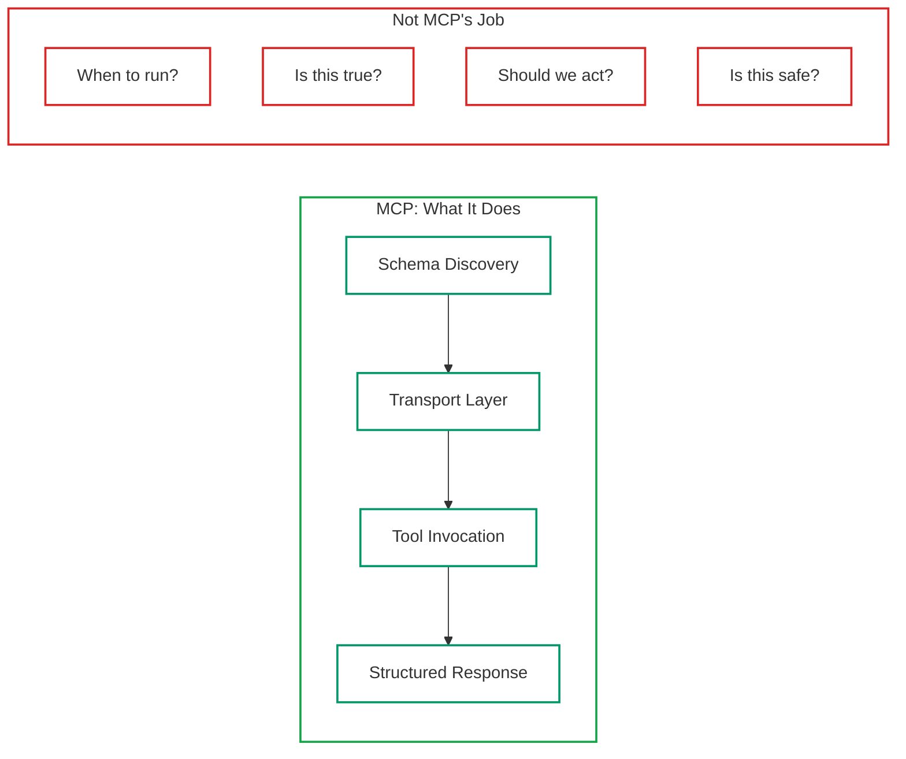
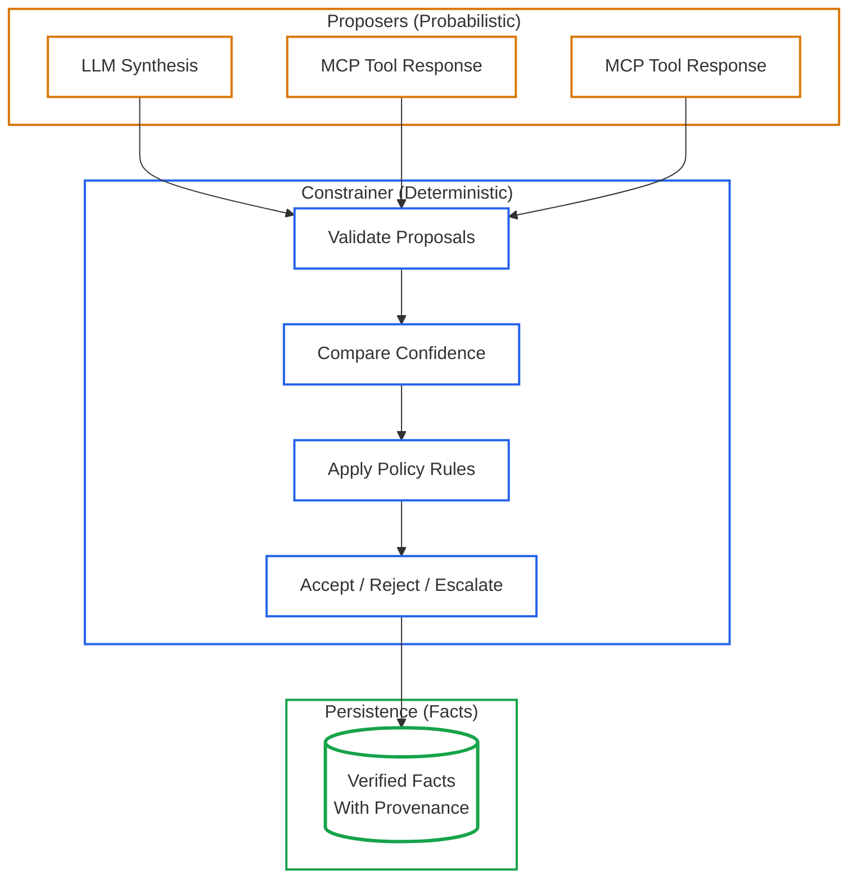
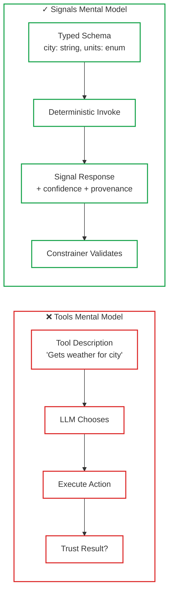
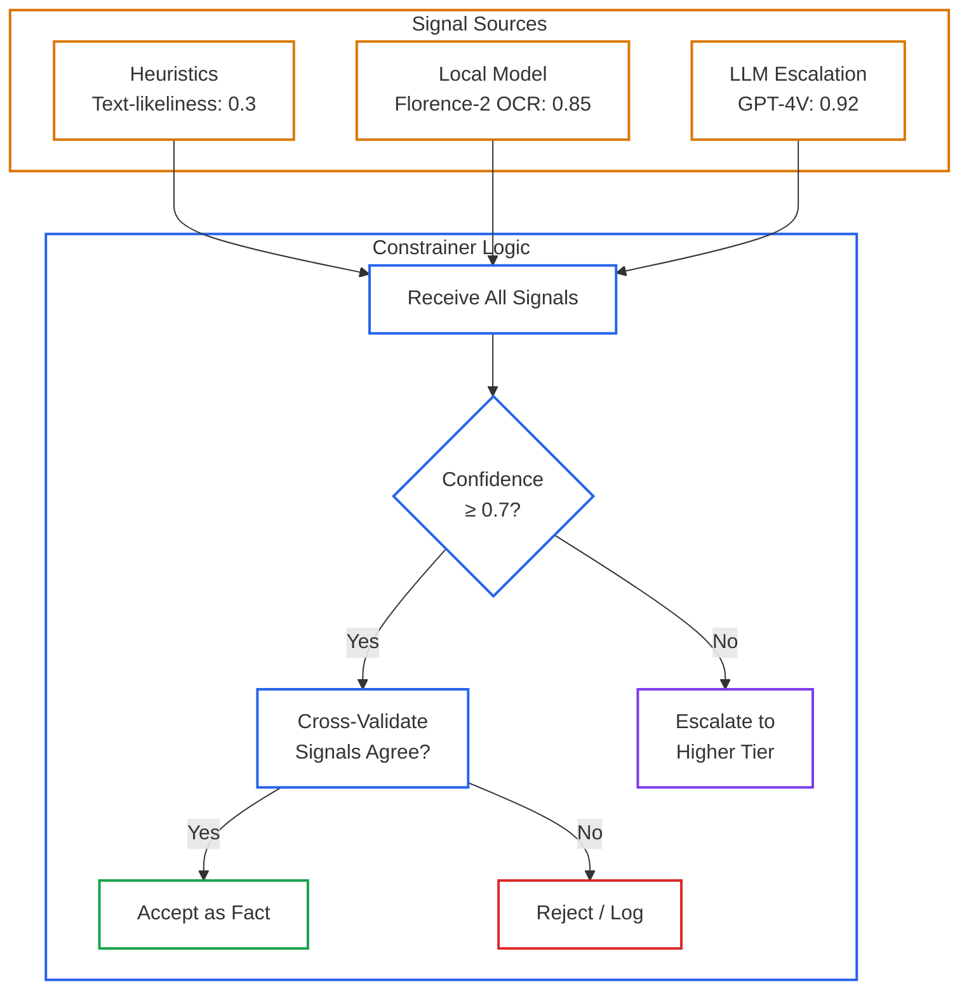
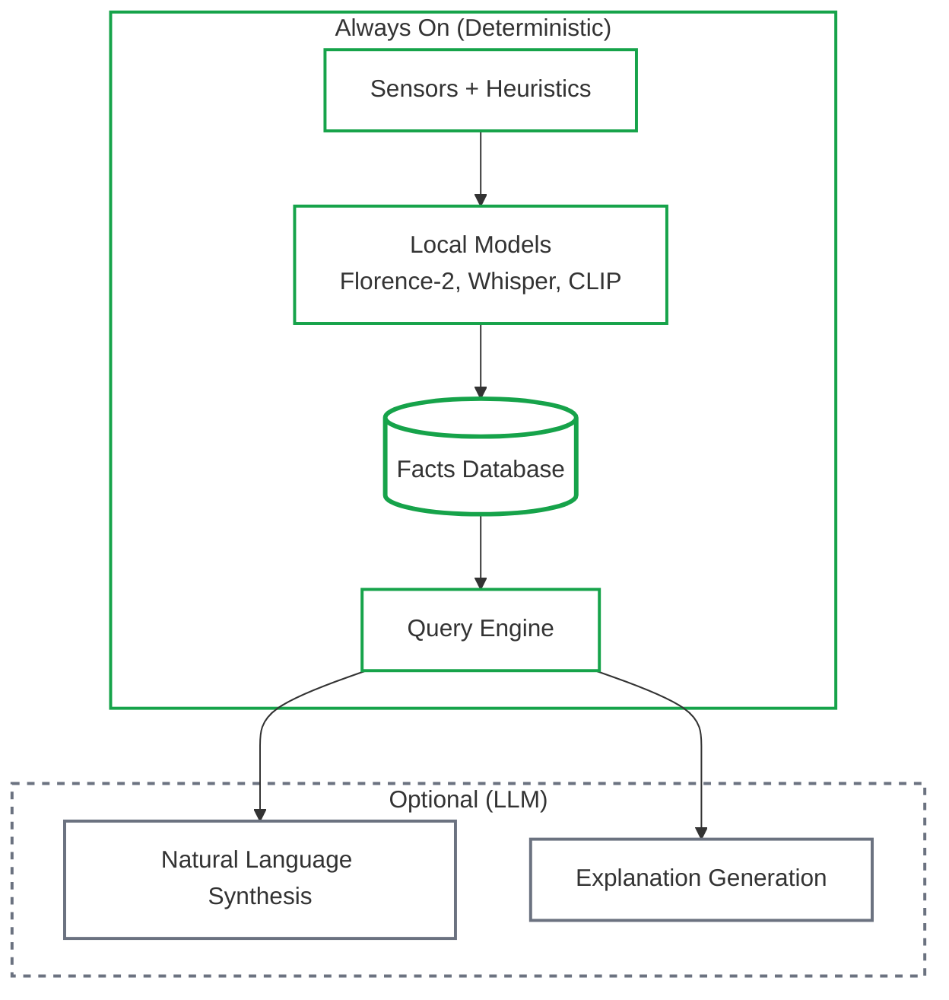
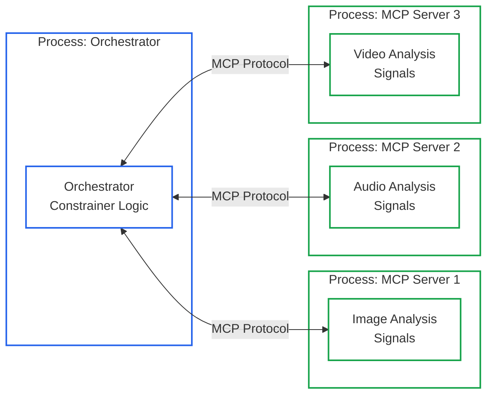

# MCP Is a Transport, Not an Architecture
<!-- category -- MCP, ACP, AI,Architecture,LLM,Patterns -->
<datetime class="hidden">2026-01-20T16:00</datetime>

**"How do I build an MCP server?" is the wrong question.**

SDKs exist. An LLM can scaffold one in seconds. The real question is:

> *What role should an MCP server play inside a system that must not lie?*

The scarce skill now is designing the **system around** MCP: authority, authorisation, auditability, and deterministic control. MCP handles transport : those concerns live elsewhere.

This article explains how I use MCP **without agents, autonomy, or vibes**, and why most MCP examples recreate the same problems we've seen with unconstrained tool calling.

*This is Part 2 of "LLMs as Components". [Part 1: Why LLMs Fail as Sensors](/blog/llms-fail-as-sensors) covered the category error of using LLMs for perception. This article covers the category error of using MCP as architecture.*

[TOC]

---

## What MCP Actually Is (And Isn't)

MCP (Model Context Protocol) is a **wire protocol**. It moves:

- Inputs and outputs
- Schemas
- Tool metadata
- Capability discovery

It does **not**:

- Decide *when* tools should run
- Validate truth
- Enforce trust
- Manage side effects

**MCP is closer to OpenAPI than it is to an agent framework.**

If you're using MCP as your reasoning layer, you've already made the same category error described in [Part 1](/blog/llms-fail-as-sensors).

If MCP is transport, then the architecture lives above it: orchestration, policy, validation, persistence. The rest of this article is that layer.

---

## The Core Principle: Propose vs Decide

This is the foundational rule from [Reduced RAG](/blog/reduced-rag) and [Constrained Fuzziness](/blog/constrained-fuzzy-image-intelligence):

- **Probabilistic components propose**
- **Deterministic systems decide**

In my systems:

- LLMs are *never* authorities
- Tools are *never* autonomous
- Every MCP response is a **proposal**, not a fact

"Deterministic" here doesn't mean simplistic. It means **rule-governed, reproducible, and auditable**.

The MCP server doesn't decide. The constrainer decides.

---

## Why "Tools" Are the Wrong Mental Model

The default MCP framing is:

- "Expose methods as tools"
- "Let the model choose which tool to call"
- "Ask permission before execution"

This fails for predictable reasons:

1. **Tool descriptions become prompts**: The LLM infers intent from wording, not from schema semantics
2. **Tool selection drifts**: The model optimises for plausibility, not correctness, and picks tools based on description similarity
3. **Permission prompts are UX, not safety**: A modal dialog doesn't prevent the wrong tool from being selected
4. **No replayability**: You can't reproduce a session because tool selection was probabilistic

[Toolformer](https://arxiv.org/abs/2302.04761) (2023) established the theoretical basis for LLM tool use: models can learn *when* to call tools by measuring actual outcomes. This was foundational work. But Toolformer operated at training time with curated tool sets - not runtime agent systems with arbitrary MCP endpoints. The lesson from Toolformer isn't "let models choose freely" - it's **measure outcomes objectively**. See [my comparison of Voyager, Toolformer, and structured approaches](/blog/disejustvoyager) for why structure beats brilliance.

**Reframe: MCP endpoints publish signals, not actions.**

- Signals are typed, bounded, and attributable
- Every signal has confidence, provenance, and evidence pointers
- Natural language is a *presentation layer*, not the substrate

---

## Signal Contracts Over Chat

Every MCP endpoint in my systems has:

- **A schema**: Typed inputs and outputs, not free-form text
- **Confidence**: How certain is this result? (0.0–1.0)
- **Provenance**: Where did this come from? (frame ID, bounding box, waveform region)
- **Evidence pointers**: What can be verified independently?

No free-text authority. No "best effort" answers.

**Examples from production systems:**

| Signal | Confidence Source | Evidence Pointer |
|--------|-------------------|------------------|
| OCR text extraction | Florence-2 confidence score | Bounding box coordinates |
| Image classification | CLIP similarity score | Embedding + similarity score + reference image ID |
| Audio transcription | Whisper word-level confidence | Timestamp range |
| Speaker identification | Diarization cluster distance | Segment boundaries |

**The rule: If a result can't be validated, it isn't accepted.**

This is the same principle as [Design Rule #5](/blog/llms-fail-as-sensors): facts need provenance.

---

## The Constrainer: The Part Everyone Skips

Most MCP tutorials show:

1. Define tools
2. Connect to LLM
3. Let it run

The missing component is the **constrainer** - the deterministic logic that:

- Evaluates competing proposals
- Enforces policy
- Decides what persists and what gets rejected
- Routes to escalation when confidence is low

**Real constrainer decisions:**

- Reject LLM caption when heuristics disagree on text-likeliness
- Prefer lower-confidence but evidenced OCR over high-confidence hallucinated text
- Escalate to vision LLM only when local model confidence < 0.7

**MCP connects components. The constrainer governs them.**

---

## Turning the LLM Off (And Why I Do)

My MCP servers still function with the LLM disabled.

This isn't a degraded mode. It's the **primary mode**.

If your system stops working when the LLM is unavailable, the LLM was doing a job it shouldn't have had.

This is the same principle behind [why structure beats brilliance](/blog/disejustvoyager): don't expect one model to do everything. Distribute cognition across a system where deterministic components handle what they're good at.

The core functions:

- Deterministic summarisation from extracted facts
- Evidence-first retrieval via embeddings and filters
- Structured queries against the fact database

The LLM becomes:

- A synthesis layer (optional)
- An explanation engine (when requested)
- An enricher (for natural language output)

The LLM is **not**:

- A decision maker
- Memory
- A truth engine

**Why this matters:**

| Benefit | LLM-Required Systems | LLM-Optional Systems |
|---------|---------------------|----------------------|
| **Cost** | Per-query API costs | Fixed infrastructure |
| **Reliability** | API outage = system down | Core functions continue |
| **Testability** | Mock LLM responses | Deterministic assertions |
| **Trust** | "The model said so" | Evidence chain |

---

## MCP as a Boundary, Not an Integration

I treat MCP as a **hard boundary**:

- **Process isolation**: MCP servers run in separate processes
- **Explicit inputs/outputs**: No shared mutable state
- **No ambient context**: Each call is evaluated on explicit inputs, not conversation residue
- **Typed contracts**: Schema violations are errors, not warnings

This contrasts with:

- In-process agents with shared memory
- Prompt-chaining with hidden context accumulation
- "Conversational" tool use where prior turns affect behaviour

**Why boundaries matter:**

1. **Replay**: Reproduce any session by replaying inputs
2. **Auditing**: Every signal has a traceable origin
3. **Deterministic testing**: Same inputs → same outputs
4. **Compliance**: Explainable decision chains

---

## Failure Modes MCP Examples Don't Talk About

Real failure cases from unconstrained MCP usage:

| Failure Mode | Cause | Mitigation |
|--------------|-------|------------|
| **Tool hallucination** | Description leakage into LLM reasoning | Minimal descriptions, schema-first design |
| **Over-eager execution** | Model calls tools "just to check" | Constrainer gates all invocations |
| **Schema drift** | Tool behaviour changes, schema doesn't | Versioned schemas, contract tests |
| **Silent partial failures** | Tool returns partial data, model proceeds | Confidence thresholds, completeness checks |
| **LLM overconfidence** | Model treats tool output as ground truth | Cross-validation, evidence requirements |
| **Capability escalation** | Model "tries" progressively more powerful tools | Capability tiers + policy gating + budgets |

The common thread: **these failures happen because the LLM is trusted as an authority**.

The fix: **LLMs propose, constrainers decide, facts persist**.

---

## What MCP Is Good At (When Used Properly)

MCP is excellent for:

- **Capability discovery**: Runtime enumeration of available signals
- **Inter-process composition**: Clean boundaries between components
- **Tooling interoperability**: Works with any MCP-compatible client
- **Model-agnostic integration**: Swap LLMs without changing signal contracts

MCP is **not**:

- An agent framework
- A reasoning system
- A safety layer
- A trust boundary

Use MCP for what it is: a wire protocol for structured communication between components.

---

## Where MCP Stops

MCP standardises how models and tools exchange context. It does not define who is allowed to act, under what conditions, or how decisions are audited.

Other approaches exist to formalise those constraints (sometimes described as Action Capability Protocols, ACP): authorisation, attestation, audit trails.

This article isn't about ACP. It's about the design principle: **transport and governance are separate concerns**.

MCP tells you *how* to call a tool. Something else must decide *whether* you should. In my systems, that's the constrainer. In enterprise systems, it might be a policy engine.

---

## Demo MCP vs Production MCP

| Aspect | Demo MCP | Production MCP |
|--------|----------|----------------|
| **Tool descriptions** | Natural language, detailed | Minimal, schema-first |
| **Who decides to call** | LLM | Orchestrator/Constrainer |
| **Response format** | Free-form text | Typed signals with confidence |
| **Validation** | None | Cross-validation, thresholds |
| **LLM dependency** | Required | Optional enrichment |
| **Replay** | Non-deterministic | Fully reproducible |
| **Audit trail** | Conversation logs | Signal provenance chain |

---

## Closing

MCP enables **composition**.
Determinism enables **trust**.
LLMs enable **fluency**.

But only if:

> *Probability proposes : and determinism persists.*

MCP without a constrainer is just prompt injection with extra steps.

Make synthesis the last step. Make the LLM optional. Make every fact traceable.

---

## Key Terms

- **MCP (Model Context Protocol)**: Wire protocol for tool discovery and invocation between processes
- **Constrainer**: Deterministic logic that evaluates proposals and decides what persists
- **Signal**: Typed response with confidence, provenance, and evidence pointers
- **Proposer**: Any component (LLM, local model, heuristic) that suggests facts without authority
- **Evidence pointer**: Reference to verifiable source (bounding box, timestamp, embedding)

---

## Related Articles

**Previous in series:** [Part 1: Why LLMs Fail as Sensors](/blog/llms-fail-as-sensors)

**Theoretical foundations:**
- [Why Structure Beats Brilliance: Voyager, Toolformer, and DiSE](/blog/disejustvoyager) - The case for distributed cognition over single-model brilliance
- [Toolformer paper](https://arxiv.org/abs/2302.04761) - Foundational work on LLMs learning to use tools

**Pattern implementations:**
- [Reduced RAG: Map-Reduce for Probabilistic Systems](/blog/reduced-rag)
- [ImageSummarizer: Constrained Fuzzy Image Intelligence](/blog/constrained-fuzzy-image-intelligence)
- [VideoSummarizer: Reduced RAG for Video](/blog/videosummarizer-scalable-video-intelligence)
- [StyloFlow: Signal-Driven Workflows](/blog/styloflow-signal-driven-workflows)
