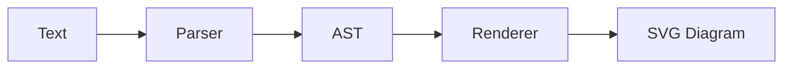
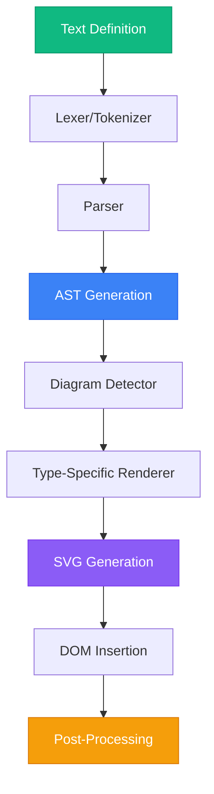
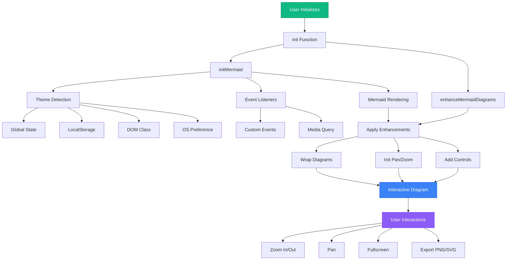

# Mermaid.js Deep Dive: How It Works and How to Extend It

<datetime class="hidden">2025-01-09T16:00</datetime>
<!--category-- JavaScript, Mermaid, SVG, Diagrams, Visualization -->

## Introduction

Mermaid.js is a JavaScript library that transforms text-based definitions into beautiful diagrams. With simple markdown-like syntax, you can create flowcharts, sequence diagrams, Gantt charts, class diagrams, and dozens of other diagram types—all without leaving your text editor or needing specialized diagramming tools.

But how does Mermaid actually work under the hood? How does it transform this:



...into a beautiful SVG diagram? And more importantly, how can you extend it with custom functionality?

In this comprehensive guide, we'll explore Mermaid's internals, dissect the rendering pipeline, and build practical extensions. We'll reference real-world examples from the [`@mostlylucid/mermaid-enhancements`](https://github.com/scottgal/mostlylucidweb/tree/main/mostlylucid-mermaid) package I recently published, which adds interactive pan/zoom, export capabilities, and automatic theme switching to Mermaid diagrams.

[TOC]

## What is Mermaid.js?

Mermaid is a diagramming and charting tool that uses text definitions and a renderer to create and modify diagrams dynamically. Think of it as "Markdown for diagrams."

### Why Mermaid?

**Traditional Diagramming:**
- Create diagram in specialized tool (Visio, draw.io, etc.)
- Export as image
- Embed in documentation
- Need to update? Open the tool again, find the source file, edit, re-export...

**Mermaid Approach:**
- Write diagram definition in text
- Mermaid renders it automatically
- Need to update? Edit the text
- Version control friendly (it's just text!)
- Lives alongside your code/docs

### Supported Diagram Types

Mermaid supports an impressive variety of diagrams:

- **Flowchart** - Decision trees, processes
- **Sequence Diagram** - Message flows, API interactions
- **Class Diagram** - UML class structures
- **State Diagram** - State machines
- **ER Diagram** - Database schemas
- **Gantt** - Project timelines
- **Pie Chart** - Data visualization
- **Git Graph** - Branch visualization
- **User Journey** - UX flows
- **Quadrant Chart** - Strategy matrices
- **Mindmap** - Brainstorming, hierarchies
- **Timeline** - Historical events
- And many more...

## How Mermaid Works: The Rendering Pipeline

Understanding Mermaid's internals is key to extending it effectively. Let's walk through the complete pipeline.



### Step 1: Text Definition

Everything starts with text. Mermaid diagrams are written in a domain-specific language (DSL):

```javascript
// Flowchart example
const flowchart = `
graph TD
    A[Start] --> B{Decision}
    B -->|Yes| C[Action 1]
    B -->|No| D[Action 2]
`;

// Sequence diagram example
const sequence = `
sequenceDiagram
    Alice->>Bob: Hello Bob!
    Bob-->>Alice: Hi Alice!
    Bob->>John: How are you?
`;
```

### Step 2: Lexical Analysis (Lexer)

The lexer breaks the text into tokens. Mermaid uses a combination of custom lexers and grammar definitions.

For example, this flowchart line:
```
A[Start] --> B{Decision}
```

Gets tokenized into:
```javascript
[
    { type: 'NODE_ID', value: 'A' },
    { type: 'NODE_TEXT', value: 'Start' },
    { type: 'ARROW', value: '-->' },
    { type: 'NODE_ID', value: 'B' },
    { type: 'NODE_TEXT', value: 'Decision' },
    { type: 'NODE_SHAPE', value: 'diamond' } // from the { } syntax
]
```

### Step 3: Parsing and AST Generation

The parser consumes tokens and builds an Abstract Syntax Tree (AST). This represents the diagram's structure in a way the renderer can understand.

```javascript
// Simplified AST structure
{
    type: 'flowchart',
    direction: 'TD',
    nodes: [
        { id: 'A', text: 'Start', shape: 'rect' },
        { id: 'B', text: 'Decision', shape: 'diamond' }
    ],
    edges: [
        { from: 'A', to: 'B', type: 'arrow', label: '' }
    ]
}
```

Mermaid uses different parsers for each diagram type. These are typically generated from grammar files using tools like [Jison](https://github.com/zaach/jison) (similar to Yacc/Bison).

### Step 4: Diagram Detection

Mermaid automatically detects the diagram type from the first line:

```javascript
// mermaid/src/diagram-api/diagram-orchestration.ts
export const detectType = function (text: string): string {
    // Look for diagram type keywords
    if (text.match(/^\s*graph/)) return 'flowchart';
    if (text.match(/^\s*sequenceDiagram/)) return 'sequence';
    if (text.match(/^\s*classDiagram/)) return 'class';
    if (text.match(/^\s*stateDiagram/)) return 'state';
    // ... and so on

    return 'flowchart'; // default
};
```

### Step 5: Type-Specific Rendering

Each diagram type has its own renderer. The renderer takes the AST and generates SVG elements.

**Flowchart Renderer (simplified):**

```javascript
// mermaid/src/diagrams/flowchart/flowRenderer.ts
export const draw = function (text, id, _version, diagObj) {
    const graph = diagObj.db; // The parsed AST

    // Create SVG container
    const svg = d3.select(`#${id}`);

    // Render nodes
    graph.getVertices().forEach(vertex => {
        const node = drawNode(svg, vertex);
        // Position calculation, shape rendering, text wrapping
    });

    // Render edges
    graph.getEdges().forEach(edge => {
        const path = drawEdge(svg, edge);
        // Arrow rendering, label positioning
    });

    // Layout algorithm (Dagre for flowcharts)
    dagre.layout(graph);
};
```

Mermaid uses several libraries for layout:
- **Dagre** - Directed graph layout (flowcharts)
- **D3.js** - SVG manipulation and utilities
- **Cytoscape** - Some complex graph layouts
- **Custom algorithms** - For specialized diagrams

### Step 6: SVG Generation

The renderer produces SVG markup:

```xml
<svg id="mermaid-diagram" xmlns="http://www.w3.org/2000/svg">
    <!-- Node A -->
    <g class="node" id="flowchart-A">
        <rect x="0" y="0" width="100" height="50" rx="5" ry="5"/>
        <text x="50" y="25" text-anchor="middle">Start</text>
    </g>

    <!-- Node B -->
    <g class="node" id="flowchart-B">
        <polygon points="50,0 100,50 50,100 0,50"/>
        <text x="50" y="50" text-anchor="middle">Decision</text>
    </g>

    <!-- Edge A -> B -->
    <g class="edge">
        <path d="M 100 25 L 150 25 L 150 50" stroke="#333" fill="none" marker-end="url(#arrowhead)"/>
    </g>
</svg>
```

### Step 7: DOM Insertion

Mermaid finds all elements with class `mermaid` and replaces them with rendered SVG:

```javascript
// mermaid/src/mermaid.ts
export const init = async function (config, nodes) {
    // Find all .mermaid elements
    const nodesToProcess = nodes || document.querySelectorAll('.mermaid');

    for (const node of nodesToProcess) {
        const id = `mermaid-${Date.now()}-${Math.random()}`;
        const txt = node.textContent;

        // Render diagram
        const { svg, bindFunctions } = await render(id, txt);

        // Replace text content with SVG
        node.innerHTML = svg;

        // Bind event handlers if any
        if (bindFunctions) bindFunctions(node);
    }
};
```

### Step 8: Post-Processing

After insertion, additional processing may occur:
- Accessibility attributes (ARIA labels)
- Event listener attachment
- Zoom/pan initialization (if using extensions)
- Theme application

## Extending Mermaid: The Core APIs

Now that we understand how Mermaid works, let's explore how to extend it. There are several extension points:

### 1. Configuration and Initialization

The most basic extension is configuring Mermaid's behavior:

```javascript
import mermaid from 'mermaid';

mermaid.initialize({
    startOnLoad: true,
    theme: 'dark',
    securityLevel: 'loose',

    // Flowchart configuration
    flowchart: {
        curve: 'basis',
        padding: 15,
        useMaxWidth: true,
        htmlLabels: true
    },

    // Sequence diagram configuration
    sequence: {
        diagramMarginX: 50,
        diagramMarginY: 10,
        actorMargin: 50,
        width: 150,
        height: 65,
        boxMargin: 10,
        boxTextMargin: 5,
        noteMargin: 10,
        messageMargin: 35
    },

    // Callbacks
    mermaid: {
        callback: function (id) {
            console.log('Diagram rendered:', id);
        }
    }
});
```

### 2. Theme Customization

Mermaid supports extensive theming through CSS variables and theme configuration.

#### Built-in Themes

```javascript
// Available themes: 'default', 'dark', 'forest', 'neutral', 'base'
mermaid.initialize({ theme: 'dark' });
```

#### Custom Theme Variables

```javascript
mermaid.initialize({
    theme: 'base',
    themeVariables: {
        primaryColor: '#3b82f6',
        primaryTextColor: '#fff',
        primaryBorderColor: '#2563eb',
        lineColor: '#6b7280',
        secondaryColor: '#10b981',
        tertiaryColor: '#f59e0b',

        // Font settings
        fontFamily: 'Inter, system-ui, sans-serif',
        fontSize: '16px',

        // Node-specific
        nodeBorder: '2px',
        nodeTextColor: '#1f2937',

        // Edge-specific
        edgeLabelBackground: '#fff',

        // Background
        background: '#f3f4f6'
    }
});
```

#### Dynamic Theme Switching

Here's how I implemented dynamic theme switching in `@mostlylucid/mermaid-enhancements`:

```typescript
// src/theme-switcher.ts
import mermaid from 'mermaid';

let originalData = new Map<string, string>();
let mermaidInitialized = false;

async function loadMermaid(theme: 'dark' | 'default' = 'default') {
    mermaid.initialize({
        startOnLoad: false,
        theme: theme,
        securityLevel: 'loose',
        fontFamily: 'Segoe UI, Arial, sans-serif',
        fontSize: 16,
        logLevel: 1
    });

    // Get all mermaid elements
    const elements = document.querySelectorAll('.mermaid');

    // Track processed elements
    const processedElements: HTMLElement[] = [];

    for (const element of Array.from(elements)) {
        const id = element.id || `mermaid-${Date.now()}-${Math.random()}`;
        element.id = id;

        // Get original source (from stored data or current content)
        let source = originalData.get(id);
        if (!source) {
            source = element.textContent?.trim() || '';
            originalData.set(id, source);
        }

        if (source) {
            try {
                // Clear previous render
                element.innerHTML = '';
                element.removeAttribute('data-processed');

                // Render with new theme
                const { svg } = await mermaid.render(`mermaid-svg-${id}`, source);
                element.innerHTML = svg;

                processedElements.push(element as HTMLElement);
            } catch (error) {
                console.error(`Failed to render diagram ${id}:`, error);
            }
        }
    }

    mermaidInitialized = true;

    // Apply enhancements after rendering
    const { enhanceMermaidDiagrams } = await import('./enhancements.js');
    enhanceMermaidDiagrams(processedElements);
}

export async function initMermaid() {
    // Detect current theme from multiple sources
    let isDarkMode = false;

    if (typeof window.__themeState !== 'undefined') {
        isDarkMode = window.__themeState === 'dark';
    } else if (localStorage.theme) {
        isDarkMode = localStorage.theme === 'dark';
    } else if (document.documentElement.classList.contains('dark')) {
        isDarkMode = true;
    } else if (window.matchMedia?.('(prefers-color-scheme: dark)').matches) {
        isDarkMode = true;
    }

    // Set up theme change listeners
    document.body.addEventListener('dark-theme-set', async () => {
        await loadMermaid('dark');
    });

    document.body.addEventListener('light-theme-set', async () => {
        await loadMermaid('default');
    });

    // OS preference change listener
    if (typeof window.matchMedia === 'function') {
        const mediaQuery = window.matchMedia('(prefers-color-scheme: dark)');
        mediaQuery.addEventListener('change', async (e) => {
            await loadMermaid(e.matches ? 'dark' : 'default');
        });
    }

    // Initial load
    await loadMermaid(isDarkMode ? 'dark' : 'default');
}
```

**Key implementation details:**

1. **Original Source Preservation**: Store the original diagram source before rendering, so we can re-render with different themes
2. **Multiple Detection Methods**: Check various sources for theme preference (global state, localStorage, DOM class, OS preference)
3. **Event-Driven Updates**: Listen for custom events (`dark-theme-set`, `light-theme-set`) and OS preference changes
4. **Re-render on Theme Change**: Clear the element and re-render with the new theme
5. **Enhancement Coordination**: Apply interactive enhancements after rendering

### 3. Post-Render Enhancements

This is where the real power lies. After Mermaid renders a diagram, you can enhance it with additional functionality.

#### Wrapping Diagrams with Interactive Controls

From `@mostlylucid/mermaid-enhancements`, here's how to wrap rendered diagrams:

```typescript
// src/enhancements.ts
function wrapDiagram(element: HTMLElement): HTMLElement {
    // Skip if already wrapped
    if (element.closest('.mermaid-wrapper')) {
        return element.closest('.mermaid-wrapper') as HTMLElement;
    }

    // Create wrapper
    const wrapper = document.createElement('div');
    wrapper.className = 'mermaid-wrapper';
    wrapper.id = `wrapper-${element.id}`;

    // Insert wrapper
    element.parentNode?.insertBefore(wrapper, element);
    wrapper.appendChild(element);

    return wrapper;
}
```

#### Adding Interactive Pan/Zoom

Using the excellent [`svg-pan-zoom`](https://github.com/bumbu/svg-pan-zoom) library:

```typescript
import svgPanZoom from 'svg-pan-zoom';

const panZoomInstances = new Map<string, PanZoomInstance>();

function initPanZoom(svgElement: SVGElement, diagramId: string) {
    // Clean up existing instance
    if (panZoomInstances.has(diagramId)) {
        try {
            panZoomInstances.get(diagramId)!.destroy();
        } catch (e) {
            console.warn('Failed to destroy existing instance:', e);
        }
        panZoomInstances.delete(diagramId);
    }

    try {
        const instance = svgPanZoom(svgElement, {
            zoomEnabled: true,
            controlIconsEnabled: false,
            fit: true,
            center: true,
            minZoom: 0.1,
            maxZoom: 10,
            zoomScaleSensitivity: 0.3,
            dblClickZoomEnabled: true,
            mouseWheelZoomEnabled: true,
            preventMouseEventsDefault: true,
            contain: false
        });

        panZoomInstances.set(diagramId, instance);
        return instance;
    } catch (error) {
        console.error('Failed to initialize pan-zoom:', error);
        return null;
    }
}
```

#### Creating Control Buttons

Dynamic control button generation:

```typescript
function createControlButtons(container: HTMLElement, diagramId: string) {
    if (container.querySelector('.mermaid-controls')) {
        return;
    }

    const controlsDiv = document.createElement('div');
    controlsDiv.className = 'mermaid-controls';

    const buttons = [
        { icon: 'bx-fullscreen', title: 'Fullscreen', action: 'fullscreen' },
        { icon: 'bx-zoom-in', title: 'Zoom In', action: 'zoomIn' },
        { icon: 'bx-zoom-out', title: 'Zoom Out', action: 'zoomOut' },
        { icon: 'bx-reset', title: 'Reset View', action: 'reset' },
        { icon: 'bx-move', title: 'Toggle Pan', action: 'pan' },
        { icon: 'bx-image', title: 'Export as PNG', action: 'exportPng' },
        { icon: 'bx-code-alt', title: 'Export as SVG', action: 'exportSvg' }
    ];

    buttons.forEach(btn => {
        const button = document.createElement('button');
        button.className = `mermaid-control-btn bx ${btn.icon}`;
        button.setAttribute('title', btn.title);
        button.setAttribute('aria-label', btn.title);
        button.setAttribute('data-action', btn.action);
        button.setAttribute('data-diagram-id', diagramId);
        controlsDiv.appendChild(button);
    });

    container.appendChild(controlsDiv);
}
```

#### Event Delegation for Control Buttons

Efficient event handling with delegation:

```typescript
function initializeEventListeners() {
    // Single event listener for all control buttons
    document.addEventListener('click', async (e) => {
        const target = e.target as HTMLElement;

        if (!target.classList.contains('mermaid-control-btn')) {
            return;
        }

        const action = target.getAttribute('data-action') as ControlAction;
        const diagramId = target.getAttribute('data-diagram-id');

        if (!action || !diagramId) return;

        const wrapper = document.getElementById(`wrapper-${diagramId}`);
        if (!wrapper) return;

        const svgElement = wrapper.querySelector('svg');
        if (!svgElement) return;

        const panZoomInstance = panZoomInstances.get(diagramId);

        switch (action) {
            case 'fullscreen':
                toggleFullscreen(wrapper);
                break;
            case 'zoomIn':
                panZoomInstance?.zoomIn();
                break;
            case 'zoomOut':
                panZoomInstance?.zoomOut();
                break;
            case 'reset':
                panZoomInstance?.reset();
                break;
            case 'pan':
                togglePan(panZoomInstance, target);
                break;
            case 'exportPng':
                await exportDiagram(wrapper, 'png', diagramId);
                break;
            case 'exportSvg':
                await exportDiagram(wrapper, 'svg', diagramId);
                break;
        }
    });
}
```

### 4. Export Functionality

Exporting diagrams requires careful handling of SVG elements and their styling.

#### The Challenge

Mermaid renders SVG diagrams with:
- Dynamic sizing
- Pan/zoom transformations
- Inherited CSS styles
- Relative positioning

To export, we need to:
1. Clone the SVG (avoid modifying the original)
2. Preserve dimensions and viewBox
3. Remove transformations
4. Inline styles
5. Convert to PNG or keep as SVG

#### Implementation

Using [`html-to-image`](https://github.com/bubkoo/html-to-image):

```typescript
import { toPng, toSvg } from 'html-to-image';

async function exportDiagram(
    container: HTMLElement,
    format: 'png' | 'svg',
    diagramId: string
) {
    try {
        const svgElement = container.querySelector('svg');
        if (!svgElement) {
            console.warn('No diagram found to export');
            return;
        }

        // Clone to avoid modifying the original
        const clonedSvg = svgElement.cloneNode(true) as SVGElement;

        // Get or calculate viewBox
        let viewBox = clonedSvg.getAttribute('viewBox');
        if (!viewBox) {
            const bbox = svgElement.getBBox();
            viewBox = `${bbox.x} ${bbox.y} ${bbox.width} ${bbox.height}`;
            clonedSvg.setAttribute('viewBox', viewBox);
        }

        // Set explicit dimensions for proper export
        const [, , vbWidth, vbHeight] = viewBox.split(' ').map(Number);
        clonedSvg.setAttribute('width', vbWidth.toString());
        clonedSvg.setAttribute('height', vbHeight.toString());

        // Remove pan-zoom transforms
        clonedSvg.removeAttribute('style');
        clonedSvg.style.backgroundColor = 'transparent';
        clonedSvg.style.maxWidth = 'none';

        // Create temporary container (off-screen)
        const tempDiv = document.createElement('div');
        tempDiv.style.position = 'absolute';
        tempDiv.style.left = '-9999px';
        tempDiv.appendChild(clonedSvg);
        document.body.appendChild(tempDiv);

        // Generate filename
        const timestamp = new Date().toISOString().replace(/[:.]/g, '-');
        const filename = `mermaid-diagram-${timestamp}`;

        if (format === 'png') {
            const dataUrl = await toPng(clonedSvg, {
                backgroundColor: 'white',
                pixelRatio: 2  // Higher quality
            });
            downloadFile(dataUrl, `${filename}.png`);
        } else {
            const dataUrl = await toSvg(clonedSvg, {
                backgroundColor: 'transparent'
            });
            downloadFile(dataUrl, `${filename}.svg`);
        }

        // Cleanup
        document.body.removeChild(tempDiv);
        console.log(`Diagram exported as ${format.toUpperCase()}`);
    } catch (error) {
        console.error('Failed to export diagram:', error);
    }
}

function downloadFile(dataUrl: string, filename: string) {
    const link = document.createElement('a');
    link.href = dataUrl;
    link.download = filename;
    document.body.appendChild(link);
    link.click();
    document.body.removeChild(link);
}
```

**Key techniques:**

1. **Clone the SVG**: Prevents modifications to the displayed diagram
2. **ViewBox Calculation**: Ensures correct dimensions even with dynamic sizing
3. **Off-Screen Rendering**: Create temporary DOM element for clean export
4. **High DPI Support**: `pixelRatio: 2` for crisp PNG exports
5. **Cleanup**: Remove temporary elements after export

### 5. Fullscreen Lightbox

Implementing an immersive fullscreen view:

```typescript
function toggleFullscreen(wrapper: HTMLElement) {
    if (!document.fullscreenElement) {
        wrapper.requestFullscreen().catch(err => {
            console.error('Failed to enter fullscreen:', err);
        });
    } else {
        document.exitFullscreen();
    }
}

// CSS for fullscreen styling
const fullscreenStyles = `
.mermaid-wrapper:fullscreen {
    background: white;
    padding: 2rem;
    display: flex;
    align-items: center;
    justify-content: center;
}

.dark .mermaid-wrapper:fullscreen {
    background: #1f2937;
}

.mermaid-wrapper:fullscreen svg {
    max-width: 90vw;
    max-height: 90vh;
}
`;
```

### 6. Custom Diagram Types

For advanced users, you can create entirely new diagram types. This requires:

1. **Grammar Definition** - Define syntax using Jison
2. **Parser** - Generate parser from grammar
3. **Database** - Store parsed data
4. **Renderer** - Draw the diagram

**Example: Simple Bar Chart (conceptual)**

```javascript
// 1. Grammar (Jison syntax)
%lex
%%
\s+                   /* skip whitespace */
"barchart"           return 'BARCHART'
[a-zA-Z][a-zA-Z0-9]*  return 'LABEL'
[0-9]+               return 'NUMBER'
":"                  return 'COLON'
<<EOF>>              return 'EOF'
/lex

%start start

%%
start: BARCHART bars EOF;

bars: bar | bars bar;

bar: LABEL COLON NUMBER { yy.addBar($1, $3); };

// 2. Database
class BarChartDB {
    constructor() {
        this.bars = [];
    }

    addBar(label, value) {
        this.bars.push({ label, value });
    }

    getBars() {
        return this.bars;
    }
}

// 3. Renderer
function drawBarChart(text, id, version, diagObj) {
    const bars = diagObj.db.getBars();

    const svg = d3.select(`#${id}`);
    const width = 500;
    const height = 300;

    const xScale = d3.scaleBand()
        .domain(bars.map(b => b.label))
        .range([0, width])
        .padding(0.1);

    const yScale = d3.scaleLinear()
        .domain([0, d3.max(bars, b => b.value)])
        .range([height, 0]);

    svg.selectAll('rect')
        .data(bars)
        .enter()
        .append('rect')
        .attr('x', d => xScale(d.label))
        .attr('y', d => yScale(d.value))
        .attr('width', xScale.bandwidth())
        .attr('height', d => height - yScale(d.value))
        .attr('fill', '#3b82f6');
}

// 4. Register with Mermaid
mermaid.registerDiagram('barchart', {
    parser: barChartParser,
    db: BarChartDB,
    renderer: { draw: drawBarChart }
});
```

Usage:
```
barchart
    Sales: 100
    Marketing: 75
    Engineering: 150
```

## Practical Extension: The Complete Enhancement Package

Let's tie everything together by examining how `@mostlylucid/mermaid-enhancements` orchestrates all these techniques.

### Architecture Overview



### Main Entry Point

```typescript
// src/index.ts
export async function init() {
    // 1. Initialize Mermaid with theme detection
    await initMermaid();

    // 2. Enhancements are applied automatically after rendering
    // (see theme-switcher.ts where enhanceMermaidDiagrams is called)
}

export default {
    init,
    initMermaid,
    enhanceMermaidDiagrams,
    cleanupMermaidEnhancements
};
```

### Enhancement Orchestration

```typescript
// src/enhancements.ts
export function enhanceMermaidDiagrams(
    elements?: HTMLElement[],
    config?: EnhancementConfig
) {
    const mermaidElements = elements ||
        Array.from(document.querySelectorAll('.mermaid')) as HTMLElement[];

    if (mermaidElements.length === 0) {
        console.log('No mermaid diagrams found');
        return;
    }

    mermaidElements.forEach(element => {
        const svgElement = element.querySelector('svg');
        if (!svgElement) {
            console.warn('No SVG found in mermaid element:', element);
            return;
        }

        try {
            // 1. Wrap the diagram
            const wrapper = wrapDiagram(element);
            const diagramId = element.id;

            // 2. Initialize pan/zoom
            const panZoomInstance = initPanZoom(svgElement, diagramId);

            // 3. Create control buttons
            createControlButtons(wrapper, diagramId);

            // 4. Set up event listeners (done once globally)
            if (!eventListenersInitialized) {
                initializeEventListeners();
                eventListenersInitialized = true;
            }

        } catch (error) {
            console.error('Failed to enhance diagram:', error);
        }
    });

    console.log(`Enhanced ${mermaidElements.length} diagrams`);
}
```

### Cleanup and Memory Management

```typescript
export function cleanupMermaidEnhancements() {
    // Destroy all pan-zoom instances
    panZoomInstances.forEach((instance, id) => {
        try {
            instance.destroy();
        } catch (e) {
            console.warn(`Failed to destroy pan-zoom instance ${id}:`, e);
        }
    });
    panZoomInstances.clear();

    // Remove event listeners would go here if not using delegation

    console.log('Mermaid enhancements cleaned up');
}
```

## Styling Mermaid Diagrams

Styling is crucial for polished diagrams. Here's the complete CSS from the package:

```css
/* Diagram wrapper */
.mermaid-wrapper {
    position: relative;
    border-radius: 0.5rem;
    overflow: hidden;
    background: white;
    border: 1px solid #e5e7eb;
    width: 100%;
    margin: 1rem 0;
    box-shadow: 0 1px 3px 0 rgba(0, 0, 0, 0.1);
}

.dark .mermaid-wrapper {
    background: #1f2937;
    border-color: #374151;
}

/* The actual diagram container */
.mermaid-wrapper .mermaid {
    display: flex;
    justify-content: center;
    align-items: center;
    padding: 1rem;
    min-height: 200px;
}

/* SVG responsiveness */
.mermaid-wrapper svg {
    max-width: 100%;
    height: auto;
    display: block;
}

/* Control buttons container */
.mermaid-controls {
    position: absolute;
    top: 0.5rem;
    right: 0.5rem;
    display: flex;
    gap: 0.25rem;
    z-index: 10;
    background: rgba(255, 255, 255, 0.9);
    border-radius: 0.5rem;
    padding: 0.25rem;
    box-shadow: 0 2px 8px rgba(0, 0, 0, 0.1);
    backdrop-filter: blur(4px);
}

.dark .mermaid-controls {
    background: rgba(31, 41, 55, 0.95);
    box-shadow: 0 2px 8px rgba(0, 0, 0, 0.3);
}

/* Individual control buttons */
.mermaid-control-btn {
    padding: 0.5rem;
    border-radius: 0.25rem;
    cursor: pointer;
    transition: all 0.2s;
    background: transparent;
    border: none;
    color: #4b5563;
    font-size: 1.25rem;
    display: flex;
    align-items: center;
    justify-content: center;
}

.dark .mermaid-control-btn {
    color: #9ca3af;
}

.mermaid-control-btn:hover {
    background: rgba(37, 99, 235, 0.1);
    color: #2563eb;
    transform: scale(1.1);
}

.dark .mermaid-control-btn:hover {
    background: rgba(59, 130, 246, 0.2);
    color: #60a5fa;
}

.mermaid-control-btn:active {
    transform: scale(0.95);
}

.mermaid-control-btn.active {
    background: rgba(37, 99, 235, 0.2);
    color: #2563eb;
}

.dark .mermaid-control-btn.active {
    background: rgba(59, 130, 246, 0.3);
    color: #60a5fa;
}

/* Fullscreen mode */
.mermaid-wrapper:fullscreen {
    background: white;
    padding: 2rem;
    display: flex;
    align-items: center;
    justify-content: center;
    border: none;
}

.dark .mermaid-wrapper:fullscreen {
    background: #1f2937;
}

.mermaid-wrapper:fullscreen .mermaid-controls {
    position: fixed;
    top: 1rem;
    right: 1rem;
}

.mermaid-wrapper:fullscreen svg {
    max-width: 90vw;
    max-height: 90vh;
}

/* Responsive design */
@media (max-width: 640px) {
    .mermaid-controls {
        gap: 0.125rem;
        padding: 0.125rem;
    }

    .mermaid-control-btn {
        padding: 0.375rem;
        font-size: 1rem;
    }
}

/* Accessibility */
.mermaid-control-btn:focus-visible {
    outline: 2px solid #2563eb;
    outline-offset: 2px;
}

/* Loading state */
.mermaid-wrapper.loading {
    min-height: 200px;
    display: flex;
    align-items: center;
    justify-content: center;
}

.mermaid-wrapper.loading::after {
    content: "Rendering diagram...";
    color: #6b7280;
    font-size: 0.875rem;
}
```

## Best Practices for Extending Mermaid

Based on real-world experience, here are key best practices:

### 1. Preserve Original Content

Always store the original diagram source before rendering:

```typescript
const originalData = new Map<string, string>();

// Before rendering
originalData.set(elementId, element.textContent);

// For re-rendering with different theme
const source = originalData.get(elementId);
await mermaid.render(elementId, source);
```

### 2. Handle Cleanup Properly

Prevent memory leaks by cleaning up resources:

```typescript
// Store instances
const instances = new Map();

// Clean up before re-initializing
if (instances.has(id)) {
    instances.get(id).destroy();
    instances.delete(id);
}

// Create new instance
const instance = createInstance();
instances.set(id, instance);

// Global cleanup function
export function cleanup() {
    instances.forEach(instance => instance.destroy());
    instances.clear();
}
```

### 3. Use Event Delegation

Single event listener for all diagrams:

```typescript
// ❌ Don't do this
diagrams.forEach(diagram => {
    diagram.querySelector('.btn').addEventListener('click', handler);
});

// ✅ Do this instead
document.addEventListener('click', (e) => {
    if (e.target.matches('.mermaid-control-btn')) {
        handleControlClick(e.target);
    }
});
```

### 4. Defensive SVG Manipulation

SVG elements can be quirky:

```typescript
// Check for existence
const svgElement = container.querySelector('svg');
if (!svgElement) return;

// Clone before modifying
const cloned = svgElement.cloneNode(true);

// Preserve viewBox
let viewBox = cloned.getAttribute('viewBox');
if (!viewBox) {
    const bbox = svgElement.getBBox();
    viewBox = `${bbox.x} ${bbox.y} ${bbox.width} ${bbox.height}`;
    cloned.setAttribute('viewBox', viewBox);
}
```

### 5. Support Multiple Theme Sources

Different sites handle themes differently:

```typescript
function detectTheme(): 'dark' | 'light' {
    // Priority order: explicit state > localStorage > DOM class > OS preference

    if (typeof window.__themeState !== 'undefined') {
        return window.__themeState;
    }

    if (localStorage.theme) {
        return localStorage.theme;
    }

    if (document.documentElement.classList.contains('dark')) {
        return 'dark';
    }

    if (window.matchMedia('(prefers-color-scheme: dark)').matches) {
        return 'dark';
    }

    return 'light';
}
```

### 6. Progressive Enhancement

Ensure basic functionality without JavaScript:

```html
<!-- Fallback for no JavaScript -->
<noscript>
    <div class="mermaid-fallback">
        <pre><code>
graph TD
    A[Start] --> B[End]
        </code></pre>
    </div>
</noscript>

<!-- Enhanced with JavaScript -->
<div class="mermaid">
graph TD
    A[Start] --> B[End]
</div>
```

### 7. Error Handling

Mermaid can fail for various reasons:

```typescript
try {
    const { svg } = await mermaid.render(id, source);
    element.innerHTML = svg;
} catch (error) {
    console.error('Mermaid rendering failed:', error);

    // Show error to user
    element.innerHTML = `
        <div class="mermaid-error">
            <p>Failed to render diagram</p>
            <details>
                <summary>Show error</summary>
                <pre>${error.message}</pre>
            </details>
        </div>
    `;

    // Optionally report to error tracking service
    reportError(error);
}
```

## Performance Considerations

### Lazy Initialization

Don't initialize enhancements until needed:

```typescript
let enhancementsLoaded = false;

async function loadEnhancements() {
    if (enhancementsLoaded) return;

    // Dynamically import enhancement modules
    const { enhanceMermaidDiagrams } = await import('./enhancements.js');

    enhanceMermaidDiagrams();
    enhancementsLoaded = true;
}

// Only load when user interacts
document.addEventListener('click', (e) => {
    if (e.target.closest('.mermaid')) {
        loadEnhancements();
    }
}, { once: true });
```

### Intersection Observer

Render diagrams only when visible:

```typescript
const observer = new IntersectionObserver((entries) => {
    entries.forEach(entry => {
        if (entry.isIntersecting) {
            const element = entry.target;
            renderDiagram(element);
            observer.unobserve(element);
        }
    });
}, { rootMargin: '50px' });

document.querySelectorAll('.mermaid').forEach(el => {
    observer.observe(el);
});
```

### Debouncing Re-renders

On window resize or theme changes:

```typescript
let resizeTimeout: number;

window.addEventListener('resize', () => {
    clearTimeout(resizeTimeout);
    resizeTimeout = window.setTimeout(() => {
        panZoomInstances.forEach(instance => {
            instance.resize();
            instance.fit();
        });
    }, 250);
});
```

## Testing Mermaid Extensions

### Unit Testing

```typescript
import { describe, it, expect, beforeEach, afterEach } from 'vitest';
import { enhanceMermaidDiagrams, cleanupMermaidEnhancements } from './enhancements';

describe('Mermaid Enhancements', () => {
    beforeEach(() => {
        document.body.innerHTML = `
            <div class="mermaid" id="test-diagram">
                <svg></svg>
            </div>
        `;
    });

    afterEach(() => {
        cleanupMermaidEnhancements();
        document.body.innerHTML = '';
    });

    it('should wrap diagrams', () => {
        enhanceMermaidDiagrams();
        const wrapper = document.querySelector('.mermaid-wrapper');
        expect(wrapper).toBeTruthy();
    });

    it('should add control buttons', () => {
        enhanceMermaidDiagrams();
        const controls = document.querySelector('.mermaid-controls');
        expect(controls).toBeTruthy();
        expect(controls.children.length).toBe(7);
    });

    it('should initialize pan-zoom', () => {
        enhanceMermaidDiagrams();
        // Check that svg-pan-zoom was initialized
        // (This requires accessing the instance or checking DOM changes)
    });
});
```

### Integration Testing

```typescript
import { test, expect } from '@playwright/test';

test('mermaid diagrams render correctly', async ({ page }) => {
    await page.goto('/test-page');

    // Wait for diagram to render
    await page.waitForSelector('.mermaid svg');

    // Check SVG exists
    const svg = await page.locator('.mermaid svg');
    expect(await svg.count()).toBeGreaterThan(0);

    // Test zoom in button
    await page.click('[data-action="zoomIn"]');

    // Verify zoom level changed
    // (Check transform or other indicators)

    // Test export
    const downloadPromise = page.waitForEvent('download');
    await page.click('[data-action="exportPng"]');
    const download = await downloadPromise;
    expect(download.suggestedFilename()).toMatch(/\.png$/);
});
```

## Conclusion

Mermaid.js is a powerful diagramming tool, and understanding its internals unlocks endless possibilities for customization and enhancement. Key takeaways:

1. **Rendering Pipeline**: Text → Lexer → Parser → AST → Renderer → SVG → DOM
2. **Extension Points**: Configuration, theming, post-render enhancements, custom diagram types
3. **Real-World Example**: The `@mostlylucid/mermaid-enhancements` package demonstrates practical extensions
4. **Best Practices**: Preserve original content, handle cleanup, use event delegation, support multiple theme sources
5. **Performance**: Lazy loading, intersection observers, debouncing

Whether you're adding simple theme switching or building complex interactive features like pan/zoom and export, Mermaid provides the hooks you need. The `@mostlylucid/mermaid-enhancements` package serves as a complete reference implementation, showing how all these techniques work together in production.

## Resources

- **Mermaid.js Documentation**: [mermaid.js.org](https://mermaid.js.org/)
- **Mermaid GitHub**: [github.com/mermaid-js/mermaid](https://github.com/mermaid-js/mermaid)
- **@mostlylucid/mermaid-enhancements**: [GitHub](https://github.com/scottgal/mostlylucidweb/tree/main/mostlylucid-mermaid) | [npm](https://www.npmjs.com/package/@mostlylucid/mermaid-enhancements)
- **svg-pan-zoom**: [github.com/bumbu/svg-pan-zoom](https://github.com/bumbu/svg-pan-zoom)
- **html-to-image**: [github.com/bubkoo/html-to-image](https://github.com/bubkoo/html-to-image)
- **D3.js**: [d3js.org](https://d3js.org/)

Happy diagramming! 📊
