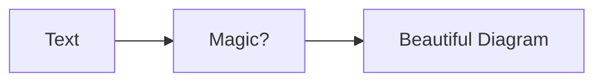
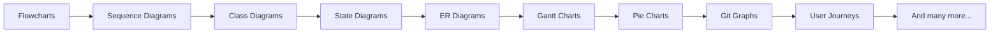
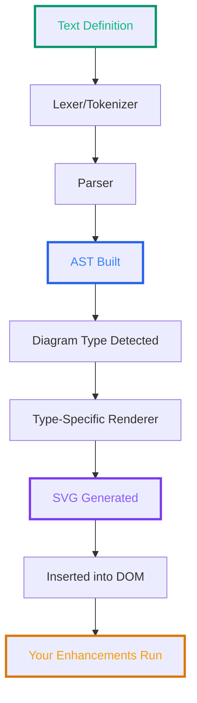
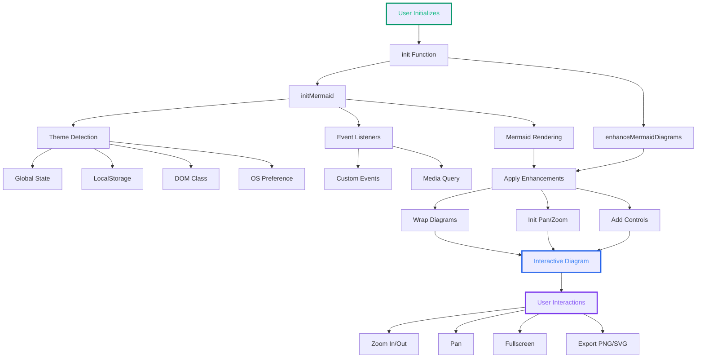

# Mermaid.js Deep Dive: How It Actually Works and How to Extend It

<!--category-- Mermaid, JavaScript, SVG, Diagrams -->
<datetime class="hidden">2025-11-09T16:00</datetime>

# Introduction

> NOTE: This is part of my experiments with AI / a way to spend $1000 Calude Code Web credits. I've fed this a BUNCH of papers, my understanding, questions I had to generate this article. It's fun and fills a gap I haven't seen filled anywhere else.

> **This post builds on previous articles:** If you haven't already, check out [Adding mermaid.js with htmx](/blog/mermaidandhtmx), [Switching Themes for Mermaid](/blog/switchingthemesformermaid), and [Enhancing Mermaid Diagrams with Pan/Zoom and Export](/blog/enhancingmermaiddiagramswithpanzoomandexport). This deep dive explains the internals behind those implementations.

Mermaid.js is genuinely brilliant. Write simple text, get beautiful diagrams. No more fumbling with Visio or draw.io, losing source files, or maintaining separate image files. Everything lives in markdown, version-controlled alongside your code.

But I wanted to know *how* it actually works under the hood. How does this:



...become an actual SVG? And more importantly, how can you hook into it to add features like the pan/zoom, theme switching, and export functionality I built for this site (now available as [@mostlylucid/mermaid-enhancements](https://www.npmjs.com/package/@mostlylucid/mermaid-enhancements))?

After a lot of digging through Mermaid's source code and building real extensions, here's everything I learned about how Mermaid works internally and how to extend it properly.

[TOC]

# What is Mermaid.js?

Mermaid turns text definitions into diagrams. Think "Markdown for diagrams."

**The old way:**
1. Open diagramming tool
2. Create diagram
3. Export as PNG
4. Embed in docs
5. Need to update? Find the source file, edit, re-export, replace image...

**The Mermaid way:**
1. Write diagram in text
2. Done

Update it? Just edit the text. Version control? It's just text! Works in markdown? Yep!

## Diagram Types

Mermaid supports a ridiculous number of diagram types:



See [the Mermaid docs](https://mermaid.js.org/intro/) for the full list.

# How Mermaid Actually Works: The Pipeline

Here's what happens when Mermaid renders a diagram:



Let's break down each step.

## Step 1: Text Definition

Everything starts with text. You write diagrams in Mermaid's DSL (domain-specific language):

```javascript
// Flowchart
const diagram = `
graph TD
    A[Start] --> B{Is it working?}
    B -->|Yes| C[Great!]
    B -->|No| D[Debug time]
`;
```

## Step 2: Lexical Analysis

The lexer breaks text into tokens. For example, this line:

```
A[Start] --> B{Decision}
```

Becomes tokens like:
```javascript
[
    { type: 'NODE_ID', value: 'A' },
    { type: 'NODE_TEXT', value: 'Start' },
    { type: 'ARROW', value: '-->' },
    { type: 'NODE_ID', value: 'B' },
    { type: 'NODE_TEXT', value: 'Decision' },
    { type: 'NODE_SHAPE', value: 'diamond' }  // from { }
]
```

## Step 3: Parsing and AST Generation

The parser consumes tokens and builds an Abstract Syntax Tree (AST):

```javascript
// Simplified AST structure
{
    type: 'flowchart',
    direction: 'TD',
    nodes: [
        { id: 'A', text: 'Start', shape: 'rect' },
        { id: 'B', text: 'Decision', shape: 'diamond' }
    ],
    edges: [
        { from: 'A', to: 'B', type: 'arrow' }
    ]
}
```

Mermaid uses different parsers for each diagram type. These are often generated from grammar files using [Jison](https://github.com/zaach/jison) (like Yacc/Bison for JavaScript).

## Step 4: Diagram Detection

Mermaid detects diagram type from the first line:

```javascript
// Simplified detection logic
if (text.match(/^\s*graph/)) return 'flowchart';
if (text.match(/^\s*sequenceDiagram/)) return 'sequence';
if (text.match(/^\s*classDiagram/)) return 'class';
// ... etc
```

## Step 5: Type-Specific Rendering

Each diagram type has its own renderer. The renderer takes the AST and generates SVG elements.

For flowcharts, Mermaid uses the [Dagre](https://github.com/dagrejs/dagre) library for graph layout. For others, it uses custom algorithms or libraries like Cytoscape.

```javascript
// Simplified flowchart renderer
export const draw = function (text, id, version, diagObj) {
    const graph = diagObj.db;  // The AST
    const svg = d3.select(`#${id}`);

    // Render nodes
    graph.getVertices().forEach(vertex => {
        drawNode(svg, vertex);
    });

    // Render edges
    graph.getEdges().forEach(edge => {
        drawEdge(svg, edge);
    });

    // Apply layout algorithm
    dagre.layout(graph);
};
```

## Step 6: SVG Generation

The renderer produces SVG markup:

```xml
<svg xmlns="http://www.w3.org/2000/svg">
    <g class="node">
        <rect x="0" y="0" width="100" height="50"/>
        <text x="50" y="25">Start</text>
    </g>
    <g class="edge">
        <path d="M 100 25 L 200 25" stroke="#333"/>
    </g>
</svg>
```

## Step 7: DOM Insertion

Mermaid finds all `.mermaid` elements and replaces them with rendered SVG:

```javascript
// From mermaid.ts
export const init = async function (config, nodes) {
    const nodesToProcess = nodes || document.querySelectorAll('.mermaid');

    for (const node of nodesToProcess) {
        const id = `mermaid-${Date.now()}-${Math.random()}`;
        const txt = node.textContent;

        const { svg } = await render(id, txt);
        node.innerHTML = svg;
    }
};
```

## Step 8: Post-Processing (Where You Come In)

After Mermaid inserts the SVG, you can enhance it. This is where all my enhancements hook in:

- Pan/zoom functionality
- Control buttons
- Export capabilities
- Theme switching

More on this below.

# Extending Mermaid: The Extension Points

Now that we know how Mermaid works, let's explore how to extend it.

## 1. Configuration

The most basic extension is configuration:

```javascript
import mermaid from 'mermaid';

mermaid.initialize({
    startOnLoad: true,
    theme: 'dark',
    securityLevel: 'loose',
    flowchart: {
        curve: 'basis',
        padding: 15
    }
});
```

## 2. Theme Customization

I covered this extensively in [Switching Themes for Mermaid](/blog/switchingthemesformermaid), but here's the key implementation:

### The Problem with Theme Switching

Mermaid needs to be initialized with a theme, and you can't change it after. BUT if you want to re-render diagrams with a new theme, you need the original diagram source—which Mermaid *doesn't store in the DOM*.

### The Solution

Store the original content before rendering, then restore and re-render when switching themes:

```javascript
// From my theme-switcher implementation
const originalData = new Map();

// Save original content before first render
const saveOriginalData = async () => {
    const elements = document.querySelectorAll('.mermaid');
    elements.forEach(element => {
        const id = element.id || `mermaid-${Date.now()}`;
        element.id = id;

        // Store the original diagram source
        if (!originalData.has(id)) {
            originalData.set(id, element.textContent?.trim());
        }
    });
};

// When theme changes, restore and re-render
const loadMermaid = async (theme) => {
    mermaid.initialize({
        startOnLoad: false,
        theme: theme
    });

    const elements = document.querySelectorAll('.mermaid');
    for (const element of elements) {
        const source = originalData.get(element.id);
        if (source) {
            element.innerHTML = '';  // Clear
            element.removeAttribute('data-processed');

            const { svg } = await mermaid.render(
                `mermaid-svg-${element.id}`,
                source
            );
            element.innerHTML = svg;
        }
    }
};
```

**Multiple theme detection methods** (sites handle themes differently):

```javascript
function detectTheme() {
    // Check various sources
    if (typeof window.__themeState !== 'undefined') {
        return window.__themeState;
    }
    if (localStorage.theme) {
        return localStorage.theme;
    }
    if (document.documentElement.classList.contains('dark')) {
        return 'dark';
    }
    if (window.matchMedia('(prefers-color-scheme: dark)').matches) {
        return 'dark';
    }
    return 'light';
}
```

See [the full theme switcher code](https://github.com/scottgal/mostlylucidweb/blob/main/Mostlylucid/src/js/memmaid_theme_switch.js) for details.

## 3. Post-Render Enhancements

This is where the real magic happens. After Mermaid renders, you can add interactive features.

I covered this extensively in [Enhancing Mermaid Diagrams with Pan/Zoom and Export](/blog/enhancingmermaiddiagramswithpanzoomandexport), so I'll highlight key techniques here.

### Wrapping Diagrams

Create a wrapper container for controls:

```javascript
function wrapDiagram(element) {
    if (element.closest('.mermaid-wrapper')) {
        return element.closest('.mermaid-wrapper');
    }

    const wrapper = document.createElement('div');
    wrapper.className = 'mermaid-wrapper';
    wrapper.id = `wrapper-${element.id}`;

    element.parentNode.insertBefore(wrapper, element);
    wrapper.appendChild(element);

    return wrapper;
}
```

### Adding Pan/Zoom

Using [svg-pan-zoom](https://github.com/bumbu/svg-pan-zoom):

```javascript
import svgPanZoom from 'svg-pan-zoom';

const panZoomInstances = new Map();

function initPanZoom(svgElement, diagramId) {
    // Clean up existing instance
    if (panZoomInstances.has(diagramId)) {
        panZoomInstances.get(diagramId).destroy();
        panZoomInstances.delete(diagramId);
    }

    const instance = svgPanZoom(svgElement, {
        zoomEnabled: true,
        controlIconsEnabled: false,
        fit: true,
        center: true,
        minZoom: 0.1,
        maxZoom: 10
    });

    panZoomInstances.set(diagramId, instance);
    return instance;
}
```

### Control Buttons

Create floating control panel:

```javascript
function createControlButtons(container, diagramId) {
    const controlsDiv = document.createElement('div');
    controlsDiv.className = 'mermaid-controls';

    const buttons = [
        { icon: 'bx-fullscreen', title: 'Fullscreen', action: 'fullscreen' },
        { icon: 'bx-zoom-in', title: 'Zoom In', action: 'zoomIn' },
        { icon: 'bx-zoom-out', title: 'Zoom Out', action: 'zoomOut' },
        { icon: 'bx-reset', title: 'Reset', action: 'reset' },
        { icon: 'bx-move', title: 'Pan', action: 'pan' },
        { icon: 'bx-image', title: 'Export PNG', action: 'exportPng' },
        { icon: 'bx-code-alt', title: 'Export SVG', action: 'exportSvg' }
    ];

    buttons.forEach(btn => {
        const button = document.createElement('button');
        button.className = `mermaid-control-btn bx ${btn.icon}`;
        button.setAttribute('data-action', btn.action);
        button.setAttribute('data-diagram-id', diagramId);
        controlsDiv.appendChild(button);
    });

    container.appendChild(controlsDiv);
}
```

### Event Delegation (Performance!)

Don't attach listeners to every button. Use event delegation:

```javascript
document.addEventListener('click', (e) => {
    const target = e.target;
    if (!target.classList.contains('mermaid-control-btn')) return;

    const action = target.getAttribute('data-action');
    const diagramId = target.getAttribute('data-diagram-id');
    const panZoom = panZoomInstances.get(diagramId);

    switch (action) {
        case 'zoomIn': panZoom?.zoomIn(); break;
        case 'zoomOut': panZoom?.zoomOut(); break;
        case 'reset': panZoom?.reset(); break;
        // ... etc
    }
});
```

### Export Functionality

**The Challenge:** SVG elements have dynamic sizing, pan/zoom transforms, and inherited styles. To export properly, you need to:

1. Clone the SVG
2. Preserve dimensions
3. Remove transforms
4. Convert to PNG or SVG

Using [html-to-image](https://github.com/bubkoo/html-to-image):

```javascript
import { toPng, toSvg } from 'html-to-image';

async function exportDiagram(container, format, diagramId) {
    const svgElement = container.querySelector('svg');
    if (!svgElement) return;

    // Clone to avoid modifying original
    const clonedSvg = svgElement.cloneNode(true);

    // Get or calculate viewBox
    let viewBox = clonedSvg.getAttribute('viewBox');
    if (!viewBox) {
        const bbox = svgElement.getBBox();
        viewBox = `${bbox.x} ${bbox.y} ${bbox.width} ${bbox.height}`;
        clonedSvg.setAttribute('viewBox', viewBox);
    }

    // Set explicit dimensions
    const [, , width, height] = viewBox.split(' ').map(Number);
    clonedSvg.setAttribute('width', width);
    clonedSvg.setAttribute('height', height);

    // Remove pan-zoom transforms
    clonedSvg.removeAttribute('style');

    // Create off-screen container
    const temp = document.createElement('div');
    temp.style.position = 'absolute';
    temp.style.left = '-9999px';
    temp.appendChild(clonedSvg);
    document.body.appendChild(temp);

    // Export
    const dataUrl = format === 'png'
        ? await toPng(clonedSvg, { pixelRatio: 2 })
        : await toSvg(clonedSvg);

    downloadFile(dataUrl, `diagram-${Date.now()}.${format}`);

    // Cleanup
    document.body.removeChild(temp);
}
```

**Critical details:**
- **Preserve viewBox** - Captures the entire diagram, not just visible portion
- **Off-screen rendering** - Avoid affecting the displayed diagram
- **pixelRatio: 2** - High-DPI for crisp PNG exports

See [the full export code](https://github.com/scottgal/mostlylucidweb/blob/main/Mostlylucid/src/js/mermaid_enhancements.js#L148) for more details.

# The Complete Enhancement Package

I packaged all these enhancements as [@mostlylucid/mermaid-enhancements](https://www.npmjs.com/package/@mostlylucid/mermaid-enhancements). See [Publishing Mermaid Enhancements as an npm Package](/blog/publishingmermaidenhancementsnpm) for full details.

Here's how it all fits together:



## Usage

```bash
npm install @mostlylucid/mermaid-enhancements
```

```typescript
import { init } from '@mostlylucid/mermaid-enhancements';
import '@mostlylucid/mermaid-enhancements/styles.css';

await init();
```

That's it! Your Mermaid diagrams now have:
- ✅ Interactive pan/zoom
- ✅ Fullscreen lightbox
- ✅ PNG/SVG export
- ✅ Automatic theme switching
- ✅ Responsive design

# Integration with HTMX

As I covered in [Adding mermaid.js with htmx](/blog/mermaidandhtmx), you need to re-initialize Mermaid after HTMX content swaps:

```javascript
// On page load
document.addEventListener('DOMContentLoaded', function () {
    mermaid.initialize({ startOnLoad: true });
});

// After HTMX swaps content
document.body.addEventListener('htmx:afterSwap', function(evt) {
    mermaid.run();
});
```

With the enhancements package:

```javascript
import { init, enhanceMermaidDiagrams } from '@mostlylucid/mermaid-enhancements';

// Initial load
await init();

// After HTMX swap
document.body.addEventListener('htmx:afterSwap', async function() {
    await init();  // Re-init Mermaid with current theme
    enhanceMermaidDiagrams();  // Re-apply enhancements
});
```

# Best Practices I Learned

After building this stuff and debugging weird edge cases, here's what works:

## 1. Always Store Original Content

Mermaid doesn't preserve the original diagram source after rendering. You MUST store it yourself:

```javascript
const originalData = new Map();

// Before first render
element.setAttribute('data-original-code', element.textContent);
originalData.set(element.id, element.textContent);

// When re-rendering
element.innerHTML = originalData.get(element.id);
```

## 2. Clean Up Instances

Memory leaks are real. Destroy instances before creating new ones:

```javascript
if (panZoomInstances.has(id)) {
    try {
        panZoomInstances.get(id).destroy();
    } catch (e) {
        console.warn('Failed to destroy:', e);
    }
    panZoomInstances.delete(id);
}
```

## 3. Use Event Delegation

Don't attach listeners to individual buttons:

```javascript
// ❌ Don't do this
buttons.forEach(btn => {
    btn.addEventListener('click', handler);
});

// ✅ Do this
document.addEventListener('click', (e) => {
    if (e.target.matches('.mermaid-control-btn')) {
        handleClick(e.target);
    }
});
```

## 4. Handle Cloudflare Rocket Loader

Rocket Loader delays JavaScript execution. Wait for dependencies:

```javascript
function waitForDependencies(maxAttempts = 50) {
    return new Promise((resolve) => {
        let attempts = 0;

        const check = () => {
            if (window.mermaid && window.htmx && window.Alpine) {
                resolve();
            } else if (attempts >= maxAttempts) {
                resolve();  // Give up
            } else {
                attempts++;
                setTimeout(check, Math.min(50 * Math.pow(1.2, attempts), 500));
            }
        };

        check();
    });
}
```

And exclude your main script from Rocket Loader:

```html
<script src="main.js" data-cfasync="false"></script>
```

## 5. Timing is Everything

Use `requestAnimationFrame` for better timing than arbitrary `setTimeout`:

```javascript
// After Mermaid renders
await mermaid.run();

// Wait for paint before enhancing
await new Promise(resolve => {
    requestAnimationFrame(() => {
        requestAnimationFrame(() => {
            enhanceMermaidDiagrams();
            resolve();
        });
    });
});
```

## 6. Defensive SVG Handling

SVGs can be weird. Always check:

```javascript
const svgElement = container.querySelector('svg');
if (!svgElement) {
    console.warn('No SVG found');
    return;
}

// Clone before modifying
const cloned = svgElement.cloneNode(true);

// Ensure viewBox exists
let viewBox = cloned.getAttribute('viewBox');
if (!viewBox) {
    const bbox = svgElement.getBBox();
    viewBox = `${bbox.x} ${bbox.y} ${bbox.width} ${bbox.height}`;
}
```

# Debugging Tips

## Console Output

With proper initialization, you should see:

```
Saving original data
Loading mermaid with theme: dark
Mermaid initialized
Enhanced 3 diagrams
```

## Testing Checklist

After implementing enhancements:

- [ ] Diagrams render on page load
- [ ] Pan/zoom controls work
- [ ] Fullscreen opens/closes (X, click outside, ESC)
- [ ] PNG export captures full diagram
- [ ] SVG export preserves vectors
- [ ] Works after HTMX content swap
- [ ] Theme switching re-renders correctly
- [ ] Mobile responsive
- [ ] Dark mode styling
- [ ] Keyboard accessibility

## Common Issues

**Diagram not rendering:**
- Check browser console for errors
- Verify Mermaid loaded (`window.mermaid`)
- Check diagram syntax

**Pan/zoom not working:**
- Verify svg-pan-zoom initialized
- Check for conflicting CSS (`pointer-events: none`)
- Inspect instance map

**Export captures only corner:**
- Missing viewBox preservation
- Transform not removed
- Check cloning logic

**Theme not switching:**
- Original data not saved
- `data-processed` not reset
- Event listeners not registered

# Performance Considerations

## Lazy Initialization

Don't load enhancements until needed:

```javascript
let enhancementsLoaded = false;

async function loadEnhancements() {
    if (enhancementsLoaded) return;

    const { enhanceMermaidDiagrams } = await import('./enhancements.js');
    enhanceMermaidDiagrams();
    enhancementsLoaded = true;
}

// Load on first interaction
document.addEventListener('click', (e) => {
    if (e.target.closest('.mermaid')) {
        loadEnhancements();
    }
}, { once: true });
```

## Intersection Observer

Render diagrams only when visible:

```javascript
const observer = new IntersectionObserver((entries) => {
    entries.forEach(entry => {
        if (entry.isIntersecting) {
            renderDiagram(entry.target);
            observer.unobserve(entry.target);
        }
    });
}, { rootMargin: '100px' });

document.querySelectorAll('.mermaid').forEach(el => {
    observer.observe(el);
});
```

## Debounce Re-renders

On resize or theme change:

```javascript
let timeout;
window.addEventListener('resize', () => {
    clearTimeout(timeout);
    timeout = setTimeout(() => {
        panZoomInstances.forEach(instance => {
            instance.resize();
            instance.fit();
        });
    }, 250);
});
```

# In Conclusion

Mermaid.js is fantastic out of the box, but understanding how it works internally lets you build some really cool enhancements. The key insights:

1. **Rendering Pipeline**: Text → Lexer → Parser → AST → Renderer → SVG
2. **Extension Points**: Config, themes, post-render enhancements
3. **Store Original Data**: Mermaid doesn't do it for you
4. **Clean Up Resources**: Memory leaks are real
5. **Event Delegation**: Better performance
6. **Multiple Theme Sources**: Sites handle themes differently
7. **Timing Matters**: Use `requestAnimationFrame`

All the techniques I've covered here are used in production on this site and packaged in [@mostlylucid/mermaid-enhancements](https://www.npmjs.com/package/@mostlylucid/mermaid-enhancements). The complete source is available at [mostlylucidweb/mostlylucid-mermaid](https://github.com/scottgal/mostlylucidweb/tree/main/mostlylucid-mermaid).

## Related Posts

- [Adding mermaid.js with htmx](/blog/mermaidandhtmx)
- [Switching Themes for Mermaid](/blog/switchingthemesformermaid)
- [Enhancing Mermaid Diagrams with Pan/Zoom and Export](/blog/enhancingmermaiddiagramswithpanzoomandexport)
- [Publishing Mermaid Enhancements as an npm Package](/blog/publishingmermaidenhancementsnpm)

## Resources

- [Mermaid.js Documentation](https://mermaid.js.org/)
- [Mermaid GitHub](https://github.com/mermaid-js/mermaid)
- [svg-pan-zoom](https://github.com/bumbu/svg-pan-zoom)
- [html-to-image](https://github.com/bubkoo/html-to-image)
- [My Mermaid Enhancements Package](https://www.npmjs.com/package/@mostlylucid/mermaid-enhancements)

Try the controls on the diagrams above! 📊
