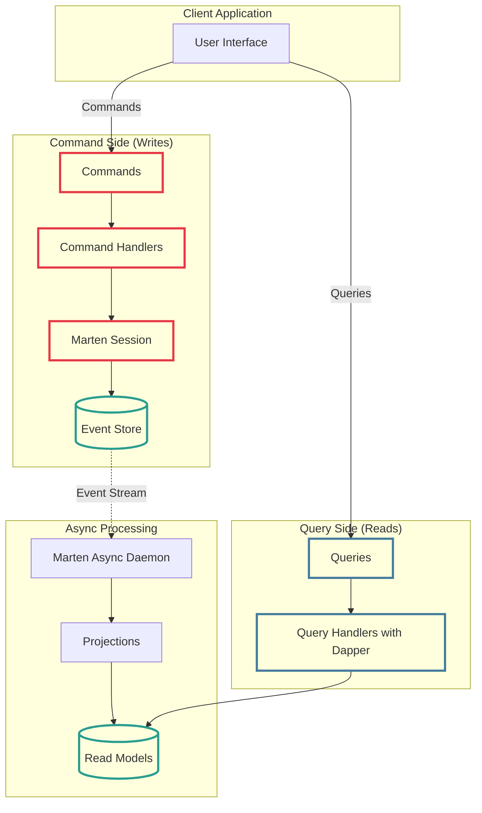
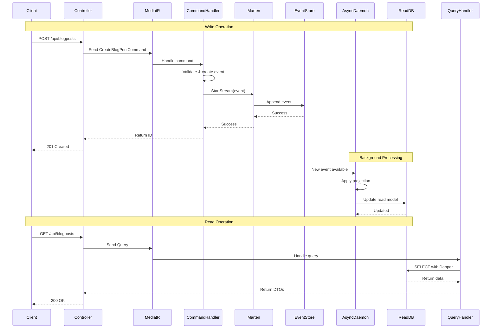

# Modern CQRS and Event Sourcing in .NET: Doing It Properly

<!--category-- ASP.NET, Architecture, CQRS, Event Sourcing -->
<datetime class="hidden">2025-01-13T12:00</datetime>

> **NOTE**: This is an old article I forgot to release. Here it is, enjoy!

CQRS and Event Sourcing - two patterns that are often mentioned together but frequently misunderstood. In this article, I'm going to show you how to implement them properly using modern .NET tools: Marten for event sourcing, Dapper for optimised queries, and MediatR to keep everything organised.

I'll also show you the "half-assed" cache-based alternative, and explain why trying to mix Event Sourcing with manual cache invalidation is a terrible idea.

## Introduction

CQRS (Command Query Responsibility Segregation) and Event Sourcing are two distinct patterns that work exceptionally well together:

- **CQRS** - Separating your read models from your write models
- **Event Sourcing** - Storing every state change as an immutable sequence of events

When done properly with tools like Marten, you get:
- Complete audit trail of every change
- Ability to rebuild state at any point in time
- Automatic read model projections
- Natural fit with domain-driven design

This article focuses on doing it **properly**. If you want the quick-and-dirty cache-based approach, I'll cover that briefly at the end - but it's not really CQRS, and it doesn't give you the benefits of Event Sourcing.

[TOC]

## What Is CQRS?

At its core, CQRS means using different models for reading and writing data:

```csharp
// Write Model - Commands that change state
public record CreateBlogPostCommand(string Title, string Content, string AuthorId);

// Read Model - DTOs optimised for display
public class BlogPostListItemDto
{
    public Guid Id { get; set; }
    public string Title { get; set; }
    public string AuthorName { get; set; }
    public DateTime PublishedDate { get; set; }
    public int CommentCount { get; set; }
}
```

The write side focuses on business logic and validation. The read side is denormalised and optimised for display. Simple enough, but true CQRS means they're completely separate paths through your application.

## What Is Event Sourcing?

Instead of storing current state, you store the events that led to that state:

```csharp
// Traditional: Store current state
public class BlogPost
{
    public Guid Id { get; set; }
    public string Title { get; set; }  // Current title
    public bool IsPublished { get; set; }  // Current status
}

// Event Sourcing: Store the events
public record BlogPostCreated(Guid Id, string Title, string Content, DateTime CreatedAt);
public record BlogPostTitleChanged(Guid Id, string OldTitle, string NewTitle, DateTime ChangedAt);
public record BlogPostPublished(Guid Id, DateTime PublishedAt);
```

Current state is derived by replaying events. This gives you a complete history of everything that's ever happened in your system.

## Why Use Event Sourcing with CQRS?

**Complete Audit Trail**: Every change is recorded. Perfect for financial systems, healthcare, or anywhere you need to prove what happened and when.

**Temporal Queries**: "What did this blog post look like last Tuesday?" becomes trivial - just replay events up to that point.

**Debugging**: Reproduce bugs by replaying the exact sequence of events that caused them.

**Business Intelligence**: Build new reports from historical data without running migrations. The events are already there.

**Natural CQRS Fit**: Events naturally separate writes (append events) from reads (query projections).

### When You Shouldn't

**Simple CRUD**: If you're just storing and retrieving data, Event Sourcing is ridiculous overhead.

**Small team without experience**: The learning curve is steep.

**No audit requirements**: If you only care about current state, don't store history.

**Large binary data**: Events work poorly with images, videos, files.

## Modern Event Sourcing in .NET: Marten

The best tool for Event Sourcing in .NET in 2025 is [Marten](https://martendb.io/). It's an event store built on PostgreSQL, actively maintained by Jeremy Miller, and it just works.

Why Marten?
- Built on PostgreSQL (you already know it)
- Automatic projections from events to read models
- Async daemon for projection processing
- Rich querying capabilities
- Production-ready and battle-tested

### Setting Up Marten

Install the packages:

```bash
dotnet add package Marten
dotnet add package Marten.AspNetCore
```

Configure in `Program.cs`:

```csharp
var builder = WebApplication.CreateBuilder(args);

builder.Services.AddMarten(options =>
{
    options.Connection(builder.Configuration.GetConnectionString("Marten")!);

    // Register event types
    options.Events.AddEventType<BlogPostCreated>();
    options.Events.AddEventType<BlogPostPublished>();
    options.Events.AddEventType<BlogPostTitleChanged>();
    options.Events.AddEventType<CommentAdded>();

    // Configure async projections
    options.Projections.Add<BlogPostProjection>(ProjectionLifecycle.Async);
});

builder.Services.AddMediatR(cfg =>
    cfg.RegisterServicesFromAssembly(typeof(Program).Assembly));

var app = builder.Build();
```

### The Architecture

Here's how everything fits together:



Key points:
- **Commands** append events to the event store
- **Async daemon** processes events and updates read models
- **Queries** read from the denormalised read models
- No manual cache invalidation needed!

## Defining Events

Events are immutable records that describe things that have happened:

```csharp
// Always past tense - these things have happened
public record BlogPostCreated(
    Guid BlogPostId,
    string Title,
    string Content,
    string AuthorId,
    DateTime CreatedAt
);

public record BlogPostPublished(
    Guid BlogPostId,
    DateTime PublishedAt
);

public record BlogPostTitleChanged(
    Guid BlogPostId,
    string OldTitle,
    string NewTitle,
    DateTime ChangedAt
);

public record CommentAdded(
    Guid BlogPostId,
    Guid CommentId,
    string Author,
    string Content,
    DateTime CreatedAt
);
```

Events should be:
- **Immutable** - once written, never changed
- **Past tense** - they describe what happened
- **Rich in business meaning** - "BlogPostTitleChanged" not "PropertyUpdated"

## Creating Aggregates

Aggregates are the write model. They validate business rules and produce events:

```csharp
public class BlogPost
{
    // Marten requires an Id property
    public Guid Id { get; set; }

    // Current state (private setters)
    public string Title { get; private set; } = string.Empty;
    public string Content { get; private set; } = string.Empty;
    public string AuthorId { get; private set; } = string.Empty;
    public bool IsPublished { get; private set; }
    public DateTime? PublishedDate { get; private set; }
    private readonly List<Comment> _comments = new();
    public IReadOnlyList<Comment> Comments => _comments.AsReadOnly();

    // Apply methods - called by Marten when replaying events
    public void Apply(BlogPostCreated e)
    {
        Id = e.BlogPostId;
        Title = e.Title;
        Content = e.Content;
        AuthorId = e.AuthorId;
    }

    public void Apply(BlogPostPublished e)
    {
        IsPublished = true;
        PublishedDate = e.PublishedAt;
    }

    public void Apply(BlogPostTitleChanged e)
    {
        Title = e.NewTitle;
    }

    public void Apply(CommentAdded e)
    {
        _comments.Add(new Comment
        {
            Id = e.CommentId,
            Author = e.Author,
            Content = e.Content,
            CreatedAt = e.CreatedAt
        });
    }

    // Business logic methods that produce events
    public static BlogPostCreated Create(string title, string content, string authorId)
    {
        if (string.IsNullOrWhiteSpace(title))
            throw new ArgumentException("Title is required");

        return new BlogPostCreated(
            Guid.NewGuid(),
            title,
            content,
            authorId,
            DateTime.UtcNow
        );
    }

    public BlogPostPublished Publish()
    {
        if (IsPublished)
            throw new InvalidOperationException("Post is already published");

        return new BlogPostPublished(Id, DateTime.UtcNow);
    }

    public BlogPostTitleChanged ChangeTitle(string newTitle)
    {
        if (string.IsNullOrWhiteSpace(newTitle))
            throw new ArgumentException("Title cannot be empty");

        if (newTitle == Title)
            throw new InvalidOperationException("New title is the same as current title");

        return new BlogPostTitleChanged(Id, Title, newTitle, DateTime.UtcNow);
    }
}

public class Comment
{
    public Guid Id { get; set; }
    public string Author { get; set; } = string.Empty;
    public string Content { get; set; } = string.Empty;
    public DateTime CreatedAt { get; set; }
}
```

The pattern:
1. Business methods validate and return events
2. Apply methods update internal state
3. Marten handles event persistence and replay

## Command Handlers (Write Side)

Commands are handled by appending events to streams:

```csharp
// Define commands
public record CreateBlogPostCommand(
    string Title,
    string Content,
    string AuthorId
) : IRequest<Guid>;

public record PublishBlogPostCommand(Guid BlogPostId) : IRequest;

public record ChangeBlogPostTitleCommand(
    Guid BlogPostId,
    string NewTitle
) : IRequest;

// Handler for creating a blog post
public class CreateBlogPostHandler : IRequestHandler<CreateBlogPostCommand, Guid>
{
    private readonly IDocumentSession _session;

    public CreateBlogPostHandler(IDocumentSession session)
    {
        _session = session;
    }

    public async Task<Guid> Handle(CreateBlogPostCommand request, CancellationToken cancellationToken)
    {
        // Create the event
        var created = BlogPost.Create(
            request.Title,
            request.Content,
            request.AuthorId
        );

        // Start a new event stream
        _session.Events.StartStream<BlogPost>(created.BlogPostId, created);

        await _session.SaveChangesAsync(cancellationToken);

        return created.BlogPostId;
    }
}

// Handler for publishing
public class PublishBlogPostHandler : IRequestHandler<PublishBlogPostCommand>
{
    private readonly IDocumentSession _session;

    public PublishBlogPostHandler(IDocumentSession session)
    {
        _session = session;
    }

    public async Task Handle(PublishBlogPostCommand request, CancellationToken cancellationToken)
    {
        // Load the aggregate by replaying its events
        var blogPost = await _session.Events.AggregateStreamAsync<BlogPost>(
            request.BlogPostId,
            token: cancellationToken
        );

        if (blogPost == null)
            throw new InvalidOperationException($"Blog post {request.BlogPostId} not found");

        // Business logic produces new event
        var published = blogPost.Publish();

        // Append event to the stream
        _session.Events.Append(request.BlogPostId, published);

        await _session.SaveChangesAsync(cancellationToken);
    }
}

// Handler for changing title
public class ChangeBlogPostTitleHandler : IRequestHandler<ChangeBlogPostTitleCommand>
{
    private readonly IDocumentSession _session;

    public ChangeBlogPostTitleHandler(IDocumentSession session)
    {
        _session = session;
    }

    public async Task Handle(ChangeBlogPostTitleCommand request, CancellationToken cancellationToken)
    {
        var blogPost = await _session.Events.AggregateStreamAsync<BlogPost>(
            request.BlogPostId,
            token: cancellationToken
        );

        if (blogPost == null)
            throw new InvalidOperationException($"Blog post {request.BlogPostId} not found");

        var titleChanged = blogPost.ChangeTitle(request.NewTitle);

        _session.Events.Append(request.BlogPostId, titleChanged);

        await _session.SaveChangesAsync(cancellationToken);
    }
}
```

The flow:
1. Load aggregate by replaying events (or create new)
2. Call business method (validates and returns event)
3. Append event to stream
4. Save changes

Marten handles the rest - storing events, triggering projections, etc.

## Read Models and Projections

Projections turn events into denormalised read models:

```csharp
// Read model - optimised for queries
public class BlogPostReadModel
{
    public Guid Id { get; set; }
    public string Title { get; set; } = string.Empty;
    public string Content { get; set; } = string.Empty;
    public string AuthorId { get; set; } = string.Empty;
    public DateTime CreatedAt { get; set; }
    public DateTime? PublishedAt { get; set; }
    public bool IsPublished { get; set; }
    public int CommentCount { get; set; }
}

// Projection - tells Marten how to build read models from events
public class BlogPostProjection : MultiStreamProjection<BlogPostReadModel, Guid>
{
    public BlogPostProjection()
    {
        // Identity tells Marten which stream each event belongs to
        Identity<BlogPostCreated>(x => x.BlogPostId);
        Identity<BlogPostPublished>(x => x.BlogPostId);
        Identity<BlogPostTitleChanged>(x => x.BlogPostId);
        Identity<CommentAdded>(x => x.BlogPostId);
    }

    // Apply methods - Marten calls these to update read models
    public void Apply(BlogPostReadModel view, BlogPostCreated e)
    {
        view.Id = e.BlogPostId;
        view.Title = e.Title;
        view.Content = e.Content;
        view.AuthorId = e.AuthorId;
        view.CreatedAt = e.CreatedAt;
        view.IsPublished = false;
    }

    public void Apply(BlogPostReadModel view, BlogPostPublished e)
    {
        view.IsPublished = true;
        view.PublishedAt = e.PublishedAt;
    }

    public void Apply(BlogPostReadModel view, BlogPostTitleChanged e)
    {
        view.Title = e.NewTitle;
    }

    public void Apply(BlogPostReadModel view, CommentAdded e)
    {
        view.CommentCount++;
    }
}
```

Marten's async daemon processes events in the background and keeps read models up to date. You don't write any cache invalidation code - it's automatic.

## Query Side with Dapper

Now we query the read models using Dapper for maximum performance:

```csharp
// Define queries
public record GetRecentBlogPostsQuery(
    int Count,
    bool PublishedOnly
) : IRequest<List<BlogPostListItemDto>>;

public record GetBlogPostByIdQuery(Guid Id) : IRequest<BlogPostDetailDto?>;

// DTOs for display
public class BlogPostListItemDto
{
    public Guid Id { get; set; }
    public string Title { get; set; } = string.Empty;
    public string AuthorName { get; set; } = string.Empty;
    public DateTime CreatedAt { get; set; }
    public DateTime? PublishedAt { get; set; }
    public int CommentCount { get; set; }
    public bool IsPublished { get; set; }
}

public class BlogPostDetailDto
{
    public Guid Id { get; set; }
    public string Title { get; set; } = string.Empty;
    public string Content { get; set; } = string.Empty;
    public string AuthorId { get; set; } = string.Empty;
    public string AuthorName { get; set; } = string.Empty;
    public DateTime CreatedAt { get; set; }
    public DateTime? PublishedAt { get; set; }
    public bool IsPublished { get; set; }
    public List<CommentDto> Comments { get; set; } = new();
}

public class CommentDto
{
    public Guid Id { get; set; }
    public string Author { get; set; } = string.Empty;
    public string Content { get; set; } = string.Empty;
    public DateTime CreatedAt { get; set; }
}

// Query handlers
public class GetRecentBlogPostsHandler : IRequestHandler<GetRecentBlogPostsQuery, List<BlogPostListItemDto>>
{
    private readonly string _connectionString;

    public GetRecentBlogPostsHandler(IConfiguration config)
    {
        _connectionString = config.GetConnectionString("Marten")!;
    }

    public async Task<List<BlogPostListItemDto>> Handle(
        GetRecentBlogPostsQuery request,
        CancellationToken cancellationToken)
    {
        await using var connection = new NpgsqlConnection(_connectionString);

        // Query the Marten-generated read model table
        const string sql = @"
            SELECT
                bp.id AS Id,
                bp.title AS Title,
                u.name AS AuthorName,
                bp.created_at AS CreatedAt,
                bp.published_at AS PublishedAt,
                bp.comment_count AS CommentCount,
                bp.is_published AS IsPublished
            FROM blog_post_read_models bp
            LEFT JOIN users u ON bp.author_id = u.id
            WHERE (@PublishedOnly = false OR bp.is_published = true)
            ORDER BY
                CASE WHEN bp.is_published THEN bp.published_at
                     ELSE bp.created_at
                END DESC
            LIMIT @Count";

        var results = await connection.QueryAsync<BlogPostListItemDto>(
            sql,
            new
            {
                PublishedOnly = request.PublishedOnly,
                Count = request.Count
            });

        return results.ToList();
    }
}

public class GetBlogPostByIdHandler : IRequestHandler<GetBlogPostByIdQuery, BlogPostDetailDto?>
{
    private readonly string _connectionString;

    public GetBlogPostByIdHandler(IConfiguration config)
    {
        _connectionString = config.GetConnectionString("Marten")!;
    }

    public async Task<BlogPostDetailDto?> Handle(
        GetBlogPostByIdQuery request,
        CancellationToken cancellationToken)
    {
        await using var connection = new NpgsqlConnection(_connectionString);

        const string sql = @"
            SELECT
                bp.id AS Id,
                bp.title AS Title,
                bp.content AS Content,
                bp.author_id AS AuthorId,
                u.name AS AuthorName,
                bp.created_at AS CreatedAt,
                bp.published_at AS PublishedAt,
                bp.is_published AS IsPublished
            FROM blog_post_read_models bp
            LEFT JOIN users u ON bp.author_id = u.id
            WHERE bp.id = @Id";

        var post = await connection.QuerySingleOrDefaultAsync<BlogPostDetailDto>(
            sql,
            new { request.Id });

        if (post == null)
            return null;

        // Get comments from event stream if needed
        // Or maintain a separate comment read model

        return post;
    }
}
```

No caching code. No invalidation logic. Marten keeps the read models in sync automatically.

## Controllers

With MediatR, controllers are beautifully simple:

```csharp
[ApiController]
[Route("api/[controller]")]
public class BlogPostsController : ControllerBase
{
    private readonly IMediator _mediator;

    public BlogPostsController(IMediator mediator)
    {
        _mediator = mediator;
    }

    [HttpGet]
    public async Task<ActionResult<List<BlogPostListItemDto>>> GetRecent(
        [FromQuery] int count = 10,
        [FromQuery] bool publishedOnly = true)
    {
        var query = new GetRecentBlogPostsQuery(count, publishedOnly);
        var results = await _mediator.Send(query);
        return Ok(results);
    }

    [HttpGet("{id}")]
    public async Task<ActionResult<BlogPostDetailDto>> GetById(Guid id)
    {
        var query = new GetBlogPostByIdQuery(id);
        var result = await _mediator.Send(query);

        if (result == null)
            return NotFound();

        return Ok(result);
    }

    [HttpPost]
    public async Task<ActionResult<Guid>> Create([FromBody] CreateBlogPostCommand command)
    {
        var postId = await _mediator.Send(command);
        return CreatedAtAction(nameof(GetById), new { id = postId }, postId);
    }

    [HttpPost("{id}/publish")]
    public async Task<ActionResult> Publish(Guid id)
    {
        await _mediator.Send(new PublishBlogPostCommand(id));
        return NoContent();
    }

    [HttpPut("{id}/title")]
    public async Task<ActionResult> ChangeTitle(
        Guid id,
        [FromBody] ChangeBlogPostTitleCommand command)
    {
        if (id != command.BlogPostId)
            return BadRequest();

        await _mediator.Send(command);
        return NoContent();
    }
}
```

## The Complete Flow

Here's how it all works together:



## Eventual Consistency

One thing to understand: with async projections, there's a small delay between writing an event and the read model being updated. Usually milliseconds, but it's there.

If you need immediate consistency for a specific operation, use inline projections:

```csharp
builder.Services.AddMarten(options =>
{
    // This projection runs synchronously
    options.Projections.Add<CriticalDataProjection>(ProjectionLifecycle.Inline);

    // This projection runs async
    options.Projections.Add<BlogPostProjection>(ProjectionLifecycle.Async);
});
```

Or query the event stream directly for read-after-write scenarios:

```csharp
var blogPost = await _session.Events.AggregateStreamAsync<BlogPost>(id);
```

## Part 2: The Half-Assed Approach (Cache Invalidation)

Right, so you've read about proper Event Sourcing and you're thinking "that's a lot of work". Fair enough. Here's the "informal CQRS" approach that most teams actually use.

### The Setup

- Commands write to database (using EF or Dapper)
- Queries read from IMemoryCache or IDistributedCache
- Commands invalidate relevant cache entries after writing
- No event sourcing, no projections, no async daemons

It's not true CQRS. You don't get the audit trail, temporal queries, or automatic projections. But you do get performance with less complexity.

### Quick Example

```csharp
// Command handler
public class CreateBlogPostHandler : IRequestHandler<CreateBlogPostCommand, int>
{
    private readonly ApplicationDbContext _context;
    private readonly IMemoryCache _cache;

    public async Task<int> Handle(CreateBlogPostCommand request, CancellationToken cancellationToken)
    {
        var blogPost = new BlogPost
        {
            Title = request.Title,
            Content = request.Content,
            AuthorId = request.AuthorId,
            PublishedDate = DateTime.UtcNow
        };

        _context.BlogPosts.Add(blogPost);
        await _context.SaveChangesAsync(cancellationToken);

        // Manual cache invalidation - this is the tedious bit
        _cache.Remove("recent-posts");
        _cache.Remove($"author-posts-{request.AuthorId}");
        _cache.Remove($"post-{blogPost.Id}");

        return blogPost.Id;
    }
}

// Query handler
public class GetRecentPostsHandler : IRequestHandler<GetRecentPostsQuery, List<BlogPostDto>>
{
    private readonly string _connectionString;
    private readonly IMemoryCache _cache;

    public async Task<List<BlogPostDto>> Handle(GetRecentPostsQuery request, CancellationToken cancellationToken)
    {
        var cacheKey = "recent-posts";

        if (_cache.TryGetValue<List<BlogPostDto>>(cacheKey, out var cached))
            return cached!;

        // Cache miss - query with Dapper
        using var connection = new NpgsqlConnection(_connectionString);
        var posts = (await connection.QueryAsync<BlogPostDto>(
            "SELECT id, title, author_name, published_date FROM blog_posts ORDER BY published_date DESC LIMIT 10"
        )).ToList();

        _cache.Set(cacheKey, posts, TimeSpan.FromMinutes(5));
        return posts;
    }
}
```

### When This Works

- Simple applications without complex audit requirements
- You need performance but can't justify Event Sourcing complexity
- Small team that doesn't want to learn Event Sourcing
- Staleness of a few seconds is acceptable

### The Problems

**Cache invalidation is hard**: Miss one cache key and you serve stale data. Every command needs to know which caches to invalidate.

**No audit trail**: You only have current state. Can't prove what happened or when.

**No temporal queries**: Can't ask "what did the system look like yesterday?"

**Scaling**: With IMemoryCache, each server has its own cache. Update on server A, server B still has stale data. IDistributedCache solves this but adds Redis.

**Tight coupling**: Commands are coupled to cache keys. Change a query, might break a command.

It works, but you're trading simplicity for lost capabilities. Sometimes that's the right trade-off. Often it isn't.

## Part 3: The Worst Idea - Event Sourcing + Manual Cache Invalidation

Now for the truly terrible idea: using Event Sourcing but also trying to manually invalidate caches.

### Why People Try This

They want Event Sourcing's audit trail and temporal queries, but they're worried about eventual consistency. So they think "I'll just add cache invalidation to make reads faster and more consistent!"

Don't do this.

### Why It's Terrible

**You've defeated the purpose**: Event Sourcing already builds read models through projections. Adding manual cache invalidation means you're bypassing that system.

**Double complexity**: You now have two systems keeping read models in sync - Marten's projections AND your manual cache invalidation. They will conflict.

**Inconsistent state**: Marten's async daemon updates the database. Your cache invalidation runs immediately. They're out of sync. Which is correct?

**Lost benefits**: Event Sourcing's whole point is that projections are derived from events. Manual cache invalidation breaks that model.

**Debugging nightmare**: Is the stale data because projections haven't run? Or because you forgot to invalidate a cache key? Or because the cache invalidated but the projection hadn't run yet? Good luck.

### The Right Approach

If you need Event Sourcing:
- Use Marten's projections (async or inline)
- Query the read models directly
- Accept eventual consistency (it's usually fine)
- Use inline projections if you really need immediate consistency

If you can't accept eventual consistency:
- Don't use Event Sourcing
- Use the cache-based approach from Part 2
- Or just use traditional CRUD with EF Core

Don't try to do both. You'll end up with the complexity of Event Sourcing plus the fragility of manual cache invalidation.

### Example of What Not To Do

```csharp
// Don't do this!
public class PublishBlogPostHandler : IRequestHandler<PublishBlogPostCommand>
{
    private readonly IDocumentSession _session;
    private readonly IMemoryCache _cache;  // ← BAD

    public async Task Handle(PublishBlogPostCommand request, CancellationToken cancellationToken)
    {
        var blogPost = await _session.Events.AggregateStreamAsync<BlogPost>(request.BlogPostId);
        var published = blogPost.Publish();

        _session.Events.Append(request.BlogPostId, published);
        await _session.SaveChangesAsync(cancellationToken);

        // Manually invalidating cache while using Event Sourcing ← TERRIBLE IDEA
        _cache.Remove($"post-{request.BlogPostId}");
        _cache.Remove("recent-posts");

        // Now you have:
        // 1. Event in event store
        // 2. Cache invalidated
        // 3. But projection hasn't run yet!
        // Queries will hit database before projection completes = stale data
    }
}
```

Just use Marten's projections. They're designed for this.

## Conclusion

Three approaches, three use cases:

### Proper CQRS with Event Sourcing (Marten)

**Use when:**
- You need complete audit trail
- Temporal queries are valuable
- Complex domain with rich business logic
- Financial, healthcare, or regulated systems

**Don't use when:**
- Simple CRUD application
- Team lacks Event Sourcing experience
- No audit requirements

### Informal CQRS with Caching

**Use when:**
- Need performance boost on reads
- Audit trail not required
- Simpler than Event Sourcing
- Eventual consistency acceptable

**Don't use when:**
- Need audit trail
- Need temporal queries
- Cache invalidation complexity outweighs benefits

### Event Sourcing + Manual Cache Invalidation

**Use when:**
- Never. Just don't.

Pick the right tool for your use case. Event Sourcing with Marten is powerful when you need it. Cache-based CQRS is simpler when you don't. Mixing them is a mistake.

For most applications, start with traditional CRUD (see my EF Core series [here](/blog/addingentityframeworkforblogpostspt1)). When you hit performance issues, add caching. Only reach for full Event Sourcing when you genuinely need its specific capabilities.

## Further Reading

- [Marten Documentation](https://martendb.io/) - Excellent docs, well worth reading
- [EventStoreDB](https://www.eventstore.com/) - Alternative event store if Postgres isn't your thing
- [Dapper Documentation](https://github.com/DapperLib/Dapper) - Fast SQL queries
- [MediatR](https://github.com/jbogard/MediatR) - Command/query dispatching
- [Microsoft on CQRS](https://learn.microsoft.com/en-us/azure/architecture/patterns/cqrs) - Official guidance
- My Entity Framework series starting [here](/blog/addingentityframeworkforblogpostspt1) - Traditional approach
