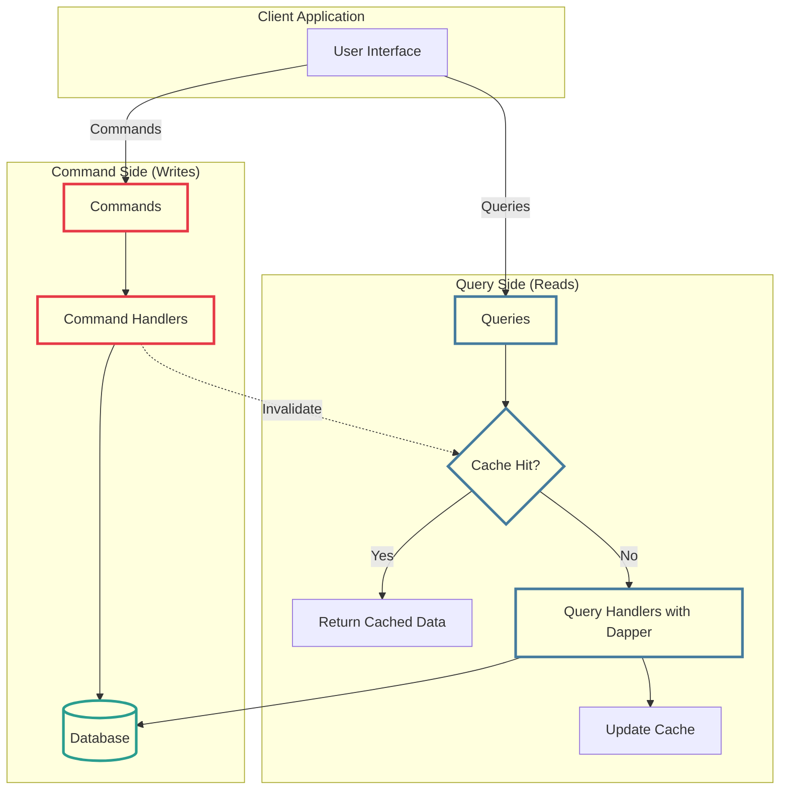
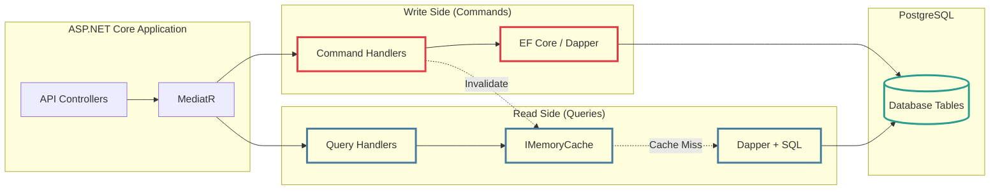
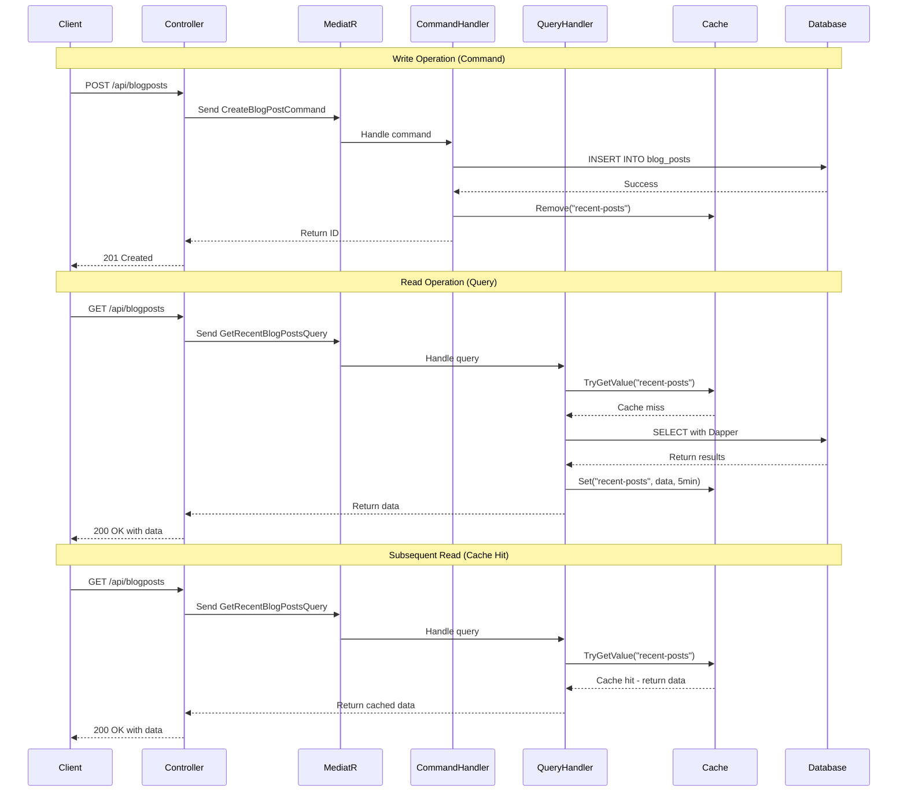

# Practical CQRS in .NET: Dapper, Caching, and MediatR

<!--category-- ASP.NET, Architecture, CQRS -->
<datetime class="hidden">2025-01-13T12:00</datetime>

CQRS (Command Query Responsibility Segregation) - a pattern that sounds far more intimidating than it actually is. I'm going to show you how to implement a practical, scaled-down version of CQRS using tools you probably already know: Dapper for queries, IMemoryCache or IDistributedCache for read performance, and MediatR to keep things organized.

This isn't the full "enterprise CQRS with Event Sourcing" - this is the pragmatic version that actually makes sense for most applications.

## Introduction

CQRS at its simplest is just separating your reads from your writes. That's it. You don't need event sourcing, you don't need separate databases, and you certainly don't need to introduce months of complexity. What you do need is a clear separation between:

- **Commands** - operations that change state (writes)
- **Queries** - operations that read data (reads)

Why bother? Because your read requirements are usually very different from your write requirements. Displaying a blog post list needs data from multiple tables, denormalized and optimized for display. Creating a blog post just needs to validate and insert into a couple of tables.

[TOC]

## What Actually Is CQRS?

At its core, CQRS is remarkably simple: you use different models for reading and writing data. No magic, no complexity - unless you add it yourself.

### The Traditional Approach

Normally, you'd have a single model for both reads and writes:

```csharp
public class BlogPost
{
    public int Id { get; set; }
    public string Title { get; set; }
    public string Content { get; set; }
    public DateTime PublishedDate { get; set; }
    public List<Comment> Comments { get; set; }
}

// Used for both reading AND writing
public interface IBlogRepository
{
    Task<BlogPost> GetById(int id);
    Task Save(BlogPost post);
    Task<List<BlogPost>> GetRecent(int count);
}
```

This works fine for simple scenarios. But what happens when displaying a blog post needs author name, category names, comment counts, and is called 1000 times per second, whilst creating a post happens once per hour?

### The CQRS Approach

CQRS splits these concerns:

```csharp
// Write Model - focused on business logic and validation
public class CreateBlogPostCommand
{
    public string Title { get; set; }
    public string Content { get; set; }
    public string AuthorId { get; set; }
    public List<int> CategoryIds { get; set; }
}

// Read Model - optimized for display, denormalized
public class BlogPostListItemDto
{
    public int Id { get; set; }
    public string Title { get; set; }
    public string AuthorName { get; set; }  // Denormalized
    public DateTime PublishedDate { get; set; }
    public int CommentCount { get; set; }    // Computed
    public string[] CategoryNames { get; set; } // Denormalized
}
```

Notice how the write model focuses on the operation to perform, whilst the read model is completely denormalized and optimized for display? The read side doesn't care about navigation properties or business logic - it just wants data fast.

### CQRS Architecture Visualized

Here's what our practical CQRS setup looks like:



The key insight: commands write to the database and invalidate caches. Queries check the cache first, and only hit the database on cache misses. Simple, effective, and scales beautifully.

## Why This Approach? (And Why Not)

### When You Should Use It

**Different performance characteristics**: Your reads vastly outnumber your writes? This pattern lets you cache aggressively on the read side whilst keeping writes simple.

**Complex read requirements**: When displaying data requires joining multiple tables and computing aggregates, you can cache the expensive queries.

**Need for speed**: IMemoryCache gives you microsecond response times. IDistributedCache lets you scale across servers.

**Clear separation**: Commands and queries become explicit in your codebase. No more wondering if a method mutates state.

### When You Shouldn't

**Simple CRUD applications**: If you're building a basic contact form, this is overkill. Just use EF Core and be done with it.

**Tight deadlines**: If you need to ship tomorrow, stick with what you know.

**Small dataset**: If your entire dataset fits in memory and queries are already fast, don't add complexity.

**Real-time requirements**: If you absolutely need every read to reflect the latest write instantly, caching adds complexity you might not want.

## The Stack

Here's what we'll use:

- **MediatR** - for dispatching commands and queries
- **Dapper** - for fast, raw SQL queries on the read side
- **IMemoryCache or IDistributedCache** - for caching read results
- **Entity Framework Core** (optional) - for writes if you want it
- **PostgreSQL** - our database (but any relational DB works)

### Architecture Overview



## Setting Up MediatR

First, install MediatR:

```bash
dotnet add package MediatR
```

Register it in your DI container:

```csharp
// Program.cs
builder.Services.AddMediatR(cfg =>
    cfg.RegisterServicesFromAssembly(typeof(Program).Assembly));
```

## The Write Side (Commands)

Let's start with commands. These are operations that change state.

### Defining Commands

Commands are just simple records that implement `IRequest`:

```csharp
public record CreateBlogPostCommand(
    string Title,
    string Content,
    string AuthorId,
    List<int> CategoryIds
) : IRequest<int>; // Returns the new blog post ID

public record UpdateBlogPostCommand(
    int Id,
    string Title,
    string Content
) : IRequest;

public record DeleteBlogPostCommand(int Id) : IRequest;
```

### Command Handlers

Handlers process commands. They can use EF Core for convenience or Dapper for performance:

```csharp
public class CreateBlogPostHandler : IRequestHandler<CreateBlogPostCommand, int>
{
    private readonly ApplicationDbContext _context;
    private readonly IMemoryCache _cache;

    public CreateBlogPostHandler(ApplicationDbContext context, IMemoryCache cache)
    {
        _context = context;
        _cache = cache;
    }

    public async Task<int> Handle(CreateBlogPostCommand request, CancellationToken cancellationToken)
    {
        // Validate
        if (string.IsNullOrWhiteSpace(request.Title))
            throw new ArgumentException("Title is required");

        // Create entity
        var blogPost = new BlogPost
        {
            Title = request.Title,
            Content = request.Content,
            AuthorId = request.AuthorId,
            PublishedDate = DateTime.UtcNow
        };

        _context.BlogPosts.Add(blogPost);
        await _context.SaveChangesAsync(cancellationToken);

        // Invalidate relevant caches
        _cache.Remove("recent-posts");
        _cache.Remove($"author-posts-{request.AuthorId}");

        return blogPost.Id;
    }
}
```

Notice how the handler invalidates relevant cache entries after writing? This ensures queries will get fresh data.

### Alternative: Using Dapper for Writes

If you prefer raw SQL even for writes:

```csharp
public class CreateBlogPostHandler : IRequestHandler<CreateBlogPostCommand, int>
{
    private readonly string _connectionString;
    private readonly IMemoryCache _cache;

    public CreateBlogPostHandler(IConfiguration config, IMemoryCache cache)
    {
        _connectionString = config.GetConnectionString("DefaultConnection")!;
        _cache = cache;
    }

    public async Task<int> Handle(CreateBlogPostCommand request, CancellationToken cancellationToken)
    {
        using var connection = new NpgsqlConnection(_connectionString);

        const string sql = @"
            INSERT INTO blog_posts (title, content, author_id, published_date)
            VALUES (@Title, @Content, @AuthorId, @PublishedDate)
            RETURNING id";

        var id = await connection.QuerySingleAsync<int>(sql, new
        {
            request.Title,
            request.Content,
            request.AuthorId,
            PublishedDate = DateTime.UtcNow
        });

        // Invalidate caches
        _cache.Remove("recent-posts");
        _cache.Remove($"author-posts-{request.AuthorId}");

        return id;
    }
}
```

## The Read Side (Queries)

Now the fun part - fast, cached queries with Dapper.

### Installing Dapper

```bash
dotnet add package Dapper
dotnet add package Npgsql
```

### Defining Queries

Queries are also simple records:

```csharp
public record GetRecentBlogPostsQuery(int Count = 10) : IRequest<List<BlogPostListItemDto>>;

public record GetBlogPostByIdQuery(int Id) : IRequest<BlogPostDetailDto?>;

public record GetBlogPostsByAuthorQuery(string AuthorId) : IRequest<List<BlogPostListItemDto>>;
```

### Read Models (DTOs)

These are completely denormalized and optimized for display:

```csharp
public class BlogPostListItemDto
{
    public int Id { get; set; }
    public string Title { get; set; } = string.Empty;
    public string AuthorName { get; set; } = string.Empty;
    public DateTime PublishedDate { get; set; }
    public int CommentCount { get; set; }
    public string[] CategoryNames { get; set; } = Array.Empty<string>();
}

public class BlogPostDetailDto
{
    public int Id { get; set; }
    public string Title { get; set; } = string.Empty;
    public string Content { get; set; } = string.Empty;
    public string AuthorId { get; set; } = string.Empty;
    public string AuthorName { get; set; } = string.Empty;
    public DateTime PublishedDate { get; set; }
    public string[] CategoryNames { get; set; } = Array.Empty<string>();
    public List<CommentDto> Comments { get; set; } = new();
}

public class CommentDto
{
    public int Id { get; set; }
    public string Author { get; set; } = string.Empty;
    public string Content { get; set; } = string.Empty;
    public DateTime CreatedAt { get; set; }
}
```

### Query Handlers with Caching

Here's where Dapper and caching shine:

```csharp
public class GetRecentBlogPostsHandler : IRequestHandler<GetRecentBlogPostsQuery, List<BlogPostListItemDto>>
{
    private readonly string _connectionString;
    private readonly IMemoryCache _cache;

    public GetRecentBlogPostsHandler(IConfiguration config, IMemoryCache cache)
    {
        _connectionString = config.GetConnectionString("DefaultConnection")!;
        _cache = cache;
    }

    public async Task<List<BlogPostListItemDto>> Handle(
        GetRecentBlogPostsQuery request,
        CancellationToken cancellationToken)
    {
        var cacheKey = $"recent-posts-{request.Count}";

        // Try cache first
        if (_cache.TryGetValue<List<BlogPostListItemDto>>(cacheKey, out var cachedPosts))
        {
            return cachedPosts!;
        }

        // Cache miss - query database
        using var connection = new NpgsqlConnection(_connectionString);

        const string sql = @"
            SELECT
                bp.id AS Id,
                bp.title AS Title,
                u.name AS AuthorName,
                bp.published_date AS PublishedDate,
                COUNT(DISTINCT c.id) AS CommentCount,
                ARRAY_AGG(DISTINCT cat.name) AS CategoryNames
            FROM blog_posts bp
            INNER JOIN users u ON bp.author_id = u.id
            LEFT JOIN comments c ON c.blog_post_id = bp.id
            LEFT JOIN blog_post_categories bpc ON bpc.blog_post_id = bp.id
            LEFT JOIN categories cat ON cat.id = bpc.category_id
            GROUP BY bp.id, bp.title, u.name, bp.published_date
            ORDER BY bp.published_date DESC
            LIMIT @Count";

        var posts = (await connection.QueryAsync<BlogPostListItemDto>(sql, new { request.Count }))
            .ToList();

        // Cache for 5 minutes
        _cache.Set(cacheKey, posts, TimeSpan.FromMinutes(5));

        return posts;
    }
}
```

See how clean that is? Check cache, if miss then query with Dapper, cache the result. Fast, simple, effective.

### Query Handler for Single Item

```csharp
public class GetBlogPostByIdHandler : IRequestHandler<GetBlogPostByIdQuery, BlogPostDetailDto?>
{
    private readonly string _connectionString;
    private readonly IMemoryCache _cache;

    public GetBlogPostByIdHandler(IConfiguration config, IMemoryCache cache)
    {
        _connectionString = config.GetConnectionString("DefaultConnection")!;
        _cache = cache;
    }

    public async Task<BlogPostDetailDto?> Handle(
        GetBlogPostByIdQuery request,
        CancellationToken cancellationToken)
    {
        var cacheKey = $"blog-post-{request.Id}";

        if (_cache.TryGetValue<BlogPostDetailDto>(cacheKey, out var cachedPost))
        {
            return cachedPost;
        }

        using var connection = new NpgsqlConnection(_connectionString);

        // Get the post
        const string postSql = @"
            SELECT
                bp.id AS Id,
                bp.title AS Title,
                bp.content AS Content,
                bp.author_id AS AuthorId,
                u.name AS AuthorName,
                bp.published_date AS PublishedDate,
                ARRAY_AGG(DISTINCT cat.name) AS CategoryNames
            FROM blog_posts bp
            INNER JOIN users u ON bp.author_id = u.id
            LEFT JOIN blog_post_categories bpc ON bpc.blog_post_id = bp.id
            LEFT JOIN categories cat ON cat.id = bpc.category_id
            WHERE bp.id = @Id
            GROUP BY bp.id, bp.title, bp.content, bp.author_id, u.name, bp.published_date";

        var post = await connection.QuerySingleOrDefaultAsync<BlogPostDetailDto>(
            postSql,
            new { request.Id });

        if (post == null)
            return null;

        // Get comments separately (could also use multi-mapping)
        const string commentsSql = @"
            SELECT
                id AS Id,
                author AS Author,
                content AS Content,
                created_at AS CreatedAt
            FROM comments
            WHERE blog_post_id = @Id
            ORDER BY created_at ASC";

        post.Comments = (await connection.QueryAsync<CommentDto>(
            commentsSql,
            new { request.Id })).ToList();

        // Cache for 10 minutes
        _cache.Set(cacheKey, post, TimeSpan.FromMinutes(10));

        return post;
    }
}
```

## Using in Controllers

Now your controllers become beautifully simple:

```csharp
[ApiController]
[Route("api/[controller]")]
public class BlogPostsController : ControllerBase
{
    private readonly IMediator _mediator;

    public BlogPostsController(IMediator mediator)
    {
        _mediator = mediator;
    }

    [HttpGet]
    public async Task<ActionResult<List<BlogPostListItemDto>>> GetRecent(
        [FromQuery] int count = 10)
    {
        var query = new GetRecentBlogPostsQuery(count);
        var results = await _mediator.Send(query);
        return Ok(results);
    }

    [HttpGet("{id}")]
    public async Task<ActionResult<BlogPostDetailDto>> GetById(int id)
    {
        var query = new GetBlogPostByIdQuery(id);
        var result = await _mediator.Send(query);

        if (result == null)
            return NotFound();

        return Ok(result);
    }

    [HttpPost]
    public async Task<ActionResult<int>> Create([FromBody] CreateBlogPostCommand command)
    {
        var postId = await _mediator.Send(command);
        return CreatedAtAction(nameof(GetById), new { id = postId }, postId);
    }

    [HttpPut("{id}")]
    public async Task<ActionResult> Update(int id, [FromBody] UpdateBlogPostCommand command)
    {
        if (id != command.Id)
            return BadRequest();

        await _mediator.Send(command);
        return NoContent();
    }

    [HttpDelete("{id}")]
    public async Task<ActionResult> Delete(int id)
    {
        await _mediator.Send(new DeleteBlogPostCommand(id));
        return NoContent();
    }
}
```

Clean as a whistle. The controller just coordinates - it doesn't care about caching, database access, or business logic.

## Using IDistributedCache for Scale

If you're running multiple servers, use IDistributedCache instead:

```bash
dotnet add package Microsoft.Extensions.Caching.StackExchangeRedis
```

Configure it:

```csharp
// Program.cs
builder.Services.AddStackExchangeRedisCache(options =>
{
    options.Configuration = builder.Configuration.GetConnectionString("Redis");
    options.InstanceName = "BlogApp:";
});
```

Update your handlers to use IDistributedCache:

```csharp
public class GetRecentBlogPostsHandler : IRequestHandler<GetRecentBlogPostsQuery, List<BlogPostListItemDto>>
{
    private readonly string _connectionString;
    private readonly IDistributedCache _cache;

    public GetRecentBlogPostsHandler(IConfiguration config, IDistributedCache cache)
    {
        _connectionString = config.GetConnectionString("DefaultConnection")!;
        _cache = cache;
    }

    public async Task<List<BlogPostListItemDto>> Handle(
        GetRecentBlogPostsQuery request,
        CancellationToken cancellationToken)
    {
        var cacheKey = $"recent-posts-{request.Count}";

        // Try cache first
        var cachedData = await _cache.GetStringAsync(cacheKey, cancellationToken);
        if (cachedData != null)
        {
            return JsonSerializer.Deserialize<List<BlogPostListItemDto>>(cachedData)!;
        }

        // Cache miss - query database
        using var connection = new NpgsqlConnection(_connectionString);

        const string sql = @"
            SELECT
                bp.id AS Id,
                bp.title AS Title,
                u.name AS AuthorName,
                bp.published_date AS PublishedDate,
                COUNT(DISTINCT c.id) AS CommentCount,
                ARRAY_AGG(DISTINCT cat.name) AS CategoryNames
            FROM blog_posts bp
            INNER JOIN users u ON bp.author_id = u.id
            LEFT JOIN comments c ON c.blog_post_id = bp.id
            LEFT JOIN blog_post_categories bpc ON bpc.blog_post_id = bp.id
            LEFT JOIN categories cat ON cat.id = bpc.category_id
            GROUP BY bp.id, bp.title, u.name, bp.published_date
            ORDER BY bp.published_date DESC
            LIMIT @Count";

        var posts = (await connection.QueryAsync<BlogPostListItemDto>(sql, new { request.Count }))
            .ToList();

        // Cache for 5 minutes
        var options = new DistributedCacheEntryOptions
        {
            AbsoluteExpirationRelativeToNow = TimeSpan.FromMinutes(5)
        };

        await _cache.SetStringAsync(
            cacheKey,
            JsonSerializer.Serialize(posts),
            options,
            cancellationToken);

        return posts;
    }
}
```

Now your cache is shared across all servers. Perfect for scaled-out deployments.

## Cache Invalidation Strategies

The tricky part of caching is knowing when to invalidate. Here are some approaches:

### 1. Explicit Invalidation (What We've Been Doing)

Handlers invalidate specific cache keys when data changes:

```csharp
public async Task Handle(UpdateBlogPostCommand request, CancellationToken cancellationToken)
{
    // Update the database
    // ...

    // Invalidate affected caches
    _cache.Remove($"blog-post-{request.Id}");
    _cache.Remove("recent-posts");
    _cache.Remove($"author-posts-{authorId}");
}
```

**Pros**: Simple, predictable
**Cons**: Easy to miss a cache key, tight coupling

### 2. Tag-Based Invalidation

Create a wrapper that tracks tags:

```csharp
public class TaggedCache
{
    private readonly IMemoryCache _cache;

    public void Set<T>(string key, T value, TimeSpan expiration, params string[] tags)
    {
        _cache.Set(key, value, expiration);

        foreach (var tag in tags)
        {
            var taggedKeys = _cache.GetOrCreate($"tag:{tag}", _ => new HashSet<string>());
            taggedKeys!.Add(key);
        }
    }

    public void InvalidateTag(string tag)
    {
        if (_cache.TryGetValue($"tag:{tag}", out HashSet<string>? keys) && keys != null)
        {
            foreach (var key in keys)
            {
                _cache.Remove(key);
            }
            _cache.Remove($"tag:{tag}");
        }
    }
}

// Usage
_taggedCache.Set("blog-post-123", post, TimeSpan.FromMinutes(10), "blog-posts", "author-456");

// Invalidate all posts by an author
_taggedCache.InvalidateTag("author-456");
```

### 3. Time-Based Expiration

Sometimes it's simpler to just let caches expire:

```csharp
// Cache for 5 minutes, accept potential stale data
_cache.Set(cacheKey, posts, TimeSpan.FromMinutes(5));
```

This works well for data that changes infrequently and where staleness is acceptable.

## Complete Working Example

Let me tie it all together:

```csharp
// Program.cs
var builder = WebApplication.CreateBuilder(args);

// Add services
builder.Services.AddControllers();
builder.Services.AddDbContext<ApplicationDbContext>(options =>
    options.UseNpgsql(builder.Configuration.GetConnectionString("DefaultConnection")));

builder.Services.AddMemoryCache();
// Or for distributed: builder.Services.AddStackExchangeRedisCache(...)

builder.Services.AddMediatR(cfg =>
    cfg.RegisterServicesFromAssembly(typeof(Program).Assembly));

var app = builder.Build();

app.UseHttpsRedirection();
app.UseAuthorization();
app.MapControllers();

app.Run();
```

The complete flow:



## When to Use Entity Framework Instead

Look, I've used Dapper for the queries in this example, but Entity Framework has its place:

**Simple applications**: If you're building a basic CRUD app without performance concerns, EF is excellent. Change tracking, migrations, LINQ support - it's all there.

**Complex writes**: If your command side involves intricate relationships and you're not fighting performance issues, EF's change tracking saves you pain.

**Team familiarity**: If your team knows EF inside out, there's value in that. Don't change tools just for the sake of it.

I've written extensively about using EF for blog posts [here](/blog/addingentityframeworkforblogpostspt1) and [here](/blog/addingentityframeworkforblogpostspt2). It works well for many use cases. This article is about showing you an alternative that can scale further.

## Trade-Offs and Gotchas

Let's be honest about the downsides:

### Cache Invalidation

Phil Karlton famously said "There are only two hard things in Computer Science: cache invalidation and naming things." He wasn't wrong. Getting cache invalidation right is tricky. Miss a cache key and you serve stale data. Invalidate too aggressively and you lose the performance benefits.

### Cache Consistency

With IMemoryCache, if you scale horizontally, each server has its own cache. Update data on server A, but server B still has the old cached value. Use IDistributedCache to solve this, but that adds complexity and a Redis dependency.

### Increased Complexity

You now have two paths for data access instead of one. That's more code to maintain, more places for bugs to hide.

### Memory Pressure

IMemoryCache uses your application's memory. Cache too much and you'll trigger garbage collections or even out-of-memory errors. Monitor your cache sizes.

## Best Practices

From experience, here's what works:

**1. Start with IMemoryCache**: Only move to IDistributedCache when you actually scale horizontally. Don't add Redis until you need it.

**2. Cache at the right level**: Cache query results, not individual entities. It's more effective and easier to invalidate.

**3. Use sliding expiration for hot data**: Data accessed frequently stays cached longer automatically.

```csharp
_cache.Set(key, value, new MemoryCacheEntryOptions
{
    SlidingExpiration = TimeSpan.FromMinutes(10),
    AbsoluteExpirationRelativeToNow = TimeSpan.FromHours(1)
});
```

**4. Monitor cache hit rates**: Add logging to track cache effectiveness:

```csharp
var cacheKey = $"recent-posts-{request.Count}";
if (_cache.TryGetValue<List<BlogPostListItemDto>>(cacheKey, out var cachedPosts))
{
    _logger.LogDebug("Cache hit for {CacheKey}", cacheKey);
    return cachedPosts!;
}

_logger.LogDebug("Cache miss for {CacheKey}", cacheKey);
// Query database...
```

**5. Use cache keys consistently**: Create a helper class for cache keys to avoid typos:

```csharp
public static class CacheKeys
{
    public static string RecentPosts(int count) => $"recent-posts-{count}";
    public static string BlogPost(int id) => $"blog-post-{id}";
    public static string AuthorPosts(string authorId) => $"author-posts-{authorId}";
}
```

## Conclusion

This is practical CQRS - not the full "enterprise pattern with Event Sourcing" that most articles push. What you get:

- **Clear separation** between reads and writes
- **Fast queries** with Dapper and caching
- **Simple invalidation** when data changes
- **Scalability** when you need it (IDistributedCache)
- **Maintainable code** with MediatR organizing everything

For simple CRUD applications, stick with traditional approaches. But when you need performance, when your read and write patterns diverge, or when you're preparing to scale, this pattern delivers results without the complexity of full Event Sourcing.

Start simple. Add caching to your hottest queries. Separate your commands and queries. You'll be surprised how far this pattern takes you before you need anything more complex.

## Further Reading

- [MediatR Documentation](https://github.com/jbogard/MediatR) - The library tying everything together
- [Dapper Documentation](https://github.com/DapperLib/Dapper) - Fast object mapping
- [Microsoft Caching Docs](https://learn.microsoft.com/en-us/aspnet/core/performance/caching/memory) - IMemoryCache and IDistributedCache
- [Martin Fowler on CQRS](https://martinfowler.com/bliki/CQRS.html) - The original pattern
- My Entity Framework series starting [here](/blog/addingentityframeworkforblogpostspt1) - Traditional approach
