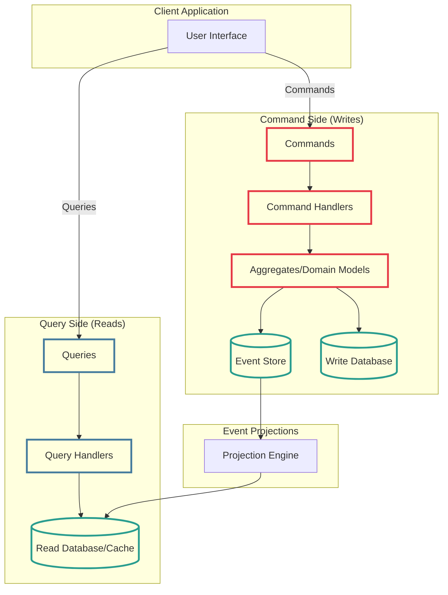
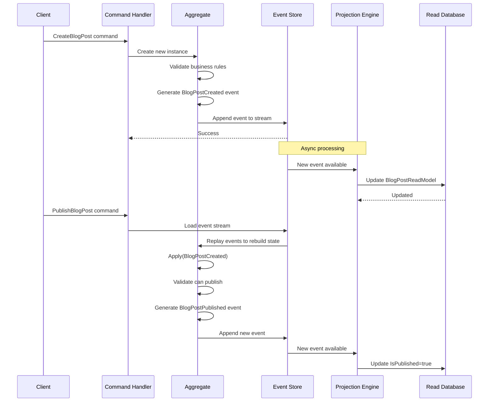
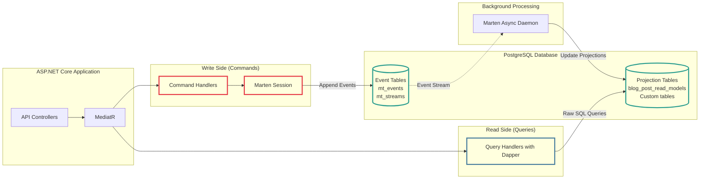

# Modern CQRS and Event Sourcing in .NET: A Pragmatic Guide

<!--category-- ASP.NET, Architecture, CQRS, Event Sourcing -->
<datetime class="hidden">2025-01-13T12:00</datetime>

CQRS and Event Sourcing - two patterns that seem to inspire equal parts enthusiasm and dread in the .NET community. I've spent the better part of a year wrestling with these concepts, and I want to give you the unvarnished truth about when they're useful and when they're complete overkill.

## Introduction

CQRS (Command Query Responsibility Segregation) and Event Sourcing are often mentioned in the same breath, but they're actually separate patterns that work well together. Think of CQRS as separating your reads from your writes, and Event Sourcing as storing every change to your system as an immutable sequence of events rather than just the current state.

In this article, I'm going to show you how to implement these patterns in modern .NET using Dapper for the query side (because sometimes you just want to write SQL and be done with it) and Marten for event sourcing (because it's excellent). I'll also touch on where Entity Framework fits in, even though we're not using it this time around.

[TOC]

## What Actually Is CQRS?

At its core, CQRS is remarkably simple: you use different models for reading and writing data. That's it. No magic, no complexity - unless you add it yourself, which people invariably do.

### The Traditional Approach

Normally, you'd have a single model for both reads and writes:

```csharp
public class BlogPost
{
    public int Id { get; set; }
    public string Title { get; set; }
    public string Content { get; set; }
    public DateTime PublishedDate { get; set; }
    public List<Comment> Comments { get; set; }
}

// Used for both reading AND writing
public interface IBlogRepository
{
    Task<BlogPost> GetById(int id);
    Task Save(BlogPost post);
    Task<List<BlogPost>> GetRecent(int count);
}
```

This works fine for simple scenarios. But what happens when your read requirements differ wildly from your write requirements? What if displaying a blog post needs data from five different tables, but creating a post only touches two?

### The CQRS Approach

CQRS takes a different approach and splits them:

```csharp
// Write Model - focused on business logic and validation
public class CreateBlogPostCommand
{
    public string Title { get; set; }
    public string Content { get; set; }
    public string AuthorId { get; set; }
}

public class BlogPostAggregate
{
    public Guid Id { get; private set; }
    public string Title { get; private set; }
    public string Content { get; private set; }

    public void UpdateTitle(string newTitle)
    {
        if (string.IsNullOrWhiteSpace(newTitle))
            throw new ArgumentException("Title cannot be empty");

        Title = newTitle;
        // Raise domain event
    }
}

// Read Model - optimised for display, potentially denormalised
public class BlogPostListItemDto
{
    public Guid Id { get; set; }
    public string Title { get; set; }
    public string AuthorName { get; set; }
    public DateTime PublishedDate { get; set; }
    public int CommentCount { get; set; }
}

// Separate handlers for commands and queries
public interface ICommandHandler<in TCommand>
{
    Task Handle(TCommand command);
}

public interface IQueryHandler<in TQuery, TResult>
{
    Task<TResult> Handle(TQuery query);
}
```

Notice how the write side can enforce business rules, whilst the read side is just a simple DTO optimised for display? That's the beauty of it.

### CQRS Architecture Visualised

Here's what a typical CQRS setup looks like:



The key insight here is that commands and queries flow through completely separate pipelines. This separation allows you to optimise each side independently.

## Why CQRS? (And Why Not)

### When You Should Use It

**Different scaling requirements**: Your reads vastly outnumber your writes? CQRS lets you scale them independently. I can stick the read side behind Redis and serve millions of requests whilst the write side trundles along happily on a single database instance.

**Complex business logic**: When your write operations involve intricate business rules, aggregate boundaries, and domain events, CQRS gives you a clean way to handle that complexity without polluting your read models.

**Reporting and analytics**: If you need wildly different views of the same data - detailed admin views, customer-facing summaries, analytics reports - separate read models make perfect sense.

**Audit requirements**: Combined with Event Sourcing, CQRS gives you a complete audit trail of every change ever made to your system.

### When You Absolutely Shouldn't

**Simple CRUD applications**: If you're building a basic contact form or a simple blog (yes, the irony isn't lost on me given what I built), CQRS is massive overkill. You're just adding complexity for no benefit.

**Small teams or solo developers**: The cognitive overhead of maintaining separate models isn't worth it unless you're getting clear benefits. I've seen too many solo developers tie themselves in knots trying to apply enterprise patterns to their side project.

**Tight deadlines**: If you need to ship tomorrow, stick with what you know. CQRS has a learning curve.

**Simple domain logic**: If your "business logic" is basically "save this to the database", you don't need CQRS. Really, you don't.

## Enter Event Sourcing

Event Sourcing is the practice of storing every state change as a sequence of events. Instead of storing the current state, you store the events that led to that state.

### Traditional State Storage

```csharp
// Traditional: We only store current state
public class BankAccount
{
    public Guid Id { get; set; }
    public decimal Balance { get; set; } // Current balance is 100
}
```

If the balance is £100, you have no idea how it got there. Was it a single deposit? Multiple transactions? You've lost that information.

### Event Sourced Storage

```csharp
// Events that happened
public record AccountCreated(Guid AccountId, string Owner);
public record MoneyDeposited(Guid AccountId, decimal Amount, DateTime When);
public record MoneyWithdrawn(Guid AccountId, decimal Amount, DateTime When);

// Event Store contains:
// 1. AccountCreated(Id: 123, Owner: "Scott")
// 2. MoneyDeposited(Id: 123, Amount: 100, When: 2025-01-01)
// 3. MoneyWithdrawn(Id: 123, Amount: 20, When: 2025-01-02)
// 4. MoneyDeposited(Id: 123, Amount: 20, When: 2025-01-03)

// Current state is derived by replaying events
public class BankAccount
{
    public Guid Id { get; private set; }
    public decimal Balance { get; private set; }

    public void Apply(AccountCreated e) => Id = e.AccountId;
    public void Apply(MoneyDeposited e) => Balance += e.Amount;
    public void Apply(MoneyWithdrawn e) => Balance -= e.Amount;
}
```

Now you know exactly how you got to £100. You can recreate any historical state. You can build new projections of old events. You have a complete audit trail. This is powerful stuff.

### Event Sourcing Flow Visualised

Here's how Event Sourcing actually works in practice:



This sequence shows the key aspects of Event Sourcing:
1. **Commands** validate and generate events (not directly mutate state)
2. **Events** are appended to an immutable log (the Event Store)
3. **Current state** is reconstructed by replaying all events
4. **Projections** asynchronously update read models for queries

### Why Event Sourcing? (And Why Not)

**When You Should:**

- **Audit requirements**: Financial systems, healthcare, anything where you need to prove what happened and when
- **Temporal queries**: "What did the system look like last Tuesday?" becomes trivial
- **Debugging**: Replay events to reproduce bugs
- **Business intelligence**: Build new reports from historical data without running migrations
- **Domain complexity**: Complex domains where the sequence of changes matters

**When You Shouldn't:**

- **Simple CRUD**: If you're just storing and retrieving data, Event Sourcing is ridiculous overhead
- **Reporting against current state only**: If you never need historical data, you're just adding complexity
- **Large binary data**: Event Sourcing works poorly with files, images, videos
- **Team experience**: The learning curve is steep; don't inflict this on a team that's not ready
- **Performance sensitive reads**: Replaying hundreds of events to get current state can be slow (though this is solved with snapshots)

## Modern Event Sourcing in .NET: Marten

Right, so you've decided Event Sourcing makes sense for your use case. What's the best tool in .NET in 2025? Hands down, it's [Marten](https://martendb.io/).

Marten is an Event Store built on PostgreSQL, and it's maintained by Jeremy Miller (of StructureMap fame). It's production-ready, actively maintained, and doesn't require you to learn a whole new database system.

### The Marten + Dapper Architecture

Here's how the complete stack fits together:



The beauty of this setup:
- **Marten** handles all the event sourcing complexity on the write side
- **Dapper** gives you full SQL control on the read side
- **PostgreSQL** serves as both event store and read database
- **MediatR** keeps everything decoupled and testable

### Setting Up Marten

First, install the package:

```bash
dotnet add package Marten
dotnet add package Marten.AspNetCore
```

Configuration is straightforward:

```csharp
var builder = WebApplication.CreateBuilder(args);

builder.Services.AddMarten(options =>
{
    options.Connection(builder.Configuration.GetConnectionString("Marten")!);

    // Use events
    options.Events.AddEventType<BlogPostCreated>();
    options.Events.AddEventType<BlogPostPublished>();
    options.Events.AddEventType<CommentAdded>();

    // Optional: Configure projections for read models
    options.Projections.Add<BlogPostProjection>(ProjectionLifecycle.Async);
});

var app = builder.Build();
```

### Defining Events

Events should be immutable records:

```csharp
public record BlogPostCreated(
    Guid BlogPostId,
    string Title,
    string Content,
    string AuthorId,
    DateTime CreatedAt
);

public record BlogPostPublished(
    Guid BlogPostId,
    DateTime PublishedAt
);

public record CommentAdded(
    Guid BlogPostId,
    Guid CommentId,
    string Author,
    string Content,
    DateTime CreatedAt
);

public record BlogPostTitleChanged(
    Guid BlogPostId,
    string OldTitle,
    string NewTitle,
    DateTime ChangedAt
);
```

### Creating an Aggregate

Aggregates in Event Sourcing are a bit different from traditional DDD aggregates:

```csharp
public class BlogPost
{
    // Marten requires an Id property
    public Guid Id { get; set; }

    public string Title { get; private set; } = string.Empty;
    public string Content { get; private set; } = string.Empty;
    public string AuthorId { get; private set; } = string.Empty;
    public bool IsPublished { get; private set; }
    public DateTime? PublishedDate { get; private set; }
    private readonly List<Comment> _comments = new();
    public IReadOnlyList<Comment> Comments => _comments.AsReadOnly();

    // Apply methods are called by Marten when replaying events
    public void Apply(BlogPostCreated e)
    {
        Id = e.BlogPostId;
        Title = e.Title;
        Content = e.Content;
        AuthorId = e.AuthorId;
    }

    public void Apply(BlogPostPublished e)
    {
        IsPublished = true;
        PublishedDate = e.PublishedAt;
    }

    public void Apply(CommentAdded e)
    {
        _comments.Add(new Comment
        {
            Id = e.CommentId,
            Author = e.Author,
            Content = e.Content,
            CreatedAt = e.CreatedAt
        });
    }

    public void Apply(BlogPostTitleChanged e)
    {
        Title = e.NewTitle;
    }

    // Business logic methods that produce events
    public static BlogPost Create(string title, string content, string authorId)
    {
        if (string.IsNullOrWhiteSpace(title))
            throw new ArgumentException("Title is required");

        var post = new BlogPost();
        var created = new BlogPostCreated(
            Guid.NewGuid(),
            title,
            content,
            authorId,
            DateTime.UtcNow
        );

        // Apply to the instance
        post.Apply(created);

        return post;
    }

    public BlogPostPublished Publish()
    {
        if (IsPublished)
            throw new InvalidOperationException("Post is already published");

        var published = new BlogPostPublished(Id, DateTime.UtcNow);
        Apply(published);
        return published;
    }

    public BlogPostTitleChanged ChangeTitle(string newTitle)
    {
        if (string.IsNullOrWhiteSpace(newTitle))
            throw new ArgumentException("Title cannot be empty");

        if (newTitle == Title)
            throw new InvalidOperationException("New title is the same as current title");

        var changed = new BlogPostTitleChanged(Id, Title, newTitle, DateTime.UtcNow);
        Apply(changed);
        return changed;
    }
}

public class Comment
{
    public Guid Id { get; set; }
    public string Author { get; set; } = string.Empty;
    public string Content { get; set; } = string.Empty;
    public DateTime CreatedAt { get; set; }
}
```

### Writing Events (Command Side)

Here's how you'd handle commands with Marten:

```csharp
public class CreateBlogPostCommand
{
    public string Title { get; set; } = string.Empty;
    public string Content { get; set; } = string.Empty;
    public string AuthorId { get; set; } = string.Empty;
}

public class CreateBlogPostHandler
{
    private readonly IDocumentSession _session;

    public CreateBlogPostHandler(IDocumentSession session)
    {
        _session = session;
    }

    public async Task<Guid> Handle(CreateBlogPostCommand command)
    {
        var blogPost = BlogPost.Create(
            command.Title,
            command.Content,
            command.AuthorId
        );

        // Marten automatically tracks events from the aggregate
        _session.Events.StartStream<BlogPost>(blogPost.Id,
            new BlogPostCreated(
                blogPost.Id,
                blogPost.Title,
                blogPost.Content,
                blogPost.AuthorId,
                DateTime.UtcNow
            ));

        await _session.SaveChangesAsync();

        return blogPost.Id;
    }
}

public class PublishBlogPostHandler
{
    private readonly IDocumentSession _session;

    public PublishBlogPostHandler(IDocumentSession session)
    {
        _session = session;
    }

    public async Task Handle(Guid blogPostId)
    {
        // Load the aggregate from events
        var blogPost = await _session.Events.AggregateStreamAsync<BlogPost>(blogPostId);

        if (blogPost == null)
            throw new InvalidOperationException($"Blog post {blogPostId} not found");

        var published = blogPost.Publish();

        // Append the new event to the stream
        _session.Events.Append(blogPostId, published);

        await _session.SaveChangesAsync();
    }
}
```

## The Query Side: Enter Dapper

Here's where we diverge from Entity Framework. Don't get me wrong - EF is excellent for many things (I've written about it [here](/blog/addingentityframeworkforblogpostspt1)), but sometimes you just want to write SQL and be done with it. That's where Dapper shines.

### Why Dapper for Queries?

**Performance**: Dapper is fast. Really fast. It's basically just ADO.NET with object mapping.

**Control**: You write the exact SQL you want. No guessing what EF will generate.

**Simplicity**: For read-only queries, Dapper is dead simple. Map SQL to objects. Done.

**Optimised reads**: With CQRS, your read models can be completely denormalised. Dapper makes it easy to query those flattened tables.

### Setting Up Dapper

```bash
dotnet add package Dapper
dotnet add package Npgsql
```

### Creating Read Models

First, let's define our read models (DTOs):

```csharp
public class BlogPostListItemDto
{
    public Guid Id { get; set; }
    public string Title { get; set; } = string.Empty;
    public string AuthorName { get; set; } = string.Empty;
    public DateTime CreatedAt { get; set; }
    public DateTime? PublishedAt { get; set; }
    public int CommentCount { get; set; }
    public bool IsPublished { get; set; }
}

public class BlogPostDetailDto
{
    public Guid Id { get; set; }
    public string Title { get; set; } = string.Empty;
    public string Content { get; set; } = string.Empty;
    public string AuthorId { get; set; } = string.Empty;
    public string AuthorName { get; set; } = string.Empty;
    public DateTime CreatedAt { get; set; }
    public DateTime? PublishedAt { get; set; }
    public bool IsPublished { get; set; }
    public List<CommentDto> Comments { get; set; } = new();
}

public class CommentDto
{
    public Guid Id { get; set; }
    public string Author { get; set; } = string.Empty;
    public string Content { get; set; } = string.Empty;
    public DateTime CreatedAt { get; set; }
}
```

### Marten Projections

Marten can automatically project events into read models. This is where the magic happens:

```csharp
public class BlogPostProjection : MultiStreamProjection<BlogPostReadModel, Guid>
{
    public BlogPostProjection()
    {
        Identity<BlogPostCreated>(x => x.BlogPostId);
        Identity<BlogPostPublished>(x => x.BlogPostId);
        Identity<BlogPostTitleChanged>(x => x.BlogPostId);
        Identity<CommentAdded>(x => x.BlogPostId);
    }

    public void Apply(BlogPostReadModel view, BlogPostCreated e)
    {
        view.Id = e.BlogPostId;
        view.Title = e.Title;
        view.Content = e.Content;
        view.AuthorId = e.AuthorId;
        view.CreatedAt = e.CreatedAt;
        view.IsPublished = false;
    }

    public void Apply(BlogPostReadModel view, BlogPostPublished e)
    {
        view.IsPublished = true;
        view.PublishedAt = e.PublishedAt;
    }

    public void Apply(BlogPostReadModel view, BlogPostTitleChanged e)
    {
        view.Title = e.NewTitle;
    }

    public void Apply(BlogPostReadModel view, CommentAdded e)
    {
        view.CommentCount++;
    }
}

public class BlogPostReadModel
{
    public Guid Id { get; set; }
    public string Title { get; set; } = string.Empty;
    public string Content { get; set; } = string.Empty;
    public string AuthorId { get; set; } = string.Empty;
    public DateTime CreatedAt { get; set; }
    public DateTime? PublishedAt { get; set; }
    public bool IsPublished { get; set; }
    public int CommentCount { get; set; }
}
```

Marten will automatically maintain this table as events are written. Brilliant!

### Query Handlers with Dapper

Now let's use Dapper to query these projected read models:

```csharp
public interface IQueryHandler<in TQuery, TResult>
{
    Task<TResult> Handle(TQuery query);
}

public record GetBlogPostListQuery(int Page, int PageSize, bool PublishedOnly);

public class GetBlogPostListHandler : IQueryHandler<GetBlogPostListQuery, List<BlogPostListItemDto>>
{
    private readonly string _connectionString;

    public GetBlogPostListHandler(IConfiguration configuration)
    {
        _connectionString = configuration.GetConnectionString("Marten")!;
    }

    public async Task<List<BlogPostListItemDto>> Handle(GetBlogPostListQuery query)
    {
        await using var connection = new NpgsqlConnection(_connectionString);

        var sql = @"
            SELECT
                bp.id AS Id,
                bp.title AS Title,
                u.name AS AuthorName,
                bp.created_at AS CreatedAt,
                bp.published_at AS PublishedAt,
                bp.comment_count AS CommentCount,
                bp.is_published AS IsPublished
            FROM blog_post_read_models bp
            LEFT JOIN users u ON bp.author_id = u.id
            WHERE (@PublishedOnly = false OR bp.is_published = true)
            ORDER BY
                CASE WHEN bp.is_published THEN bp.published_at
                     ELSE bp.created_at
                END DESC
            LIMIT @PageSize OFFSET @Offset";

        var results = await connection.QueryAsync<BlogPostListItemDto>(
            sql,
            new
            {
                PublishedOnly = query.PublishedOnly,
                PageSize = query.PageSize,
                Offset = (query.Page - 1) * query.PageSize
            });

        return results.ToList();
    }
}

public record GetBlogPostDetailQuery(Guid BlogPostId);

public class GetBlogPostDetailHandler : IQueryHandler<GetBlogPostDetailQuery, BlogPostDetailDto?>
{
    private readonly string _connectionString;

    public GetBlogPostDetailHandler(IConfiguration configuration)
    {
        _connectionString = configuration.GetConnectionString("Marten")!;
    }

    public async Task<BlogPostDetailDto?> Handle(GetBlogPostDetailQuery query)
    {
        await using var connection = new NpgsqlConnection(_connectionString);

        var sql = @"
            SELECT
                bp.id AS Id,
                bp.title AS Title,
                bp.content AS Content,
                bp.author_id AS AuthorId,
                u.name AS AuthorName,
                bp.created_at AS CreatedAt,
                bp.published_at AS PublishedAt,
                bp.is_published AS IsPublished
            FROM blog_post_read_models bp
            LEFT JOIN users u ON bp.author_id = u.id
            WHERE bp.id = @BlogPostId";

        var blogPost = await connection.QuerySingleOrDefaultAsync<BlogPostDetailDto>(
            sql,
            new { BlogPostId = query.BlogPostId });

        if (blogPost == null)
            return null;

        // Get comments separately (could also use multi-mapping)
        var commentsSql = @"
            SELECT
                id AS Id,
                author AS Author,
                content AS Content,
                created_at AS CreatedAt
            FROM comments
            WHERE blog_post_id = @BlogPostId
            ORDER BY created_at ASC";

        var comments = await connection.QueryAsync<CommentDto>(
            commentsSql,
            new { BlogPostId = query.BlogPostId });

        blogPost.Comments = comments.ToList();

        return blogPost;
    }
}
```

See how clean that is? Raw SQL, full control, and Dapper handles the mapping. No mucking about with EF includes or worrying about N+1 queries.

## Using MediatR for Dispatch

One thing I haven't mentioned yet is how you actually invoke these handlers. You could inject them directly into your controllers, but that gets messy fast. Enter [MediatR](https://github.com/jbogard/MediatR) - Jimmy Bogard's excellent library for in-process messaging.

### Setting Up MediatR

```bash
dotnet add package MediatR
```

Register it in your DI container:

```csharp
builder.Services.AddMediatR(cfg =>
    cfg.RegisterServicesFromAssembly(typeof(Program).Assembly));
```

### Creating Commands and Queries

With MediatR, your commands and queries become messages:

```csharp
// Commands
public record CreateBlogPostCommand(
    string Title,
    string Content,
    string AuthorId
) : IRequest<Guid>;

public record PublishBlogPostCommand(Guid BlogPostId) : IRequest;

// Queries
public record GetBlogPostListQuery(
    int Page,
    int PageSize,
    bool PublishedOnly
) : IRequest<List<BlogPostListItemDto>>;

public record GetBlogPostDetailQuery(Guid BlogPostId) : IRequest<BlogPostDetailDto?>;
```

### Handlers

Your handlers implement `IRequestHandler<TRequest, TResponse>`:

```csharp
public class CreateBlogPostHandler : IRequestHandler<CreateBlogPostCommand, Guid>
{
    private readonly IDocumentSession _session;

    public CreateBlogPostHandler(IDocumentSession session)
    {
        _session = session;
    }

    public async Task<Guid> Handle(CreateBlogPostCommand request, CancellationToken cancellationToken)
    {
        var created = new BlogPostCreated(
            Guid.NewGuid(),
            request.Title,
            request.Content,
            request.AuthorId,
            DateTime.UtcNow
        );

        _session.Events.StartStream<BlogPost>(created.BlogPostId, created);
        await _session.SaveChangesAsync(cancellationToken);

        return created.BlogPostId;
    }
}

public class GetBlogPostListQueryHandler : IRequestHandler<GetBlogPostListQuery, List<BlogPostListItemDto>>
{
    private readonly string _connectionString;

    public GetBlogPostListQueryHandler(IConfiguration configuration)
    {
        _connectionString = configuration.GetConnectionString("Marten")!;
    }

    public async Task<List<BlogPostListItemDto>> Handle(
        GetBlogPostListQuery request,
        CancellationToken cancellationToken)
    {
        await using var connection = new NpgsqlConnection(_connectionString);

        var sql = @"
            SELECT
                bp.id AS Id,
                bp.title AS Title,
                u.name AS AuthorName,
                bp.created_at AS CreatedAt,
                bp.published_at AS PublishedAt,
                bp.comment_count AS CommentCount,
                bp.is_published AS IsPublished
            FROM blog_post_read_models bp
            LEFT JOIN users u ON bp.author_id = u.id
            WHERE (@PublishedOnly = false OR bp.is_published = true)
            ORDER BY
                CASE WHEN bp.is_published THEN bp.published_at
                     ELSE bp.created_at
                END DESC
            LIMIT @PageSize OFFSET @Offset";

        var results = await connection.QueryAsync<BlogPostListItemDto>(
            sql,
            new
            {
                PublishedOnly = request.PublishedOnly,
                PageSize = request.PageSize,
                Offset = (request.Page - 1) * request.PageSize
            });

        return results.ToList();
    }
}
```

### Using in Controllers

Now your controllers become beautifully simple:

```csharp
[ApiController]
[Route("api/[controller]")]
public class BlogPostsController : ControllerBase
{
    private readonly IMediator _mediator;

    public BlogPostsController(IMediator mediator)
    {
        _mediator = mediator;
    }

    [HttpGet]
    public async Task<ActionResult<List<BlogPostListItemDto>>> GetList(
        [FromQuery] int page = 1,
        [FromQuery] int pageSize = 10,
        [FromQuery] bool publishedOnly = true)
    {
        var query = new GetBlogPostListQuery(page, pageSize, publishedOnly);
        var results = await _mediator.Send(query);
        return Ok(results);
    }

    [HttpGet("{id}")]
    public async Task<ActionResult<BlogPostDetailDto>> GetDetail(Guid id)
    {
        var query = new GetBlogPostDetailQuery(id);
        var result = await _mediator.Send(query);

        if (result == null)
            return NotFound();

        return Ok(result);
    }

    [HttpPost]
    public async Task<ActionResult<Guid>> Create([FromBody] CreateBlogPostCommand command)
    {
        var blogPostId = await _mediator.Send(command);
        return CreatedAtAction(nameof(GetDetail), new { id = blogPostId }, blogPostId);
    }

    [HttpPost("{id}/publish")]
    public async Task<ActionResult> Publish(Guid id)
    {
        await _mediator.Send(new PublishBlogPostCommand(id));
        return NoContent();
    }
}
```

Clean as a whistle. The controller just coordinates - it doesn't care about the implementation details.

## Trade-Offs and Gotchas

Right, let's talk about the downsides because there are definitely some.

### Eventual Consistency

With Marten's async projections, there's a delay between writing an event and the read model being updated. It's usually milliseconds, but it's there. If you need immediate consistency, you'll need to use inline projections or query the event stream directly.

```csharp
// If you absolutely need immediate read-after-write consistency
public class CreateBlogPostHandler : IRequestHandler<CreateBlogPostCommand, Guid>
{
    private readonly IDocumentSession _session;

    public async Task<Guid> Handle(CreateBlogPostCommand request, CancellationToken cancellationToken)
    {
        var created = new BlogPostCreated(/*...*/);

        _session.Events.StartStream<BlogPost>(created.BlogPostId, created);

        // Wait for inline projection to complete
        await _session.SaveChangesAsync(cancellationToken);

        // Now the read model is guaranteed to be updated
        return created.BlogPostId;
    }
}
```

### Complexity

Let's be honest - this is more complex than `DbContext.BlogPosts.Add(post)`. You've got events, aggregates, projections, separate read/write models... it's a lot. Only use this if you're getting tangible benefits.

### Storage Costs

You're storing every event forever. That adds up. Marten does support archiving old events, but you need to think about it.

### Learning Curve

This isn't beginner-friendly. If your team isn't comfortable with DDD concepts, async patterns, and messaging, you're going to have a bad time.

### Debugging

When something goes wrong, you can't just look at a row in the database. You need to understand events, projections, and event processing. The flip side is that you have a complete audit trail, but debugging can be trickier.

## Alternatives to Marten

Whilst Marten is my favourite, there are other options:

**EventStoreDB**: Purpose-built event store with fantastic tooling. Separate database system to learn, though. Great if you need multi-platform support or have very high event throughput.

**NEventStore**: Been around forever. Supports multiple storage backends (SQL Server, MongoDB, etc.). Less opinionated than Marten.

**Equinox**: Great if you need to support CosmosDB or want optimised event storage patterns.

**SqlStreamStore**: Like NEventStore but more modern. Good if you want something lightweight.

For most .NET projects using PostgreSQL, I'd stick with Marten. It's actively maintained, well-documented, and just works.

## When to Use Entity Framework Instead

Look, I love Dapper for this use case, but Entity Framework has its place:

**Simple applications**: If you're building a basic CRUD app without CQRS, EF is excellent. Change tracking, migrations, LINQ support - it's all there.

**Complex writes**: If your command side involves intricate relationships and you're not using Event Sourcing, EF's change tracking can save you a lot of pain.

**Team familiarity**: If your team knows EF inside out, there's value in that. Don't change tools just for the sake of it.

**Rapid development**: EF scaffolding and migrations can get you up and running faster for traditional CRUD scenarios.

I've written extensively about using EF for blog posts [here](/blog/addingentityframeworkforblogpostspt1) and [here](/blog/addingentityframeworkforblogpostspt2), and it works well for my use case. This article is about showing you alternatives.

## A Complete Working Example

Let me put it all together. Here's a complete, production-ready implementation:

<details>
<summary>Expand to see the full code</summary>

```csharp
// Program.cs
var builder = WebApplication.CreateBuilder(args);

// Add Marten
builder.Services.AddMarten(options =>
{
    options.Connection(builder.Configuration.GetConnectionString("Marten")!);

    // Register events
    options.Events.AddEventTypesFromAssembly(typeof(Program).Assembly);

    // Add projections
    options.Projections.Add<BlogPostProjection>(ProjectionLifecycle.Async);

    // Optional: Configure for async daemon
    options.Projections.AsyncMode = DaemonMode.HotCold;
});

// Add MediatR
builder.Services.AddMediatR(cfg =>
    cfg.RegisterServicesFromAssembly(typeof(Program).Assembly));

// Add controllers
builder.Services.AddControllers();
builder.Services.AddEndpointsApiExplorer();
builder.Services.AddSwaggerGen();

var app = builder.Build();

if (app.Environment.IsDevelopment())
{
    app.UseSwagger();
    app.UseSwaggerUI();
}

app.UseHttpsRedirection();
app.UseAuthorization();
app.MapControllers();

app.Run();

// Events.cs
public record BlogPostCreated(
    Guid BlogPostId,
    string Title,
    string Content,
    string AuthorId,
    DateTime CreatedAt);

public record BlogPostPublished(
    Guid BlogPostId,
    DateTime PublishedAt);

public record BlogPostTitleChanged(
    Guid BlogPostId,
    string OldTitle,
    string NewTitle,
    DateTime ChangedAt);

public record CommentAdded(
    Guid BlogPostId,
    Guid CommentId,
    string Author,
    string Content,
    DateTime CreatedAt);

// Aggregate.cs
public class BlogPost
{
    public Guid Id { get; set; }
    public string Title { get; private set; } = string.Empty;
    public string Content { get; private set; } = string.Empty;
    public string AuthorId { get; private set; } = string.Empty;
    public bool IsPublished { get; private set; }
    public DateTime? PublishedDate { get; private set; }

    public void Apply(BlogPostCreated e)
    {
        Id = e.BlogPostId;
        Title = e.Title;
        Content = e.Content;
        AuthorId = e.AuthorId;
    }

    public void Apply(BlogPostPublished e)
    {
        IsPublished = true;
        PublishedDate = e.PublishedAt;
    }

    public void Apply(BlogPostTitleChanged e)
    {
        Title = e.NewTitle;
    }

    public BlogPostPublished Publish()
    {
        if (IsPublished)
            throw new InvalidOperationException("Already published");

        return new BlogPostPublished(Id, DateTime.UtcNow);
    }
}

// Commands.cs
public record CreateBlogPostCommand(
    string Title,
    string Content,
    string AuthorId) : IRequest<Guid>;

public record PublishBlogPostCommand(Guid BlogPostId) : IRequest;

// CommandHandlers.cs
public class CreateBlogPostHandler : IRequestHandler<CreateBlogPostCommand, Guid>
{
    private readonly IDocumentSession _session;

    public CreateBlogPostHandler(IDocumentSession session)
    {
        _session = session;
    }

    public async Task<Guid> Handle(CreateBlogPostCommand request, CancellationToken cancellationToken)
    {
        if (string.IsNullOrWhiteSpace(request.Title))
            throw new ArgumentException("Title is required");

        var created = new BlogPostCreated(
            Guid.NewGuid(),
            request.Title,
            request.Content,
            request.AuthorId,
            DateTime.UtcNow);

        _session.Events.StartStream<BlogPost>(created.BlogPostId, created);
        await _session.SaveChangesAsync(cancellationToken);

        return created.BlogPostId;
    }
}

public class PublishBlogPostHandler : IRequestHandler<PublishBlogPostCommand>
{
    private readonly IDocumentSession _session;

    public PublishBlogPostHandler(IDocumentSession session)
    {
        _session = session;
    }

    public async Task Handle(PublishBlogPostCommand request, CancellationToken cancellationToken)
    {
        var blogPost = await _session.Events.AggregateStreamAsync<BlogPost>(
            request.BlogPostId,
            token: cancellationToken);

        if (blogPost == null)
            throw new InvalidOperationException($"Blog post {request.BlogPostId} not found");

        var published = blogPost.Publish();
        _session.Events.Append(request.BlogPostId, published);

        await _session.SaveChangesAsync(cancellationToken);
    }
}

// ReadModels.cs
public class BlogPostReadModel
{
    public Guid Id { get; set; }
    public string Title { get; set; } = string.Empty;
    public string Content { get; set; } = string.Empty;
    public string AuthorId { get; set; } = string.Empty;
    public DateTime CreatedAt { get; set; }
    public DateTime? PublishedAt { get; set; }
    public bool IsPublished { get; set; }
    public int CommentCount { get; set; }
}

public class BlogPostListItemDto
{
    public Guid Id { get; set; }
    public string Title { get; set; } = string.Empty;
    public string AuthorName { get; set; } = string.Empty;
    public DateTime CreatedAt { get; set; }
    public DateTime? PublishedAt { get; set; }
    public int CommentCount { get; set; }
    public bool IsPublished { get; set; }
}

// Projections.cs
public class BlogPostProjection : MultiStreamProjection<BlogPostReadModel, Guid>
{
    public BlogPostProjection()
    {
        Identity<BlogPostCreated>(x => x.BlogPostId);
        Identity<BlogPostPublished>(x => x.BlogPostId);
        Identity<BlogPostTitleChanged>(x => x.BlogPostId);
        Identity<CommentAdded>(x => x.BlogPostId);
    }

    public void Apply(BlogPostReadModel view, BlogPostCreated e)
    {
        view.Id = e.BlogPostId;
        view.Title = e.Title;
        view.Content = e.Content;
        view.AuthorId = e.AuthorId;
        view.CreatedAt = e.CreatedAt;
        view.IsPublished = false;
    }

    public void Apply(BlogPostReadModel view, BlogPostPublished e)
    {
        view.IsPublished = true;
        view.PublishedAt = e.PublishedAt;
    }

    public void Apply(BlogPostReadModel view, BlogPostTitleChanged e)
    {
        view.Title = e.NewTitle;
    }

    public void Apply(BlogPostReadModel view, CommentAdded e)
    {
        view.CommentCount++;
    }
}

// Queries.cs
public record GetBlogPostListQuery(
    int Page,
    int PageSize,
    bool PublishedOnly) : IRequest<List<BlogPostListItemDto>>;

// QueryHandlers.cs (using Dapper)
public class GetBlogPostListHandler : IRequestHandler<GetBlogPostListQuery, List<BlogPostListItemDto>>
{
    private readonly string _connectionString;

    public GetBlogPostListHandler(IConfiguration configuration)
    {
        _connectionString = configuration.GetConnectionString("Marten")!;
    }

    public async Task<List<BlogPostListItemDto>> Handle(
        GetBlogPostListQuery request,
        CancellationToken cancellationToken)
    {
        await using var connection = new NpgsqlConnection(_connectionString);

        var sql = @"
            SELECT
                bp.id AS Id,
                bp.title AS Title,
                'Author Name' AS AuthorName,
                bp.created_at AS CreatedAt,
                bp.published_at AS PublishedAt,
                bp.comment_count AS CommentCount,
                bp.is_published AS IsPublished
            FROM blog_post_read_models bp
            WHERE (@PublishedOnly = false OR bp.is_published = true)
            ORDER BY
                CASE WHEN bp.is_published THEN bp.published_at
                     ELSE bp.created_at
                END DESC
            LIMIT @PageSize OFFSET @Offset";

        var results = await connection.QueryAsync<BlogPostListItemDto>(
            sql,
            new
            {
                PublishedOnly = request.PublishedOnly,
                PageSize = request.PageSize,
                Offset = (request.Page - 1) * request.PageSize
            });

        return results.ToList();
    }
}

// Controller.cs
[ApiController]
[Route("api/[controller]")]
public class BlogPostsController : ControllerBase
{
    private readonly IMediator _mediator;

    public BlogPostsController(IMediator mediator)
    {
        _mediator = mediator;
    }

    [HttpGet]
    public async Task<ActionResult<List<BlogPostListItemDto>>> GetList(
        [FromQuery] int page = 1,
        [FromQuery] int pageSize = 10,
        [FromQuery] bool publishedOnly = true)
    {
        var query = new GetBlogPostListQuery(page, pageSize, publishedOnly);
        var results = await _mediator.Send(query);
        return Ok(results);
    }

    [HttpPost]
    public async Task<ActionResult<Guid>> Create([FromBody] CreateBlogPostCommand command)
    {
        var blogPostId = await _mediator.Send(command);
        return CreatedAtAction(nameof(GetList), new { id = blogPostId }, blogPostId);
    }

    [HttpPost("{id}/publish")]
    public async Task<ActionResult> Publish(Guid id)
    {
        await _mediator.Send(new PublishBlogPostCommand(id));
        return NoContent();
    }
}
```

</details>

## Conclusion

CQRS and Event Sourcing are powerful patterns when used appropriately. They give you:

- **Scalability**: Independent scaling of reads and writes
- **Flexibility**: Optimise each side for its specific needs
- **Audit trails**: Complete history of every change
- **Temporal queries**: Time-travel debugging and reporting
- **Performance**: Denormalised read models can be blazingly fast

But they also add:

- **Complexity**: More moving parts to understand and maintain
- **Eventual consistency**: Dealing with async projections
- **Learning curve**: Not beginner-friendly patterns
- **Storage costs**: Keeping all events forever

For simple CRUD applications, stick with traditional approaches (see my EF series [here](/blog/addingentityframeworkforblogpostspt1)). But for complex domains with high read loads, audit requirements, or temporal query needs, CQRS and Event Sourcing can be powerful tools.

Marten makes Event Sourcing accessible in .NET, and Dapper keeps your read side simple and performant. MediatR ties it all together with clean messaging patterns.

As always, choose the right tool for the job. Don't use a sledgehammer to crack a nut, but don't be afraid of it when you're actually building something that needs it.

## Further Reading

- [Marten Documentation](https://martendb.io/) - Excellent docs, well worth reading
- [EventStoreDB](https://www.eventstore.com/) - Alternative event store
- [Dapper Documentation](https://github.com/DapperLib/Dapper) - Dapper docs and examples
- [MediatR](https://github.com/jbogard/MediatR) - In-process messaging
- [CQRS Journey by Microsoft](https://docs.microsoft.com/en-us/previous-versions/msp-n-p/jj554200(v=pandp.10)) - Comprehensive guide
- My Entity Framework series starting [here](/blog/addingentityframeworkforblogpostspt1)

Right, that's me done. Go forth and event source responsibly!
