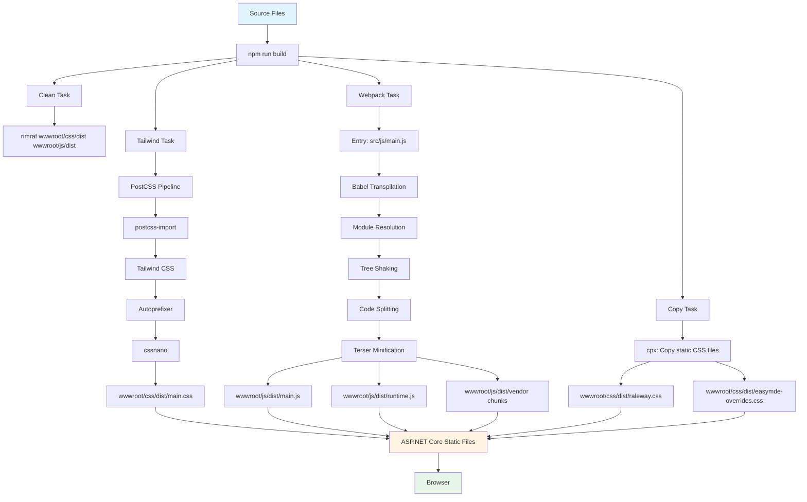

# Modernising Your Frontend Build Pipeline: From CDNs to Bundling

<datetime class="hidden">2025-11-11T02:15</datetime>
<!-- category -- ASP.NET, Tailwind, Webpack, Frontend -->

## Introduction

Over the past year, I've stumbled, experimented, broken things, and gradually modernised the frontend build pipeline for this blog. This wasn't some masterplan executed flawlessly—it was trial and error, lots of error, and stubborn persistence driven by a clear vision of what I wanted to achieve.

I'm not a frontend guru or a Webpack wizard. I'm a .NET developer who got frustrated with the limitations of CDN-based dependencies and decided there had to be a better way. This article documents the messy, iterative journey from simple `<script>` tags pointing to unpkg to a modern bundling pipeline that actually works.

I made plenty of mistakes along the way (which I'll document), spent hours debugging cryptic Webpack errors, and probably reinstalled `node_modules` more times than I care to admit. But persistence paid off, and I learned a tremendous amount through sheer determination to get this right.

If you're a .NET developer staring at Webpack configuration files wondering what on earth you've gotten yourself into—this article is for you.

I'm an old web performance nutter, in the early days of dial-up the first site I built for money (that wasn't a porn backend in Perl...a story for another time) was a Snow Conditions site that spun off from an automated phone line.

In those days the concerns were quite different. JavaScript was practically unknown. I think even divs were RARE (in those days IE was `div` and Netscape was `layer`) and you'd be LUCKY if your users had a 56K connection. So I learned to optimise (even things like tiled image backgrounds for menu items) etc...

Later at Microsoft I even worked on an automated image sprite tool in Web Forms - it was awesome: it extracted small images from a page, generated CSS and a sprite image automatically. But alas, like my time at Microsoft, it was not to be.

In short, it's an obsession that I've carried my entire career. Nobody likes a slow website! 

**To be fair**, CDNs aren't inherently evil.

**Full disclosure**: This blog is deliberately overengineered. It doesn't *need* all this complexity. But building it this way let me learn modern frontend tooling properly and, crucially, gave me something real to write about and teach. Sometimes the best way to learn is to build something slightly ridiculous and document the journey.

## The Problem with CDNs

Initially, my approach was straightforward:

```html
<!-- Old CDN-based approach -->
<script src="https://unpkg.com/alpinejs@3.x.x/dist/cdn.min.js"></script>
<script src="https://unpkg.com/htmx.org@2.x.x"></script>
<script src="https://cdn.jsdelivr.net/npm/easymde/dist/easymde.min.js"></script>
<link rel="stylesheet" href="https://cdn.jsdelivr.net/npm/easymde/dist/easymde.min.css">
```

Whilst this works, it has several drawbacks that became increasingly frustrating:

- **Reliability issues**: CDNs do go down. I've seen unpkg and jsdelivr have outages. When they're down, your site is broken
- **Unpredictable loading behaviour**: CDN responses can vary wildly. Sometimes fast, sometimes slow, sometimes they introduce race conditions where libraries load in the wrong order
- **Timing issues**: You have no control over when scripts load relative to each other. This caused me endless headaches with library initialisation
- **Multiple HTTP requests**: Each library requires a separate request, even with HTTP/2
- **No tree-shaking**: You download the entire library, even if you only use a fraction of it
- **Version drift**: CDNs might serve different versions unless you pin them explicitly, and even pinned versions can behave differently across CDN providers
- **Build-time uncertainty**: No way to catch incompatibilities until runtime—often when a user reports it
- **Limited optimisation**: Can't minify across boundaries or remove dead code
- **Offline development**: Requires internet connectivity, which is annoying when working on trains or planes

So I wanted control...control of exactly what my site used and NEEDED to work. I wanted to bundle only what I needed, ensure reliable loading order, and optimise for performance. This meant moving away from CDNs and towards a bundling approach.

They're simpler to set up, and with HTTP/2 and HTTP/3 multiplexing, the multiple request overhead is much less critical than it used to be. For many projects, especially small ones or prototypes, CDNs remain a perfectly sensible choice. But for a production site where I wanted control, reliability, and optimisation, bundling made more sense.

## The Modern Bundling Approach

My current setup bundles all JavaScript dependencies through Webpack and processes CSS through PostCSS. 

### Why Webpack Instead of Vite?

Before diving into the technical details, I should address the elephant in the room: why am I using Webpack when Vite, Rollup, esbuild, and other modern bundlers exist?

The honest answer is simple: **I already knew Webpack**.

I'd used Webpack extensively when teaching my "Beginning Web Development" course, and it was the tool I understood. When I decided to modernise this blog's build pipeline, I was already facing a steep learning curve—understanding tree-shaking, code splitting, module systems, PostCSS pipelines, and how to integrate all of this with ASP.NET Core.

Adding "learn an entirely new build tool" on top of that seemed unnecessary. Webpack works. It's mature. It has excellent documentation and a massive ecosystem. Most importantly, I could focus my learning energy on the *concepts* of modern bundling rather than the idiosyncrasies of a particular tool.

**Is Vite faster?** Absolutely. Vite's development server with native ES modules and esbuild-powered bundling is significantly faster than Webpack. For large projects with hundreds of modules, the difference is dramatic.

**Should you use Vite for a new project?** Probably, yes. If you're starting fresh and don't have existing Webpack knowledge, Vite is likely the better choice. It's faster, simpler to configure, and represents the modern approach to frontend tooling.

**Do I regret using Webpack?** Not at all. It got me to where I needed to be. The lessons I learned about bundling, code splitting, and optimisation are transferable to any build tool. And honestly, for this blog's scale, the performance difference between Webpack and Vite is negligible—we're talking milliseconds in development rebuild times.

It's a key aspect of how I build stuff; start with what's EASY and build from that foundation. 

The broader lesson here is that **progress beats perfection**. I could have spent weeks researching the "best" bundler, comparing benchmarks, reading comparison articles, and agonising over the decision. Instead, I picked the tool I knew, got it working, and moved forward. That pragmatism kept me shipping rather than endlessly deliberating.

Maybe one day I might migrate to Vite. Maybe I won't. Either way, this blog has a modern, optimised build pipeline that works reliably—and that's what matters.

### Package Structure

The [`package.json`](https://github.com/scottgal/mostlylucidweb/blob/main/Mostlylucid/package.json) now maintains two distinct dependency groups. This structure took me several attempts to get right—initially, Nuget and npm are KINDA similar but nppm is a lot less friendly when adding pacakges. 

```json
{
  "dependencies": {
    //NOTE - This is a pre-release of these enhancements, the 1.0.0 release is OUT NOW!
    "@mostlylucid/mermaid-enhancements": "^1.0.0-alpha0",
    "alpinejs": "^3.14.1",
    "codemirror": "5.65.13",
    "core-js": "^3.39.0",
    "easymde": "2.20.0",
    "flatpickr": "^4.6.13",
    "highlight.js": "^11.10.0",
    "highlightjs-cshtml-razor": "^2.1.1",
    "html-to-image": "^1.11.13",
    "htmx.org": "^2.0.1",
    "mermaid": "^11.0.2",
    "regenerator-runtime": "^0.14.1",
    "svg-pan-zoom": "^3.6.2"
  },
  //These are just used for build; not needed to RUN the app so we have a separate place for 'em
  "devDependencies": {
    "@babel/core": "7.26.9",
    "@babel/preset-env": "7.26.9",
    "@tailwindcss/aspect-ratio": "^0.4.2",
    "@tailwindcss/forms": "^0.5.7",
    "@tailwindcss/typography": "^0.5.12",
    "autoprefixer": "10.4.21",
    "babel-loader": "10.0.0",
    "cpx": "1.5.0",
    "css-loader": "7.1.2",
    "cssnano": "7.0.6",
    "daisyui": "^4.12.10",
    "mini-css-extract-plugin": "^2.9.4",
    "npm-run-all": "4.1.5",
    "postcss": "8.5.3",
    "postcss-cli": "11.0.1",
    "postcss-import": "^16.1.0",
    "rimraf": "6.0.1",
    "style-loader": "4.0.0",
    "tailwindcss": "3.4.17",
    "terser-webpack-plugin": "^5.3.10",
    "webpack": "^5.91.0",
    "webpack-cli": "^5.1.4"
  }
}
```

**Dependencies** are libraries needed at runtime (Alpine.js, HTMX, EasyMDE, etc.), whilst **devDependencies** are build tools (Webpack, Babel, PostCSS processors, etc.).

### Build Scripts

The `package.json` scripts have evolved significantly:

```json
{
  "scripts": {
    "clean": "rimraf ./.tmp ./wwwroot/css/dist ./wwwroot/js/dist",
    "copy:static": "cpx \"src/css/{raleway,easymde-overrides}.css\" \"wwwroot/css/dist\"",
    "copy:highlight": "cpx \"src/css/highlight/*.min.css\" \"wwwroot/css/highlight\"",
    "copy:all": "npm-run-all --parallel copy:static copy:highlight",
    "copy:watch": "cpx \"src/css/{raleway,easymde-overrides}.css\" \"wwwroot/css/dist\" --watch & cpx \"src/css/highlight/*.min.css\" \"wwwroot/css/highlight\" --watch",
    "tw:dev": "postcss ./src/css/main.css -o ./wwwroot/css/dist/main.css",
    "tw:prod": "postcss ./src/css/main.css -o ./wwwroot/css/dist/main.css --no-map --verbose",
    "tw:watch": "postcss ./src/css/main.css -o ./wwwroot/css/dist/main.css --watch",
    "js:dev": "webpack --env development",
    "js:prod": "webpack --mode production",
    "js:watch": "webpack watch --mode development",
    "dev": "npm-run-all clean --parallel copy:all tw:dev js:dev",
    "watch": "npm-run-all clean copy:all --parallel copy:watch tw:watch js:watch",
    "build": "npm-run-all clean copy:all --parallel tw:prod js:prod"
  }
}
```

This setup separates concerns:
- **clean**: Removes previous build outputs using `rimraf`
- **copy:*** tasks: Copies static CSS files that don't need processing (these are either  'imports') for a special purpose like loading my funky Raleway font or adaptive ones like theme switching enhancements.
- **tw:*** tasks: Processes Tailwind CSS through PostCSS
- **js:*** tasks: Bundles JavaScript through Webpack
- **dev/watch/build**: Orchestrates the entire pipeline

The `npm-run-all` package enables parallel execution for faster builds.

You can set `npm run build` to auto run during your local build but it's a bit of a pain for CI (you need to ensure it's disabled etc).  

```xml
<Project Sdk="Microsoft.NET.Sdk.Web">

  <PropertyGroup>
    <TargetFramework>net8.0</TargetFramework>
    <SpaRoot>ClientApp\</SpaRoot>
  </PropertyGroup>

  <!-- Run npm install only when package.json changes -->
  <Target Name="NpmInstall" Inputs="$(SpaRoot)package.json" Outputs="$(SpaRoot)node_modules" BeforeTargets="Build">
    <Message Importance="high" Text="Running npm install in $(SpaRoot)" />
    <Exec WorkingDirectory="$(SpaRoot)" Command="npm ci" />
  </Target>

  <!-- Run npm build before the .NET build -->
  <Target Name="NpmBuild" DependsOnTargets="NpmInstall" BeforeTargets="Build">
    <Message Importance="high" Text="Running npm run build in $(SpaRoot)" />
    <Exec WorkingDirectory="$(SpaRoot)" Command="npm run build" />
  </Target>

</Project>

```

To do it just add this to your csproj...You can even say only run during debug' etc...but I find it messy. I prefer just to manually run it. So `npm run watch` does just that, when any css / js file changes it auto-runs the build. 

NOTE: In the JS world they almost use hot-reload dev runs which is pretty slick and makes you kinda hate ASP.NET Core's weak attempt.

## Webpack Configuration Deep Dive

The Webpack configuration is where the magic happens—and where I spent most of my time troubleshooting. This didn't spring into existence fully formed. It's the result of countless iterations, Stack Overflow searches, and reading through Webpack documentation at 2am trying to understand why my build was generating 47 chunk files.

Here's the current configuration (from [`webpack.config.js`](https://github.com/scottgal/mostlylucidweb/blob/main/Mostlylucid/webpack.config.js)) with detailed explanations of what each part does and why it's there:

```javascript
const TerserPlugin = require('terser-webpack-plugin');
const path = require('path');

module.exports = (env, argv) => {
    const isProduction = argv.mode === 'production';

    return {
        mode: isProduction ? 'production' : 'development',
        entry: {
            main: './src/js/main.js',
        },
        output: {
            filename: '[name].js',
            chunkFilename: '[name].[contenthash].js',
            path: path.resolve(__dirname, 'wwwroot/js/dist'),
            publicPath: '/js/dist/',
            module: true,
            clean: true,
        },
        experiments: {
            outputModule: true,
        },
        module: {
            rules: [
                {
                    test: /\.css$/i,
                    use: ['style-loader', 'css-loader'],
                },
                {
                    test: /\.js$/,
                    exclude: /node_modules/,
                    use: {
                        loader: 'babel-loader',
                        options: {
                            presets: [
                                ['@babel/preset-env', {
                                    targets: '> 0.25%, not dead',
                                    modules: false,
                                    useBuiltIns: 'usage',
                                    corejs: 3,
                                }],
                            ],
                        },
                    },
                },
            ],
        },
        resolve: {
            extensions: ['.js', '.mjs'],
            alias: {
                '@mostlylucid/mermaid-enhancements$': path.resolve(__dirname, 'node_modules/@mostlylucid/mermaid-enhancements/dist/index.min.js')
            }
        },
        optimization: {
            splitChunks: {
                chunks: 'all',
                minSize: 20000,
                maxSize: 100000,
                name: false,
            },
            runtimeChunk: {
                name: 'runtime',
            },
            minimize: isProduction,
            minimizer: isProduction ? [
                new TerserPlugin({
                    terserOptions: {
                        ecma: 2020,
                        compress: {
                            drop_console: true,
                            passes: 3,
                            toplevel: true,
                            pure_funcs: ['console.info', 'console.debug'],
                        },
                        mangle: {
                            toplevel: true,
                        },
                        format: {
                            comments: false,
                        },
                    },
                    extractComments: true,
                }),
            ] : [],
        },
        devtool: isProduction ? false : 'eval-source-map',
        performance: {
            hints: isProduction ? 'warning' : false,
        }
    };
};
```

### Key Configuration Sections Explained

#### Code Splitting and Chunking

```javascript
optimization: {
    splitChunks: {
        chunks: 'all',
        minSize: 20000,
        maxSize: 100000,
        name: false,
    },
    runtimeChunk: {
        name: 'runtime',
    },
}
```

This configuration automatically splits your code into smaller chunks:
- **chunks: 'all'**: Analyses both synchronous and asynchronous imports
- **minSize: 20000**: Only creates chunks for modules larger than 20KB
- **maxSize: 100000**: Attempts to split chunks larger than 100KB
- **runtimeChunk**: Extracts Webpack runtime into a separate file to improve long-term caching

In practice, this generates multiple files in `wwwroot/js/dist/`:
- `main.js` - Your application entry point
- `runtime.js` - Webpack module loading logic
- `[vendor].[contenthash].js` - Automatically split vendor chunks
- Additional chunks for code-split routes or lazy-loaded modules

#### Babel Transpilation

```javascript
{
    test: /\.js$/,
    exclude: /node_modules/,
    use: {
        loader: 'babel-loader',
        options: {
            presets: [
                ['@babel/preset-env', {
                    targets: '> 0.25%, not dead',
                    modules: false,
                    useBuiltIns: 'usage',
                    corejs: 3,
                }],
            ],
        },
    },
}
```

Babel transpiles modern JavaScript to support older browsers:
- **targets**: Supports browsers with >0.25% market share that are still maintained
- **modules: false**: Preserves ES6 modules for Webpack tree-shaking
- **useBuiltIns: 'usage'**: Automatically includes polyfills only for features you use
- **corejs: 3**: Uses core-js version 3 for polyfills

This means I can write modern JavaScript (async/await, optional chaining, nullish coalescing) whilst maintaining broad browser support.

#### Production Minification

```javascript
minimizer: isProduction ? [
    new TerserPlugin({
        terserOptions: {
            ecma: 2020,
            compress: {
                drop_console: true,
                passes: 3,
                toplevel: true,
                pure_funcs: ['console.info', 'console.debug'],
            },
            mangle: {
                toplevel: true,
            },
            format: {
                comments: false,
            },
        },
        extractComments: true,
    }),
] : []
```

Terser aggressively minifies production builds:
- **drop_console**: Removes all `console.log()` statements
- **passes: 3**: Runs compression three times for maximum size reduction
- **toplevel: true**: Mangles top-level variable names
- **pure_funcs**: Removes specific console methods even if assigned to variables
- **comments: false**: Strips all comments from output

On this blog, this typically reduces JavaScript bundle sizes by 60-70% compared to unminified code.

## PostCSS Pipeline for Tailwind

Tailwind CSS is processed through PostCSS with several plugins. This configuration (from [`postcss.config.js`](https://github.com/scottgal/mostlylucidweb/blob/main/Mostlylucid/postcss.config.js)) is mercifully simple compared to Webpack:

```javascript
// postcss.config.js
module.exports = {
    plugins: {
        'postcss-import': {},
        tailwindcss: {},
        autoprefixer: {},
        cssnano: { preset: 'default' }
    }
}
```

The pipeline works as follows:

1. **postcss-import**: Resolves `@import` statements in CSS files
2. **tailwindcss**: Processes Tailwind directives and generates utility classes
3. **autoprefixer**: Adds vendor prefixes for browser compatibility
4. **cssnano**: Minifies the final CSS output

### Tailwind Configuration

The [`tailwind.config.js`](https://github.com/scottgal/mostlylucidweb/blob/main/Mostlylucid/tailwind.config.js) file specifies where Tailwind should look for class names. Getting the `content` paths right was critical—miss a path and Tailwind won't generate classes for those files:

```javascript
module.exports = {
    content: ["./Views/**/*.cshtml", "./EmailSubscription/**/*.cshtml"],
    safelist: ["dark", "light"],
    darkMode: "class",
    theme: {
        fontFamily: {
            body: ["Raleway", "sans-serif"],
        },
        extend: {
            colors: {
                "custom-light-bg": "#ffffff",
                "custom-dark-bg": "#1d232a",
                primary: "#072344",
                secondary: "#00aaa1",
                // ... more custom colours
            },
        },
    },
    plugins: [
        require("@tailwindcss/aspect-ratio"),
        require("@tailwindcss/typography"),
        require("daisyui"),
    ],
};
```

Key features:
- **content**: Scans `.cshtml` files for class names (including Razor views and email templates)
- **safelist**: Always includes these classes even if not found in scans
- **darkMode: "class"**: Enables class-based dark mode switching
- **theme.extend**: Adds custom colours and spacing values
- **plugins**: Includes Tailwind plugins and DaisyUI component library

Tailwind scans these files at build time, extracting only the utility classes you actually use. This is why the final CSS file is much smaller than the full Tailwind library.

## JavaScript Entry Point

The [`main.js`](https://github.com/scottgal/mostlylucidweb/blob/main/Mostlylucid/src/js/main.js) file is where everything comes together. This file imports and initialises all dependencies, and it's grown organically as I've added features to the blog:

```javascript
// src/js/main.js
import hljsRazor from "highlightjs-cshtml-razor";
import mermaid from "mermaid";
import Alpine from 'alpinejs';
import htmx from "htmx.org";
import hljs from "highlight.js";
import EasyMDE from "easymde";
import 'easymde/dist/easymde.min.css';
import flatpickr from "flatpickr";
import 'flatpickr/dist/flatpickr.min.css';

// Expose libraries globally for Razor views
window.Alpine = Alpine;
window.hljs = hljs;
window.htmx = htmx;
window.mermaid = mermaid;
window.EasyMDE = EasyMDE;
window.flatpickr = flatpickr;

// Import custom modules
import { typeahead } from "./typeahead";
import { submitTranslation, viewTranslation } from "./translations";
import { codeeditor } from "./simplemde_editor";
import { globalSetup } from "./global";
import { comments } from "./comments";

// Attach to namespace
window.mostlylucid = window.mostlylucid || {};
window.mostlylucid.typeahead = typeahead;
window.mostlylucid.comments = comments();
window.mostlylucid.translations = {
    submitTranslation: submitTranslation,
    viewTranslation: viewTranslation
};

// Initialise Alpine
Alpine.start();
```

This approach offers several benefits:

1. **Single import point**: All dependencies loaded through one entry file
2. **Explicit versions**: Package.json locks specific versions
3. **Tree-shaking**: Webpack removes unused code from libraries
4. **Global exposure**: Libraries available to Razor views via `window`
5. **Custom modules**: Application-specific code organised into importable modules


### Layout Template Integration

In `_Layout.cshtml`, I now reference only bundled assets:

```html
<head>
    <link href="/css/dist/main.css" asp-append-version="true" rel="stylesheet" />
</head>
<body>
    <!-- Content -->
    <script src="~/js/dist/main.js" type="module" asp-append-version="true"></script>
</body>
```

Note I specify `module` to let the browser know what type of JS file this is & `asp-append-version` a neat little ASP.NET tag helper that appends a hashed version of the file contents to the querystring; effectively cache-busting when the file changes.

The only remaining CDN dependencies are:
- **Google Sign-In**: Requires external CDN for OAuth functionality
- **Boxicons**: Icon font (could be bundled, but minimal benefit)
- **Umami Analytics**: Third-party analytics script - self hosted so I get to see your visit not Google ??

## Build Pipeline Visualisation

Here's how the entire build process flows from source files to production assets:



It looks pretty complex but really that's what WebPack does, it handles most of this itself (in a complicated way that the likes of Vite don't need but.. )

## Performance Improvements

Again, not really the POINT. But it does load like an absolute bullet now. You can still get issues with Cloudflare's 'Rocket Loader' (which mangles page load events somewhat) but it's TIGHT. 


## Developer Experience Benefits

Beyond performance, the modern build pipeline significantly improves the development workflow:

### Type Safety and IntelliSense

Bundling through Webpack enables proper JavaScript module resolution, which means:

- **IntelliSense in VS Code**: Auto-completion for imported modules
- **Jump to definition**: Navigate directly to library source code
- **Inline documentation**: JSDoc comments from libraries appear in IDE

WHEN the build breaks (with `npm run watch`) I know INSTANTLY, combined with the (few but growing) JS unit tests it means tighter feedback loops.

### Hot Module Replacement

During development, `npm run watch` enables near-instant feedback:

```bash
npm run watch
```

This runs Webpack in watch mode, rebuilding only changed modules:
- **Typical rebuild time**: 200-400ms
- **Browser auto-refresh**: Using browser-sync or similar tooling
- **Preserved application state**: HMR maintains application state during updates (where supported)

### Dependency Management

npm's lock file (`package-lock.json`) ensures consistent builds across environments:

```bash
npm ci  # Clean install from lock file
```

This guarantees the same dependency versions in development, CI/CD, and production environments.

These are referred to as 'pinning' in the JS world, where the dependencies are set in stone. You CAN do without a package lock but then you're depending on pacakge authors; often HUNDREDS of differen tpeople not screwing up some minor release..s

### Build Scripts

The organised npm scripts make common tasks easy:

```bash
npm run dev      # One-time development build
npm run watch    # Continuous development builds
npm run build    # Production build with optimisations
npm run clean    # Remove build artefacts
```

## Common Patterns and Solutions

### Exposing Bundled Libraries Globally

Some libraries need global exposure for use in Razor views or inline scripts:

```javascript
// Make library available globally
import Alpine from 'alpinejs';
window.Alpine = Alpine;
Alpine.start();
```

Then in `.cshtml` files:

```html
<div x-data="{ open: false }">
    <!-- Alpine.js works because it's on window -->
</div>
```

### Handling CSS from JavaScript Modules

Some libraries include CSS that needs importing:

```javascript
import EasyMDE from "easymde";
import 'easymde/dist/easymde.min.css';  // Imported CSS is processed by Webpack
```

Webpack's `css-loader` and `style-loader` handle these imports:
- CSS is extracted during build
- Injected into the page via `<style>` tags or separate CSS files
- Automatically prefixed and minified

### Lazy Loading Heavy Libraries

For libraries only needed on specific pages, use dynamic imports:

```javascript
// Only load Mermaid when needed
async function initMermaid() {
    const mermaid = await import('mermaid');
    mermaid.default.initialize({ startOnLoad: true });
}

// Call when needed
if (document.querySelector('.mermaid')) {
    initMermaid();
}
```

Webpack automatically code-splits dynamic imports into separate chunks, loaded on-demand.

### Dealing with CommonJS Modules

Some older libraries use CommonJS instead of ES6 modules:

```javascript
// CommonJS require syntax
const hljs = require('highlight.js');

// Or use dynamic import
import('highlight.js').then(hljs => {
    // Use hljs
});
```

Webpack handles both module systems transparently, converting CommonJS to ES6 where needed.

## Troubleshooting Common Issues

### Source Maps Missing in Development

Ensure `devtool` is configured in `webpack.config.js`:

```javascript
devtool: isProduction ? false : 'eval-source-map',
```

This generates source maps in development for easier debugging.

### CSS Class Purging Issues with Tailwind

If Tailwind removes classes you're using, check the `content` configuration:

```javascript
// tailwind.config.js
module.exports = {
    content: [
        './Views/**/*.cshtml',
        './Components/**/*.cshtml',
        // Add any other paths where classes are used
    ],
}
```

Alternatively, use the `safelist` for dynamic classes:

```javascript
safelist: [
    'bg-blue-500',
    'text-red-600',
    {
        pattern: /bg-(red|green|blue)-(400|500|600)/,
    }
]
```

### Module Not Found Errors

If Webpack can't resolve a module, check:

1. **Correct import path**: Relative paths start with `./` or `../`
2. **File extensions**: Add `.mjs` to `resolve.extensions` if needed
3. **Aliases**: Use `resolve.alias` for complex paths

```javascript
resolve: {
    extensions: ['.js', '.mjs', '.json'],
    alias: {
        '@components': path.resolve(__dirname, 'src/js/components/'),
    }
}
```

### Build Performance Issues

If builds become slow:

1. **Enable caching**: Webpack's cache significantly speeds up rebuilds
2. **Reduce Babel scope**: Exclude more directories from Babel processing
3. **Upgrade tools**: Newer versions of Webpack and Babel are faster
4. **Parallel builds**: Use `thread-loader` for multi-threaded transpilation

```javascript
// Enable Webpack caching
cache: {
    type: 'filesystem',
},
```

## Lessons Learned the Hard Way

Let me share some of the mistakes I made along this journey, so you can avoid them:

### Mistake #1: Trying to Bundle Everything at Once

My first attempt involved ripping out all CDN references in one go and trying to bundle everything through Webpack. The build broke spectacularly. I learned that incremental migration is your friend—move one library at a time, test thoroughly, then move to the next.

### Mistake #2: Not Understanding Module Types

I wasted hours trying to figure out why certain libraries wouldn't load. Turns out, mixing CommonJS (`require()`) and ES6 modules (`import`) without understanding how Webpack handles them leads to cryptic errors. The `experiments: { outputModule: true }` configuration wasn't in my initial setup, and I couldn't work out why my modules weren't loading.

The solution came from reading through GitHub issues on the Webpack repository at midnight.

### Mistake #3: Over-Aggressive Code Splitting

At one point, my configuration was generating chunks for everything. I had `minSize: 10000` (10KB) which meant Webpack was creating separate files for tiny utility functions. The over-corrected and went to 2MB... Page load became a waterfall of 50+ tiny chunk requests or hung waiting for huge chunks to download. I learned that code splitting is good, but you need sensible thresholds. That's why my current config uses `minSize: 20000` (20KB).

### Mistake #4: Forgetting About the `.mjs` Extension

Some npm packages distribute ES6 modules with the `.mjs` extension. Webpack won't resolve these by default. I spent an embarrassingly long time debugging why `@mostlylucid/mermaid-enhancements` wouldn't load before discovering I needed to add `.mjs` to `resolve.extensions`.

Simple fix once you know it, but finding that out? That took time.

### Mistake #5: Not Caching Webpack Builds

Early builds took 30-60 seconds because I hadn't enabled Webpack's filesystem cache. Once I added caching, rebuild times dropped to 2-3 seconds. This was a game-changer for development workflow but took me weeks to discover.

### Mistake #6: Tailwind Purging Classes I Actually Used

My favourite debugging experience: CSS classes that worked fine in development suddenly disappeared in production. Tailwind was purging them because they were generated dynamically in JavaScript. The solution was the `safelist` configuration, but only after I'd wasted hours wondering if I was going mad.
I ALSO (for example in the `mostlylucid.pagingtaghelper` project) use 'dummy blocks' where I simplify my Tailwind config changes by just having a hidden block.


```html

<!--
    Preserve Tailwind & DaisyUI classes used in embedded pager views.
    Without this, TailwindCSS tree-shaking removes classes from the embedded library views.
-->
<span class="hidden
    btn btn-sm btn-active btn-disabled join join-item badge badge-sm select select-bordered select-sm label label-text
    px-3 py-2 py-1 text-sm font-medium border rounded whitespace-nowrap cursor-not-allowed
    text-gray-700 text-gray-600 text-gray-400 text-white bg-white bg-gray-100 bg-blue-600 border-gray-300 border-blue-600
    hover:bg-gray-50 hover:bg-blue-700
    dark:bg-gray-800 dark:bg-gray-700 dark:bg-blue-500 dark:text-gray-300 dark:text-gray-500 dark:text-gray-200
    dark:border-gray-600 dark:border-blue-500 dark:hover:bg-gray-700 dark:hover:bg-blue-600">
</span>

```
When Tailwind builds it scans the cshtml files for classes; if it doesn't see them it removes them. So having this hidden block ensures it sees the classes I need even if they're only used in embedded library views. JS developers commonly also scan JS/TS files to allow using CSS styles that Tailwind would otherwise miss. 

```json

module.exports = {
content: ["./Views/**/*.cshtml", "./EmailSubscription/**/*.cshtml"],
-//^^^^ This is what Tailwing knows where to look for classes duritng the tree Shake. 
+//^^^^ This is what Tailwind knows where to look for classes during the tree-shake.
  
  ...

future: {...}

}

```

As mentioned, the 'Tailwind Approved' approach is to add the classes to a safelist... but I'm an ASP.NET guy, so HTML won.

### What I Got Right: Persistence

The one thing I did right was refusing to give up. Every error message was a learning opportunity. Every broken build taught me something new about how these tools work. I had a clear vision—bundled, optimised assets that load fast—and I kept iterating until I got there.

## Conclusion

Migrating from CDN-based dependencies to a modern bundling pipeline has been transformative for this blog, but it wasn't easy. The performance improvements are substantial, the developer experience is significantly better, and I have much greater control over optimisation—but it took months of trial and error to get here.

Key takeaways:

1. **Bundling reduces payload size**: Tree-shaking and minification eliminate unused code
2. **Code splitting improves performance**: Browsers load only what's needed
3. **Build tools enable modern JavaScript**: Babel transpilation supports the latest language features whilst maintaining browser compatibility
4. **PostCSS pipeline optimises CSS**: Tailwind's JIT compiler and cssnano deliver tiny stylesheets
5. **Integration with .NET is seamless**: MSBuild targets automatically run frontend builds
6. **Persistence beats perfection**: You don't need to be a frontend expert—you just need a clear vision and the willingness to iterate

For ASP.NET Core developers accustomed to simple CDN includes, this will feel overwhelming at first. That's normal. I felt the same way. Start small, migrate one dependency at a time, and don't be afraid to break things in development. You'll learn more from debugging broken builds than you ever will from reading documentation.

The configuration I've shared here represents months of iteration. Your journey will be different, and that's fine. Use this as a starting point, not gospel. Adapt it to your needs, experiment, and don't be discouraged by failures—they're part of the process.

**Is this blog overengineered?** Absolutely. Could I have kept using CDNs and spent my time on other things? Sure. But I wouldn't have learned half as much, and I wouldn't have this article to share with you. Sometimes overengineering isn't about the destination—it's about what you learn along the way and being able to teach others from that experience.

If you're still relying on CDNs for your frontend dependencies, I encourage you to give bundling a try. Start with one library. See how it feels. Iterate from there. The ecosystem has matured significantly, and whilst the learning curve is real, the payoff is worth it.

## Further Reading

- [Webpack Documentation](https://webpack.js.org/)
- [Tailwind CSS: Optimising for Production](https://tailwindcss.com/docs/optimizing-for-production)
- [Babel: Usage Guide](https://babeljs.io/docs/en/usage)
- [PostCSS Documentation](https://postcss.org/)
- [My Previous Article: Tailwind for ASP.NET Core Developers](/blog/tailwind)
