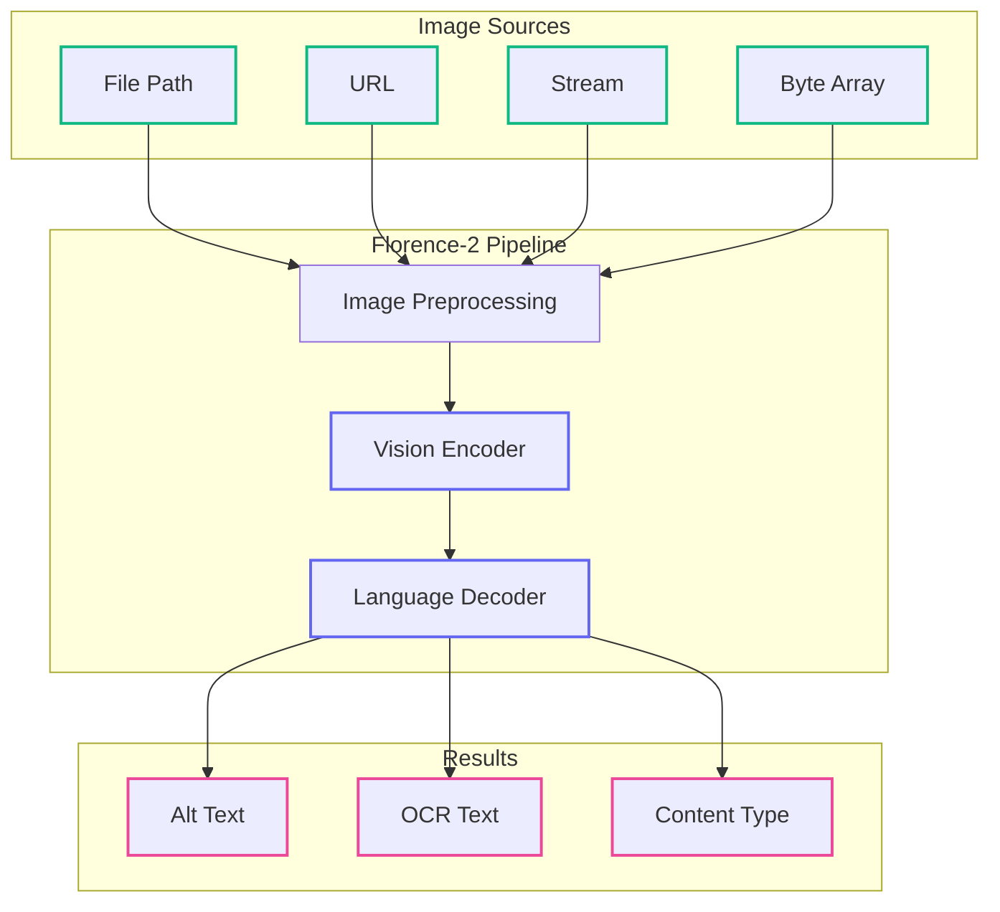
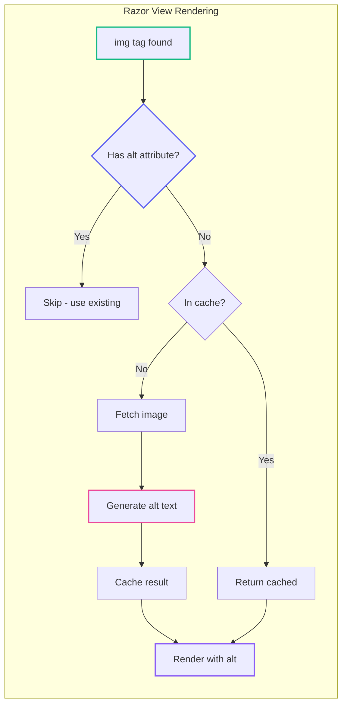

# AI-Powered Alt Text Generation with mostlylucid.llmlltText

Want to get nice, descriptive alt text for images on your sites or jsut extract text from them? `mostlylucid.llmalttext` uses Microsoft's Florence-2 vision language model to generate high-quality alt text automatically - running entirely locally on your machine, no API keys required.

> Note: I need to update this doc now the [nuget package ](https://www.nuget.org/packages/Mostlylucid.LlmAltText)is out. If you look [here](https://github.com/scottgal/mostlylucid.nugetpackages/tree/main/Mostlylucid.AltText.Demo)  you'll fine a nifty demo site you can download and use. I'll update this with details in the coming days. 

<datetime class="hidden">2025-11-25T14:00</datetime>
<!-- category -- ASP.NET, Accessibility, AI, NuGet, Florence-2, Image Processing -->


[](https://www.nuget.org/packages/mostlylucid.llmalttext) [](http://unlicense.org/)


# Introduction

Alt text matters. Screen readers depend on it, SEO rankings factor it in, and it's simply the right thing to do for accessibility. But writing good alt text for hundreds of images? That's where most of us fall short.

This package solves that problem using Microsoft's Florence-2 vision language model - running entirely locally on your machine, no API keys required.

**Source code:** [github.com/scottgal/mostlylucid.nugetpackages](https://github.com/scottgal/mostlylucid.nugetpackages/tree/main/Mostlylucid.LlmAltText)

[TOC]

# The Problem

Every `` tag should have meaningful alt text. But in practice:

- **Manual writing is tedious** - hundreds of images means hours of work
- **AI APIs cost money** - OpenAI Vision, Claude, etc. add up quickly
- **Privacy concerns** - you might not want to send images to external APIs
- **Inconsistent quality** - different people write alt text differently

What if you could generate high-quality alt text automatically, running entirely on your own hardware?

# How It Works

The package uses Microsoft's Florence-2 model via ONNX runtime. Here's the processing pipeline:



**Key features:**
- **Local execution** - no API calls, no costs, no privacy concerns
- **~800MB model** - downloads once, cached forever
- **Multiple task types** - brief captions, detailed descriptions, OCR
- **Content classification** - knows if it's a photo, chart, screenshot, etc.

# Quick Start

## Installation

```bash
dotnet add package Mostlylucid.LlmAltText
```

## Register Services

```csharp
// Program.cs
builder.Services.AddAltTextGeneration();
```

That's it. The first run downloads the Florence-2 model (~800MB), then you're ready to go.

## Generate Alt Text

```csharp
public class ImageController : ControllerBase
{
    private readonly IImageAnalysisService _imageAnalysis;

    public ImageController(IImageAnalysisService imageAnalysis)
    {
        _imageAnalysis = imageAnalysis;
    }

    [HttpPost("analyze")]
    public async Task<IActionResult> Analyze(IFormFile image)
    {
        using var stream = image.OpenReadStream();
        var altText = await _imageAnalysis.GenerateAltTextAsync(stream);

        return Ok(new { altText });
    }
}
```

# Multiple Input Sources

The service accepts images from anywhere - files, URLs, streams, or byte arrays.

## From File Path

```csharp
var altText = await _imageAnalysis.GenerateAltTextFromFileAsync("/images/photo.jpg");
```

## From URL

```csharp
var altText = await _imageAnalysis.GenerateAltTextFromUrlAsync(
    "https://example.com/image.png");
```

## From Stream

```csharp
using var stream = file.OpenReadStream();
var altText = await _imageAnalysis.GenerateAltTextAsync(stream);
```

## From Byte Array

```csharp
var bytes = await httpClient.GetByteArrayAsync(imageUrl);
var altText = await _imageAnalysis.GenerateAltTextAsync(bytes);
```

# Task Types: Controlling Detail Level

Florence-2 supports three caption modes. Choose based on your needs:

```csharp
// Brief - "A dog sitting on grass"
var brief = await _imageAnalysis.GenerateAltTextAsync(stream, "CAPTION");

// Detailed - "A golden retriever sitting on green grass in a park"
stream.Position = 0;
var detailed = await _imageAnalysis.GenerateAltTextAsync(stream, "DETAILED_CAPTION");

// Most detailed (default) - Full accessibility description
stream.Position = 0;
var full = await _imageAnalysis.GenerateAltTextAsync(stream, "MORE_DETAILED_CAPTION");
// "A happy golden retriever with light fur sitting on lush green grass
//  in a sunny park, with trees visible in the background."
```

**When to use each:**

| Task Type | Best For |
|-----------|----------|
| `CAPTION` | Thumbnails, decorative images, quick tooltips |
| `DETAILED_CAPTION` | Social media, basic accessibility |
| `MORE_DETAILED_CAPTION` | Full accessibility, screen readers (recommended) |

# OCR Text Extraction

Florence-2 can also extract text from images - useful for screenshots, documents, and charts.

```csharp
// Extract text only
var extractedText = await _imageAnalysis.ExtractTextAsync(stream);

// Get both alt text and extracted text
var (altText, ocrText) = await _imageAnalysis.AnalyzeImageAsync(stream);

Console.WriteLine($"Alt: {altText}");
Console.WriteLine($"OCR: {ocrText}");
```

# Content Type Classification

Not all images are the same. A photograph needs descriptive alt text; a document needs its text content. The classification feature helps you handle each appropriately:

```csharp
var result = await _imageAnalysis.AnalyzeWithClassificationAsync(stream);

Console.WriteLine($"Type: {result.ContentType}");        // e.g., "Photograph"
Console.WriteLine($"Confidence: {result.ContentTypeConfidence:P0}"); // e.g., "87%"
Console.WriteLine($"Has Text: {result.HasSignificantText}");
```

## Handling Different Content Types

```csharp
var result = await _imageAnalysis.AnalyzeWithClassificationAsync(stream);

switch (result.ContentType)
{
    case ImageContentType.Document:
        // Documents - prioritize extracted text
        return result.ExtractedText;

    case ImageContentType.Screenshot:
        // Screenshots - combine description with UI text
        return result.HasSignificantText
            ? $"{result.AltText}. Text visible: {result.ExtractedText}"
            : result.AltText;

    case ImageContentType.Chart:
        // Charts - describe the visualization plus data
        return $"{result.AltText}. Data: {result.ExtractedText}";

    case ImageContentType.Photograph:
    default:
        // Photos - just the description
        return result.AltText;
}
```

## Content Type Reference

| Type | Description | Example |
|------|-------------|---------|
| `Photograph` | Real-world photos | People, landscapes, products |
| `Document` | Text-heavy content | PDFs, forms, articles |
| `Screenshot` | Software captures | UI, websites, apps |
| `Chart` | Data visualizations | Graphs, pie charts, tables |
| `Illustration` | Drawn content | Artwork, cartoons, icons |
| `Diagram` | Technical drawings | Flowcharts, UML, schematics |
| `Unknown` | Unclassified | Edge cases |

# The Auto Alt Text TagHelper

Here's where it gets interesting. The TagHelper automatically generates alt text for any `` tag missing one - at render time.

## Setup

```csharp
// Program.cs
builder.Services.AddAltTextGeneration(options =>
{
    options.EnableTagHelper = true;
    options.EnableDatabase = true;  // Cache results
    options.DbProvider = AltTextDbProvider.Sqlite;
    options.SqliteDbPath = "./alttext.db";
});

var app = builder.Build();
await app.Services.MigrateAltTextDatabaseAsync();
```

Register the TagHelper in `_ViewImports.cshtml`:

```cshtml
@addTagHelper *, Mostlylucid.LlmAltText
```

## How It Works



## What Gets Processed

```html
<!-- NO ALT - Will be processed -->


<!-- HAS ALT - Skipped (respects your text) -->


<!-- EMPTY ALT - Skipped (decorative image per a11y standards) -->


<!-- EXPLICIT SKIP - Skipped -->


<!-- DATA URI - Skipped (can't fetch) -->


<!-- RELATIVE PATH - Skipped (needs absolute URL) -->

```

## Domain Restrictions

For security, you can restrict which domains the TagHelper will fetch from:

```csharp
options.AllowedImageDomains = new List<string>
{
    "mycdn.example.com",
    "images.mysite.org",
    "cdn.githubusercontent.com"
};
```

# Database Caching

Without caching, every page render would regenerate alt text. That's slow and wasteful. The database cache stores results keyed by image URL.

## SQLite (Development)

```csharp
builder.Services.AddAltTextGeneration(options =>
{
    options.EnableDatabase = true;
    options.DbProvider = AltTextDbProvider.Sqlite;
    options.SqliteDbPath = "./alttext.db";
    options.CacheDurationMinutes = 60;
});
```

## PostgreSQL (Production)

```csharp
builder.Services.AddAltTextGeneration(options =>
{
    options.EnableDatabase = true;
    options.DbProvider = AltTextDbProvider.PostgreSql;
    options.ConnectionString = Configuration.GetConnectionString("AltTextDb");
});
```

# Configuration Reference

```csharp
builder.Services.AddAltTextGeneration(options =>
{
    // Model location (~800MB downloaded here)
    options.ModelPath = "./models";

    // Default task type for alt text generation
    options.DefaultTaskType = "MORE_DETAILED_CAPTION";

    // Maximum word count for alt text
    options.MaxWords = 90;

    // Enable detailed logging
    options.EnableDiagnosticLogging = true;

    // TagHelper settings
    options.EnableTagHelper = true;
    options.EnableDatabase = true;
    options.AutoMigrateDatabase = true;

    // Database provider
    options.DbProvider = AltTextDbProvider.Sqlite;
    options.SqliteDbPath = "alttext.db";
    // or
    options.DbProvider = AltTextDbProvider.PostgreSql;
    options.ConnectionString = "Host=localhost;Database=alttext;...";

    // Security
    options.AllowedImageDomains = new List<string> { "cdn.example.com" };
    options.SkipSrcPrefixes = new List<string> { "data:", "blob:" };

    // Caching
    options.CacheDurationMinutes = 60;
});
```

# Real-World Example: Batch Processing

Here's how I use it to process images when importing blog posts:

```csharp
public class ImageProcessor
{
    private readonly IImageAnalysisService _imageAnalysis;
    private readonly ILogger<ImageProcessor> _logger;

    public ImageProcessor(
        IImageAnalysisService imageAnalysis,
        ILogger<ImageProcessor> logger)
    {
        _imageAnalysis = imageAnalysis;
        _logger = logger;
    }

    public async Task ProcessMarkdownImagesAsync(string markdownPath)
    {
        var imageDir = Path.Combine(Path.GetDirectoryName(markdownPath)!, "images");
        if (!Directory.Exists(imageDir)) return;

        var images = Directory.GetFiles(imageDir, "*.*")
            .Where(f => IsImageFile(f));

        foreach (var imagePath in images)
        {
            try
            {
                var result = await _imageAnalysis
                    .AnalyzeWithClassificationFromFileAsync(imagePath);

                _logger.LogInformation(
                    "Processed {File}: {Type} ({Confidence:P0})",
                    Path.GetFileName(imagePath),
                    result.ContentType,
                    result.ContentTypeConfidence);

                // Store alt text for later use
                await SaveAltTextAsync(imagePath, result.AltText);
            }
            catch (Exception ex)
            {
                _logger.LogWarning(ex, "Failed to process {File}", imagePath);
            }
        }
    }

    private static bool IsImageFile(string path)
    {
        var ext = Path.GetExtension(path).ToLowerInvariant();
        return ext is ".jpg" or ".jpeg" or ".png" or ".gif" or ".webp" or ".bmp";
    }
}
```

# Performance Considerations

## What to Expect

| Metric | Typical Value |
|--------|--------------|
| First run | Slower (~800MB model download) |
| Model load | 1-3 seconds |
| Per-image processing | 500-2000ms |
| Memory usage | 2GB+ recommended |
| Disk space | ~800MB for models |

## Tips for Production

```csharp
// 1. Register as Singleton (model load is expensive)
builder.Services.AddAltTextGeneration(); // Already singleton internally

// 2. Check readiness before processing
if (!_imageAnalysis.IsReady)
{
    return StatusCode(503, "AI model still initializing");
}

// 3. Use cancellation tokens for timeouts
var cts = new CancellationTokenSource(TimeSpan.FromSeconds(30));
var altText = await _imageAnalysis.GenerateAltTextFromUrlAsync(url, cts.Token);

// 4. Process in batches, not parallel (memory constraints)
foreach (var image in images)
{
    await ProcessImageAsync(image); // Sequential is safer
}
```

# OpenTelemetry Integration

The package includes built-in tracing:

```csharp
builder.Services.AddOpenTelemetry()
    .WithTracing(tracing =>
    {
        tracing.AddSource("Mostlylucid.LlmAltText");
    });
```

**Traced activities:**
- `llmalttext.generate_alt_text`
- `llmalttext.extract_text`
- `llmalttext.analyze_image`
- `llmalttext.classify_content_type`

# Health Checks

Add a health check to monitor model status:

```csharp
public class AltTextHealthCheck : IHealthCheck
{
    private readonly IImageAnalysisService _service;

    public AltTextHealthCheck(IImageAnalysisService service)
        => _service = service;

    public Task<HealthCheckResult> CheckHealthAsync(
        HealthCheckContext context,
        CancellationToken cancellationToken = default)
    {
        return Task.FromResult(_service.IsReady
            ? HealthCheckResult.Healthy("Florence-2 model ready")
            : HealthCheckResult.Unhealthy("Model not initialized"));
    }
}

// Registration
builder.Services.AddHealthChecks()
    .AddCheck<AltTextHealthCheck>("alttext");
```

# Troubleshooting

## Model Download Fails

```
Error: Failed to download model files
```

**Solutions:**
- Check internet connectivity
- Verify firewall allows Hugging Face downloads
- Ensure ~800MB disk space available
- Check write permissions on `ModelPath`

## Service Not Ready

```csharp
_imageAnalysis.IsReady // Returns false
```

**Solutions:**
- Wait for model initialization (1-3 seconds)
- Check logs for initialization errors
- Verify sufficient memory (2GB+)

## Poor Quality Alt Text

**Solutions:**
- Use `MORE_DETAILED_CAPTION` (default)
- Ensure input images are clear
- Check image isn't too small or blurry

## TagHelper Not Working

**Solutions:**
- Verify `EnableTagHelper = true`
- Check `@addTagHelper` in `_ViewImports.cshtml`
- Use absolute URLs (relative paths are skipped)
- Check `AllowedImageDomains` configuration

# Accessibility Best Practices

Generated alt text is a starting point. For best results:

1. **Review the output** - AI isn't perfect, verify accuracy
2. **Keep it concise** - 90-100 words maximum
3. **Be descriptive** - include subjects, actions, context
4. **Avoid redundancy** - don't start with "Image of..."
5. **Consider purpose** - alt text should serve the image's role on the page
6. **Use empty alt for decorative** - set `alt=""` for purely decorative images
7. **Include visible text** - if image contains text, include it

# Conclusion

`Mostlylucid.LlmAltText` brings AI-powered accessibility to your .NET applications without the cost or privacy concerns of external APIs. The TagHelper makes it particularly easy - just enable it and your `` tags gain automatic alt text.

The package is Unlicense (public domain), so do whatever you want with it.

## Resources

- **NuGet:** [Mostlylucid.LlmAltText](https://www.nuget.org/packages/Mostlylucid.LlmAltText)
- **Source:** [github.com/scottgal/mostlylucid.nugetpackages](https://github.com/scottgal/mostlylucid.nugetpackages/tree/main/Mostlylucid.LlmAltText)
- **Issues:** [GitHub Issues](https://github.com/scottgal/mostlylucidweb/issues)
- **Florence-2:** [Microsoft's Vision Language Model](https://huggingface.co/microsoft/Florence-2-base)
