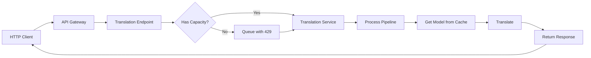
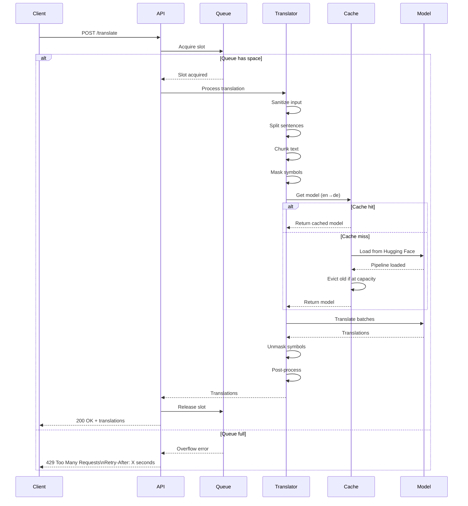
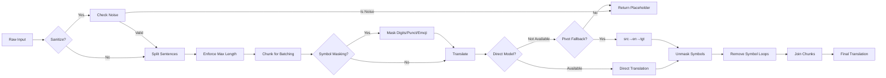
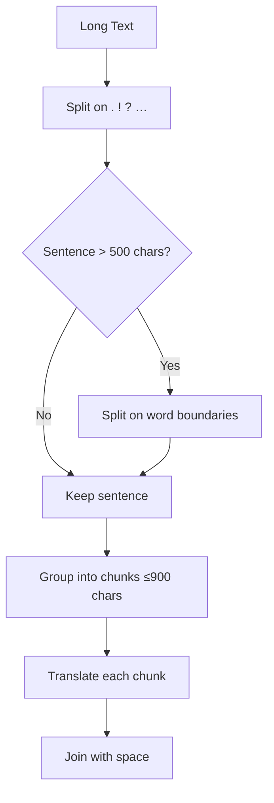
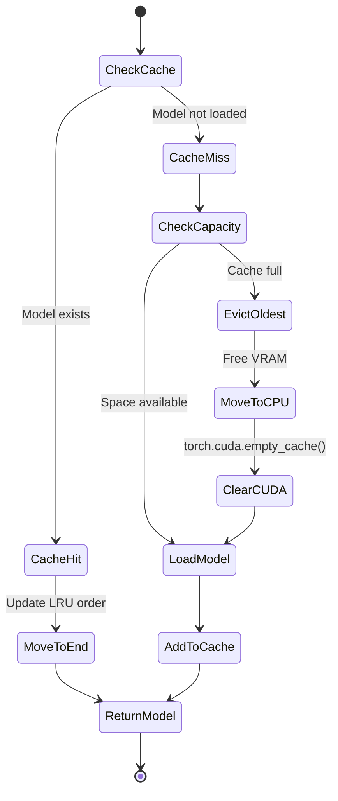
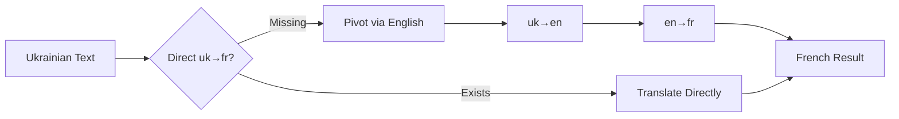

# Building mostlylucid-nmt: A Production-Ready (EasyNMT compatible) Translation Service

## Introduction

A FastAPI implementation EXACTLY copying the API of EasyNMT  (https://github.com/UKPLab/EasyNMT) an excellent but abandoned neural-machine-translation project. But I've added SO MANY nice features to increase reliability and make it ready for use in a production system. Think fast translation self hosted...

Since the start of this blog, a big passion has been auto-translating blog articles. YES I do know that 'google does this' in browsers etc...etc...but that's not the point. I wanted to know HOW to do it! Plus it's nice to be welcoming to people who don't read English (even if they read English as a second language, it's FAR harder to parse). So I worked out how to do it; as well as sharing how to build this sort of system. Oh and it gave me ideas on how to use it in ASP.NET for automatic localization of text (including dynamic text) using SignalR & a slick realtime updating system. ([stay tuned!](https://github.com/scottgal/mostlylucid.activetranslatetag)).

Oh and I've made a demo available here; https://nmtdemo.mostlylucid.net/demo/ it's only running in an old laptop with no GPU but gives you the idea (and lets me test lengevity). 

Essentially; humans write crap text which is SUPER noisy for machines to handle efficiently. So a lot was figuring out how to work around issues with EasyNMT (it was really ever a research project). Now `mostlylucid-nmt` is designed to be a battle tested (well translating the tens of thousands of words on here!) useful system for any translation. Kind of a BabelFish API. 

It also has all the learnings i have from three decades of building production servers & systems. Ranging from 429 codes to tell the client to back off, returning metadata about translations to help clients, extra endpoints to get more data and OF COURSE [a demo page ](#interactive-demo-page) which lets both me while developing as well as you a way to have a play.

I [wrote a whole system](https://www.mostlylucid.net/blog/category/EasyNMT) to make that happen with an amazing project called EasyNMT. HOWEVER, if you just checked that repo you know there's an issue...it's not been touched for YEARS. It's a simple, quick way to get a translation API without the need to pay for some service or run a full-size LLM to get translation (slowly).

In our previous posts, we discussed how to integrate EasyNMT with ASP.NET applications for background translation. But as time went on, the cracks started to show. It was time for something better.

 

[As usual it's all on GitHub and all free for use etc...](https://github.com/scottgal/mostlylucid-nmt)

[](https://hub.docker.com/r/scottgal/mostlylucid-nmt)
[](https://hub.docker.com/r/scottgal/mostlylucid-nmt)
[](https://hub.docker.com/r/scottgal/mostlylucid-nmt)
[](https://hub.docker.com/r/scottgal/mostlylucid-nmt)
[](https://hub.docker.com/r/scottgal/mostlylucid-nmt)

## Demo...see later for the demo page!

[A full featured (mostly) interactive demo page](#interactive-demo-page) (at `http://<server>:<port>/demo` or just the root)  

<p>

</p>

[TOC]
<!--category-- mostlylucid-nmt, EasyNMT,  Neural Machine Translation, Python, FastAPI, Docker, CUDA, PyTorch, Transformers, Helsinki-NLP,  API-->
<datetime class="hidden">2025-11-08T12:30</datetime>

## What's New?

Before we dive into the quick start, here's what makes this version game-changing:

### Major Updates (v3.1) - Intelligence & Visibility

**New in v3.1:** The latest version brings massive improvements to reliability, performance visibility, and intelligent model selection!

**1. Smart Model Caching with Visibility** - See exactly what's happening:
- ✓ **Cache HIT logging**: `Reusing loaded model for en->de (3/10 models in cache)`
- ✗ **Cache MISS logging**: `Need to load model for en->fr (3/10 models in cache)`
-  **Cache status tracking**: Shows utilization percentage and loaded models
- **Eviction warnings**: Clear alerts when cache is full and models are evicted
- **Increased capacity**: Default cache size bumped to 10 models (from 6)
- **Per-model device logging**: See exactly which GPU/CPU each model uses

**2. Enhanced Download Progress** - No more wondering if it's stuck:
-  **Size before download**: Shows total download size (e.g., "Total Size: 2.46 GB")
- **File count**: Displays number of files to download
- **Device display**: Shows target device (GPU/CPU) in banner
- **Progress bars**: Beautiful tqdm progress for each file (when on TTY)
- **Completion banner**: Clear success message when model is ready
- **Example output**:
  ```
  ====================================================================================================
    🚀 DOWNLOADING MODEL
    Model: facebook/mbart-large-50-many-to-many-mmt
    Family: mbart50
    Direction: en → bn
    Device: GPU (cuda:0)
    Total Size: 2.46 GB
    Files: 6 main files
  ====================================================================================================
  [Progress bars for each file...]
  ====================================================================================================
    ✅ MODEL READY
    Model: facebook/mbart-large-50-many-to-many-mmt
    Translation: en → bn is now available
  ====================================================================================================
  ```

**3. Data-Driven Intelligent Pivot Selection** - No more blind attempts:
- **Smart intersection logic**: Finds languages where BOTH pivot legs exist
- **Avoids failed attempts**: Won't try en→es→bn if es→bn doesn't exist
- **Example for en→bn**:
  ```
  [Pivot] Languages reachable from en: 85 languages
  [Pivot] Languages that can reach bn: 42 languages
  [Pivot] Found 38 possible pivot languages
  [Pivot] Selected pivot: en → hi → bn (both legs verified)
  ```
- **Fallback priority**: English → Spanish → French → German → Chinese → Russian
- **Transparent logging**: See exactly why each pivot was chosen or skipped

**4. Fixed Automatic Fallback** - No more double-tries:
- **Always tries fallbacks**: Even if preferred family "should" support the pair
- **Single attempt per family**: No more retrying the same model twice
- **Example flow**:
  ```
  Request: en→bn with opus-mt
  Trying families: ['opus-mt', 'mbart50', 'm2m100']  ✓ All three!
  opus-mt: Failed (model doesn't exist)
  mbart50: Success! (auto-fallback worked)
  ```

**5. GPU Clarity** - Always know where your models are:
- Every model load shows: `Loading mbart50 model on GPU (cuda:0)`
- After load confirms: `Model loaded on device: cuda:0`
- Success message includes: `Successfully loaded... on GPU (cuda:0)`

**6. Pivot Model Caching** - Efficient pivot reuse:
- Both legs of pivot cached separately: `en->hi`, `hi->bn`
- Next time en→hi or hi→bn needed, instant cache hit!
- Clear logging: `[Pivot] Both legs loaded and cached. Ready to translate.`

**7. Per-Request Model Selection** - Already works in demo:
- Demo dropdown allows selecting opus-mt, mbart50, or m2m100
- Backend respects `model_family` parameter per request
- Models cached separately by family for instant switching

### Major Updates (v3.0)

**1. Enhanced Demo Page** - Production-ready interactive interface:
- Full viewport layout (100vw/100vh) for immersive translation experience
- Proper themed select dropdowns (no more clunky input/datalist)
- Live model family switching (Opus-MT, mBART50, M2M100)
- Dynamic language loading based on selected model
- Scrollable output areas for large translations

**2. Performance-Optimised Defaults** - "Fast as possible" out of the box:
- **GPU**: FP16 enabled, BATCH_SIZE=64, MAX_INFLIGHT=1 (optimal for single GPU)
- **CPU**: WEB_CONCURRENCY=4, MAX_INFLIGHT=4, BATCH_SIZE=16 (utilise all cores)
- **Fast shutdown**: 5-second graceful timeout (no more 20-second hangs)
- Containers stop cleanly without scary SIGKILL messages

**3. Production Build Optimisation** - Smaller, faster images:
- Removed test dependencies (pytest, pytest-cov) from production builds
- Saves ~200MB per image
- CPU images: ~8-10GB (full), ~3-4GB (min)
- GPU images: ~12-15GB (full), ~6-8GB (min)
- All use `requirements-prod.txt` for minimal footprint

**4. Comprehensive Testing & Load Testing** - Validate everything:
- **Live API test suite** (30+ tests) for health, translation, detection, discovery
- **k6 load testing** with realistic traffic patterns
- **Cross-platform validation scripts** (PowerShell + Bash)
- Tests for model downloads and pivot translation fallback
- Automated smoke tests for quick validation

**5. Deployment Documentation** - Production-ready from day one:
- 4 tuning scenarios: Max Throughput, Low Latency, High Concurrency, Memory-Constrained
- Docker Compose examples with GPU/CPU configurations
- Kubernetes manifests with PVC, resource limits, health checks
- Azure Container Instances examples
- Load testing guidance and monitoring recommendations
- Concurrency vs throughput trade-offs explained

**6. Three Model Families** - Choose the best for your needs:
- **Opus-MT**: 1200+ pairs, best quality (separate models)
- **mBART50**: 50 languages, single 2.4GB model, 2,450 pairs
- **M2M100**: 100 languages, single 2.2GB model, 9,900 pairs

**7. Auto-Fallback** - Intelligently selects best available model:
- Set primary family (e.g., Opus-MT for quality)
- Automatically tries mBART50/M2M100 if pair unavailable
- Maximum coverage without sacrificing quality

**8. Model Discovery** - Dynamically query available models:
- `/discover/opus-mt` - All 1200+ pairs from Hugging Face
- `/discover/mbart50` - All mBART50 pairs
- `/discover/m2m100` - All M2M100 pairs

**9. Minimal Images** - Smaller, flexible deployments:
- No preloaded models (download on-demand)
- Volume-mapped persistent cache
- Switch model families without rebuilding

**10. Single Docker Repository** - All variants in one place:
- `scottgal/mostlylucid-nmt:cpu` (or `:latest`) - CPU
- `scottgal/mostlylucid-nmt:cpu-min` - CPU minimal
- `scottgal/mostlylucid-nmt:gpu` - GPU with CUDA 12.6
- `scottgal/mostlylucid-nmt:gpu-min` - GPU minimal

**11. Proper Versioning** - All images include datetime versioning:
- Named tags (`latest`, `min`, `gpu`, `gpu-min`) always point to most recent build
- Immutable version tags (e.g., `20250108.143022`) for pinning specific builds
- Full OCI labels for tracking versions, build dates, and git commits

**12. Latest Base Images** - Security and performance improvements:
- **Python 3.12-slim** for CPU images (addresses Python 3.11 vulnerabilities)
- **CUDA 12.6** with Ubuntu 24.04 for GPU images (latest NVIDIA stack)
- **PyTorch with CUDA 12.4** (compatible with CUDA 12.6 runtime)
- All dependencies updated to latest secure versions

**13. Fixed Deprecation Warnings** - Future-proof:
- Removed deprecated TRANSFORMERS_CACHE (now using HF_HOME)
- Compatible with Transformers v5

---

## Quick Start (5 Minutes)

Want to just get translating? Here's the absolute simplest way to run mostlylucid-nmt:

### Available Docker Images

All variants are available from **one repository** with different tags:

| Tag | Full Image Name | Size | Description | Use Case |
|-----|-----------------|------|-------------|----------|
| `cpu` (or `latest`) | `scottgal/mostlylucid-nmt:cpu` | ~2.5GB | CPU with source code | Production CPU deployments |
| `cpu-min` | `scottgal/mostlylucid-nmt:cpu-min` | ~1.5GB | CPU minimal, no preloaded models | Volume-mapped cache, flexible |
| `gpu` | `scottgal/mostlylucid-nmt:gpu` | ~5GB | GPU with CUDA 12.6 + source | Production GPU deployments |
| `gpu-min` | `scottgal/mostlylucid-nmt:gpu-min` | ~4GB | GPU minimal, no preloaded models | GPU with volume-mapped cache |

**Minimal images** are recommended for:
- Production deployments with volume-mapped cache
- Using mBART50 or M2M100 (single large models)
- Keeping container size small
- Flexibility to switch model families without rebuilding

### Simplest Start (Opus-MT CPU)

**1. Pull and run:**

```bash
docker run -d \
  --name mostlylucid-nmt \
  -p 8000:8000 \
  scottgal/mostlylucid-nmt
```

**2. Translate some text:**

```bash
curl -X POST "http://localhost:8000/translate" \
  -H "Content-Type: application/json" \
  -d '{
    "text": ["Hello, how are you?"],
    "target_lang": "de"
  }'
```

**Response:**
```json
{
  "translated": ["Hallo, wie geht es Ihnen?"],
  "target_lang": "de",
  "source_lang": "en",
  "translation_time": 0.34
}
```

### GPU Accelerated (10x Faster)

Requires NVIDIA Docker runtime:

```bash
docker run -d \
  --name mostlylucid-nmt \
  --gpus all \
  -p 8000:8000 \
  -e EASYNMT_MODEL_ARGS='{"torch_dtype":"fp16"}' \
  scottgal/mostlylucid-nmt:gpu
```

### With Persistent Model Cache

Download models once and keep them across container restarts:

**Linux/Mac:**
```bash
docker run -d \
  --name mostlylucid-nmt \
  -p 8000:8000 \
  -v $HOME/model-cache:/models \
  -e MODEL_CACHE_DIR=/models \
  scottgal/mostlylucid-nmt:cpu-min
```

**Windows (PowerShell):**
```powershell
docker run -d `
  --name mostlylucid-nmt `
  -p 8000:8000 `
  -v ${HOME}/model-cache:/models `
  -e MODEL_CACHE_DIR=/models `
  scottgal/mostlylucid-nmt:cpu-min
```

**Windows (CMD):**
```cmd
docker run -d ^
  --name mostlylucid-nmt ^
  -p 8000:8000 ^
  -v %USERPROFILE%/model-cache:/models ^
  -e MODEL_CACHE_DIR=/models ^
  scottgal/mostlylucid-nmt:cpu-min
```

Models download automatically on first use and persist in your local directory!

**Health check:**

```bash
curl http://localhost:8000/healthz
```

That's the 5-minute quick start! For production deployment, configuration, and advanced features, keep reading.

## Interactive Demo Page

The service includes a full-featured **interactive demo page** that makes it easy to test translations without writing any code. Access it at:

```
http://localhost:8000/demo/
```

<p>

</p>

### Demo Features

The demo page provides a complete translation testing environment with:

**1. Language Selection**
- Auto-populated language dropdowns from the live service
- Swap source/target languages with one click
- Supports all 100+ languages configured in the service

**2. Smart Text Chunking**
- Automatically handles large text inputs of any size
- Intelligently splits by paragraphs, preserving document structure
- Falls back to sentence splitting for very long paragraphs
- Shows progress for multi-chunk translations ("Translating chunk 2/5...")
- Seamlessly reassembles chunks with proper spacing

**3. Language Detection**
- Detect the source language with one click
- Automatically populates source language dropdown
- Works with text up to 5000 characters

**4. Advanced Options**
- **Beam Size**: Control translation quality (1-10)
  - Higher values = better quality but slower
  - Lower values = faster throughput
- **Sentence Splitting**: Toggle automatic sentence splitting
  - Enabled (default): Splits long texts into sentences for better quality
  - Disabled: Translates entire text as one block (faster for short texts)

**5. Real-Time Statistics**
- **Translation time**: Shows actual server-side translation duration
- **Character count**: Live count as you type
- **Status indicator**: Idle → Translating → Done/Error

**6. Model Family Discovery**
- Explore available translation pairs for each model family:
  - **Opus-MT**: 1200+ language pairs
  - **mBART50**: 50 languages, 2,450 pairs
  - **M2M100**: 100 languages, 9,900 pairs
- See exactly which language pairs are available before translating

### How Text Chunking Works

The demo implements intelligent text chunking on the client side:

```javascript
// Example: Translating a 5000-word article
Input: Long article with multiple paragraphs

Step 1: Split by paragraphs (preserves structure)
  → Paragraph 1 (800 chars)
  → Paragraph 2 (1200 chars)
  → Paragraph 3 (600 chars)
  ...

Step 2: Group into ~1000 character chunks
  → Chunk 1: Paragraphs 1-2
  → Chunk 2: Paragraph 3-4
  → Chunk 3: Paragraphs 5-6

Step 3: Translate each chunk sequentially
  → Shows progress: "Translating chunk 1/3..."
  → Shows progress: "Translating chunk 2/3..."
  → Shows progress: "Translating chunk 3/3..."

Step 4: Reassemble with paragraph breaks
  → Final output: Complete translated article with preserved formatting
```

### Why Use the Demo?

**Quick Testing**
- Test translations without writing code
- Validate language pair availability
- Compare translation quality with different beam sizes
- Test edge cases (emoji, symbols, special characters)

**Development Aid**
- See exact API request/response format
- Verify service health before integrating
- Test performance with different text sizes
- Discover available model families

**Client Reference**
- Shows proper API usage patterns
- Demonstrates error handling (429, language detection)
- Example of chunking implementation
- Real-world retry logic

### Example Usage

1. **Simple Translation**:
   - Paste text: "Hello, how are you today?"
   - Select target: German
   - Click "Translate"
   - Result: "Hallo, wie geht es Ihnen heute?"

2. **Long Document Translation**:
   - Paste entire blog post (5000+ words)
   - Demo automatically chunks it into manageable pieces
   - Shows progress as each chunk translates
   - Returns fully translated document

3. **Language Detection**:
   - Paste text in unknown language
   - Click "Detect language"
   - Demo identifies language and updates dropdown
   - Ready to translate immediately

### Technical Details

The demo page is:
- **Self-contained**: Single HTML file with embedded JavaScript
- **Zero dependencies**: No external libraries required
- **Mobile friendly**: Responsive design works on all devices
- **Production ready**: Same chunking logic can be used in your apps

Access the live demo at `/demo/` on your running instance!

## The Problems with EasyNMT

Now this isn't dumping on [EasyNMT](https://github.com/UKPLab/EasyNMT) it did soething nothing else could and I've built [a LOT of projects using it](https://www.mostlylucid.net/blog/category/EasyNMT).  It's just getting long in the tooth so...what problems have we?

Oh my, there's many. EasyNMT was built almost a decade ago. Technology has moved on...plus it was never intended to be a production-level system. Here are some of the issues:

1. **It crashes...a LOT.** It's not designed to recover from issues so often just falls over.
2. **It's SUPER PICKY about its input.** Emoticons, symbols, even numbers can confuse it.
3. **It's not designed for any load.** See above. It was never designed to be.
4. **It's not designed to update its models** or be (easily) built with built-in models.
5. **Its GPU CUDA stuff is ancient** so slower than it needs to be.
6. **You can't fix anything.** The Python code is on the repo but again *not great*.
7. **No backpressure or queueing.** Send too many requests and it just keels over.
8. **No observability.** When things go wrong, you're flying blind.

## The Solution: MostlyLucid-NMT

So...I decided to build a new and improved EasyNMT, now **mostlylucid-nmt**. This isn't just a patch job; it's a complete rewrite with production use in mind. Here's what makes it better:

### Multi-Model Family Support

MostlyLucid-NMT now supports **three translation model families**, giving you flexibility based on your needs:

#### Opus-MT (Helsinki-NLP) - Default
- **Coverage:** 1200+ translation pairs for 150+ languages
- **Architecture:** Separate model per translation direction
- **Quality:** Best overall translation quality
- **Use Case:** Production translations where quality matters
- **Model Size:** 300-500MB per direction
- **Example:** English→German is a different model than German→English

#### mBART50 (Facebook)
- **Coverage:** 50 languages, all-to-all translation
- **Architecture:** Single multilingual model
- **Quality:** Good quality, especially for major languages
- **Use Case:** Space-constrained deployments or many language pairs
- **Model Size:** ~2.4GB (single model for all 50 languages)
- **Advantage:** One model handles 2,450 translation pairs

#### M2M100 (Facebook)
- **Coverage:** 100 languages, all-to-all translation
- **Architecture:** Single multilingual model
- **Quality:** Good quality with broadest language coverage
- **Use Case:** Maximum language coverage
- **Model Size:** ~2.2GB (single model for all 100 languages)
- **Advantage:** One model handles 9,900 translation pairs

**Switching is easy** - just set the `MODEL_FAMILY` environment variable:

```bash
# Opus-MT (default, best quality)
MODEL_FAMILY=opus-mt

# mBART50 (50 languages, single model)
MODEL_FAMILY=mbart50

# M2M100 (100 languages, broadest coverage)
MODEL_FAMILY=m2m100
```

### Automatic Model Family Fallback - NEW!

One of the most powerful new features is **automatic fallback between model families**. This ensures maximum language pair coverage whilst prioritising translation quality.

**How it works:**

1. You set a primary `MODEL_FAMILY` (e.g., `opus-mt` for best quality)
2. When you request a translation pair not available in the primary family
3. The system automatically tries the next family in the fallback order
4. This continues until a suitable model is found

**Example scenario:**
```bash
# Set primary to Opus-MT (best quality)
MODEL_FAMILY=opus-mt
AUTO_MODEL_FALLBACK=1
MODEL_FALLBACK_ORDER=opus-mt,mbart50,m2m100

# Request Ukrainian → French
# 1. Try Opus-MT first (not available)
# 2. Automatically fall back to mBART50 (available!)
# 3. Translation succeeds with mBART50
```

**Benefits:**
- **Maximum coverage:** Support 100+ languages without managing multiple deployments
- **Quality priority:** Always uses the best available model for each pair
- **Zero configuration:** Works automatically, no manual intervention needed
- **Transparent logging:** See which model family was used for each translation

**Configuration:**
```bash
# Enable auto-fallback (default: enabled)
AUTO_MODEL_FALLBACK=1

# Set fallback priority (default: opus-mt → mbart50 → m2m100)
MODEL_FALLBACK_ORDER="opus-mt,mbart50,m2m100"

# Disable for strict single-family mode
AUTO_MODEL_FALLBACK=0
```

This feature is perfect for production environments where you want maximum coverage without sacrificing quality!

### Key Improvements

1. **Multi-model family support** - Choose from Opus-MT (1200+ pairs), mBART50 (50 languages), or M2M100 (100 languages).
2. **Model discovery endpoints** - Dynamically query available models from Hugging Face for each family.
3. **Robust input handling** - Emoji? Numbers? Symbols? Bring it on. The service now includes comprehensive input sanitisation and symbol masking.
4. **Request queueing and backpressure** - Built-in semaphore-based queueing with intelligent retry-after estimates.
5. **LRU model caching** - Automatically manages VRAM by evicting old models when cache is full.
6. **Modern CUDA support** - Uses PyTorch with CUDA 12.6, supports FP16/BF16 for 2x speed improvements.
7. **Production-ready observability** - Health checks, readiness probes, cache status, structured logging.
8. **Graceful shutdown** - No more orphaned requests or corrupted state.
9. **EasyNMT-compatible API** - Drop-in replacement for existing integrations.
10. **Pivot translation fallback** - If a direct language pair isn't available, automatically routes through English (or your chosen pivot).
11. **Minimal Docker images** - New `-min` variants with volume-mapped cache for smaller deployments.

## Why NMT Over LLMs for Translation?

You might be wondering: "Why use a dedicated NMT service when LLMs like GPT-4, Claude, or Llama can translate?" Great question. Here's the reality check based on production use:

### Speed: 10-100x Faster

**NMT (mostlylucid-nmt):**
- CPU: ~0.3-1.0 seconds per sentence
- GPU (FP16): ~0.05-0.2 seconds per sentence
- Batch processing: 50+ sentences/second on GPU

**LLMs:**
- GPT-4: 3-10 seconds per request (API latency + generation)
- Llama 3 70B: 5-15 seconds per sentence (local)
- Claude 3: 2-8 seconds per request (API latency)

**Real example:** Translating a 1000-word blog post:
- **mostlylucid-nmt (GPU)**: 5-10 seconds
- **GPT-4 API**: 30-60 seconds
- **Local Llama 70B**: 2-5 minutes

When you're auto-translating hundreds of blog posts to 12+ languages, that speed difference is MASSIVE.

### Model Size: 500MB vs 140GB

**NMT Models:**
- Opus-MT (per direction): 300-500MB
- mBART50 (all 50 languages): 2.4GB
- M2M100 (all 100 languages): 2.2GB
- **Total for 100+ languages: ~2.2GB**

**LLMs:**
- Llama 3 8B: ~16GB
- Llama 3 70B: ~140GB
- Mixtral 8x7B: ~90GB
- GPT-4: Not available for self-hosting

**Storage impact:**
```bash
# NMT: Fits on a USB stick
du -sh model-cache/
2.5G    model-cache/

# LLM: Needs serious storage
du -sh llama-models/
140G    llama-models/
```

### Resource Requirements: Laptop vs Server Farm

**NMT CPU Deployment:**
- Runs fine on: 2 CPU cores, 4GB RAM
- Docker image: 1.5-2.5GB
- Inference: CPU only, no GPU needed
- Cost: $10-20/month VPS

**LLM Requirements:**
- Llama 3 70B: Needs 80GB+ VRAM (A100 GPU)
- Smaller 7B-13B models: Still 16-32GB RAM minimum
- API costs: $0.03-0.30 per 1000 tokens (adds up fast!)
- Self-hosting: $1000+/month for serious GPU

**Real cost comparison for 10,000 blog post translations:**

| Method | Cost | Time |
|--------|------|------|
| mostlylucid-nmt (CPU) | $20/month VPS | 2-3 hours |
| mostlylucid-nmt (GPU) | $50/month GPU VPS | 15-30 minutes |
| GPT-4 API | $150-300 | 8-15 hours |
| Claude API | $200-400 | 6-12 hours |
| Local Llama 70B | $1000+/month hardware | 20-40 hours |

### Quality: Purpose-Built vs General-Purpose

**NMT strengths:**
- Trained specifically for translation
- Consistent quality (same input = same output)
- No "hallucinations" - pure translation
- Handles technical content, code, formatting well
- No prompt engineering needed

**LLM challenges:**
- ⚠️ Sometimes adds interpretations not in original
- ⚠️ Quality varies with prompt phrasing
- ⚠️ Can be "creative" with technical terms
- ⚠️ Needs careful prompt engineering
- ⚠️ Unpredictable with edge cases

**Example scenario:**
```text
Input: "The API returns a 429 status code when rate limited."

NMT (Opus-MT): "Die API gibt einen 429-Statuscode zurück, wenn sie ratenbegrenzt ist."
(Accurate, preserves technical terms)

LLM (might do): "Die API sendet den Fehlercode 429, wenn zu viele Anfragen gestellt werden."
(Interprets rather than translates, adds context not in original)
```

### When to Use Each

**Use NMT (mostlylucid-nmt) when:**
- You need consistent, fast translation at scale
- Budget matters (self-hosting or high volume)
- You're translating technical content, code, structured data
- You need deterministic output (same input = same output)
- You want to run on CPU or modest hardware
- You're building automated translation pipelines

**Use LLMs when:**
- You need creative adaptation, not literal translation
- Context and cultural nuance matter more than speed
- You're doing low-volume, one-off translations
- You need to translate + summarize + rewrite in one step
- You're okay with variable costs and slower processing

### The Bottom Line

For **automated blog translation** (my use case), NMT is the clear winner:
- Translates 100+ blog posts to 12 languages in ~30 minutes (GPU)
- Runs on a $50/month VPS
- Consistent quality across all posts
- Total setup: One Docker container

Trying this with LLMs would cost hundreds of dollars per month in API fees or require a $2000+ GPU server to self-host. The speed difference alone makes NMT the only practical choice for production translation pipelines.

**TL;DR:** NMT is purpose-built for translation, runs on modest hardware, and is 10-100x faster than LLMs. If you need fast, consistent, cost-effective translation at scale, NMT wins hands down.

## Architecture Overview



The request flow is straightforward:

1. **Client** sends translation request to API Gateway (Gunicorn + Uvicorn workers)
2. **API Gateway** routes to Translation Endpoint
3. **Capacity Check**: System checks if it has capacity to handle the request
   - **Yes** → Request goes to Translation Service immediately
   - **No** → Request queued, client receives HTTP 429 with `Retry-After` header
4. **Translation Service** processes the request through the pipeline:
   - Input sanitisation and sentence splitting
   - Symbol masking (emojis, special chars)
   - Translation using cached models
   - Symbol unmasking and post-processing
5. **Model Cache** (LRU) provides translation models:
   - Cache hit → Fast response
   - Cache miss → Load from HuggingFace Hub
   - Cache full → Auto-evict old models, clear CUDA memory
6. **Response** returns to client

**Key Design:** The backpressure mechanism (queue + HTTP 429) prevents crashes under load. When overwhelmed, the service queues requests instead of dying, giving clients intelligent retry timing via `Retry-After` headers.

## How It Works: Deep Dive

### Request Flow

When a translation request comes in, here's what happens:



### Input Processing Pipeline

The service uses a sophisticated multi-stage pipeline to handle messy real-world text:



### Input Sanitization

One of the biggest improvements is robust input handling. Here's what happens:

**Noise Detection:**
- Strips control characters (except \t, \n, \r)
- Checks minimum character count (default: 1)
- Calculates alphanumeric ratio (default: must be ≥20%)
- Rejects pure emoji, pure punctuation, or pure whitespace

**Symbol Masking:**
Why mask symbols? Translation models are trained on text, not emoji or special symbols. These can confuse them or get mangled. So we:

1. Extract all digits, punctuation, and emoji as contiguous runs
2. Replace them with sentinel tokens: `⟪MSK0⟫`, `⟪MSK1⟫`, etc.
3. Translate the masked text
4. Restore the original symbols in their positions

Example:
```
Input:  "Hello 👋 world! Price: $99.99"
Masked: "Hello ⟪MSK0⟫ world⟪MSK1⟫ Price⟪MSK2⟫ ⟪MSK3⟫"
                 (👋)        (!)      (:)    ($99.99)
```

**Post-Processing:**
After translation, we remove "symbol loops" - repeated symbols that weren't in the source:

```
Source: "Hello world"
Bad translation: "Hola mundo!!!!!!!"
Cleaned: "Hola mundo"  # Removes the !!!! loop
```

### Sentence Splitting & Chunking

Long texts get split intelligently:



This ensures:
- Models don't choke on huge inputs
- We can batch efficiently
- Context is preserved within reasonable boundaries

### Model Caching & Memory Management

The LRU cache is smart about GPU memory:



**Why this matters:**
- GPU memory is precious
- Translation models are 300-500MB each
- Loading models is slow (1-3 seconds)
- We keep the 6 most recent models hot
- Old models are automatically evicted

### Queueing & Backpressure

Instead of crashing under load, the service queues requests:

```python
# Semaphore limits concurrent translations
MAX_INFLIGHT = 1  # On GPU, 1 at a time for efficiency
MAX_QUEUE_SIZE = 1000  # Up to 1000 waiting

# When full:
# - Returns 429 Too Many Requests
# - Includes Retry-After header
# - Estimates wait time based on average duration
```

The retry estimate is smart:
```
avg_duration = 2.5 seconds (tracked with EMA)
waiters = 100
slots = 1
estimated_wait = (100 / 1) * 2.5 = 250 seconds
clamped = min(250, 120) = 120 seconds
Retry-After: 120
```

### Pivot Translation Fallback

Not all language pairs have direct models on Hugging Face. Solution? Pivot through English:



This doubles latency but ensures coverage for all supported language pairs.

## Code Deep Dive: Cool Features Explained

Let's explore some of the most interesting parts of the codebase! These are real production patterns that make the service robust and efficient. Each snippet includes explanations suitable for non-Python developers.

### 1. Smart LRU Cache with GPU Memory Management

One of the coolest features is the intelligent model cache that knows how to handle GPU memory:

```python
# src/core/cache.py
from collections import OrderedDict
import torch

class LRUPipelineCache:
    """LRU cache that automatically cleans up GPU memory when evicting models."""

    def __init__(self, capacity: int):
        self.cache = OrderedDict()  # Maintains insertion order
        self.capacity = capacity

    def get(self, key: str):
        """Get model from cache, moves it to end (most recently used)."""
        if key not in self.cache:
            return None
        self.cache.move_to_end(key)  # Mark as recently used
        return self.cache[key]

    def put(self, key: str, value):
        """Add model to cache, evicting oldest if at capacity."""
        if key in self.cache:
            self.cache.move_to_end(key)
        else:
            self.cache[key] = value

        # If cache is full, evict the oldest model
        if len(self.cache) > self.capacity:
            oldest_key, oldest_pipeline = self.cache.popitem(last=False)

            # MAGIC: Move evicted model to CPU to free GPU memory
            try:
                oldest_pipeline.model.to("cpu")
                if torch.cuda.is_available():
                    torch.cuda.empty_cache()  # Tell GPU to release memory
                logger.info(f"Evicted {oldest_key}, freed GPU memory")
            except Exception as e:
                logger.warning(f"Failed to clean GPU memory: {e}")
```

**What's happening here?**
- `OrderedDict`: Like a regular dictionary, but remembers the order items were added
- **LRU (Least Recently Used)**: When the cache is full, kick out the model that hasn't been used in the longest time
- **GPU cleanup**: When evicting a model, we explicitly move it to CPU memory and tell the GPU to release its resources
- **Why it matters**: Without this, GPU memory would fill up and crash after loading 2-3 models!

### 2. Automatic Model Family Fallback

This clever feature tries multiple AI model providers automatically if the first one doesn't have the language pair you need:

```python
# src/services/model_manager.py
def get_pipeline(self, src: str, tgt: str):
    """Try to get translation model, with automatic fallback to other providers."""

    # Determine which model families support this language pair
    families_to_try = []

    if config.AUTO_MODEL_FALLBACK:
        # Try families in priority order: opus-mt → mbart50 → m2m100
        for family in config.MODEL_FALLBACK_ORDER.split(","):
            if self._is_pair_supported(src, tgt, family.strip()):
                families_to_try.append(family.strip())

    # Try each family until one succeeds
    last_error = None
    for family in families_to_try:
        try:
            model_name, src_lang, tgt_lang, _ = self._get_model_name_and_langs(src, tgt, family)

            if family != config.MODEL_FAMILY:
                logger.info(f"Using fallback '{family}' for {src}->{tgt}")

            # Load the model from HuggingFace
            pipeline = transformers.pipeline(
                "translation",
                model=model_name,
                device=device_manager.device_index,
                src_lang=src_lang,
                tgt_lang=tgt_lang
            )

            self.cache.put(f"{src}->{tgt}", pipeline)
            return pipeline

        except Exception as e:
            last_error = e
            logger.warning(f"Family '{family}' failed for {src}->{tgt}: {e}")
            continue  # Try next family

    # All families failed
    raise ModelLoadError(f"{src}->{tgt}", last_error)
```

**What's happening here?**
- **Fallback chain**: If Opus-MT doesn't have Ukrainian→French, automatically try mBART50, then M2M100
- **No manual intervention**: Users just request a translation and get the best available model
- **Error handling**: If all families fail, we throw a clear error with the last failure reason
- **Smart caching**: Successful models are cached with the language pair key

### 3. Request Queue with Backpressure (HTTP 429)

Production-grade queuing that prevents server crashes under heavy load:

```python
# src/services/queue_manager.py
import asyncio
from contextlib import asynccontextmanager

class QueueManager:
    """Manages request queuing and backpressure."""

    def __init__(self, max_inflight: int, max_queue: int):
        self.semaphore = asyncio.Semaphore(max_inflight)  # Limit concurrent translations
        self.max_queue_size = max_queue
        self.waiting_count = 0
        self.inflight_count = 0
        self.avg_duration_sec = 5.0  # Exponential moving average

    @asynccontextmanager
    async def acquire_slot(self):
        """Try to get a translation slot, track metrics, handle queueing."""

        # Check if queue is too full
        if self.waiting_count >= self.max_queue_size:
            # Calculate how long client should wait before retrying
            retry_after = self._estimate_retry_after()
            raise QueueOverflowError(self.waiting_count, retry_after)

        self.waiting_count += 1
        try:
            # Wait for available slot (this is the queue!)
            await self.semaphore.acquire()
            self.waiting_count -= 1
            self.inflight_count += 1

            start_time = time.time()
            yield  # Let the translation happen

            # Update average duration for retry-after estimates
            duration = time.time() - start_time
            alpha = config.RETRY_AFTER_ALPHA  # Smoothing factor (0.2)
            self.avg_duration_sec = alpha * duration + (1 - alpha) * self.avg_duration_sec

        finally:
            self.inflight_count -= 1
            self.semaphore.release()

    def _estimate_retry_after(self) -> int:
        """Smart calculation: how many waiting / how many slots * avg time per request."""
        if self.inflight_count == 0:
            return config.RETRY_AFTER_MIN_SEC

        # If 10 people waiting and 2 slots available, and each takes 5 seconds:
        # retry_after = (10 / 2) * 5 = 25 seconds
        retry_sec = (self.waiting_count / self.semaphore._value) * self.avg_duration_sec

        # Clamp between min and max
        return max(
            config.RETRY_AFTER_MIN_SEC,
            min(int(retry_sec), config.RETRY_AFTER_MAX_SEC)
        )
```

**What's happening here?**
- **Semaphore**: Like a bouncer at a club - only lets N people in at once (N = `max_inflight`)
- **Context manager** (`@asynccontextmanager`): Automatically tracks metrics and cleans up
- **Smart retry-after**: Tells clients "come back in 25 seconds" based on queue depth and average request time
- **Exponential moving average**: Smooths out spikes in request duration
- **Why it matters**: Under heavy load, returns HTTP 429 instead of crashing or queueing infinitely

### 4. Symbol Masking Magic

Preserves special characters (emojis, symbols) that translation models might mess up:

```python
# src/utils/symbol_masking.py
import re

def mask_symbols(text: str) -> tuple[str, dict[str, str]]:
    """Replace special symbols with placeholders before translation."""

    originals = {}
    masked_text = text
    placeholder_counter = 0

    # Pattern: Match emojis, symbols, special punctuation
    # \U0001F300-\U0001F9FF = emoji range
    # [\u2600-\u26FF\u2700-\u27BF] = misc symbols
    symbol_pattern = re.compile(
        r'[\U0001F300-\U0001F9FF\u2600-\u26FF\u2700-\u27BF'
        r'\u00A9\u00AE\u2122\u2139\u3030\u303D\u3297\u3299]+'
    )

    for match in symbol_pattern.finditer(text):
        symbol = match.group()
        placeholder = f"__SYMBOL_{placeholder_counter}__"
        originals[placeholder] = symbol
        masked_text = masked_text.replace(symbol, placeholder, 1)
        placeholder_counter += 1

    return masked_text, originals

def unmask_symbols(text: str, originals: dict[str, str]) -> str:
    """Restore original symbols after translation."""
    for placeholder, original in originals.items():
        text = text.replace(placeholder, original)
    return text
```

**Example usage:**
```python
# Before translation:
text = "Hello! 👋 Check out this cool feature 🚀"

# Mask symbols:
masked, originals = mask_symbols(text)
# masked = "Hello! __SYMBOL_0__ Check out this cool feature __SYMBOL_1__"
# originals = {"__SYMBOL_0__": "👋", "__SYMBOL_1__": "🚀"}

# Translate the masked text:
translated = translate(masked, "de")  # → "Hallo! __SYMBOL_0__ Schau dir diese coole Funktion an __SYMBOL_1__"

# Unmask symbols:
final = unmask_symbols(translated, originals)
# final = "Hallo! 👋 Schau dir diese coole Funktion an 🚀"
```

**What's happening here?**
- **Regex pattern**: Matches emoji and special symbol Unicode ranges
- **Placeholder system**: Swaps `👋` with `__SYMBOL_0__` temporarily
- **Why it matters**: Translation models sometimes corrupt or remove emojis - this preserves them perfectly!

### 5. Intelligent Text Chunking

Breaks long texts into chunks that fit model limits while preserving sentence boundaries:

```python
# src/utils/text_processing.py
def chunk_sentences(sentences: list[str], max_chars: int = 900) -> list[list[str]]:
    """Group sentences into chunks that fit within model's max input length."""

    chunks = []
    current_chunk = []
    current_length = 0

    for sentence in sentences:
        sentence_len = len(sentence)

        # If this sentence alone is too long, it goes in its own chunk
        if sentence_len > max_chars:
            if current_chunk:
                chunks.append(current_chunk)
                current_chunk = []
                current_length = 0
            chunks.append([sentence])
            continue

        # If adding this sentence exceeds limit, start new chunk
        if current_length + sentence_len + 1 > max_chars:
            chunks.append(current_chunk)
            current_chunk = [sentence]
            current_length = sentence_len
        else:
            current_chunk.append(sentence)
            current_length += sentence_len + 1  # +1 for space

    # Don't forget the last chunk!
    if current_chunk:
        chunks.append(current_chunk)

    return chunks

def split_sentences(text: str, max_sentence_chars: int = 500) -> list[str]:
    """Split text into sentences, enforcing max length."""

    # Split on common sentence terminators
    sentences = re.split(r'([.!?…]+\s+)', text)

    result = []
    for sentence in sentences:
        if not sentence or sentence.isspace():
            continue

        # If sentence is too long, split on word boundaries
        if len(sentence) > max_sentence_chars:
            words = sentence.split()
            current = []
            current_len = 0

            for word in words:
                if current_len + len(word) + 1 > max_sentence_chars:
                    result.append(' '.join(current))
                    current = [word]
                    current_len = len(word)
                else:
                    current.append(word)
                    current_len += len(word) + 1

            if current:
                result.append(' '.join(current))
        else:
            result.append(sentence.strip())

    return result
```

**What's happening here?**
- **Sentence splitting**: Uses regex to split on `.!?…` while preserving the punctuation
- **Greedy chunking**: Packs as many sentences as possible into each chunk without exceeding the limit
- **Word boundary splitting**: If a single sentence is too long, splits on spaces instead of cutting mid-word
- **Why it matters**: Translation models have input limits (usually 512-1024 tokens). This ensures we never exceed them while keeping context intact.

### 6. Async Model Discovery with Caching

Dynamically discovers available translation models from HuggingFace:

```python
# src/services/model_discovery.py
import httpx
from datetime import datetime, timedelta

class ModelDiscoveryService:
    """Discovers available translation models with 1-hour cache."""

    def __init__(self):
        self._cache = {}  # Cache results to avoid hammering HuggingFace API
        self._cache_ttl = timedelta(hours=1)
        self._hf_api_base = "https://huggingface.co/api/models"

    async def discover_opus_mt_pairs(self, force_refresh: bool = False):
        """Query HuggingFace for all Helsinki-NLP Opus-MT models."""

        cache_key = "opus-mt"

        # Check cache first
        if not force_refresh and cache_key in self._cache:
            cached_data, cached_time = self._cache[cache_key]
            if datetime.now() - cached_time < self._cache_ttl:
                return cached_data  # Cache hit!

        # Cache miss - query HuggingFace API
        async with httpx.AsyncClient() as client:
            response = await client.get(
                self._hf_api_base,
                params={
                    "author": "Helsinki-NLP",
                    "search": "opus-mt",
                    "limit": 1000
                },
                timeout=30.0
            )
            models = response.json()

        # Extract language pairs from model names
        # Example: "Helsinki-NLP/opus-mt-en-de" → ("en", "de")
        pairs = []
        for model in models:
            model_id = model.get("modelId", "")
            if model_id.startswith("Helsinki-NLP/opus-mt-"):
                # Extract the language codes after "opus-mt-"
                lang_part = model_id.replace("Helsinki-NLP/opus-mt-", "")
                if "-" in lang_part:
                    src, tgt = lang_part.split("-", 1)
                    pairs.append({"source": src, "target": tgt})

        # Cache the results
        self._cache[cache_key] = (pairs, datetime.now())

        return pairs
```

**What's happening here?**
- **Async HTTP client** (`httpx`): Makes non-blocking HTTP requests to HuggingFace
- **Time-based caching**: Stores results for 1 hour to avoid rate limiting
- **Model name parsing**: Extracts `en` and `de` from `Helsinki-NLP/opus-mt-en-de`
- **Why it matters**: HuggingFace has 1200+ Opus-MT models. Querying them all takes ~10 seconds. Caching makes it instant!

### 7. Device Auto-Detection

Automatically detects and uses GPU if available:

```python
# src/core/device.py
import torch

class DeviceManager:
    """Smart device selection with GPU auto-detection."""

    def __init__(self):
        self.use_gpu = self._should_use_gpu()
        self.device_index = self._resolve_device()
        self.device_str = "cpu" if self.device_index < 0 else f"cuda:{self.device_index}"

        # Auto-configure parallel translation slots based on device
        if self.device_index >= 0:
            # GPU: Run translations serially to avoid VRAM fragmentation
            self.max_inflight = 1
        else:
            # CPU: Can handle multiple translations in parallel
            self.max_inflight = config.MAX_WORKERS_BACKEND

        self._log_device_info()

    def _should_use_gpu(self) -> bool:
        """Check if GPU should be used."""
        if config.USE_GPU.lower() == "false":
            return False
        if config.USE_GPU.lower() == "true":
            return torch.cuda.is_available()
        # "auto" mode: use GPU if available
        return torch.cuda.is_available()

    def _resolve_device(self) -> int:
        """Returns device index: -1 for CPU, 0+ for CUDA."""
        if not self.use_gpu:
            return -1

        # Check if specific CUDA device requested
        if config.DEVICE and config.DEVICE.startswith("cuda:"):
            device_num = int(config.DEVICE.split(":")[1])
            return device_num

        return 0  # Use first GPU

    def _log_device_info(self):
        """Log device information at startup."""
        if self.device_index >= 0:
            gpu_name = torch.cuda.get_device_name(self.device_index)
            vram_gb = torch.cuda.get_device_properties(self.device_index).total_memory / 1e9
            logger.info(f"Using GPU: {gpu_name} ({vram_gb:.1f}GB VRAM)")
            logger.info(f"Max inflight translations: {self.max_inflight} (GPU mode)")
        else:
            cpu_count = os.cpu_count()
            logger.info(f"Using CPU ({cpu_count} cores)")
            logger.info(f"Max inflight translations: {self.max_inflight} (CPU mode)")

# Global singleton instance
device_manager = DeviceManager()
```

**What's happening here?**
- **GPU detection**: Uses PyTorch to check if CUDA is available
- **Auto-configuration**: Sets `max_inflight=1` on GPU (avoid VRAM fragmentation) vs `max_inflight=4` on CPU (maximise parallelism)
- **Device selection**: Can target specific GPU with `DEVICE=cuda:1`
- **Logging**: Shows GPU name and VRAM at startup for debugging
- **Singleton pattern**: One instance shared across the entire application

### 8. Exponential Moving Average for Retry-After

Smooth retry-after estimation that adapts to actual request durations:

```python
# Snippet from QueueManager showing EMA calculation
def update_avg_duration(self, new_duration: float):
    """Update average duration using exponential moving average."""

    # EMA formula: new_avg = α × new_value + (1 - α) × old_avg
    # α = smoothing factor (0.0 to 1.0)
    #   - Higher α = more weight to recent values (faster adaptation)
    #   - Lower α = more weight to historical values (more stable)

    alpha = 0.2  # 20% weight to new value, 80% to historical

    self.avg_duration_sec = (
        alpha * new_duration +
        (1 - alpha) * self.avg_duration_sec
    )
```

**Example:**
```python
# Initial average: 5.0 seconds
# New request takes: 10.0 seconds

# EMA calculation:
new_avg = 0.2 * 10.0 + 0.8 * 5.0
        = 2.0 + 4.0
        = 6.0 seconds

# Next request takes: 3.0 seconds
new_avg = 0.2 * 3.0 + 0.8 * 6.0
        = 0.6 + 4.8
        = 5.4 seconds
```

**What's happening here?**
- **EMA (Exponential Moving Average)**: Like a weighted average that gives more importance to recent values
- **Smoothing factor (α)**: Controls how quickly we adapt to changes
- **Why not simple average?**: EMA adapts faster to changes while filtering out spikes
- **Why it matters**: Gives clients realistic `Retry-After` times that adapt to current system load

---

**These code patterns demonstrate production-grade Python practices:**
- **Resource management**: Explicit GPU memory cleanup
- **Graceful degradation**: Automatic fallback between model providers
- **Backpressure handling**: Queue + HTTP 429 instead of crashes
- **Data integrity**: Symbol masking preserves special characters
- **Performance optimisation**: Smart caching, chunking, and parallel processing
- **Observability**: Detailed logging and metrics tracking

Each of these features solves a real production problem that would cause crashes, errors, or poor user experience without them!

## Configuration Guide

The service is highly configurable via environment variables. Here's the complete guide:

### Device Selection

```bash
# Prefer GPU if available (default)
USE_GPU=auto

# Force GPU
USE_GPU=true

# Force CPU
USE_GPU=false

# Explicit device override
DEVICE=cuda:0
DEVICE=cpu
```

### Model Configuration

```bash
# Model family selection (NEW in v2.0!)
MODEL_FAMILY=opus-mt   # Best quality (default)
MODEL_FAMILY=mbart50   # 50 languages, single model
MODEL_FAMILY=m2m100    # 100 languages, maximum coverage

# Auto-fallback between model families (NEW in v2.0!)
AUTO_MODEL_FALLBACK=1  # Enabled by default
MODEL_FALLBACK_ORDER="opus-mt,mbart50,m2m100"  # Priority order

# Volume-mapped model cache (NEW in v2.0!)
MODEL_CACHE_DIR=/models  # Persistent cache directory

# Model arguments passed to transformers.pipeline
EASYNMT_MODEL_ARGS='{"torch_dtype":"fp16"}'
EASYNMT_MODEL_ARGS='{"torch_dtype":"bf16","cache_dir":"/models"}'

# Preload models at startup (reduces first-request latency)
PRELOAD_MODELS="en->de,de->en,fr->en"

# LRU cache capacity
MAX_CACHED_MODELS=6
```

**New Configuration Explained:**

- **MODEL_FAMILY**: Choose which model family to use as primary
  - `opus-mt`: Best quality, 1200+ pairs, separate models
  - `mbart50`: Good quality, 50 languages, single 2.4GB model
  - `m2m100`: Good quality, 100 languages, single 2.2GB model

- **AUTO_MODEL_FALLBACK**: Automatically try other families if pair unavailable
  - `1` (default): Enabled - maximum coverage
  - `0`: Disabled - strict single-family mode

- **MODEL_FALLBACK_ORDER**: Priority order for fallback
  - Default: `"opus-mt,mbart50,m2m100"` (quality first)
  - Alternative: `"m2m100,mbart50,opus-mt"` (coverage first)

- **MODEL_CACHE_DIR**: Persistent model storage via Docker volumes
  - Set to `/models` and map volume: `-v ./model-cache:/models`
  - Models persist across container restarts
  - Shared cache between multiple containers

**torch_dtype options:**
- `fp16` (float16): 2x faster on GPU, half the memory, negligible quality loss
- `bf16` (bfloat16): Better numerical stability than fp16, requires modern GPUs
- `fp32` (float32): Full precision, slowest but most accurate

### Translation Settings

```bash
# Batch size for translation (higher = faster but more VRAM)
EASYNMT_BATCH_SIZE=16  # CPU: 8-16, GPU: 32-64

# Maximum text length per item
EASYNMT_MAX_TEXT_LEN=1000

# Maximum beam size (higher = better quality but slower)
EASYNMT_MAX_BEAM_SIZE=5

# Worker thread pools
MAX_WORKERS_BACKEND=1    # Translation workers
MAX_WORKERS_FRONTEND=2   # Language detection workers
```

### Queueing & Performance

```bash
# Enable request queueing (highly recommended)
ENABLE_QUEUE=1

# Max concurrent translations
# Auto: 1 on GPU, MAX_WORKERS_BACKEND on CPU
MAX_INFLIGHT_TRANSLATIONS=1

# Max queued requests before 429
MAX_QUEUE_SIZE=1000

# Per-request timeout (0 = disabled)
TRANSLATE_TIMEOUT_SEC=180

# Retry-After estimation
RETRY_AFTER_MIN_SEC=1      # Floor
RETRY_AFTER_MAX_SEC=120    # Ceiling
RETRY_AFTER_ALPHA=0.2      # EMA smoothing factor
```

### Input Sanitization

```bash
# Enable input filtering
INPUT_SANITIZE=1

# Minimum alphanumeric ratio (0.2 = 20%)
INPUT_MIN_ALNUM_RATIO=0.2

# Minimum character count
INPUT_MIN_CHARS=1

# Language code for undetermined/noise
UNDETERMINED_LANG_CODE=und
```

### Sentence Processing

```bash
# Default sentence splitting behavior
PERFORM_SENTENCE_SPLITTING_DEFAULT=1

# Max chars per sentence before word-boundary split
MAX_SENTENCE_CHARS=500

# Max chars per chunk for batching
MAX_CHUNK_CHARS=900

# Sentence joiner
JOIN_SENTENCES_WITH=" "
```

### Symbol Masking

```bash
# Enable symbol masking
SYMBOL_MASKING=1

# What to mask
MASK_DIGITS=1    # Mask 0-9
MASK_PUNCT=1     # Mask .,!? etc.
MASK_EMOJI=1     # Mask 😀🎉 etc.
```

### Response Behavior

```bash
# Align response array length to input
ALIGN_RESPONSES=1

# Placeholder for failed items (when aligned)
SANITIZE_PLACEHOLDER=""

# Response format
EASYNMT_RESPONSE_MODE=strings    # ["translation1", "translation2"]
EASYNMT_RESPONSE_MODE=objects    # [{"text":"translation1"}, ...]
```

### Pivot Fallback

```bash
# Enable two-hop translation via pivot
PIVOT_FALLBACK=1

# Pivot language (usually English)
PIVOT_LANG=en
```

### Logging

```bash
# Log level
LOG_LEVEL=INFO

# Per-request logging (verbose)
REQUEST_LOG=1

# Format
LOG_FORMAT=plain    # Human-readable
LOG_FORMAT=json     # Structured JSON

# File logging with rotation
LOG_TO_FILE=1
LOG_FILE_PATH=/var/log/marian-translator/app.log
LOG_FILE_MAX_BYTES=10485760    # 10MB
LOG_FILE_BACKUP_COUNT=5

# Include raw text in logs (privacy risk!)
LOG_INCLUDE_TEXT=0
```

### Maintenance

```bash
# Periodically clear CUDA cache (seconds, 0=disabled)
CUDA_CACHE_CLEAR_INTERVAL_SEC=0
```

### Gunicorn (Docker)

```bash
# Worker count (use 1 for single GPU)
WEB_CONCURRENCY=1

# Request timeout
TIMEOUT=60

# Graceful shutdown timeout
GRACEFUL_TIMEOUT=20

# Keep-alive timeout
KEEP_ALIVE=5
```

## Usage Examples

### Basic Translation

```bash
# GET request
curl "http://localhost:8000/translate?target_lang=de&text=Hello%20world&source_lang=en"

# Response
{
  "translations": ["Hallo Welt"]
}
```

### Batch Translation (Recommended)

```bash
# POST request
curl -X POST http://localhost:8000/translate \
  -H 'Content-Type: application/json' \
  -d '{
    "text": [
      "Hello world",
      "This is a test",
      "Machine translation is amazing"
    ],
    "target_lang": "de",
    "source_lang": "en",
    "beam_size": 1,
    "perform_sentence_splitting": true
  }'

# Response
{
  "target_lang": "de",
  "source_lang": "en",
  "translated": [
    "Hallo Welt",
    "Das ist ein Test",
    "Maschinenübersetzung ist erstaunlich"
  ],
  "translation_time": 0.342
}
```

### Auto Language Detection

```bash
# Omit source_lang for auto-detection
curl -X POST http://localhost:8000/translate \
  -H 'Content-Type: application/json' \
  -d '{
    "text": ["Bonjour le monde"],
    "target_lang": "en"
  }'

# Response
{
  "target_lang": "en",
  "source_lang": "fr",  # Detected
  "translated": ["Hello world"],
  "translation_time": 0.156
}
```

### Language Detection Only

```bash
# GET
curl "http://localhost:8000/language_detection?text=Hola%20mundo"
# {"language": "es"}

# POST with batch
curl -X POST http://localhost:8000/language_detection \
  -H 'Content-Type: application/json' \
  -d '{"text": ["Hello", "Bonjour", "Hola"]}'
# {"languages": ["en", "fr", "es"]}
```

### Observability Endpoints

```bash
# Health check
curl http://localhost:8000/healthz
# {"status": "ok"}

# Readiness
curl http://localhost:8000/readyz
# {
#   "status": "ready",
#   "device": "cuda:0",
#   "queue_enabled": true,
#   "max_inflight": 1
# }

# Cache status
curl http://localhost:8000/cache
# {
#   "capacity": 6,
#   "size": 3,
#   "keys": ["en->de", "de->en", "fr->en"],
#   "device": "cuda:0",
#   "inflight": 1,
#   "queue_enabled": true
# }

# Model info
curl http://localhost:8000/model_name | jq
```

### Handling Backpressure

```bash
# When queue is full, you get 429
curl -X POST http://localhost:8000/translate \
  -H 'Content-Type: application/json' \
  -d '{"text": ["test"], "target_lang": "de"}'

# Response: 429 Too Many Requests
# Headers: Retry-After: 45
# Body:
{
  "message": "Too many requests; queue full",
  "retry_after_sec": 45
}

# Proper client behavior:
# 1. Read Retry-After header
# 2. Wait that long + jitter
# 3. Retry request
```

## Building and Versioning

All Docker images now include proper versioning and metadata for tracking.

### Quick Build

Build all 4 variants with automatic datetime versioning:

**Windows:**
```powershell
.\build-all.ps1
```

**Linux/Mac:**
```bash
chmod +x build-all.sh
./build-all.sh
```

### Versioning Strategy

Each build creates **two tags**:
1. **Named tag** (`latest`, `min`, `gpu`, `gpu-min`) - always points to most recent
2. **Version tag** (e.g., `20250108.143022`) - immutable snapshot

Examples:
```bash
# Always get the latest version
docker pull scottgal/mostlylucid-nmt:cpu
# Or use the :latest alias
docker pull scottgal/mostlylucid-nmt:latest

# Pin to a specific version for reproducibility
docker pull scottgal/mostlylucid-nmt:cpu-20250108.143022
docker pull scottgal/mostlylucid-nmt:cpu-min-20250108.143022
```

### OCI Labels

Each image includes metadata:
- **Version**: Build timestamp (YYYYMMDD.HHMMSS)
- **Build date**: ISO 8601 timestamp
- **Git commit**: Short SHA
- **Variant**: cpu-full, cpu-min, gpu-full, or gpu-min

Inspect labels:
```bash
docker inspect scottgal/mostlylucid-nmt:cpu | jq '.[0].Config.Labels'
```

For detailed build instructions and CI/CD integration, see [BUILD.md](https://github.com/scottgal/mostlylucid-nmt/blob/main/BUILD.md).

## Deployment

### CPU Deployment

```bash
# Using pre-built image from Docker Hub (recommended)
docker run -d \
  --name translator \
  -p 8000:8000 \
  -e ENABLE_QUEUE=1 \
  -e MAX_QUEUE_SIZE=500 \
  -e EASYNMT_BATCH_SIZE=16 \
  -e TIMEOUT=180 \
  -e LOG_LEVEL=INFO \
  -e REQUEST_LOG=0 \
  scottgal/mostlylucid-nmt

# Or build locally
docker build -t mostlylucid-nmt .
docker run -d --name translator -p 8000:8000 mostlylucid-nmt

# Check logs
docker logs -f translator
```

### GPU Deployment

```bash
# Using pre-built GPU image from Docker Hub (recommended)
docker run -d \
  --name translator-gpu \
  --gpus all \
  -p 8000:8000 \
  -e USE_GPU=true \
  -e DEVICE=cuda:0 \
  -e PRELOAD_MODELS="en->de,de->en,en->fr,fr->en,en->es,es->en" \
  -e EASYNMT_MODEL_ARGS='{"torch_dtype":"fp16"}' \
  -e EASYNMT_BATCH_SIZE=64 \
  -e MAX_CACHED_MODELS=8 \
  -e ENABLE_QUEUE=1 \
  -e MAX_QUEUE_SIZE=2000 \
  -e WEB_CONCURRENCY=1 \
  -e TIMEOUT=180 \
  -e GRACEFUL_TIMEOUT=30 \
  -e LOG_FORMAT=json \
  -e LOG_TO_FILE=1 \
  -v /var/log/translator:/var/log/marian-translator \
  scottgal/mostlylucid-nmt:gpu

# Or build locally
docker build -f Dockerfile.gpu -t mostlylucid-nmt:gpu .
docker run -d --name translator-gpu --gpus all -p 8000:8000 mostlylucid-nmt:gpu

# Monitor cache and performance
watch -n 5 "curl -s http://localhost:8000/cache | jq"
```

### Docker Compose

```yaml
version: '3.8'

services:
  translator:
    image: scottgal/mostlylucid-nmt:gpu  # Use pre-built image
    container_name: translator
    restart: unless-stopped

    deploy:
      resources:
        reservations:
          devices:
            - driver: nvidia
              count: 1
              capabilities: [gpu]

    ports:
      - "8000:8000"

    environment:
      USE_GPU: "true"
      DEVICE: "cuda:0"
      PRELOAD_MODELS: "en->de,de->en,en->fr,fr->en"
      EASYNMT_MODEL_ARGS: '{"torch_dtype":"fp16"}'
      EASYNMT_BATCH_SIZE: "64"
      MAX_CACHED_MODELS: "8"
      ENABLE_QUEUE: "1"
      MAX_QUEUE_SIZE: "2000"
      WEB_CONCURRENCY: "1"
      TIMEOUT: "180"
      LOG_FORMAT: "json"
      LOG_TO_FILE: "1"

    volumes:
      - translator-logs:/var/log/marian-translator
      - translator-cache:/root/.cache/huggingface

    healthcheck:
      test: ["CMD", "curl", "-f", "http://localhost:8000/healthz"]
      interval: 30s
      timeout: 10s
      retries: 3
      start_period: 40s

volumes:
  translator-logs:
  translator-cache:
```

### Kubernetes Deployment

```yaml
apiVersion: apps/v1
kind: Deployment
metadata:
  name: translator
spec:
  replicas: 2  # Scale horizontally for CPU, use 1 per GPU
  selector:
    matchLabels:
      app: translator
  template:
    metadata:
      labels:
        app: translator
    spec:
      containers:
      - name: translator
        image: scottgal/mostlylucid-nmt:gpu
        ports:
        - containerPort: 8000
        env:
        - name: USE_GPU
          value: "true"
        - name: EASYNMT_MODEL_ARGS
          value: '{"torch_dtype":"fp16"}'
        - name: PRELOAD_MODELS
          value: "en->de,de->en"
        - name: ENABLE_QUEUE
          value: "1"
        - name: MAX_QUEUE_SIZE
          value: "2000"

        resources:
          requests:
            memory: "4Gi"
            cpu: "2"
            nvidia.com/gpu: 1
          limits:
            memory: "8Gi"
            cpu: "4"
            nvidia.com/gpu: 1

        livenessProbe:
          httpGet:
            path: /healthz
            port: 8000
          initialDelaySeconds: 30
          periodSeconds: 10

        readinessProbe:
          httpGet:
            path: /readyz
            port: 8000
          initialDelaySeconds: 20
          periodSeconds: 5

---
apiVersion: v1
kind: Service
metadata:
  name: translator
spec:
  selector:
    app: translator
  ports:
  - port: 80
    targetPort: 8000
  type: LoadBalancer
```

## Performance Optimisation

### GPU Optimisation Checklist

1. **Use FP16 precision**
   ```bash
   EASYNMT_MODEL_ARGS='{"torch_dtype":"fp16"}'
   ```
   - 2x faster inference
   - Half the VRAM usage
   - Negligible quality loss for translation

2. **Tune batch size**
   ```bash
   # Start high, reduce if you get OOM
   EASYNMT_BATCH_SIZE=64  # Try 128 on large GPUs
   ```

3. **Preload hot models**
   ```bash
   PRELOAD_MODELS="en->de,de->en,en->fr,fr->en,en->es,es->en"
   ```

4. **Single worker per GPU**
   ```bash
   WEB_CONCURRENCY=1
   MAX_INFLIGHT_TRANSLATIONS=1
   ```

5. **Increase cache size**
   ```bash
   MAX_CACHED_MODELS=10  # Keep more models in VRAM
   ```

6. **Lower beam size for throughput**
   ```bash
   # beam_size=1 is 3-5x faster than beam_size=5
   # Quality difference is often minimal
   curl -X POST ... -d '{"beam_size": 1, ...}'
   ```

### CPU Optimisation Checklist

1. **Lower batch size**
   ```bash
   EASYNMT_BATCH_SIZE=8
   ```

2. **Increase parallelism**
   ```bash
   MAX_WORKERS_BACKEND=4
   MAX_INFLIGHT_TRANSLATIONS=4
   WEB_CONCURRENCY=2
   ```

3. **Disable sentence splitting for short texts**
   ```bash
   PERFORM_SENTENCE_SPLITTING_DEFAULT=0
   ```

### Client Best Practices

1. **Batch requests**
   ```javascript
   // Bad: 100 separate requests
   for (const text of texts) {
     await translate(text);
   }

   // Good: 1 batch request
   await translate(texts);
   ```

2. **Respect Retry-After**
   ```javascript
   async function translateWithRetry(texts) {
     try {
       return await translate(texts);
     } catch (err) {
       if (err.status === 429) {
         const retryAfter = err.headers['retry-after'];
         const jitter = Math.random() * 5;
         await sleep((retryAfter + jitter) * 1000);
         return translateWithRetry(texts);
       }
       throw err;
     }
   }
   ```

3. **Use connection pooling**
   ```javascript
   // Reuse HTTP connections
   const agent = new https.Agent({ keepAlive: true });
   ```

4. **Group by language pair**
   ```javascript
   // Bad: mixed language pairs in one request
   translate([
     { text: "Hello", sourceLang: "en", targetLang: "de" },
     { text: "Bonjour", sourceLang: "fr", targetLang: "de" }
   ]);

   // Good: group by language pair
   translateBatch(enToDe, "en", "de");
   translateBatch(frToDe, "fr", "de");
   ```

## Monitoring & Observability

### Key Metrics to Track

1. **Translation throughput** (requests/sec)
2. **Average latency** (p50, p95, p99)
3. **Queue depth** (current waiting count)
4. **Cache hit rate** (% of requests hitting cache)
5. **Error rate** (5xx responses)
6. **GPU utilisation** (if applicable)
7. **Memory usage** (VRAM for GPU, RAM for CPU)

### Example Prometheus Metrics

If you integrate Prometheus (not built-in, but easy to add):

```python
translation_requests_total{lang_pair="en->de",status="success"} 1523
translation_requests_total{lang_pair="en->de",status="error"} 7
translation_duration_seconds{lang_pair="en->de",quantile="0.5"} 0.342
translation_duration_seconds{lang_pair="en->de",quantile="0.95"} 1.234
translation_queue_depth 23
translation_cache_size 6
translation_cache_hits_total 8234
translation_cache_misses_total 142
```

### Structured Logging Example

```bash
# Enable JSON logging
LOG_FORMAT=json REQUEST_LOG=1

# Output example
{
  "ts": "2025-01-08T15:30:45+0000",
  "level": "INFO",
  "name": "app",
  "message": "translate_post done items=5 dt=0.342s",
  "req_id": "a3d2f5b1-c4e6-4f7a-9d8c-1e2f3a4b5c6d",
  "endpoint": "/translate",
  "src": "en",
  "tgt": "de",
  "items": 5,
  "duration_ms": 342
}
```

You can pipe this to Elasticsearch, CloudWatch, or any log aggregator.

## Comparison: EasyNMT vs MostlyLucid-NMT

| Feature | EasyNMT | MostlyLucid-NMT |
|---------|---------|-----------------|
| **Stability** | Crashes frequently | Production-ready, graceful error handling |
| **Input Handling** | Fails on emoji/symbols | Robust sanitisation + symbol masking |
| **Backpressure** | None, OOMs under load | Semaphore + queue with retry-after |
| **Observability** | Minimal | Health/ready/cache endpoints, structured logs |
| **GPU Support** | CUDA 10.x (ancient) | CUDA 12.6, FP16/BF16 support |
| **Model Management** | Manual, no caching | LRU cache with auto-eviction |
| **Sentence Handling** | Basic splitting | Smart chunking + batching |
| **Pivot Translation** | No | Automatic fallback via English |
| **Graceful Shutdown** | No | Yes, with timeout |
| **Configuration** | Limited | 40+ env vars for fine-tuning |
| **API Compatibility** | EasyNMT endpoints | 100% compatible + extensions |
| **Code Quality** | Unmaintained, monolithic | Modular, typed, tested |

## Troubleshooting

### 429 Too Many Requests

**Cause:** Queue is full.

**Solution:**
- Increase `MAX_QUEUE_SIZE`
- Add more replicas (horizontal scaling)
- Increase `MAX_INFLIGHT_TRANSLATIONS` (if you have headroom)
- Reduce batch sizes from clients

### 503 Service Unavailable

**Cause:** Queueing disabled and all slots busy.

**Solution:**
- Enable queueing: `ENABLE_QUEUE=1`
- Increase inflight limit if you have resources

### OOM (Out of Memory) on GPU

**Cause:** Batch size too high or too many models cached.

**Solution:**
- Reduce `EASYNMT_BATCH_SIZE`
- Reduce `MAX_CACHED_MODELS`
- Enable FP16: `EASYNMT_MODEL_ARGS='{"torch_dtype":"fp16"}'`
- Ensure `WEB_CONCURRENCY=1` and `MAX_INFLIGHT_TRANSLATIONS=1`

### Slow First Request

**Cause:** Model not preloaded.

**Solution:**
```bash
PRELOAD_MODELS="en->de,de->en"
```

### Missing Language Pair

**Cause:** `Helsinki-NLP/opus-mt-{src}-{tgt}` doesn't exist on Hugging Face.

**Solution:**
- Enable pivot fallback: `PIVOT_FALLBACK=1` (routes via English)
- Check supported pairs: `curl http://localhost:8000/lang_pairs`

### Symbol Artifacts in Translation

**Cause:** Symbol masking might be too aggressive.

**Solution:**
- Disable specific masking: `MASK_EMOJI=0` or `MASK_PUNCT=0`
- Or disable entirely: `SYMBOL_MASKING=0`

## Integration with ASP.NET

If you're following along from our previous posts on EasyNMT integration, here's how to update your C# client:

```csharp
public class MostlyLucidNmtClient
{
    private readonly HttpClient _httpClient;
    private readonly string _baseUrl;

    public MostlyLucidNmtClient(HttpClient httpClient, string baseUrl)
    {
        _httpClient = httpClient;
        _baseUrl = baseUrl;
    }

    public async Task<TranslationResponse> TranslateAsync(
        List<string> texts,
        string targetLang,
        string sourceLang = "",
        int beamSize = 1,
        bool performSentenceSplitting = true,
        CancellationToken cancellationToken = default)
    {
        var request = new TranslationRequest
        {
            Text = texts,
            TargetLang = targetLang,
            SourceLang = sourceLang,
            BeamSize = beamSize,
            PerformSentenceSplitting = performSentenceSplitting
        };

        var response = await _httpClient.PostAsJsonAsync(
            $"{_baseUrl}/translate",
            request,
            cancellationToken);

        if (response.StatusCode == System.Net.HttpStatusCode.TooManyRequests)
        {
            // Read Retry-After header
            var retryAfter = response.Headers.RetryAfter?.Delta?.TotalSeconds ?? 30;
            var jitter = Random.Shared.Next(0, 5);
            await Task.Delay(TimeSpan.FromSeconds(retryAfter + jitter), cancellationToken);

            // Retry
            return await TranslateAsync(texts, targetLang, sourceLang, beamSize,
                performSentenceSplitting, cancellationToken);
        }

        response.EnsureSuccessStatusCode();
        return await response.Content.ReadFromJsonAsync<TranslationResponse>(cancellationToken);
    }
}

public class TranslationRequest
{
    [JsonPropertyName("text")]
    public List<string> Text { get; set; }

    [JsonPropertyName("target_lang")]
    public string TargetLang { get; set; }

    [JsonPropertyName("source_lang")]
    public string SourceLang { get; set; }

    [JsonPropertyName("beam_size")]
    public int BeamSize { get; set; }

    [JsonPropertyName("perform_sentence_splitting")]
    public bool PerformSentenceSplitting { get; set; }
}

public class TranslationResponse
{
    [JsonPropertyName("target_lang")]
    public string TargetLang { get; set; }

    [JsonPropertyName("source_lang")]
    public string SourceLang { get; set; }

    [JsonPropertyName("translated")]
    public List<string> Translated { get; set; }

    [JsonPropertyName("translation_time")]
    public double TranslationTime { get; set; }
}
```

Register in your DI container:

```csharp
services.AddHttpClient<MostlyLucidNmtClient>(client =>
{
    client.BaseAddress = new Uri("http://translator:8000");
    client.Timeout = TimeSpan.FromMinutes(3);
});
```

## Conclusion

MostlyLucid-NMT is a complete rewrite of the EasyNMT concept with production reliability in mind. **Version 2.0 takes it to the next level** with multi-model family support and intelligent fallback.

### What Makes v2.0 Special

**1. Maximum Language Coverage**
- Support for 100+ languages across all three model families
- Auto-fallback ensures you never hit "language pair not supported"
- Single deployment handles 9,900+ translation pairs

**2. Quality-First Approach**
- Prioritises best available model for each pair
- Opus-MT (best quality) → mBART50 → M2M100 fallback order
- Transparent logging shows which model was used

**3. Flexible Deployment**
- Single Docker repository with 4 variants
- Minimal images for space-constrained environments
- Volume-mapped cache for model persistence
- Switch model families without rebuilding

**4. Production-Ready**
- Messy real-world input (emoji, symbols, edge cases)
- Production load (queueing, backpressure, graceful degradation)
- GPU efficiency (FP16, LRU cache, VRAM management)
- Operational visibility (health checks, metrics, structured logs)
- Developer experience (100% EasyNMT API compatible, comprehensive docs)

### Real-World Usage

The service has been battle-tested translating thousands of blog posts across **100+ languages** (up from 13 in v1.0!). It runs reliably in production on both CPU and GPU, handles spiky traffic gracefully, and provides sub-second translations for typical blog content.

### Key Takeaways

- **Maximum coverage:** 100+ languages, 9,900+ pairs, automatic fallback
- **Quality first:** Prioritises best available model, transparent selection
- **Robustness:** Input sanitisation, error handling, graceful shutdown
- **Smart resources:** LRU caching, backpressure, VRAM auto-eviction
- **Observability:** Health checks, cache status, model discovery, structured logs
- **Performance:** FP16, batching, preloading, multi-family support
- **Developer friendly:** EasyNMT-compatible API, extensive configuration, clear errors
- **Simple deployment:** Single Docker container, no complex setup

### Quick Start Reminder

```bash
# Maximum coverage with auto-fallback (recommended!)
docker run -d -p 8000:8000 \
  -v ./model-cache:/models \
  -e MODEL_CACHE_DIR=/models \
  -e AUTO_MODEL_FALLBACK=1 \
  -e MODEL_FALLBACK_ORDER="opus-mt,mbart50,m2m100" \
  scottgal/mostlylucid-nmt:cpu-min

# GPU with best quality
docker run -d --gpus all -p 8000:8000 \
  -e USE_GPU=true \
  -e MODEL_FAMILY=opus-mt \
  -e EASYNMT_MODEL_ARGS='{"torch_dtype":"fp16"}' \
  scottgal/mostlylucid-nmt:gpu

# Test it
curl -X POST http://localhost:8000/translate \
  -H 'Content-Type: application/json' \
  -d '{"text": ["Hello world"], "target_lang": "de"}'
```

### What's Next?

The entire service is a single Docker container. No complex setup, no external dependencies beyond the Hugging Face model downloads.

**Just pull, run, and translate 100+ languages with the best available models!**

Happy translating!

---

## Further Reading

- [Helsinki-NLP Opus-MT Models](https://huggingface.co/Helsinki-NLP)
- [Hugging Face Transformers Documentation](https://huggingface.co/docs/transformers)
- [FastAPI Documentation](https://fastapi.tiangolo.com/)
- [PyTorch CUDA Optimisation](https://pytorch.org/docs/stable/notes/cuda.html)

## Source Code

The full source code is available at [your-repo-link]. Contributions welcome!

## Tags

`Translation` `NMT` `Neural Machine Translation` `Python` `FastAPI` `Docker` `CUDA` `PyTorch` `Transformers` `Helsinki-NLP` `Production` `Microservices` `API`
