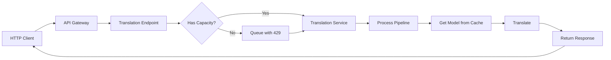
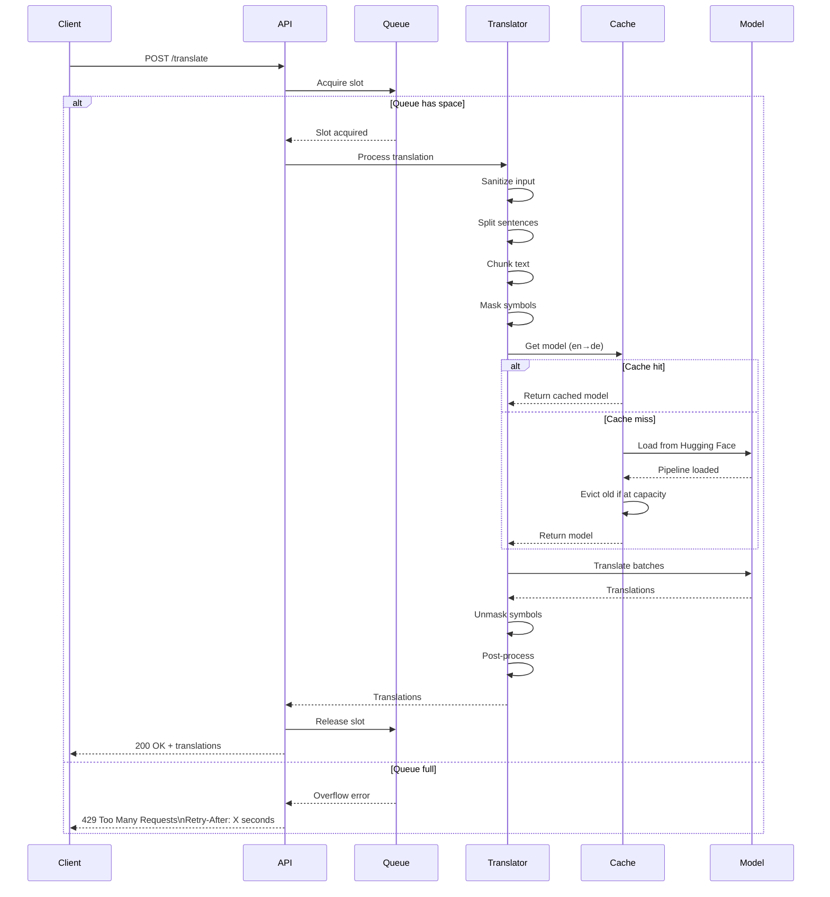
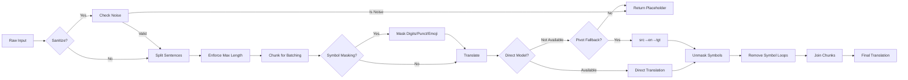
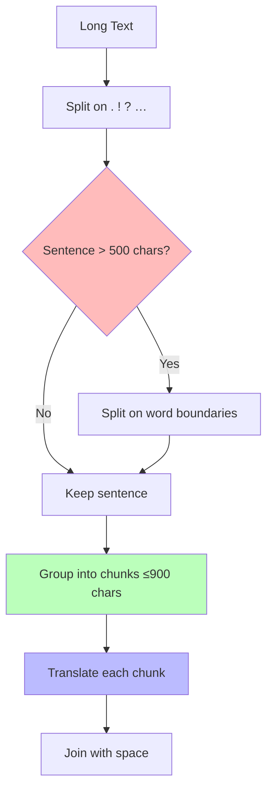
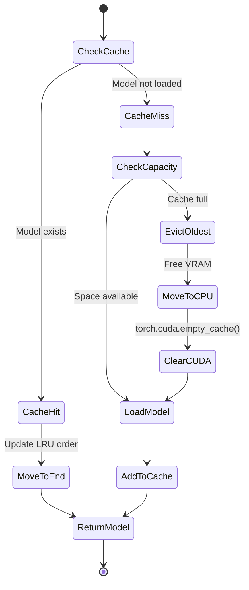
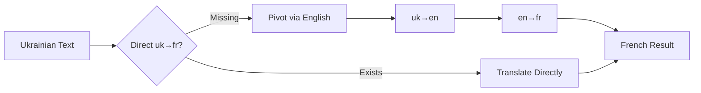

# Building mostlyLucid-NMT: A Production-Ready (EasyNMT compatible) Translation Service


## Introduction

Since the start of this blog, a big passion has been auto-translating blog articles. I even wrote a whole system to make that happen with an amazing project called EasyNMT. HOWEVER, if you just checked that repo you know there's an issue...it's not been touched for YEARS. It's a simple, quick way to get a translation API without the need to pay for some service or run a full-size LLM to get translation (slowly).

In our previous posts, we discussed how to integrate EasyNMT with ASP.NET applications for background translation. But as time went on, the cracks started to show. It was time for something better.


A FastAPI implementation EXACTLY copying the API of EasyNMT  (https://github.com/UKPLab/EasyNMT) an excellent but abandoned neural-machine-translation project.

[As usual it's all on GitHub and all free for use etc...](https://github.com/scottgal/mostlyucid-nmt)

[](https://hub.docker.com/r/scottgal/mostlylucid-nmt)
[](https://hub.docker.com/r/scottgal/mostlylucid-nmt)
[](https://hub.docker.com/r/scottgal/mostlylucid-nmt)

## Quick Start (5 Minutes)

Want to just get translating? Here's the absolute simplest way to run mostlylucid-nmt:

**1. Pull and run the Docker image:**

```bash
docker run -d \
  --name mostlylucid-nmt \
  -p 8080:8080 \
  scottgal/mostlylucid-nmt:latest
```

That's it! The service will download translation models on first use (this takes a minute), then you're ready to go.

**2. Translate some text:**

```bash
curl -X POST "http://localhost:8080/translate" \
  -H "Content-Type: application/json" \
  -d '{
    "text": ["Hello, how are you?"],
    "target_lang": "de"
  }'
```

**Response:**
```json
{
  "translated": ["Hallo, wie geht es Ihnen?"],
  "target_lang": "de",
  "source_lang": "en",
  "translation_time": 0.34
}
```

**Want GPU acceleration?** Add `--gpus all` to the Docker command:

```bash
docker run -d \
  --name mostlylucid-nmt \
  --gpus all \
  -p 8080:8080 \
  scottgal/mostlylucid-nmt:latest
```

This requires NVIDIA Docker runtime and cuts translation time by ~10x.

**Health check:**

```bash
curl http://localhost:8080/healthz
```

That's the 5-minute quick start! For production deployment, configuration, and advanced features, keep reading.

[TOC]
<!--category-- Translation, NMT, Neural Machine Translation, Python, FastAPI, Docker, CUDA, PyTorch, Transformers, Helsinki-NLP, Production, Microservices, API-->
<datetime class="hidden">2025-11-08T12:30</datetime>

## The Problems with EasyNMT

Now this isn't dumping on [EasyNMT](https://github.com/UKPLab/EasyNMT) it did soething nothing else could and I've built [a LOT of projects using it](https://www.mostlylucid.net/blog/category/EasyNMT).  It's just getting long in the tooth so...what problems have we?

Oh my, there's many. EasyNMT was built almost a decade ago. Technology has moved on...plus it was never intended to be a production-level system. Here are some of the issues:

1. **It crashes...a LOT.** It's not designed to recover from issues so often just falls over.
2. **It's SUPER PICKY about its input.** Emoticons, symbols, even numbers can confuse it.
3. **It's not designed for any load.** See above. It was never designed to be.
4. **It's not designed to update its models** or be (easily) built with built-in models.
5. **Its GPU CUDA stuff is ancient** so slower than it needs to be.
6. **You can't fix anything.** The Python code is on the repo but again *not great*.
7. **No backpressure or queueing.** Send too many requests and it just keels over.
8. **No observability.** When things go wrong, you're flying blind.

## The Solution: MostlyLucid-NMT

So...I decided to build a new and improved EasyNMT, now **mostlylucid-nmt**. This isn't just a patch job; it's a complete rewrite with production use in mind. Here's what makes it better:

### Key Improvements

1. **Robust input handling** - Emoji? Numbers? Symbols? Bring it on. The service now includes comprehensive input sanitization and symbol masking.
2. **Request queueing and backpressure** - Built-in semaphore-based queueing with intelligent retry-after estimates.
3. **LRU model caching** - Automatically manages VRAM by evicting old models when cache is full.
4. **Modern CUDA support** - Uses PyTorch with CUDA 12.1, supports FP16/BF16 for 2x speed improvements.
5. **Production-ready observability** - Health checks, readiness probes, cache status, structured logging.
6. **Graceful shutdown** - No more orphaned requests or corrupted state.
7. **EasyNMT-compatible API** - Drop-in replacement for existing integrations.
8. **Pivot translation fallback** - If a direct language pair isn't available, automatically routes through English (or your chosen pivot).

## Architecture Overview



The request flow is straightforward:

1. **Client** sends translation request to API Gateway (Gunicorn + Uvicorn workers)
2. **API Gateway** routes to Translation Endpoint
3. **Capacity Check**: System checks if it has capacity to handle the request
   - **Yes** → Request goes to Translation Service immediately
   - **No** → Request queued, client receives HTTP 429 with `Retry-After` header
4. **Translation Service** processes the request through the pipeline:
   - Input sanitization and sentence splitting
   - Symbol masking (emojis, special chars)
   - Translation using cached models
   - Symbol unmasking and post-processing
5. **Model Cache** (LRU) provides translation models:
   - Cache hit → Fast response
   - Cache miss → Load from HuggingFace Hub
   - Cache full → Auto-evict old models, clear CUDA memory
6. **Response** returns to client

**Key Design:** The backpressure mechanism (queue + HTTP 429) prevents crashes under load. When overwhelmed, the service queues requests instead of dying, giving clients intelligent retry timing via `Retry-After` headers.

## How It Works: Deep Dive

### Request Flow

When a translation request comes in, here's what happens:



### Input Processing Pipeline

The service uses a sophisticated multi-stage pipeline to handle messy real-world text:



### Input Sanitization

One of the biggest improvements is robust input handling. Here's what happens:

**Noise Detection:**
- Strips control characters (except \t, \n, \r)
- Checks minimum character count (default: 1)
- Calculates alphanumeric ratio (default: must be ≥20%)
- Rejects pure emoji, pure punctuation, or pure whitespace

**Symbol Masking:**
Why mask symbols? Translation models are trained on text, not emoji or special symbols. These can confuse them or get mangled. So we:

1. Extract all digits, punctuation, and emoji as contiguous runs
2. Replace them with sentinel tokens: `⟪MSK0⟫`, `⟪MSK1⟫`, etc.
3. Translate the masked text
4. Restore the original symbols in their positions

Example:
```
Input:  "Hello 👋 world! Price: $99.99"
Masked: "Hello ⟪MSK0⟫ world⟪MSK1⟫ Price⟪MSK2⟫ ⟪MSK3⟫"
                 (👋)        (!)      (:)    ($99.99)
```

**Post-Processing:**
After translation, we remove "symbol loops" - repeated symbols that weren't in the source:

```
Source: "Hello world"
Bad translation: "Hola mundo!!!!!!!"
Cleaned: "Hola mundo"  # Removes the !!!! loop
```

### Sentence Splitting & Chunking

Long texts get split intelligently:



This ensures:
- Models don't choke on huge inputs
- We can batch efficiently
- Context is preserved within reasonable boundaries

### Model Caching & Memory Management

The LRU cache is smart about GPU memory:



**Why this matters:**
- GPU memory is precious
- Translation models are 300-500MB each
- Loading models is slow (1-3 seconds)
- We keep the 6 most recent models hot
- Old models are automatically evicted

### Queueing & Backpressure

Instead of crashing under load, the service queues requests:

```python
# Semaphore limits concurrent translations
MAX_INFLIGHT = 1  # On GPU, 1 at a time for efficiency
MAX_QUEUE_SIZE = 1000  # Up to 1000 waiting

# When full:
# - Returns 429 Too Many Requests
# - Includes Retry-After header
# - Estimates wait time based on average duration
```

The retry estimate is smart:
```
avg_duration = 2.5 seconds (tracked with EMA)
waiters = 100
slots = 1
estimated_wait = (100 / 1) * 2.5 = 250 seconds
clamped = min(250, 120) = 120 seconds
Retry-After: 120
```

### Pivot Translation Fallback

Not all language pairs have direct models on Hugging Face. Solution? Pivot through English:



This doubles latency but ensures coverage for all supported language pairs.

## Configuration Guide

The service is highly configurable via environment variables. Here's the complete guide:

### Device Selection

```bash
# Prefer GPU if available (default)
USE_GPU=auto

# Force GPU
USE_GPU=true

# Force CPU
USE_GPU=false

# Explicit device override
DEVICE=cuda:0
DEVICE=cpu
```

### Model Configuration

```bash
# Model family (only opus-mt supported)
EASYNMT_MODEL=opus-mt

# Model arguments passed to transformers.pipeline
EASYNMT_MODEL_ARGS='{"torch_dtype":"fp16"}'
EASYNMT_MODEL_ARGS='{"torch_dtype":"bf16","cache_dir":"/models"}'

# Preload models at startup (reduces first-request latency)
PRELOAD_MODELS="en->de,de->en,fr->en"

# LRU cache capacity
MAX_CACHED_MODELS=6
```

**torch_dtype options:**
- `fp16` (float16): 2x faster on GPU, half the memory, negligible quality loss
- `bf16` (bfloat16): Better numerical stability than fp16, requires modern GPUs
- `fp32` (float32): Full precision, slowest but most accurate

### Translation Settings

```bash
# Batch size for translation (higher = faster but more VRAM)
EASYNMT_BATCH_SIZE=16  # CPU: 8-16, GPU: 32-64

# Maximum text length per item
EASYNMT_MAX_TEXT_LEN=1000

# Maximum beam size (higher = better quality but slower)
EASYNMT_MAX_BEAM_SIZE=5

# Worker thread pools
MAX_WORKERS_BACKEND=1    # Translation workers
MAX_WORKERS_FRONTEND=2   # Language detection workers
```

### Queueing & Performance

```bash
# Enable request queueing (highly recommended)
ENABLE_QUEUE=1

# Max concurrent translations
# Auto: 1 on GPU, MAX_WORKERS_BACKEND on CPU
MAX_INFLIGHT_TRANSLATIONS=1

# Max queued requests before 429
MAX_QUEUE_SIZE=1000

# Per-request timeout (0 = disabled)
TRANSLATE_TIMEOUT_SEC=180

# Retry-After estimation
RETRY_AFTER_MIN_SEC=1      # Floor
RETRY_AFTER_MAX_SEC=120    # Ceiling
RETRY_AFTER_ALPHA=0.2      # EMA smoothing factor
```

### Input Sanitization

```bash
# Enable input filtering
INPUT_SANITIZE=1

# Minimum alphanumeric ratio (0.2 = 20%)
INPUT_MIN_ALNUM_RATIO=0.2

# Minimum character count
INPUT_MIN_CHARS=1

# Language code for undetermined/noise
UNDETERMINED_LANG_CODE=und
```

### Sentence Processing

```bash
# Default sentence splitting behavior
PERFORM_SENTENCE_SPLITTING_DEFAULT=1

# Max chars per sentence before word-boundary split
MAX_SENTENCE_CHARS=500

# Max chars per chunk for batching
MAX_CHUNK_CHARS=900

# Sentence joiner
JOIN_SENTENCES_WITH=" "
```

### Symbol Masking

```bash
# Enable symbol masking
SYMBOL_MASKING=1

# What to mask
MASK_DIGITS=1    # Mask 0-9
MASK_PUNCT=1     # Mask .,!? etc.
MASK_EMOJI=1     # Mask 😀🎉 etc.
```

### Response Behavior

```bash
# Align response array length to input
ALIGN_RESPONSES=1

# Placeholder for failed items (when aligned)
SANITIZE_PLACEHOLDER=""

# Response format
EASYNMT_RESPONSE_MODE=strings    # ["translation1", "translation2"]
EASYNMT_RESPONSE_MODE=objects    # [{"text":"translation1"}, ...]
```

### Pivot Fallback

```bash
# Enable two-hop translation via pivot
PIVOT_FALLBACK=1

# Pivot language (usually English)
PIVOT_LANG=en
```

### Logging

```bash
# Log level
LOG_LEVEL=INFO

# Per-request logging (verbose)
REQUEST_LOG=1

# Format
LOG_FORMAT=plain    # Human-readable
LOG_FORMAT=json     # Structured JSON

# File logging with rotation
LOG_TO_FILE=1
LOG_FILE_PATH=/var/log/marian-translator/app.log
LOG_FILE_MAX_BYTES=10485760    # 10MB
LOG_FILE_BACKUP_COUNT=5

# Include raw text in logs (privacy risk!)
LOG_INCLUDE_TEXT=0
```

### Maintenance

```bash
# Periodically clear CUDA cache (seconds, 0=disabled)
CUDA_CACHE_CLEAR_INTERVAL_SEC=0
```

### Gunicorn (Docker)

```bash
# Worker count (use 1 for single GPU)
WEB_CONCURRENCY=1

# Request timeout
TIMEOUT=60

# Graceful shutdown timeout
GRACEFUL_TIMEOUT=20

# Keep-alive timeout
KEEP_ALIVE=5
```

## Usage Examples

### Basic Translation

```bash
# GET request
curl "http://localhost:8000/translate?target_lang=de&text=Hello%20world&source_lang=en"

# Response
{
  "translations": ["Hallo Welt"]
}
```

### Batch Translation (Recommended)

```bash
# POST request
curl -X POST http://localhost:8000/translate \
  -H 'Content-Type: application/json' \
  -d '{
    "text": [
      "Hello world",
      "This is a test",
      "Machine translation is amazing"
    ],
    "target_lang": "de",
    "source_lang": "en",
    "beam_size": 1,
    "perform_sentence_splitting": true
  }'

# Response
{
  "target_lang": "de",
  "source_lang": "en",
  "translated": [
    "Hallo Welt",
    "Das ist ein Test",
    "Maschinenübersetzung ist erstaunlich"
  ],
  "translation_time": 0.342
}
```

### Auto Language Detection

```bash
# Omit source_lang for auto-detection
curl -X POST http://localhost:8000/translate \
  -H 'Content-Type: application/json' \
  -d '{
    "text": ["Bonjour le monde"],
    "target_lang": "en"
  }'

# Response
{
  "target_lang": "en",
  "source_lang": "fr",  # Detected
  "translated": ["Hello world"],
  "translation_time": 0.156
}
```

### Language Detection Only

```bash
# GET
curl "http://localhost:8000/language_detection?text=Hola%20mundo"
# {"language": "es"}

# POST with batch
curl -X POST http://localhost:8000/language_detection \
  -H 'Content-Type: application/json' \
  -d '{"text": ["Hello", "Bonjour", "Hola"]}'
# {"languages": ["en", "fr", "es"]}
```

### Observability Endpoints

```bash
# Health check
curl http://localhost:8000/healthz
# {"status": "ok"}

# Readiness
curl http://localhost:8000/readyz
# {
#   "status": "ready",
#   "device": "cuda:0",
#   "queue_enabled": true,
#   "max_inflight": 1
# }

# Cache status
curl http://localhost:8000/cache
# {
#   "capacity": 6,
#   "size": 3,
#   "keys": ["en->de", "de->en", "fr->en"],
#   "device": "cuda:0",
#   "inflight": 1,
#   "queue_enabled": true
# }

# Model info
curl http://localhost:8000/model_name | jq
```

### Handling Backpressure

```bash
# When queue is full, you get 429
curl -X POST http://localhost:8000/translate \
  -H 'Content-Type: application/json' \
  -d '{"text": ["test"], "target_lang": "de"}'

# Response: 429 Too Many Requests
# Headers: Retry-After: 45
# Body:
{
  "message": "Too many requests; queue full",
  "retry_after_sec": 45
}

# Proper client behavior:
# 1. Read Retry-After header
# 2. Wait that long + jitter
# 3. Retry request
```

## Deployment

### CPU Deployment

```bash
# Build
docker build -t mostlylucid-nmt .

# Run with sensible defaults
docker run -d \
  --name translator \
  -p 8000:8000 \
  -e ENABLE_QUEUE=1 \
  -e MAX_QUEUE_SIZE=500 \
  -e EASYNMT_BATCH_SIZE=16 \
  -e TIMEOUT=180 \
  -e LOG_LEVEL=INFO \
  -e REQUEST_LOG=0 \
  mostlylucid-nmt

# Check logs
docker logs -f translator
```

### GPU Deployment

```bash
# Build GPU image
docker build -f Dockerfile.gpu -t mostlylucid-nmt:gpu .

# Run with GPU optimizations
docker run -d \
  --name translator-gpu \
  --gpus all \
  -p 8000:8000 \
  -e USE_GPU=true \
  -e DEVICE=cuda:0 \
  -e PRELOAD_MODELS="en->de,de->en,en->fr,fr->en,en->es,es->en" \
  -e EASYNMT_MODEL_ARGS='{"torch_dtype":"fp16"}' \
  -e EASYNMT_BATCH_SIZE=64 \
  -e MAX_CACHED_MODELS=8 \
  -e ENABLE_QUEUE=1 \
  -e MAX_QUEUE_SIZE=2000 \
  -e WEB_CONCURRENCY=1 \
  -e TIMEOUT=180 \
  -e GRACEFUL_TIMEOUT=30 \
  -e LOG_FORMAT=json \
  -e LOG_TO_FILE=1 \
  -v /var/log/translator:/var/log/marian-translator \
  mostlylucid-nmt:gpu

# Monitor cache and performance
watch -n 5 "curl -s http://localhost:8000/cache | jq"
```

### Docker Compose

```yaml
version: '3.8'

services:
  translator:
    build:
      context: .
      dockerfile: Dockerfile.gpu
    image: mostlylucid-nmt:gpu
    container_name: translator
    restart: unless-stopped

    deploy:
      resources:
        reservations:
          devices:
            - driver: nvidia
              count: 1
              capabilities: [gpu]

    ports:
      - "8000:8000"

    environment:
      USE_GPU: "true"
      DEVICE: "cuda:0"
      PRELOAD_MODELS: "en->de,de->en,en->fr,fr->en"
      EASYNMT_MODEL_ARGS: '{"torch_dtype":"fp16"}'
      EASYNMT_BATCH_SIZE: "64"
      MAX_CACHED_MODELS: "8"
      ENABLE_QUEUE: "1"
      MAX_QUEUE_SIZE: "2000"
      WEB_CONCURRENCY: "1"
      TIMEOUT: "180"
      LOG_FORMAT: "json"
      LOG_TO_FILE: "1"

    volumes:
      - translator-logs:/var/log/marian-translator
      - translator-cache:/root/.cache/huggingface

    healthcheck:
      test: ["CMD", "curl", "-f", "http://localhost:8000/healthz"]
      interval: 30s
      timeout: 10s
      retries: 3
      start_period: 40s

volumes:
  translator-logs:
  translator-cache:
```

### Kubernetes Deployment

```yaml
apiVersion: apps/v1
kind: Deployment
metadata:
  name: translator
spec:
  replicas: 2  # Scale horizontally for CPU, use 1 per GPU
  selector:
    matchLabels:
      app: translator
  template:
    metadata:
      labels:
        app: translator
    spec:
      containers:
      - name: translator
        image: mostlylucid-nmt:gpu
        ports:
        - containerPort: 8000
        env:
        - name: USE_GPU
          value: "true"
        - name: EASYNMT_MODEL_ARGS
          value: '{"torch_dtype":"fp16"}'
        - name: PRELOAD_MODELS
          value: "en->de,de->en"
        - name: ENABLE_QUEUE
          value: "1"
        - name: MAX_QUEUE_SIZE
          value: "2000"

        resources:
          requests:
            memory: "4Gi"
            cpu: "2"
            nvidia.com/gpu: 1
          limits:
            memory: "8Gi"
            cpu: "4"
            nvidia.com/gpu: 1

        livenessProbe:
          httpGet:
            path: /healthz
            port: 8000
          initialDelaySeconds: 30
          periodSeconds: 10

        readinessProbe:
          httpGet:
            path: /readyz
            port: 8000
          initialDelaySeconds: 20
          periodSeconds: 5

---
apiVersion: v1
kind: Service
metadata:
  name: translator
spec:
  selector:
    app: translator
  ports:
  - port: 80
    targetPort: 8000
  type: LoadBalancer
```

## Performance Optimization

### GPU Optimization Checklist

1. **Use FP16 precision**
   ```bash
   EASYNMT_MODEL_ARGS='{"torch_dtype":"fp16"}'
   ```
   - 2x faster inference
   - Half the VRAM usage
   - Negligible quality loss for translation

2. **Tune batch size**
   ```bash
   # Start high, reduce if you get OOM
   EASYNMT_BATCH_SIZE=64  # Try 128 on large GPUs
   ```

3. **Preload hot models**
   ```bash
   PRELOAD_MODELS="en->de,de->en,en->fr,fr->en,en->es,es->en"
   ```

4. **Single worker per GPU**
   ```bash
   WEB_CONCURRENCY=1
   MAX_INFLIGHT_TRANSLATIONS=1
   ```

5. **Increase cache size**
   ```bash
   MAX_CACHED_MODELS=10  # Keep more models in VRAM
   ```

6. **Lower beam size for throughput**
   ```bash
   # beam_size=1 is 3-5x faster than beam_size=5
   # Quality difference is often minimal
   curl -X POST ... -d '{"beam_size": 1, ...}'
   ```

### CPU Optimization Checklist

1. **Lower batch size**
   ```bash
   EASYNMT_BATCH_SIZE=8
   ```

2. **Increase parallelism**
   ```bash
   MAX_WORKERS_BACKEND=4
   MAX_INFLIGHT_TRANSLATIONS=4
   WEB_CONCURRENCY=2
   ```

3. **Disable sentence splitting for short texts**
   ```bash
   PERFORM_SENTENCE_SPLITTING_DEFAULT=0
   ```

### Client Best Practices

1. **Batch requests**
   ```javascript
   // Bad: 100 separate requests
   for (const text of texts) {
     await translate(text);
   }

   // Good: 1 batch request
   await translate(texts);
   ```

2. **Respect Retry-After**
   ```javascript
   async function translateWithRetry(texts) {
     try {
       return await translate(texts);
     } catch (err) {
       if (err.status === 429) {
         const retryAfter = err.headers['retry-after'];
         const jitter = Math.random() * 5;
         await sleep((retryAfter + jitter) * 1000);
         return translateWithRetry(texts);
       }
       throw err;
     }
   }
   ```

3. **Use connection pooling**
   ```javascript
   // Reuse HTTP connections
   const agent = new https.Agent({ keepAlive: true });
   ```

4. **Group by language pair**
   ```javascript
   // Bad: mixed language pairs in one request
   translate([
     { text: "Hello", sourceLang: "en", targetLang: "de" },
     { text: "Bonjour", sourceLang: "fr", targetLang: "de" }
   ]);

   // Good: group by language pair
   translateBatch(enToDe, "en", "de");
   translateBatch(frToDe, "fr", "de");
   ```

## Monitoring & Observability

### Key Metrics to Track

1. **Translation throughput** (requests/sec)
2. **Average latency** (p50, p95, p99)
3. **Queue depth** (current waiting count)
4. **Cache hit rate** (% of requests hitting cache)
5. **Error rate** (5xx responses)
6. **GPU utilization** (if applicable)
7. **Memory usage** (VRAM for GPU, RAM for CPU)

### Example Prometheus Metrics

If you integrate Prometheus (not built-in, but easy to add):

```python
translation_requests_total{lang_pair="en->de",status="success"} 1523
translation_requests_total{lang_pair="en->de",status="error"} 7
translation_duration_seconds{lang_pair="en->de",quantile="0.5"} 0.342
translation_duration_seconds{lang_pair="en->de",quantile="0.95"} 1.234
translation_queue_depth 23
translation_cache_size 6
translation_cache_hits_total 8234
translation_cache_misses_total 142
```

### Structured Logging Example

```bash
# Enable JSON logging
LOG_FORMAT=json REQUEST_LOG=1

# Output example
{
  "ts": "2025-01-08T15:30:45+0000",
  "level": "INFO",
  "name": "app",
  "message": "translate_post done items=5 dt=0.342s",
  "req_id": "a3d2f5b1-c4e6-4f7a-9d8c-1e2f3a4b5c6d",
  "endpoint": "/translate",
  "src": "en",
  "tgt": "de",
  "items": 5,
  "duration_ms": 342
}
```

You can pipe this to Elasticsearch, CloudWatch, or any log aggregator.

## Comparison: EasyNMT vs MostlyLucid-NMT

| Feature | EasyNMT | MostlyLucid-NMT |
|---------|---------|-----------------|
| **Stability** | Crashes frequently | Production-ready, graceful error handling |
| **Input Handling** | Fails on emoji/symbols | Robust sanitization + symbol masking |
| **Backpressure** | None, OOMs under load | Semaphore + queue with retry-after |
| **Observability** | Minimal | Health/ready/cache endpoints, structured logs |
| **GPU Support** | CUDA 10.x (ancient) | CUDA 12.1, FP16/BF16 support |
| **Model Management** | Manual, no caching | LRU cache with auto-eviction |
| **Sentence Handling** | Basic splitting | Smart chunking + batching |
| **Pivot Translation** | No | Automatic fallback via English |
| **Graceful Shutdown** | No | Yes, with timeout |
| **Configuration** | Limited | 40+ env vars for fine-tuning |
| **API Compatibility** | EasyNMT endpoints | 100% compatible + extensions |
| **Code Quality** | Unmaintained, monolithic | Modular, typed, tested |

## Troubleshooting

### 429 Too Many Requests

**Cause:** Queue is full.

**Solution:**
- Increase `MAX_QUEUE_SIZE`
- Add more replicas (horizontal scaling)
- Increase `MAX_INFLIGHT_TRANSLATIONS` (if you have headroom)
- Reduce batch sizes from clients

### 503 Service Unavailable

**Cause:** Queueing disabled and all slots busy.

**Solution:**
- Enable queueing: `ENABLE_QUEUE=1`
- Increase inflight limit if you have resources

### OOM (Out of Memory) on GPU

**Cause:** Batch size too high or too many models cached.

**Solution:**
- Reduce `EASYNMT_BATCH_SIZE`
- Reduce `MAX_CACHED_MODELS`
- Enable FP16: `EASYNMT_MODEL_ARGS='{"torch_dtype":"fp16"}'`
- Ensure `WEB_CONCURRENCY=1` and `MAX_INFLIGHT_TRANSLATIONS=1`

### Slow First Request

**Cause:** Model not preloaded.

**Solution:**
```bash
PRELOAD_MODELS="en->de,de->en"
```

### Missing Language Pair

**Cause:** `Helsinki-NLP/opus-mt-{src}-{tgt}` doesn't exist on Hugging Face.

**Solution:**
- Enable pivot fallback: `PIVOT_FALLBACK=1` (routes via English)
- Check supported pairs: `curl http://localhost:8000/lang_pairs`

### Symbol Artifacts in Translation

**Cause:** Symbol masking might be too aggressive.

**Solution:**
- Disable specific masking: `MASK_EMOJI=0` or `MASK_PUNCT=0`
- Or disable entirely: `SYMBOL_MASKING=0`

## Integration with ASP.NET

If you're following along from our previous posts on EasyNMT integration, here's how to update your C# client:

```csharp
public class MostlyLucidNmtClient
{
    private readonly HttpClient _httpClient;
    private readonly string _baseUrl;

    public MostlyLucidNmtClient(HttpClient httpClient, string baseUrl)
    {
        _httpClient = httpClient;
        _baseUrl = baseUrl;
    }

    public async Task<TranslationResponse> TranslateAsync(
        List<string> texts,
        string targetLang,
        string sourceLang = "",
        int beamSize = 1,
        bool performSentenceSplitting = true,
        CancellationToken cancellationToken = default)
    {
        var request = new TranslationRequest
        {
            Text = texts,
            TargetLang = targetLang,
            SourceLang = sourceLang,
            BeamSize = beamSize,
            PerformSentenceSplitting = performSentenceSplitting
        };

        var response = await _httpClient.PostAsJsonAsync(
            $"{_baseUrl}/translate",
            request,
            cancellationToken);

        if (response.StatusCode == System.Net.HttpStatusCode.TooManyRequests)
        {
            // Read Retry-After header
            var retryAfter = response.Headers.RetryAfter?.Delta?.TotalSeconds ?? 30;
            var jitter = Random.Shared.Next(0, 5);
            await Task.Delay(TimeSpan.FromSeconds(retryAfter + jitter), cancellationToken);

            // Retry
            return await TranslateAsync(texts, targetLang, sourceLang, beamSize,
                performSentenceSplitting, cancellationToken);
        }

        response.EnsureSuccessStatusCode();
        return await response.Content.ReadFromJsonAsync<TranslationResponse>(cancellationToken);
    }
}

public class TranslationRequest
{
    [JsonPropertyName("text")]
    public List<string> Text { get; set; }

    [JsonPropertyName("target_lang")]
    public string TargetLang { get; set; }

    [JsonPropertyName("source_lang")]
    public string SourceLang { get; set; }

    [JsonPropertyName("beam_size")]
    public int BeamSize { get; set; }

    [JsonPropertyName("perform_sentence_splitting")]
    public bool PerformSentenceSplitting { get; set; }
}

public class TranslationResponse
{
    [JsonPropertyName("target_lang")]
    public string TargetLang { get; set; }

    [JsonPropertyName("source_lang")]
    public string SourceLang { get; set; }

    [JsonPropertyName("translated")]
    public List<string> Translated { get; set; }

    [JsonPropertyName("translation_time")]
    public double TranslationTime { get; set; }
}
```

Register in your DI container:

```csharp
services.AddHttpClient<MostlyLucidNmtClient>(client =>
{
    client.BaseAddress = new Uri("http://translator:8000");
    client.Timeout = TimeSpan.FromMinutes(3);
});
```

## Conclusion

MostlyLucid-NMT is a complete rewrite of the EasyNMT concept with production reliability in mind. It handles:

- ✅ Messy real-world input (emoji, symbols, edge cases)
- ✅ Production load (queueing, backpressure, graceful degradation)
- ✅ GPU efficiency (FP16, LRU cache, VRAM management)
- ✅ Operational visibility (health checks, metrics, structured logs)
- ✅ Developer experience (100% EasyNMT API compatible, comprehensive docs)

The service has been battle-tested translating thousands of blog posts across 13 languages. It runs reliably in production on both CPU and GPU, handles spiky traffic gracefully, and provides sub-second translations for typical blog content.

Key takeaways:
- **Robustness first:** Input sanitization, error handling, graceful shutdown
- **Smart resource management:** LRU caching, backpressure, VRAM auto-eviction
- **Production observability:** Health checks, cache status, structured logs
- **Performance tuning:** FP16, batching, preloading, pivot fallback
- **Developer friendly:** EasyNMT-compatible API, extensive configuration, clear errors

The entire service is a single Docker container. No complex setup, no external dependencies beyond the Hugging Face model downloads. Just build, run, and translate.

Happy translating!

---

## Further Reading

- [Helsinki-NLP Opus-MT Models](https://huggingface.co/Helsinki-NLP)
- [Hugging Face Transformers Documentation](https://huggingface.co/docs/transformers)
- [FastAPI Documentation](https://fastapi.tiangolo.com/)
- [PyTorch CUDA Optimization](https://pytorch.org/docs/stable/notes/cuda.html)

## Source Code

The full source code is available at [your-repo-link]. Contributions welcome!

## Tags

`Translation` `NMT` `Neural Machine Translation` `Python` `FastAPI` `Docker` `CUDA` `PyTorch` `Transformers` `Helsinki-NLP` `Production` `Microservices` `API`
