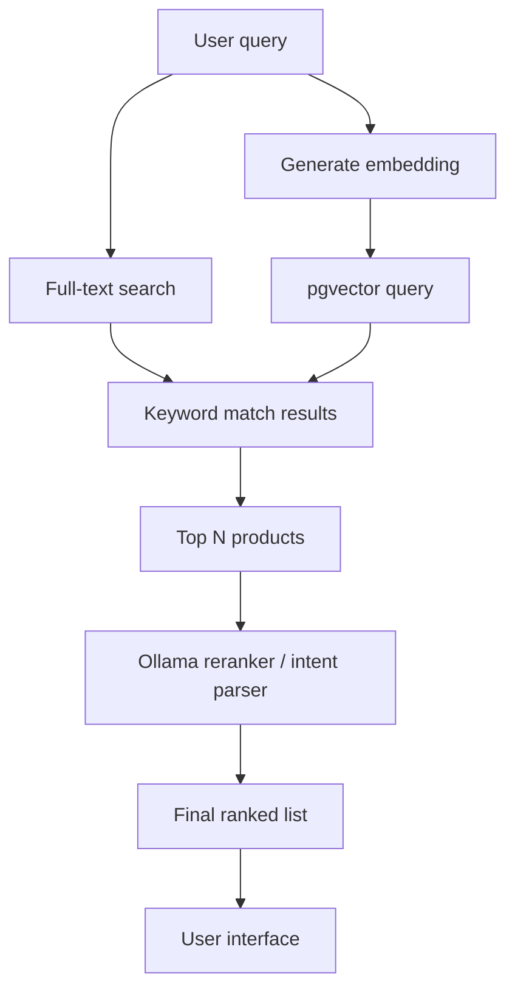

# New Project: mostlylucid Store kick off

# Introduction
One things I've wound up building likely well over a dozen times over my career has been ecommerce sites. 
However, it was never ME defining the feature set. I wrote the code, built the DB and all the features but others were telling me what they wanted (well they WERE paying after all!). For my next play project I wanted to do a few things:

1. Design and build a user-centric ECommerce site. So thinking about things like reducing friction for a purchase (read as few clicks as possible), making it easier to find stuff, better recommendations etc...etc...
2. Use ML where approperiate to improve the experience for my (theoretical) vendors on stuff like imports (a major PITA in most ecommerce sites). Using technlogies like embedding, Vector Search etc.
3. Make it self-hostable; so no need to run up massive Azure / AWS bills...this should all work with a Docker-Compose (or k8s if you're keen). 
4. Do it in public...so this won't be some site I build then write about it at the end. Like this blog I'll go through each part and write about it as I do it. What decisions I make, WHY I make certain decisions etc...
5. Play with ML...I've not had a chance to play much with it in project yet (whispers; MOST sites just bolt on an LLM chatbot / pay somewthing like a Segmenting service etc...). So I'll go through it in detail.
6. GIS - I MIGHT add this; this is more important for mixed-commerce where there's a physical store / locations as well as online sales. From simple things like postage, through more complex topics like tax.
7. API - Again the main site will likely be my usual HTMX with ASP.NET Core, it's simple and efficient. However to enable external use we need to work out a cogent API to both fetch products, interact with WebHooks (like payment providers) etc...
8. Queues - this will come later, but in most sites like this theres' a need to process things 'offline' you can get a lot of the way there with IHostedServices in ASP.NET Core but eventually we'll probably want a queue and to host them seperately (especially if it's CPU / GPU intensive and we want to place limits on this service to now slow down the site)
8. Payment Providers. There's a bunch we could consider but I'll likely just make it simple and integrate some pre-rolled ones  like Stripe & Google Pay (not that I have anything to sell for REALS). 
9. Communications - so sending a confirmation email, SMS, maybe integrating with Slack, marketing etc
10. Reporting - again one of the hidden features in an ecommerce site, displaying data about sales, optimising categories etc...rely on data for reporting.

[TOC]

# Q&A
- Why not just use segment.io / Shopify etc...
  This is a play project, I don't expect it to ever compete with all the features any of these provide. It's for ME MAINLY to play with this functionality. As a freelancer keeping my skills honed is super critical for you know...food & stuff. 
- Why use .NET isn't Rust / Go etc...faster?
  Well, because I want to BUT no Rust / Go aren't appreciably faster nowadays. In performance critical code yes they shave off a bunch of memeory an da few nanoseconds per operation but that really rarely the constraint. How fast, how safe and how much the dev who'll work on it costs are all REAL concerns.
- Why not start with React / Angular / Blazor etc...
  Well because I don't want to and here's the scoop...for the most part USERS DON'T CARE. They just want functionality, for it to be super fast and deliver features.

# Plan
This will be a lengthy project, so as with all projects I need to work out a few elements. 

For me there's on main thing I want in an ecommerce 'the stuff I want is easy to find'. This is actually a pretty complex and critical task in ecommerce. Mess it up you'll see few sales. 

 So how do we make Search / Category Listing better?

## Search
In an 'ideal world' search has many possible stages. Again this is only user focused; so it doesn't include promotion items etc...

Again the aim of this is to present the customer with the thing they actually want to buy as quickly as possible ('fewest clicks between landing and purchase'). 

Here we allow the query to be essentially ANYTHING then use multiple search strategies to find what that actually matches to in out backend.

The left hand branch here is pretty straightforward, it's how you expect a 'full text search' to work, but it relies on the search terms being pretty close to the query 'blue basket' rather than 'a whicker container close to the colour of the sky at noon'. 

This usually relies on Full-text search from your DB (most relational DBs have this capability) or using a dedicated Search solution like Elastic / Open / Lucene.

## To Use a Search Engine or Just DB

# Starting

For any project this is the focus. How to start? What to do first. In this case I want to focus on two things to start with:
-  The data structure; this will change and evolve over time but basically; how do I store products.
  - Ecommerce sites can be a bit of a PITA with their category structures, disparate data, pricing etc...
  - This site will be 'search first' as well as have categories, segmenting etc...so this structure will evolve and adapt.
  - Should I use EF Core? This is always a question...it's handy to get the data structure but in the end it can wind up being a bit of a pain to manage (migration explosion). We shall see.

- The UI...so I'll need some sort of 'admin' interface and some sort of 'customer' interfaces. These may wind up being separate projects as they'll likely have very different requirements (auth, backend wil limport, may eventually have reports etc..etc...) 
- Hosting, again will evolve over time but I'll need a docker compose with at least
  - The Database, postgresql as it's free, fast and feature rich (I want vectors, will likely want some nice JSON etc..etc...)
  - OLLAMA - this will be my host for the ML featurs like embedding, image generation (for sample data and maybe for some 'alternate views' generation), maybe image-to-text etc...
  - EasyNMT - what I use in this site, it's not PERFECT but gives me the ability to generate a BUNCH of languages. I'll use this to translate user text and likely ASP.NET Core view text elements to give 'auto-multilingual'
  - ASP.NET Core - super simple, this will likely be three apps (admin. customer and sample data generator)
- Sample Data - often overlooked and undervalued. But this helps you work out some fundamental parts of your project. Good sample date *in sufficient quanntity* can help you avoid gotchas and plan appropriately. For instance any DB can handle a couple of dozen tntries but one you start scaling then stuff like indices, structures, efficiency become critical. 

# Implementation
So, let's get started. The exciting 'File->New Solution'. 
Now as we've seen above we're going the need to have a bunch of projects. Depending on how you develop, solo or team, you may choose to initially stay in a single project a solution or start splitting off immediately.

## Projects structure and definition
Now I have to admit; much of the time I don't explicitly follow DDD / TDD, in starting new projects for my own pleasure I tend to just do the simplest thing to get it working then work out the structure as I go. 

This is largely based on experience and wanting to work at a decent speed; so *organization*. My eventual projects will be named the same as <ProjectName>.<DirectoryName> in my starter project. 

So I typically wind up sites With multiple projects in a solution like <ProjectName>.<Services> or if one part of the app is getting reused across layers I define the boundaries which make sense. 

This way I can evolved the structure but keep the speed an simplicity of a Single project *as long as makes sense*. 

Then just start splitting out when it feels it makes more sense for things to be segmented; either it becomes a totally seperate hosted instance / function / adapter etc or just a large number of related services, view services, components etc. So...they MIGHT at some point evolve into their own app or it's just a lot easier to navigate...

Doing all this in advance (starting with multiple projects) is Still a bit of a guess and most developers have preferred structures which they find simplest to work with. 

In general I add testing as I come to it; again this in in search of the most efficient method *for me* YMMV and you may profer TDD where you define the structure in advance. 

As well as leading to fewer bugs making it out of dev and into test (well if your assumptions are correct) TDD becomes wonderfully self documenting and further approaches like BDD let this bleed even cleaner into Function Specification documents byt testing by behaviour.

It's ultimately about what your constraints, team structure (if any), release cycle (feature by feature, 'when it escpaes', fixed time infinite features, etc) again you may find different approaches which work for you.  

## Testing
So in line with this, each Project in the Solution would have a .Tests equivalent. These are generally a mix of Verify tests for integration and api unit testing, xunit for running and unit testing etc...You may even have Selenium tests to perform UAT etc.
I generally practice 'TWD' which as opposed to being 'Driven' or 'Later'   is writing tests as you develop at a time that makes sense (Test While Developing). You get a feel for when APIs / Views / Services are stabilized in a project so again for efficiency I tend to add tests then. 

Certainyl if you're releasing the code / others are depending on it you may choose a different approach that time. I generally use the 'No PR for Untested Code' and set up tests & Reports for coverage. Then for releases add stuff like Selenium / Load Testing etc..etc...

But again it's about being pragmatic. Even when working professionally Teams have different standards, some teams are obsessed with rapid iteration without much certainty so you may need to Test Later or getting to production as safely as possible; so TDD with other types of testing built in to the release cycle. ~~~~

