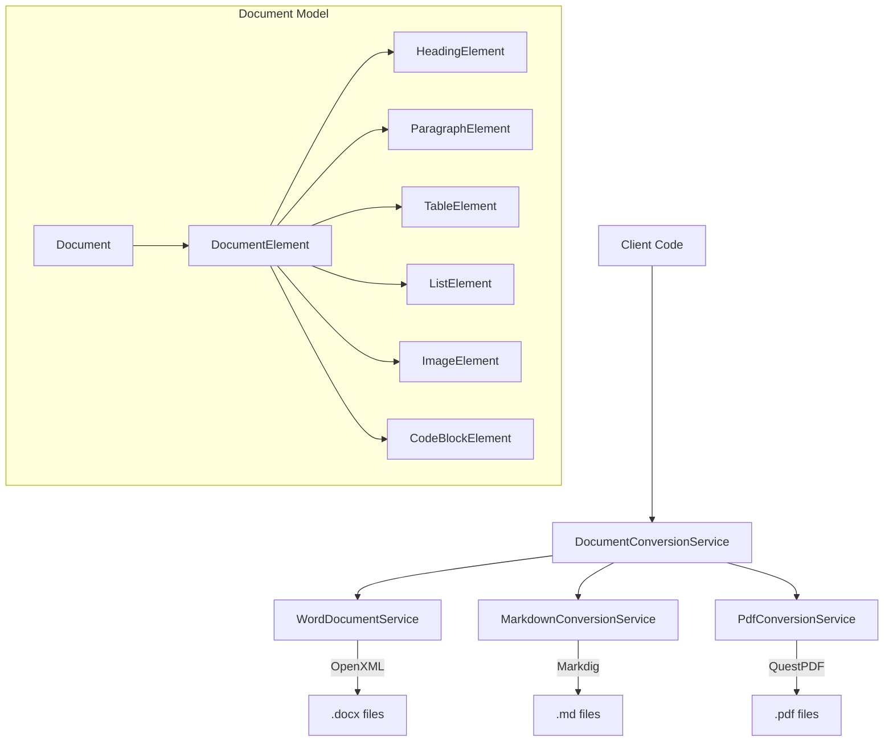

# Building a Multi-Format Document Conversion Service for .NET

## Introduction

Document conversion is a common requirement in many applications - from content management systems to report generators. Whether you need to convert Word documents to PDF, transform Markdown to Word, or extract content from various document formats, having a reliable, free, and open-source solution is invaluable.

This article introduces **Mostlylucid.DocumentConversion**, a comprehensive document conversion library for .NET 9.0 that supports multiple formats including Word (.docx), Markdown, PDF, HTML, and plain text. Unlike commercial solutions that can cost hundreds of dollars per month, this library uses entirely free and open-source components.

[TOC]

<!--category-- ASP.NET, Document Processing, PDF, Markdown, Open Source -->
<datetime class="hidden">2025-01-22T12:00</datetime>

## Why Build a Document Conversion Library?

Existing .NET document conversion solutions typically fall into two categories:

1. **Commercial Libraries**: Aspose, Syncfusion, and similar products offer comprehensive features but come with significant licensing costs ($999-$5,999+ per developer)

2. **Limited Free Options**: Basic libraries that handle only one format or lack important features like formatting preservation

This library fills the gap by providing:

- **Multi-Format Support**: Read Word, Markdown, plain text; write Word, Markdown, PDF, HTML, plain text
- **Element Extraction**: Parse documents into structured elements (headings, paragraphs, tables, lists, images)
- **Formatting Preservation**: Maintain bold, italic, underline, links, and other styling
- **PDF Generation**: High-quality PDF output with customizable page sizes and orientations
- **100% Free**: All dependencies use MIT, BSD, or similar permissive licenses

## Architecture Overview

The library is built on a modular service pattern where each format has its own specialized service:



## Core Components

### 1. The Document Model

At the heart of the library is a unified document model that represents content from any source format:

```csharp
public class Document
{
    public string? Title { get; set; }
    public string? Author { get; set; }
    public DateTime? CreatedDate { get; set; }
    public DocumentFormat SourceFormat { get; set; }
    public List<DocumentElement> Elements { get; set; } = [];
    public List<ImageElement> Images { get; set; } = [];

    public string GetPlainText() { /* ... */ }
    public int GetWordCount() { /* ... */ }
    public IEnumerable<HeadingElement> GetHeadings() { /* ... */ }
}
```

Each document contains a list of `DocumentElement` objects representing different content types:

```csharp
public abstract class DocumentElement
{
    public string Id { get; set; }
    public abstract DocumentElementType ElementType { get; }
    public int Order { get; set; }
}

// Concrete implementations
public class HeadingElement : DocumentElement
{
    public int Level { get; set; }  // 1-6
    public string Text { get; set; }
    public List<TextRun> Runs { get; set; }  // Formatted text spans
}

public class ParagraphElement : DocumentElement
{
    public string Text { get; set; }
    public List<TextRun> Runs { get; set; }
    public TextAlignment Alignment { get; set; }
}

public class TableElement : DocumentElement
{
    public List<TableRow> Rows { get; set; }
    public bool HasHeaderRow { get; set; }
}

// Plus: ListElement, ImageElement, CodeBlockElement, BlockQuoteElement, etc.
```

### 2. Text Formatting with TextRun

The `TextRun` class captures text formatting at the character level:

```csharp
public class TextRun
{
    public string Text { get; set; }
    public bool IsBold { get; set; }
    public bool IsItalic { get; set; }
    public bool IsUnderline { get; set; }
    public bool IsStrikethrough { get; set; }
    public bool IsCode { get; set; }
    public string? HyperlinkUrl { get; set; }
    public string? FontName { get; set; }
    public double? FontSize { get; set; }
    public string? Color { get; set; }
}
```

This allows preserving rich formatting when converting between formats that support it.

## Libraries Used

The library relies on three excellent open-source packages:

| Library | Version | Purpose | License |
|---------|---------|---------|---------|
| **DocumentFormat.OpenXml** | 3.2.0 | Word document reading/writing | MIT |
| **Markdig** | 0.43.0 | Markdown parsing and generation | BSD-2-Clause |
| **QuestPDF** | 2024.12.3 | PDF generation | Community (free) |

### Why These Libraries?

**DocumentFormat.OpenXml** is Microsoft's official library for working with Office Open XML formats. It provides low-level access to Word documents without requiring Microsoft Office to be installed. The API is verbose but complete, giving full control over document structure.

**Markdig** is the most comprehensive Markdown parser for .NET. It supports GitHub Flavored Markdown, tables, task lists, and many extensions. It's actively maintained and highly performant.

**QuestPDF** is a modern PDF generation library with a fluent API. The Community license is completely free for commercial use. It excels at creating structured documents with tables, images, and consistent styling.

## Service Implementations

### Word Document Service

The `WordDocumentService` handles reading and writing `.docx` files using the Open XML SDK:

```csharp
public class WordDocumentService : IWordDocumentService
{
    public Task<Document> ReadAsync(Stream stream, string? fileName = null,
        CancellationToken ct = default)
    {
        return Task.Run(() =>
        {
            var document = new Document { SourceFormat = DocumentFormat.Word };

            using var wordDoc = WordprocessingDocument.Open(stream, false);
            var mainPart = wordDoc.MainDocumentPart;

            // Extract metadata
            ExtractMetadata(wordDoc, document);

            // Parse body elements
            var body = mainPart?.Document?.Body;
            if (body != null)
            {
                int order = 0;
                foreach (var element in body.Elements())
                {
                    var extracted = ExtractElement(element, mainPart, ref order);
                    if (extracted != null)
                        document.Elements.Add(extracted);
                }
            }

            return document;
        }, ct);
    }

    private DocumentElement? ExtractElement(OpenXmlElement element,
        MainDocumentPart mainPart, ref int order)
    {
        return element switch
        {
            Paragraph p => ExtractParagraph(p, mainPart, ref order),
            Table t => ExtractTable(t, mainPart, ref order),
            _ => null
        };
    }
}
```

**Key Features:**
- Extracts document metadata (title, author, dates)
- Identifies heading levels from paragraph styles
- Preserves text formatting (bold, italic, underline)
- Extracts embedded images with content type detection
- Handles hyperlinks with URL extraction
- Parses tables with header row detection

### Markdown Conversion Service

The `MarkdownConversionService` uses Markdig to parse and generate Markdown:

```csharp
public class MarkdownConversionService : IMarkdownConversionService
{
    private readonly MarkdownPipeline _pipeline;

    public MarkdownConversionService(ILogger<MarkdownConversionService> logger)
    {
        _pipeline = new MarkdownPipelineBuilder()
            .UseAdvancedExtensions()
            .UsePipeTables()
            .UseAutoLinks()
            .UseEmphasisExtras()
            .UseTaskLists()
            .Build();
    }

    public Task<Document> ParseAsync(string markdown, string? fileName = null,
        CancellationToken ct = default)
    {
        return Task.Run(() =>
        {
            var document = new Document { SourceFormat = DocumentFormat.Markdown };
            var markdownDoc = Markdown.Parse(markdown, _pipeline);

            int order = 0;
            foreach (var block in markdownDoc)
            {
                var element = ConvertBlock(block, ref order);
                if (element != null)
                    document.Elements.Add(element);
            }

            return document;
        }, ct);
    }

    private DocumentElement? ConvertBlock(Block block, ref int order)
    {
        return block switch
        {
            HeadingBlock h => new HeadingElement
            {
                Level = h.Level,
                Text = GetInlineText(h.Inline),
                Order = order++
            },
            ParagraphBlock p => new ParagraphElement
            {
                Text = GetInlineText(p.Inline),
                Runs = GetInlineRuns(p.Inline),
                Order = order++
            },
            FencedCodeBlock c => new CodeBlockElement
            {
                Code = GetCodeBlockContent(c),
                Language = c.Info,
                Order = order++
            },
            // ... more block types
            _ => null
        };
    }
}
```

**Key Features:**
- Full GitHub Flavored Markdown support
- Inline formatting detection (bold, italic, code)
- Link and image extraction
- Code block language detection
- Table parsing with column spans
- Nested list handling

### PDF Conversion Service

The `PdfConversionService` uses QuestPDF to generate high-quality PDFs:

```csharp
public class PdfConversionService : IPdfConversionService
{
    public Task<byte[]> ToPdfAsync(Document document,
        ConversionOptions? options = null, CancellationToken ct = default)
    {
        return Task.Run(() =>
        {
            QuestPDF.Settings.License = LicenseType.Community;

            var pdfDocument = Document.Create(container =>
            {
                container.Page(page =>
                {
                    ConfigurePage(page, options);
                    page.Header().Element(h => RenderHeader(h, document));
                    page.Content().Element(c => RenderContent(c, document, options));
                    page.Footer().Element(f => RenderFooter(f));
                });
            });

            return pdfDocument.GeneratePdf();
        }, ct);
    }

    private void RenderElement(IContainer container, DocumentElement element,
        ConversionOptions? options)
    {
        switch (element)
        {
            case HeadingElement h:
                var fontSize = h.Level switch { 1 => 24f, 2 => 20f, 3 => 16f, _ => 14f };
                container.Text(h.Text).FontSize(fontSize).Bold();
                break;

            case ParagraphElement p:
                container.Text(text => RenderTextRuns(text, p.Runs));
                break;

            case TableElement t:
                RenderTable(container, t);
                break;

            case CodeBlockElement c:
                container.Background(Colors.Grey.Lighten4)
                    .Padding(10)
                    .Text(c.Code).FontFamily("Courier New").FontSize(10);
                break;
            // ... more element types
        }
    }
}
```

**Key Features:**
- Configurable page size (A3, A4, A5, Letter, Legal)
- Portrait and landscape orientation
- Header with document title
- Footer with page numbers
- Proper heading hierarchy with font sizes
- Table rendering with borders and header styling
- Code block styling with monospace font
- Image embedding with aspect ratio preservation
- Block quote styling with left border

## Usage Examples

### Basic Setup

Register the services in your `Program.cs`:

```csharp
using Mostlylucid.DocumentConversion.Extensions;

var builder = WebApplication.CreateBuilder(args);

// Add document conversion services
builder.Services.AddDocumentConversion();

var app = builder.Build();
```

### Word to Markdown Conversion

```csharp
public class DocumentController : ControllerBase
{
    private readonly IDocumentConversionService _converter;

    [HttpPost("word-to-markdown")]
    public async Task<IActionResult> ConvertWordToMarkdown(IFormFile file)
    {
        await using var stream = file.OpenReadStream();
        var markdown = await _converter.WordToMarkdownAsync(stream);

        return Ok(new { markdown });
    }
}
```

### Markdown to PDF Conversion

```csharp
[HttpPost("markdown-to-pdf")]
public async Task<IActionResult> ConvertMarkdownToPdf([FromBody] string markdown)
{
    var options = new ConversionOptions
    {
        PageSize = PdfPageSize.A4,
        Orientation = PdfOrientation.Portrait,
        IncludeImages = true
    };

    var pdfBytes = await _converter.MarkdownToPdfAsync(markdown, options);

    return File(pdfBytes, "application/pdf", "document.pdf");
}
```

### Element Extraction

```csharp
[HttpPost("extract-elements")]
public async Task<IActionResult> ExtractElements(IFormFile file)
{
    await using var stream = file.OpenReadStream();
    var elements = await _converter.ExtractElementsAsync(stream, file.FileName);

    return Ok(new
    {
        elementCount = elements.Count,
        headings = elements.OfType<HeadingElement>().Select(h => h.Text),
        tables = elements.OfType<TableElement>().Count(),
        images = elements.OfType<ImageElement>().Count()
    });
}
```

### Full Document Processing

```csharp
// Read any supported format
var document = await _converter.ReadDocumentAsync(stream, "report.docx");

// Access document properties
Console.WriteLine($"Title: {document.Title}");
Console.WriteLine($"Word count: {document.GetWordCount()}");
Console.WriteLine($"Headings: {document.GetHeadings().Count()}");

// Convert to multiple formats
var markdownResult = await _converter.ConvertAsync(document, DocumentFormat.Markdown);
var pdfResult = await _converter.ConvertAsync(document, DocumentFormat.Pdf);
var htmlResult = await _converter.ConvertAsync(document, DocumentFormat.Html);

// Save results
await File.WriteAllTextAsync("output.md", markdownResult.OutputText);
await File.WriteAllBytesAsync("output.pdf", pdfResult.OutputBytes);
```

## Conversion Options

The `ConversionOptions` class provides fine-grained control over the conversion process:

```csharp
public class ConversionOptions
{
    public bool IncludeImages { get; set; } = true;
    public bool IncludeTables { get; set; } = true;
    public bool IncludeMetadata { get; set; } = true;
    public bool PreserveFormatting { get; set; } = true;

    // PDF-specific
    public PdfPageSize PageSize { get; set; } = PdfPageSize.A4;
    public PdfOrientation Orientation { get; set; } = PdfOrientation.Portrait;

    // Markdown-specific
    public bool UseGitHubFlavoredMarkdown { get; set; } = true;

    // Image handling
    public bool EmbedImagesAsDataUri { get; set; } = true;
    public string? ImageOutputDirectory { get; set; }

    // HTML-specific
    public string? CustomCss { get; set; }
}
```

## Supported Conversions

| From | To |
|------|-----|
| Word (.docx) | Markdown, PDF, HTML, Plain Text |
| Markdown (.md) | Word, PDF, HTML, Plain Text |
| Plain Text (.txt) | Word, Markdown, PDF, HTML |

**Note:** PDF is output-only; reading PDF content is not supported as it would require OCR or text extraction capabilities beyond the scope of this library.

## Performance Considerations

The library is designed for efficiency:

- **Async/Await**: All operations are fully asynchronous
- **Streaming**: File operations use streams to minimize memory usage
- **No Office Required**: Works without Microsoft Office installation
- **Thread-Safe**: Services can be registered as singletons for high-throughput scenarios

For high-throughput scenarios, use the singleton registration:

```csharp
builder.Services.AddDocumentConversionSingleton();
```

## Error Handling

The library uses a result pattern for conversion operations:

```csharp
public class ConversionResult
{
    public bool Success { get; set; }
    public string? ErrorMessage { get; set; }
    public byte[]? OutputBytes { get; set; }
    public string? OutputText { get; set; }
    public DocumentFormat OutputFormat { get; set; }
    public string? ContentType { get; set; }
    public List<string> Warnings { get; set; }
}
```

Example error handling:

```csharp
var result = await _converter.ConvertAsync(document, DocumentFormat.Pdf);

if (!result.Success)
{
    _logger.LogError("Conversion failed: {Error}", result.ErrorMessage);
    return BadRequest(result.ErrorMessage);
}

if (result.Warnings.Any())
{
    _logger.LogWarning("Conversion warnings: {Warnings}",
        string.Join(", ", result.Warnings));
}

return File(result.OutputBytes!, result.ContentType!, "output.pdf");
```

## Limitations

- **PDF Reading**: Not supported (would require OCR)
- **Legacy Word (.doc)**: Not supported; convert to .docx first
- **Complex Word Features**: Some advanced features like track changes, comments, and complex nested tables may not be fully preserved
- **Fonts in PDF**: Uses standard fonts; custom fonts require additional configuration

## Testing

The library includes comprehensive unit tests:

```bash
dotnet test Mostlylucid.DocumentConversion.Test
```

Test coverage includes:
- Markdown parsing and generation
- Document model operations
- Format detection
- Conversion result handling
- Element type detection

## Demo Application

A demo web application is included to try out all features:

```bash
cd Mostlylucid.DocumentConversion.Demo
dotnet run
```

Navigate to `http://localhost:5000` to access the demo UI with:
- Word to Markdown conversion
- Word to PDF conversion
- Markdown to Word conversion
- Markdown to PDF conversion
- Element extraction
- Image extraction

## Conclusion

The Mostlylucid.DocumentConversion library provides a comprehensive, free solution for document conversion in .NET applications. By leveraging well-maintained open-source libraries like OpenXML SDK, Markdig, and QuestPDF, it offers reliable conversions without licensing costs.

Key benefits:
- **Free**: No licensing fees, all dependencies use permissive licenses
- **Comprehensive**: Supports multiple formats with formatting preservation
- **Extensible**: Modular architecture allows adding custom processors
- **Tested**: Includes unit tests and a demo application
- **Modern**: Built for .NET 9.0 with async/await throughout

Whether you're building a content management system, generating reports, or need document processing in your application, this library provides a solid foundation without the cost of commercial alternatives.

## Source Code

The complete source code is available in the Mostlylucid repository:

- Library: `/Mostlylucid.DocumentConversion`
- Demo: `/Mostlylucid.DocumentConversion.Demo`
- Tests: `/Mostlylucid.DocumentConversion.Test`

## Further Reading

- [Open XML SDK Documentation](https://docs.microsoft.com/en-us/office/open-xml/open-xml-sdk)
- [Markdig GitHub Repository](https://github.com/xoofx/markdig)
- [QuestPDF Documentation](https://www.questpdf.com/)
- [Office Open XML File Formats](https://en.wikipedia.org/wiki/Office_Open_XML)
