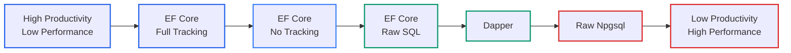

# Data Access in .NET: Comparing ORMs and Mapping Strategies (Part 1 - Entity Framework Core)

<!-- category -- .NET, EF Core, PostgreSQL, Performance, Database -->
<datetime class="hidden">2025-12-03T14:00</datetime>

When building .NET applications, one of the most important architectural decisions you'll make is how to handle data access and object mapping. The .NET ecosystem offers a rich variety of approaches, from full-featured ORMs to bare-metal SQL execution. Each approach comes with its own trade-offs in terms of performance, developer productivity, type safety, and maintainability.

In this comprehensive two-part guide, we'll explore the most popular data access patterns in .NET. While we use PostgreSQL with Npgsql in our examples (since that's what powers this blog), the concepts, patterns, and trade-offs apply equally to SQL Server, MySQL, SQLite, and other relational databases. The principles remain the same - only the SQL dialect and some specific features differ.

**Part 1 (this article)** focuses on Entity Framework Core, SQL generation, and common pitfalls.
**Part 2** will cover Dapper, raw ADO.NET, object mapping libraries, and hybrid approaches.

## Related Articles

If you're interested in practical EF Core implementations, check out my other articles:
- [Adding Entity Framework for Blog Posts (Part 1)](/blog/addingentityframeworkforblogpostspt1) - Setting up EF Core from scratch
- [EF Migrations The Right Way](/blog/efmigrationstherightway) - How to handle migrations properly in production
- [Full Text Searching (Pt 1)](/blog/textsearchingpt1) - Implementing PostgreSQL full-text search with EF Core
- [Modern CQRS and Event Sourcing](/blog/moderncqrsandeventsourcing) - Advanced architectural patterns with EF Core

## Table of Contents

## The Spectrum of Data Access Approaches

The .NET data access landscape can be visualized as a spectrum:

```
Full Abstraction                                      Full Control
     ↓                                                      ↓
[EF Core] → [EF Core Raw SQL] → [Dapper] → [Npgsql ADO.NET]
```

As you move from left to right, you gain performance and control but lose convenience and automatic features. Let's examine each approach in detail.

### Data Access Flow Comparison

Here's a visual comparison of how each approach handles a typical query:


### Performance vs Developer Productivity Trade-off



## Entity Framework Core: The Full-Featured ORM

[Entity Framework Core](https://learn.microsoft.com/en-us/ef/core/) is Microsoft's flagship ORM, providing a complete abstraction over your database. It supports PostgreSQL through the [Npgsql.EntityFrameworkCore.PostgreSQL](https://www.npgsql.org/efcore/) provider.

For practical guidance on setting up EF Core in your project, see my article on [Adding Entity Framework for Blog Posts](/blog/addingentityframeworkforblogpostspt1).

### Key Features

- **Change Tracking**: Automatically tracks entity changes and generates appropriate SQL
- **Migrations**: Code-first schema management and version control (see [EF Migrations The Right Way](/blog/efmigrationstherightway))
- **LINQ Provider**: Type-safe queries using C# language constructs
- **Lazy/Eager Loading**: Flexible loading strategies for related entities
- **Advanced PostgreSQL Features**: Full-text search ([see my article](/blog/textsearchingpt1)), JSON columns, arrays, range types
- **Interceptors and Events**: Extensibility points for cross-cutting concerns

### Example: Basic CRUD with EF Core

```csharp
public class BlogDbContext : DbContext
{
    public DbSet<BlogPost> BlogPosts { get; set; }
    public DbSet<Comment> Comments { get; set; }

    protected override void OnConfiguring(DbContextOptionsBuilder optionsBuilder)
    {
        optionsBuilder.UseNpgsql("Host=localhost;Database=blog;Username=postgres;Password=secret");
    }

    protected override void OnModelCreating(ModelBuilder modelBuilder)
    {
        // PostgreSQL-specific: Full-text search
        modelBuilder.Entity<BlogPost>()
            .HasGeneratedTsVectorColumn(
                p => p.SearchVector,
                "english",
                p => new { p.Title, p.Content })
            .HasIndex(p => p.SearchVector)
            .HasMethod("GIN");

        // PostgreSQL array type
        modelBuilder.Entity<BlogPost>()
            .Property(p => p.Tags)
            .HasPostgresArrayConversion(
                tag => tag.ToLowerInvariant(),
                tag => tag);
    }
}

public class BlogPost
{
    public int Id { get; set; }
    public string Title { get; set; }
    public string Content { get; set; }
    public string[] Tags { get; set; }
    public NpgsqlTsVector SearchVector { get; set; }
    public List<Comment> Comments { get; set; }
    public DateTime PublishedDate { get; set; }
}

// Usage
public class BlogService
{
    private readonly BlogDbContext _context;

    public async Task<List<BlogPost>> GetRecentPostsAsync(int count)
    {
        return await _context.BlogPosts
            .Include(p => p.Comments)
            .OrderByDescending(p => p.PublishedDate)
            .Take(count)
            .ToListAsync();
    }

    public async Task<List<BlogPost>> SearchPostsAsync(string searchTerm)
    {
        return await _context.BlogPosts
            .Where(p => p.SearchVector.Matches(EF.Functions.ToTsQuery("english", searchTerm)))
            .ToListAsync();
    }

    public async Task AddPostAsync(BlogPost post)
    {
        _context.BlogPosts.Add(post);
        await _context.SaveChangesAsync();
    }
}
```

### EF Core with Raw SQL

EF Core also supports raw SQL queries when you need more control:

```csharp
public async Task<List<BlogPost>> GetPostsByComplexCriteriaAsync()
{
    var searchTerm = "postgresql";

    return await _context.BlogPosts
        .FromSqlInterpolated($@"
            SELECT * FROM ""BlogPosts""
            WHERE ""SearchVector"" @@ to_tsquery('english', {searchTerm})
            AND array_length(""Tags"", 1) > 3
            ORDER BY ts_rank(""SearchVector"", to_tsquery('english', {searchTerm})) DESC
        ")
        .ToListAsync();
}

// Or with DbDataReader for maximum control
public async Task<List<PostStatistics>> GetPostStatisticsAsync()
{
    using var command = _context.Database.GetDbConnection().CreateCommand();
    command.CommandText = @"
        SELECT
            DATE_TRUNC('month', ""PublishedDate"") as Month,
            COUNT(*) as PostCount,
            AVG(ARRAY_LENGTH(""Tags"", 1)) as AvgTags
        FROM ""BlogPosts""
        GROUP BY DATE_TRUNC('month', ""PublishedDate"")
        ORDER BY Month DESC";

    await _context.Database.OpenConnectionAsync();

    var results = new List<PostStatistics>();
    using var reader = await command.ExecuteReaderAsync();

    while (await reader.ReadAsync())
    {
        results.Add(new PostStatistics
        {
            Month = reader.GetDateTime(0),
            PostCount = reader.GetInt32(1),
            AverageTags = reader.GetDouble(2)
        });
    }

    return results;
}
```

### When to Use EF Core

**✅ Use EF Core When:**

- Building a new application with evolving schema requirements
- You need strong typing and compile-time query validation
- Migrations and schema versioning are important (see [my migration guide](/blog/efmigrationstherightway))
- Your team prefers working with objects over SQL
- You're using complex domain models with relationships
- Development speed is more critical than raw performance
- You need cross-database portability (though PostgreSQL-specific features lock you in)

**❌ Avoid EF Core When:**

- Maximum performance is critical (high-throughput APIs, batch processing)
- You have complex, hand-tuned SQL queries
- Your queries don't map well to object graphs
- You need fine-grained control over every SQL statement
- Memory usage is a critical constraint (change tracking overhead)
- You're working with legacy schemas that don't map to conventions

## EF Core SQL Generation: Understanding What Gets Executed

One of the most important aspects of using EF Core effectively is understanding what SQL it generates. EF Core has significantly improved SQL generation over the years, but it's critical to verify the queries being sent to PostgreSQL.

### Viewing Generated SQL

```csharp
// Enable sensitive data logging and detailed errors (development only!)
optionsBuilder
    .UseNpgsql(connectionString)
    .EnableSensitiveDataLogging()
    .EnableDetailedErrors()
    .LogTo(Console.WriteLine, LogLevel.Information);

// Or use logging to see SQL
public class BlogService
{
    private readonly BlogDbContext _context;
    private readonly ILogger<BlogService> _logger;

    public async Task<List<BlogPost>> GetPostsAsync()
    {
        var query = _context.BlogPosts
            .Where(p => p.PublishedDate > DateTime.UtcNow.AddDays(-30))
            .OrderByDescending(p => p.PublishedDate);

        // View the SQL before execution
        var sql = query.ToQueryString();
        _logger.LogInformation("Executing query: {Sql}", sql);

        return await query.ToListAsync();
    }
}
```

### Example: Simple Query

**C# LINQ:**
```csharp
var recentPosts = await _context.BlogPosts
    .Where(p => p.CategoryId == 5)
    .OrderByDescending(p => p.PublishedDate)
    .Take(10)
    .ToListAsync();
```

**Generated SQL ([EF Core 8+](https://learn.microsoft.com/en-us/ef/core/what-is-new/ef-core-8.0/whatsnew)):**
```sql
SELECT b."Id", b."Title", b."Content", b."CategoryId", b."PublishedDate"
FROM "BlogPosts" AS b
WHERE b."CategoryId" = @__categoryId_0
ORDER BY b."PublishedDate" DESC
LIMIT @__p_1
```

Notice how EF Core 8+ generates clean, efficient SQL with proper parameterization. [EF Core 10](https://learn.microsoft.com/en-us/ef/core/what-is-new/ef-core-10.0/whatsnew) continues this trend with even more improvements.

### Example: Join with Include (Before EF Core 5)

**C# Code:**
```csharp
var posts = await _context.BlogPosts
    .Include(p => p.Category)
    .Include(p => p.Comments)
    .ToListAsync();
```

**Old SQL (EF Core 3.1 - Cartesian Explosion):**
```sql
SELECT b."Id", b."Title", c."Id", c."Name", cm."Id", cm."Content"
FROM "BlogPosts" AS b
LEFT JOIN "Categories" AS c ON b."CategoryId" = c."Id"
LEFT JOIN "Comments" AS cm ON b."Id" = cm."BlogPostId"
ORDER BY b."Id", c."Id"
```

This creates a **Cartesian product** - if a post has 10 comments, that row is repeated 10 times!

### Example: Split Queries (EF Core 5+)

**C# Code with Split Query:**
```csharp
var posts = await _context.BlogPosts
    .Include(p => p.Category)
    .Include(p => p.Comments)
    .AsSplitQuery()  // ← This is the key!
    .ToListAsync();
```

**Generated SQL (Multiple Queries):**
```sql
-- Query 1: Get posts and categories
SELECT b."Id", b."Title", b."Content", c."Id", c."Name"
FROM "BlogPosts" AS b
LEFT JOIN "Categories" AS c ON b."CategoryId" = c."Id"

-- Query 2: Get comments for those posts
SELECT cm."Id", cm."Content", cm."BlogPostId"
FROM "Comments" AS cm
INNER JOIN (
    SELECT b."Id"
    FROM "BlogPosts" AS b
) AS t ON cm."BlogPostId" = t."Id"
ORDER BY t."Id"
```

This eliminates the Cartesian product and is often **much faster** for collections!

### Example: Filtered Include (EF Core 5+)

**C# Code:**
```csharp
var posts = await _context.BlogPosts
    .Include(p => p.Comments.Where(c => c.IsApproved))
    .ToListAsync();
```

**Generated SQL:**
```sql
SELECT b."Id", b."Title", b."Content", t."Id", t."Content", t."IsApproved"
FROM "BlogPosts" AS b
LEFT JOIN (
    SELECT c."Id", c."Content", c."IsApproved", c."BlogPostId"
    FROM "Comments" AS c
    WHERE c."IsApproved" = TRUE
) AS t ON b."Id" = t."BlogPostId"
ORDER BY b."Id"
```

### Example: JSON Column Queries (EF Core 7+)

**C# Code:**
```csharp
public class BlogPost
{
    public int Id { get; set; }
    public string Title { get; set; }
    public PostMetadata Metadata { get; set; }  // Stored as JSONB
}

public class PostMetadata
{
    public bool IsFeatured { get; set; }
    public int ViewCount { get; set; }
    public List<string> RelatedTags { get; set; }
}

// Query JSON properties
var featuredPosts = await _context.BlogPosts
    .Where(p => p.Metadata.IsFeatured)
    .ToListAsync();
```

**Generated SQL:**
```sql
SELECT b."Id", b."Title", b."Metadata"
FROM "BlogPosts" AS b
WHERE b."Metadata" ->> 'IsFeatured' = 'true'
```

EF Core 7+ can translate JSON property access to PostgreSQL JSON operators!

### Example: Bulk Update (EF Core 7+ ExecuteUpdate)

**Old Way (Inefficient):**
```csharp
var posts = await _context.BlogPosts
    .Where(p => p.CategoryId == 5)
    .ToListAsync();

foreach (var post in posts)
{
    post.IsArchived = true;
}

await _context.SaveChangesAsync();  // Generates N UPDATE statements!
```

**New Way (EF Core 7+):**
```csharp
await _context.BlogPosts
    .Where(p => p.CategoryId == 5)
    .ExecuteUpdateAsync(setters => setters
        .SetProperty(p => p.IsArchived, true));
```

**Generated SQL (Single Query!):**
```sql
UPDATE "BlogPosts" AS b
SET "IsArchived" = TRUE
WHERE b."CategoryId" = 5
```

This is a **massive** improvement - one SQL statement instead of N!

### Example: Bulk Delete (EF Core 7+)

**Old Way:**
```csharp
var oldPosts = await _context.BlogPosts
    .Where(p => p.PublishedDate < DateTime.UtcNow.AddYears(-5))
    .ToListAsync();

_context.BlogPosts.RemoveRange(oldPosts);
await _context.SaveChangesAsync();  // N DELETE statements
```

**New Way:**
```csharp
await _context.BlogPosts
    .Where(p => p.PublishedDate < DateTime.UtcNow.AddYears(-5))
    .ExecuteDeleteAsync();
```

**Generated SQL:**
```sql
DELETE FROM "BlogPosts" AS b
WHERE b."PublishedDate" < @__p_0
```

### Example: Complex Aggregation

**C# Code:**
```csharp
var categoryStats = await _context.Categories
    .Select(c => new CategoryStats
    {
        CategoryName = c.Name,
        PostCount = c.BlogPosts.Count(),
        LatestPostDate = c.BlogPosts.Max(p => p.PublishedDate),
        AverageComments = c.BlogPosts.Average(p => p.Comments.Count)
    })
    .ToListAsync();
```

**Generated SQL (EF Core 8+/10):**
```sql
SELECT c."Name" AS "CategoryName",
       COUNT(*)::int AS "PostCount",
       MAX(b."PublishedDate") AS "LatestPostDate",
       COALESCE(AVG((
           SELECT COUNT(*)::int
           FROM "Comments" AS c0
           WHERE b."Id" = c0."BlogPostId"
       ))::double precision, 0.0) AS "AverageComments"
FROM "Categories" AS c
LEFT JOIN "BlogPosts" AS b ON c."Id" = b."CategoryId"
GROUP BY c."Id", c."Name"
```

### PostgreSQL Full-Text Search

For a deeper dive into full-text search, see my article on [implementing full-text search with EF Core](/blog/textsearchingpt1).

**C# Code:**
```csharp
var searchResults = await _context.BlogPosts
    .Where(p => p.SearchVector.Matches(EF.Functions.ToTsQuery("english", "postgresql & performance")))
    .OrderByDescending(p => p.SearchVector.Rank(EF.Functions.ToTsQuery("english", "postgresql & performance")))
    .Take(20)
    .ToListAsync();
```

**Generated SQL:**
```sql
SELECT b."Id", b."Title", b."Content", b."SearchVector"
FROM "BlogPosts" AS b
WHERE b."SearchVector" @@ to_tsquery('english', @__searchTerm_0)
ORDER BY ts_rank(b."SearchVector", to_tsquery('english', @__searchTerm_0)) DESC
LIMIT 20
```

## ⚠️ Critical EF Core Warnings and Pitfalls

### 1. Change Tracking Memory Leaks

**The Problem:**
```csharp
// ❌ DANGER: This can cause memory leaks!
public class PostCache
{
    private readonly BlogDbContext _context;
    private List<BlogPost> _cachedPosts;

    public PostCache(BlogDbContext context)
    {
        _context = context;
    }

    public async Task LoadCacheAsync()
    {
        // These entities are now tracked by the context
        _cachedPosts = await _context.BlogPosts.ToListAsync();

        // The DbContext holds references to these entities FOREVER
        // They can never be garbage collected while the context lives!
    }
}
```

**Why it's a problem:**
- Tracked entities remain in memory for the lifetime of the `DbContext`
- The change tracker maintains references, preventing garbage collection
- Long-lived contexts (e.g., singletons) = memory leak
- In ASP.NET Core, context is scoped by default (good!)
- But if you cache tracked entities, you're in trouble

**The Solution:**
```csharp
public async Task LoadCacheAsync()
{
    // ✅ Use AsNoTracking() for read-only queries
    _cachedPosts = await _context.BlogPosts
        .AsNoTracking()
        .ToListAsync();

    // Or detach entities after loading
    var posts = await _context.BlogPosts.ToListAsync();
    foreach (var post in posts)
    {
        _context.Entry(post).State = EntityState.Detached;
    }
    _cachedPosts = posts;
}
```

### 2. Proxy Generation and Lazy Loading Dangers

> **🚨 CRITICAL WARNING: DO NOT USE EF CORE PROXIES IF YOU CACHE ENTITIES**
>
> Lazy loading proxies + caching = **GUARANTEED MEMORY LEAK**
>
> If you cache DbContext instances or cache entities loaded with proxies enabled, you **WILL** leak memory. The proxy mechanism maintains references to the DbContext, preventing garbage collection. This is one of the most common and dangerous mistakes in EF Core applications.
>
> **Rule of thumb**: Always include collections explicitly with `.Include()`. Only use proxies if you fully understand the tradeoffs and never, ever cache proxy entities.

**Problem 1: The N+1 Query Nightmare**
```csharp
// ❌ Enable lazy loading
optionsBuilder
    .UseNpgsql(connectionString)
    .UseLazyLoadingProxies();  // Convenient but dangerous!

public class BlogPost
{
    public int Id { get; set; }
    public string Title { get; set; }
    public virtual Category Category { get; set; }  // Virtual = proxy
    public virtual List<Comment> Comments { get; set; }
}

// Somewhere in your code
var posts = await _context.BlogPosts.ToListAsync();

foreach (var post in posts)
{
    Console.WriteLine(post.Category.Name);  // N+1 query here!
    Console.WriteLine(post.Comments.Count);  // Another N+1 query!
}
```

**What happens:**
1. First query loads all posts
2. For **each post**, accessing `Category` triggers a database query
3. For **each post**, accessing `Comments` triggers another query
4. If you have 100 posts, you just executed **201 queries**!

**Problem 2: Proxy + Caching = Memory Leak**
```csharp
// ❌ CATASTROPHIC: Lazy loading proxies + caching
public class BlogPostCache
{
    private static List<BlogPost> _cachedPosts;
    private readonly BlogDbContext _context;

    public BlogPostCache()
    {
        var optionsBuilder = new DbContextOptionsBuilder<BlogDbContext>();
        optionsBuilder
            .UseNpgsql(connectionString)
            .UseLazyLoadingProxies();  // ⚠️ DANGER!

        _context = new BlogDbContext(optionsBuilder.Options);
    }

    public async Task<List<BlogPost>> GetCachedPostsAsync()
    {
        if (_cachedPosts == null)
        {
            // ❌ These proxy entities hold references to _context
            _cachedPosts = await _context.BlogPosts.ToListAsync();
        }
        return _cachedPosts;
    }
}
```

**Why this is catastrophic:**
- Proxy entities maintain a reference to their `DbContext`
- The `DbContext` maintains a reference to all tracked entities
- Your cache now prevents the entire object graph from being garbage collected
- Every time you access a navigation property, it may trigger queries using the **old, cached context**
- Memory grows unbounded as you load more data
- You'll eventually run out of memory or exhaust connection pools

**The Solution: Be Explicit**
```csharp
// ✅ NEVER use lazy loading proxies - always be explicit
optionsBuilder
    .UseNpgsql(connectionString);
    // NO .UseLazyLoadingProxies()!

public class BlogPost
{
    public int Id { get; set; }
    public string Title { get; set; }
    public Category Category { get; set; }  // NOT virtual
    public List<Comment> Comments { get; set; }  // NOT virtual
}

// ✅ Explicit eager loading - you control what's loaded
var posts = await _context.BlogPosts
    .Include(p => p.Category)
    .Include(p => p.Comments)
    .ToListAsync();

// ✅ Or use split queries for better performance
var posts = await _context.BlogPosts
    .Include(p => p.Category)
    .Include(p => p.Comments)
    .AsSplitQuery()
    .ToListAsync();

// ✅ Or use projection to DTOs (best for caching)
var posts = await _context.BlogPosts
    .Select(p => new PostDto
    {
        Title = p.Title,
        CategoryName = p.Category.Name,
        CommentCount = p.Comments.Count
    })
    .ToListAsync();

// ✅ If you MUST cache, use AsNoTracking and no proxies
public class SafeBlogPostCache
{
    private static List<BlogPost> _cachedPosts;
    private readonly IDbContextFactory<BlogDbContext> _contextFactory;

    public async Task<List<BlogPost>> GetCachedPostsAsync()
    {
        if (_cachedPosts == null)
        {
            using var context = await _contextFactory.CreateDbContextAsync();

            _cachedPosts = await context.BlogPosts
                .Include(p => p.Category)
                .Include(p => p.Comments)
                .AsNoTracking()  // Critical for caching!
                .ToListAsync();
        }
        return _cachedPosts;
    }
}
```

**When Proxies Might Be Acceptable (Understand the Tradeoffs):**

Lazy loading proxies might be acceptable ONLY when:
1. ✅ You have **short-lived** scoped contexts (e.g., per HTTP request)
2. ✅ You **never** cache entities
3. ✅ You're okay with N+1 query performance
4. ✅ You're prototyping and will optimize later
5. ✅ Your team fully understands the implications

But even then, explicit `Include()` is almost always the better choice because:
- It makes data loading **explicit and obvious**
- It's **easier to optimize** (you can see what's being loaded)
- It **prevents accidental N+1 queries**
- It works correctly with caching and long-lived contexts
- It's the **recommended approach** by the EF Core team

### 3. DbContext Lifetime Issues

For more details on managing DbContext lifetime in production, see my article on [EF Migrations The Right Way](/blog/efmigrationstherightway).

**The Problem:**
```csharp
// ❌ NEVER do this - singleton DbContext
public void ConfigureServices(IServiceCollection services)
{
    services.AddSingleton<BlogDbContext>();  // WRONG!
}

// ❌ Also wrong - storing context in static field
public static class DataAccess
{
    private static BlogDbContext _context = new BlogDbContext();

    public static async Task<BlogPost> GetPostAsync(int id)
    {
        return await _context.BlogPosts.FindAsync(id);
    }
}
```

**Why it's wrong:**
- `DbContext` is **not thread-safe**
- Concurrent requests will cause data corruption
- Change tracker grows indefinitely
- Connection pool exhaustion
- Stale data from cache

**The Solution:**
```csharp
// ✅ Use scoped lifetime (default in ASP.NET Core)
public void ConfigureServices(IServiceCollection services)
{
    services.AddDbContext<BlogDbContext>(options =>
        options.UseNpgsql(connectionString));
}

// ✅ Or use DbContext factory for background services
public void ConfigureServices(IServiceCollection services)
{
    services.AddDbContextFactory<BlogDbContext>(options =>
        options.UseNpgsql(connectionString));
}

public class BlogBackgroundService
{
    private readonly IDbContextFactory<BlogDbContext> _contextFactory;

    public async Task ProcessPostsAsync()
    {
        // Create a new context for this operation
        using var context = await _contextFactory.CreateDbContextAsync();

        var posts = await context.BlogPosts.ToListAsync();
        // Process posts...
    }
}
```

### 4. Unintended Includes in Navigation Properties

**The Problem:**
```csharp
public class BlogPost
{
    public int Id { get; set; }
    public string Title { get; set; }
    public List<Comment> Comments { get; set; }
}

// You query one post...
var post = await _context.BlogPosts.FirstAsync();

// Add a new comment
var newComment = new Comment { Content = "Great post!" };
post.Comments.Add(newComment);

await _context.SaveChangesAsync();

// ❌ EF Core saves the comment, BUT...
// If Comments wasn't loaded, you just lost all existing comments!
// The collection is empty, so EF thinks there are no other comments
```

**The Solution:**
```csharp
// ✅ Always load navigation properties before modifying
var post = await _context.BlogPosts
    .Include(p => p.Comments)
    .FirstAsync(p => p.Id == postId);

post.Comments.Add(newComment);
await _context.SaveChangesAsync();

// Or add directly to the DbSet
_context.Comments.Add(new Comment
{
    BlogPostId = postId,
    Content = "Great post!"
});
await _context.SaveChangesAsync();
```

### 5. Async vs Sync Mixing

**The Problem:**
```csharp
// ❌ Mixing sync and async - deadlock risk!
public async Task<BlogPost> GetPostAsync(int id)
{
    var post = _context.BlogPosts
        .Where(p => p.Id == id)
        .FirstOrDefault();  // Sync method in async context!

    return post;
}

// ❌ Even worse - blocking async code
public BlogPost GetPost(int id)
{
    return _context.BlogPosts
        .FirstOrDefaultAsync(p => p.Id == id)
        .Result;  // DEADLOCK RISK!
}
```

**The Solution:**
```csharp
// ✅ Use async all the way
public async Task<BlogPost> GetPostAsync(int id)
{
    return await _context.BlogPosts
        .FirstOrDefaultAsync(p => p.Id == id);
}

// ✅ Or use sync all the way (not recommended for ASP.NET Core)
public BlogPost GetPost(int id)
{
    return _context.BlogPosts
        .FirstOrDefault(p => p.Id == id);
}
```

## EF Core 10: What's New and Breaking Changes

With [EF Core 10](https://learn.microsoft.com/en-us/ef/core/what-is-new/ef-core-10.0/whatsnew) released alongside .NET 10, there are several important changes to be aware of when upgrading. For the full list, see [Breaking changes in EF Core 10](https://learn.microsoft.com/en-us/ef/core/what-is-new/ef-core-10.0/breaking-changes).

### Runtime Requirements

**EF Core 10 requires .NET 10**. It will not run on .NET 8, .NET 9, or .NET Framework. This is the most significant change - ensure your project targets `net10.0` before upgrading.

### Query-Related Breaking Changes

#### 1. Parameterized Collection Translation (Default Changed)

EF Core 10 changes how `Contains()` with in-memory collections is translated to SQL. Previously, EF Core used `OpenJson()` (SQL Server) or similar. Now it defaults to **parameter arrays** which provide better query plan caching.

**Impact**: You may see different SQL generated for queries like:

```csharp
var ids = new List<int> { 1, 2, 3, 4, 5 };
var posts = await _context.BlogPosts
    .Where(p => ids.Contains(p.Id))
    .ToListAsync();
```

**EF Core 8/9 (OpenJson):**
```sql
SELECT b."Id", b."Title"
FROM "BlogPosts" AS b
WHERE b."Id" IN (SELECT value FROM OPENJSON(@__ids_0))
```

**EF Core 10 (Parameter Arrays):**
```sql
SELECT b."Id", b."Title"
FROM "BlogPosts" AS b
WHERE b."Id" = ANY(@__ids_0)  -- PostgreSQL
-- Or: WHERE b."Id" IN (@__ids_0_0, @__ids_0_1, @__ids_0_2, ...) -- SQL Server
```

**If you experience performance regressions**, revert to the old behavior:

```csharp
// SQL Server
optionsBuilder.UseSqlServer(connectionString,
    o => o.UseParameterizedCollectionMode(ParameterTranslationMode.Constant));

// PostgreSQL - generally parameter arrays work well, but you can opt out if needed
```

#### 2. ExecuteUpdateAsync Signature Change

The `ExecuteUpdateAsync` signature has changed to support non-expression lambdas. This is more flexible but **breaks code that built expression trees programmatically**:

**Old way (EF Core 7-9):**
```csharp
// This still works
await _context.BlogPosts
    .Where(p => p.CategoryId == 5)
    .ExecuteUpdateAsync(setters => setters
        .SetProperty(p => p.IsArchived, true));
```

**New in EF Core 10 - Non-expression lambdas:**
```csharp
// Now you can include custom logic!
await _context.BlogPosts
    .Where(p => p.CategoryId == 5)
    .ExecuteUpdateAsync(setters =>
    {
        setters.SetProperty(p => p.IsArchived, true);
        setters.SetProperty(p => p.UpdatedAt, DateTime.UtcNow);
        // Can now include conditional logic, loops, etc.
    });
```

#### 3. Complex Type Column Naming

EF Core 10 changes how nested complex type columns are named to prevent data corruption:

**EF Core 9:**
```
NestedComplex_Property
```

**EF Core 10:**
```
OuterComplex_NestedComplex_Property
```

**Migration impact**: If you have existing tables with complex types, you may need to rename columns or configure explicit column names:

```csharp
modelBuilder.Entity<Order>()
    .ComplexProperty(o => o.ShippingAddress)
    .Property(a => a.Street)
    .HasColumnName("ShippingAddress_Street"); // Explicit name
```

### SQL Server / Azure SQL Specific Changes

#### JSON Data Type Default

For Azure SQL Database or SQL Server 2025 (compatibility level 170+), EF Core 10 defaults to the new native `JSON` data type instead of `NVARCHAR(MAX)`.

**To opt out** (if you need backwards compatibility):
```csharp
optionsBuilder.UseAzureSql(connectionString,
    o => o.UseCompatibilityLevel(160)); // Use old NVARCHAR behavior
```

### Upgrading Checklist

When upgrading from EF Core 8/9 to EF Core 10:

1. ✅ Update target framework to `net10.0`
2. ✅ Update all `Microsoft.EntityFrameworkCore.*` packages to 10.x
3. ✅ Update `Npgsql.EntityFrameworkCore.PostgreSQL` to 10.x
4. ✅ Review queries using `Contains()` with collections for performance changes
5. ✅ Test any code that programmatically builds `ExecuteUpdateAsync` expressions
6. ✅ Check complex type column names if using nested complex types
7. ✅ Review SQL Server JSON column usage if using Azure SQL/SQL Server 2025

### What's New (Highlights)

- **Improved LINQ translation**: Better SQL generation for complex queries
- **Non-expression lambdas in ExecuteUpdateAsync**: More flexibility in bulk updates
- **Better parameter handling**: Improved query plan caching
- **Enhanced JSON support**: Native JSON type on SQL Server 2025
- **Performance improvements**: Faster materialization and change tracking

## Performance Characteristics

- **Query Performance**: 20-50% overhead compared to Dapper for simple queries
- **Memory Usage**: Higher due to change tracking and proxy generation
- **First Query**: Slow (query compilation and caching)
- **Subsequent Queries**: Faster due to compiled query cache
- **Inserts/Updates**: Automatic change tracking adds overhead
- **Bulk Operations**: Poor performance with default methods (consider [EFCore.BulkExtensions](https://github.com/borisdj/EFCore.BulkExtensions) or ExecuteUpdate/ExecuteDelete in EF Core 7+)

## Best Practices for EF Core

### General Guidelines

1. **Use AsNoTracking()** for read-only queries to reduce memory overhead
2. **Avoid N+1 queries** - use `Include()` or split queries appropriately
3. **Use compiled queries** for repeated query patterns
4. **Consider AsSplitQuery()** for complex includes to avoid Cartesian products
5. **Use batching** for multiple inserts/updates
6. **Project to DTOs** early to reduce data transfer and memory usage
7. **Leverage ExecuteUpdate/ExecuteDelete** (EF Core 7+) for bulk operations
8. **Always log and review generated SQL** in development

### When Working with PostgreSQL

1. **Use full-text search** features ([my guide](/blog/textsearchingpt1)) instead of `LIKE` queries
2. **Leverage JSONB columns** for flexible schema-less data
3. **Use array types** for collections within entities
4. **Configure connection pooling** properly for your workload
5. **Index your `tsvector` columns** with GIN indexes
6. **Use range types** for date/time ranges

## Coming Up in Part 2

In the next article, we'll explore:
- **Dapper**: The micro-ORM sweet spot
- **Raw ADO.NET/Npgsql**: Maximum performance and control
- **Object Mapping Libraries**: Mapster vs AutoMapper
- **Hybrid Approaches**: Combining EF Core and Dapper (CQRS pattern)
- **Performance Benchmarks**: Real-world comparisons
- **Decision Matrix**: Choosing the right tool for your scenario

## References and Further Reading

- [Entity Framework Core Documentation](https://learn.microsoft.com/en-us/ef/core/)
- [Npgsql Entity Framework Core Provider](https://www.npgsql.org/efcore/)
- [EF Core Performance](https://learn.microsoft.com/en-us/ef/core/performance/)
- [What's New in EF Core 10](https://learn.microsoft.com/en-us/ef/core/what-is-new/ef-core-10.0/whatsnew)
- [Breaking Changes in EF Core 10](https://learn.microsoft.com/en-us/ef/core/what-is-new/ef-core-10.0/breaking-changes)
- [What's New in EF Core 8](https://learn.microsoft.com/en-us/ef/core/what-is-new/ef-core-8.0/whatsnew)
- [PostgreSQL Documentation](https://www.postgresql.org/docs/)

**Related Articles on This Blog:**
- [Adding Entity Framework for Blog Posts](/blog/addingentityframeworkforblogpostspt1)
- [EF Migrations The Right Way](/blog/efmigrationstherightway)
- [Full Text Searching with EF Core](/blog/textsearchingpt1)
- [Modern CQRS and Event Sourcing](/blog/moderncqrsandeventsourcing)

---

*In Part 2, we'll dive into Dapper, raw Npgsql, and explore how to combine multiple approaches for optimal performance and maintainability.*
