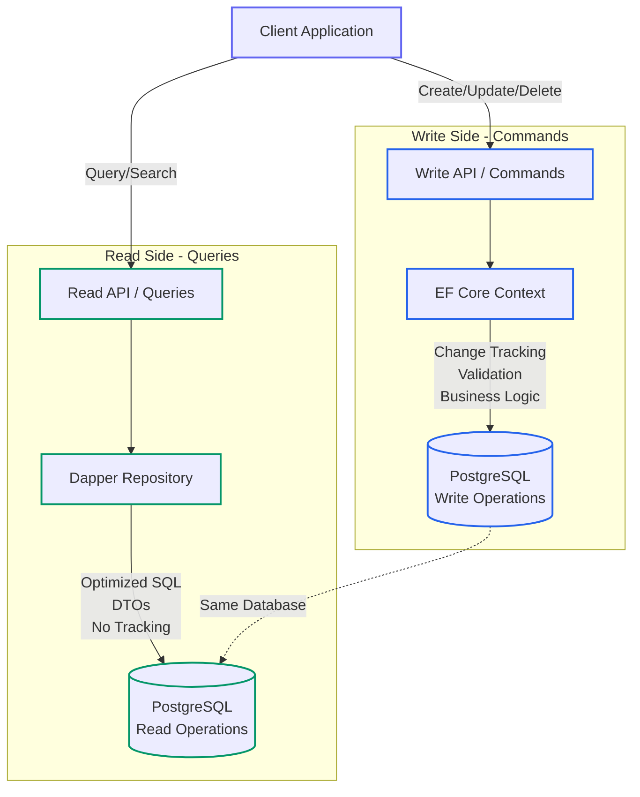

# Data Access in .NET: Comparing ORMs and Mapping Strategies (Part 2 - Dapper, Raw SQL, and Hybrid Approaches)

<!-- category -- .NET, Dapper, PostgreSQL, Performance, Database -->
<datetime class="hidden">2025-12-01T15:00</datetime>

Welcome to Part 2 of our comprehensive guide to data access in .NET! In [Part 1](/blog/orm-mapping-comparison-part1), we explored Entity Framework Core in depth, including SQL generation, common pitfalls, and that critical warning about proxies and caching.

In this article, we'll explore the lighter-weight alternatives and how to combine multiple approaches for optimal performance:

- **[Dapper](https://github.com/DapperLib/Dapper)**: The micro-ORM sweet spot
- **Raw ADO.NET/[Npgsql](https://www.npgsql.org/)**: Maximum performance and control
- **Object Mapping Libraries**: [Mapster](https://github.com/MapsterMapper/Mapster) vs [AutoMapper](https://automapper.org/)
- **Hybrid Approaches**: Combining EF Core and Dapper (CQRS pattern)
- **Performance Benchmarks**: Real-world comparisons
- **Decision Matrix**: Choosing the right tool for your scenario

## Table of Contents

## Dapper: The Micro-ORM

[Dapper](https://github.com/DapperLib/Dapper) is a lightweight, high-performance micro-ORM created by Stack Overflow. It provides a thin layer over ADO.NET, handling the tedious work of mapping query results to objects while giving you full SQL control.

### Why Dapper Exists

Dapper was born out of Stack Overflow's need for high-performance data access. The team found that full ORMs like Entity Framework (pre-Core) added too much overhead for their high-traffic scenarios. Dapper gives you 95% of the convenience with only 5-15% overhead over raw ADO.NET.

### Key Features

- **Raw SQL**: You write all SQL yourself - complete control
- **High Performance**: Minimal overhead over ADO.NET (5-15%)
- **Multi-Mapping**: Map complex queries to multiple related types
- **Parameter Handling**: Automatic parameterization prevents SQL injection
- **Transaction Support**: Full control over transactions
- **Simplicity**: No configuration, no change tracking, no magic
- **Async/Await**: Full async support for modern .NET

### Basic Dapper Examples

```csharp
using Npgsql;
using Dapper;

public class DapperBlogRepository
{
    private readonly string _connectionString;

    public DapperBlogRepository(string connectionString)
    {
        _connectionString = connectionString;

        // Configure Dapper to work with PostgreSQL naming conventions
        DefaultTypeMap.MatchNamesWithUnderscores = true;
    }

    // Simple query
    public async Task<IEnumerable<BlogPost>> GetRecentPostsAsync(int count)
    {
        using var connection = new NpgsqlConnection(_connectionString);

        const string sql = @"
            SELECT id, title, content, tags, published_date, category_id
            FROM blog_posts
            ORDER BY published_date DESC
            LIMIT @Count";

        return await connection.QueryAsync<BlogPost>(sql, new { Count = count });
    }

    // Query with WHERE clause
    public async Task<BlogPost> GetPostByIdAsync(int id)
    {
        using var connection = new NpgsqlConnection(_connectionString);

        const string sql = @"
            SELECT id, title, content, published_date
            FROM blog_posts
            WHERE id = @Id";

        return await connection.QueryFirstOrDefaultAsync<BlogPost>(sql, new { Id = id });
    }

    // Insert with returning ID
    public async Task<int> CreatePostAsync(BlogPost post)
    {
        using var connection = new NpgsqlConnection(_connectionString);

        const string sql = @"
            INSERT INTO blog_posts (title, content, published_date, category_id)
            VALUES (@Title, @Content, @PublishedDate, @CategoryId)
            RETURNING id";

        return await connection.ExecuteScalarAsync<int>(sql, post);
    }

    // Update
    public async Task UpdatePostAsync(BlogPost post)
    {
        using var connection = new NpgsqlConnection(_connectionString);

        const string sql = @"
            UPDATE blog_posts
            SET title = @Title,
                content = @Content,
                published_date = @PublishedDate
            WHERE id = @Id";

        await connection.ExecuteAsync(sql, post);
    }

    // Delete
    public async Task DeletePostAsync(int id)
    {
        using var connection = new NpgsqlConnection(_connectionString);

        const string sql = "DELETE FROM blog_posts WHERE id = @Id";

        await connection.ExecuteAsync(sql, new { Id = id });
    }
}
```

### Multi-Mapping: Handling Joins

One of Dapper's most powerful features is multi-mapping - efficiently handling joins and mapping to multiple related objects:

```csharp
public async Task<IEnumerable<BlogPost>> GetPostsWithCategoryAsync()
{
    using var connection = new NpgsqlConnection(_connectionString);

    const string sql = @"
        SELECT
            p.id, p.title, p.content, p.published_date,
            c.id, c.name, c.description
        FROM blog_posts p
        INNER JOIN categories c ON p.category_id = c.id
        ORDER BY p.published_date DESC";

    return await connection.QueryAsync<BlogPost, Category, BlogPost>(
        sql,
        (post, category) =>
        {
            post.Category = category;
            return post;
        },
        splitOn: "id"  // Split at the second "id" column
    );
}

// More complex: Posts with comments
public async Task<IEnumerable<BlogPost>> GetPostsWithCommentsAsync()
{
    using var connection = new NpgsqlConnection(_connectionString);

    const string sql = @"
        SELECT
            p.id, p.title, p.content,
            c.id, c.author, c.content, c.created_at
        FROM blog_posts p
        LEFT JOIN comments c ON p.id = c.blog_post_id
        ORDER BY p.published_date DESC, c.created_at";

    var postDict = new Dictionary<int, BlogPost>();

    await connection.QueryAsync<BlogPost, Comment, BlogPost>(
        sql,
        (post, comment) =>
        {
            if (!postDict.TryGetValue(post.Id, out var existingPost))
            {
                existingPost = post;
                existingPost.Comments = new List<Comment>();
                postDict.Add(post.Id, existingPost);
            }

            if (comment != null)
            {
                existingPost.Comments.Add(comment);
            }

            return existingPost;
        },
        splitOn: "id"
    );

    return postDict.Values;
}
```

### Advanced Dapper Techniques

**Dynamic Parameters for Complex Queries:**

```csharp
public async Task<IEnumerable<BlogPost>> SearchWithDynamicFiltersAsync(SearchCriteria criteria)
{
    using var connection = new NpgsqlConnection(_connectionString);

    var parameters = new DynamicParameters();
    var conditions = new List<string>();

    var sql = new StringBuilder("SELECT * FROM blog_posts");

    if (!string.IsNullOrEmpty(criteria.SearchTerm))
    {
        conditions.Add("search_vector @@ to_tsquery('english', @SearchTerm)");
        parameters.Add("SearchTerm", criteria.SearchTerm);
    }

    if (criteria.CategoryIds?.Any() == true)
    {
        conditions.Add("category_id = ANY(@CategoryIds)");
        parameters.Add("CategoryIds", criteria.CategoryIds);
    }

    if (criteria.FromDate.HasValue)
    {
        conditions.Add("published_date >= @FromDate");
        parameters.Add("FromDate", criteria.FromDate.Value);
    }

    if (criteria.Tags?.Any() == true)
    {
        conditions.Add("tags && @Tags");  // PostgreSQL array overlap
        parameters.Add("Tags", criteria.Tags);
    }

    if (conditions.Any())
    {
        sql.Append(" WHERE ");
        sql.Append(string.Join(" AND ", conditions));
    }

    sql.Append(" ORDER BY published_date DESC LIMIT @Limit");
    parameters.Add("Limit", criteria.Limit);

    return await connection.QueryAsync<BlogPost>(sql.ToString(), parameters);
}
```

**Custom Type Handlers for PostgreSQL Types:**

```csharp
// Handle PostgreSQL arrays
public class PostgresArrayTypeHandler : SqlMapper.TypeHandler<string[]>
{
    public override void SetValue(IDbDataParameter parameter, string[] value)
    {
        parameter.Value = value;
        ((NpgsqlParameter)parameter).NpgsqlDbType = NpgsqlDbType.Array | NpgsqlDbType.Text;
    }

    public override string[] Parse(object value)
    {
        return (string[])value;
    }
}

// Handle PostgreSQL JSONB
public class JsonTypeHandler<T> : SqlMapper.TypeHandler<T>
{
    public override void SetValue(IDbDataParameter parameter, T value)
    {
        parameter.Value = JsonSerializer.Serialize(value);
        ((NpgsqlParameter)parameter).NpgsqlDbType = NpgsqlDbType.Jsonb;
    }

    public override T Parse(object value)
    {
        return JsonSerializer.Deserialize<T>(value.ToString());
    }
}

// Register handlers (in startup)
SqlMapper.AddTypeHandler(new PostgresArrayTypeHandler());
SqlMapper.AddTypeHandler(new JsonTypeHandler<Dictionary<string, object>>());
```

**Bulk Operations with PostgreSQL COPY:**

```csharp
public async Task BulkInsertPostsAsync(IEnumerable<BlogPost> posts)
{
    using var connection = new NpgsqlConnection(_connectionString);
    await connection.OpenAsync();

    using var writer = await connection.BeginBinaryImportAsync(
        "COPY blog_posts (title, content, tags, published_date) FROM STDIN (FORMAT BINARY)"
    );

    foreach (var post in posts)
    {
        await writer.StartRowAsync();
        await writer.WriteAsync(post.Title);
        await writer.WriteAsync(post.Content);
        await writer.WriteAsync(post.Tags, NpgsqlDbType.Array | NpgsqlDbType.Text);
        await writer.WriteAsync(post.PublishedDate);
    }

    await writer.CompleteAsync();
}
```

**Transaction Support:**

```csharp
public async Task TransferPostToCategoryAsync(int postId, int newCategoryId)
{
    using var connection = new NpgsqlConnection(_connectionString);
    await connection.OpenAsync();

    using var transaction = await connection.BeginTransactionAsync();

    try
    {
        // Update the post
        await connection.ExecuteAsync(
            "UPDATE blog_posts SET category_id = @CategoryId WHERE id = @PostId",
            new { CategoryId = newCategoryId, PostId = postId },
            transaction
        );

        // Log the change
        await connection.ExecuteAsync(
            @"INSERT INTO category_history (post_id, category_id, changed_at)
              VALUES (@PostId, @CategoryId, @ChangedAt)",
            new { PostId = postId, CategoryId = newCategoryId, ChangedAt = DateTime.UtcNow },
            transaction
        );

        await transaction.CommitAsync();
    }
    catch
    {
        await transaction.RollbackAsync();
        throw;
    }
}
```

### When to Use Dapper

**✅ Use Dapper When:**

- Performance is critical but you don't need absolute maximum speed
- You're comfortable writing SQL
- You have complex queries that don't map well to LINQ
- You need fine control over SQL generation
- You're working with an existing database schema
- You want minimal overhead and dependencies
- Memory usage is a concern
- You need to leverage database-specific features extensively

**❌ Avoid Dapper When:**

- Your team is not comfortable with SQL
- You need automatic change tracking
- You want schema migrations as code
- You have a rapidly evolving schema
- You need cross-database portability
- You prefer LINQ over SQL syntax

### Performance Characteristics

- **Query Performance**: 5-15% overhead over raw ADO.NET
- **Memory Usage**: Minimal - no change tracking or proxies
- **Bulk Operations**: Excellent with PostgreSQL COPY
- **First Query**: Fast - no compilation step
- **Developer Productivity**: Requires SQL knowledge but very predictable

## Raw ADO.NET with Npgsql

For absolute maximum performance and control, you can use [Npgsql](https://www.npgsql.org/) directly without any ORM layer.

### When Raw ADO.NET Makes Sense

Raw ADO.NET is appropriate when:
- You need every millisecond of performance
- You're building high-throughput data processors
- You're working with PostgreSQL-specific features not supported by ORMs
- You need precise control over memory allocations
- You're doing bulk operations or streaming large datasets

### Example: Pure Npgsql

```csharp
public class NpgsqlBlogRepository
{
    private readonly string _connectionString;

    public async Task<List<BlogPost>> GetRecentPostsAsync(int count)
    {
        var posts = new List<BlogPost>();

        using var connection = new NpgsqlConnection(_connectionString);
        await connection.OpenAsync();

        using var command = new NpgsqlCommand(
            "SELECT id, title, content, tags, published_date FROM blog_posts ORDER BY published_date DESC LIMIT @count",
            connection
        );

        command.Parameters.AddWithValue("count", count);

        using var reader = await command.ExecuteReaderAsync();

        while (await reader.ReadAsync())
        {
            posts.Add(new BlogPost
            {
                Id = reader.GetInt32(0),
                Title = reader.GetString(1),
                Content = reader.GetString(2),
                Tags = reader.GetFieldValue<string[]>(3),
                PublishedDate = reader.GetDateTime(4)
            });
        }

        return posts;
    }

    // Using prepared statements for repeated queries
    public async Task<BlogPost> GetPostByIdAsync(int id)
    {
        using var connection = new NpgsqlConnection(_connectionString);
        await connection.OpenAsync();

        using var command = new NpgsqlCommand(
            "SELECT id, title, content FROM blog_posts WHERE id = $1",
            connection
        );

        command.Parameters.AddWithValue(id);
        await command.PrepareAsync(); // Prepared statement for performance

        using var reader = await command.ExecuteReaderAsync();

        if (await reader.ReadAsync())
        {
            return new BlogPost
            {
                Id = reader.GetInt32(0),
                Title = reader.GetString(1),
                Content = reader.GetString(2)
            };
        }

        return null;
    }

    // Working with PostgreSQL JSONB
    public async Task<Dictionary<string, object>> GetPostMetadataAsync(int id)
    {
        using var connection = new NpgsqlConnection(_connectionString);
        await connection.OpenAsync();

        using var command = new NpgsqlCommand(
            "SELECT metadata FROM blog_posts WHERE id = $1",
            connection
        );

        command.Parameters.AddWithValue(id);

        var json = await command.ExecuteScalarAsync() as string;
        return JsonSerializer.Deserialize<Dictionary<string, object>>(json);
    }

    // Streaming large result sets
    public async IAsyncEnumerable<BlogPost> StreamAllPostsAsync()
    {
        using var connection = new NpgsqlConnection(_connectionString);
        await connection.OpenAsync();

        using var command = new NpgsqlCommand(
            "SELECT id, title, content FROM blog_posts ORDER BY id",
            connection
        );

        using var reader = await command.ExecuteReaderAsync();

        while (await reader.ReadAsync())
        {
            yield return new BlogPost
            {
                Id = reader.GetInt32(0),
                Title = reader.GetString(1),
                Content = reader.GetString(2)
            };
        }
    }
}
```

### Performance Characteristics

- **Query Performance**: Baseline - fastest possible
- **Memory Usage**: Lowest - complete control over allocations
- **Bulk Operations**: Excellent with COPY protocol
- **Developer Productivity**: Requires most manual work

## Object Mapping Libraries

When working with Dapper or raw ADO.NET, you often need to map between different object representations (DTOs, entities, view models). Several libraries can automate this.

### Mapster: High-Performance Mapping

[Mapster](https://github.com/MapsterMapper/Mapster) is a fast, convention-based object mapper that uses source generation for optimal performance.

```csharp
// Install: Mapster and Mapster.Tool
using Mapster;

public class BlogPostDto
{
    public int Id { get; set; }
    public string Title { get; set; }
    public string Summary { get; set; }
    public List<string> CategoryNames { get; set; }
}

public class BlogPost
{
    public int Id { get; set; }
    public string Title { get; set; }
    public string Content { get; set; }
    public List<Category> Categories { get; set; }
}

// Configuration
public class MappingConfig : IRegister
{
    public void Register(TypeAdapterConfig config)
    {
        config.NewConfig<BlogPost, BlogPostDto>()
            .Map(dest => dest.Summary, src => src.Content.Substring(0, Math.Min(200, src.Content.Length)))
            .Map(dest => dest.CategoryNames, src => src.Categories.Select(c => c.Name).ToList());

        // Reverse map with ignore
        config.NewConfig<BlogPostDto, BlogPost>()
            .Ignore(dest => dest.Content);
    }
}

// Registration in Program.cs
TypeAdapterConfig.GlobalSettings.Scan(Assembly.GetExecutingAssembly());

// Usage with Dapper
public class BlogService
{
    private readonly string _connectionString;

    public async Task<List<BlogPostDto>> GetPostsAsync()
    {
        using var connection = new NpgsqlConnection(_connectionString);

        var posts = await connection.QueryAsync<BlogPost>(@"
            SELECT p.id, p.title, p.content
            FROM blog_posts p
        ");

        // Map to DTOs - very fast with Mapster
        return posts.Adapt<List<BlogPostDto>>();
    }

    // Projection mapping (compile-time)
    public async Task<List<BlogPostDto>> GetPostsDtosDirectlyAsync()
    {
        using var connection = new NpgsqlConnection(_connectionString);

        // Query directly to DTO shape
        return (await connection.QueryAsync<BlogPostDto>(@"
            SELECT
                id,
                title,
                SUBSTRING(content, 1, 200) as summary
            FROM blog_posts
        ")).ToList();
    }
}
```

### AutoMapper: Mature Convention-Based Mapper

[AutoMapper](https://automapper.org/) is the most popular mapping library, though slower than Mapster.

```csharp
// Install: AutoMapper and AutoMapper.Extensions.Microsoft.DependencyInjection
using AutoMapper;

public class MappingProfile : Profile
{
    public MappingProfile()
    {
        CreateMap<BlogPost, BlogPostDto>()
            .ForMember(d => d.Summary, opt => opt.MapFrom(s =>
                s.Content.Length > 200 ? s.Content.Substring(0, 200) : s.Content))
            .ForMember(d => d.CategoryNames, opt => opt.MapFrom(s =>
                s.Categories.Select(c => c.Name)));

        // Reverse map
        CreateMap<BlogPostDto, BlogPost>()
            .ForMember(d => d.Content, opt => opt.Ignore());
    }
}

// Registration in Program.cs
services.AddAutoMapper(typeof(MappingProfile));

// Usage
public class BlogService
{
    private readonly IMapper _mapper;
    private readonly string _connectionString;

    public BlogService(IMapper mapper, IConfiguration configuration)
    {
        _mapper = mapper;
        _connectionString = configuration.GetConnectionString("DefaultConnection");
    }

    public async Task<List<BlogPostDto>> GetPostsAsync()
    {
        using var connection = new NpgsqlConnection(_connectionString);

        var posts = await connection.QueryAsync<BlogPost>(@"
            SELECT id, title, content FROM blog_posts
        ");

        return _mapper.Map<List<BlogPostDto>>(posts.ToList());
    }
}
```

### Manual Mapping: Full Control

Sometimes the best approach is explicit manual mapping:

```csharp
public static class BlogPostMapper
{
    public static BlogPostDto ToDto(this BlogPost post)
    {
        return new BlogPostDto
        {
            Id = post.Id,
            Title = post.Title,
            Summary = post.Content.Length > 200
                ? post.Content.Substring(0, 200) + "..."
                : post.Content,
            CategoryNames = post.Categories?.Select(c => c.Name).ToList() ?? new List<string>()
        };
    }

    public static List<BlogPostDto> ToDtoList(this IEnumerable<BlogPost> posts)
    {
        return posts.Select(p => p.ToDto()).ToList();
    }

    // Inline mapping for simple cases
    public static BlogPostDto MapToDto(BlogPost post) => new()
    {
        Id = post.Id,
        Title = post.Title,
        Summary = post.Content[..Math.Min(200, post.Content.Length)]
    };
}

// Usage
var posts = await _repository.GetAllPostsAsync();
var dtos = posts.ToDtoList();
```

### Mapping Performance Comparison

```
BenchmarkDotNet Results (mapping 1000 objects):

Method              | Mean      | Allocated
--------------------|-----------|----------
Manual Mapping      | 45.2 μs   | 78 KB
Mapster             | 52.1 μs   | 79 KB
AutoMapper          | 184.3 μs  | 156 KB
```

**Key Takeaways:**
- Manual mapping is fastest but requires more code
- Mapster is nearly as fast with less code
- AutoMapper is convenient but has higher overhead

## Hybrid Approaches: Best of Both Worlds

In real applications, you often want to use different approaches for different scenarios within the same application. This is **the recommended approach** for most production systems.

### CQRS Pattern: Separating Reads and Writes

The CQRS (Command Query Responsibility Segregation) pattern is a natural fit for hybrid data access approaches. For a deeper dive into CQRS and event sourcing with [Marten](https://martendb.io/), see my article on [Modern CQRS and Event Sourcing](/blog/moderncqrsandeventsourcing).

**How Marten Relates to This Discussion:**

Marten is a document database and event store built on PostgreSQL that takes hybrid data access to another level. It combines:
- **Event sourcing** for writes (immutable event streams)
- **Projections** for reads (materialized views optimized for queries)
- **PostgreSQL's JSONB** for document storage
- Built-in CQRS patterns

While this article focuses on traditional relational data access (EF Core, Dapper), Marten shows how you can leverage PostgreSQL's advanced features (JSONB, event streams) to implement sophisticated architectures. The principles are the same:
- Separate write models (optimized for transactions and consistency)
- Separate read models (optimized for queries and performance)
- Use the right tool for each job



This pattern leverages:
- **EF Core** for writes: Change tracking, validation, business rules
- **Dapper** for reads: Maximum query performance and flexibility
- Same database, different access patterns optimized for each use case

### Implementation: CQRS with EF Core and Dapper

```csharp
// Commands: Use EF Core for change tracking and validation
public class BlogCommandService
{
    private readonly BlogDbContext _context;
    private readonly ILogger<BlogCommandService> _logger;

    public BlogCommandService(BlogDbContext context, ILogger<BlogCommandService> logger)
    {
        _context = context;
        _logger = logger;
    }

    public async Task<int> CreatePostAsync(CreatePostCommand command)
    {
        // Business logic and validation
        var post = new BlogPost
        {
            Title = command.Title,
            Content = command.Content,
            CategoryId = command.CategoryId,
            PublishedDate = DateTime.UtcNow
        };

        _context.BlogPosts.Add(post);
        await _context.SaveChangesAsync();

        _logger.LogInformation("Created blog post {PostId}", post.Id);

        return post.Id;
    }

    public async Task UpdatePostAsync(UpdatePostCommand command)
    {
        var post = await _context.BlogPosts.FindAsync(command.Id);

        if (post == null)
            throw new InvalidOperationException($"Post {command.Id} not found");

        post.Title = command.Title;
        post.Content = command.Content;
        post.UpdatedAt = DateTime.UtcNow;

        await _context.SaveChangesAsync();

        _logger.LogInformation("Updated blog post {PostId}", post.Id);
    }

    public async Task DeletePostAsync(int id)
    {
        var post = await _context.BlogPosts.FindAsync(id);

        if (post != null)
        {
            _context.BlogPosts.Remove(post);
            await _context.SaveChangesAsync();

            _logger.LogInformation("Deleted blog post {PostId}", id);
        }
    }
}

// Queries: Use Dapper for read performance
public class BlogQueryService
{
    private readonly string _connectionString;
    private readonly ILogger<BlogQueryService> _logger;

    public BlogQueryService(IConfiguration configuration, ILogger<BlogQueryService> logger)
    {
        _connectionString = configuration.GetConnectionString("DefaultConnection");
        _logger = logger;
    }

    public async Task<BlogPostDto> GetPostBySlugAsync(string slug)
    {
        using var connection = new NpgsqlConnection(_connectionString);

        const string sql = @"
            SELECT
                p.id,
                p.title,
                p.slug,
                p.content,
                p.published_date,
                c.id as category_id,
                c.name as category_name,
                (SELECT COUNT(*) FROM comments WHERE blog_post_id = p.id) as comment_count
            FROM blog_posts p
            INNER JOIN categories c ON p.category_id = c.id
            WHERE p.slug = @Slug";

        var post = await connection.QueryFirstOrDefaultAsync<BlogPostDto>(sql, new { Slug = slug });

        if (post != null)
        {
            _logger.LogInformation("Retrieved blog post by slug {Slug}", slug);
        }

        return post;
    }

    public async Task<PagedResult<BlogPostSummaryDto>> GetRecentPostsAsync(int page, int pageSize)
    {
        using var connection = new NpgsqlConnection(_connectionString);

        const string sql = @"
            SELECT
                p.id,
                p.title,
                p.slug,
                LEFT(p.content, 200) as summary,
                p.published_date,
                c.name as category_name
            FROM blog_posts p
            INNER JOIN categories c ON p.category_id = c.id
            ORDER BY p.published_date DESC
            LIMIT @PageSize OFFSET @Offset";

        const string countSql = "SELECT COUNT(*) FROM blog_posts";

        var posts = await connection.QueryAsync<BlogPostSummaryDto>(
            sql,
            new { PageSize = pageSize, Offset = (page - 1) * pageSize }
        );

        var totalCount = await connection.ExecuteScalarAsync<int>(countSql);

        return new PagedResult<BlogPostSummaryDto>
        {
            Items = posts.ToList(),
            TotalCount = totalCount,
            Page = page,
            PageSize = pageSize
        };
    }

    public async Task<List<BlogPostDto>> SearchPostsAsync(string searchTerm)
    {
        using var connection = new NpgsqlConnection(_connectionString);

        const string sql = @"
            SELECT
                p.id,
                p.title,
                p.slug,
                p.content,
                p.published_date,
                c.name as category_name,
                ts_rank(p.search_vector, query) as relevance_score
            FROM blog_posts p
            INNER JOIN categories c ON p.category_id = c.id,
                 to_tsquery('english', @SearchTerm) query
            WHERE p.search_vector @@ query
            ORDER BY relevance_score DESC
            LIMIT 50";

        var posts = await connection.QueryAsync<BlogPostDto>(sql, new { SearchTerm = searchTerm });

        _logger.LogInformation(
            "Searched posts with term {SearchTerm}, found {Count} results",
            searchTerm,
            posts.Count()
        );

        return posts.ToList();
    }
}

// Service layer orchestrating commands and queries
public class BlogService
{
    private readonly BlogCommandService _commands;
    private readonly BlogQueryService _queries;

    public BlogService(BlogCommandService commands, BlogQueryService queries)
    {
        _commands = commands;
        _queries = queries;
    }

    // Write operations delegate to command service
    public Task<int> CreatePostAsync(CreatePostCommand command) => _commands.CreatePostAsync(command);
    public Task UpdatePostAsync(UpdatePostCommand command) => _commands.UpdatePostAsync(command);
    public Task DeletePostAsync(int id) => _commands.DeletePostAsync(id);

    // Read operations delegate to query service
    public Task<BlogPostDto> GetPostBySlugAsync(string slug) => _queries.GetPostBySlugAsync(slug);
    public Task<PagedResult<BlogPostSummaryDto>> GetRecentPostsAsync(int page, int pageSize)
        => _queries.GetRecentPostsAsync(page, pageSize);
    public Task<List<BlogPostDto>> SearchPostsAsync(string searchTerm)
        => _queries.SearchPostsAsync(searchTerm);
}
```

### EF Core with Occasional Raw SQL

For applications that are primarily EF Core but need occasional performance optimization:

```csharp
public class BlogService
{
    private readonly BlogDbContext _context;

    // 95% of queries: Use EF Core LINQ
    public async Task<List<BlogPost>> GetPostsByCategoryAsync(int categoryId)
    {
        return await _context.BlogPosts
            .Where(p => p.CategoryId == categoryId)
            .Include(p => p.Comments)
            .ToListAsync();
    }

    // 5% of queries: Use raw SQL for complex analytics
    public async Task<List<PostAnalytics>> GetPostAnalyticsAsync()
    {
        using var connection = _context.Database.GetDbConnection();
        await _context.Database.OpenConnectionAsync();

        using var command = connection.CreateCommand();
        command.CommandText = @"
            WITH post_metrics AS (
                SELECT
                    p.id,
                    p.title,
                    COUNT(DISTINCT c.id) as comment_count,
                    COUNT(DISTINCT v.id) as view_count,
                    AVG(c.sentiment_score) as avg_sentiment
                FROM blog_posts p
                LEFT JOIN comments c ON p.id = c.post_id
                LEFT JOIN post_views v ON p.id = v.post_id
                WHERE p.published_date >= NOW() - INTERVAL '30 days'
                GROUP BY p.id, p.title
            )
            SELECT * FROM post_metrics
            ORDER BY view_count DESC";

        var analytics = new List<PostAnalytics>();
        using var reader = await command.ExecuteReaderAsync();

        while (await reader.ReadAsync())
        {
            analytics.Add(new PostAnalytics
            {
                PostId = reader.GetInt32(0),
                Title = reader.GetString(1),
                CommentCount = reader.GetInt64(2),
                ViewCount = reader.GetInt64(3),
                AverageSentiment = reader.IsDBNull(4) ? 0 : reader.GetDouble(4)
            });
        }

        return analytics;
    }
}
```

## Performance Comparison

Let's look at real-world performance benchmarks for common operations with PostgreSQL:

### Benchmark: Reading 1000 Records

```
BenchmarkDotNet Results (Lower is Better):

Method                    | Mean       | Allocated
------------------------- |----------- |-----------
EF Core (No Tracking)    | 12.34 ms   | 2.4 MB
EF Core (With Tracking)  | 15.67 ms   | 4.8 MB
Dapper                   | 8.21 ms    | 1.8 MB
Raw Npgsql               | 7.45 ms    | 1.2 MB
```

### Benchmark: Inserting 1000 Records

```
Method                    | Mean       | Allocated
------------------------- |----------- |-----------
EF Core (SaveChanges)    | 245.3 ms   | 15.2 MB
EF Core (BulkInsert)     | 42.1 ms    | 8.4 MB
Dapper (Loop)            | 189.7 ms   | 2.1 MB
Npgsql COPY              | 18.3 ms    | 0.8 MB
```

### Benchmark: Complex Join Query

```
Method                    | Mean       | Allocated
------------------------- |----------- |-----------
EF Core (Include)        | 28.5 ms    | 5.2 MB
EF Core (Split Query)    | 24.1 ms    | 4.8 MB
Dapper (Multi-Map)       | 16.8 ms    | 3.1 MB
Raw Npgsql               | 15.2 ms    | 2.4 MB
```

### Key Takeaways

1. **Raw Npgsql is fastest** but requires the most code
2. **Dapper offers excellent performance** with minimal abstraction cost (60-70% faster than EF Core)
3. **EF Core no-tracking queries** are reasonable for most scenarios
4. **Bulk operations** show the biggest performance gaps (10-13x difference!)
5. **Memory allocations** follow a similar pattern to execution time

## Decision Matrix: Which Approach to Use

### Use EF Core When:

- ✅ Building a new application with evolving requirements
- ✅ Domain-driven design with rich entity models
- ✅ You need migrations and schema management
- ✅ Team is more comfortable with C# than SQL
- ✅ Read/write ratio is balanced
- ✅ Query performance within 20-50% of optimal is acceptable
- ✅ You want change tracking and unit of work pattern

See [Part 1](/blog/orm-mapping-comparison-part1) for comprehensive EF Core guidance.

### Use Dapper When:

- ✅ Performance is important but not critical
- ✅ You have complex queries that don't map well to LINQ
- ✅ You're comfortable writing SQL
- ✅ You need fine control over SQL generation
- ✅ Working with existing database schemas
- ✅ Read-heavy workloads with simple writes
- ✅ You want minimal abstraction overhead

### Use Raw Npgsql When:

- ✅ Maximum performance is critical
- ✅ Building high-throughput data processors
- ✅ Working extensively with PostgreSQL-specific features
- ✅ Batch operations and bulk imports
- ✅ Every millisecond and megabyte matters
- ✅ You need absolute control

### Hybrid Approach When:

- ✅ Different parts of application have different needs
- ✅ CQRS pattern (EF Core for writes, Dapper for reads)
- ✅ Most queries use EF Core, but a few need raw SQL
- ✅ You want gradual migration between approaches
- ✅ Large, complex applications with varied requirements

## Best Practices Summary

### General Guidelines

1. **Start with EF Core** for new projects unless you have specific performance requirements
2. **Profile before optimizing** - don't assume you need Dapper/raw SQL
3. **Use hybrid approaches** - combine strengths of different tools
4. **Keep data access logic isolated** - repository pattern helps switching implementations
5. **Use connection pooling** - configure properly for your workload
6. **Leverage PostgreSQL features** - don't abstract away powerful database capabilities

### Dapper Specific

1. **Use parameterized queries** to prevent SQL injection
2. **Consider query result caching** for expensive, repeated queries
3. **Use multi-mapping** for joins instead of multiple round-trips
4. **Reuse connections** from connection pool
5. **Consider Dapper.Contrib** for simple CRUD operations

### Performance Tips

1. **Index your queries** - analyze slow queries with EXPLAIN ANALYZE
2. **Use prepared statements** for repeated queries
3. **Batch operations** when possible
4. **Use COPY** for bulk inserts in PostgreSQL
5. **Monitor connection pool** - configure min/max pool size
6. **Consider read replicas** for read-heavy workloads

## Conclusion

Choosing the right data access approach for your .NET application with PostgreSQL isn't about finding the "best" tool - it's about matching the right tool to your specific needs:

- **EF Core** (see [Part 1](/blog/orm-mapping-comparison-part1)) excels at rapid development, domain modeling, and applications where developer productivity trumps raw performance
- **Dapper** provides an excellent middle ground with near-optimal performance and reasonable abstraction
- **Raw Npgsql** delivers maximum performance and control for data-intensive operations
- **Mapping libraries** like Mapster and AutoMapper reduce boilerplate when working with lower-level data access

In practice, the most successful applications often use a **hybrid approach**, leveraging the strengths of each tool where appropriate:
- Use **EF Core** for your domain logic and writes
- Use **Dapper** for complex read queries and reporting
- Use **raw Npgsql** for bulk operations and analytics

The key is to:

1. **Understand your requirements** - performance, development speed, team skills
2. **Profile your application** - identify actual bottlenecks, not assumed ones
3. **Choose pragmatically** - use the simplest tool that meets your needs
4. **Remain flexible** - you can mix approaches within the same application

Remember: premature optimization is the root of all evil, but so is building a system that can't scale when needed. Start simple, measure performance, and optimize where it matters.

## References and Further Reading

**Part 1 of This Series:**
- [Data Access in .NET Part 1: Entity Framework Core](/blog/orm-mapping-comparison-part1)

**Official Documentation:**
- [Dapper GitHub](https://github.com/DapperLib/Dapper)
- [Dapper Tutorial](https://dapper-tutorial.net/)
- [Npgsql Documentation](https://www.npgsql.org/doc/)
- [Npgsql ADO.NET Provider](https://www.npgsql.org/doc/basic-usage.html)
- [Mapster GitHub](https://github.com/MapsterMapper/Mapster)
- [AutoMapper Documentation](https://docs.automapper.org/)
- [PostgreSQL Documentation](https://www.postgresql.org/docs/)

**Related Articles on This Blog:**
- [Adding Entity Framework for Blog Posts](/blog/addingentityframeworkforblogpostspt1)
- [EF Migrations The Right Way](/blog/efmigrationstherightway)
- [Full Text Searching with EF Core](/blog/textsearchingpt1)
- [Modern CQRS and Event Sourcing](/blog/moderncqrsandeventsourcing)

---

*That concludes our two-part series on data access in .NET! We've covered everything from EF Core's powerful abstractions to raw SQL's maximum performance, with practical guidance on combining approaches for optimal results.*
