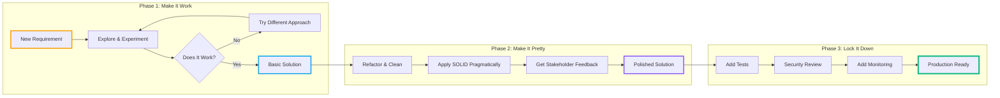
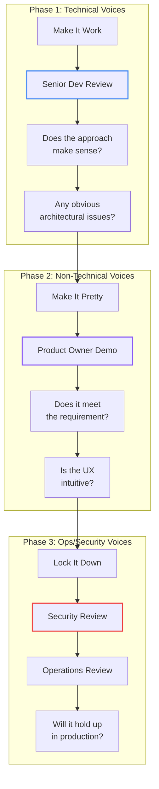
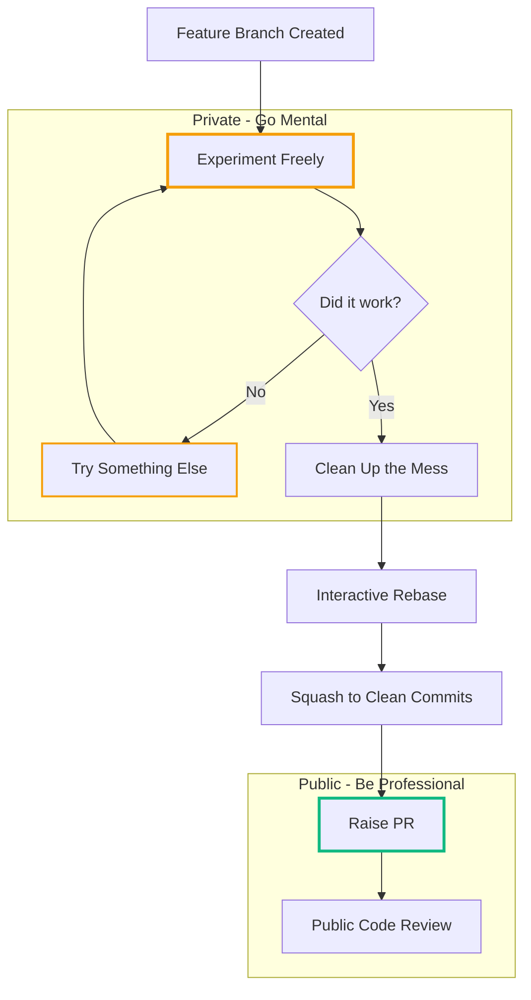

# Playing with Code: An Efficient Agile Approach

<datetime class="hidden">2025-11-23T10:00</datetime>
<!-- category -- Software Development, Agile, Best Practices, Craftsmanship -->

**Why treating your branch as a sandbox—and play as legitimate work—produces better software with less stress.**

> **Hot take:** Most developers are trying to be perfect at every stage of development, and it's killing both their creativity and their productivity. Here's a better way.

## Introduction

I've been building software professionally for... well, let's just say I remember when "Agile" was a new idea and not a corporate buzzword weaponised by project managers to justify more standups.

Over the years, I've noticed something: the best code I've ever written came from projects where I felt *permission to play*. The worst code came from projects where every keystroke felt like it was being scrutinised, where I was trying to write "production-ready" code from minute one.

This isn't accidental. **Creativity and pressure don't mix well.**

So I've developed an approach that separates the messy, creative exploration from the polished, production-ready delivery. I call it "[Make it work, make it pretty, lock it down](/blog/makeitworkthenmakeitpretty)" - but really, it's about giving yourself permission to experiment without the weight of perfection hanging over you.


[TOC]

## The Three Phases

Let me be clear upfront: this isn't about being sloppy or avoiding discipline. It's about *applying the right discipline at the right time*.



### Phase 1: Make It Work

**The mantra:** Play first. Confirm your assumptions. Get something running.

This is the phase where your branch is a sandbox. Messy code is fine. Dead ends are fine. Starting over three times is *fine*. You're not building a cathedral here; you're sketching on a napkin.

What you're trying to figure out:
- Does this API actually behave how the docs claim? (Spoiler: it rarely does)
- Can I even solve this problem with the tools I have?
- What are the actual requirements, not the ones written in the ticket?
- Is this a two-hour problem or a two-week problem?

**The critical insight:** Until you raise a PR, your branch is *yours*. It's your experimental laboratory. Nobody needs to see your false starts, your commented-out debugging code, your "TODO: this is terrible, fix later" comments. But check in OFTEN—every time you have something that works, commit and push. Hook into your CI pipeline; a good pipeline will give you more information (integration tests, breaking changes elsewhere, etc.). It's FINE to check in ugly, barely stitched together franken-code. That's the POINT. Even as a three-decade veteran, I still do this. It frees my mind.

**Side benefit:** Frequent commits are a heartbeat. In remote/async teams, a steady trail of "ugly but progressing" commits reassures everyone that work is moving—without you having to perform productivity in Slack.

This psychological freedom is essential. When you know you can throw everything away and start fresh, you make bolder decisions. You try that weird approach that probably won't work. Sometimes it works brilliantly. Sometimes you need to read an article, watch a YouTube video, think for a while. Remember: your job is to deliver good software and good decisions, not to type fast. Good managers understand you're **NOT A TYPIST**.

```csharp
// Phase 1 code looks like this - and THAT'S OKAY
public async Task<Result> ProcessThing(Request req)
{
    // TODO: what if this is null?
    var data = await _api.GetSomething(req.Id);

    // This probably isn't right but let's see what happens
    var transformed = data.Items
        .Where(x => x.Status != "deleted") // Is this the right filter?
        .Select(x => new Thing { Name = x.Name }); // Missing loads of fields

    // HACK: hardcoded for now
    return new Result { Items = transformed.ToList(), Total = 42 };
}
```

Is this production code? God no. Is it useful? Absolutely. It tells you whether your approach is even viable before you invest hours polishing something that won't work.

**A note on feedback:** You can get feedback at *any* point in Phase 1—the key is choosing *who* gives it. The goal is to build the best feature, not to follow a rigid process.

Building an API that another team will consume? Get them involved early. A quick "does this shape make sense?" conversation can save days of rework. Building something user-facing? Maybe hold off showing the business stakeholder until it's less rough—some people get hung up on how something *looks* rather than whether it *works*. That's fine; they give feedback in Phase 2.

Use your judgement. Sometimes you need feedback to **clarify**, not to approve—the spec already did that. "The spec says 'handle errors gracefully'—does that mean retry three times, or fail fast and notify?" That's a Phase 1 conversation.

If a stakeholder's input is critical but they'd struggle with rough code, build a trivial demo. A hardcoded happy-path that shows the concept can unlock valuable feedback without the distraction of missing edge cases.

Be pragmatic. The aim is the best feature, not process purity.

### Phase 2: Make It Pretty

**The mantra:** Now that you know what you're building, make it *good*.

The exploratory phase has done its job. You've confirmed the approach works, you understand the shape of the problem, and you've probably discovered a dozen edge cases the original ticket didn't mention.

Now you clean it up:

```csharp
// Phase 2: Same logic, but actually maintainable
public async Task<ProcessingResult> ProcessItemsAsync(
    ProcessingRequest request,
    CancellationToken cancellationToken = default)
{
    ArgumentNullException.ThrowIfNull(request);

    var items = await _itemRepository.GetActiveItemsAsync(
        request.AccountId,
        cancellationToken);

    var processedItems = items
        .Where(item => item.Status != ItemStatus.Deleted)
        .Select(item => _mapper.ToProcessedItem(item))
        .ToList();

    return new ProcessingResult
    {
        Items = processedItems,
        TotalCount = processedItems.Count,
        ProcessedAt = _timeProvider.UtcNow
    };
}
```

This is where you:
- Apply SOLID principles *pragmatically* (know them, but don't worship them)
- Give things proper names
- Add type hints and XML documentation
- Think about the API surface from the caller's perspective
- Handle the edge cases you discovered in Phase 1

**Critically, this is the best time for non-technical stakeholder feedback.** The feature is now visible and usable, but you haven't yet invested hours writing tests for it. If they say "actually, we wanted it to do X instead," you can pivot without the heartbreak of deleting a comprehensive test suite.

### Phase 3: Lock It Down

**The mantra:** Harden it, test it, make it resilient.

Now—and only now—you write your tests. Add security checks. Implement proper error handling for production edge cases. Add monitoring and guardrails.

Why wait until now? Because **you finally know what you're testing**.

Tests written in Phase 1 would have been wrong—you didn't understand the problem yet. Tests written in Phase 2 would have churn—you were still refining the API. Tests written in Phase 3 are *correct*, because the implementation is stable.

```csharp
[Theory]
[InlineData(0)]
[InlineData(1)]
[InlineData(100)]
public async Task ProcessItemsAsync_WithValidRequest_ReturnsCorrectCount(
    int itemCount)
{
    // Arrange
    var items = _fixture.CreateMany<Item>(itemCount).ToList();
    _mockRepository
        .Setup(r => r.GetActiveItemsAsync(It.IsAny<Guid>(), It.IsAny<CancellationToken>()))
        .ReturnsAsync(items);

    // Act
    var result = await _sut.ProcessItemsAsync(
        new ProcessingRequest { AccountId = Guid.NewGuid() });

    // Assert
    result.TotalCount.Should().Be(itemCount);
    result.Items.Should().HaveCount(itemCount);
}

[Fact]
public async Task ProcessItemsAsync_WithNullRequest_ThrowsArgumentNullException()
{
    // Act & Assert
    await _sut.Invoking(s => s.ProcessItemsAsync(null!))
        .Should().ThrowAsync<ArgumentNullException>();
}

[Fact]
public async Task ProcessItemsAsync_ExcludesDeletedItems()
{
    // Arrange
    var items = new[]
    {
        new Item { Status = ItemStatus.Active },
        new Item { Status = ItemStatus.Deleted },
        new Item { Status = ItemStatus.Active }
    };
    _mockRepository
        .Setup(r => r.GetActiveItemsAsync(It.IsAny<Guid>(), It.IsAny<CancellationToken>()))
        .ReturnsAsync(items);

    // Act
    var result = await _sut.ProcessItemsAsync(
        new ProcessingRequest { AccountId = Guid.NewGuid() });

    // Assert
    result.Items.Should().HaveCount(2);
}
```

This phase also includes:
- Security review (authentication, authorisation, input validation)
- Concurrency considerations (what happens under load?)
- Failure mode analysis (what if the database is slow? What if the API times out?)
- Monitoring (how will we know if this breaks in production?)

## Feedback Choreography

Different people should be involved at different stages. Get this wrong and you'll drown in friction.



**Phase 1:** Technical voices only—senior devs, architects. They can see past the mess to the shape of the solution. Non-technical stakeholders will panic at rough code and ask about button colours when you're still figuring out the data model.

**Phase 2:** Non-technical voices welcome. The feature is usable, buttons do things. Get product owners and designers involved now—changes are still cheap, you haven't written tests yet.

**Phase 3:** Ops and security voices. "What if this gets 10x traffic?" "What if someone passes malicious input?" These concerns only matter once the feature actually works.

## Branches as Sandboxes

Here's the thing that changed my development life: **until you raise a PR, your branch is entirely private**.

That might sound obvious, but I see developers treating every commit like it's going on their permanent record. They're afraid to experiment. Afraid to write ugly code. Afraid to break things.

I want you to think of your feature branch as a sandbox. A playground. A laboratory where explosions are expected and nobody gets hurt.



In practice, this means:
- Commit frequently, even if the code doesn't compile
- Write `FIXME` and `TODO` comments everywhere
- Leave debugging code in place while you're exploring
- Have multiple "try this approach" commits
- Don't worry about commit messages (you'll squash later)

Then, before you raise a PR:
1. Clean up the code (Phase 2)
2. Add tests (Phase 3)
3. Interactive rebase to squash all that messy history
4. Write a proper commit message

The PR reviewers see clean, professional code with a clear narrative. They don't see the six false starts, the 3am "why doesn't this bloody work" commits, or the "undo undo undo" history.

> **The sandbox stays private. The polished work goes public.**

## Why This Reduces Stress

Traditional "be professional at all times" development is crushing. Every line feels permanent. Every decision feels consequential. This approach removes that pressure by containing the chaos: **play is legitimate work** in Phase 1, feedback comes when pivoting is cheap in Phase 2, and tests are written once correctly in Phase 3 because you finally know what you're testing.

> **"Play is legitimate work."**

TDD works brilliantly when the domain is well understood or you're pinning down a known bug. But when the problem is still fuzzy, writing tests first often means testing the wrong thing three times in a row. This approach sidesteps that: explore first, test when stable.

## Pragmatic SOLID (And DRY's Dirty Secret)

So what does this three-phase mindset do to your design principles? In short: it kills dogma. Here's how it changes my thinking about SOLID, DRY, and interfaces in C#.

I mentioned applying SOLID principles "pragmatically" in Phase 2. Let me be specific about what I mean.

SOLID is a good set of principles. I teach them. I use them. But I've seen teams disappear down abstraction rabbit holes in the name of Single Responsibility or Open/Closed, creating systems so flexible they're incomprehensible.

Here's my heuristic:

**Apply SOLID when:**
- You have evidence you'll need the flexibility
- The abstraction makes the code clearer
- You're building something others will use

**Don't apply SOLID when:**
- You're speculating about future requirements
- The abstraction adds complexity without clarity
- You're building internal code that only you maintain

Three similar lines of code are better than a premature abstraction. You can always extract later when you see the pattern clearly. You can't easily undo an abstraction that's baked into your architecture.

```csharp
// Over-engineered SOLID worship
public interface IThingProcessor { }
public interface IThingProcessorFactory { }
public class ThingProcessorFactory : IThingProcessorFactory { }
public class ThingProcessor : IThingProcessor { }
public class ThingProcessorDecorator : IThingProcessor { }
public class ThingProcessorValidationDecorator : IThingProcessor { }

// What you probably actually need
public class ThingProcessor
{
    public async Task<Result> ProcessAsync(Thing thing)
    {
        // Just do the thing
    }
}
```

If you need the flexibility later, refactoring is cheap. Over-engineering upfront is expensive because you're maintaining abstraction layers that aren't earning their keep.

### The DRY Trap

And while we're slaying sacred cows, let's talk about **DRY** (Don't Repeat Yourself). It's perhaps the most dogmatically applied principle in our industry, and when applied without thought, it causes more harm than good.

The problem is this: **not all duplication is the same kind of duplication**.

When two pieces of code look similar but serve different purposes, extracting them into a shared abstraction couples things that should evolve independently. Now when one use case needs to change, you're either:
1. Adding parameters and conditionals to handle both cases (making the abstraction worse)
2. Breaking the other use case
3. Copying the shared code back out and editing it (admitting DRY was wrong here)

```csharp
// "DRY" solution - looks clever, causes pain
public async Task<Result> ProcessEntity<T>(
    T entity,
    bool validateFirst = true,
    bool sendNotification = false,
    Func<T, bool>? customFilter = null,
    Action<T>? preProcess = null,
    Action<T>? postProcess = null) where T : IEntity
{
    // 50 lines of conditional spaghetti trying to handle
    // "processing" for Users, Orders, and Products
    // because they all had 3 similar lines once
}

// What you probably actually need
public async Task<Result> ProcessUser(User user) { /* 15 clear lines */ }
public async Task<Result> ProcessOrder(Order order) { /* 15 clear lines */ }
public async Task<Result> ProcessProduct(Product product) { /* 15 clear lines */ }
```

Yes, there's some "duplication" in the second approach. But each method is:
- Easy to understand in isolation
- Easy to modify without side effects
- Easy to delete when that entity type goes away
- Easy to test with clear inputs and outputs

The DRY version is a nightmare to maintain because it's trying to be all things to all callers. Every change requires understanding all the use cases. Every bug fix risks breaking something else.

**My rule:** Tolerate duplication until you've seen the *same* thing three times and you're confident it represents the *same* concept that will evolve together. Until then, a bit of copy-paste is fine. It's not a moral failing; it's appropriate caution.

Duplication is far cheaper than the wrong abstraction. You can always deduplicate later when the pattern is clear. You can't easily undo a bad abstraction that's woven through your codebase.

### The Interface Problem in C#

Here's another sacred cow that needs slaughtering: **the "every class needs an interface" pattern**.

Back in the early days of .NET dependency injection, someone decided that to make code testable, you needed to inject interfaces everywhere. The logic was: you can't mock a concrete class, so every service needs `IService` and `ServiceImpl`. Suddenly every C# codebase was littered with single-implementation interfaces that existed purely for testing.

```csharp
// The interface tax - early 2010s style
public interface IUserService { }
public interface IOrderService { }
public interface IEmailService { }
public interface INotificationService { }
public interface IPaymentProcessor { }
public interface IInventoryManager { }

// Each with exactly ONE implementation
public class UserService : IUserService { }
public class OrderService : IOrderService { }
// ... you get the idea
```

This was cargo cult programming. We were paying a complexity tax for *theoretical* testability and *theoretical* future flexibility that rarely materialised.

**Here's the thing: you don't need this anymore.**

Modern mocking frameworks like [NSubstitute](https://nsubstitute.github.io/) and [Moq](https://github.com/moq/moq4) can mock concrete classes (with virtual methods). More importantly, ASP.NET Core's DI container works perfectly well with concrete types:

```csharp
// Modern approach - just register the concrete type
services.AddScoped<UserService>();
services.AddScoped<OrderService>();
services.AddScoped<EmailService>();

// In your controller or service
public class OrderController(OrderService orderService, UserService userService)
{
    // Primary constructor injection - clean and simple
}
```

No interfaces. No `IOrderService`. Just the service you need, injected directly.

**"But what about testing?"** I hear you cry.

For unit tests, you have options:
1. Make key methods `virtual` and use a mocking framework
2. Use the real service with a test database (integration tests are often more valuable anyway)
3. Add an interface *when you actually need it for testing*

That third point is crucial: **refactoring tools are extraordinarily good at extracting interfaces**.

In Rider or Visual Studio, it's literally `Ctrl+.` → "Extract Interface" and you're done. Every method gets extracted, the class gets updated to implement it, and you can find/replace all usages if needed. It takes seconds.

```csharp
// Phase 1 & 2: Just write the class
public class OrderService
{
    public async Task<Order> CreateOrderAsync(CreateOrderRequest request) { ... }
    public async Task<Order?> GetOrderAsync(int orderId) { ... }
    public async Task CancelOrderAsync(int orderId) { ... }
}

// Phase 3: Need to mock it for testing? Extract interface in 2 seconds
public interface IOrderService
{
    Task<Order> CreateOrderAsync(CreateOrderRequest request);
    Task<Order?> GetOrderAsync(int orderId);
    Task CancelOrderAsync(int orderId);
}

public class OrderService : IOrderService { ... }
```

My workflow now: **interfaces come in Phase 3, not Phase 1**.

During "make it work" and "make it pretty", I just write classes. No premature abstraction. No interface tax on every type. The code is simpler, easier to navigate (no jumping between `IFoo` and `Foo`), and faster to write.

When I hit "lock it down" and need to write tests, *then* I decide which services actually need mocking. Usually it's fewer than you'd think—often just external integrations like HTTP clients, databases, and message queues.

For internal business logic services? Half the time I just test them directly with real dependencies. The tests are more valuable anyway because they test the actual behaviour, not a mock of what I *think* the behaviour should be.

```csharp
// Services I typically DO extract interfaces for (external boundaries)
public interface IPaymentGateway { }      // Third-party API
public interface IEmailSender { }         // External service
public interface IBlobStorage { }         // Cloud storage

// Services I typically DON'T need interfaces for (internal logic)
public class OrderValidator { }           // Pure logic, test directly
public class PriceCalculator { }          // Pure logic, test directly
public class OrderService { }             // Test with real repo + in-memory DB
```

**The point is:** stop writing interfaces upfront "just in case". Write concrete classes. If you need an interface for testing or genuine polymorphism later, extracting one takes literally seconds with modern tooling.

Your codebase will be simpler, more navigable, and you won't have the maintenance burden of keeping interfaces in sync with implementations for no benefit.

## The Agile Connection

Ironically, this approach is more aligned with the *original* Agile manifesto than most "Agile" processes I've encountered. Working software fast (Phase 1). Responding to change (Phases 1-2). Customer collaboration when the feature is demonstrable (Phase 2). No sprint points, no velocity tracking, no bloody burndown charts.

Modern "Agile" has been captured by process enthusiasts who've added so many ceremonies there's no time left for exploration. This approach brings play back—not as an indulgence, but as a legitimate phase of creative work.

## When NOT to Use This Approach

I should be honest: this isn't always the right approach.

**Bug fixes:** When you're fixing a known bug, TDD style makes more sense. Write a test that reproduces the bug, fix it, done.

**Well-understood problems:** If you're implementing a standard algorithm or a pattern you've used a hundred times, you don't need an exploration phase.

**Tight deadlines with known requirements:** If you genuinely know exactly what you're building and when it needs to ship, you might skip Phase 1 exploration.

**Highly regulated environments:** If every commit needs sign-off, sandboxing is harder. Though you can still do the exploration locally before pushing.

But for *most* feature development—where requirements are a bit fuzzy, the technical approach isn't obvious, and you need space to think—this approach works brilliantly.

## A Note for Junior Developers

If you're early in your career, you might feel pressure to show "perfect" code all the time. You don't have to. Use this three-phase approach—just be clear about which phase you're in, and always finish the job all the way to Phase 3. Nobody will fault you for messy exploration code if it leads to polished, tested, production-ready code at the end.

## Bottom Line

**Make it work, make it pretty, lock it down.**

Start simple. Design with foresight but not speculation. Iterate quickly. Only add complexity when it pays off.

> **"Duplication is far cheaper than the wrong abstraction."**

The exploration phase isn't a guilty secret—it's a defined part of the process. Your branch is your sandbox until you raise a PR. Technical feedback comes early, non-technical feedback comes mid, ops and security feedback comes late.

This keeps creativity alive, reduces stress, and produces systems that scale elegantly—because you understood the problem before you committed to the solution.

> **Stop trying to be perfect from minute one. Give yourself permission to play.**

---

## Related Reading

If this resonates, you might also enjoy these related posts:

- **[How I Build Software](/blog/makeitworkthenmakeitpretty)** - Goes deeper into the testing philosophy behind this approach, with detailed code examples of the three phases.
- **[Daily Standups Are Bullshit (Unless They Earn Their Pay)](/blog/agile-standups-ceremony-tax)** - My take on why ceremony is tax, and how to evaluate whether your agile rituals are earning their keep.
- **[Agile Speccing: Writing Feature Specs That Actually Work](/blog/writingfeaturespecs)** - Because specs are tools, not bibles—and treating them as living documents is the only way to build the right thing.
- **[Working on Legacy Codebases](/blog/workingonlegacysystems)** - Practical lessons from decades of contractor life, including how to apply these principles when you're learning a system you didn't build.
