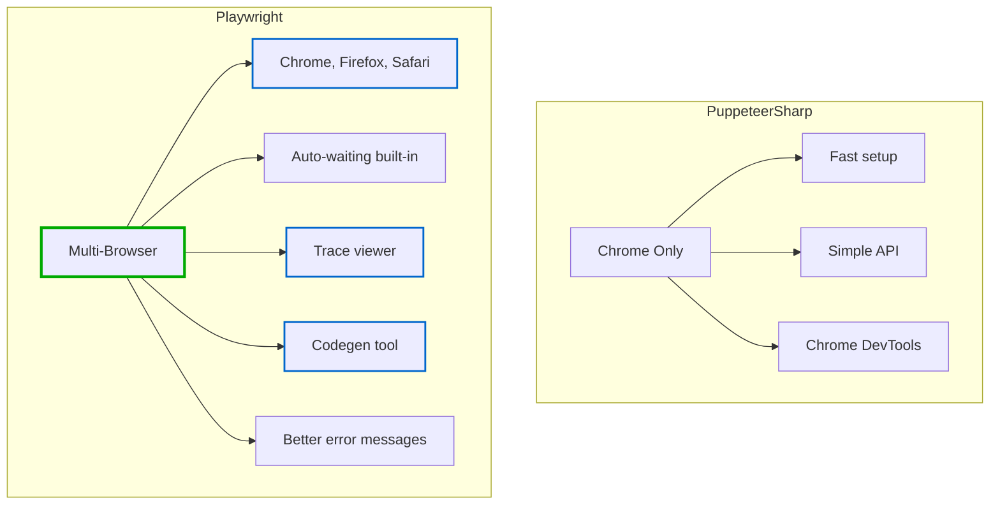
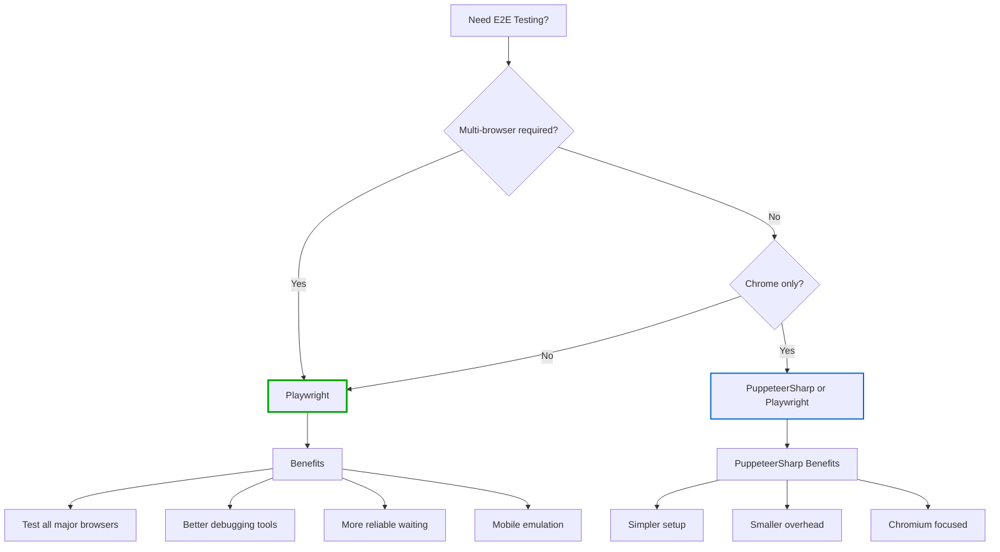

# Multi-Browser E2E Testing with Playwright for .NET

<datetime class="hidden">2025-11-26T14:00</datetime>

<!--category-- Playwright, E2E Testing, xUnit, Testing, Multi-Browser -->

## Lead

Playwright is Microsoft's official solution for modern browser automation, offering multi-browser support (Chrome, Firefox, Safari) with a single API, built-in trace debugging, and mobile emulation. This guide covers everything from setup to advanced testing patterns, comparing it with PuppeteerSharp to help you choose the right tool. If you only need Chrome and want simpler setup, consider [PuppeteerSharp](/blog/puppeteersharp-e2e-testing) instead - but if you need comprehensive cross-browser testing, Playwright is the way forward.

## Introduction

If you've read my article on [PuppeteerSharp](/blog/puppeteersharp-e2e-testing), you'll know I'm a fan of modern E2E testing tools that don't make you want to tear your hair out. PuppeteerSharp is brilliant for Chrome-only testing, but what if you need to test across multiple browsers? That's where [Playwright](https://playwright.dev/) comes in.

Playwright is Microsoft's answer to the browser automation problem, and they've learned from everything that came before. It's like PuppeteerSharp's more ambitious sibling - it does everything Puppeteer does, but adds Firefox and Safari support, better auto-waiting, and a host of debugging tools that make finding issues an absolute doddle.

In this article, I'll show you how to use Playwright for .NET to test across Chrome, Firefox, and Safari, with real code examples and practical patterns you can use today.

[TOC]

## Why Playwright Over PuppeteerSharp?

Don't get me wrong - [PuppeteerSharp](/blog/puppeteersharp-e2e-testing) is excellent if you only need Chrome. But here's when Playwright makes sense:

### The Multi-Browser Problem

Your users don't all use Chrome. They use:
- **Chrome/Edge**: ~65% of users (Chromium-based)
- **Safari**: ~20% of users (especially mobile)
- **Firefox**: ~5% of users (but often different rendering)

A bug that only appears in Safari can lose you 20% of your potential users. Playwright lets you test all three with the same API.

### Better Developer Experience



### Key Advantages

1. **Multi-browser support** - Test Chrome, Firefox, Safari with identical code
2. **Better auto-waiting** - More reliable out of the box, fewer flaky tests
3. **Trace viewer** - Record full traces of test runs for debugging
4. **Codegen** - Generate test code by interacting with your site
5. **Network interception** - More powerful than PuppeteerSharp
6. **Modern web features** - Better support for Shadow DOM, iframes, etc.

## Setting Up Playwright for .NET

Install the [Microsoft.Playwright](https://www.nuget.org/packages/Microsoft.Playwright) NuGet package:

```bash
dotnet add package Microsoft.Playwright
dotnet add package Microsoft.Playwright.NUnit  # Or use xUnit
```

Then install the browsers (this downloads [Chromium](https://www.chromium.org/), [Firefox](https://www.mozilla.org/firefox/), and [WebKit](https://webkit.org/)):

```bash
pwsh bin/Debug/net9.0/playwright.ps1 install
```

Or on Linux/Mac:

```bash
playwright install
```

**Note:** The first browser install downloads around 400MB. Subsequent updates are much smaller.

Here's my test project configuration:

```xml
<PackageReference Include="Microsoft.Playwright" Version="1.48.0" />
<PackageReference Include="Microsoft.Playwright.NUnit" Version="1.48.0" />
<PackageReference Include="xunit" Version="2.9.3" />
<PackageReference Include="xunit.runner.visualstudio" Version="3.1.4">
  <PrivateAssets>all</PrivateAssets>
  <IncludeAssets>runtime; build; native; contentfiles; analyzers; buildtransitive</IncludeAssets>
</PackageReference>
```

I'm using [xUnit](https://xunit.net/), but Playwright works equally well with [NUnit](https://nunit.org/) or [MSTest](https://learn.microsoft.com/en-us/dotnet/core/testing/unit-testing-with-mstest). In fact, Playwright has a dedicated [NUnit integration](https://playwright.dev/dotnet/docs/test-runners#nunit) with additional helpers.

## Creating a Base Test Class

Similar to [PuppeteerSharp](/blog/puppeteersharp-e2e-testing#creating-a-base-test-class), but with multi-browser support:

### The Class Structure

```csharp
using Microsoft.Playwright;
using Xunit.Abstractions;

namespace Mostlylucid.Test.E2E;

public abstract class PlaywrightTestBase : IAsyncLifetime
{
    protected IPlaywright Playwright = null!;
    protected IBrowser Browser = null!;
    protected IBrowserContext Context = null!;
    protected IPage Page = null!;

    protected readonly ITestOutputHelper Output;
    protected const string BaseUrl = "http://localhost:8080";

    // Override this in derived classes to test different browsers
    protected virtual BrowserType BrowserType => BrowserType.Chromium;

    protected PlaywrightTestBase(ITestOutputHelper output)
    {
        Output = output;
    }

    public async Task InitializeAsync()
    {
        // Create Playwright instance
        Playwright = await Microsoft.Playwright.Playwright.CreateAsync();

        // Launch the specified browser
        Browser = await LaunchBrowserAsync();

        // Create a new context (like an incognito window)
        Context = await Browser.NewContextAsync(new BrowserNewContextOptions
        {
            ViewportSize = new ViewportSize { Width = 1400, Height = 900 },
            IgnoreHTTPSErrors = true
        });

        // Create a new page
        Page = await Context.NewPageAsync();

        // Set default timeout
        Page.SetDefaultTimeout(30000);
    }

    private async Task<IBrowser> LaunchBrowserAsync()
    {
        var options = new BrowserTypeLaunchOptions
        {
            Headless = true, // Set to false for debugging
        };

        return BrowserType switch
        {
            BrowserType.Chromium => await Playwright.Chromium.LaunchAsync(options),
            BrowserType.Firefox => await Playwright.Firefox.LaunchAsync(options),
            BrowserType.Webkit => await Playwright.Webkit.LaunchAsync(options),
            _ => throw new ArgumentException($"Unknown browser type: {BrowserType}")
        };
    }

    public async Task DisposeAsync()
    {
        await Page?.CloseAsync()!;
        await Context?.CloseAsync()!;
        await Browser?.CloseAsync()!;
        Playwright?.Dispose();
    }
}

public enum BrowserType
{
    Chromium,
    Firefox,
    Webkit
}
```

### Why Browser Contexts?

Notice we create a `Context` before creating a `Page`. This is a Playwright concept that PuppeteerSharp doesn't have:

- **Context** = Isolated browser session (like incognito mode)
- **Page** = A tab within that context

Contexts let you:
- Test with different user sessions simultaneously
- Set different cookies, permissions, or locale per context
- Isolate tests completely (even within the same browser instance)

### Helper Methods

```csharp
// Navigation with better waiting
protected async Task NavigateAsync(string path)
{
    var url = path.StartsWith("http") ? path : $"{BaseUrl}{path}";
    await Page.GotoAsync(url, new PageGotoOptions
    {
        WaitUntil = WaitUntilState.NetworkIdle
    });
}

// Playwright has better built-in waiting, but these are still useful
protected async Task<IElementHandle?> WaitForSelectorAsync(string selector)
{
    try
    {
        return await Page.WaitForSelectorAsync(selector, new PageWaitForSelectorOptions
        {
            State = WaitForSelectorState.Visible
        });
    }
    catch (TimeoutException)
    {
        return null;
    }
}

// Improved element operations with auto-waiting
protected async Task<bool> ElementExistsAsync(string selector)
{
    return await Page.Locator(selector).CountAsync() > 0;
}

protected async Task<string?> GetTextContentAsync(string selector)
{
    var locator = Page.Locator(selector);
    return await locator.TextContentAsync();
}

protected async Task TypeAsync(string selector, string text)
{
    await Page.Locator(selector).FillAsync(text);
}

protected async Task ClickAsync(string selector)
{
    await Page.Locator(selector).ClickAsync();
}
```

### Locators - Playwright's Secret Weapon

Notice the `Page.Locator()` calls? This is different from PuppeteerSharp's `QuerySelector`. Locators are:

- **Lazy** - They don't query the DOM until you use them
- **Retrying** - They automatically wait and retry operations
- **Strict** - They error if multiple elements match (preventing flaky tests)

```csharp
// PuppeteerSharp way (manual waiting)
await Page.WaitForSelectorAsync("#button");
await Page.ClickAsync("#button");

// Playwright way (auto-waiting)
await Page.Locator("#button").ClickAsync(); // Waits automatically!
```

## Multi-Browser Testing

Here's where Playwright shines. You can run the same test across all browsers:

### Using xUnit Theory for Multi-Browser Tests

```csharp
public class CrossBrowserTests : PlaywrightTestBase
{
    public CrossBrowserTests(ITestOutputHelper output) : base(output) { }

    [Theory]
    [InlineData(BrowserType.Chromium)]
    [InlineData(BrowserType.Firefox)]
    [InlineData(BrowserType.Webkit)]
    public async Task HomePage_LoadsCorrectly_InAllBrowsers(BrowserType browserType)
    {
        // Override the browser type for this test
        BrowserType = browserType;
        await InitializeAsync();

        // Arrange & Act
        await NavigateAsync("/");

        // Assert
        var title = await Page.TitleAsync();
        Assert.Contains("Mostlylucid", title);

        Output.WriteLine($"✓ Test passed in {browserType}");
    }
}
```

### Browser-Specific Test Classes

Or create separate test classes for each browser:

```csharp
public class ChromiumTests : PlaywrightTestBase
{
    protected override BrowserType BrowserType => BrowserType.Chromium;

    public ChromiumTests(ITestOutputHelper output) : base(output) { }

    [Fact]
    public async Task FilterBar_WorksInChrome()
    {
        await NavigateAsync("/blog");

        await Page.Locator("#LanguageDropDown button").ClickAsync();
        await Page.Locator("#LanguageDropDown li:has-text('Spanish')").ClickAsync();

        var url = Page.Url;
        Assert.Contains("language=es", url);
    }
}

public class FirefoxTests : PlaywrightTestBase
{
    protected override BrowserType BrowserType => BrowserType.Firefox;

    public FirefoxTests(ITestOutputHelper output) : base(output) { }

    [Fact]
    public async Task FilterBar_WorksInFirefox()
    {
        // Same test, different browser!
        await NavigateAsync("/blog");

        await Page.Locator("#LanguageDropDown button").ClickAsync();
        await Page.Locator("#LanguageDropDown li:has-text('Spanish')").ClickAsync();

        var url = Page.Url;
        Assert.Contains("language=es", url);
    }
}

public class SafariTests : PlaywrightTestBase
{
    protected override BrowserType BrowserType => BrowserType.Webkit;

    public SafariTests(ITestOutputHelper output) : base(output) { }

    [Fact]
    public async Task FilterBar_WorksInSafari()
    {
        await NavigateAsync("/blog");

        await Page.Locator("#LanguageDropDown button").ClickAsync();
        await Page.Locator("#LanguageDropDown li:has-text('Spanish')").ClickAsync();

        var url = Page.Url;
        Assert.Contains("language=es", url);
    }
}
```

## Writing Tests - The Playwright Way

Let's look at real examples showing Playwright's advantages:

### Testing HTMX with Auto-Waiting

```csharp
[Fact]
public async Task SortingDropdown_UpdatesContentViaHTMX()
{
    // Arrange
    await NavigateAsync("/blog");

    // Get first post title before sorting
    var firstPostBefore = await Page.Locator("article h2 a").First.TextContentAsync();
    Output.WriteLine($"First post before: {firstPostBefore}");

    // Act - Change sort order
    await Page.Locator("#orderSelect").SelectOptionAsync("date_asc");

    // Playwright automatically waits for HTMX to update the DOM!
    await Page.WaitForLoadStateAsync(LoadState.NetworkIdle);

    // Assert - Content should have changed
    var firstPostAfter = await Page.Locator("article h2 a").First.TextContentAsync();
    Output.WriteLine($"First post after: {firstPostAfter}");

    var selectValue = await Page.Locator("#orderSelect").InputValueAsync();
    Assert.Equal("date_asc", selectValue);
}
```

### Testing Alpine.js Interactions

Playwright handles [Alpine.js](https://alpinejs.dev/) reactivity and animations seamlessly:

```csharp
[Fact]
public async Task AlpineDropdown_OpensAndCloses()
{
    await NavigateAsync("/blog");

    // Click to open dropdown (Alpine.js controlled)
    await Page.Locator("#LanguageDropDown button").ClickAsync();

    // Wait for Alpine.js animation
    await Page.WaitForSelectorAsync("#LanguageDropDown div[x-show]", new()
    {
        State = WaitForSelectorState.Visible
    });

    // Check dropdown is visible
    var isVisible = await Page.Locator("#LanguageDropDown div[x-show]").IsVisibleAsync();
    Assert.True(isVisible);

    // Click outside to close
    await Page.Locator("body").ClickAsync(new LocatorClickOptions
    {
        Position = new Position { X = 0, Y = 0 }
    });

    // Verify closed
    await Page.WaitForSelectorAsync("#LanguageDropDown div[x-show]", new()
    {
        State = WaitForSelectorState.Hidden
    });

    isVisible = await Page.Locator("#LanguageDropDown div[x-show]").IsVisibleAsync();
    Assert.False(isVisible);
}
```

### Testing Forms with Validation

```csharp
[Fact]
public async Task CommentForm_ValidatesRequiredFields()
{
    await NavigateAsync("/blog/some-post");

    // Try to submit without filling fields
    await Page.Locator("#comment-submit").ClickAsync();

    // Check HTML5 validation messages
    var nameInput = Page.Locator("#comment-name");
    var validationMessage = await nameInput.EvaluateAsync<string>("el => el.validationMessage");

    Assert.NotEmpty(validationMessage);
    Output.WriteLine($"Validation message: {validationMessage}");

    // Fill form properly
    await nameInput.FillAsync("Test User");
    await Page.Locator("#comment-email").FillAsync("test@example.com");
    await Page.Locator("#comment-content").FillAsync("Great article!");

    // Submit
    await Page.Locator("#comment-submit").ClickAsync();

    // Wait for success
    await Page.Locator(".comment-success").WaitForAsync();
}
```

## Advanced Playwright Features

### Network Interception - More Powerful Than PuppeteerSharp

```csharp
[Fact]
public async Task PageLoadsWithoutImages_ToTestPerformance()
{
    // Block all image requests
    await Page.RouteAsync("**/*.{png,jpg,jpeg,gif,webp}", route => route.AbortAsync());

    await NavigateAsync("/blog");

    // Page should still function without images
    var title = await Page.Locator("h1").TextContentAsync();
    Assert.NotEmpty(title);
}

[Fact]
public async Task MockAPIResponse_ForTesting()
{
    // Intercept API calls and return mock data
    await Page.RouteAsync("**/api/posts", route => route.FulfillAsync(new()
    {
        Status = 200,
        ContentType = "application/json",
        Body = System.Text.Json.JsonSerializer.Serialize(new
        {
            posts = new[]
            {
                new { id = 1, title = "Mock Post 1" },
                new { id = 2, title = "Mock Post 2" }
            }
        })
    }));

    await NavigateAsync("/blog");

    // Should show mock data
    var posts = await Page.Locator(".post-title").CountAsync();
    Assert.Equal(2, posts);
}
```

### Trace Viewer - Debug Failed Tests

```csharp
public async Task InitializeAsync()
{
    Playwright = await Microsoft.Playwright.Playwright.CreateAsync();
    Browser = await LaunchBrowserAsync();

    // Start tracing
    Context = await Browser.NewContextAsync();
    await Context.Tracing.StartAsync(new()
    {
        Screenshots = true,
        Snapshots = true,
        Sources = true
    });

    Page = await Context.NewPageAsync();
}

public async Task DisposeAsync()
{
    // Save trace on test completion
    var tracePath = Path.Combine("traces", $"{TestContext.TestName}.zip");
    await Context.Tracing.StopAsync(new()
    {
        Path = tracePath
    });

    // View trace with: playwright show-trace traces/TestName.zip

    await Page?.CloseAsync()!;
    await Context?.CloseAsync()!;
    await Browser?.CloseAsync()!;
    Playwright?.Dispose();
}
```

Then view the trace:

```bash
playwright show-trace traces/TestName.zip
```

This opens a UI showing:
- Every action your test took
- Screenshots at each step
- Network requests
- Console logs
- DOM snapshots

It's absolutely brilliant for debugging.

### Screenshots on Failure

```csharp
public async Task DisposeAsync()
{
    // Take screenshot if test failed
    if (TestContext.CurrentTestOutcome != TestOutcome.Passed)
    {
        var screenshot = await Page.ScreenshotAsync();
        File.WriteAllBytes($"failure-{TestContext.TestName}.png", screenshot);
        Output.WriteLine($"Screenshot saved: failure-{TestContext.TestName}.png");
    }

    await Page?.CloseAsync()!;
    await Context?.CloseAsync()!;
    await Browser?.CloseAsync()!;
    Playwright?.Dispose();
}
```

### Mobile Emulation

```csharp
[Fact]
public async Task BlogPage_WorksOnMobile()
{
    // Create context with mobile emulation
    var iPhone = Playwright.Devices["iPhone 13"];
    await using var context = await Browser.NewContextAsync(iPhone);
    await using var page = await context.NewPageAsync();

    await page.GotoAsync($"{BaseUrl}/blog");

    // Check mobile menu is visible
    var mobileMenu = page.Locator(".mobile-menu");
    await Expect(mobileMenu).ToBeVisibleAsync();

    // Desktop menu should be hidden
    var desktopMenu = page.Locator(".desktop-menu");
    await Expect(desktopMenu).Not.ToBeVisibleAsync();
}
```

Playwright comes with [device descriptors](https://playwright.dev/dotnet/docs/emulation#devices) for:
- iPhone 13, 13 Pro, 12, 11, SE
- iPad, iPad Pro
- Samsung Galaxy, Pixel
- And many more

### Testing Dark Mode

```csharp
[Fact]
public async Task DarkMode_TogglesCorrectly()
{
    // Start with dark color scheme
    await using var context = await Browser.NewContextAsync(new()
    {
        ColorScheme = ColorScheme.Dark
    });
    await using var page = await context.NewPageAsync();

    await page.GotoAsync($"{BaseUrl}");

    // Check dark mode is active
    var isDark = await page.EvaluateAsync<bool>(
        "() => window.matchMedia('(prefers-color-scheme: dark)').matches"
    );
    Assert.True(isDark);

    // Check background color reflects dark mode
    var bgColor = await page.Locator("body").EvaluateAsync<string>(
        "el => getComputedStyle(el).backgroundColor"
    );
    Assert.Contains("rgb(0, 0, 0)", bgColor); // Dark background
}
```

## Playwright vs PuppeteerSharp - Side by Side

Here's the same test in both libraries to show the differences:

### PuppeteerSharp Version

```csharp
[Fact]
public async Task FilterTest_PuppeteerSharp()
{
    await Page.GoToAsync("http://localhost:8080/blog");

    // Manual waiting required
    await Page.WaitForSelectorAsync("#LanguageDropDown button");
    await Page.ClickAsync("#LanguageDropDown button");

    // Wait for dropdown animation
    await Task.Delay(300);

    // Click Spanish option
    await Page.WaitForSelectorAsync("#LanguageDropDown li:nth-child(2) a");
    await Page.ClickAsync("#LanguageDropDown li:nth-child(2) a");

    // Wait for navigation
    await Task.Delay(500);

    // Check URL
    var url = Page.Url;
    Assert.Contains("language=", url);
}
```

### Playwright Version

```csharp
[Fact]
public async Task FilterTest_Playwright()
{
    await Page.GotoAsync("http://localhost:8080/blog");

    // Auto-waiting built in
    await Page.Locator("#LanguageDropDown button").ClickAsync();

    // Click Spanish option (waits automatically for visibility)
    await Page.Locator("#LanguageDropDown li:has-text('Spanish')").ClickAsync();

    // Check URL (waits automatically for navigation)
    await Expect(Page).ToHaveURLAsync(new Regex(".*language=.*"));
}
```

Notice:
- No manual `WaitForSelectorAsync` needed
- No `Task.Delay` needed
- Cleaner assertions with `Expect`
- More readable with `has-text` selector

## PDF Generation with Playwright

Like PuppeteerSharp, Playwright can generate PDFs. The API is nearly identical:

```csharp
public async Task<byte[]> GeneratePdfAsync(string url)
{
    await using var browser = await Playwright.Chromium.LaunchAsync();
    await using var page = await browser.NewPageAsync();
    await page.GotoAsync(url);

    return await page.PdfAsync(new()
    {
        Format = "A4",
        PrintBackground = true,
        Margin = new()
        {
            Top = "20mm",
            Right = "20mm",
            Bottom = "20mm",
            Left = "20mm"
        }
    });
}
```

The same [PDF gotchas from the PuppeteerSharp article](/blog/puppeteersharp-e2e-testing#pdf-generation-gotchas) apply here too.

## When to Choose Playwright



**Choose Playwright when:**
- You need multi-browser testing
- You want better debugging tools (trace viewer)
- You're testing complex modern web apps
- You need mobile emulation
- You want more reliable tests out of the box

**Choose PuppeteerSharp when:**
- Chrome/Edge only is fine
- You want simpler setup
- You're already familiar with Puppeteer
- You need slightly less resource overhead

## Running in CI/CD

### GitHub Actions Example

Playwright works seamlessly in CI/CD pipelines. Here's a complete [GitHub Actions](https://github.com/features/actions) workflow:

```yaml
name: Playwright Tests

on:
  push:
    branches: [ main ]
  pull_request:
    branches: [ main ]

jobs:
  test:
    runs-on: ubuntu-latest

    steps:
    - uses: actions/checkout@v3

    - name: Setup .NET
      uses: actions/setup-dotnet@v3
      with:
        dotnet-version: '9.0.x'

    - name: Install dependencies
      run: dotnet restore

    - name: Build
      run: dotnet build --no-restore

    - name: Install Playwright browsers
      run: pwsh Mostlylucid.Test/bin/Debug/net9.0/playwright.ps1 install --with-deps

    - name: Start application
      run: |
        dotnet run --project Mostlylucid/Mostlylucid.csproj &
        echo $! > app.pid

    - name: Wait for application
      run: |
        timeout 60 bash -c 'until curl -f http://localhost:8080/health; do sleep 2; done'

    - name: Run Playwright tests
      run: |
        dotnet test Mostlylucid.Test/Mostlylucid.Test.csproj \
          --filter "Category=E2E" \
          --logger "console;verbosity=detailed"

    - name: Upload test results
      if: always()
      uses: actions/upload-artifact@v3
      with:
        name: playwright-results
        path: |
          **/test-results/
          **/traces/

    - name: Stop application
      if: always()
      run: kill $(cat app.pid) || true
```

### Docker Support

Running Playwright tests in [Docker](https://www.docker.com/) requires installing system dependencies:

```dockerfile
FROM mcr.microsoft.com/dotnet/sdk:9.0 AS build

# Install Playwright dependencies
RUN apt-get update && apt-get install -y \
    libnss3 \
    libnspr4 \
    libatk1.0-0 \
    libatk-bridge2.0-0 \
    libcups2 \
    libdrm2 \
    libxkbcommon0 \
    libxcomposite1 \
    libxdamage1 \
    libxfixes3 \
    libxrandr2 \
    libgbm1 \
    libasound2

WORKDIR /app
COPY . .

RUN dotnet restore
RUN dotnet build
RUN pwsh Mostlylucid.Test/bin/Debug/net9.0/playwright.ps1 install

CMD ["dotnet", "test"]
```

## Performance Comparison

From my testing on this blog:

| Feature | PuppeteerSharp | Playwright |
|---------|---------------|------------|
| **Chrome test speed** | ~2.5s | ~2.8s |
| **Multi-browser** | ❌ | ✓ (adds ~1s per browser) |
| **Auto-waiting reliability** | Good (manual) | Excellent (automatic) |
| **Memory per browser** | ~150MB | ~180MB |
| **Setup complexity** | Simple | Moderate |
| **Debugging tools** | Chrome DevTools | Trace Viewer + DevTools |
| **Mobile emulation** | Basic | Excellent |

Playwright is slightly slower and uses slightly more memory, but the reliability and debugging benefits usually outweigh this.

## Common Gotchas

### 1. Strict Mode

Playwright's locators are strict by default:

```csharp
// This errors if multiple buttons exist
await Page.Locator("button").ClickAsync();

// Be specific
await Page.Locator("button#submit").ClickAsync();

// Or use .First if you really want the first match
await Page.Locator("button").First.ClickAsync();
```

### 2. Browser Installation

Don't forget to run `playwright install` after adding the package. The browsers aren't included in the NuGet package.

### 3. Context vs Page

Remember contexts isolate tests:

```csharp
// Bad - state leaks between tests
await Page.GotoAsync("/login");
// Do stuff...
await Page.GotoAsync("/dashboard");
// Previous login state might still exist

// Good - fresh context per test
await using var context = await Browser.NewContextAsync();
await using var page = await context.NewPageAsync();
// Completely isolated
```

### 4. Webkit Differences

Safari (WebKit) can behave differently:

```csharp
// May work in Chrome but fail in WebKit
await Page.Locator(".dropdown").Hover();
await Page.Locator(".dropdown-item").ClickAsync();

// More reliable across browsers
await Page.Locator(".dropdown").ClickAsync();
await Page.WaitForSelectorAsync(".dropdown-item");
await Page.Locator(".dropdown-item").ClickAsync();
```

## Conclusion

Playwright represents the evolution of browser automation for .NET developers. If you need multi-browser support, it's the clear choice. Yes, it's slightly more complex than [PuppeteerSharp](/blog/puppeteersharp-e2e-testing), but the benefits are substantial:

- Test across all major browsers with identical code
- Better reliability with automatic waiting
- Excellent debugging with trace viewer
- Mobile and tablet emulation out of the box
- More resilient to timing issues

**My recommendation:**
- **New projects needing cross-browser testing**: Start with Playwright
- **Chrome-only projects**: PuppeteerSharp is simpler
- **Existing PuppeteerSharp projects**: Migrate only if you need multi-browser
- **Complex modern web apps**: Playwright's tooling is worth the overhead

The trace viewer alone has saved me hours of debugging. Being able to replay a failed test and see exactly what the browser saw at each step is invaluable.

Give Playwright a go on your next project - you'll be pleasantly surprised how much easier it makes cross-browser testing.

## Further Reading

- [Playwright for .NET Documentation](https://playwright.dev/dotnet/)
- [Playwright API Reference](https://playwright.dev/dotnet/docs/api/class-playwright)
- [PuppeteerSharp vs Playwright](/blog/puppeteersharp-e2e-testing)
- [Trace Viewer Guide](https://playwright.dev/dotnet/docs/trace-viewer)
- [Browser Contexts Explained](https://playwright.dev/dotnet/docs/browser-contexts)
