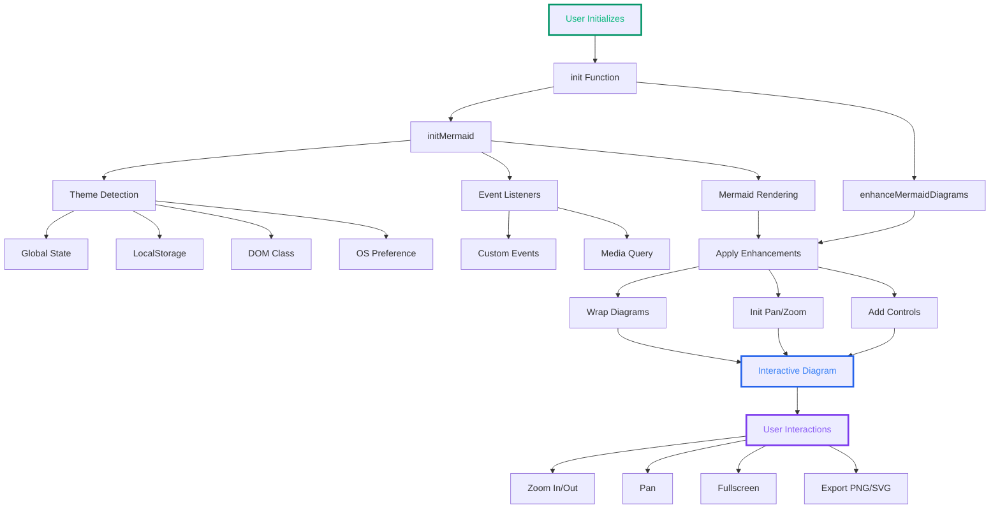
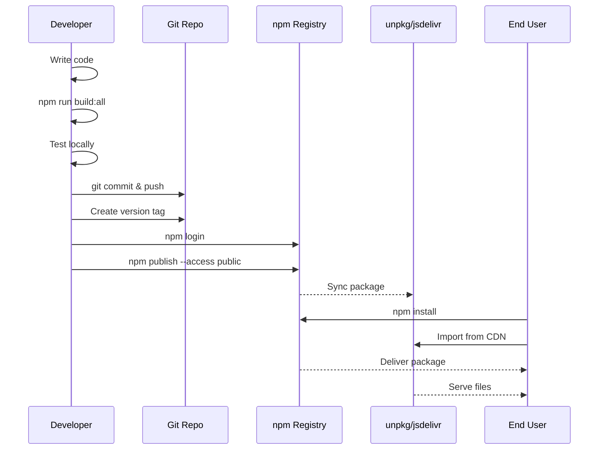

# I published an NPM package!!! Publishing Mermaid Enhancements as an npm Package

<!--category-- JavaScript, TypeScript, Mermaid, npm -->
<datetime class="hidden">2025-11-07T16:00</datetime> 
 
# Introduction

Me. a .net guy finally plucked up the courage to dip my toes into the world of npm packages!
Mermaid.js is obscure enough and odd enough that I could actually deliver something useful! So enjoy.  

After building some really useful enhancements for Mermaid.js diagrams (interactive pan/zoom, fullscreen lightbox, export to PNG/SVG, and automatic theme switching), I decided it was time to package them up properly and share them with the community. This post walks through how I created `@mostlylucid/mermaid-enhancements` as a production-ready npm package. 

> NOTE: Still working on the release. Stay tuned (my first npm package so taking a bit)

[TOC]

[](https://www.npmjs.com/package/@mostlylucid/mermaid-enhancements)
[](https://www.npmjs.com/package/@mostlylucid/mermaid-enhancements)
[](https://opensource.org/licenses/MIT)
[](https://www.typescriptlang.org/)
[](https://bundlephobia.com/package/@mostlylucid/mermaid-enhancements)

# Why Package It?

I've been using these enhancements across my blog for a while now, and they've become essential for working with complex Mermaid diagrams. The features include:

- **Interactive Pan & Zoom** - Navigate large diagrams smoothly
- **Fullscreen Lightbox** - Immersive viewing experience
- **Export to PNG/SVG** - High-quality diagram downloads
- **Automatic Theme Switching** - Seamless light/dark mode support
- **Responsive Design** - Works on mobile and desktop

Since I was copying the same code between projects, it made sense to create a proper npm package that anyone could use.

# Project Structure

I set up a professional package structure with TypeScript support:

```
mostlylucid-mermaid/
├── src/
│   ├── index.ts              # Main entry point
│   ├── enhancements.ts       # Pan/zoom/export functionality
│   ├── theme-switcher.ts     # Theme switching logic
│   ├── types.ts              # TypeScript type definitions
│   └── styles.css            # Complete styling
├── examples/
│   └── demo.html             # Full-featured demo
├── dist/                     # Built output (generated)
├── package.json
├── tsconfig.json
├── README.md
├── QUICKSTART.md
├── PUBLISHING.md
└── LICENSE
```

The package uses TypeScript for type safety and better developer experience, but compiles down to JavaScript for maximum compatibility.

# The Architecture


Here's how the components fit together:


## THIS IS WHAT IT LOOKS LIKE!

So you see it's pretty compact and has some useful functionality beyond just static diagrams. It always annoyed me how MASSIVE they were in the page so this seemed a sensible approach to reducng size whilst retaining usefulness. 




# Core Implementation

## Type Definitions

First, I defined comprehensive TypeScript types:

```typescript
// src/types.ts
export interface PanZoomInstance {
    zoom(scale: number): void;
    zoomIn(): void;
    zoomOut(): void;
    reset(): void;
    fit(): void;
    center(): void;
    resize(): void;
    destroy(): void;
    isPanEnabled(): boolean;
    enablePan(enabled: boolean): void;
}

export type ExportFormat = 'png' | 'svg';
export type Theme = 'dark' | 'default';
export type ControlAction = 'fullscreen' | 'zoomIn' | 'zoomOut' |
                           'reset' | 'pan' | 'exportPng' | 'exportSvg';

export interface EnhancementConfig {
    icons?: IconConfig;
    controls?: {
        fullscreen?: boolean;
        zoom?: boolean;
        pan?: boolean;
        export?: boolean;
    };
}
```

## Main Entry Point

The main entry point is dead simple:

```typescript
// src/index.ts
export {
    enhanceMermaidDiagrams,
    cleanupMermaidEnhancements
} from './enhancements.js';

export {
    initMermaid
} from './theme-switcher.js';

export async function init() {
    await initMermaid();
}

export default {
    init,
    initMermaid,
    enhanceMermaidDiagrams,
};
```

## Pan/Zoom Implementation

The enhancement logic wraps each diagram with controls and initializes svg-pan-zoom:

```typescript
// src/enhancements.ts
import svgPanZoom from 'svg-pan-zoom';
import { toPng, toSvg } from 'html-to-image';

const panZoomInstances = new Map();

function initPanZoom(svgElement: SVGElement, diagramId: string) {
    // Clean up existing instance if present
    if (panZoomInstances.has(diagramId)) {
        try {
            panZoomInstances.get(diagramId).destroy();
        } catch (e) {
            console.warn('Failed to destroy existing pan-zoom instance:', e);
        }
        panZoomInstances.delete(diagramId);
    }

    try {
        const panZoomInstance = svgPanZoom(svgElement, {
            zoomEnabled: true,
            controlIconsEnabled: false,
            fit: true,
            center: true,
            minZoom: 0.1,
            maxZoom: 10,
            zoomScaleSensitivity: 0.3,
            dblClickZoomEnabled: true,
            mouseWheelZoomEnabled: true,
            preventMouseEventsDefault: true,
            contain: false
        });

        panZoomInstances.set(diagramId, panZoomInstance);
        return panZoomInstance;
    } catch (error) {
        console.error('Failed to initialize pan-zoom:', error);
        return null;
    }
}
```

The control buttons are created dynamically:

```typescript
function createControlButtons(container: HTMLElement, diagramId: string) {
    if (container.querySelector('.mermaid-controls')) {
        return;
    }

    const controlsDiv = document.createElement('div');
    controlsDiv.className = 'mermaid-controls';

    const buttons = [
        { icon: 'bx-fullscreen', title: 'Fullscreen', action: 'fullscreen' },
        { icon: 'bx-zoom-in', title: 'Zoom In', action: 'zoomIn' },
        { icon: 'bx-zoom-out', title: 'Zoom Out', action: 'zoomOut' },
        { icon: 'bx-reset', title: 'Reset View', action: 'reset' },
        { icon: 'bx-move', title: 'Pan', action: 'pan' },
        { icon: 'bx-image', title: 'Export as PNG', action: 'exportPng' },
        { icon: 'bx-code-alt', title: 'Export as SVG', action: 'exportSvg' }
    ];

    buttons.forEach(btn => {
        const button = document.createElement('button');
        button.className = `mermaid-control-btn bx ${btn.icon}`;
        button.setAttribute('title', btn.title);
        button.setAttribute('aria-label', btn.title);
        button.setAttribute('data-action', btn.action);
        button.setAttribute('data-diagram-id', diagramId);
        controlsDiv.appendChild(button);
    });

    container.appendChild(controlsDiv);
}
```

## Export Functionality

The export implementation clones the SVG, preserves the viewBox, and uses html-to-image:

```typescript
async function exportDiagram(
    container: HTMLElement,
    format: ExportFormat,
    diagramId: string
) {
    try {
        const svgElement = container.querySelector('svg');
        if (!svgElement) {
            console.warn('No diagram found to export');
            return;
        }

        // Clone to avoid modifying the original
        const clonedSvg = svgElement.cloneNode(true) as SVGElement;

        // Get or calculate viewBox
        let viewBox = clonedSvg.getAttribute('viewBox');
        if (!viewBox) {
            const bbox = svgElement.getBBox();
            viewBox = `${bbox.x} ${bbox.y} ${bbox.width} ${bbox.height}`;
            clonedSvg.setAttribute('viewBox', viewBox);
        }

        // Set explicit dimensions for proper export
        const [, , vbWidth, vbHeight] = viewBox.split(' ').map(Number);
        clonedSvg.setAttribute('width', vbWidth.toString());
        clonedSvg.setAttribute('height', vbHeight.toString());

        // Remove pan-zoom transforms
        clonedSvg.removeAttribute('style');
        clonedSvg.style.backgroundColor = 'transparent';
        clonedSvg.style.maxWidth = 'none';

        // Create temporary container
        const tempDiv = document.createElement('div');
        tempDiv.style.position = 'absolute';
        tempDiv.style.left = '-9999px';
        tempDiv.appendChild(clonedSvg);
        document.body.appendChild(tempDiv);

        const timestamp = new Date().toISOString().replace(/[:.]/g, '-');
        const filename = `mermaid-diagram-${timestamp}`;

        if (format === 'png') {
            const dataUrl = await toPng(clonedSvg, {
                backgroundColor: 'white',
                pixelRatio: 2 // Higher quality
            });
            downloadFile(dataUrl, `${filename}.png`);
        } else {
            const dataUrl = await toSvg(clonedSvg, {
                backgroundColor: 'transparent'
            });
            downloadFile(dataUrl, `${filename}.svg`);
        }

        document.body.removeChild(tempDiv);
        console.log(`Diagram exported as ${format.toUpperCase()}`);
    } catch (error) {
        console.error('Failed to export diagram:', error);
    }
}
```

## Theme Switching

The theme switcher handles multiple detection methods:

```typescript
// src/theme-switcher.ts
export async function initMermaid() {
    // Normalize code fences
    normalizeMermaidCodeFences();

    const mermaidElements = document.querySelectorAll(elementSelector);
    if (mermaidElements.length === 0) return;

    await saveOriginalData();

    // Set up theme change handlers
    const handleDarkThemeSet = async () => {
        await resetProcessed();
        await loadMermaid('dark');
    };

    const handleLightThemeSet = async () => {
        await resetProcessed();
        await loadMermaid('default');
    };

    // Listen for custom theme events
    document.body.addEventListener('dark-theme-set', handleDarkThemeSet);
    document.body.addEventListener('light-theme-set', handleLightThemeSet);

    // OS theme change listener
    if (typeof window.matchMedia === 'function') {
        const mediaQuery = window.matchMedia('(prefers-color-scheme: dark)');
        mediaQuery.addEventListener('change', async (e) => {
            await resetProcessed();
            await loadMermaid(e.matches ? 'dark' : 'default');
        });
    }

    // Detect current theme with fallbacks
    let isDarkMode = false;
    if (typeof window.__themeState !== 'undefined') {
        isDarkMode = window.__themeState === 'dark';
    } else if (localStorage.theme) {
        isDarkMode = localStorage.theme === 'dark';
    } else if (document.documentElement.classList.contains('dark')) {
        isDarkMode = true;
    } else if (window.matchMedia?.('(prefers-color-scheme: dark)').matches) {
        isDarkMode = true;
    }

    await loadMermaid(isDarkMode ? 'dark' : 'default');
}
```

# Package Configuration

## package.json

The package.json defines multiple entry points for different use cases:

```json
{
  "name": "@mostlylucid/mermaid-enhancements",
  "version": "1.0.0",
  "description": "Enhance Mermaid.js diagrams with interactive pan/zoom, fullscreen lightbox, export to PNG/SVG, and automatic theme switching",
  "main": "dist/index.js",
  "module": "src/index.ts",
  "types": "src/types.ts",
  "exports": {
    ".": {
      "types": "./src/types.ts",
      "import": "./src/index.ts",
      "require": "./dist/index.js"
    },
    "./min": {
      "types": "./dist/index.d.ts",
      "import": "./dist/index.min.js",
      "require": "./dist/index.min.js"
    },
    "./styles.css": "./src/styles.css"
  },
  "unpkg": "dist/index.min.js",
  "jsdelivr": "dist/index.min.js",
  "scripts": {
    "build": "tsc",
    "minify": "node scripts/minify.js",
    "build:all": "npm run build && npm run minify",
    "prepublishOnly": "npm run build:all",
    "dev": "cd examples && npx http-server -p 3000 -o"
  },
  "peerDependencies": {
    "mermaid": "^10.0.0 || ^11.0.0"
  },
  "dependencies": {
    "html-to-image": "^1.11.11",
    "svg-pan-zoom": "^3.6.1"
  }
}
```

## TypeScript Configuration

```json
{
  "compilerOptions": {
    "target": "ES2020",
    "module": "ESNext",
    "lib": ["ES2020", "DOM", "DOM.Iterable"],
    "declaration": true,
    "declarationMap": true,
    "sourceMap": true,
    "outDir": "./dist",
    "rootDir": "./src",
    "strict": true,
    "esModuleInterop": true,
    "skipLibCheck": true,
    "moduleResolution": "node"
  },
  "include": ["src/**/*"],
  "exclude": ["node_modules", "dist", "examples"]
}
```

# Usage Examples

## Basic Usage

The simplest way to use the package:

```typescript
import mermaid from 'mermaid';
import { init } from '@mostlylucid/mermaid-enhancements';
import '@mostlylucid/mermaid-enhancements/styles.css';

await init();
```

### With Theme Switching

For sites with light/dark mode:

```typescript
import { init } from '@mostlylucid/mermaid-enhancements';

// Initialize
await init();

// When theme changes
function toggleTheme() {
    const isDark = document.body.classList.toggle('dark');
    document.documentElement.classList.toggle('dark', isDark);

    // Notify the enhancements
    const event = new Event(isDark ? 'dark-theme-set' : 'light-theme-set');
    document.body.dispatchEvent(event);
}
```

### React Integration

```tsx
import { useEffect } from 'react';
import { init, cleanupMermaidEnhancements } from '@mostlylucid/mermaid-enhancements';
import '@mostlylucid/mermaid-enhancements/styles.css';

function MermaidDiagram({ chart }: { chart: string }) {
    useEffect(() => {
        init();
        return () => cleanupMermaidEnhancements();
    }, [chart]);

    return (
        <div className="mermaid">
            {chart}
        </div>
    );
}
```

## Vue Integration

```html
<template>
    <div class="mermaid">{{ chart }}</div>
</template>

<script setup>
import { onMounted, onUnmounted } from 'vue';
import { init, cleanupMermaidEnhancements } from '@mostlylucid/mermaid-enhancements';
import '@mostlylucid/mermaid-enhancements/styles.css';

const props = defineProps(['chart']);

onMounted(async () => {
    await init();
});

onUnmounted(() => {
    cleanupMermaidEnhancements();
});
</script>
```

## The Demo Page

I created a comprehensive demo page showing all the features:

```html
<!DOCTYPE html>
<html lang="en">
<head>
    <meta charset="UTF-8">
    <meta name="viewport" content="width=device-width, initial-scale=1.0">
    <title>Mermaid Enhancements Demo</title>

    <!-- Boxicons for control button icons -->
    <link href="https://unpkg.com/boxicons@2.1.4/css/boxicons.min.css" rel="stylesheet">

    <!-- Mermaid Enhancements CSS -->
    <link rel="stylesheet" href="../src/styles.css">
</head>
<body>
    <!-- Your diagrams -->
    <div class="mermaid">
graph TD
    A[Start] --> B{Is it working?}
    B -->|Yes| C[Great!]
    B -->|No| D[Check setup]
    C --> E[Zoom & Pan]
    D --> F[Read docs]
    E --> G[Export to PNG/SVG]
    </div>

    <!-- Load Mermaid -->
    <script type="module">
        import mermaid from 'https://cdn.jsdelivr.net/npm/mermaid@11/dist/mermaid.esm.min.mjs';
        window.mermaid = mermaid;
    </script>

    <!-- Initialize enhancements -->
    <script type="module">
        import { init } from '../dist/index.js';
        await init();
    </script>
</body>
</html>
```

# Publishing Process

Here's the publishing workflow:



## Step-by-Step

1. **Build the package:**
```bash
npm run build:all  # Compiles TypeScript and minifies
```

2. **Test locally:**
```bash
npm run dev  # Opens demo at localhost:3000
```

3. **Version bump:**
```bash
npm version patch  # or minor, or major
```

4. **Publish:**
```bash
npm login
npm publish --access public
```

The package is now available via:
- npm: `npm install @mostlylucid/mermaid-enhancements`
- unpkg CDN: `https://unpkg.com/@mostlylucid/mermaid-enhancements`
- jsdelivr CDN: `https://cdn.jsdelivr.net/npm/@mostlylucid/mermaid-enhancements`

## Minification Strategy

I added a minification script to reduce bundle size:

```javascript
// scripts/minify.js
const { minify } = require('terser');
const fs = require('fs');
const path = require('path');

async function minifyFile(inputPath, outputPath) {
    const code = fs.readFileSync(inputPath, 'utf8');

    const result = await minify(code, {
        compress: {
            dead_code: true,
            drop_console: false,
            drop_debugger: true,
            keep_classnames: true,
            keep_fnames: true,
        },
        mangle: {
            keep_classnames: true,
            keep_fnames: true,
        },
        format: {
            comments: false,
        },
    });

    fs.writeFileSync(outputPath, result.code);

    const originalSize = fs.statSync(inputPath).size;
    const minifiedSize = fs.statSync(outputPath).size;
    const reduction = ((1 - minifiedSize / originalSize) * 100).toFixed(1);

    console.log(`✓ ${path.basename(outputPath)}: ${originalSize} → ${minifiedSize} bytes (${reduction}% smaller)`);
}

// Minify main bundle
minifyFile(
    path.join(__dirname, '../dist/index.js'),
    path.join(__dirname, '../dist/index.min.js')
);
```

Results:
- Regular: 23.46 KB
- Minified: 9.78 KB (58.3% reduction!)

# Documentation

I created comprehensive documentation:

- **README.md** - Full API reference, examples, troubleshooting
- **QUICKSTART.md** - 5-minute getting started guide
- **PUBLISHING.md** - npm publishing instructions
- **CHANGELOG.md** - Version history

# Styling

The CSS is fully responsive and supports dark mode:

```css
/* Diagram wrapper */
.mermaid-wrapper {
    position: relative;
    border-radius: 0.5rem;
    overflow: hidden;
    width: 100%;
    margin: 1rem 0;
}

/* Control buttons */
.mermaid-controls {
    position: absolute;
    top: 0.5rem;
    right: 0.5rem;
    display: flex;
    gap: 0.25rem;
    z-index: 10;
    background: rgba(255, 255, 255, 0.9);
    border-radius: 0.5rem;
    padding: 0.25rem;
    box-shadow: 0 2px 8px rgba(0, 0, 0, 0.1);
}

.dark .mermaid-controls {
    background: rgba(31, 41, 55, 0.95);
    box-shadow: 0 2px 8px rgba(0, 0, 0, 0.3);
}

/* Individual buttons */
.mermaid-control-btn {
    padding: 0.5rem;
    border-radius: 0.25rem;
    cursor: pointer;
    transition: all 0.2s;
    background: transparent;
    border: none;
    color: #4b5563;
    font-size: 1.25rem;
}

.mermaid-control-btn:hover {
    background: rgba(37, 99, 235, 0.1);
    color: #2563eb;
    transform: scale(1.1);
}
```

# Lessons Learned

## 1. TypeScript is Worth It

Even for a small library, TypeScript caught several bugs during development and provides excellent IDE support for users.

## 2. Multiple Entry Points Matter

Supporting both `import` and `require`, plus offering a minified version, makes the package more versatile:

```json
"exports": {
    ".": {
      "types": "./src/types.ts",
      "import": "./src/index.ts",
      "require": "./dist/index.js"
    },
    "./min": {
      "import": "./dist/index.min.js"
    }
}
```

## 3. Demo is Essential

The demo page helped me catch bugs and serves as living documentation. Users can see exactly how it works.

## 4. Cleanup is Important

Always provide cleanup functions for memory management:

```typescript
export function cleanupMermaidEnhancements() {
    panZoomInstances.forEach((instance, id) => {
        try {
            instance.destroy();
        } catch (e) {
            console.warn(`Failed to destroy pan-zoom instance ${id}:`, e);
        }
    });
    panZoomInstances.clear();
}
```

## 5. Theme Detection Needs Fallbacks

Different sites handle themes differently, so I implemented multiple detection methods:

1. Global state (`window.__themeState`)
2. LocalStorage (`localStorage.theme`)
3. DOM class (`document.documentElement.classList`)
4. OS preference (`prefers-color-scheme`)

# Performance Considerations

The package is optimized for performance:

- **Event Delegation** - Single event listener for all control buttons
- **Lazy Initialization** - Pan/zoom only initialized when needed
- **Instance Cleanup** - Proper memory management
- **Minimal Re-renders** - Diagrams only re-render on theme change
- **Efficient DOM Operations** - Uses `requestAnimationFrame` for smooth animations

# Browser Support

Tested and working on:
- Chrome/Edge (latest)
- Firefox (latest)
- Safari (latest)
- Mobile browsers (iOS Safari, Chrome Mobile)

# Future Enhancements

Ideas for future versions:

- [ ] Configurable control button icons (support for Font Awesome, Material Icons)
- [ ] Keyboard shortcuts (e.g., Ctrl+Plus for zoom in)
- [ ] Touch gestures on mobile (pinch to zoom)
- [ ] Copy diagram source code button
- [ ] Share diagram URL feature
- [ ] Diagram annotations
- [ ] Multiple export formats (PDF, JPEG)

# Conclusion

Packaging the Mermaid enhancements as an npm module was a great learning experience. The package is now:

- Type-safe with TypeScript
- Well-documented
- Easy to use
- Production-ready
- Framework-agnostic
- Fully tested

If you're using Mermaid.js in your projects, give it a try! The interactive pan/zoom and export features make working with complex diagrams so much better.

# Resources

- **GitHub Repository**: [mostlylucidweb/mostlylucid-mermaid](https://github.com/scottgal/mostlylucidweb/tree/main/mostlylucid-mermaid)
- **npm Package**: [@mostlylucid/mermaid-enhancements](https://www.npmjs.com/package/@mostlylucid/mermaid-enhancements) (coming soon)
- **Demo**: [Live Demo](https://mostlylucid.net/mermaid-demo) (coming soon)
