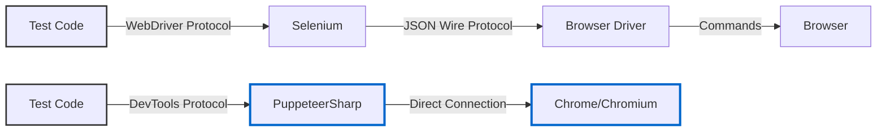
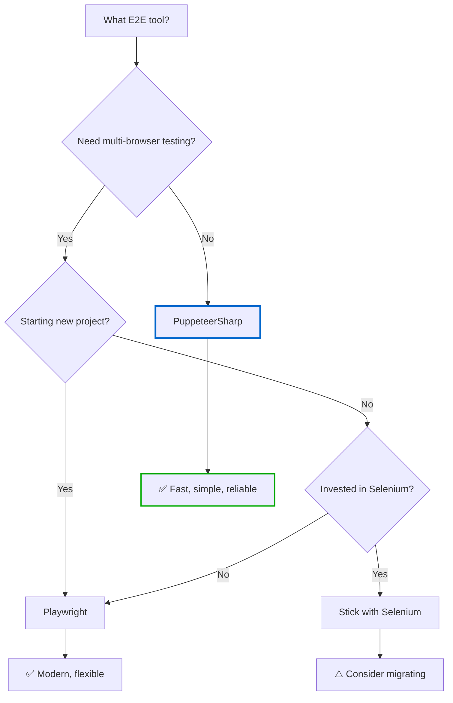

# End-to-End Testing with PuppeteerSharp - A Proper Alternative to Selenium

<datetime class="hidden">2025-11-26T12:00</datetime>

<!--category-- PuppeteerSharp, E2E Testing, xUnit, Testing -->

## Introduction

If you've ever worked with Selenium for end-to-end testing, you'll know it can be a right pain in the backside. Between wrestling with driver versions, dealing with flaky tests that work on your machine but nowhere else, and the general sluggishness of the WebDriver protocol, it's enough to make you want to chuck it all in and just test manually with a cup of tea in hand.

Enter PuppeteerSharp - the .NET port of Google's Puppeteer library. It's like Selenium's younger, faster cousin who actually bothers to show up on time and doesn't require you to download seventeen different browser drivers just to run a simple test.

In this article, I'll walk you through how I've implemented PuppeteerSharp for E2E testing on this very blog, complete with real code examples from the repo. We'll also have a look at how it stacks up against Selenium and other alternatives.

[TOC]

## What's PuppeteerSharp Then?

PuppeteerSharp is a .NET library that provides a high-level API to control Chrome or Chromium browsers using the Chrome DevTools Protocol. Unlike Selenium, which uses the WebDriver protocol (a rather clunky HTTP-based JSON wire protocol), PuppeteerSharp talks directly to the browser through DevTools. This makes it significantly faster and more reliable.

Think of it this way:
- **Selenium**: Like sending letters through the post to communicate with your browser
- **PuppeteerSharp**: Like having a direct phone line to the browser's brain



### Why PuppeteerSharp Over Selenium?

Let me count the ways:

1. **No Driver Management Faff**: PuppeteerSharp downloads and manages the Chrome browser for you. No more mucking about with ChromeDriver versions that don't match your installed Chrome version.

2. **Faster Execution**: The DevTools Protocol is significantly faster than WebDriver. Your tests will run quicker, and you'll spend less time waiting for things to happen.

3. **Better API**: The API is more modern and intuitive. It's async/await all the way down, which fits beautifully with modern .NET development.

4. **Built-in Screenshot & PDF Generation**: Want a screenshot when a test fails? It's dead simple with PuppeteerSharp.

5. **Intercept Network Requests**: You can intercept, modify, or block network requests with ease - brilliant for testing offline scenarios or mocking API responses.

6. **Proper JavaScript Execution**: Execute JavaScript in the page context and get results back in a way that doesn't make you want to weep.

## Setting Up PuppeteerSharp

First things first, you'll need to add the NuGet package to your test project:

```bash
dotnet add package PuppeteerSharp
```

Here's the relevant section from my test project file:

```xml
<PackageReference Include="PuppeteerSharp" Version="20.2.4" />
<PackageReference Include="xunit" Version="2.9.3" />
<PackageReference Include="xunit.runner.visualstudio" Version="3.1.4">
  <PrivateAssets>all</PrivateAssets>
  <IncludeAssets>runtime; build; native; contentfiles; analyzers; buildtransitive</IncludeAssets>
</PackageReference>
```

I'm using xUnit for my tests (because it's what ASP.NET Core uses by default and I'm not one to rock the boat unnecessarily), but PuppeteerSharp works just fine with NUnit or MSTest if that's your cup of tea.

## Creating a Base Test Class

Rather than repeating the same setup and teardown code in every test, I've created a base class that handles all the browser lifecycle management. This is the sort of thing that makes your life much easier:

```csharp
using PuppeteerSharp;
using PuppeteerSharp.Input;
using Xunit.Abstractions;

namespace Mostlylucid.Test.E2E;

/// <summary>
/// Base class for E2E tests using PuppeteerSharp.
/// NOTE: These tests require the site to be running locally.
/// Run the site first with: dotnet run --project Mostlylucid --launch-profile https
/// </summary>
public abstract class E2ETestBase : IAsyncLifetime
{
    protected readonly ITestOutputHelper Output;
    protected IBrowser Browser = null!;
    protected IPage Page = null!;

    protected const string BaseUrl = "http://localhost:8080";
    protected const int DefaultTimeout = 30000;

    protected E2ETestBase(ITestOutputHelper output)
    {
        Output = output;
    }

    public async Task InitializeAsync()
    {
        Output.WriteLine("Downloading Chromium if needed...");
        var browserFetcher = new BrowserFetcher();
        await browserFetcher.DownloadAsync();

        Output.WriteLine("Launching browser...");
        Browser = await Puppeteer.LaunchAsync(new LaunchOptions
        {
            Headless = true, // Set to false for debugging
            DefaultViewport = new ViewPortOptions
            {
                Width = 1400,
                Height = 900
            },
            Args = new[]
            {
                "--no-sandbox",
                "--disable-setuid-sandbox"
            }
        });

        Page = await Browser.NewPageAsync();
        Page.DefaultTimeout = DefaultTimeout;

        Output.WriteLine("Browser ready");
    }

    public async Task DisposeAsync()
    {
        if (Page != null)
        {
            await Page.CloseAsync();
        }

        if (Browser != null)
        {
            await Browser.CloseAsync();
        }
    }
}
```

Let's break down what's happening here:

### The IAsyncLifetime Interface

```csharp
public abstract class E2ETestBase : IAsyncLifetime
```

This is xUnit's way of handling async setup and teardown. Unlike the traditional constructor/dispose pattern, `IAsyncLifetime` gives us `InitializeAsync` and `DisposeAsync` methods that can be awaited. This is crucial because launching a browser and creating pages are async operations.

### Browser Fetcher

```csharp
var browserFetcher = new BrowserFetcher();
await browserFetcher.DownloadAsync();
```

This is where the magic happens. The `BrowserFetcher` will download a compatible version of Chromium the first time you run your tests. It's stored in your user profile directory, so you only download it once. No more "works on my machine" issues because everyone's using slightly different Chrome versions.

### Launch Options

```csharp
Browser = await Puppeteer.LaunchAsync(new LaunchOptions
{
    Headless = true, // Set to false for debugging
    DefaultViewport = new ViewPortOptions
    {
        Width = 1400,
        Height = 900
    },
    Args = new[]
    {
        "--no-sandbox",
        "--disable-setuid-sandbox"
    }
});
```

A few important bits here:

- **Headless mode**: When `true`, the browser runs without a GUI. Brilliant for CI/CD pipelines. Set it to `false` when you're debugging and you want to see what's actually happening.
- **Viewport size**: I've set a sensible desktop size. This matters for responsive design testing - you don't want to test on a tiny viewport when you mean to test desktop layouts.
- **Sandbox arguments**: The `--no-sandbox` flags are needed for running in Docker containers or CI environments where you don't have a proper display server.

## Helper Methods - Making Life Easier

I've added a bunch of helper methods to the base class to make common operations less verbose. Here are some of my favourites from `Mostlylucid.Test/E2E/E2ETestBase.cs:72-172`:

```csharp
/// <summary>
/// Navigate to a page and wait for it to load
/// </summary>
protected async Task NavigateAsync(string path)
{
    var url = path.StartsWith("http") ? path : $"{BaseUrl}{path}";
    Output.WriteLine($"Navigating to: {url}");

    await Page.GoToAsync(url, new NavigationOptions
    {
        WaitUntil = new[] { WaitUntilNavigation.Networkidle2 },
        Timeout = DefaultTimeout
    });
}

/// <summary>
/// Wait for an element to appear
/// </summary>
protected async Task<IElementHandle?> WaitForSelectorAsync(string selector, int timeout = 5000)
{
    try
    {
        return await Page.WaitForSelectorAsync(selector, new WaitForSelectorOptions
        {
            Timeout = timeout,
            Visible = true
        });
    }
    catch (WaitTaskTimeoutException)
    {
        return null;
    }
}

/// <summary>
/// Check if an element exists on the page
/// </summary>
protected async Task<bool> ElementExistsAsync(string selector)
{
    var element = await Page.QuerySelectorAsync(selector);
    return element != null;
}

/// <summary>
/// Get text content of an element
/// </summary>
protected async Task<string?> GetTextContentAsync(string selector)
{
    var element = await Page.QuerySelectorAsync(selector);
    if (element == null) return null;

    return await Page.EvaluateFunctionAsync<string>("el => el.textContent", element);
}

/// <summary>
/// Type text into an input element
/// </summary>
protected async Task TypeAsync(string selector, string text, int delay = 50)
{
    await Page.WaitForSelectorAsync(selector);
    await Page.TypeAsync(selector, text, new TypeOptions { Delay = delay });
}

/// <summary>
/// Click an element
/// </summary>
protected async Task ClickAsync(string selector)
{
    await Page.WaitForSelectorAsync(selector);
    await Page.ClickAsync(selector);
}
```

These methods do the boring stuff for you - waiting for elements to exist before clicking them, handling timeouts gracefully, and logging what's happening (which is invaluable when a test fails in CI and you're trying to figure out what went wrong).

## Writing Actual Tests

Right, let's get to the good stuff - writing actual tests. Here's a real test from my blog's filter bar functionality (`Mostlylucid.Test/E2E/FilterBarTests.cs:20-50`):

```csharp
[Fact(Skip = "Local E2E test - requires site to be running on localhost:8080")]
public async Task FilterBar_LanguageDropdown_ShowsLanguages()
{
    // Arrange
    await NavigateAsync("/blog");

    // Act - Click the language dropdown button
    var dropdownButton = await WaitForSelectorAsync("#LanguageDropDown button");
    Assert.NotNull(dropdownButton);

    await ClickAsync("#LanguageDropDown button");
    await WaitAsync(300);

    // Assert - Dropdown menu should be visible with language options
    var dropdownOpen = await EvaluateFunctionAsync<bool>(@"() => {
        const dropdown = document.querySelector('#LanguageDropDown div[x-show]');
        if (!dropdown) return false;
        const style = window.getComputedStyle(dropdown);
        return style.display !== 'none';
    }");

    Assert.True(dropdownOpen, "Language dropdown should be open");

    // Check that English option exists
    var hasEnglish = await EvaluateFunctionAsync<bool>(@"() => {
        const options = document.querySelectorAll('#LanguageDropDown li a');
        return Array.from(options).some(opt => opt.textContent.toLowerCase().includes('english'));
    }");

    Assert.True(hasEnglish, "Language dropdown should contain English option");
    Output.WriteLine("✅ Language dropdown shows languages correctly");
}
```

This test is checking that my language dropdown works properly. Let's look at what makes it tick:

### The Skip Attribute

```csharp
[Fact(Skip = "Local E2E test - requires site to be running on localhost:8080")]
```

I've skipped this test by default because it requires the site to be running locally. For E2E tests, you typically want to run them on-demand rather than with every build. You can unskip them when you're ready to run them, or run them in a separate CI job where you've got the site spun up.

### Executing JavaScript

```csharp
var dropdownOpen = await EvaluateFunctionAsync<bool>(@"() => {
    const dropdown = document.querySelector('#LanguageDropDown div[x-show]');
    if (!dropdown) return false;
    const style = window.getComputedStyle(dropdown);
    return style.display !== 'none';
}");
```

This is one of the areas where PuppeteerSharp absolutely shines. The `EvaluateFunctionAsync` method lets you run JavaScript in the browser context and get the result back as a proper .NET type. In this case, I'm checking if a dropdown is actually visible (not just present in the DOM) by looking at its computed styles.

Compare this to Selenium where you'd need to:
1. Find the element
2. Get its display property
3. Parse the string result
4. Hope it's not stale by the time you check it

### Testing HTMX Interactions

My blog uses HTMX extensively (because I'm a fan of server-side rendering and not writing JavaScript unless absolutely necessary). Here's a test that checks sorting functionality (`Mostlylucid.Test/E2E/FilterBarTests.cs:98-126`):

```csharp
[Fact(Skip = "Local E2E test - requires site to be running on localhost:8080")]
public async Task FilterBar_SortOrder_ChangesPostOrder()
{
    // Arrange
    await NavigateAsync("/blog");

    // Get the first post title before sorting
    var firstPostBefore = await EvaluateFunctionAsync<string>(@"() => {
        const postLink = document.querySelector('.post-title, article h2 a, #contentcontainer article a');
        return postLink?.textContent?.trim() || '';
    }");
    Output.WriteLine($"First post before sort: {firstPostBefore}");

    // Act - Change sort order to "Oldest first"
    await Page.SelectAsync("#orderSelect", "date_asc");
    await WaitAsync(1000); // Wait for HTMX to update

    // Assert - Post order should have changed
    var firstPostAfter = await EvaluateFunctionAsync<string>(@"() => {
        const postLink = document.querySelector('.post-title, article h2 a, #contentcontainer article a');
        return postLink?.textContent?.trim() || '';
    }");
    Output.WriteLine($"First post after sort: {firstPostAfter}");

    var selectValue = await EvaluateFunctionAsync<string>("() => document.querySelector('#orderSelect')?.value");
    Assert.Equal("date_asc", selectValue);
    Output.WriteLine("✅ Sort order selection works correctly");
}
```

The key here is the `await WaitAsync(1000)` after changing the select value. HTMX needs a moment to make its request and update the DOM. In a perfect world, we'd wait for a specific network request to complete, but for simple cases, a brief delay is fine.

### Testing Responsive Design

Here's a cheeky test that checks my filter bar is properly hidden on mobile devices (`Mostlylucid.Test/E2E/FilterBarTests.cs:216-245`):

```csharp
[Fact(Skip = "Local E2E test - requires site to be running on localhost:8080")]
public async Task FilterBar_ResponsiveDesign_HiddenOnMobile()
{
    // Arrange - Set mobile viewport
    await Page.SetViewportAsync(new ViewPortOptions
    {
        Width = 375,
        Height = 667
    });

    await NavigateAsync("/blog");
    await WaitAsync(500);

    // Assert - Filter bar should be hidden on mobile
    var filterBarVisible = await EvaluateFunctionAsync<bool>(@"() => {
        const filterBar = document.querySelector('.hidden.lg\\:flex');
        if (!filterBar) return true;
        const rect = filterBar.getBoundingClientRect();
        return rect.width > 0 && rect.height > 0;
    }");

    Assert.False(filterBarVisible, "Filter bar should be hidden on mobile viewport");
    Output.WriteLine("✅ Filter bar correctly hidden on mobile");

    // Reset viewport
    await Page.SetViewportAsync(new ViewPortOptions
    {
        Width = 1400,
        Height = 900
    });
}
```

You can change the viewport at any time, which is brilliant for testing responsive layouts. Much easier than resizing your browser window manually!

## Advanced PuppeteerSharp Features

### Network Interception

One of my favourite features is the ability to intercept and modify network requests. This is invaluable for testing error states or offline scenarios:

```csharp
await Page.SetRequestInterceptionAsync(true);

Page.Request += async (sender, e) =>
{
    // Block all image requests to speed up tests
    if (e.Request.ResourceType == ResourceType.Image)
    {
        await e.Request.AbortAsync();
    }
    // Mock API responses
    else if (e.Request.Url.Contains("/api/posts"))
    {
        await e.Request.RespondAsync(new ResponseData
        {
            Status = HttpStatusCode.OK,
            ContentType = "application/json",
            Body = "{\"posts\": []}"
        });
    }
    else
    {
        await e.Request.ContinueAsync();
    }
};
```

### Taking Screenshots

When a test fails, a screenshot is worth a thousand log messages:

```csharp
try
{
    // Your test code here
    await Page.ClickAsync("#someButton");
}
catch (Exception)
{
    // Take a screenshot on failure
    await Page.ScreenshotAsync("test-failure.png");
    throw; // Re-throw to fail the test
}
```

### PDF Generation

You can even generate PDFs of pages, which is useful for testing server-side rendering or print stylesheets:

```csharp
await Page.PdfAsync("page.pdf", new PdfOptions
{
    Format = PaperFormat.A4,
    PrintBackground = true
});
```

### Code Coverage

PuppeteerSharp can even collect JavaScript code coverage data:

```csharp
await Page.Coverage.StartJSCoverageAsync();
await Page.GoToAsync("http://localhost:8080");

var coverage = await Page.Coverage.StopJSCoverageAsync();
var totalBytes = coverage.Sum(c => c.Text.Length);
var usedBytes = coverage.Sum(c => c.Ranges.Sum(r => r.End - r.Start));
var percentUsed = usedBytes / (double)totalBytes * 100;

Output.WriteLine($"JavaScript coverage: {percentUsed:F2}%");
```

## PuppeteerSharp vs The Competition

Let's have a proper look at how PuppeteerSharp stacks up against other E2E testing tools:

```mermaid
graph TD
    A[E2E Testing Tools] --> B[Selenium WebDriver]
    A --> C[PuppeteerSharp]
    A --> D[Playwright]
    A --> E[Cypress]

    B --> B1[❌ Slow WebDriver protocol]
    B --> B2[❌ Driver management hassle]
    B --> B3[✅ Multi-browser support]
    B --> B4[✅ Mature ecosystem]

    C --> C1[✅ Fast DevTools protocol]
    C --> C2[✅ Auto browser management]
    C --> C3[❌ Chrome/Chromium only]
    C --> C4[✅ Great .NET integration]

    D --> D1[✅ Fast DevTools protocol]
    D --> D2[✅ Auto browser management]
    D --> D3[✅ Multi-browser support]
    D --> D4[⚠️ Newer to .NET ecosystem]

    E --> E1[✅ Great developer experience]
    E --> E2[❌ JavaScript only]
    E --> E3[❌ Not for .NET]
    E --> E4[✅ Excellent documentation]

    style C stroke:#0066cc,stroke-width:3px
    style C1 stroke:#00aa00,stroke-width:2px
    style C2 stroke:#00aa00,stroke-width:2px
    style C4 stroke:#00aa00,stroke-width:2px
```



### Selenium WebDriver

**The Old Guard**

Selenium has been around since 2004 and it shows. It's mature, well-documented, and supports every browser under the sun. But it's also showing its age:

**Pros:**
- Supports all browsers (Chrome, Firefox, Safari, Edge, IE if you're a masochist)
- Massive ecosystem of tools and extensions
- Well-known and widely adopted
- Good for cross-browser testing

**Cons:**
- WebDriver protocol is slow
- Driver management is a pain (though WebDriverManager helps)
- API feels dated compared to modern alternatives
- Flaky tests are common due to timing issues
- No built-in network interception

**When to use it:** When you absolutely need to test across multiple browsers, or when you're already invested in the Selenium ecosystem.

### Playwright

**The New Kid on the Block**

Playwright is Microsoft's answer to Puppeteer, with .NET support baked in from the start. It's essentially PuppeteerSharp but with multi-browser support:

**Pros:**
- Supports Chrome, Firefox, Safari (WebKit)
- Modern API similar to Puppeteer
- Auto-downloads browsers
- Built-in network interception, screenshots, etc.
- Good .NET support

**Cons:**
- Newer, so smaller ecosystem
- Can be overkill if you only need Chrome
- Slightly more complex setup due to multi-browser support

**When to use it:** When you need multi-browser support but want a modern API. If you're starting a new project and need cross-browser testing, Playwright is probably your best bet.

### Cypress

**The JavaScript Developer's Darling**

Cypress is brilliant if you're working in JavaScript/TypeScript, but it's a non-starter for .NET developers:

**Pros:**
- Fantastic developer experience
- Time-travel debugging
- Automatic waiting
- Great documentation

**Cons:**
- JavaScript/TypeScript only
- No .NET support
- Can't test multiple tabs or windows
- Limited to testing your own application (no testing across domains)

**When to use it:** Don't, you're writing .NET code. Stick to something that integrates with your tech stack.

### So What Should You Use?

Here's my take:



For most .NET developers building modern web applications:
- **Chrome-only testing?** → PuppeteerSharp
- **Multi-browser testing?** → Playwright
- **Already using Selenium?** → Consider migrating to Playwright, but don't rush it

## Running Tests in CI/CD

E2E tests are all well and good on your local machine, but they need to run in CI/CD pipelines too. Here's how I've set things up for GitHub Actions:

```yaml
name: E2E Tests

on:
  push:
    branches: [ main ]
  pull_request:
    branches: [ main ]

jobs:
  e2e-tests:
    runs-on: ubuntu-latest

    steps:
    - uses: actions/checkout@v3

    - name: Setup .NET
      uses: actions/setup-dotnet@v3
      with:
        dotnet-version: '9.0.x'

    - name: Install dependencies
      run: dotnet restore

    - name: Build
      run: dotnet build --no-restore

    - name: Start application
      run: |
        dotnet run --project Mostlylucid/Mostlylucid.csproj &
        echo $! > app.pid

    - name: Wait for application to start
      run: |
        timeout 60 bash -c 'until curl -f http://localhost:8080/health; do sleep 2; done'

    - name: Run E2E tests
      run: |
        dotnet test Mostlylucid.Test/Mostlylucid.Test.csproj \
          --filter "Category=E2E" \
          --logger "console;verbosity=detailed"

    - name: Upload screenshots on failure
      if: failure()
      uses: actions/upload-artifact@v3
      with:
        name: test-screenshots
        path: '**/test-failure-*.png'

    - name: Stop application
      if: always()
      run: |
        kill $(cat app.pid) || true
```

The key bits:
1. Start the application in the background
2. Wait for it to be healthy (using a health check endpoint)
3. Run the E2E tests
4. Upload screenshots if any tests fail
5. Always stop the application, even if tests fail

## Common Pitfalls and How to Avoid Them

### Flaky Tests

E2E tests can be flaky - they pass sometimes and fail others. This is usually down to timing issues. Here's how to avoid them:

**Bad:**
```csharp
await Page.ClickAsync("#button");
var text = await GetTextContentAsync("#result");
Assert.Equal("Success", text);
```

**Good:**
```csharp
await Page.ClickAsync("#button");
await Page.WaitForSelectorAsync("#result");
var text = await GetTextContentAsync("#result");
Assert.Equal("Success", text);
```

Always wait for the element you're about to interact with to exist and be visible.

### Test Isolation

Each test should be completely independent. Don't rely on state from previous tests:

**Bad:**
```csharp
[Fact]
public async Task Test1_Login()
{
    await LoginAsync("user", "password");
    // User is now logged in for subsequent tests
}

[Fact]
public async Task Test2_ViewDashboard()
{
    // Assumes user is still logged in from Test1
    await NavigateAsync("/dashboard");
}
```

**Good:**
```csharp
[Fact]
public async Task Test1_Login()
{
    await LoginAsync("user", "password");
    await LogoutAsync(); // Clean up
}

[Fact]
public async Task Test2_ViewDashboard()
{
    await LoginAsync("user", "password"); // Set up needed state
    await NavigateAsync("/dashboard");
    await LogoutAsync(); // Clean up
}
```

### Page Object Pattern

For complex pages, use the Page Object pattern to keep your tests maintainable:

```csharp
public class BlogPageObject
{
    private readonly IPage _page;

    public BlogPageObject(IPage page)
    {
        _page = page;
    }

    public async Task SelectLanguageAsync(string language)
    {
        await _page.ClickAsync("#LanguageDropDown button");
        await _page.WaitAsync(300);
        await _page.ClickAsync($"#LanguageDropDown a:has-text('{language}')");
    }

    public async Task<string[]> GetPostTitlesAsync()
    {
        return await _page.EvaluateFunctionAsync<string[]>(@"() => {
            return Array.from(document.querySelectorAll('.post-title'))
                        .map(el => el.textContent.trim());
        }");
    }
}

// Usage in tests
[Fact]
public async Task Can_Filter_By_Language()
{
    var blogPage = new BlogPageObject(Page);
    await NavigateAsync("/blog");

    await blogPage.SelectLanguageAsync("Spanish");
    var titles = await blogPage.GetPostTitlesAsync();

    Assert.All(titles, title => Assert.NotEmpty(title));
}
```

## Performance Considerations

E2E tests are slower than unit tests, there's no getting around it. But you can make them faster:

### Run Tests in Parallel

xUnit runs tests in parallel by default, but you need to be careful about shared state:

```csharp
[Collection("E2E Tests")] // Tests in same collection run sequentially
public class FilterBarTests : E2ETestBase
{
    // Tests here share resources
}

[Collection("Blog Tests")] // Different collection runs in parallel
public class BlogTests : E2ETestBase
{
    // Tests here run in parallel with FilterBarTests
}
```

### Disable Unnecessary Features

Speed up tests by disabling features you don't need:

```csharp
Browser = await Puppeteer.LaunchAsync(new LaunchOptions
{
    Headless = true,
    Args = new[]
    {
        "--no-sandbox",
        "--disable-setuid-sandbox",
        "--disable-dev-shm-usage", // Overcome limited resource problems
        "--disable-accelerated-2d-canvas",
        "--disable-gpu", // Not needed for headless
        "--disable-images", // Don't load images if you don't need them
        "--disable-javascript", // Only if testing static content
    }
});
```

### Use Network Interception Wisely

Block unnecessary resources to speed things up:

```csharp
await Page.SetRequestInterceptionAsync(true);
Page.Request += async (sender, e) =>
{
    var blockedResourceTypes = new[]
    {
        ResourceType.Image,
        ResourceType.Media,
        ResourceType.Font,
        ResourceType.StyleSheet // If you don't need to test styling
    };

    if (blockedResourceTypes.Contains(e.Request.ResourceType))
    {
        await e.Request.AbortAsync();
    }
    else
    {
        await e.Request.ContinueAsync();
    }
};
```

## Debugging E2E Tests

When tests fail (and they will), you need to debug them. Here are some techniques:

### Run in Non-Headless Mode

Set `Headless = false` to watch the browser in action:

```csharp
Browser = await Puppeteer.LaunchAsync(new LaunchOptions
{
    Headless = false,
    SlowMo = 100, // Slow down by 100ms to see what's happening
});
```

### Use DevTools

You can actually open DevTools programmatically:

```csharp
Browser = await Puppeteer.LaunchAsync(new LaunchOptions
{
    Headless = false,
    Devtools = true, // Auto-open DevTools
});
```

### Console Logging

Capture console messages from the browser:

```csharp
Page.Console += (sender, e) =>
{
    Output.WriteLine($"Browser console: {e.Message.Text}");
};
```

### Request Logging

Log all network requests:

```csharp
Page.Request += (sender, e) =>
{
    Output.WriteLine($"Request: {e.Request.Method} {e.Request.Url}");
};

Page.Response += (sender, e) =>
{
    Output.WriteLine($"Response: {e.Response.Status} {e.Response.Url}");
};
```

## Real-World Test Patterns

Here are some patterns I use regularly in my E2E tests:

### Testing Form Submissions

```csharp
[Fact]
public async Task Can_Submit_Comment()
{
    await NavigateAsync("/blog/some-post");

    // Fill in the comment form
    await TypeAsync("#comment-name", "Test User");
    await TypeAsync("#comment-email", "test@example.com");
    await TypeAsync("#comment-content", "This is a test comment");

    // Submit the form
    await ClickAsync("#comment-submit");

    // Wait for success message
    await WaitForSelectorAsync(".comment-success");

    // Verify the comment appears
    var commentText = await GetTextContentAsync(".comment-list .comment:last-child .comment-content");
    Assert.Contains("test comment", commentText.ToLower());
}
```

### Testing Keyboard Interactions

```csharp
[Fact]
public async Task Can_Navigate_With_Keyboard()
{
    await NavigateAsync("/blog");

    // Focus the search box
    await Page.FocusAsync("#search");

    // Type a search query
    await Page.Keyboard.TypeAsync("testing");

    // Press arrow down to select first result
    await Page.Keyboard.PressAsync("ArrowDown");

    // Press enter to navigate
    await Page.Keyboard.PressAsync("Enter");

    // Verify we navigated to the right page
    await WaitAsync(1000);
    Assert.Contains("/blog/", Page.Url);
}
```

### Testing File Uploads

```csharp
[Fact]
public async Task Can_Upload_Image()
{
    await NavigateAsync("/admin/upload");

    // Create a test file
    var testFilePath = Path.Combine(Path.GetTempPath(), "test-image.jpg");
    File.WriteAllBytes(testFilePath, new byte[] { 0xFF, 0xD8, 0xFF }); // JPEG header

    // Upload the file
    var fileInput = await Page.QuerySelectorAsync("input[type=file]");
    await fileInput.UploadFileAsync(testFilePath);

    await ClickAsync("#upload-submit");

    // Verify upload succeeded
    await WaitForSelectorAsync(".upload-success");

    // Clean up
    File.Delete(testFilePath);
}
```

### Testing Drag and Drop

```csharp
[Fact]
public async Task Can_Reorder_Items()
{
    await NavigateAsync("/admin/posts");

    var dragSource = await Page.QuerySelectorAsync(".post-item[data-id='1']");
    var dropTarget = await Page.QuerySelectorAsync(".post-item[data-id='3']");

    var sourceBox = await dragSource.BoundingBoxAsync();
    var targetBox = await dropTarget.BoundingBoxAsync();

    // Perform drag and drop
    await Page.Mouse.MoveAsync(sourceBox.X + sourceBox.Width / 2, sourceBox.Y + sourceBox.Height / 2);
    await Page.Mouse.DownAsync();
    await Page.Mouse.MoveAsync(targetBox.X + targetBox.Width / 2, targetBox.Y + targetBox.Height / 2);
    await Page.Mouse.UpAsync();

    await WaitAsync(500);

    // Verify new order
    var firstItemId = await Page.EvaluateFunctionAsync<string>(
        "() => document.querySelector('.post-item').dataset.id"
    );
    Assert.Equal("1", firstItemId);
}
```

## Integration with ASP.NET Core Testing

You can integrate PuppeteerSharp with ASP.NET Core's `WebApplicationFactory` for a more integrated testing experience:

```csharp
public class E2EWebApplicationFactory : WebApplicationFactory<Program>
{
    protected override void ConfigureWebHost(IWebHostBuilder builder)
    {
        builder.UseUrls("http://localhost:5050");

        builder.ConfigureServices(services =>
        {
            // Override services for testing
            // For example, use in-memory database
            services.RemoveAll<DbContextOptions<MostlylucidDbContext>>();
            services.AddDbContext<MostlylucidDbContext>(options =>
            {
                options.UseInMemoryDatabase("TestDb");
            });
        });
    }
}

public abstract class IntegratedE2ETestBase : E2ETestBase, IClassFixture<E2EWebApplicationFactory>
{
    protected E2EWebApplicationFactory Factory { get; }

    protected IntegratedE2ETestBase(E2EWebApplicationFactory factory, ITestOutputHelper output)
        : base(output)
    {
        Factory = factory;
    }

    public override async Task InitializeAsync()
    {
        await base.InitializeAsync();

        // Application is automatically started by WebApplicationFactory
        // Override BaseUrl to use the factory's address
        BaseUrl = "http://localhost:5050";
    }
}
```

## Conclusion

PuppeteerSharp has been an absolute game-changer for E2E testing in my .NET projects. It's faster than Selenium, has a more modern API, and just generally makes testing less of a chore.

Here's what I'd recommend:

1. **Start with PuppeteerSharp** if you're only testing Chrome/Chromium. It's simpler and faster than the alternatives.

2. **Use Playwright** if you need multi-browser support. It's got all the benefits of PuppeteerSharp plus Firefox and Safari.

3. **Avoid Selenium** for new projects unless you have a specific reason to use it (like IE11 support, which hopefully you don't).

4. **Write tests judiciously**. E2E tests are slow and can be brittle. Use them for critical user journeys, not for testing every little detail. That's what unit and integration tests are for.

5. **Keep tests isolated**. Each test should set up its own data and clean up after itself.

6. **Use helper methods** liberally. The base class pattern I showed keeps your actual test code clean and focused on what you're testing, not how you're testing it.

E2E testing doesn't have to be painful. With the right tools and patterns, it can actually be quite pleasant. Give PuppeteerSharp a go on your next project - I reckon you'll be pleasantly surprised.

Right, I'm off to write more tests. Happy testing!

## Further Reading

- [PuppeteerSharp Documentation](https://www.puppeteersharp.com/)
- [Puppeteer API](https://pptr.dev/) (JavaScript, but most concepts apply)
- [Playwright for .NET](https://playwright.dev/dotnet/)
- [xUnit Documentation](https://xunit.net/)
- [ASP.NET Core Integration Tests](https://learn.microsoft.com/en-us/aspnet/core/test/integration-tests)
